# 如何修复 Chrome 中的 ERR _ CONNECTION _ rejected 错误(9 个技巧)

> 原文：<https://kinsta.com/blog/err_connection_refused/>

在一个沉迷于即时满足的数字世界中，当你浏览时，你最不想经历的事情之一就是错误信息，比如**ERR _ CONNECTION _ rejected**。这可能会令人非常沮丧，甚至可能是一些严重问题已经出现的迹象。

对于普通用户来说，真正令人困惑的错误是有时很难区分你的 WordPress 站点的问题和其他问题，比如网络或浏览器问题。

“ERR _ CONNECTION _ rejected”消息是一个特别常见的错误消息，通常与你在 Chrome 中看到的 WordPress 站点无关。幸运的是，找出这个问题的原因相对容易。在本帖中，我们将解释该消息的含义以及如何修复它。通常，这包括以下步骤:

1.  检查页面本身是否已关闭。
2.  重启路由器。
3.  清除浏览器的缓存。
4.  评估您的代理设置，并根据需要进行调整。
5.  暂时禁用防病毒和防火墙软件。
6.  刷新您的 DNS 缓存。
7.  更改您的 DNS 地址。
8.  禁用任何过时的 Chrome 扩展。
9.  重新安装你的 Chrome 浏览器。

但是首先，让我们更深入地了解一下这个错误实际上意味着什么。

### 更喜欢看[视频版](https://www.youtube.com/watch?v=Cvgnjzg4B2g)？


## 什么是 ERR _ CONNECTION _ rejected 错误？

不幸的是，在使用互联网的过程中，经常会遇到错误。有上百种可能，从[白屏死](https://kinsta.com/blog/wordpress-white-screen-of-death/)到[经典 404 错误](https://kinsta.com/blog/error-404-not-found/)， [ERR_CONNECTION_TIMED_OUT 错误](https://kinsta.com/blog/err_connection_timed_out/)或者 [ERR_CACHE_MISS](https://kinsta.com/knowledgebase/err_cache_miss/) 。相信我们，我们的支持团队每天都会处理各种各样的 WordPress 错误。所以这对我们来说并不新鲜。


> 需要在这里大声喊出来。Kinsta 太神奇了，我用它做我的个人网站。支持是迅速和杰出的，他们的服务器是 WordPress 最快的。
> 
> <footer class="wp-block-kinsta-client-quote__footer">
> 
> 
> 
> <cite class="wp-block-kinsta-client-quote__cite">Phillip Stemann</cite></footer>

[View plans](https://kinsta.com/plans/)

## ERR _ CONNECTION _ rejected 错误有哪些不同的变体？

ERR _ CONNECTION _ rejected 错误因浏览器而异。以下是此错误可能表现形式的一些示例:

*   无法到达该站点
*   无法连接
*   嗯…打不到这一页

### 谷歌浏览器(无法访问该网站)

在谷歌 Chrome 中，用户可能也熟悉**ERR _ CONNECTION _ rejected**页面。您将看到一条消息，内容如下:

> 无法访问该网站或该网页不可用。

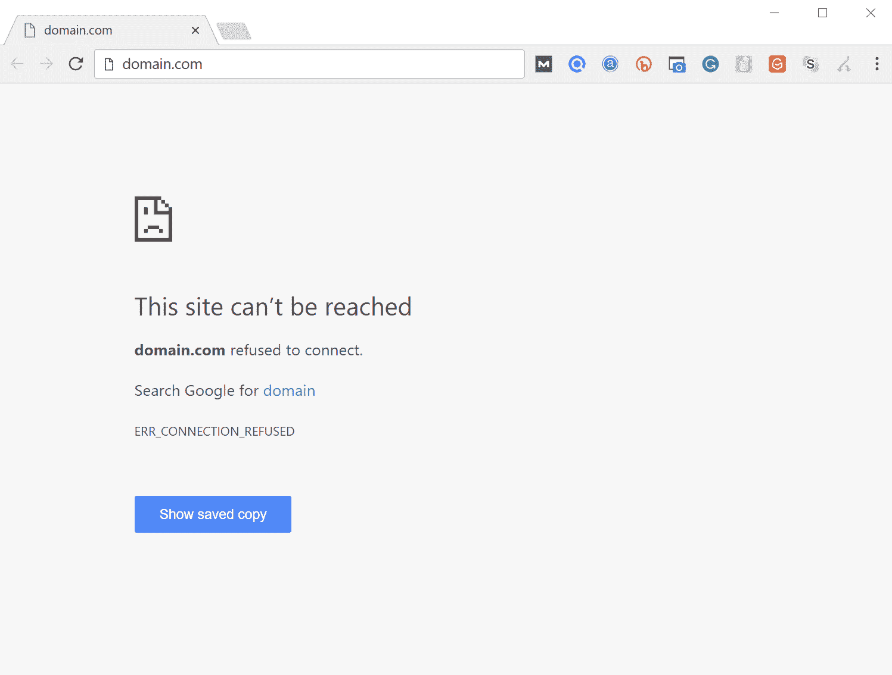

ERR_CONNECTION_REFUSED error in Google Chrome


当您使用 Google Chrome 访问一个网站并遇到此消息时，这意味着您的连接尝试被拒绝。这个错误代码也出现在其他浏览器中，尽管形式不同。

这里也可能出现的类似消息是[DNS _ PROBE _ FINISHED _ NX domain](https://kinsta.com/knowledgebase/dns_probe_finished_nxdomain/)错误，这是一个 [DNS 错误](https://kinsta.com/knowledgebase/dns-server-not-responding/)，表示请求的域名不存在。

### Mozilla Firefox(无法连接错误)

在 Mozilla Firefox 中，它会简单地显示为**无法连接**。

> Firefox 无法与 domain.com 的服务器建立连接。

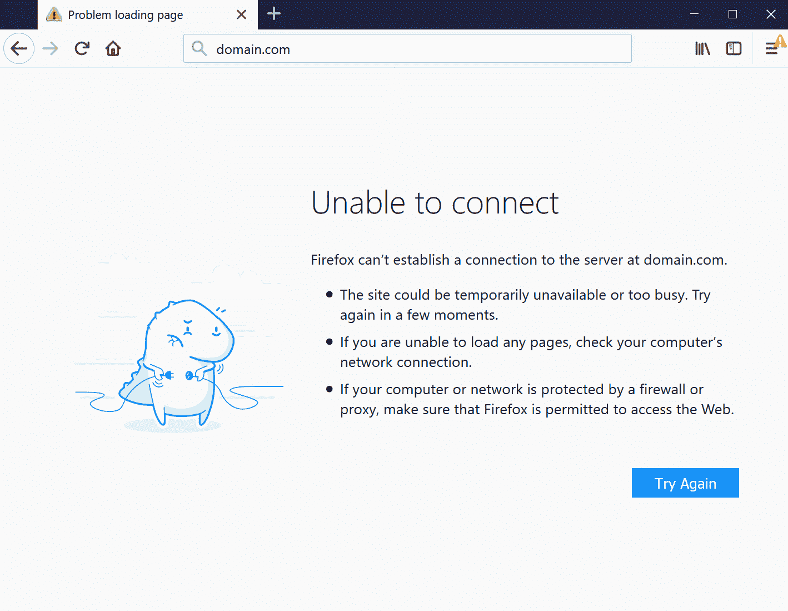

Unable to connect Error in Mozilla Firefox


### Microsoft Edge(Hmmm…无法到达此页面错误)

在微软 Edge 中，会简单的显示为**Hmmm……无法到达此页面**。这不是很有帮助。

> 确保你得到了正确的网址:domain.com。

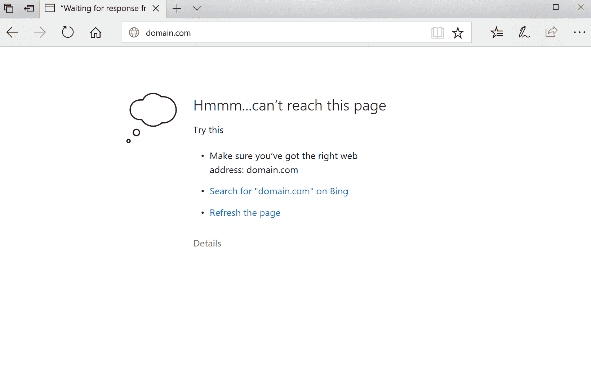

Microsoft Edge Hmmm…can’t reach this page Error


ERR _ CONNECTION _ rejected 错误有时是由服务器端问题引起的，而不是您个人尝试连接的问题。这通常没什么大不了的，可能只是不正确的防火墙或服务器设置的结果。然而，这也可能是更重要的事情已经发生的迹象——例如[恶意软件攻击](https://kinsta.com/blog/types-of-malware/)，或者意外的[停机](https://kinsta.com/blog/website-downtime/)。不可靠的互联网连接也是原因之一。

与大多数错误消息一样，ERR _ CONNECTION _ rejected 让您知道发生了错误，但没有告诉您发生错误的原因。这意味着由您来寻找并解决根本问题(如果可能的话)。

## 如何修复 Chrome 中的 ERR _ CONNECTION _ rejected 错误(9 种可能的解决方案)

尽管潜在原因的范围会使故障排除变得棘手，但是*有可能*修复 ERR _ CONNECTION _ rejected 错误。让我们从最有可能提供答案的步骤开始，来看看你可以采取的九个步骤。

### 1.检查网站的状态

你的第一个目标应该是检查你试图访问的网站的状态。正如我们已经提到的，ERR _ CONNECTION _ rejected 错误有时可能是由网站的服务器引起的，而不是您自己的互联网连接。

检查情况是否如此的一个简单方法是访问另一个网页。如果错误信息再次出现，问题很可能出在您的连接上。但是，如果第二个页面加载正确，那么第一个站点可能有问题。

你也可以对所有人使用 [Down 或者只对我使用](https://downforeveryoneorjustme.com/):


Down for Everyone or Just Me?


输入非功能页面的地址，点击*还是就我？*。然后，该站点将评估该页面是离线(关闭)还是在线(打开)。不幸的是，当一个页面关闭时，你唯一能做的就是等待它被修复。然而，如果页面*已经*打开，但仍然无法加载，那么就该做进一步的故障诊断了。

### 2.重启路由器

作为一种屡试不爽的解决互联网相关问题的方法，你的下一步将是尝试“关机再开机”。重启家庭或办公室路由器并不能保证 100%成功。然而，这个过程只需要几分钟，所以当您处理潜在的连接问题时，值得一试。

## 注册订阅时事通讯


### 想知道我们是怎么让流量增长超过 1000%的吗？

加入 20，000 多名获得我们每周时事通讯和内部消息的人的行列吧！

[Subscribe Now](#newsletter)

为此，请断开路由器的电源。然后，您需要等待大约 30 秒，然后再插上电源。一旦路由器再次启动，尝试访问返回错误的页面。如果装好了，你就可以走了。如果不是，很可能有其他原因在起作用。

### 3.清除浏览器的缓存

像任何优秀的互联网浏览器一样，Chrome 会将信息存储在你电脑或设备的缓存中。这包括您的浏览历史、保存的登录数据和 cookies，所有这些都会被记录下来，以便在下次访问时更快地加载相关页面。

尽管缓存很有用，但当它们过时时会导致许多问题。这是因为页面的缓存版本可能不再匹配当前的实时版本。幸运的是，这个问题很容易通过清空缓存来解决。

但是在你这样做之前，你可以通过首先[以匿名模式](https://support.google.com/chrome/answer/95464?co=GENIE.Platform%3DDesktop&hl=en)打开你的浏览器，很容易地检查是否是浏览器缓存问题。或者您可以尝试不同的浏览器。如果您仍然看到错误，那么您将需要继续清除您的缓存。

为此，首先打开 Chrome 的主菜单(在浏览器窗口的右上角)。从那里，选择*更多工具*:然后你可以点击*清除浏览器数据*。

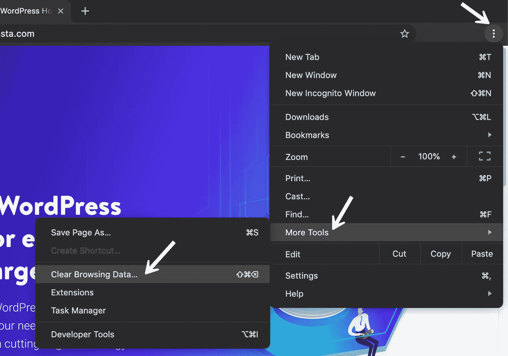

Chrome clear browsing data


在出现的页面上，您需要确保选择了所有列出的文件类别。否则，Chrome 将无法清空整个缓存。相反，它只会删除最近的条目，这不会产生预期的效果:

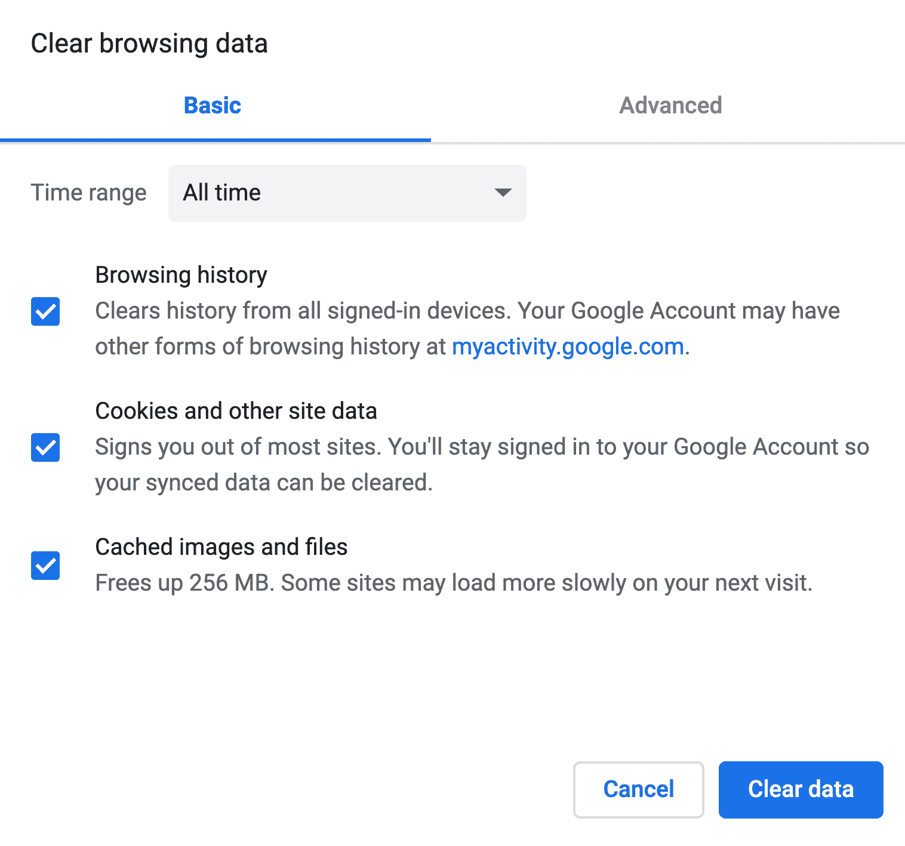

Clear browsing data


完成此过程的另一种方法是在地址栏中输入以下 URL:

```
chrome://settings/clearBrowserData
```

出现的屏幕应该允许您访问我们上面概述的相同选项。以下是一些其他有用的清除缓存的链接。

*   [如何为所有浏览器强制刷新单个页面](https://kinsta.com/knowledgebase/how-to-clear-browser-cache/#single)
*   [如何为谷歌 Chrome 清除浏览器缓存](https://kinsta.com/knowledgebase/how-to-clear-browser-cache/#chrome)
*   [如何清除 Mozilla Firefox 的浏览器缓存](https://kinsta.com/knowledgebase/how-to-clear-browser-cache/#firefox)
*   [如何清除 Safari 浏览器缓存](https://kinsta.com/knowledgebase/how-to-clear-browser-cache/#safari)
*   [如何清除 Internet Explorer 的浏览器缓存](https://kinsta.com/knowledgebase/how-to-clear-browser-cache/#ie)
*   [如何为 Microsoft Edge 清除浏览器缓存](https://kinsta.com/knowledgebase/how-to-clear-browser-cache/#edge)
*   [如何为 Opera 清除浏览器缓存](https://kinsta.com/knowledgebase/how-to-clear-browser-cache/#opera)

### 4.评估您的代理设置，并根据需要进行调整

随着安全威胁不断增加，难怪许多人现在使用单独的解决方案来保护他们的敏感数据。一种流行的方法是使用代理服务器。

代理可以让你在不同的 IP 地址下上网，并作为你的浏览器和你访问的网站之间的中介。除了保护你的 IP 地址私有之外，它还可以帮助过滤缓存数据和服务器通信。

就像缓存一样，代理服务器可能是有用的，但它也可能导致 ERR _ CONNECTION _ rejected 消息。例如，web 服务器可能会拒绝连接到代理服务器的 IP 地址，然后拒绝实际的连接。

也有可能代理处于离线状态，或者配置不正确。简而言之，如果出现了问题中的错误信息，就有必要检查一下您的代理设置。

Chrome 实际上有自己的代理部分，可以使这一步成为一个特别简单的过程。毕竟，您不需要花费任何时间在浏览器中搜索正确的工具。

首先，进入 Chrome 浏览器的*设置*菜单。这将打开完整的选项菜单。在*系统*部分下(你需要点击底部的高级才能看到这个)，你应该会找到一个名为*开放代理设置*的条目。通过选择它，您将进入相应的菜单:


Open Proxy Settings in Chrome


下一步取决于您当前使用的系统。Windows 用户需要点击*局域网设置*，取消*使用局域网代理服务器*选项。如果你是 Mac 用户，你应该会立即在相关菜单中找到你自己。然后，您必须取消选中所有可选的代理协议，并检查 ERR _ CONNECTION _ rejected 消息是否已经解决。


Uncheck proxies on Mac


### 5.暂时禁用防火墙和防病毒软件

防火墙和防病毒软件旨在保护用户及其系统。他们定期扫描您的设备，并自动阻止任何可疑的活动。但是，您可能会注意到这里反复出现的主题，因为(与缓存和代理服务器非常相似)这种类型的高级安全性有时会导致连接问题。

这是因为防火墙经常会阻止他们不需要的页面，或者拒绝完全安全的内容。要检查您是否是这种情况，请尝试禁用防火墙和防病毒程序。当然，只有在你确定你要访问的网站是安全的情况下，才建议这样做。

此外，您应该只是暂时禁用这类软件。在检查完错误是否已经解决之后，重新打开它，这样就不会容易受到攻击。如果您因为防火墙或防病毒软件而反复遇到错误，您可能需要考虑更换您正在使用的软件。


### 6.清除您的 DNS 缓存

作为早期故障诊断步骤的某种扩展，您的下一个任务将是[清除您的 DNS 缓存](https://kinsta.com/knowledgebase/flush-dns/)。尽管大多数人都知道他们的浏览器会创建缓存，但并不是很多人知道他们的操作系统也做同样的事情。

例如，您的 DNS 缓存包含您用浏览器访问过的页面的所有临时条目。这些条目存储与您访问过的网页的域名和地址相关的关键信息。

凭借专业知识和快速反馈，我们的支持团队绝不会让任何错误阻碍您的网站及其访问者。[免费试用 kin sta](https://hubs.ly/H0pklC_0)。

此功能的目的类似于其他类型的缓存。它加快了加载过程，因为它消除了重复联系网站的 DNS 服务器的需要。从长远来看，这会节省你的时间。但是，您可能偶尔会看到一些短期问题。

如果存储的条目不再匹配它所引用的网站的当前版本，像 ERR _ CONNECTION _ rejected 消息这样的技术错误并不罕见。幸运的是，清除您的 DNS 缓存是一个快速简单的解决方案。

同样，如何做到这一点将取决于您的操作系统。

#### Windows 操作系统

按 Windows 键启动开始菜单，然后搜索“CMD”这应该会返回命令提示符。

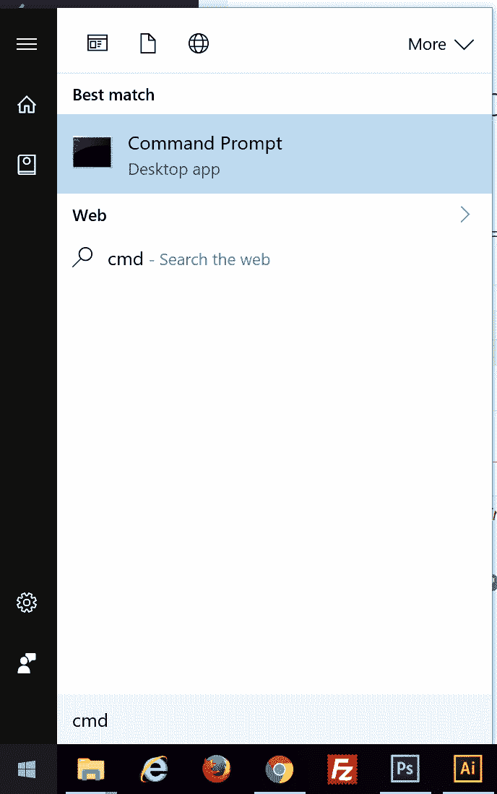

Command Prompt in Windows


在命令提示符下运行以下命令:

```
ipconfig /flushdns
```

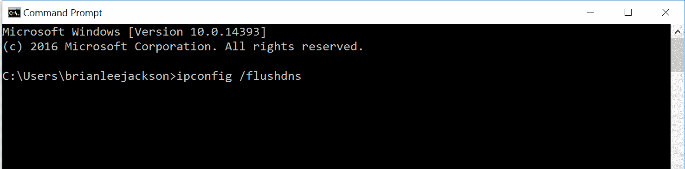

ipconfig /flushdns


然后，您将看到一条确认消息，表明它已成功刷新 DNS 解析器缓存。

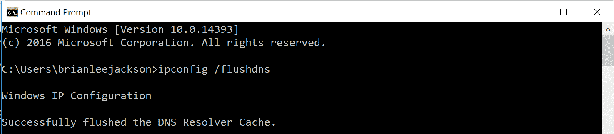

Flushed DNS resolver cache


就本文的目的而言，当你使用 Mac 时，我们将带你经历这个过程——尽管如果你是 Windows 迷的话，你可以在网上找到许多有用的资源。

#### 苹果个人计算机

在 Mac 上，您需要执行以下操作:

点击工具栏中的“转到”，然后点击“实用程序”(Shift-Command-U)

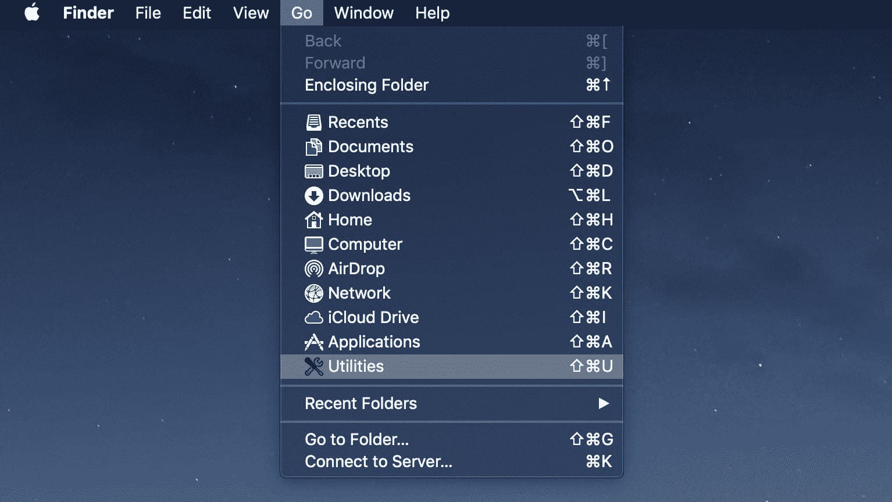

Mac utilities


打开终端。

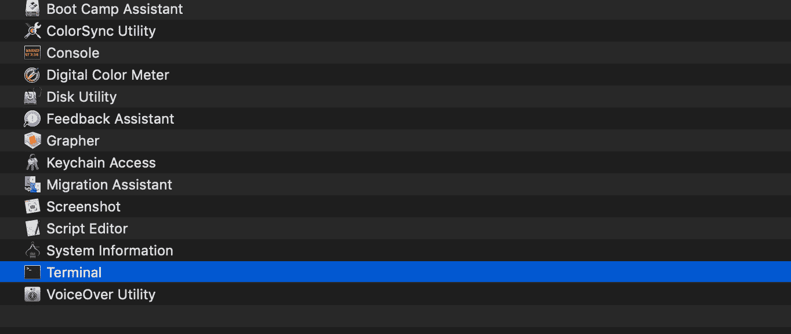

Mac terminal


运行以下命令。为此，您需要管理员权限。

```
sudo killall -HUP mDNSResponder && echo macOS DNS Cache Reset
```

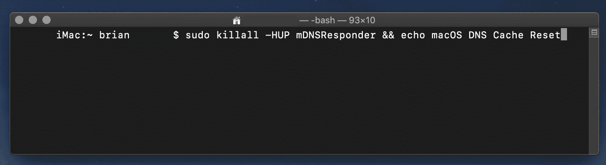

Clear DNS cache Mac


完成后，再次尝试访问问题网站。希望，如果你遵循了我们所有的建议，它现在应该起作用了。如果不是，您的 DNS 可能需要更多的关注。

### 7.更改您的 DNS 地址

正如我们上面讨论的，过时的 DNS 缓存条目是诸如 ERR _ CONNECTION _ rejected 消息等问题的潜在来源。然而，DNS 地址本身也可能是这类问题的原因。这是因为它经常会过载，甚至完全脱机。

在大多数情况下，您的 DNS 服务器地址是自动从您的互联网提供商处获得的。但是，如果需要，您也可以更改它。如何实现这一点将再次取决于您使用的操作系统。

我们来探讨一下 Mac 用户如何完成这个过程。首先，你需要打开*系统偏好设置*。在出现的屏幕上，选择标有*网络*的选项。然后你需要点击*高级*:

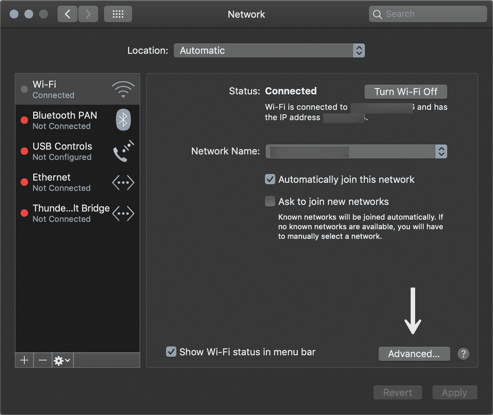

Mac network advanced


从那里，选择屏幕顶部的 *DNS* 选项。要添加新的 DNS 服务器，点击 *+* 按钮。要编辑现有的 DNS 服务器，双击您要调整的 DNS IP 地址:

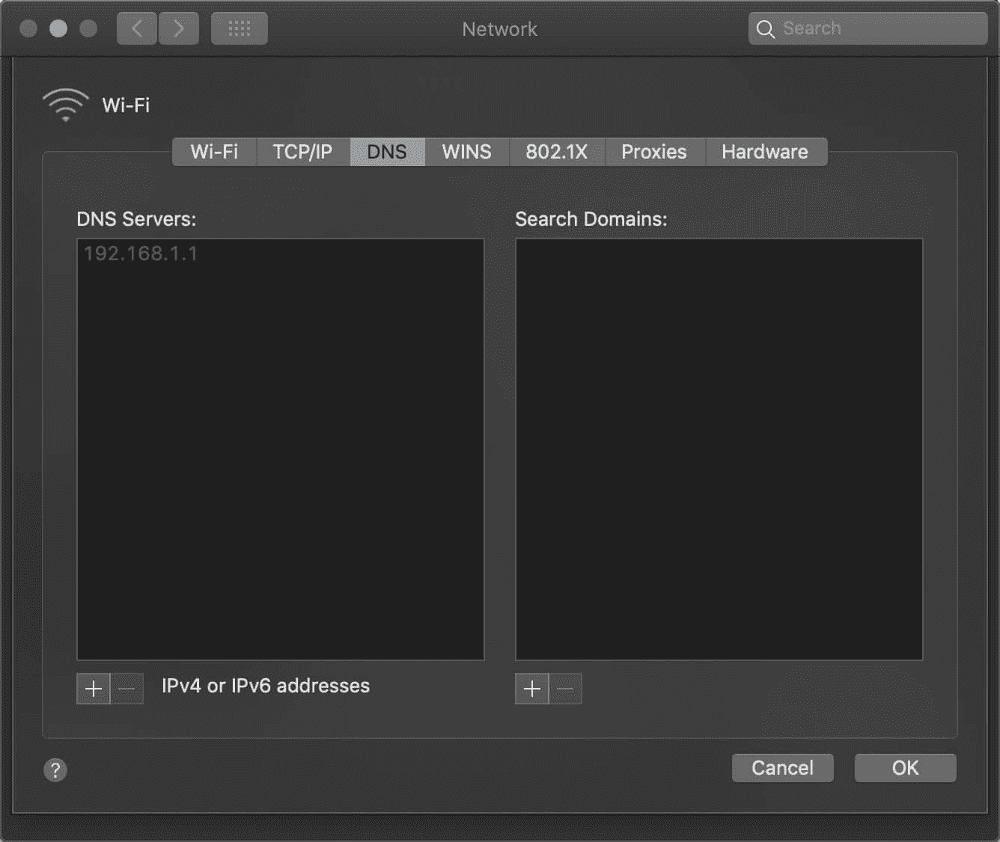

Network DNS


您可以尝试将这些临时更改为公共 DNS 服务器，如 Google 或 Cloudflare。

*   一些人更愿意长期使用谷歌的公共域名系统(8.8.8.8 和 8.8.4.4)，因为它们有时更可靠。
*   [Cloudflare 还为](https://kinsta.com/blog/cloudflare-settings-wordpress/#kinsta-dns-vs-cloudflare-dns)提供了安全且极速的免费 DNS(【1.1.1.1】T2 和 1.0.0.1)。

提示:如果你已经在使用一个免费的 DNS 服务器并遇到问题，移除它并默认回到你的 ISP 的 DNS 服务器有时也能解决问题。Google 和 Cloudflare 并不是 100%的时候都是完美的，我们已经注意到切换回来解决了这个问题。

然后你可以再次尝试访问该网站——祈祷好运吧。

### 8.禁用任何 Chrome 扩展

不可否认，安装扩展通常有助于更全面的谷歌 Chrome 体验。提供的许多扩展可以添加关键特性，甚至有助于自动化复杂的过程。

然而，谷歌 Chrome 的大量扩展并不是由浏览器开发者开发的。相反，它们通常是由第三方创建的。这可能意味着无法真正保证它们会如您所愿地工作，或者它们会随着时间的推移而正确更新。

不正确或过时的扩展可能会导致许多问题，包括 ERR _ CONNECTION _ rejected 错误消息。因此，定期审核附加到浏览器的扩展非常重要。

为此，首先在你的 Chrome 浏览器中打开*扩展*菜单。然后，您可以开始依次评估您安装的每个扩展。从质疑你是否真的需要每一个开始。如果不再需要扩展，您可以简单地删除它。

接下来，找出您想要保留的每个扩展名上次更新的时间。理想情况下，它应该在最近三个月内更新。任何比这更长的时间都可能是扩展被开发人员忽略的迹象。如果可能的话，你会想要[删除那些扩展](https://kinsta.com/knowledgebase/how-to-remove-chrome-extensions/#how-to-temporarily-disable-chrome-extensions)并用更新的替换来替换它们。

当然，新的(和完全更新的)扩展有时仍然会引起问题。如果您怀疑是这种情况，请从禁用所有附加的扩展开始。如果你尝试访问的网站在这之后加载了，你会知道至少有一个是错误的。然后，您可以一次重新激活一个扩展，直到您找到有问题的软件。

### 9.重装 Chrome 浏览器

和其他应用一样，Chrome 本身也不可能完全没有错误。您的浏览器安装可能包含各种问题，特别是如果它有一段时间没有更新。更重要的是，你的浏览器和操作系统之间的问题出奇的普遍。

因此，有时候唯一的解决办法就是彻底重装 Chrome。您可以通过从设备中删除当前安装来实现这一点。然后你可以通过访问[官方 Chrome 网站](https://www.google.com/chrome/)下载最新版本的浏览器。

## 如果这些解决方案都不起作用，该怎么办

如果我们向您介绍的解决方案都没有修复 ERR _ CONNECTION _ rejected 消息，这通常表明服务器端(换句话说，网站本身)出现了更严重的问题。

不幸的是，在这种情况下，你唯一能做的就是耐心等待。很可能网站的所有者正在努力解决任何问题，不久之后网站将恢复正常运营。

凭借专业知识和快速反馈，我们的支持团队绝不会让任何错误阻碍您的网站及其访问者。[免费试用 kin sta](https://hubs.ly/H0pklC_0)。

如果访问网站是一件紧急的事情，你可以尝试直接联系它的所有者。有很多方法可以做到这一点，尽管社交媒体和电子邮件特别有效，而且不太可能受到任何网站宕机的影响。

解释你面临的问题，并提及你已经尝试了几种解决方案，但都无效。希望网站背后的团队能给你回复，讨论最佳的行动方案。如果你碰巧让他们意识到一个他们不知道的阻止访问他们网站的问题，你甚至可以帮他们一个忙。

如果你是 Kinsta 的客户，并且是你自己的 WordPress 站点有问题，请随时联系我们的支持团队。我们是来全天候提供帮助的。
[浏览器错误从来都不是好玩的。😩这里有一些关于如何修复顽固的 ERR _ CONNECTION _ rejected 错误的提示。 点击推文](https://twitter.com/intent/tweet?url=https%3A%2F%2Fkinsta.com%2Fblog%2Ferr_connection_refused%2F&via=kinsta&text=Browser+errors+are+never+fun.+%F0%9F%98%A9+Here+are+a+few+tips+on+how+to+fix+the+stubborn+ERR_CONNECTION_REFUSED+error.&hashtags=chrome%2Cwebsite)

## 摘要

尽管连接错误令人沮丧不已，但重要的是要记住它们通常是可以修复的。你的第一个目标应该是检查问题是否出在网页本身。另一方面，如果问题出在你自己的连接上，你需要做一点工作来恢复正常运行。

要尝试解决 ERR _ CONNECTION _ rejected 消息，您可以:

1.  检查页面本身是否已关闭。
2.  重启路由器。
3.  清除浏览器的缓存。
4.  评估您的代理设置，并根据需要进行调整。
5.  暂时禁用防病毒和防火墙软件。
6.  刷新您的 DNS 缓存。
7.  更改您的 DNS 地址。
8.  禁用任何过时的 Chrome 扩展。
9.  重新安装你的 Chrome 浏览器。

对于这个错误消息，您还有什么问题吗，或者有没有其他常见的问题需要我们探讨？请在下面的评论区告诉我们！

* * *

让你所有的[应用程序](https://kinsta.com/application-hosting/)、[数据库](https://kinsta.com/database-hosting/)和 [WordPress 网站](https://kinsta.com/wordpress-hosting/)在线并在一个屋檐下。我们功能丰富的高性能云平台包括:

*   在 MyKinsta 仪表盘中轻松设置和管理
*   24/7 专家支持
*   最好的谷歌云平台硬件和网络，由 Kubernetes 提供最大的可扩展性
*   面向速度和安全性的企业级 Cloudflare 集成
*   全球受众覆盖全球多达 35 个数据中心和 275 多个 pop

在第一个月使用托管的[应用程序或托管](https://kinsta.com/application-hosting/)的[数据库，您可以享受 20 美元的优惠，亲自测试一下。探索我们的](https://kinsta.com/database-hosting/)[计划](https://kinsta.com/plans/)或[与销售人员交谈](https://kinsta.com/contact-us/)以找到最适合您的方式。