# Shareaholic Review:一套吸引观众的 WordPress 工具

> 原文：<https://kinsta.com/blog/shareaholic-review/>

作为一个 WordPress 网站的所有者，你可能总是在寻找新的机会来吸引你的读者。

Shareaholic 是一个流行的 WordPress 插件/服务，附带一套工具来帮助你做到这一点，甚至可能在这个过程中赚点外快。

虽然 Shareaholic 确实让你可以在一个简洁的包中访问大量的功能，但它也使用模块化的方法来确保你不会因为你不想要的功能而使你的网站陷入困境。也就是说，它允许您根据自己的喜好打开或关闭特定的功能。

在本帖中，我们将深入了解 Shareaholic。我们将从讨论 Shareaholic 的所有特性开始。然后，我们将亲自动手，向你展示在一个实时的 WordPress 站点上，一切是如何组合在一起的。

## 分享爱好者的特点:不仅仅是社交分享

当你看到“Shareaholic”这个名字时，你的大脑很可能会直接进入社交媒体分享按钮。

是的——Shareaholic 当然会进行社交分享……

您可以添加浮动和内容共享按钮，以及单个图像上的共享按钮和社交关注按钮的几个选项。每个位置都有自己的详细设置，可以打开分享计数，选择特定的社交网络，等等。


> 需要在这里大声喊出来。Kinsta 太神奇了，我用它做我的个人网站。支持是迅速和杰出的，他们的服务器是 WordPress 最快的。
> 
> <footer class="wp-block-kinsta-client-quote__footer">
> 
> 
> 
> <cite class="wp-block-kinsta-client-quote__cite">Phillip Stemann</cite></footer>

[View plans](https://kinsta.com/plans/)

然而，还有很多比社交分享更多的东西，这也是 Shareaholic 区别于所有其他 [WordPress 社交分享插件](https://kinsta.com/blog/wordpress-social-media-plugins/)的原因之一。

您还可以获得:

*   **相关内容**–在您的网站上显示相关内容建议。这里的好处是所有的处理都发生在 Shareaholic 的服务器上，这提供了一个更好的性能方法，因为你不会有一堆数据库查询在你自己的站点上运行。
*   **分析**-通过与[谷歌分析](https://kinsta.com/blog/google-analytics-wordpress/)的 UTM 和事件跟踪集成，了解您的内容在社交媒体上的表现。你也可以在你的 WordPress 仪表盘中查看这些数据。
*   **发布分享提示**–在用户分享您的内容后显示消息。您可以显示自己的信息，并添加社交关注按钮或横幅广告。
*   **货币化**–Shareaholic 提供了许多货币化选项，包括自动插入附属链接、向您的相关内容添加横幅广告，以及推广赞助内容推荐(*以及您自己网站的相关内容*)。**这些功能完全是可选的**。
*   **链接缩短**–直接在您的仪表盘上创建缩短的链接(如“shrlc.com/PnVrDPN”)。这些链接会自动跟踪点击，您也可以在仪表板中查看点击数据。

让我们更深入地了解一下所有的特性以及它们是如何工作的！

[Shareaholic 不仅仅是一个社交分享插件，它还提供了一整套吸引观众的 WordPress 工具。🤳 点击推文](https://twitter.com/intent/tweet?url=https%3A%2F%2Fkinsta.com%2Fblog%2Fshareaholic-review%2F&via=kinsta&text=Shareaholic+is+more+than+just+a+social+sharing+plugin%2C+it+offers+an+entire+suite+of+audience-engaging+WordPress+tools.+%F0%9F%A4%B3&hashtags=smm%2CWordPress)


## 安装 Shareaholic 插件

Shareaholic 有一个混合的设置过程，只要你激活插件，许多功能都可用，但是如果你创建一个 Shareaholic 帐户并将其连接到你的网站，你也可以访问更多的功能。

需要注意的是，你不是被迫创建一个账户来使用 Shareaholic 的大部分功能。然而，创建一个帐户确实能让你获得更多的功能，所以我们在这篇文章中将我们的示例站点连接到我们的 Shareaholic 帐户。

一旦你安装并激活了来自 WordPress.org 的[免费插件，你就可以进入你的 WordPress 仪表盘中新的**分享爱好者**区域，点击**分享爱好者仪表盘**按钮来创建一个免费的分享爱好者账户，并与你的网站同步:](https://wordpress.org/plugins/shareaholic/)

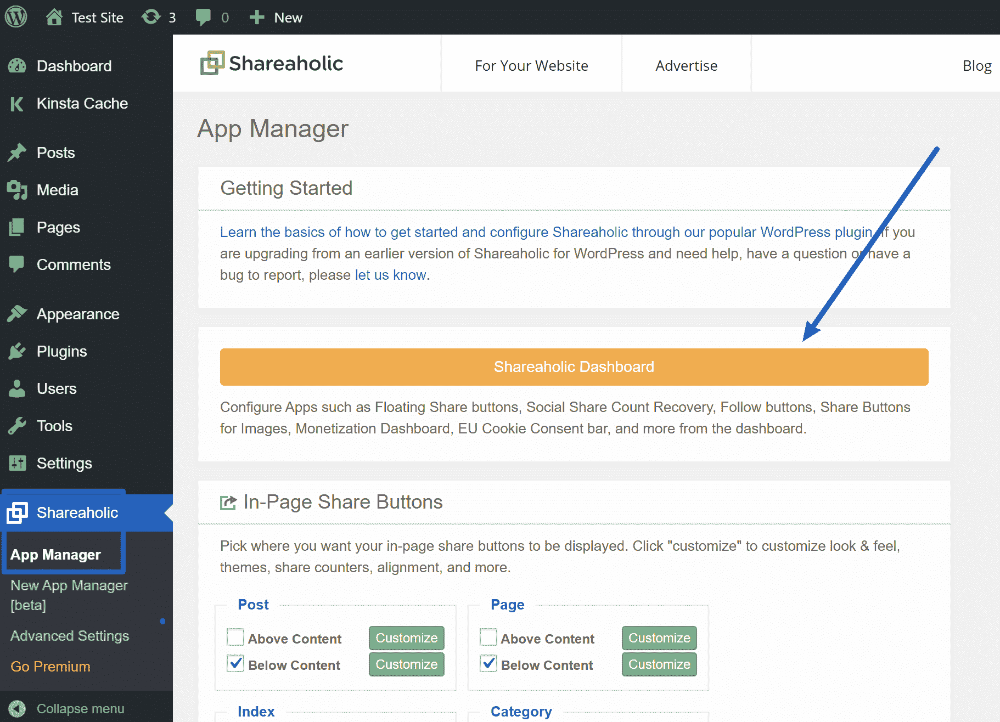

How to create a Shareaholic account


在那里，您可以使用以下任一方式管理站点的功能:

*   你的 WordPress 仪表盘中的**新应用管理器**选项(*当我们写这篇文章的时候，这个功能在技术上还处于测试阶段*
*   Shareaholic 云仪表板

无论哪种方式，界面都非常相似:

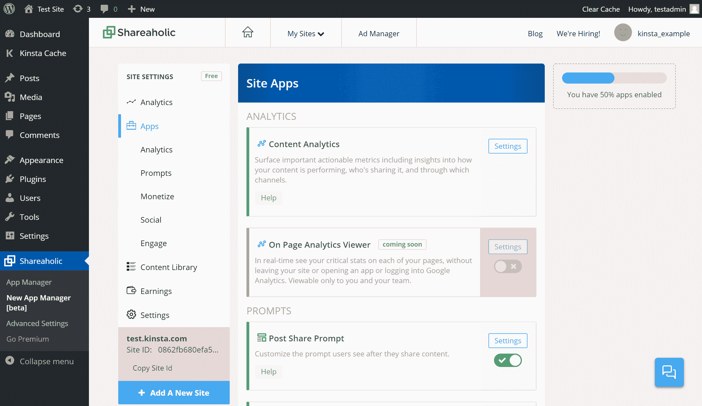

The Shareaholic dashboard


每个功能都是一个“应用程序”，您可以根据需要启用或禁用。这让您保持轻量级，因为您只能使用您想要的确切功能。

让我们来看看这些功能…

### 社交媒体分享按钮

激活插件后，Shareaholic 会自动在两个不同的位置添加社交媒体分享按钮:

*   浮动侧边栏
*   在您的帖子内容之后

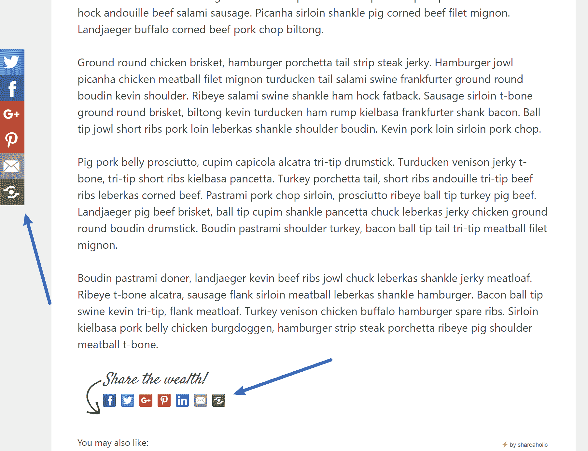

Example of social share buttons


除了这些默认设置，你还可以给单个图片添加分享按钮(比如在图片上添加 Pinterest 的“锁定”按钮)，以及社交媒体关注按钮。

要控制和配置所有这些功能，你可以去**应用管理器**的**社交**区域:

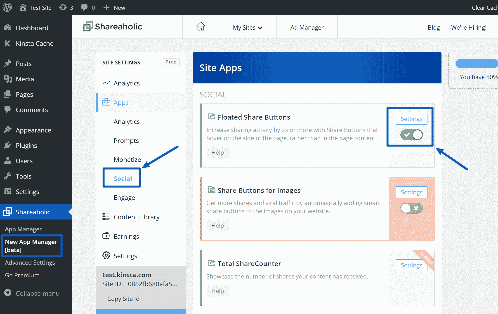

How to access the Social apps


在那里，您可以使用开关来打开或关闭各个功能，并使用**设置**按钮来配置每个位置的特定选项。

例如，如果您打开**浮动共享按钮**的设置，它将打开一个详细的弹出窗口，您可以在其中控制各种选项:

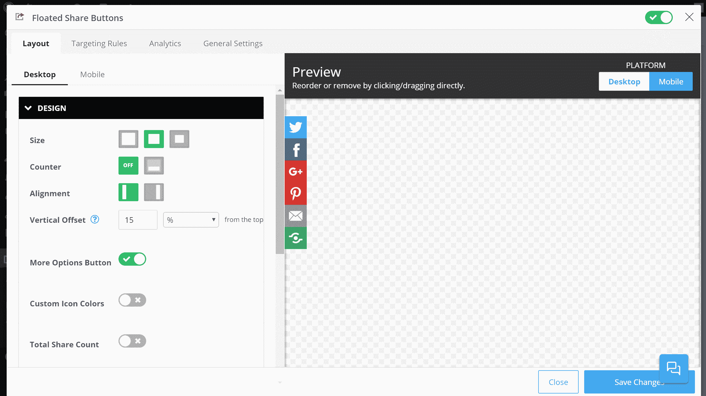

Floating share button settings


您可以做的一些事情包括:

*   更改按钮大小
*   添加单个或总份额计数
*   选择要包含的社交媒体网络
*   添加延迟以等待触发您的共享按钮
*   控制移动设计
*   添加页面定位规则以控制哪些内容具有共享按钮
*   添加谷歌分析 UTM 标签跟踪
*   自定义 Twitter 共享消息

例如，如果您正在编辑移动共享按钮，您可以选择将它们放在访问者屏幕的底部，以获得更好的用户体验:

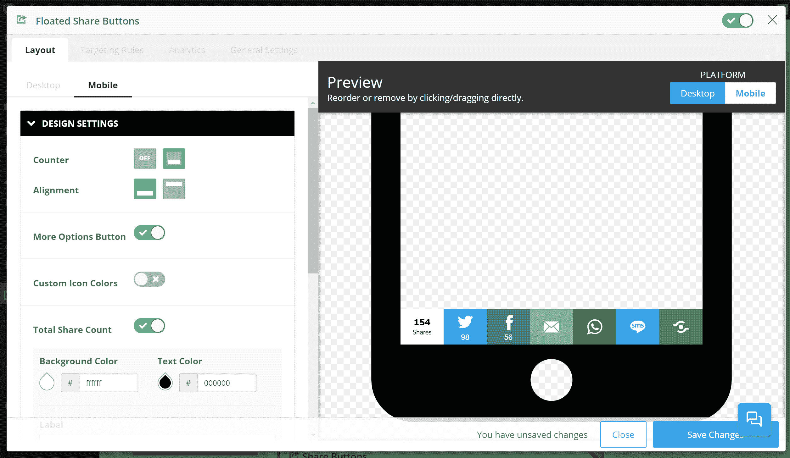

How to change the mobile design


你甚至可以让 Shareaholic 根据哪些按钮最适合特定页面来动态排序按钮。

除了浮动的分享按钮设置，Shareaholic 的其他社交应用也有类似的细节水平。

例如，以下是显示在帖子底部的自定义共享按钮的外观:

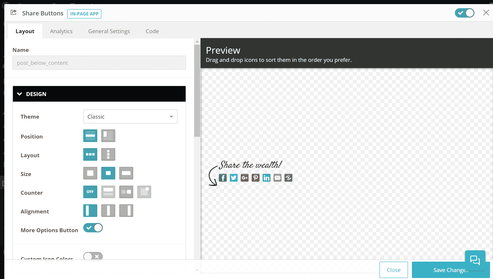

您还可以自定义内容内分享按钮


### 相关内容

接下来，我们来看看 Shareaholic 中的相关内容建议。一旦你激活 Shareaholic，它就会自动在你的博客文章下面显示相关内容。

下面是我们的测试网站上的一个例子:

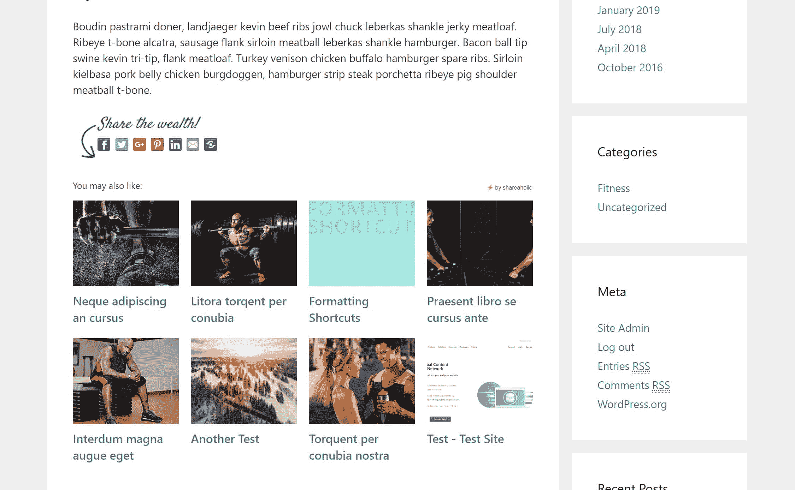

Example of Shareaholic’s related content suggestions


同样，这些相关内容建议的好处是处理发生在 Shareaholic 的服务器上，而不是你的 WordPress 站点的服务器上。一些相关的帖子插件可能会占用大量的数据库，所以这种离站方式可以减轻服务器的负担。

要配置您的相关内容，您可以转到 **Engage** 选项卡。在这里，您可以自定义或禁用每个单独的显示位置，甚至可以添加新的显示位置:

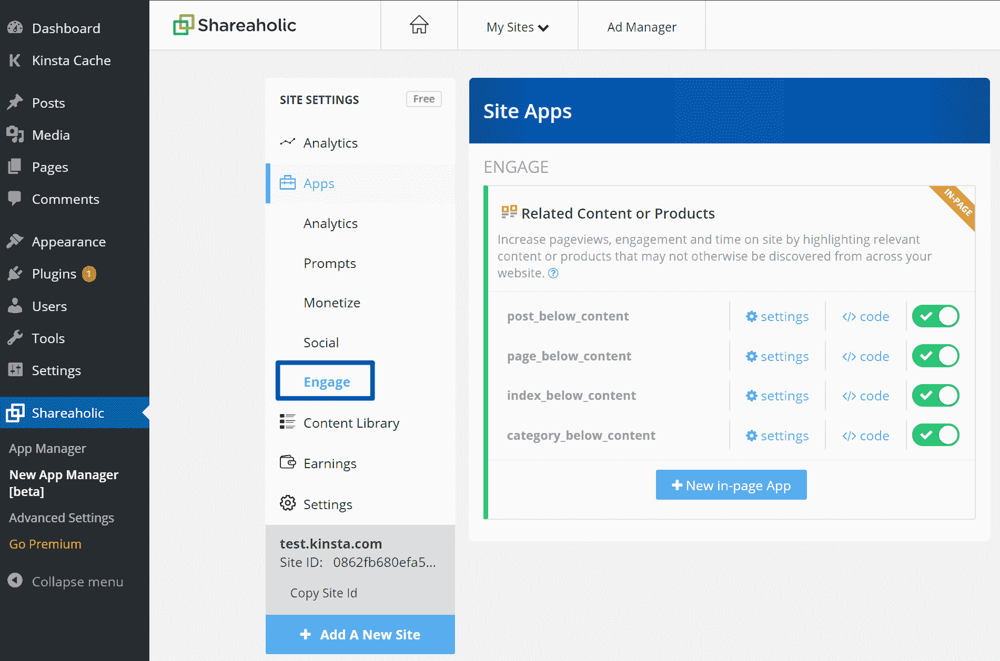

The Engage apps


如果你打开一个单独的显示位置的设置，你会得到另一个弹出窗口，在那里你可以控制大量的信息。

首先，你可以从 **14 个不同的主题**中选择，以及显示多少帖子。

例如，如果您选择**门户**主题，您将得到这个整洁的圆形外观:

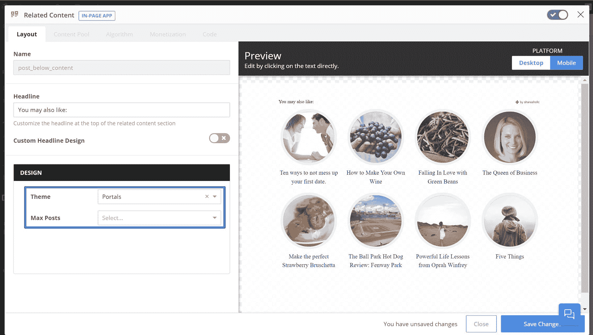

How to change the related content theme


在**内容池**选项卡中，您可以配置哪些帖子有资格显示为相关内容。

例如，如果您的网站上有一个“新闻”类别，该类别只发布时间敏感的内容，您可能希望排除该类别，因为这些帖子与将来访问的人无关:

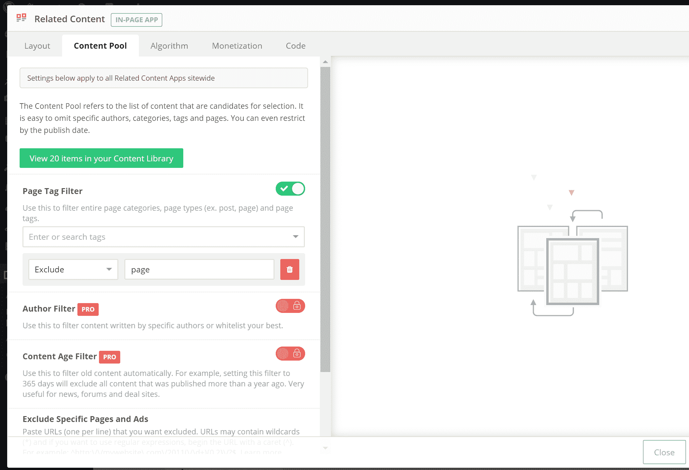

How to choose what content can be included


如果你有 Shareaholic Pro，你也可以根据作者或文章的时间来过滤，这给了你更多的排除内容的灵活性。

**算法**标签可以让你调整 Shareaholic 如何显示相关帖子。例如，您可以选择给一个内容添加多少权重(*(如果有的话)*):

*   标题
*   标签或类别
*   作者( *Pro* )
*   语言( *Pro* )

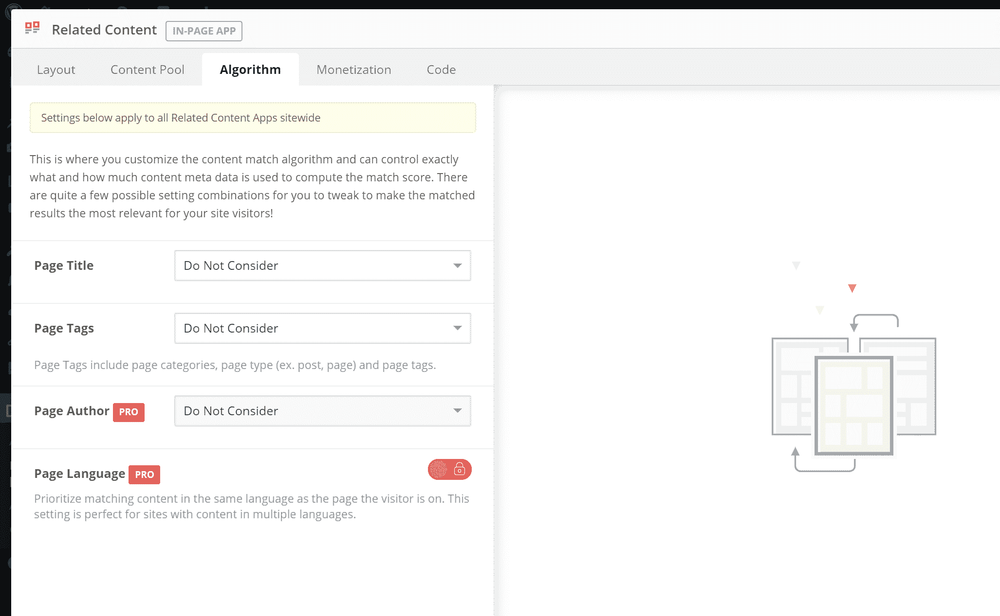

How to change the related content algorithm


最后，**货币化**标签让你选择是否在建议中加入赞助内容广告。也就是说，如果你启用了这个功能，Shareaholic 将显示*站外*的内容建议，你可以从中赚取一些钱。

除了启用此功能，您还可以选择要包括多少赞助内容建议。例如，你可以在你自己的内容和赞助内容之间做一个 50/50 的比例。或者，你可以在两个方向上权衡事物:

## 注册订阅时事通讯


### 想知道我们是怎么让流量增长超过 1000%的吗？

加入 20，000 多名获得我们每周时事通讯和内部消息的人的行列吧！

[Subscribe Now](#newsletter)

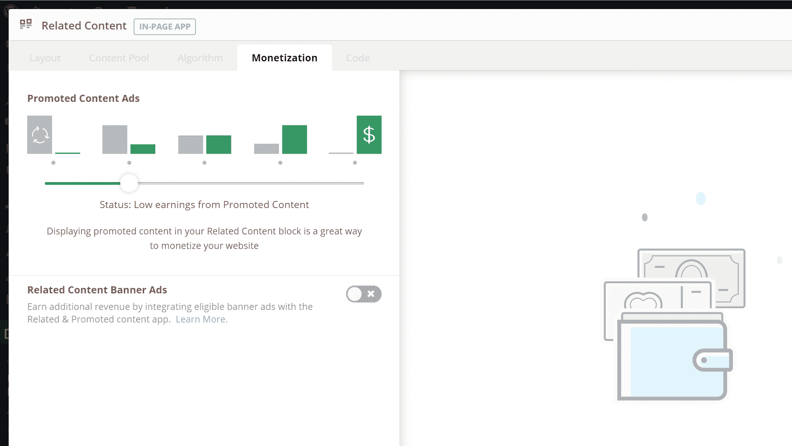

如何插入赞助内容


### 分析学

Shareaholic 包括一个单独的**分析**应用区域。然而，这些选项与您编辑社交分享按钮时配置的相同分析选项相关联，因此您不一定需要在应用程序中配置任何内容。

**注意–您的分析设置在您所有的社交媒体分享按钮位置上分享**。

一旦你得到一些数据，你可以在你的 WordPress 仪表盘的主**分析**标签中查看。这些数据需要 24-48 小时来填充，这就是为什么我们的控制面板现在看起来有点空:

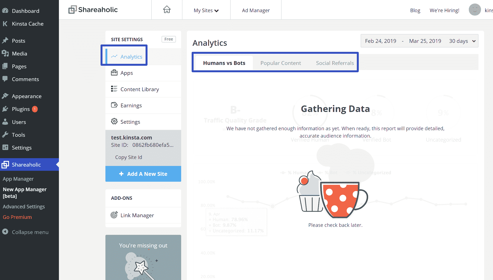

The analytics area


### 股票发行后通知

每当有人在你的网站上分享内容时，Shareaholic 会以弹出窗口的形式显示分享后通知。下面是一个默认情况下的示例:

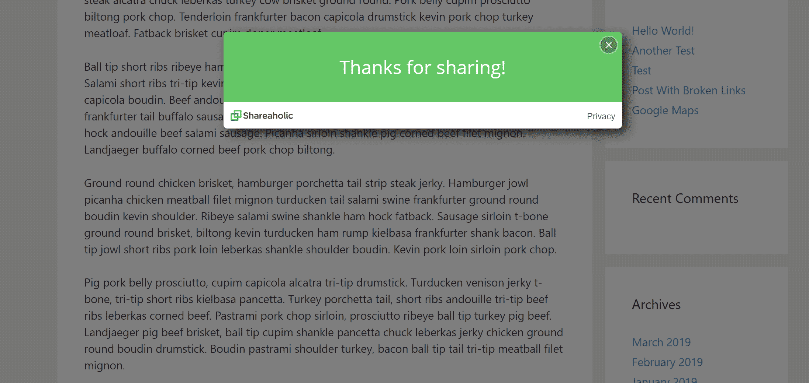

Example of the after-share notice


Shareaholic 为您提供了一些不同的方式来定制这个通知(或者，您也可以禁用它)。

第一，如果编辑**帖子分享提示** app，可以自定义文字。使用 Pro plan，您还可以自定义颜色:

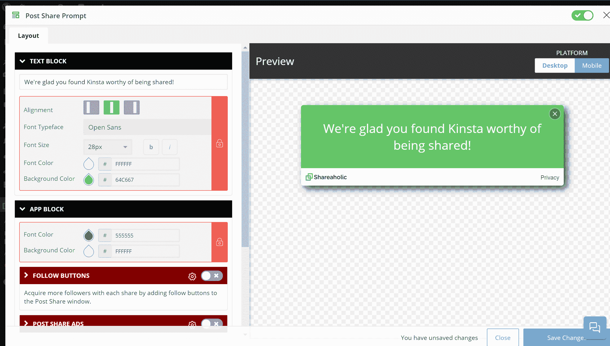

How to customize the after-share notice


除了简单地显示文本，Shareaholic 还提供了另外两个选项。您可以插入:

*   社交关注按钮–这是增加你的关注者数量的好方法，因为你在已经知道你的访客参与的时候显示关注按钮。
*   横幅广告–如果你想获得额外收入，你也可以加入横幅广告。

例如，以下是社交关注按钮的外观。您还可以获得大量选项来更改布局以及包括哪些网络:

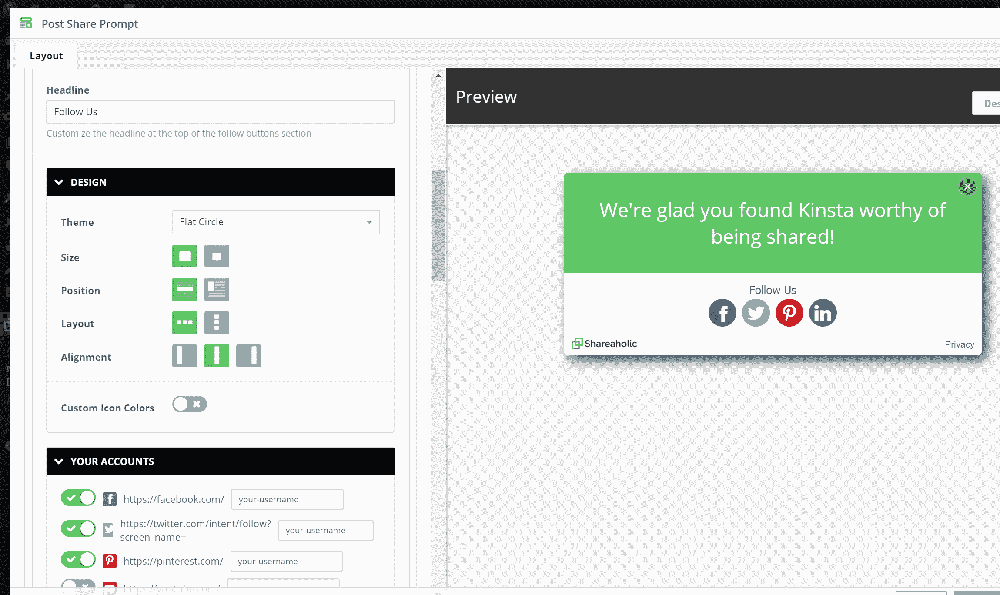

How to add follow buttons to the after-share notice


### 其他货币化选择

我们已经以下列形式向您展示了 Shareaholic 的两种货币化方案:

1.  相关建议中的赞助内容(*或相关内容中的横幅广告*
2.  分享后通知上的横幅广告

然而，Shareaholic 还在**货币化**应用部分提供了几个其他选项:

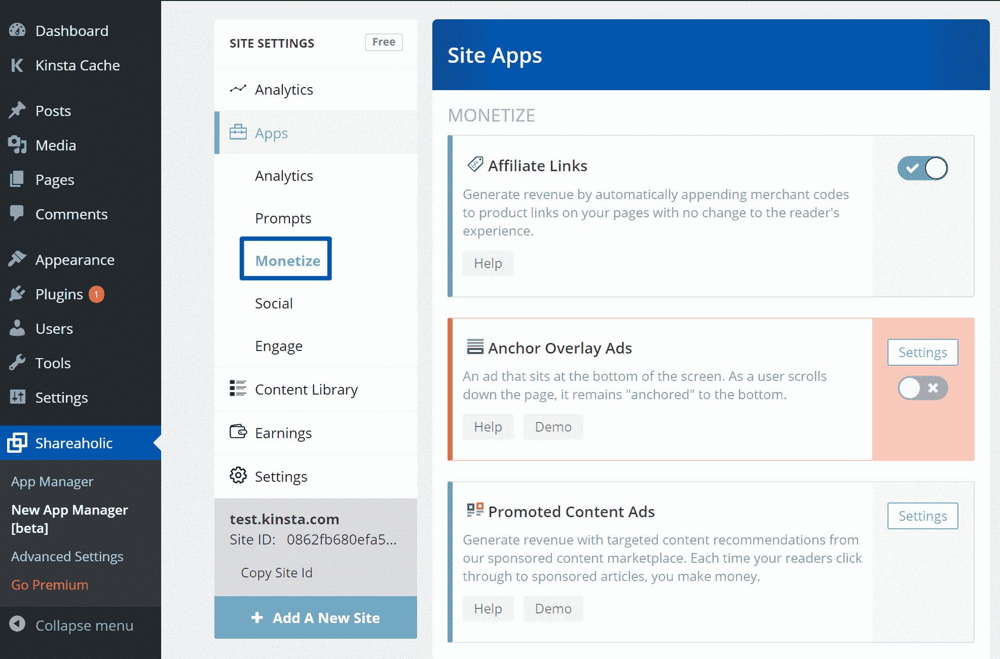

The Shareaholic Monetize apps


首先，**联盟链接**应用让你自动添加联盟代码到**现有链接**到[通过联盟营销](https://kinsta.com/affiliate-academy/affiliate-marketing-business/)赚钱。例如，如果你已经有了一个易贝的链接，Shareaholic 可以自动将会员代码添加到该链接中，这样你就可以从销售中获得分成。这是一个在不影响用户体验的情况下赚点小钱的好方法。

其次， **Anchor Overlay Ads** 应用程序可以让你在访问者的屏幕底部添加粘性广告。您可以选择是否向桌面访问者、移动访问者或两者都显示。

Struggling with downtime and WordPress problems? Kinsta is the hosting solution designed to save you time! [Check out our features](https://kinsta.com/features/)

同样，所有这些货币化应用都是可选的。Shareaholic 不会强迫你在你的网站上插入广告，它只是给你这个能力。

如果您启用了任何货币化功能，您将能够在**收入**选项卡中看到您的收入和付款:

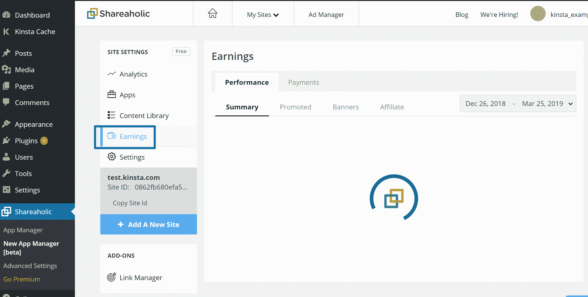

Shareaholic Earnings area


### Cookie 同意通知

如果你想在你的网站上添加一个 cookie 同意通知，以符合[欧盟 GDPR](https://kinsta.com/blog/wordpress-gdpr-compliance/) 和 cookie 同意法，Shareaholic 的 **Cookie 同意提示**让这变得很容易。

下面是一个默认情况下的示例:

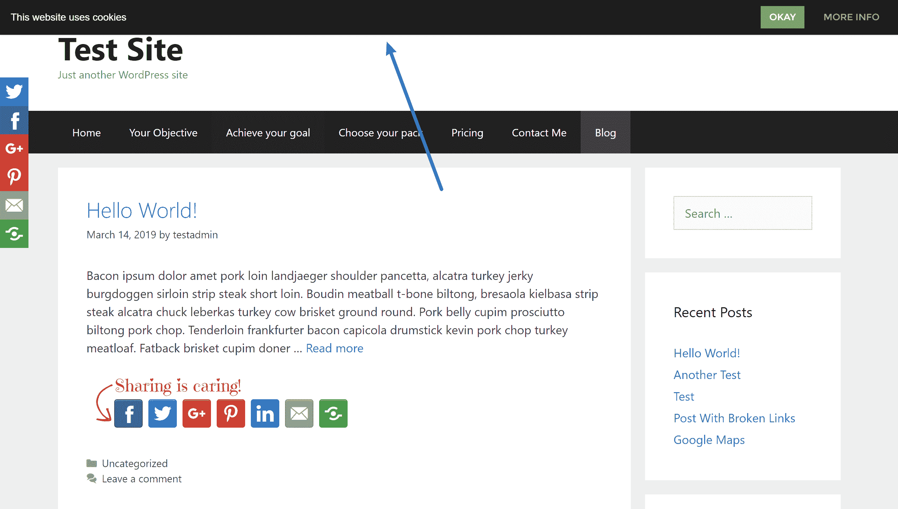

An example of the Shareaholic cookie consent notice


如果您编辑该应用程序的设置，您将能够:

*   更改其位置(例如顶部或底部)
*   自定义文本
*   向您的隐私政策添加链接

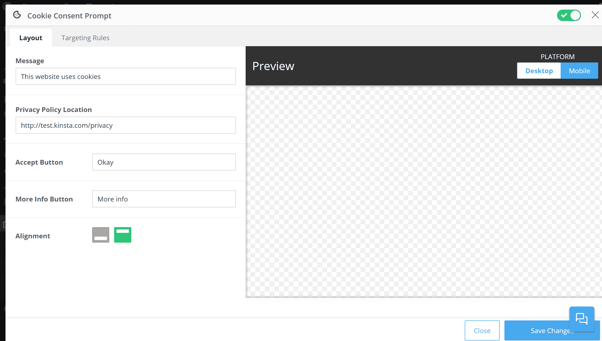

How to customize the cookie consent notice


除此之外，**定位规则**选项卡允许您使用地理定位来控制谁可以看到您的 cookie 同意通知。例如，您可以选择只向来自欧盟的访问者展示它。

### 链路缩短

最后，Shareaholic 的**链接管理器**插件可以让你直接从你的 WordPress 仪表盘上创建缩短的链接，并有很多选项可以为这些链接添加分析。

在**链接管理器**插件的**设置**选项卡中，您可以:

*   添加跟踪像素
*   控制如何跟踪机器人
*   选择要使用的 URL 缩短服务。默认情况下，它使用 Shareaholic 自己的**shrlc.com**域名，但你也可以使用 bit.ly 和其他服务

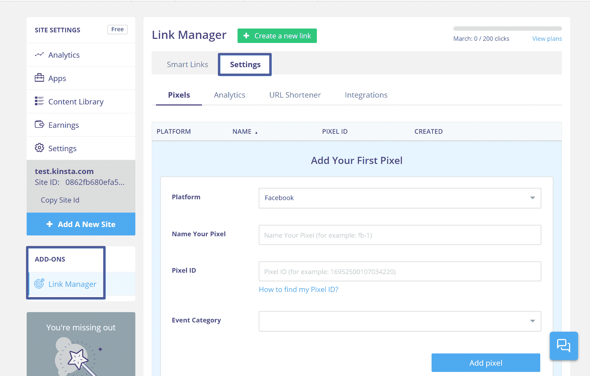

The Shareaholic link shortening options


然后，创建一个新的链接就像粘贴你想要链接的 URL 并选择要使用的跟踪选项一样简单。

一旦你有了一些活动，你就可以查看每个链接的点击分析:

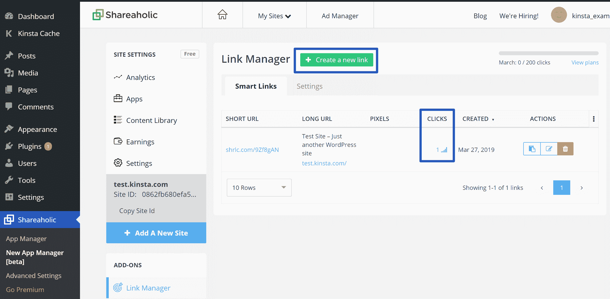

The link tracking analytics


## 性能呢？

我们知道你们中的一些人可能想知道 Shareaholic 插件的性能，所以我们自己做了一些测试。注意:你应该总是在你自己的 WordPress 站点上测试。

第一件事是，如果你已经在使用一个插件，它会吐出**打开的图形标签**，比如 Yoast SEO，你可能想在“高级设置”下禁用这个功能否则，您将得到重复的标签。这不会造成任何伤害，但这是对代码的浪费，只会增加页面的总大小。

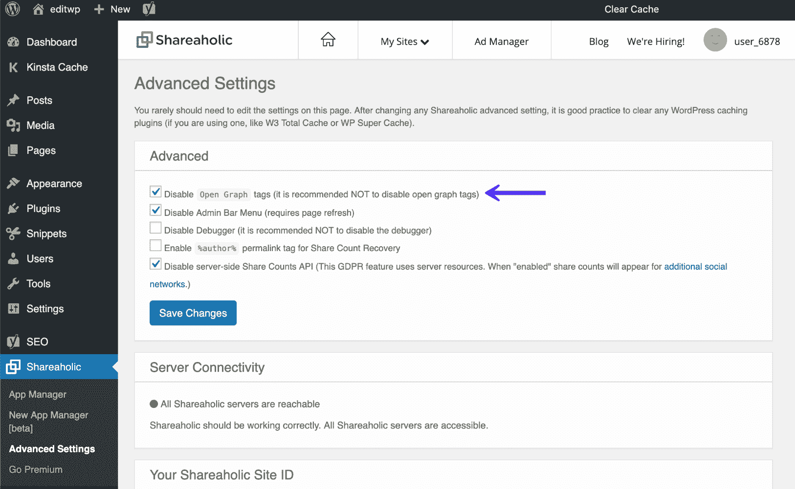

Shareaholic disable open graph tags


### 如果没有启用共享插件

我们首先在没有启用 Shareaholic 插件的情况下运行了一个速度测试。

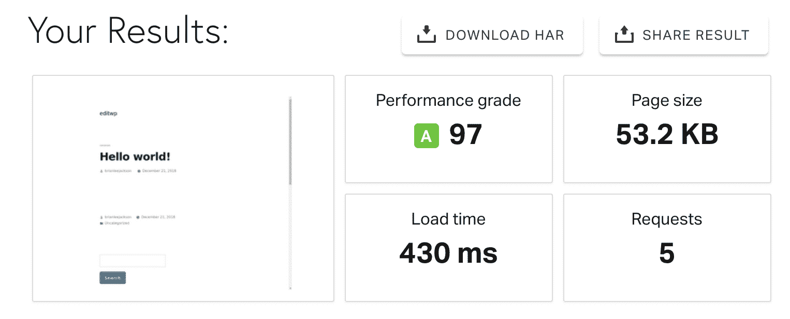

[Speed test](https://tools.pingdom.com/#5a87e2ff48000000) without Shareaholic plugin


### 启用 Shareaholic 插件

然后，我们运行了一个速度测试，启用了 Shareaholic 插件并配置了社交媒体共享按钮。正如你在下面看到的，这个插件增加了 20 多个请求和将近 400 KB 的总页面大小。

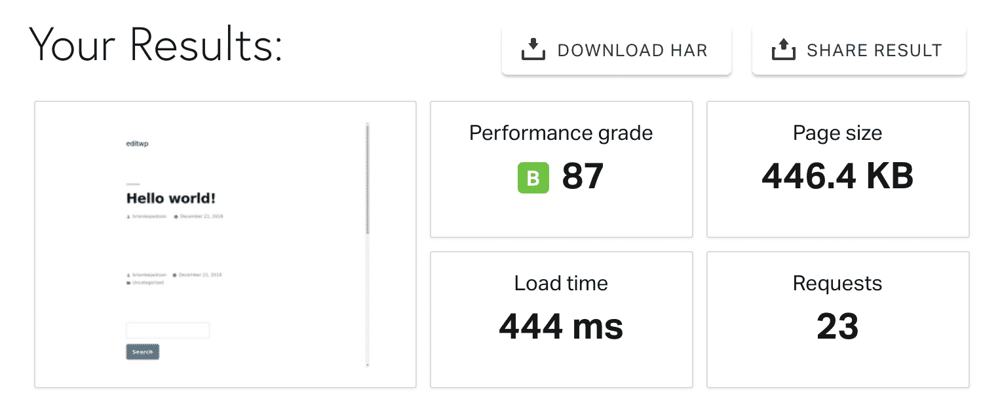

[Speed test](https://tools.pingdom.com/#5a87dec216c00000) with Shareaholic plugin


你可以看到它实际上并没有给 WordPress 站点增加太多的加载时间，尽管它确实增加了很多请求。以下是几个原因:

*   100%的 Shareaholic JavaScript 和相关文件都托管在亚马逊的全球 CDN(内容交付网络)上。这意味着它们应该加载得相当快。
*   脚本被异步预加载和加载(在页面加载之后)，并指定缓存策略。
*   考虑到 [HTTP/2](https://kinsta.com/learn/what-is-http2/) 进行了优化。
*   如果你看看源代码，他们还添加了`dns-prefetch`标签。因此，Shareaholic 开发团队中的一些人正在考虑他们在性能方面应该做些什么。

```


```

*   Shareaholic 的另一个优势是它支持全球超过 300，000 个网站。这意味着如果你已经使用 Shareaholic 访问了一个网站，你的浏览器很可能已经在缓存中有了一些资源和库。所以大部分都要加载快如闪电。
*   如果你想进一步加快速度，它们还提供了额外的可选高级选项:启用服务器端共享计数，关闭索引页面上的共享计数，以及关闭分析中的第三方数据服务。

## Shareaholic 的成本是多少？

除非另有说明，我们上面展示的所有功能都是 100%免费的。

然而，Shareaholic 还提供高级计划，让您获得额外的功能，如:

*   社交分享计数恢复
*   控制相关内容资格的更多选项
*   从关键区域移除共享品牌
*   更多目标规则
*   加上许多其他更小的功能

这些计划起价为每月 8 美元(按年计费)。

除此之外，还有团队计划，允许您添加多个团队成员并控制单个团队成员的权限。这些团队计划起价为每月 40 美元(按年计费)。

## 摘要

Shareaholic 在一个软件包中提供了许多有用的功能。这有点像 Automattic 的 Jetpack 插件…但是是为了吸引访问者并使你的网站盈利。

如果你只是想要额外的功能，如社交媒体分享、相关内容、分享后的行动和谷歌分析跟踪，你只能使用这些功能，跳过所有的货币化选项。

然而，如果你正在寻找新的方法来赚钱，Shareaholic 也可以帮助你找到一些独特的，非侵入性的赚钱方法，比如将赞助内容混合到你的相关内容中。

首先，你可以安装来自 WordPress.org 的免费共享插件。在那里，你可以(可选地)将其与一个免费的 Shareaholic 帐户同步，然后配置你希望在你的网站上开始使用的各个应用程序。

* * *

让你所有的[应用程序](https://kinsta.com/application-hosting/)、[数据库](https://kinsta.com/database-hosting/)和 [WordPress 网站](https://kinsta.com/wordpress-hosting/)在线并在一个屋檐下。我们功能丰富的高性能云平台包括:

*   在 MyKinsta 仪表盘中轻松设置和管理
*   24/7 专家支持
*   最好的谷歌云平台硬件和网络，由 Kubernetes 提供最大的可扩展性
*   面向速度和安全性的企业级 Cloudflare 集成
*   全球受众覆盖全球多达 35 个数据中心和 275 多个 pop

在第一个月使用托管的[应用程序或托管](https://kinsta.com/application-hosting/)的[数据库，您可以享受 20 美元的优惠，亲自测试一下。探索我们的](https://kinsta.com/database-hosting/)[计划](https://kinsta.com/plans/)或[与销售人员交谈](https://kinsta.com/contact-us/)以找到最适合您的方式。