# YouTube SEO:开始视频营销的终极 DIY 指南

> 原文：<https://kinsta.com/blog/youtube-seo/>

在 2022 年，[视频](https://kinsta.com/blog/video-hosting/)格式并没有失去它的任何力量，仍然是在你的营销策略中实施的最好的东西之一。截至目前，YouTube 是全球第二大访问量网站，仅次于拥有该平台的谷歌。由于 YouTube 是一个[搜索引擎](https://kinsta.com/blog/alternative-search-engines/)，视频需要和普通网页一样多的优化。

更重要的是，优化视频不仅会导致更高的 YouTube 排名，还会显著增加出现在谷歌搜索结果中的机会，并且 T2 会增加流量。

如果你还没有建立 YouTube，你可以看看我们的帖子[学习如何创建一个 YouTube 频道](https://kinsta.com/blog/how-to-create-a-youtube-channel/)。

因此，如果你想了解更多关于 YouTube 优化以提高你的品牌知名度的信息，请继续阅读。

## 第一步:进行 YouTube 关键词研究

员工更聪明，而不是更努力是你在营销时应该采取的方法。

### 1.查找相关关键词

就像 SEO 中的许多其他事情一样，视频优化从彻底的 T2 关键词研究开始。在这一步，你需要找到与你的定位最相关的关键词，以及用户在搜索与你相似的产品或服务时倾向于使用的关键词。

> 需要在这里大声喊出来。Kinsta 太神奇了，我用它做我的个人网站。支持是迅速和杰出的，他们的服务器是 WordPress 最快的。
> 
> <footer class="wp-block-kinsta-client-quote__footer">
> 
> 
> 
> <cite class="wp-block-kinsta-client-quote__cite">Phillip Stemann</cite></footer>

[View plans](https://kinsta.com/plans/)

这项活动最可靠的工具之一是[谷歌关键词规划器](https://ads.google.com/home/tools/keyword-planner/)。该工具为您提供了大量的关键字变体，以及基于您输入的种子术语的竞争力等级。

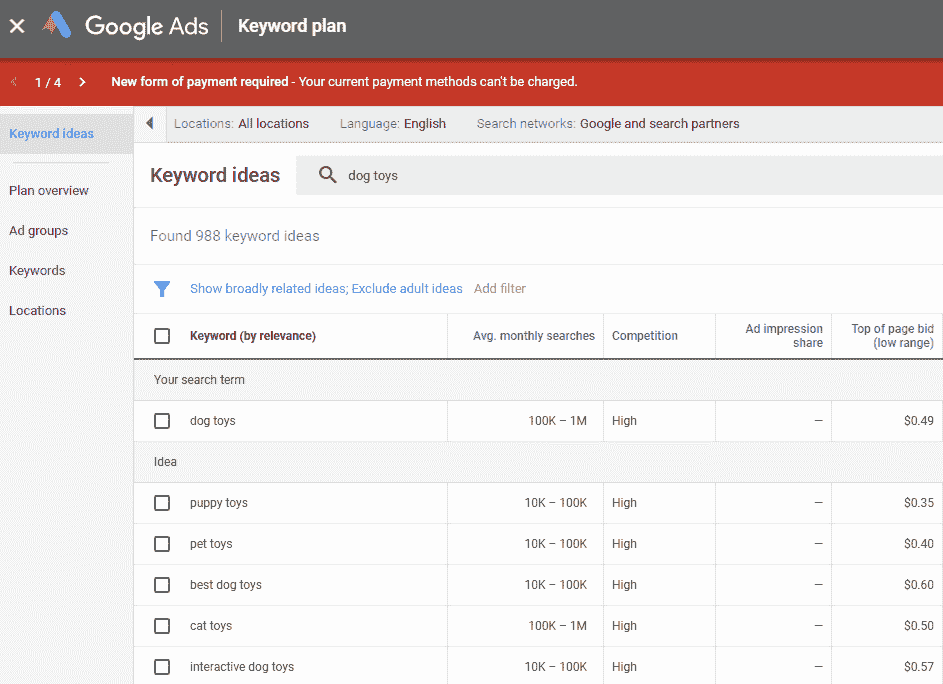

Google Keyword Planner

### 2.分析搜索趋势

用强大的目标短语丰富你的关键词列表并了解你所在行业的搜索趋势的另一种方法是利用 YouTube 的**自动完成功能**。这种方法非常有用，因为它可以让你收集人们实际输入 YouTube 的关键词。

你也可以浏览与你的视频相似的最受欢迎的视频，并复制它们的优化关键词。更重要的是，在 YouTube 自动完成功能的帮助下，你可以为未来的视频收集大量的想法。

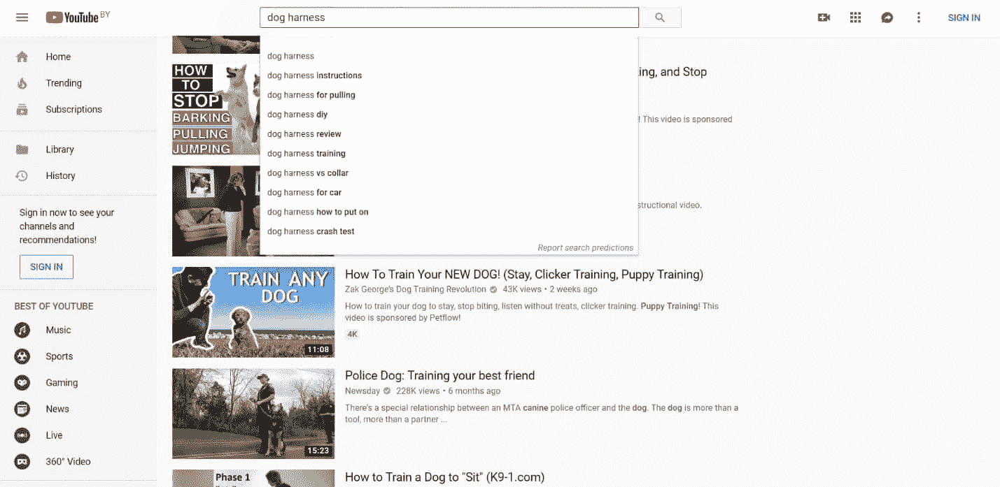

YouTube autocomplete

Google Trends 也是一个分析搜索趋势和根据热门程度比较关键词的出色工具。要让该工具为您提供 YouTube 特定的数据，您只需从 Web 搜索选项切换到 YouTube 搜索即可。

除了让你了解目前你所在领域的流行趋势，这个工具还显示了每月的搜索次数是如何随着时间的推移而变化的，并估计了某个地理区域的关键词流行度。当你想出一个关键词列表，并想比较它们的流行程度时，谷歌趋势也非常方便。

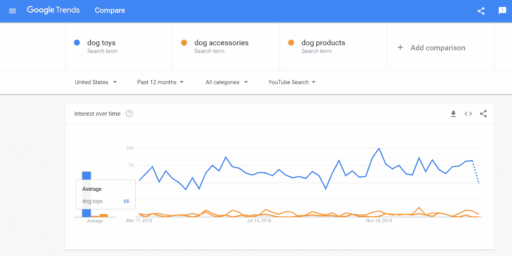

YouTube Google Trends

### 3.收集视频关键词

我相信你经常会注意到 YouTube 视频出现在谷歌搜索结果页面的特定关键词中。事实上，大约 20-40%的 YouTube 流量将来自有机搜索。这就是为什么收集和优化这些关键词的视频可以显著提高他们在谷歌有机搜索结果中争取一席之地的机会。

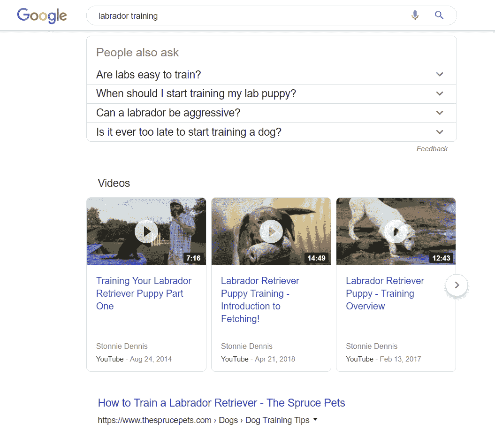

Video keywords in Google search

收集这些术语的最佳方式是将你的目标关键词输入到[排名追踪器](https://www.link-assistant.com/rank-tracker/)中，并查看结果页面是否包含任何视频——这是你如何在有机搜索结果中发现更有可能带来视频的关键词。

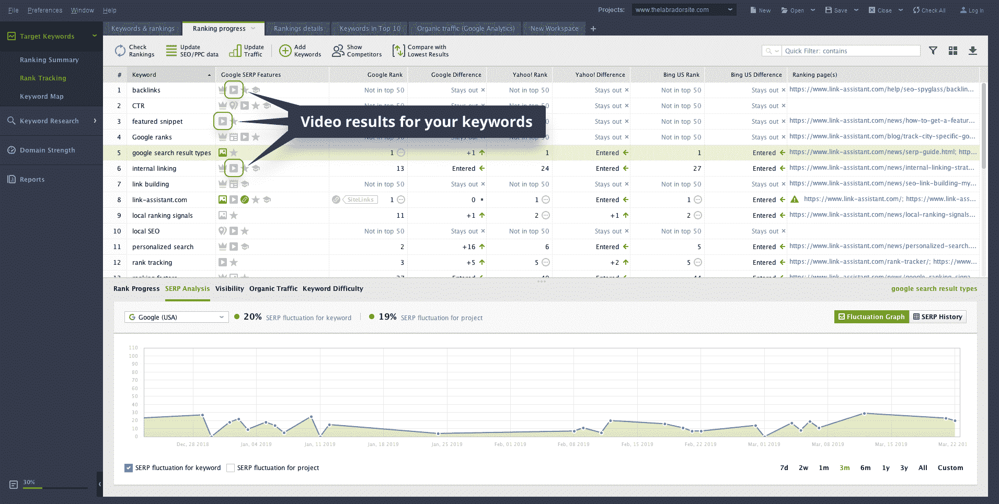

YouTube track keyword rankings

## 步骤 2:优化视频元数据

不管你喜欢与否，自从谷歌和 YouTube 实现了用于对象识别的机器学习以来，YouTube 现在可以识别你视频中的对象，同时估计它与特定搜索查询的相关性。基本上，视频元数据有点失去了它的力量，这并不意味着它不应该被优化。

事实上，这对我们来说非常重要，因为这正是用户在决定是否点击你的视频时要考虑的因素。更重要的是，建议上传元数据已经优化的视频，而不是在直播 48 小时后上传，因为否则，[算法会将其标记为不值得](https://searchengineland.com/youtube-seo-101-289416)。

因此，这里是你如何优化你的视频元数据，以满足搜索者和 YouTube。

### 1.创建一个关键词丰富的标题

当搜索者评估视频的相关性时，视频的标题是第一个，有时是唯一看的东西，我想这并不奇怪。为此，一个完美的标题应该包括你想要排名的关键词，以及总结你的视频主题。试着让它**吸引眼球**，但不要虚假承诺或过度宣传(不要故意点击诱饵)。看看你的竞争对手的视频标题来寻找灵感也是一个好主意。

一般来说，标题中有精确匹配关键词的视频在排名上表现得更好。原因很简单——用户可以准确地看到他们在搜索栏中输入的内容，因此这些视频看起来更相关。

除此之外，你的标题不应该超过 60 个字符的限制，否则，它们会被直接删除。

### 2.优化描述

虽然视频描述可以长达 1000 个字符，但前 100 个字符(2-3 行文本)是最重要的，因为这是用户在点击“显示更多”之前看到的文本量。这就是为什么把你的目标关键词，CTA，和你的社交账户的链接放在更靠近开头的地方是很重要的。

另一个选择是在你的描述中加入一份成绩单。然而，我不建议完全依赖 YouTube 的自动转录。确保正确地校对它们，或者考虑使用类似于[transcripte me](https://www.transcribeme.com/)的转录服务来为你做所有的工作。

### 3.创建自定义缩略图

缩略图是进入搜索者大脑的第一个东西，因为视觉信息的感知速度比文本信息快得多。而且经常发生的是，人们确实通过封面来判断一本书，并根据你的缩略图的质量、信息价值和美学外观来决定是否观看或忽略你的视频。这就是为什么我不建议从 YouTube 自动生成的缩略图中挑选——而是考虑创建自己的缩略图。

首先，要使您的缩略图在所有设备上看起来一样好，请确保它满足下面列出的技术要求:

*   1280×720 像素
*   16:9 的比率
*   < 2 MB
*   。jpg，。gif，。bmp 或者。png 格式。

很明显，你的缩略图应该引人注目，让搜索者想点击你的视频。给你的缩略图添加一些文字也是一个好主意，让它更有信息量。

### 4.添加视频标签

优化您的视频标签有助于搜索者发现您的视频——它们甚至会作为“关键词”出现在您的源代码中。了解向您的视频添加什么标签的最佳方式是查看您的竞争对手正在使用什么——只需安装 [TubeBuddy](https://www.tubebuddy.com/newcustomer/adwords) ，该工具将向您显示视频优化使用的确切标签。

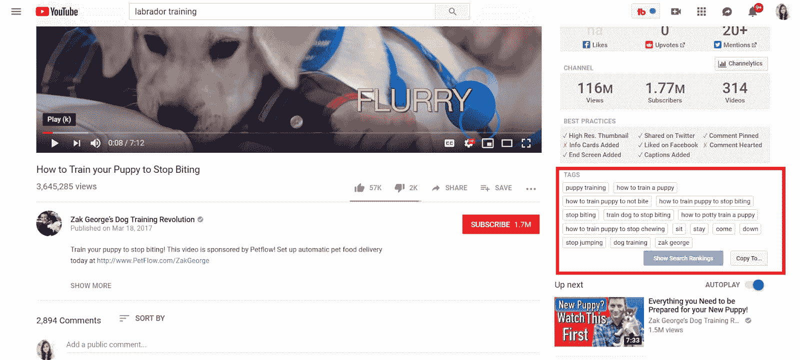

YouTube video tags

当你谈到优化本身时，最好从更长、更具体的标签开始(比如“如何训练一只拉布拉多小狗”)，然后将它们缩小到更广泛的短语(比如“训狗”)。不要忘记在标签中包含视频中的人物以及你的品牌名称。

### 5.添加标签

使用标签是提高视频可搜索性的另一种方式。你只需将它们添加到你的视频描述中，它们就会出现在视频标题的上方。由于标签最近被添加到平台上，你的一些旧视频可能没有用它们进行优化——所以一定要去找到它们并修复它。

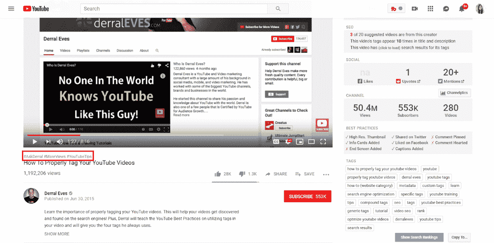

YouTube hashtags

同样重要的是，你添加的标签应该反映用户在输入或点击标签后希望看到的内容。同样需要注意的是，YouTube 限制单个视频的标签数量为 15 个，所以不要过度使用。

## 步骤 3:提高用户保持率和参与度

由于观看时间和观众保持率已经成为关键的排名信号，YouTube 奖励那些保持人们更长时间的视频，因为它们更好地满足了优质内容的标准。除此之外，一些参与度指标如[评论也与 YouTube 排名](https://backlinko.com/youtube-ranking-factors)有很强的相关性。因此，以下是如何提高观看时间、用户留存率和视频参与度的方法。

### 1.针对观看时间进行优化

开始观看时间优化的最好方法是分析你的[观看时间](https://support.google.com/youtube/answer/1714329?hl=en&ref_topic=3029003)报告，这可以给你提供关于平均观看时长、平均观看百分比和观众保留率的无价见解。这些指标将帮助你了解观众的参与程度，并找出你的策略中的弱点。

## 注册订阅时事通讯

### 想知道我们是怎么让流量增长超过 1000%的吗？

加入 20，000 多名获得我们每周时事通讯和内部消息的人的行列吧！

[Subscribe Now](#newsletter)

如果你看到观众没有通过你的介绍，这可能意味着它太长了。如果是这样的话，尽量砍掉一切不必要的上下文，直奔主题。

要增加您的整体渠道会话，请考虑在视频或描述中直接推广您的其他视频。将涵盖相似主题的视频组合在一个播放列表中也是一个好主意——每当有人观看该系列的视频时，它们就会自动播放。

### 2.鼓励参与

就像观看时间一样，[点赞、订阅、评论](https://backlinko.com/youtube-ranking-factors)与排名有非常强的相关性。鼓励观众与你的视频互动的第一步是找出需要改进的地方。没有比借助 YouTube Analytics 更好的方法了——它允许您查看 drive 订阅和取消订阅的确切视频，以及特定视频内容最受欢迎的位置。

为了鼓励观众发表评论，可以考虑在视频结束时直接问他们一个问题。当然，一定要对他们做出回应，以引发进一步的讨论，并让你的听众感到被倾听。

另一个越来越受欢迎的策略，特别是在博客中，是举办比赛，要求观众喜欢、订阅并在视频下写评论。当然，他们中的许多人会在赠品结束后立即退订，但大量的新订户仍然可以给你的视频带来显著的排名提升。

### 3.改善您的渠道

改善您的频道并为您的视频添加交互性的最佳方式之一是实施[卡](https://support.google.com/youtube/answer/1714347?hl=en&ref_topic=3029004)。根据你想推广的内容，它们可以有 6 种不同的类型:渠道、链接、投票、视频或播放列表以及捐赠卡。

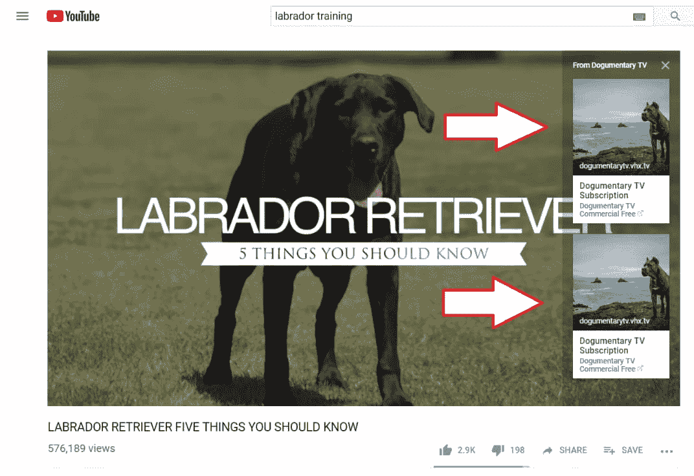

YouTube Cards

如果你想将观众引向你的其他视频，并赢得一些额外的观看时间，结束屏幕也能帮上大忙。在最后 5-20 秒添加结束屏幕，推广视频/播放列表或另一个频道，鼓励观众订阅，并链接到批准的网站。

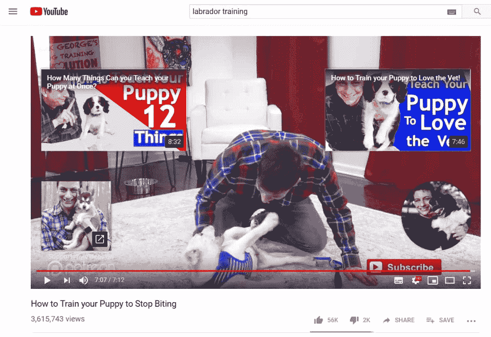

YouTube End Screens

随着 85%的脸书视频被关掉音量观看，添加字幕和隐藏字幕已经变得越来越必要，而不仅仅是一件好事。更重要的是，这是一个非常好的机会，让你的视频对于有听力障碍的观众或说另一种语言的人来说是可理解的，考虑实施[字幕和隐藏字幕](https://support.google.com/youtube/answer/2734796?hl=en)。

最后但同样重要的是，我想让你们注意的是你们视频的质量。事实是，高清格式的视频更受观众和 YouTube 的青睐——[YouTube 上 68.2%的首页视频是高清的](https://backlinko.com/youtube-ranking-factors)。所以，如果你还没有切换到高清视频格式，请确保切换到高清视频格式。

## 第四步:推广你的视频

尽管关键词研究、元数据优化和提高用户留存率是非常重要的活动，但如果你的视频无处可看，它们几乎不会给你带来任何利润。以下是你如何推广你的视频并赢得额外的浏览量。

当然，当我们想到内容推广时，首先想到的是社交网络。事实上，这是一个非常好的开始视频推广的地方。2018 年，[每天有 5 亿人在脸书看视频](https://www.forbes.com/sites/tjmccue/2018/06/22/video-marketing-2018-trends-continues-to-explode-as-the-way-to-reach-customers/#63e578c3598d)。就 Twitter 而言，[视频推文的转发次数是照片推文的 6 倍。](https://business.twitter.com/en/blog/5-data-driven-tips-for-scroll-stopping-video.html)

尽管如此，社交网络仍然是一个非常强大的视频推广平台。如果你想跟踪你的视频被什么样的嗡嗡声包围，考虑使用社交媒体监测工具，如 Awario、remote 或 Brandwatch。通过在 [Awario](https://awario.com/) 中设置提醒，你可以跟踪和分析你在社交媒体上的表现，并获得对竞争对手视频推广策略的宝贵见解。

另一个证明其有效性的视频推广策略是在博客帖子中嵌入视频。这就是你如何赚取一些链接，以及争取出现在有机搜索结果。视频+内容是双赢。

Struggling with downtime and WordPress problems? Kinsta is the hosting solution designed to save you time! [Check out our features](https://kinsta.com/features/)

推广你的视频的最佳地点是那些人们积极寻找答案的地方。所以考虑把你的视频放在问答网站上，比如 Quora。找一个你认为你的视频可以涵盖的问题，放在你答案的最后。然而，我也需要警告你，Quora 在检测垃圾邮件发送者方面非常出色——所以要小心，首先要努力帮助 Quora 社区。

最重要的是，考虑把你的视频放在相关的论坛或博客上，作为对评论中某人问题的回答。

另一种让那些最有可能观看和喜欢你的视频的人更多关注你的视频的方法是将它们附在你的简讯中。问题是，这些人已经是你的付费客户，更有可能至少会点击你视频的链接。例如，如果你想通知他们即将到来的销售，你可以添加一段视频，介绍如何使用你的产品，或者为什么它比你的竞争对手的产品好。

## 第五步:用 YouTube SEO 的强大工具武装自己

当然，有了强大的 YouTube SEO 工具，很多耗时的任务几乎可以马上完成。因此，这里有一个最佳的 YouTube 搜索引擎优化工具的选择，供您检查。

### 1.YouTube 分析

[YouTube Analytics](https://www.youtube.com/analytics?o=U) :最佳 YouTube 频道整体性能分析。

YouTube Analytics

当然，用 YouTube Analytics 开始这个图表才是正确的。在理解你的观众以及它如何与你的视频互动方面，这个工具是不可替代的。还需要提到的是，YouTube 最近从“Creator Studio”切换到了更简单、更直观的“YouTube Studio Beta”。

基本上，该工具向您显示了总体频道性能以及特定视频的数据。YouTube Analytics 还可以让你发现观众的观看习惯，分析他们的人口统计数据，并了解流量来自哪里。

在该工具的更新版本中，还提供了一些新的指标，如展示次数、展示点击率和唯一查看者。最重要的是，新的 YouTube Analytics 将您的最新视频表现与之前的视频表现进行比较，以跟踪您的进度。

### 2.等级跟踪器

[排名跟踪器](https://www.link-assistant.com/rank-tracker/):最适合 *c* 检查 YouTube 排名、关键词研究、关键词分析

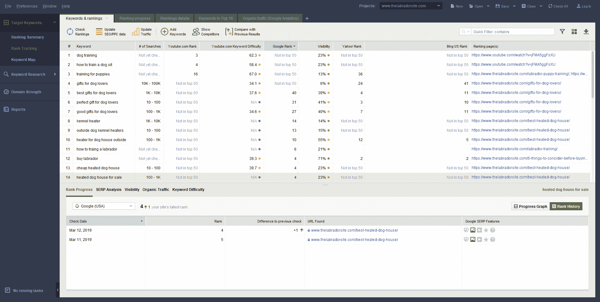

Rank Tracker

通过 Rank Tracker，你可以将 YouTube 设置为首选搜索引擎，跟踪你的排名，并在 SERP 功能中监控你的视频结果。该工具还允许您使用 23 种关键词研究方法收集关键词，包括 YouTube autocomplete，然后根据最重要的 SEO 指标进行比较。

正如我已经提到的，该工具在发现视频关键词和跟踪方面非常棒——您可以看到使视频出现在有机搜索结果中的确切关键词。请务必查看排名跟踪者专有的 *YouTube 关键词难度*指标，以立即发现并收集易于排名的关键词。

### 3.阿瓦里奥

Awario :最适合追踪社交媒体提及。

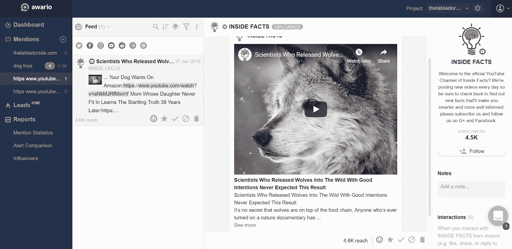

Awario

众所周知，[社交信号确实对 YouTube 排名算法](https://backlinko.com/youtube-ranking-factors)有很大影响。此外，无链接提及将很可能在 YouTube 的排名算法中获得更大的权力，因为它们已经是谷歌的排名信号[。有鉴于此，你需要跟踪和分析你的视频在社交媒体和互联网上的表现，并搜索更多的提及和链接来源。幸运的是，Awario 可以帮助你完成这两项任务。](https://searchengineland.com/use-brand-mentions-seo-linkless-future-link-building-290344)

要查看您的视频在社交媒体上引起的反响，只需在设置提醒时输入视频的 URL。或者你可以输入你研究过的关键词，在一个提示中跟踪它们(借助于[布尔搜索](https://awario.com/help/boolean-search/accessing-boolean-search/))，找到大量推广你的视频的机会。将工具设置为仅跟踪 YouTube 结果，并进行深入的竞争研究以提高您的排名。

最重要的是，你可以将你的 YouTube 帐户连接到 Awario，这样你就可以直接从这个工具中点赞和回复评论。

### 4.帆布

[Canva](https://www.canva.com/) :最适合设计 YouTube 频道美工和缩略图。

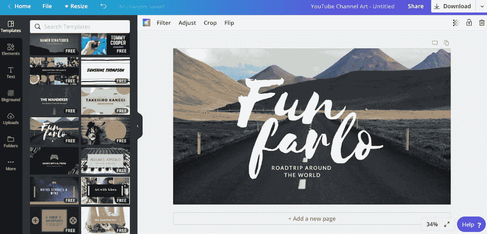

Canva tool

Canva 是一个免费的图形应用程序，它为各种视觉效果提供了大量的模板选择，包括自定义视频缩略图。该应用有一个免费版本，在模板和成员数量方面略有限制。

然而，如果你决定投资一个企业级账户(每个用户每月 9.95 美元)，你将获得一个巨大的图像数据库(300，000 张图像)以及上传你自己的字体和调色板的机会。

### 5.管道伙伴

[TubeBuddy](https://www.tubebuddy.com/) :最适合 YouTube 频道管理和视频优化。

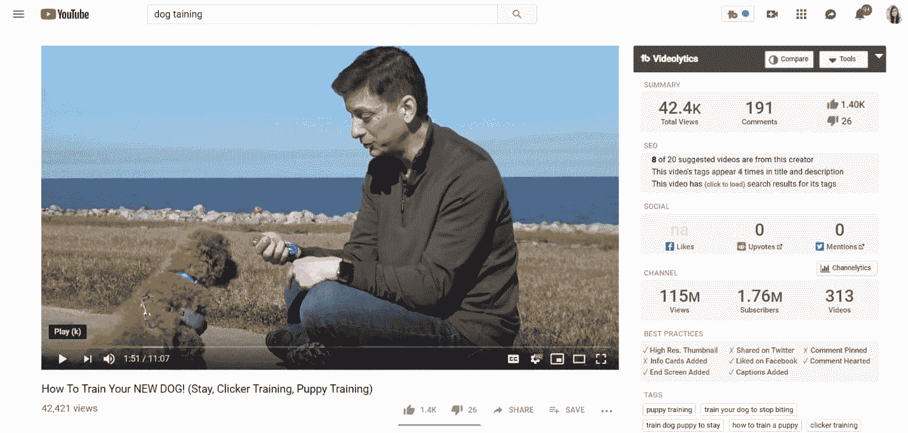

TubeBuddy

TubeBuddy 是一个免费的扩展，它可以让 YouTube 频道管理的工作轻松十倍。由于它是一个扩展，你可以在 YouTube 内操作，而无需切换到外部应用程序。在 TubeBuddy 的帮助下，你可以监控实时视频统计，跟踪社交分享，以及获得视频优化技巧。

该工具最棒的地方在于，它显示了 YouTube 上所有视频的上述数据。因此，您可以看到您的竞争对手如何优化他们的视频，并分析您的视频与您的竞争对手相比如何。

## 摘要

这就是今天的 YouTube SEO。让我们简要总结一下我们所谈的一切。

通过适当的关键词研究开始优化你的视频，特别注意视频关键词。之后，用你收集的关键词优化你的视频元数据。不要忘记在上传后的前 48 小时内完成。一旦你的视频直播，一定要推广它，建立链接。最后，用强大的 YouTube 工具包武装自己，尝试优化你自己的 YouTube SEO 程序。

你认为我们还应该添加什么 YouTube SEO 技巧或工具吗？请在下面的评论中留下它们。

* * *

让你所有的[应用程序](https://kinsta.com/application-hosting/)、[数据库](https://kinsta.com/database-hosting/)和 [WordPress 网站](https://kinsta.com/wordpress-hosting/)在线并在一个屋檐下。我们功能丰富的高性能云平台包括:

*   在 MyKinsta 仪表盘中轻松设置和管理
*   24/7 专家支持
*   最好的谷歌云平台硬件和网络，由 Kubernetes 提供最大的可扩展性
*   面向速度和安全性的企业级 Cloudflare 集成
*   全球受众覆盖全球多达 35 个数据中心和 275 多个 pop

在第一个月使用托管的[应用程序或托管](https://kinsta.com/application-hosting/)的[数据库，您可以享受 20 美元的优惠，亲自测试一下。探索我们的](https://kinsta.com/database-hosting/)[计划](https://kinsta.com/plans/)或[与销售人员交谈](https://kinsta.com/contact-us/)以找到最适合您的方式。