# 你需要花钱来赚钱(原因如下)

> 原文：<https://kinsta.com/blog/spend-money-to-make-money/>

企业家总是在寻找削减成本的方法。这可以理解。毕竟，现金是任何企业的命脉，一旦你用完了，你就完了。

然而，节俭和明智地管理你的预算是一回事，当小气鬼甚至在有意义的时候拒绝花钱是另一回事。事实上，当人们认为他们在省钱时，他们实际上是因小失大，损害了他们的生意。

无论你将一个零乘以多少次，所有乘法的总和将永远是零。如果成功是免费的，每个人都会成为百万富翁，对吗？

现实情况是，有时候要赚钱就得花钱。但是你到底应该投资什么来发展你的在线业务呢？让我们来看看。

## 选择正确的技术组合

托管已经变得非常实惠，几乎到了愚蠢的地步。你每个月花几美元就可以得到它。那么，你为什么要花更多的钱呢？

重要的是要明白，托管质量影响你的网站的性能，两个最重要的指标是速度和正常运行时间。

网站加载速度似乎不是一个重要的问题。这里几秒钟或者那里几秒钟不会有太大的不同，对吗？不对。

> Kinsta 把我宠坏了，所以我现在要求每个供应商都提供这样的服务。我们还试图通过我们的 SaaS 工具支持达到这一水平。
> 
> <footer class="wp-block-kinsta-client-quote__footer">
> 
> 
> 
> <cite class="wp-block-kinsta-client-quote__cite">Suganthan Mohanadasan from @Suganthanmn</cite></footer>

[View plans](https://kinsta.com/plans/)

事实上，谷歌发现，如果页面加载时间超过 3 秒，53%的移动访问会被放弃。与此同时，他们分析的大多数手机登录页面的加载时间是正常的两倍。

> 我们的研究令人大开眼界。对于我们分析的 70%的移动登录页面，折叠上方的可视内容显示在屏幕上需要超过 5 秒钟，完全加载折叠上方和下方的所有可视内容需要超过 7 秒钟。–谷歌研究人员

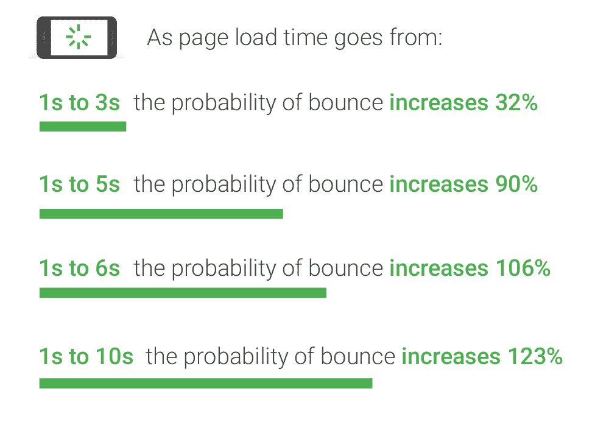

Mobile page speed (Image source: [Google](https://www.thinkwithgoogle.com/marketing-resources/data-measurement/mobile-page-speed-new-industry-benchmarks/))

此外，据 Akamai research 称，网站加载时间延迟 100 毫秒会使转化率下降 7%。客观地说，一次眨眼持续了 [100 到 400 毫秒](https://bionumbers.hms.harvard.edu/bionumber.aspx?s=y&id=100706&ver=0)。

很难理解[网站加载速度](https://kinsta.com/learn/page-speed/)的重要性，因为从理性的角度来看，它真的没有意义。当然，人们不可能如此匆忙，以至于一秒钟(甚至更短)就会让他们放弃这个网站？但是数据很清楚——**速度很重要**。

当涉及到网站加载速度时，主机是一个主要因素。为了让你的网站快如闪电，你需要一个使用最新技术的主机，比如 Nginx T1、PHP 7、T2 Maria db T3 和 LXD 软件容器。如果没有一个有利于速度的主机架构，你就不能完全优化你的网站。

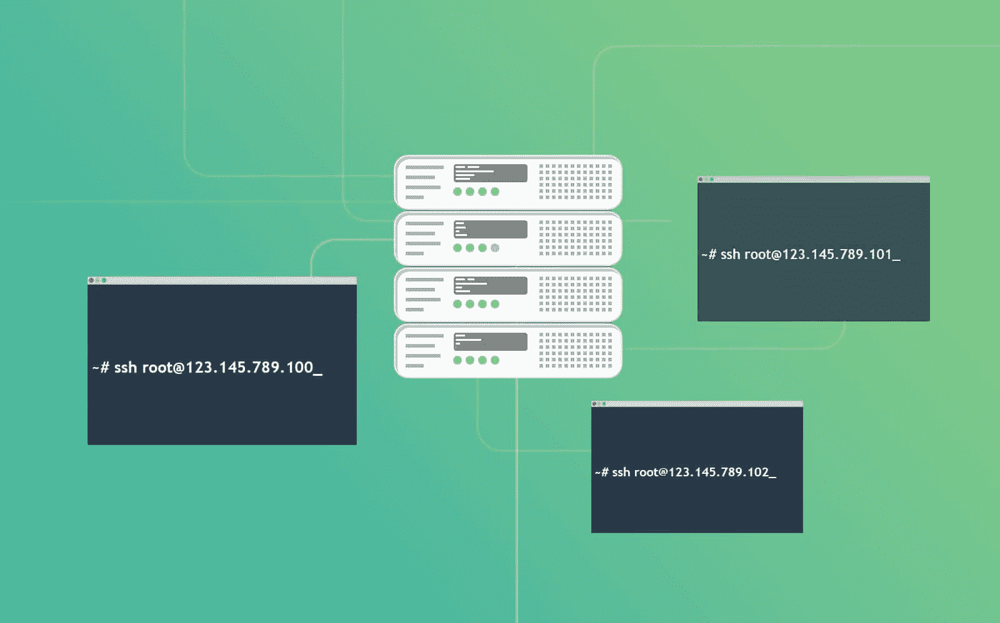

Technology stack

另一个需要考虑的重要因素是正常运行时间。它是服务器保持运行的时间。简单地说，如果正常运行时间是 99%，这意味着你可以期望你的网站在 99%的时间里保持在线。

正如 Lifewire 的 Jennifer Kyrnin 所展示的那样，即使是运行时间上看似微小的差异，也会累积出大量的时间:

*   98%的正常运行时间= 28.8 分钟/天或 3.4 小时/周或 14.4 小时/月或 7.3 天/年
*   99%的正常运行时间= 14.4 分钟/天或 1.7 小时/周或 7.2 小时/月或 3.65 天/年
*   99.5%的正常运行时间= 7.2 分钟/天或 0.84 小时/周或 3.6 小时/月或 1.83 天/年
*   99.9%的正常运行时间= 1.44 分钟/天或 0.17 小时/周或 0.72 小时/月或 8.8 小时/年

> 如果你的网站每月收入 1000 美元，那么一个有 98%正常运行时间的主机会使你的利润每月减少 20 美元，或者每年减少 240 美元。这还只是销售损失。如果你的客户或搜索引擎开始认为你的网站不可靠，他们将不再回来，每月 1000 美元将开始下降。詹妮弗

换句话说，[停机对业务](https://kinsta.com/blog/website-downtime/)来说是可怕的。谈到停机时间，最重要的因素是什么？托管。

人们通常没有意识到的是，提供廉价主机服务的公司(像 [Hostinger](https://kinsta.com/hostinger-alternative/) 或 [SiteGround](https://kinsta.com/siteground-alternative/) 这样做是因为他们提供共享主机服务。这意味着你的网站可能与 200 多个其他网站共享资源。这是一种不稳定的情况，因为你无法控制其他网站上发生的事情。其中一个问题可能会影响网站的性能。

最后，廉价的主机公司根本雇不起足够的技术支持人员，这意味着如果出现问题，他们可能需要一段时间来解决问题。

因此，如果你每月支付 10 美元的托管费，但你得到的是更慢的网站加载速度，更多的停机时间，更不可靠的支持，你真的省钱吗？

或者你是否因为网站的次优表现而损失了金钱？

投资高级[应用托管](https://kinsta.com/application-hosting/)、[数据库托管](https://kinsta.com/database-hosting/)和[托管 WordPress 托管](https://kinsta.com/wordpress-hosting/)将帮助你优化网站速度，最大限度地减少停机时间，并在遇到任何问题时获得可靠的支持。

此外，你不必担心其他问题，如安全漏洞、 [DDoS](https://kinsta.com/blog/what-is-a-ddos-attack/) 或 [XML-RPC 攻击、](https://kinsta.com/blog/xmlrpc-php/)或不得不备份你的网站。如果你的网站被入侵，Kinsta 甚至提供免费的黑客补丁。

## 以独特的设计脱颖而出

有成千上万个免费的 WordPress 主题。

然而，尽管免费主题对业余爱好者来说可能很好，但对企业来说并不理想，原因有三:

*   它们通常没有针对速度进行优化。多余的代码，不必要的页面元素，超大的图片文件…所有这些都会大大降低你网站的速度。您已经知道，即使是很小的加载时间延迟也会影响您的底线。
*   它们不是为转换而优化的。你的网站的目的是销售你的产品，网站上的每一页都应该以引导访问者进入销售漏斗的下一步为目标。
*   大多数时候，它们并不独特。你不希望你的网站看起来像同一个空间里其他网站的翻版。它的设计要和你的品牌一致，帮助你在竞争中脱颖而出。

此外，免费主题在发布前通常没有经过足够彻底的测试，这意味着它们可能有缺陷，不能在所有浏览器上很好地工作，不能在所有设备上很好地工作，等等。

此外，你不能指望通过免费主题获得即时支持，这意味着你必须自己解决所有问题。你真的想花几个小时在 WordPress 论坛上试图解决一些小问题吗？

这就是为什么最好是获得一个优质的 WordPress 主题，它速度快，为转换而优化，可定制，足以让它真正成为你的，并且有可靠的支持。

这里有一些我们推荐的 WordPress 主题。

### 生成 Press

GeneratePress 是一个快速、轻量级(压缩后不到 1MB)、移动响应的 WordPress 主题，以速度、SEO 和可用性为出发点。由来自加拿大的开发人员 Tom Usborne 构建。它是积极更新和良好的支持。甚至一些 Kinsta 团队成员也在他们的项目中使用 GeneratePress。

虽然有免费版本可用，但您会希望购买高级版本，以利用所有定制功能。

[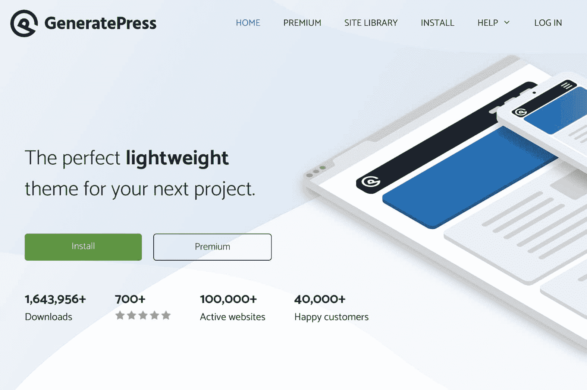](https://generatepress.com/)

GeneratePress

GeneratePress 最棒的一点是所有的选项都使用了原生的 WordPress 定制器，这意味着你可以在点击发布按钮之前立即看到你所做的每一个修改。这也意味着你不必学习一个新的主题控制面板。

### OceanWP

OceanWP 主题是轻量级的和高度可扩展的，它使你能够创建几乎任何类型的网站，如博客、作品集、商业网站和 WooCommerce 店面，并拥有漂亮的专业设计&。由 Nicolas Lecocq 构建，它也在积极更新并得到了很好的支持。

[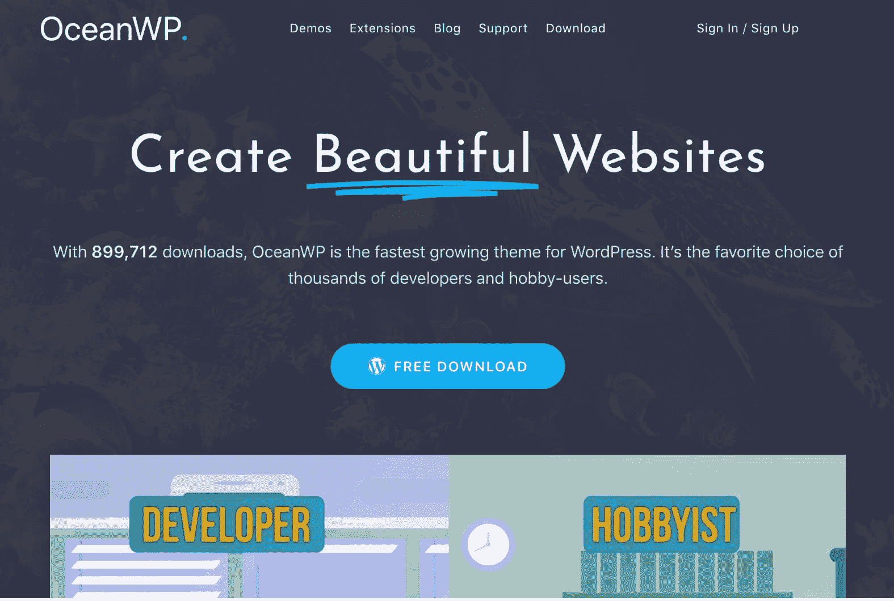](https://oceanwp.org/) 

OceanWP 主题

### 阿斯特拉

Astra 是一个快速的、完全可定制的&美丽主题，适合博客、个人[作品集](https://kinsta.com/blog/wordpress-portfolio-plugins/)、商业网站和 WooCommerce 店面。它非常轻量级(前端不到 50 KB)并提供无与伦比的速度。由 Brainstorm Force 的团队构建，它得到了积极的更新和良好的支持。你可能认为他们是流行的 All In One Schema Rich Snippets 插件的创造者，这个插件已经存在很多年了。

[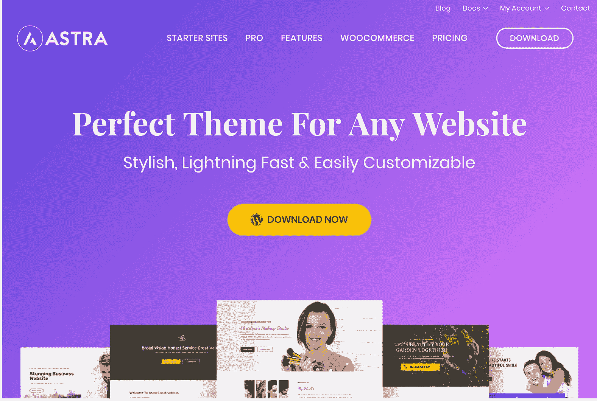](https://wpastra.com/)

Astra WordPress theme

然而，如果你能负担得起，那么你可能会考虑在像 [Codeable](https://kinsta.com/partners/codeable/) 这样的网站上雇佣一名网页设计师或开发者，并为你的企业定制设计。

Hire WordPress designer/developer

找到一个理解你的愿景并有能力实现它的人可能有点棘手。

寻找过去为类似企业工作过的人(例如，如果你有一个在线商店，寻找一个以前与电子商务公司合作过的设计师，等等。).

此外，确保他们了解设计如何与业务交叉，并能解释他们将如何使用设计来帮助你提高销售额(换句话说，他们应该对转化率优化有扎实的知识)。

起初，投资设计可能看起来有些无聊，但事实并非如此。

毕竟，你的网站设计直接影响着你的访问者的行为，让你的网站在视觉上更加愉悦和易于使用会对你的底线产生巨大的影响。

当我们在 2017 年推出 [new Kinsta 网站](https://kinsta.com/blog/new-kinsta/)时，我们与一家有才华的外部机构合作。几年后，这些人现在是 Kinsta 团队的一员。😄我们肯定需要投入更多的资金和时间，但最终还是值得的。

## 购买合适的工具和软件

你可以找到几乎任何东西的免费应用程序。

然而，[重要的是要理解“免费”](https://kinsta.com/blog/is-wordpress-free/)几乎总是意味着它背后的人不能在更新、开发和支持上花费太多的时间、精力和金钱，这导致了与高级选项相比的次等产品。开发人员和软件创作者和我们一样，也要养家糊口。

以下是我们推荐给你的一些优质产品:

Basecamp 是一款团队沟通和项目管理应用程序，帮助您在与远程团队合作时掌控全局。不再混乱！建议阅读:[特雷罗 vs 阿萨纳](https://kinsta.com/blog/trello-vs-asana/)。

[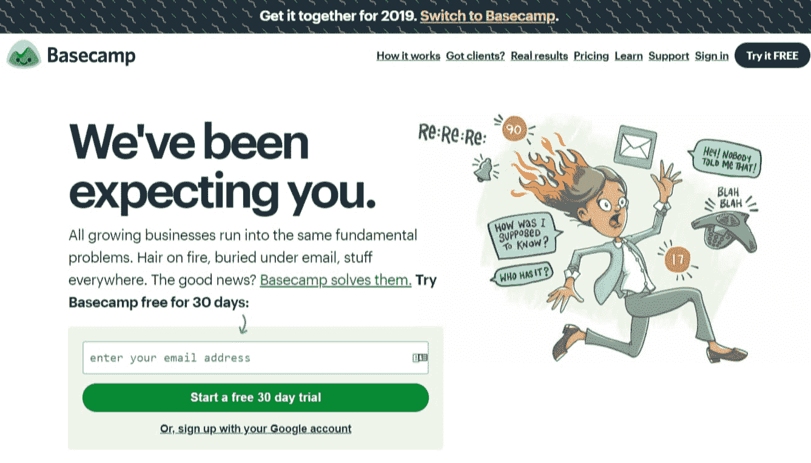](https://basecamp.com/)

Basecamp

Ahrefs 是一套全方位的搜索引擎优化工具，可以帮助你[搜索关键词](https://kinsta.com/blog/keyword-research/)，建立链接，进行网站审计等等。我们在 Kinsta 使用这个工具，它很容易就能收回成本。事实上，这个工具是我们能够在短短 13 个月内[将网站流量增长 571%](https://kinsta.com/blog/wordpress-seo/) 的原因之一。

[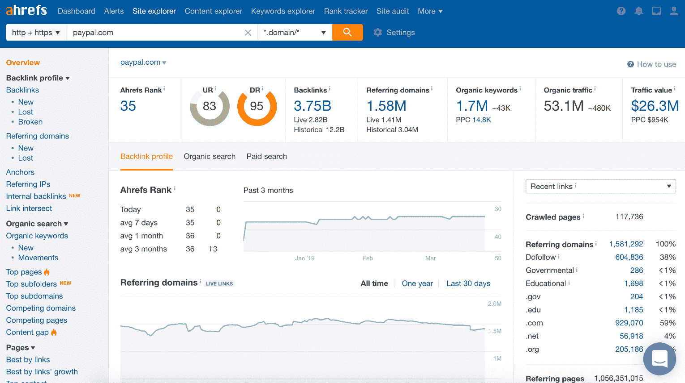](https://ahrefs.com/)

Ahrefs

MailChimp 是一款电子邮件营销应用，你可以用它来建立你的电子邮件列表、发送邮件、设置自动回复序列等等。[我们每周在 Kinsta 使用 MailChimp](https://kinsta.com/blog/how-to-use-mailchimp/) 发布我们的[时事通讯](https://kinsta.com/wordpress-newsletter/)。

[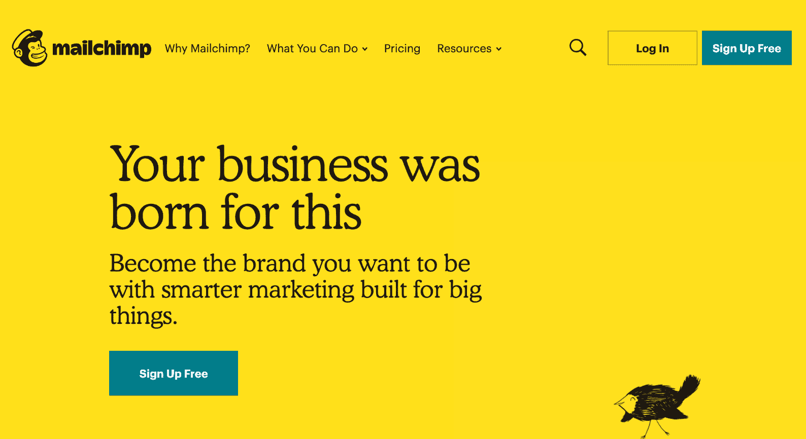](https://mailchimp.com/)

MailChimp email marketing

[Buffer](https://buffer.com) 是一款社交媒体营销自动化软件，通过安排更新和在一个地方管理您的所有帐户，帮助您在 auto-pilot 之后发展您的社交媒体。你从金斯塔营销团队看到的一切都要通过我们的缓冲账户！

## 注册订阅时事通讯

### 想知道我们是怎么让流量增长超过 1000%的吗？

加入 20，000 多名获得我们每周时事通讯和内部消息的人的行列吧！

[Subscribe Now](#newsletter)

[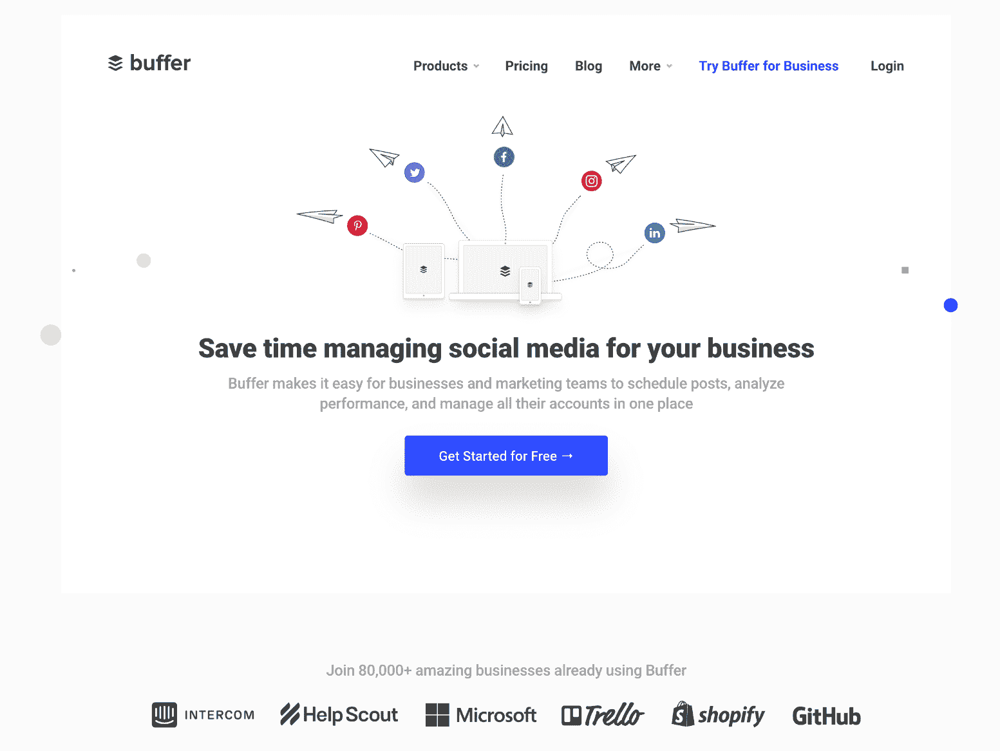](https://buffer.com)

Buffer social media tool

是的，你可以找到所有这些应用的免费替代品，但是免费应用不会像付费应用那样强大。此外，试图用免费应用程序做同样的事情，或者更糟糕的是，手动操作，可能会非常耗时。

投资高级软件可以节省您的时间，让您更有效地完成日常任务，并帮助您更快地发展业务。

如果你能负担得起，就不要犹豫去做。请务必查看我们用于 Kinsta 发展业务的 [40+其他 SaaS 应用](https://kinsta.com/blog/saas-products/)，以及关于 [SaaS 营销](https://kinsta.com/blog/saas-marketing/)的指南。

## 对集客营销进行长期投资

[集客营销](https://kinsta.com/blog/inbound-marketing/)就是通过内容吸引人们。

像 [SEO](https://kinsta.com/blog/what-does-seo-stand-for/) ，内容营销，邮件营销等等。因为你正在吸引潜在客户。

然而，现在世界各地的公司都在使用它作为他们的主要营销策略，由于大量的高质量内容，它变得非常有竞争力。

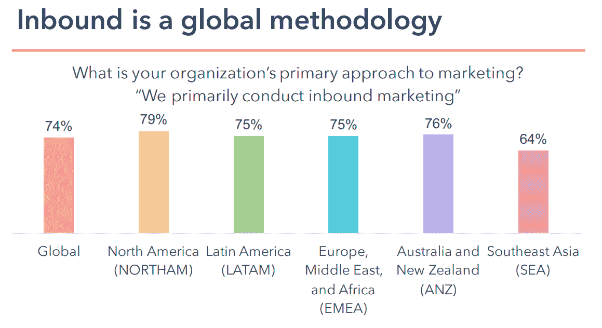

Inbound global methodology (Image source: [HubSpot](https://cdn2.hubspot.net/hubfs/3476323/State%20of%20Inbound%202018%20Global%20Results.pdf))

这意味着，如果你想建立一个博客、播客或 Youtube 频道，你需要持续不断地制作一流的内容。

你有两个选择:

*   自己动手。如果你已经具备了在你所选择的媒介中脱颖而出的技能，这种方法会很有效。例如，如果你以前有为在线出版物写作的经验，那么你应该能够为你自己的博客写高质量的文章。然而，即使你知道你在做什么，生产高质量的内容也需要很多时间。
*   **雇人。**如果你没有所需的技能，这是你应该做的。例如，如果你上一次写比电子邮件更有实质内容的东西是你的 SAT 论文，那么你可能要考虑为你的博客雇一个作家。

当然，理论上，你可以从零开始学习你需要的技能，但在实践中，这将非常耗时，因此对于已经有很多责任的人来说是不可行的。

重要的是要明白内容从来都不是免费的。你要么用时间来支付，要么用金钱来支付。当你手头拮据时，前者是有意义的，但如果你负担得起，后者可能是更好的选择。

此外，即使你想自己制作内容，也不要害怕投资让它变得更好。

例如，AppSumo 的创始人诺亚·卡根(Noah Kagan)有一个名为*“诺亚·卡根呈现”的播客。*

> “在发布了我的节目的几集后，我意识到我需要外界的帮助来使我的播客变得更好……我决定请一位专家来‘指导’我如何制作一个好的播客。

因此，他联系了 NPR 制片人尼克·方丹，后者同意给他一些反馈。

看看尼克对诺亚播客*“我最有钱的混蛋时刻”*的一些观察:

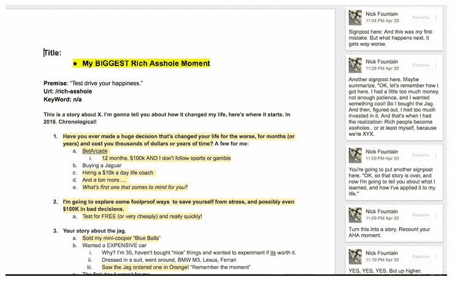

Podcast content (Image source: [OkDork](https://okdork.com/how-to-make-a-podcast/))

诺亚说，直到他看到这些评论，他才意识到自己需要多少帮助。

Struggling with downtime and WordPress problems? Kinsta is the hosting solution designed to save you time! [Check out our features](https://kinsta.com/features/)

> 一句话:我学到的经验极大地提高了我播客的质量。

从有经验的专业人士那里获得这种帮助可以显著提高你的内容质量。

[Content is never free. You are either paying for it with time or you are paying for it with money. 💸Click to Tweet](https://twitter.com/intent/tweet?url=https%3A%2F%2Fkinsta.com%2Fblog%2Fspend-money-to-make-money%2F&via=kinsta&text=Content+is+never+free.+You+are+either+paying+for+it+with+time+or+you+are+paying+for+it+with+money.+%F0%9F%92%B8&hashtags=inboundmarketing%2Ccontentmarketing)

## 使用外向营销来补充内向营销

[外向营销](https://kinsta.com/blog/outbound-marketing/)是关于接触人们。的确，像广告牌、报纸、杂志、广播和电视广告这样的老式方法正在失去效力。

然而，像脸书广告、Instagram 广告和播客广告这样的现代方法可以很好地工作。

但是广告不算集客营销吗？是的，也不是。营销人员会争论像 PPC 这样的东西是内向策略还是外向策略。通常出站意味着它试图打断你的日常工作流程并吸引你的注意力。这就是广告的作用。然而，广告也可以吸引人们使用你的精彩内容。因此，不管战略定义如何，重要的是用外向来补充内向。

例如， [MeetEdgar](https://meetedgar.com/) 的创始人劳拉·罗德尔(Laura Roeder)利用脸书的广告让她的创业公司起步。

劳拉在独立黑客播客上接受采访时说，虽然她是内容营销的超级粉丝，但她知道这需要时间来取得成效，这就是为什么她选择在广告推出时专注于广告，每月在脸书广告上花费高达 4 万美元。

> 我认为人们害怕花钱，但我宁愿一开始在广告上花更多的钱，因为以后，我可以从搜索中获得大部分客户。劳拉

与此同时，鲜花递送初创公司 Bloom & Wild 凭借 Instagram 广告取得了成功。

他们的预算有限，所以他们使用他们的电子邮件列表来创建一个相似的观众，然后向类似于他们的电子邮件订户的人展示他们的广告。

然后，经过一些测试，他们意识到视频广告是最有效的，并决定加倍投入。结果呢？他们的花束订单增加了 62%。

Instagram ad

销售“世界上最舒适的内衣”的 MeUndies 公司利用播客广告来宣传这个词。

他们在世界上一些最受欢迎的播客上为他们的产品做广告，包括*“蒂姆·费里斯秀”*和*“乔·罗根体验”。*

广告是获得销售的最直接的方法，因为你把你的产品放在潜在顾客面前。

所以，如果你能想出如何盈利，就不要害怕花钱买广告。

## 你得到你所支付的

你需要考虑潜在的经济现实。

低端产品几乎总是不如高端产品。为什么？这是因为制造高端产品的公司可以投入更多资源。

例如，正如我们的首席财务官在他的帖子中解释的那样[廉价主机如何真正发挥作用](https://kinsta.com/blog/cheap-wordpress-hosting/)，一家提供 10 美元/月主机服务的公司需要 1389 名客户来雇佣一名系统管理员。

> 但是一个系统管理员，一个可以解决任何出现的疯狂主机问题的系统管理员，怎么能处理近 1400 个客户的技术问题呢？答案是他们不能。汤姆

然后，他鼓励人们设定相应的期望值。

> 他们应该预料到他们的网站会不时出现故障(因为 10 美元/月，你很可能与太多其他人共享一台服务器)，并预计不会很快解决。数字就是这么算出来的。汤姆

这同样适用于其他一切。发布免费 WordPress 主题或免费应用程序的人很可能是把它作为一种爱好。或者他们拥有免费版本的唯一原因是追加销售高级版本。他们可能有工作来支付账单。这严重限制了他们在产品上花费的时间、精力和金钱。他们可能无法与拥有一组全职开发类似软件的人的公司竞争。

现在，这并不是说你不应该使用免费或低端产品。它们可能非常适合个人项目。也有很多很棒的开源项目。

然而，当涉及到商业时，最好警惕这种“便宜货”，因为一旦你考虑到一切(生产力损失、销售损失、增长放缓等)，它们很可能一点也不便宜。).

请记住，你会得到你所付出的。

## 权衡是什么？

显然，在理想的世界里，你会有无限的钱来投资你的事业，并且会得到最好的一切。然而，这不是我们生活的世界，你没有无限的钱来投资你的生意。

这就是为什么当考虑在哪里花费和在哪里削减成本时，理解权衡是重要的。例如，一个便宜的主机会让你花费更少，但会导致更慢的加载速度，更少的正常运行时间，以及修复问题的延迟，这反过来会导致销售的损失。你节省的钱值得吗？

或者，一个免费的应用程序不会花费你什么，但是由于它的限制，完成同样的任务可能要多花 5 个小时，这意味着你可以用于其他工作的时间会少 5 个小时。你节省的钱值得吗？

或者，你可以自己写那篇博文，但是你要花 10 个小时来写，这也意味着你可以花 10 个小时来完成其他任务。你节省的钱值得吗？

最终，这些权衡归结为两件事之一:

*   时间与金钱。你可以花时间省钱，也可以花钱省时间。目前哪种资源短缺？
*   **短期收益与长期收益。**你可以现在存钱，但长期来看会赔钱，也可以现在花钱，长期来看会省钱。哪个更重要？

这些问题没有对错之分。这完全取决于你的具体情况。只有你知道什么是适合你的生意。

例如，如果你的钱用完了，那么你应该优先考虑短期收益来维持你的生意，即使从长远来看这会伤害你。与此同时，如果你的财务状况稳定，那么你应该优先考虑长期收益，即使它在短期内有点刺痛。

然而，无论你做什么，记住每个决定都有积极和消极的后果，你应该仔细权衡它们。从权衡的角度思考可以帮助你获得一些清晰，因为人们很容易被尽可能削减成本的想法冲昏头脑，以至于忽略了大局。
[现实是，有时候你必须花钱才能赚钱。💰 点击推文](https://twitter.com/intent/tweet?url=https%3A%2F%2Fkinsta.com%2Fblog%2Fspend-money-to-make-money%2F&via=kinsta&text=The+reality+is+that+sometimes+you+have+to+spend+money+to+make+money.+%F0%9F%92%B0&hashtags=SaaS%2Cstartups)

## 摘要

没有人说你应该花你没有的钱。

然而，如果你想让你的企业成长，你需要愿意投资，否则，它将几乎不可能更上一层楼。或者它会比你想象的要花更长的时间。

所以，永远不要让今天节省几美元的冲动成为你事业长期成功的绊脚石。不要怕花钱赚钱。

我们很想听听你对这个话题的看法！请在下面的评论中留下它们。

* * *

让你所有的[应用程序](https://kinsta.com/application-hosting/)、[数据库](https://kinsta.com/database-hosting/)和 [WordPress 网站](https://kinsta.com/wordpress-hosting/)在线并在一个屋檐下。我们功能丰富的高性能云平台包括:

*   在 MyKinsta 仪表盘中轻松设置和管理
*   24/7 专家支持
*   最好的谷歌云平台硬件和网络，由 Kubernetes 提供最大的可扩展性
*   面向速度和安全性的企业级 Cloudflare 集成
*   全球受众覆盖全球多达 35 个数据中心和 275 多个 pop

在第一个月使用托管的[应用程序或托管](https://kinsta.com/application-hosting/)的[数据库，您可以享受 20 美元的优惠，亲自测试一下。探索我们的](https://kinsta.com/database-hosting/)[计划](https://kinsta.com/plans/)或[与销售人员交谈](https://kinsta.com/contact-us/)以找到最适合您的方式。