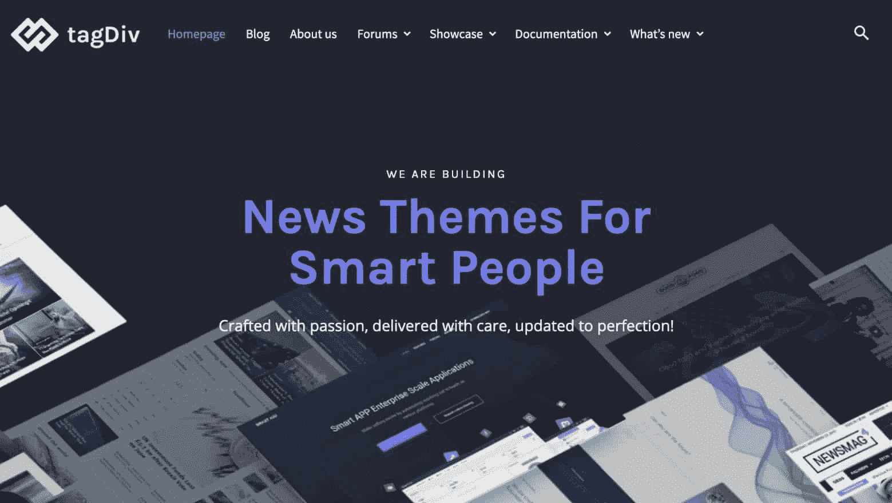
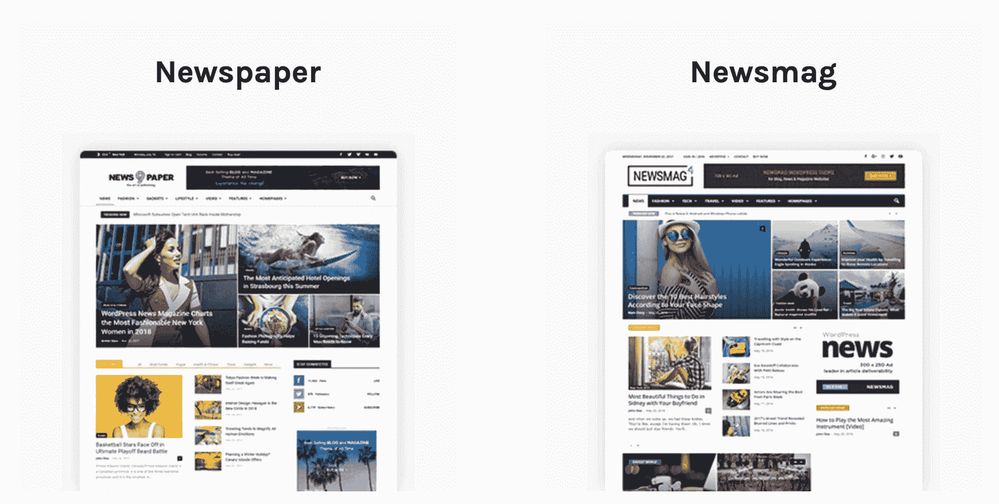
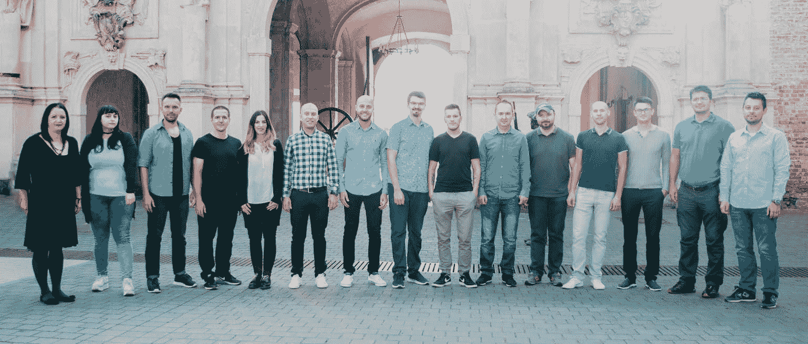

# 金斯塔·金平:与拉杜歌剧院的访谈

> 原文:# t0]https://kinta . com/blog/interview-rado-opre/

Radu Oprea 是 tagDiv 的联合创始人，tag div 是一家专注于构建令人惊叹的博客、新闻和杂志 WordPress 主题的公司。他还是报纸和新闻杂志主题的高级开发人员；它们被用来驱动全球数以千计的 WordPress 网站。tagDiv 已经卖出了 92，000 多本，使他们成为了 ThemeForest 上的精英作家。

你可以在 [LinkedIn](https://www.linkedin.com/in/radu-oprea-8540a7169/) 上找到 Radu。这是我们最近对他的采访，作为我们[金斯塔·金并](https://kinsta.com/?post_type=post&s=kingpin)系列的一部分。

### Q1:你的背景是什么，你是如何开始使用 WordPress 的？

我一直对计算机科学充满热情。出于对我的电脑工作方式的好奇，我开始编程并爱上了它。网络环境成了我的游乐场，我很容易就从尝试桌面应用程序变成了创建网站的爱好。早在 2007 年，罗马尼亚在网上支付方面取得了进展，我已经通过几个项目开始了我的数字体验。大部分都没有成功，但也有一些成功了。尽管我的家人和朋友嘲笑我要找一份真正的工作，但我一直在尝试新的想法。

2009 年，我在做一个正常运行时间监控服务，需要为它建立一个网站。首先，我尝试创建一个静态网站。相信我，如果没有像现在的 Hugo framework 这样简单的站点生成器，维护这些简直是一场噩梦。这就是我的 WordPress 历险记开始的时刻。我和 Marius Padureanu 走到一起，共同创立了 [tagDiv](https://tagdiv.com) 品牌，作为一个优质的 WordPress 主题作者，进入了 Envato ThemeForest 市场。

 

tagDiv 品牌

### Q2:读者应该知道你最近在 WordPress 做了些什么？

在过去的 6 年里，在 tagDiv，我们为新闻、博客和杂志网站开发专业工具。从一开始，我们唯一的目的就是开发一个最简单的集成系统来获取发布在 WordPress 上的内容。我们仍在进行中。

我们在 2013 年 9 月发布了[报纸](https://themeforest.net/item/newspaper/5489609)，在 2014 年 11 月发布了[新闻杂志](https://themeforest.net/item/newsmag-news-magazine-newspaper/9512331)。在很短的时间内，我们在新闻行业中声名鹊起，目前我们是[顶级 Envato 作者](https://themeforest.net/authors/top)，拥有超过 92，000 名满意的客户。由于其直观的前端界面，像优步、Share America、比特币新闻或 Rackspace 等公司都在使用报纸作为他们的博客。

我们不断改进并为报纸主题添加新的、灵活的功能，让我们的客户享受专注于内容的乐趣。这就是为什么我们想出了创建我们自己的页面生成器——tagDiv Composer——让用户拖放块和元素来实时创建一切，从帖子、类别到标题、页面甚至更多。

> 需要在这里大声喊出来。Kinsta 太神奇了，我用它做我的个人网站。支持是迅速和杰出的，他们的服务器是 WordPress 最快的。
> 
> <footer class="wp-block-kinsta-client-quote__footer">
> 
> 
> 
> <cite class="wp-block-kinsta-client-quote__cite">Phillip Stemann</cite></footer>

[View plans](https://kinsta.com/plans/)

Newspaper and Newsmag WordPress themes

在门后，有一个伟大的团队，大量的工作，成吨的咖啡杯，和头脑风暴会议，以找到最简单的路径。像任何软件开发公司一样，我们在项目中面临不同的问题，所以我们为它们创建了定制的解决方案。我们想让我们的产品与众不同，所以我们设计的每一款产品都能为顾客带来无与伦比的体验。

### Q3:在职业生涯中，你遇到了哪些挑战？

我们基本上是在我父母家的一个空房间开始我们的 WordPress 之旅的，过了一段时间，我们搬到了一个 70MP 的小房子里。嗯，开始很艰难。抛开我们想有一个舒适的工作场所的愿望，最大的挑战是找到产品/市场的契合度。这花了我们一年时间对不同的 WordPress 主题、系统进行实际测试，并理解这个市场的运作方式。

最初只有两个人，现在我们是一个由 17 名热情勤奋的程序员、设计师和营销专家组成的团队。我们每天都在帮助客户成功完成他们的项目。

## 注册订阅时事通讯

### 想知道我们是怎么让流量增长超过 1000%的吗？

加入 20，000 多名获得我们每周时事通讯和内部消息的人的行列吧！

[Subscribe Now](#newsletter)

tagDiv team

### 在 WordPress 的世界里，有没有什么让你感到惊讶的事情？

是的，肯定的。WordPress 一致性的改进。他们每年都会推出出色的更新和灵活的解决方案，让我们有机会改进我们的产品。看一看[古腾堡](https://kinsta.com/blog/gutenberg-wordpress-editor/)就知道了。与 WordPress 的早期版本相比，这是一个巨大的进步。而且对于新手的体验是无法比拟的。

此外，我对 WordPress 开发者必须保持向后兼容性的谨慎感到惊讶。每当 WordPress 推出一个新版本，他们都让我们这些开发者很容易更新我们的产品。这意味着，如果一个 WordPress 软件是五年前用 PHP 编写的，那么它可以在最新版本上无缝运行。有了我们的主题核心和他们的新系统，我们顺利地完成了过渡。

看到 WordPress 和 PHP 在每次更新中变得越来越好，并且处理代码几乎没有错误，真是令人惊讶。现在流行的 JavaScript 和其他软件框架每年都会发布重大更新，这些更新会破坏大量现有代码。为了跟上创新，我们的主题总是更新以适应最新的 WordPress 版本。

### Q5:你认为 WordPress 世界的未来会是怎样的？

为了建立令人敬畏的网站，有一个强制性的要求，即使用有用而直观的工具来确保良好的用户体验。随着每一个功能的添加，我们正在接近我们的目标，为我们的客户创造完整的出版体验。我们认为每一小步都是一大成就。从我们为博客和新闻行业定制的页面生成器，到新制作的标题生成器及其所有组件，我们更进了一步。

Struggling with downtime and WordPress problems? Kinsta is the hosting solution designed to save you time! [Check out our features](https://kinsta.com/features/)

我只能透露，我们目前正在努力扩展我们的 tagDiv 云库，(这是一个巨大的预设计模板集合，您可以通过实时编辑进行混合和匹配)，为用户提供构建惊人网站的最终解决方案，无需编码技能或时间浪费。

[For building awesome websites, there’s a mandatory call for useful, yet intuitive tools that can ensure a great user experience. 👍-- Radu OpreaClick to Tweet](https://twitter.com/intent/tweet?url=https%3A%2F%2Fkinsta.com%2Fblog%2Finterview-radu-oprea%2F&via=kinsta&text=For+building+awesome+websites%2C+there%E2%80%99s+a+mandatory+call+for+useful%2C+yet+intuitive+tools+that+can+ensure+a+great+user+experience.+%F0%9F%91%8D--+Radu+Oprea&hashtags=UX%2Cwebdesign)

### 你在 WordPress 主机中寻找什么？

我相信，在寻找 WordPress 主机时，一些最重要的事情是系统的正常运行时间比率、安全性、不同大陆上服务器的可用性和响应支持服务。我在管理 Linux 服务器的过程中获得了很多经验，并且我直接知道独自安全地运行一个网站有多难。

有了这样的背景，我总是对寻找更多关于可用主机能为你提供什么的细节感兴趣。当然，拥有一个可以有效管理所有网站托管服务的用户界面也很重要。

### 问题 7:当你离开笔记本电脑时，你喜欢做什么？

我想我不能离开电脑太久。😄当我不编码、不摆弄硬件组件、不玩 PUBG 和 Overwatch 的时候，你会发现我在健身房做我的日常锻炼。我也试着花尽可能多的时间和我的朋友和家人在一起。我们有一些很棒的滑雪胜地，车程 2 小时，所以在周末，我和我的朋友去那里。夏天，我们在城市周围的山里进行自行车探险。

### 问题 8:接下来我们应该采访谁&为什么？

我建议和来自 Colorlib 的 Aigars Silkalns 谈一谈。他在 2013 年创立了这家公司，六年后，它已经成为 WordPress 社区一个成功、可靠的资源平台。

* * *

让你所有的[应用程序](https://kinsta.com/application-hosting/)、[数据库](https://kinsta.com/database-hosting/)和 [WordPress 网站](https://kinsta.com/wordpress-hosting/)在线并在一个屋檐下。我们功能丰富的高性能云平台包括:

*   在 MyKinsta 仪表盘中轻松设置和管理
*   24/7 专家支持
*   最好的谷歌云平台硬件和网络，由 Kubernetes 提供最大的可扩展性
*   面向速度和安全性的企业级 Cloudflare 集成
*   全球受众覆盖全球多达 35 个数据中心和 275 多个 pop

在第一个月使用托管的[应用程序或托管](https://kinsta.com/application-hosting/)的[数据库，您可以享受 20 美元的优惠，亲自测试一下。探索我们的](https://kinsta.com/database-hosting/)[计划](https://kinsta.com/plans/)或[与销售人员交谈](https://kinsta.com/contact-us/)以找到最适合您的方式。