# 什么是集客营销？(以及为什么它如此有效)

> 原文：<https://kinsta.com/blog/inbound-marketing/>

集客营销相对简单。它吸引已经在寻找你所拥有的东西的顾客。

做得好，你可以看到更多的线索或客户进入你的业务，而你花在离线广告上的钱只是一小部分。听起来像梦，对吧？

但这不是一朝一夕的事。这些结果也不能保证。要真正在你的企业中成功实施集客营销，你需要了解这些策略应该如何反映你的客户已经在做的事情。

这里是开始的地方。

*   [买家的旅程如何进行](#buyers-journey)
*   [集客营销与对外营销](#inbound-marketing-vs-outbound-marketing)
*   [集客营销如何运作](#how-inbound-marketing-works)

## 买家的旅程是如何进行的

一百年前没有互联网。没有电视。没有收音机。几份报纸。每个镇一两个大的。仅此而已。

很快，同样的趋势在电视和广播的早期就出现了。一开始有几个频道。但是不多。

因此，消费者基本上一无所知。他们无法核实事实。他们只是从为数不多的选项中选择一个，并从公司决定告诉他们的任何信息中获取信息。

今天的世界看起来有些不同。他们有几千个频道，而不是十个超高频频道。他们有成千上万个地面无线电频道，而不是一两个。而不是两家镇上的报纸，数百万的博客。

> 需要在这里大声喊出来。Kinsta 太神奇了，我用它做我的个人网站。支持是迅速和杰出的，他们的服务器是 WordPress 最快的。
> 
> <footer class="wp-block-kinsta-client-quote__footer">
> 
> 
> 
> <cite class="wp-block-kinsta-client-quote__cite">Phillip Stemann</cite></footer>

[View plans](https://kinsta.com/plans/)

[The buyer's journey has changed; it now requires you do inbound marketing! 🗣Click to Tweet](https://twitter.com/intent/tweet?url=https%3A%2F%2Fbit.ly%2F2C6FU3J&via=kinsta&text=The+buyer%27s+journey+has+changed%3B+it+now+requires+you+do+inbound+marketing%21+%F0%9F%97%A3&hashtags=inboundmarketing%2Cmarketing)

消费者不再被蒙在鼓里。他们不再需要公司告诉他们该买什么或该信什么。他们不再被灌输一堆废话。

买家现在控制了局面。

他们积极主动地研究他们想要什么。所有这些都不需要与任何人交谈——直到他们准备好。到那时呢？他们几乎和销售人员一样知识渊博。

考虑买车。过去，你依靠高压策略来获得“好交易”今天吗？你只要带着准确的凯利蓝皮书的价格出现，一分不差。

这也体现在最大的采购上。

在他们的 [2018 年 B2B 买家调查报告](https://e61c88871f1fbaa6388d-c1e3bb10b0333d7ff7aa972d61f8c669.ssl.cf1.rackcdn.com/DGR_DG081_SURV_B2BBuyers_Jun_2018_Final.pdf)中，Demand Gen Report 描绘了精明的企业如何评估数十万到数百万美元以上的采购的以下画面:

*   与去年相比，45%的购买者花了更多的时间研究购买情况。
*   46%的人在前三个月决定哪些解决方案适合他们现有的合作伙伴。
*   38%的人还会在前三个月列出一份潜在供应商的非正式名单。

这告诉你什么？

它告诉你，最精明的客户比一年前花费了更多的时间和资源，而不是更少。也就是比十年前**多*。*

 *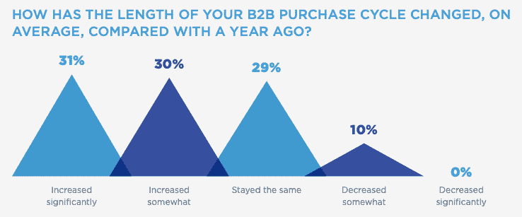

B2B purchase cycle length (Image source: B2B Buyer’s Survey Report)

“买家之旅”涵盖了消费者的整个研究阶段。从最初的需求意识，到评估备选方案，直到最终决定与哪家公司合作。

如今，人们不会在广播或报纸上听到一个新品牌，而是立即购买。相反，他们在出现在你的商店或接触到你的网站之前，至少会在多个频道或设备之间跳来跳去十几次。

我们已经在 Kinsta 亲眼目睹了这一切。人们不只是注册一个新的主机提供商，这是一个完整的过程。在考虑做出决定之前，他们可能会考虑我们的 10 多个竞争对手。

从消费者的角度来看，这就是买家的旅程。

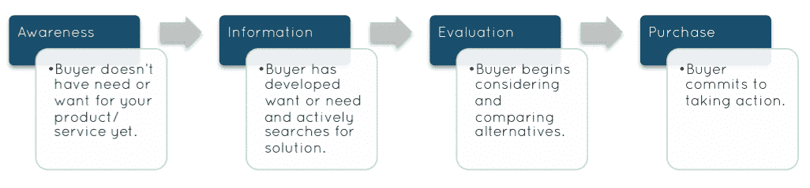

Buyer journey

最初，买家并不真正知道他们想要什么或需要什么。这就是为什么你仍然需要展示广告或社交更新来吸引他们的眼球。

只有当他们明白他们有问题时，他们才开始寻找信息。一旦他们了解了情况，他们就会进入评估阶段，在最终扣下隐喻的扳机之前，积累他们的备选方案。

谷歌称这个“主动研究”阶段为“零关键时刻”。在有人拿起电话或在他们的地址栏中输入你的网址之前，它包含了所有这些活动。

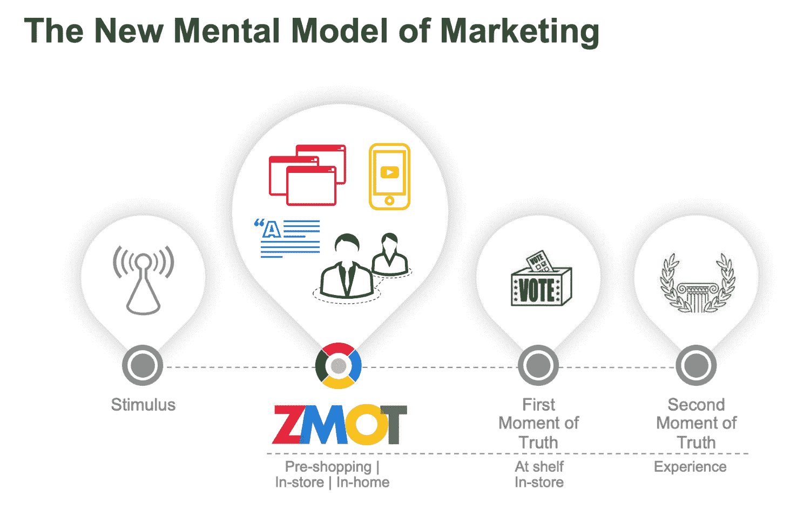

Zero Moment of Truth (ZMOT) Image Source: [Google](https://www.thinkwithgoogle.com/consumer-insights/zmot-voting-study/)

见见马库斯。他是这一部分虚构但现实的英雄。他购买一本简单的书的方式模仿了你的客户现在是如何做研究的，以便让你在竞争中胜出。

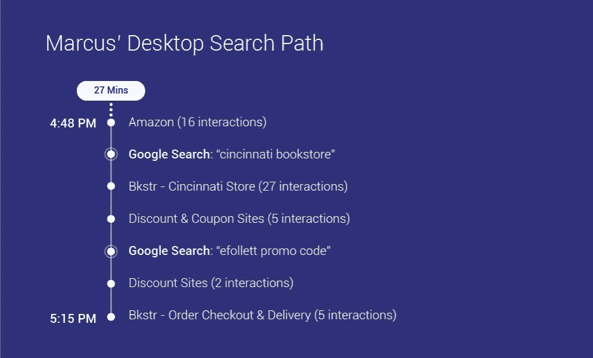

Desktop search path (Image source: [Think with Google](https://www.thinkwithgoogle.com/consumer-insights/consumer-journey-path-to-purchase/))

与亚马逊的十六种不同互动。两个谷歌搜索(一个位置，一个品牌)。与基于优惠券的联盟网站的七次互动。最后在你的店里再加一次购物。

这听起来像很多东西，因为它是。

如果你把营销渠道叠加起来，同样的旅程看起来会是这样的。

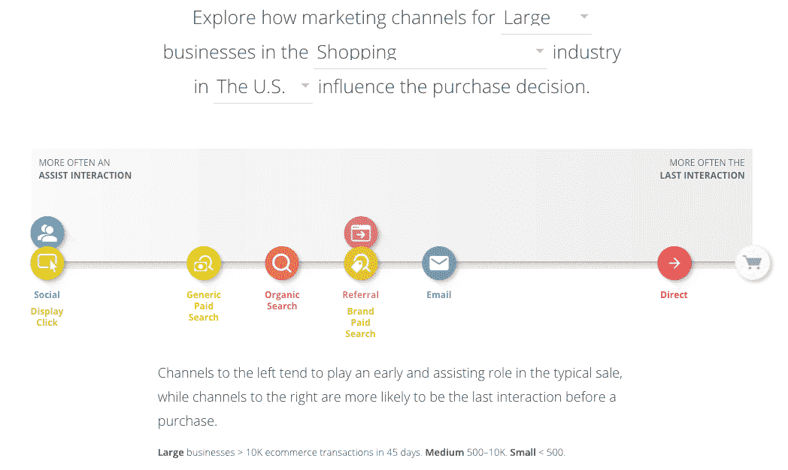

Marketing channels purchase decision

你在一开始就有社交和展示。普通搜索变成了有机搜索和付费搜索。然后，在有人直接购买之前，你有一个电子邮件推荐。

啰嗦点？

集客营销不是某种时尚、趋势或概念。这在今天是必要的，因为它反映了消费者的行为方式。这意味着你需要在每一个点上出现——否则，销售就会流向其他人。

塞思·戈丁十多年前令人信服地称之为。他的[许可营销](https://www.amazon.com/Permission-Marketing-Turning-Strangers-Customers/dp/0684856360)比[集客营销](https://www.amazon.com/Inbound-Marketing-Found-Google-Social/dp/0470499311/)至少早了十年。这要求我们从传统的以广播为基础的打扰他人的世界进化到一个顾客可以找到你的新世界(而不是相反)。

## 内向营销与外向营销

集客营销中的“集客”指的是公司如何应对新客户行为的巨大转变。

关键是，当人们在购买过程中四处奔波时，你要努力把他们拉进你的影响范围。

相比之下，过去几年中基于外发的方法，其要点是向许多随机的人*推送* *你的信息*，希望只引起少数人的共鸣。

几年前，给人们发垃圾邮件，给他们打电话，这已经足够好了。今天，它不是。不是因为这些策略本身就不好。而是因为它们不再像过去那样有效地工作(理解为:每一美元支出的收入)。

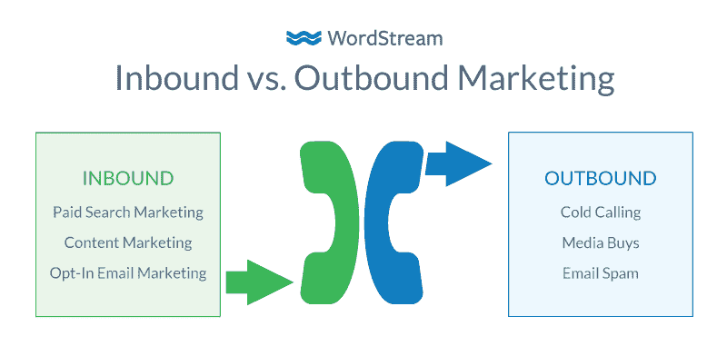

Inbound marketing vs. Outbound marketing (Image source: [WordStream](https://www.wordstream.com/outbound-marketing))

人们经常把“内向营销和外向营销”听起来像是哲学辩论。但本质上，它不是。

### 与出站相比，入站以更低的成本转化更多的销售线索

营销团队和营销资金正从电话营销转向付费搜索或内容营销，因为这些在 T2 工作得更好。

例如，HubSpot 的最新报告称，只有 [18%的营销人员](https://www.hubspot.com/marketing-statistics)通过对外活动找到了最佳线索。

为什么这么低？相反，人们用什么来获得成功呢？

另外，79%的营销人员认为电子邮件等渠道是最有效的需求挖掘渠道。

逻辑很简单:

与外向销售线索相比，内向销售线索的成本更低，转化率更高。

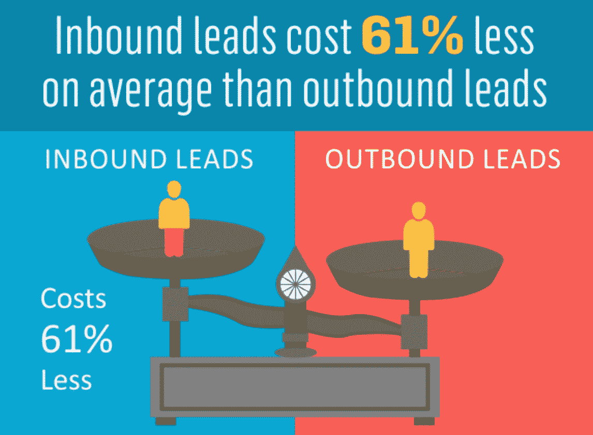

Inbound leads vs. outbound leads (Image source: [Invesp](https://www.invespcro.com/blog/how-effective-is-inbound-marketing/))

首先，数字渠道对中小型公司的进入门槛较低。电视广告的初始预算？别问了。但是你可以花几百美元开始使用 AdWords。

第二，基于意图的营销自然表现更好，因为它的目标人群已经对你卖的东西表达了兴趣。

在网上，AdWords [通常比社交渠道转化得更好。为什么？因为如果有人输入“红色耐克男式跑步鞋”，他们很可能有兴趣购买红色耐克男式跑步鞋。](https://adespresso.com/blog/facebook-ads-vs-google-ads/)

这种类似激光的焦点在其他任何地方都不存在。

打电话给某个五年没休假的过度劳累的中层经理，谈论你的分时度假计划是不会有好结果的。因为他们已经五年没有休假了。

但是向搜索“卡那帕里，毛伊岛海滨分时度假”的人推销分时度假？现在你有所发现了。

### 进站可能比出站需要更长的时间才能开始产生结果

不幸的是，“内向还是外向”的争论并不都是阳光和彩虹。

是的，总有一天，你的内向营销活动会比外向营销活动事半功倍。

然而，这也是一个挑战:“及时。”

出站方法可能会失去其成本效益。但它们通常仍是将被动的人转化为下周或下个月顾客的最佳方式。

相比之下，集客活动可能需要更长的时间来增加和取代相同的交易流程。

尼尔·帕特尔在过去的几年里已经建立了几个有数百万访问者的博客，从“疯狂的鸡蛋”,到“快速发芽”, Kissmetrics 和 NeilPatel.com。

他说需要两年时间才能看到显著的效果。

你可以通过浏览[广告](https://kinsta.com/blog/how-to-use-google-adwords/)和[重新定位](https://kinsta.com/blog/ad-retargeting/)来找到捷径。但是，从依赖于数量的基于中断的活动过渡到更有针对性的方法，优先考虑更少但更好的线索，仍然需要一些时间。

不过，这不是唯一的区别。

### 入站需要一个协作团队。出站不会

外向策略往往在真空中运作。想象一下陌生电话。这些如何影响你在电视广告上看到的转化？他们没有。

## 注册订阅时事通讯

### 想知道我们是怎么让流量增长超过 1000%的吗？

加入 20，000 多名获得我们每周时事通讯和内部消息的人的行列吧！

[Subscribe Now](#newsletter)

两种截然不同的活动。你可以让完全不同的人(或公司)同时管理两者，从不说话，但仍能看到很好的结果。

你不能对集客策略说同样的话，其中一个元素，如内容质量，影响从搜索引擎优化到 CRO 再到广告的所有方面的表现。

换句话说，提高内容质量，你也可以提升其他领域的表现。

这意味着你的个人战术需要协同工作。这意味着您的人员、团队、合作伙伴和部门也需要这样做。

HubSpot 前营销副总裁 Mike Volpe 建议通过漏斗阶段招聘员工。虽然一开始你可能会让一个人做所有的事情，但是随着你的成长，你应该根据目标而不是渠道来增加团队成员:

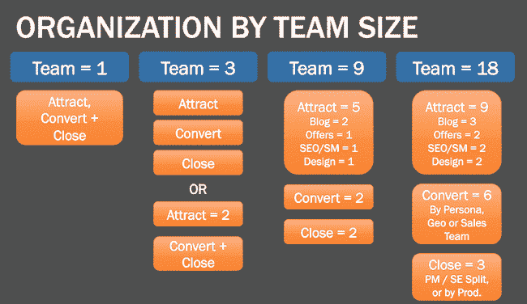

Inbound team by size (Image source: [HubSpot](https://blog.hubspot.com/marketing/how-to-structure-marketing-team))

在面对传统的[对外营销](https://kinsta.com/blog/outbound-marketing/)时，围绕漏斗阶段的组织团队占据主导地位，在传统的对外营销中，你有专门的广告、公关等筒仓。

在这里，你还有广告和公关的人。但他们可能会在一个“吸引”团队下一起工作。

所以这不一定像“是时候开博客了”那么简单然而，随着时间的推移，有了正确的预期和投资，集客营销不仅可以改变人们如何找到你的公司，还可以影响你的底线。

## 集客营销如何运作

集客营销不会重新发明轮子。它只是利用了人们在网上的行为方式。这意味着你所要做的只是调整你的策略(帖子、广告等)。)每个阶段都把人们从一个阶段推向下一个阶段。

以内容为例。每一部分内容都有其用途。所以你不会只是随意发表博文，就好像你在清单上勾划待办事项一样。

相反，你应该为每个漏斗阶段创建内容。以下是方法。

### 意识

人们可能不知道他们需要你的产品或服务。

所以不要指望他们开口要。你必须逆流而上，瞄准他们头脑中最重要的话题、议题和问题。

这主要适用于热门博客内容，比如你正在阅读的这篇文章。这也是像 HubSpot 这样的公司经常一天发布十次的原因。把它想象成一个更好的展示广告，只需要投资一次，它就会永远存在。通过使用 SEO 和内容，我们能够在短短 13 个月内[将我们在 Kinsta 的流量增加 571%](https://kinsta.com/blog/wordpress-seo/) 。

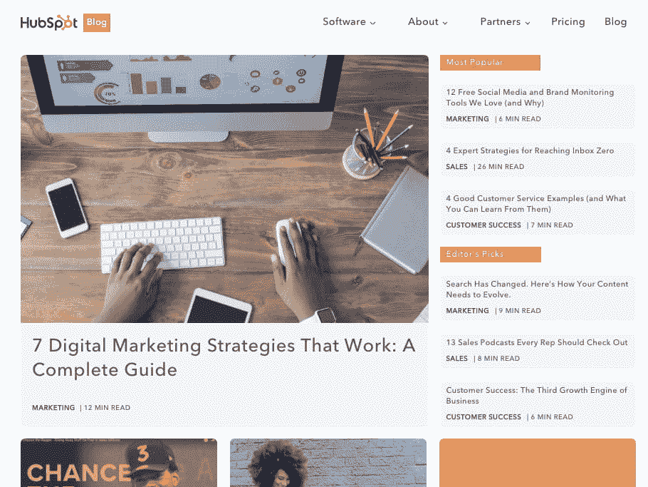

Top funnel blog content

因此，试图用“你需要一个水管工大师的 X 个理由”来“吸引”一个人还不太管用。

处于这一过程早期的人们需要一个催化剂或问题来激励他们首先开始寻找。

更有可能是马桶或水龙头坏了。他们的垃圾处理器停止工作。厨房的水槽不排水，已经三天了，吃剩的食物开始发出难闻的气味。

这就是问题的信号。这就是为什么他们开始搜索“我的水槽不排水的 X 个原因”或“DIY 厨房水槽修理”

看到了吗？仍然没有“水管工”。所以我跳过广告，直接看视频。

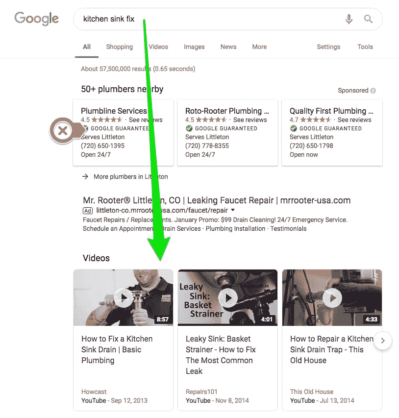

Searching for problem fix – SERP

原因是因为我还没准备好买。我的搜索查询表明我正在寻找一个答案，而不是一个解决方案。

Struggling with downtime and WordPress problems? Kinsta is the hosting solution designed to save you time! [Check out our features](https://kinsta.com/features/)

如果你是一名水管工，你现在有两个目标:

1.  创建相关的内容来回答这个人的问题(例如，关于如何修理排水管的建议，而不是关于你是多么了不起的水管工)，以及
2.  让对方意识到这可能是几个不同的问题，它们都需要一些时间来解决，而且还会有点糟糕。

第二部分是你如何通过培养*需求意识*从 A -> B 得到某人。

一些人看得越多或看得越多，他们开始意识到他们需要的不是一个如何修理水槽的视频。他们需要的是一个友好的、有知识的、快速过来为他们解决问题的人，因为他们没有时间或耐心去处理这个问题。

这就是你把一个寻找信息的人转变成一个可能成为买家的人。

### 考虑

最后一步的唯一目标是发展品牌知名度。随便你怎么称呼它。眼球很好。交通很理想。因为你有几个技巧可以利用，重新定位这些网站访问者回来或者接受你的下一级报价。

因此，即使他们不记得你，即使他们在访问你的网站后的第二天没有在你的网站上做任何事情，你仍然可以在网络上跟随他们，直到他们给你第二次机会。

然后，你有几个选择。

你可以握着他们的手，像夏尔巴人一样引导他们安全地进入考虑阶段，并像电子书一样简单地选择加入。

或者，你可以提前计划，展示他们下一步要去的地方:谷歌。

人们在漏斗的每个阶段使用[不同类型的关键词](https://kinsta.com/blog/keyword-research/)。

在考虑阶段，他们会更具体地询问如何找到问题的潜在解决方案。换句话说，“你如何找到一个好的水管工。”问题是他们仍然没有询问“管道报价”反正还没有。所以留到下一步吧。

相反，他们在寻找如何比较水管工，以找到最好的一个。

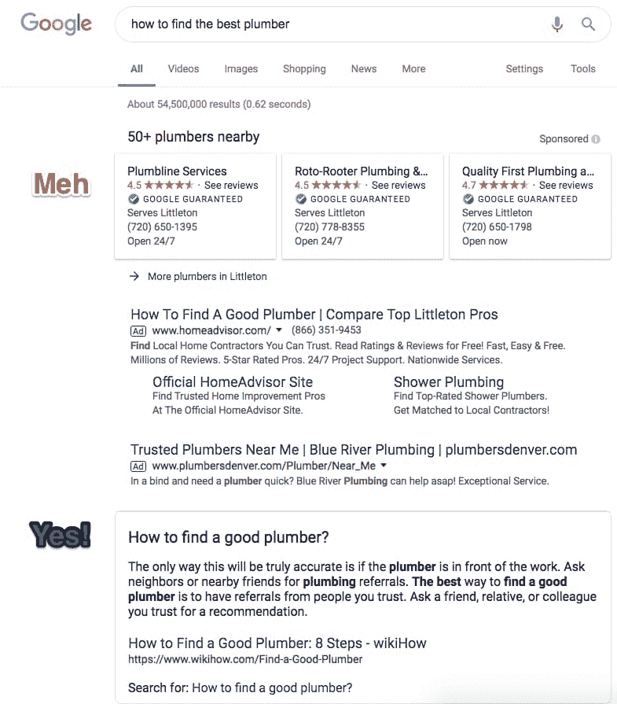

Find solution or provider in SERPs

考虑阶段的内容可以包括许多事情。深度指南效果很好。案例研究和白皮书也是如此。

这些作品，再加上回头客，也应该开始成为那些可下载资源的选择加入的果实。

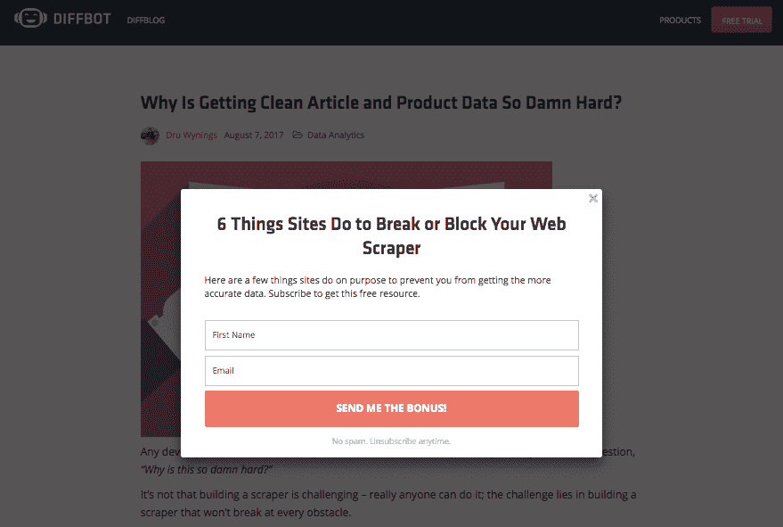

Bonus content CTA

在进入决策阶段之前，还有两个快速警告。

首先，不，选择加入并不是必需的。可以说，世界正在远离它。但是你确实需要一种方法来持续跟踪那些对你所提供的东西表示出一定程度兴趣的人。(哪怕只是看一两个帖子。)

收集电子邮件可以让你明智地跟进，根据某人含蓄地告诉你他们感兴趣的内容发送相关内容或报价。

这并不意味着你向每个人发送普通的简讯。这意味着将您发送的内容与最初将它们带到您的网站的原始问题或痛点联系起来。

Qualified leads

然后，你可以使用任意数量的工具(HubSpot、ActiveCampaign、Infusionsoft、Ontraport、 [Mailchimp](https://kinsta.com/blog/how-to-use-mailchimp/) 等)。)来定义这些规则以及人们在采取(或不采取)行动后应该得到什么。

这里的第二个要点是，不是每个人都会像这样整齐地从一个阶段走到另一个阶段。不幸的是，现实生活并没有那么简单。很有可能，他们会跳来跳去，在这里或那里跳过几步。

但是没关系。这些漫长的过程的全部意义在于最终尽可能多的转化潜在的人。建立一个像这样的逻辑系统就是这样做的。

### 决定

最后。你已经有了意识。你已经将这种转瞬即逝的意识转化为对你的业务的实际考虑。

这是你冲过终点线的地方。

这是人们开始关注你的功能、演示和定价页面的地方。他们正在深入本质，在做出最终决定之前，将你和其他几个候选人进行对比。

因此，尽管这听起来很老套，但是要让他们很容易找到这些东西！

Hootsuite 使用了一个简单的平台布局，并计划在前面和中心。深入每一项，你会看到他们品牌中每一个提升价值的细节。

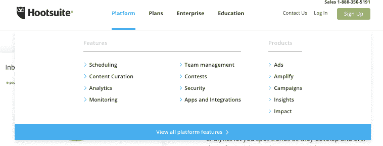

Platform and plans example

让我们把这个带回去给水管工。

我刚刚在谷歌上搜索了一个[的随机网站](https://www.diamondbackplumbing.com/)，向你展示这是如何运作的。我们的厨房水槽出了点问题，所以我们回到最初的问题上来，看看这个完美的页面:

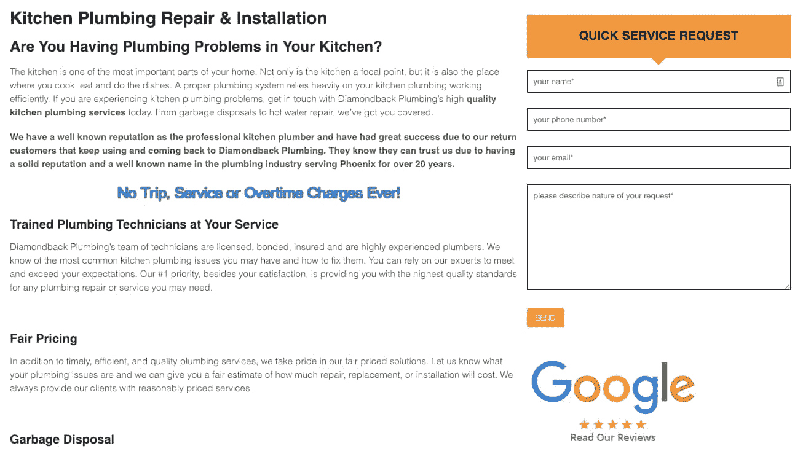

Answering questions page

先把设计放在一边，内容和布局是完全正确的。它回答了我们最初共同关心的问题(厨房/垃圾处理问题)。它甚至回答了我们通常遇到的水管工的问题(训练有素的技术人员，透明的价格，甚至还有一点社会证明)。

紧挨着这几页的是优惠券页——这是让像我这样骑墙派度过难关最终给他们打电话的绝佳机会。

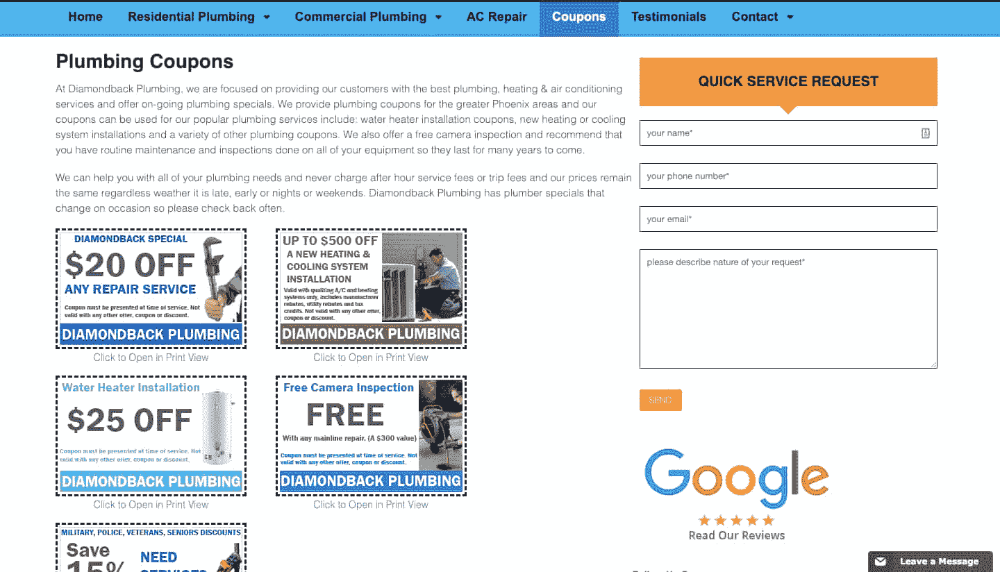

Coupon page

总而言之，还是蛮不错的！他们已经掌握了所有的基本知识。他们的“漏斗”应该表现不错。

在这一点上，唯一的潜在瓶颈是漏斗的顶部和整个“两年的事情”[开始增加流量](https://kinsta.com/blog/how-to-drive-traffic-to-your-website/)——无论是通过提高知名度的博客帖子还是直接进入 AdWords——他们应该很快就能通过他们的网站产生真正的买家。

所有这些，只要花费呼叫中心或广告牌宣传活动的一小部分成本，就可能让他们望而却步。

## 摘要

目前，集客营销受到了很多关注。这是理所当然的:它可以帮助你**以一些其他渠道可能会花费你的一小部分成本**获得更多的线索和销售。

但是简单的时髦并不是它如此成功的原因。它之所以有效，是因为它与客户已经在做的事情完全一致。它符合他们的行为，有助于在他们最需要的时候为他们提供正确的内容或优惠或活动。

好消息是，与大多数其他形式的广告和推广相比，它的启动成本要低得多。进入壁垒(从纯粹的财务角度来看)一点也不坏。如果你是一家初创公司或自助公司，可能没有巨额广告预算或对外销售团队，这一点可能非常重要。

[The secret to taking your business to the next level? 👀 Leaning in to inbound marketing! 💰Click to Tweet](https://twitter.com/intent/tweet?url=https%3A%2F%2Fbit.ly%2F2C6FU3J&via=kinsta&text=The+secret+to+taking+your+business+to+the+next+level%3F+%F0%9F%91%80+Leaning+in+to+inbound+marketing%21+%F0%9F%92%B0&hashtags=inboundmarketing%2Cstartups)

不利的一面是，可能需要几周、几个月甚至几年的时间，才能最终盖过你目前从其他渠道看到的交易流。要把所有的拼图拼在一起，需要一种不同的心态。

但是一旦你到了那里？你永远不会回头。

* * *

让你所有的[应用程序](https://kinsta.com/application-hosting/)、[数据库](https://kinsta.com/database-hosting/)和 [WordPress 网站](https://kinsta.com/wordpress-hosting/)在线并在一个屋檐下。我们功能丰富的高性能云平台包括:

*   在 MyKinsta 仪表盘中轻松设置和管理
*   24/7 专家支持
*   最好的谷歌云平台硬件和网络，由 Kubernetes 提供最大的可扩展性
*   面向速度和安全性的企业级 Cloudflare 集成
*   全球受众覆盖全球多达 35 个数据中心和 275 多个 pop

在第一个月使用托管的[应用程序或托管](https://kinsta.com/application-hosting/)的[数据库，您可以享受 20 美元的优惠，亲自测试一下。探索我们的](https://kinsta.com/database-hosting/)[计划](https://kinsta.com/plans/)或[与销售人员交谈](https://kinsta.com/contact-us/)以找到最适合您的方式。*