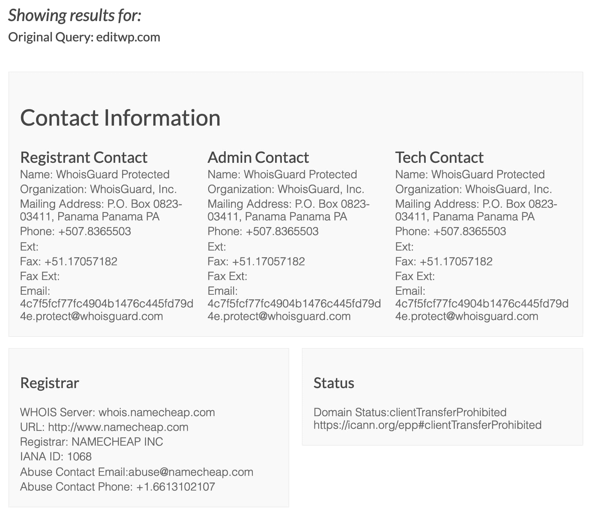
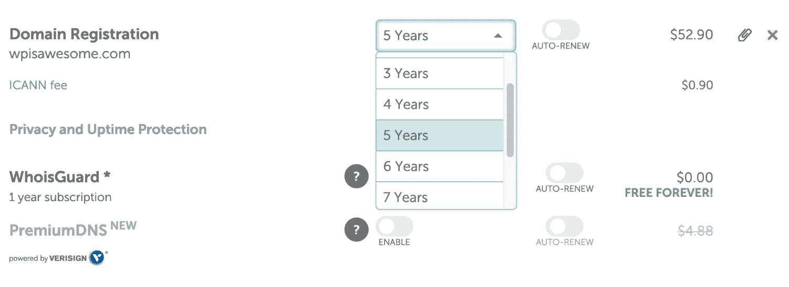

# 如何选择最好的域名注册商(我们的建议)

> 原文：<https://kinsta.com/blog/best-domain-registrar/>

建立一个网站的第一步(有时更困难)是什么？是的，域名。有时候这很容易——如果你已经有了一个公司名称，或者如果你用你的姓和名。但有时这需要深思熟虑，考虑搜索引擎、品牌认知度以及你最终可能会花多少钱。虽然[想出最好的域名](https://kinsta.com/blog/choose-domain-name/)可能很棘手，但我们在这里帮助你选择最好的域名注册商。

你已经看到这些域名注册商无处不在——从流行的 [GoDaddy](https://kinsta.com/godaddy-alternative/) 商业广告到网上的廉价广告。注册服务商提供搜索工具来寻找可用的域名和扩展名。然后，他们[把域名](https://kinsta.com/blog/how-to-sell-a-domain-name/)卖给你。

一些注册服务商甚至提供托管、网站建设和电子邮件地址等附加服务。但是所有的域名注册商都是一样的吗？让我们找出答案。

*   [什么是域名注册商？](#what-is-domain-registrar)
*   [成就卓越域名注册商的产品](#domain-registrar-offerings)
*   [避开具有以下特征的域名注册商](#domain-registrar-avoid)
*   [最佳域名注册商选项(最有信誉)](#best-domain-registrar-options)

## 什么是域名注册商？

域名注册商是一家管理和代理互联网上唯一域名销售的公司。要销售域名，该公司必须获得互联网名称与数字地址分配机构( [ICANN](https://www.icann.org/) )或国家代码顶级域名的认可。一些最常见的通用顶级域名(gTLD)扩展如下。com，。网，。一些国家代码顶级域名(ccTLD)的例子包括。德，。英国，法国

Support

## 成为优秀域名注册商的产品

并非所有的域名注册商都提供相同的服务质量。事实上，你会偶然发现一些你根本不想花钱买的东西。例如，一些域名注册商缺乏可以出售的顶级域名(TLD)的数量。[TLD 是畴变](https://kinsta.com/knowledgebase/what-is-a-tld/)的象。com，。拥有一个不断发布新顶级域名并努力提供尽可能多的域名的注册商是件好事。

也就是说，记住一些域名注册商专注于利基域名也是很重要的，比如像。de 或 in。

简而言之，似乎所有的域名注册商都是一样的。然而，稍加研究，你会发现它们中的许多都有更低的价格，更好的安全性，等等。

这里有几样东西需要寻找。

> Kinsta 把我宠坏了，所以我现在要求每个供应商都提供这样的服务。我们还试图通过我们的 SaaS 工具支持达到这一水平。
> 
> <footer class="wp-block-kinsta-client-quote__footer">
> 
> 
> 
> <cite class="wp-block-kinsta-client-quote__cite">Suganthan Mohanadasan from @Suganthanmn</cite></footer>

[View plans](https://kinsta.com/plans/)

### 低价

与生活中的大多数事情一样，消费者倾向于通过比较价格来开始购物。虽然我们并不总是同意这是最好的方法，但事情就是这样做的。支持是很重要的，即使是域名注册商，但这与 Kinsta 的托管计划有所不同。在大多数情况下，在[购买域名](https://kinsta.com/blog/how-much-does-a-domain-name-cost/)后，你可能全年只需要与域名注册商互动一两次。许多人根本不需要任何支持。

因此，域名注册商的定价非常重要。毕竟，你已经为每月的主机服务和潜在的其他项目如主题和插件付费了。为什么要在一个域名上花太多钱？

不仅如此，域名也是出了名的便宜。有时你可以找到一些每年 1 美元或 2 美元的好交易，平均每年 10 到 12 美元。那还不算太糟！

Cheap domain name

因此，你应该避免任何域名注册商试图卖给你比这高得多的东西。此外，我们强烈建议您不要受到域名经纪人或疯狂高价卖家的诱惑。

本质上这意味着有一些人持有更有价值的域名，并试图以数百或数千美元的价格出售。“完美”域名的诱惑似乎太强了，但我向你保证，域名不会成就或毁掉你的生意。

通常用更便宜的替代品会更好。除非你像格伦一样，在域名上花了 2 万美元，发现了一个难以置信的商机。

### 免费 WHOIS 保护

所有域名都可以使用一种叫做 [WHOIS 查询工具](https://whois.icann.org/en)的东西进行搜索。本质上，ICANN 要求将所有域名联系信息显示给公众。这包括您用来注册域名的大部分详细信息:

*   名字
*   地址
*   电话号码
*   电子邮件地址

您的敏感信息不会显示出来，但是一些组织或个人不喜欢这些信息公开给任何人看。事实上，它唯一的好处是如果有人试图联系你(但这就是联系方式的作用！).

WHOIS guard

因为 ICANN，某种联系信息必须连接到你的域名。因此，一些最好的注册服务商会将你的个人信息与其公司的联系方式互换。因此，它会显示名称便宜作为注册服务商根据您的 WHOIS 查找。注册人联系人将显示 WhoisGuard Protected，而不是实际名称。

然而，自从 [GDPR](https://kinsta.com/blog/wordpress-gdpr-compliance/) 生效以来，它可能如何影响 WHOIS 中实际显示的信息量仍然是[悬而未决的问题。](https://www.lexology.com/library/detail.aspx?g=e8f0ac10-7e57-466e-8194-86ca9e02e15b)

我们最喜欢的域名注册商免费提供这种 WHOIS 隐私保护。如果没有，你通常需要支付年费或者留下你的联系方式。

### 注册时间表的几种选择

一两个月不能注册域名。法定最低期限是一年。因此，在寻找域名注册商时，你应该准备支付整整一年的费用。

然而，一些注册商要求你注册一年以上。如果你偶然发现一个这样的注册商，考虑去别处看看。

最好的情况是注册时间表有多种选择。

我们希望看到注册服务商提供一年、两年甚至更长时间的承诺。通过这种方式，您可以决定您希望拥有该域名多长时间，并有可能获得多年注册折扣。

Register domain for years with discount

你可以注册域名的最长时间是 10 年。十年后，你需要更新。

一般来说，我们建议注册一年，除非超过一年有很大的折扣。另外，**域名注册长度是一个 [SEO](https://kinsta.com/blog/what-does-seo-stand-for/) 排名因素是一个神话**！

> 大多数注册商不提供注册长度。这不是你想花你的“搜索引擎优化时间”。
> 
> — 👓约翰穆？人不是猫👓(@ JohnMu)[2016 年 11 月 3 日](https://twitter.com/JohnMu/status/794275121091510280?ref_src=twsrc%5Etfw)