# 如何将 WordPress.com 移民到 WordPress.org(分步指南)

> 原文：<https://kinsta.com/blog/wordpress-com-to-wordpress-org/>

需要从 WordPress.com 迁移到 WordPress.org 吗？通常，这意味着你已经准备好将你的博客或业务提升到一个新的高度！使用自托管解决方案为您的网站开辟了一个全新的定制选项和可能性领域。

在这篇文章中，我们将一步一步地向你展示如何[将你现有的 WordPress 站点](https://kinsta.com/blog/migrate-wordpress-site/)迁移到 Kinsta 的自托管 WordPress 站点。

Kinsta 确实提供免费迁移，但这不包括从其他平台如 WordPress.com 的迁移。这是两种截然不同的解决方案。迷茫？在我们关于 WordPress.com[和 WordPress.org](https://kinsta.com/blog/wordpress-com-vs-wordpress-org/)的文章中阅读更多差异。

你需要利用 WordPress.org 自托管解决方案来使用金斯塔的托管。

[Running on WordPress.com? Migrate to a self-hosted #WordPress site at Kinsta and take your business to the next level. 💪Click to Tweet](https://twitter.com/intent/tweet?url=https%3A%2F%2Fkinsta.com%2Fblog%2Fwordpress-com-to-wordpress-org%2F&via=kinsta&text=Running+on+WordPress.com%3F+Migrate+to+a+self-hosted+%23WordPress+site+at+Kinsta+and+take+your+business+to+the+next+level.+%F0%9F%92%AA&hashtags=webdev%2CWordPress)

## 您需要什么来开始

为了遵循这个教程，我们假设你已经注册了 Kinsta 托管。如果没有，你可以到这里[了解更多关于 Kinsta 的计划](https://kinsta.com/plans/)。

除了托管你的新 WordPress.org 网站，你还需要一个域名。

如果你从 WordPress.com 购买了一个自定义域名(例如，`yoursite.com`而不是`yoursite.wordpress.com`)，你还需要将该域名指向 Kinsta。

> 需要在这里大声喊出来。Kinsta 太神奇了，我用它做我的个人网站。支持是迅速和杰出的，他们的服务器是 WordPress 最快的。
> 
> <footer class="wp-block-kinsta-client-quote__footer">
> 
> 
> 
> <cite class="wp-block-kinsta-client-quote__cite">Phillip Stemann</cite></footer>

[View plans](https://kinsta.com/plans/)

为此，您可以在 WordPress.com 编辑您的 DNS 信息，并将其指向 Kinsta:

*   以下是如何[在 WordPress.com](https://en.support.wordpress.com/move-domain/change-name-servers/)编辑 DNS 信息
*   下面是如何[将 DNS 信息指向 Kinsta](https://kinsta.com/help/dns/)

或者，你可以选择[将你的域名转让给另一个注册商](https://en.support.wordpress.com/move-domain/transfer-domain-registration/)，然后指向 Kinsta。

如果你还没有自定义域名，你需要[从第三方服务购买一个](https://kinsta.com/blog/how-much-does-a-domain-name-cost/)——[我们推荐像 Google Domains 或 Namecheap](https://kinsta.com/blog/best-domain-registrar/) 这样的提供商。想出一个好域名有困难吗？看看关于[如何选择域名](https://kinsta.com/blog/choose-domain-name/)的一些提示。

一旦你注册了 Kinsta 托管服务并建立了你的顶级域名，下面是如何将 WordPress.com 迁移到 WordPress.org 的方法。

## 将 WordPress.com 迁移到 WordPress.org 的步骤

不幸的是，从 WordPress.com 搬到 WordPress.org 不能用标准的方式。为什么？因为他们不让你使用[迁移插件](https://kinsta.com/blog/wordpress-migration-plugins/)，而且他们也不提供 SSH 访问或者 [phpMyAdmin](https://kinsta.com/help/wordpress-phpmyadmin/) 。

为了让您了解将 WordPress.com 迁移到 WordPress.org 需要做些什么，以下是您需要采取的一些步骤:

1.  在 Kinsta 创建一个新的 WordPress 安装程序，并执行一些基本的日常工作
2.  从 WordPress.com 导出您的内容
3.  用 WordPress 导入工具将你的内容导入 WordPress
4.  如果使用`yoursite.wordpress.com` URL，将访问者重定向到您的新域(可选)

### 步骤 1:在 Kinsta 创建一个新的 WordPress 站点

首先，您需要创建一个全新的 WordPress.org 安装。

在 Kinsta，你可以在你的 [MyKinsta 仪表板](https://my.kinsta.com/login/)中进入**站点**选项卡，然后点击**添加站点**按钮:

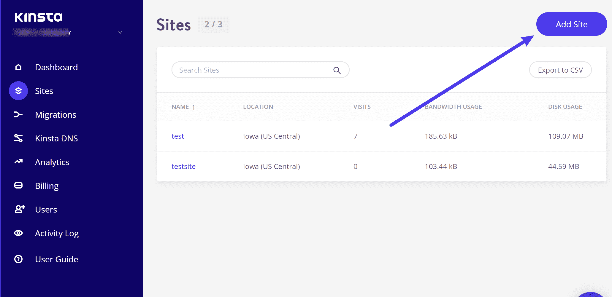

How to create a new WordPress installation

然后，按照弹出窗口中的步骤安装您的站点:

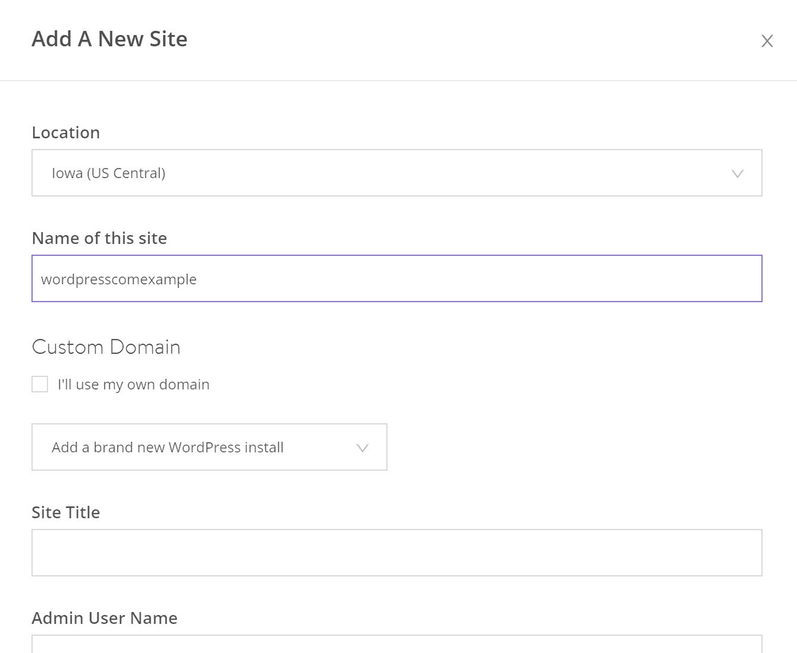

Fill in information for your WordPress install

你可以[在这里](https://kinsta.com/help/new-site/)查看更详细的教程。

一旦创建了新的 WordPress.org 安装，在导入 WordPress.com 内容之前，您需要做一些整理工作。

#### 设置永久链接

你的 [WordPress 站点的永久链接](https://kinsta.com/blog/wordpress-permalinks/)会影响你站点 URL 的[结构](https://kinsta.com/knowledgebase/what-is-a-wordpress-slug/)。

为了确保无缝过渡，您需要确保新的自托管 WordPress.org 安装使用与 WordPress.com 网站相同的 permalink 结构。

默认情况下，WordPress.com 网站使用**日期和名称**永久链接结构。

为了在你的 WordPress 网站上模仿这种永久链接结构，登录你自己的 WordPress 仪表盘，进入**设置→永久链接**。

然后，选择**日的选项并命名为**并保存您的更改:

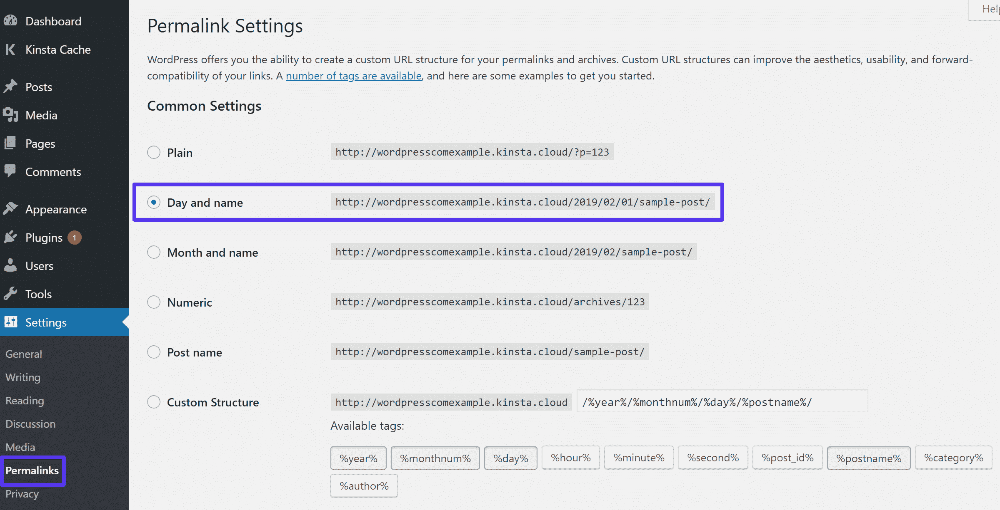

Set your permalink structure to match WordPress.com

如果你将来想改变你的永久链接结构，你可以随时[设置一个 301 重定向](https://kinsta.com/help/redirect-rules/)。如果需要，Kinsta 支持人员可以帮助您设置 301 重定向，以安全地更改您的 permalink 结构。

#### 安装你的 WordPress 主题

不幸的是，没有办法将你的 WordPress.com 主题直接导出到你的 WordPress.org 站点。

然而，许多(虽然不是全部)你会在 WordPress 发现的主题也可以在自托管的 WordPress 网站上找到。

例如，AltoFocus 主题在[WordPress.com](https://wordpress.com/theme/altofocus)和[WordPress.org](https://wordpress.org/themes/altofocus/)都有售。

这意味着，如果你的 WordPress.com 主题也可以在[WordPress.org 主题目录](https://wordpress.org/themes/)中找到，你可以简单地[在你新的 WordPress.org](https://kinsta.com/blog/how-to-install-a-wordpress-theme/)网站上安装一个新的主题副本。

为此，请在您的 WordPress.org 网站中进入**外观→主题**。然后，点击**添加新的**:

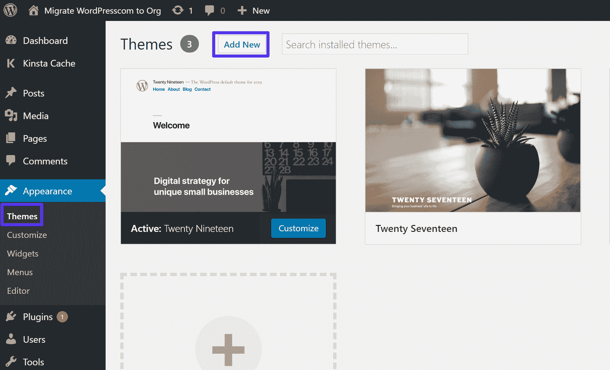

How to install a new WordPress theme

在那里，您可以按名称搜索您的主题并安装它:

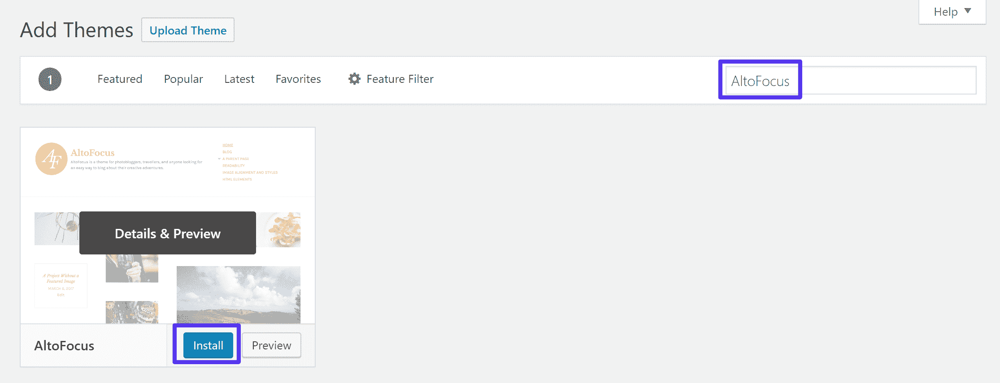

Example of installing a WordPress theme

### 步骤 2:从 WordPress.com 导出内容

接下来，你需要[导出你的 WordPress.com 站点](https://kinsta.com/knowledgebase/export-wordpress-site/#WordPress-com)的内容。然后，在下一步中，您将把这些内容导入到您在 Kinsta 的新 WordPress.org 站点中。

要导出您站点的内容，请转到您站点的 WordPress.com 仪表板。点击侧边栏中的**设置**选项。然后，向下滚动到底部，在**站点工具**下找到**导出**选项:

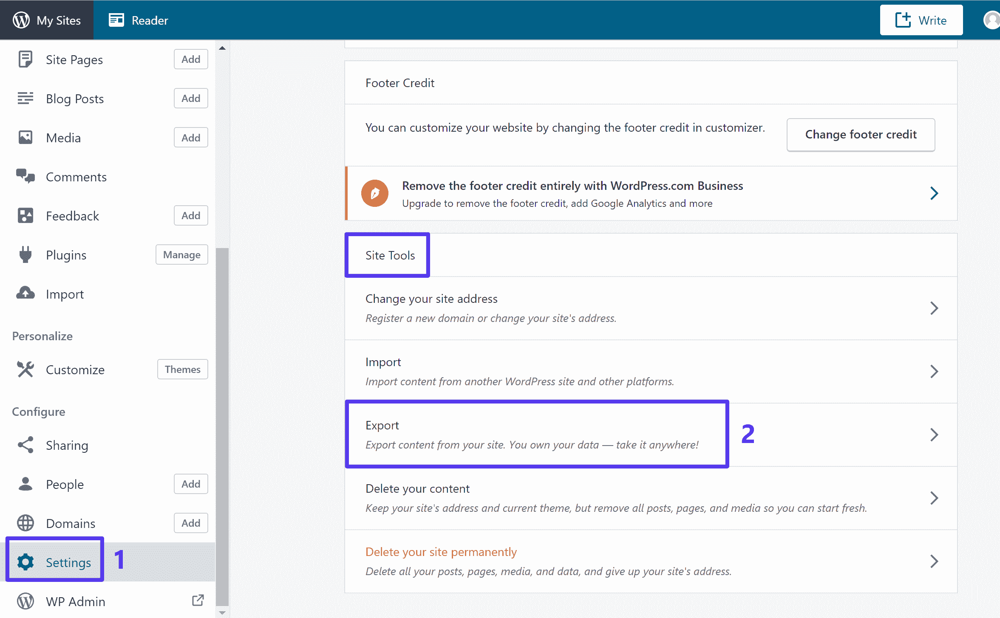

Access the WordPress.com Export settings

在下一个屏幕上，点击**导出您的内容**旁边的**导出全部**按钮:

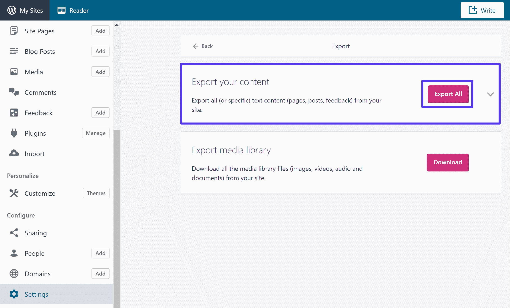

Export your content from WordPress.com

然后，您应该会在电子邮件中收到一个下载链接。或者，您可以点击界面中的**下载**链接:

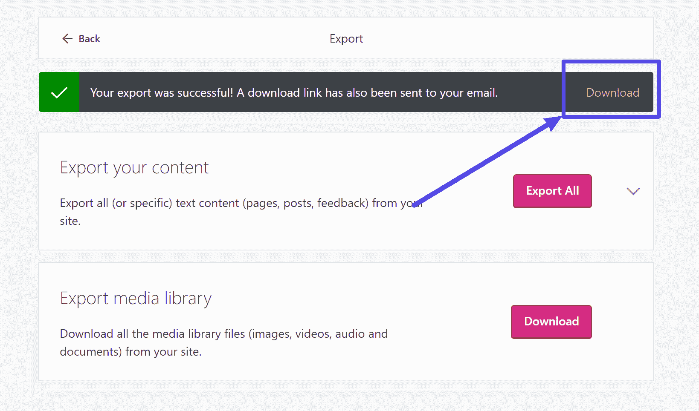

Download the file with your content

这会将一个 ZIP 文件下载到您的桌面上。下载完成后，您需要解压缩 ZIP 文件。如果您使用的是 Windows，您可以通过右键单击并选择 **Extract All:** 来完成

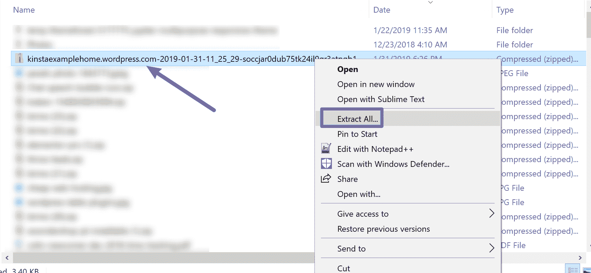

Extract the ZIP file that you downloaded

一旦您提取了 ZIP 文件的内容，您应该能够打开一个包含**的文件夹。xml** 文件。请将该文件放在手边，因为在下一步中会用到它。

### 步骤 3:将内容导入新的 WordPress.org 网站

接下来，转到你在步骤 1 中创建的 WordPress 站点的 WordPress 管理仪表板。

然后，进入**工具→导入**。找到 **WordPress** 工具，点击**立即安装**:

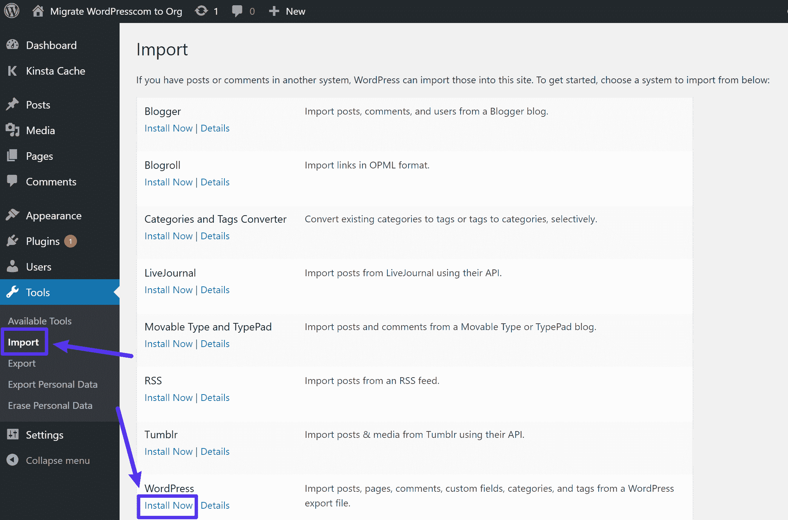

Install the WordPress Importer tool

短暂等待后，您应该会看到一个指向 **Run Importer** 的新链接。单击该链接继续该过程:

## 注册订阅时事通讯

### 想知道我们是怎么让流量增长超过 1000%的吗？

加入 20，000 多名获得我们每周时事通讯和内部消息的人的行列吧！

[Subscribe Now](#newsletter)

Run the WordPress Importer tool

在下一页，将提示您上传。您在上一步中从 WordPress.com 下载的 xml 文件:

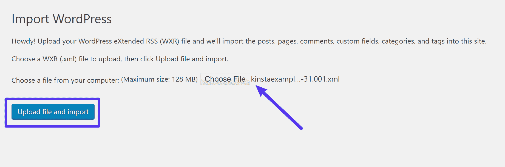

Upload the .xml file from WordPress.com

一旦你选择了。xml 文件，点击**上传文件，导入**。

如果您有很多内容，您可能需要等待一段时间。然后，您将看到两个选项:

*   分配作者
*   导入附件

对于**分配作者**部分，我们建议选择选项**将帖子分配给现有用户**，并从下拉列表中选择您的用户名。

然后，勾选复选框**下载并导入文件附件**。这将确保您的 WordPress.org 站点从您的 WordPress.com 站点导入所有图像。

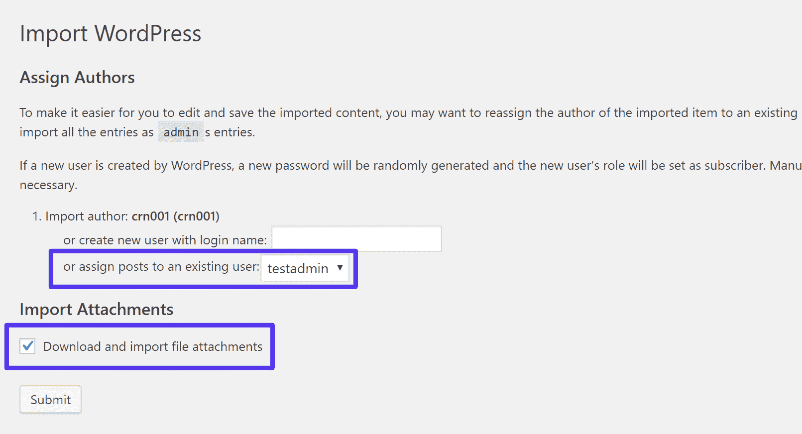

Configure the import settings

然后，点击**提交**。

该过程完成后，您应该会看到一条成功消息:

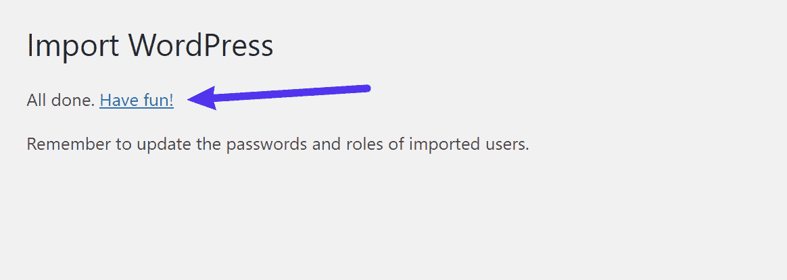

The import success message

现在，去你的网站四处看看。如果一切顺利，你的内容应该看起来和功能就像它在 WordPress.com。

如果有什么地方看起来不对劲——比如网址被破坏或图片丢失——以下是解决方法:

#### 修复 WordPress.com 迁移后损坏的网址

如果您在迁移过程中更改了 URL(比如从`yoursite.wordpress.com`迁移到`yoursite.com`，那么您的内容中可能会出现“损坏的”URL。

例如，如果你写了一篇博文，其中包含了一个链接，指向你网站上的另一篇博文，这个链接可能仍然会把人们带到`yoursite.wordpress.com/example`，而实际上它应该指向你 WordPress.org 网站上的同一篇博文——`yoursite.com/example`。

要解决这个问题，您可以使用 Kinsta 的[搜索和替换工具](https://kinsta.com/knowledgebase/wordpress-search-and-replace/)(可从 MyKinsta 仪表板中的**工具**选项卡获得):

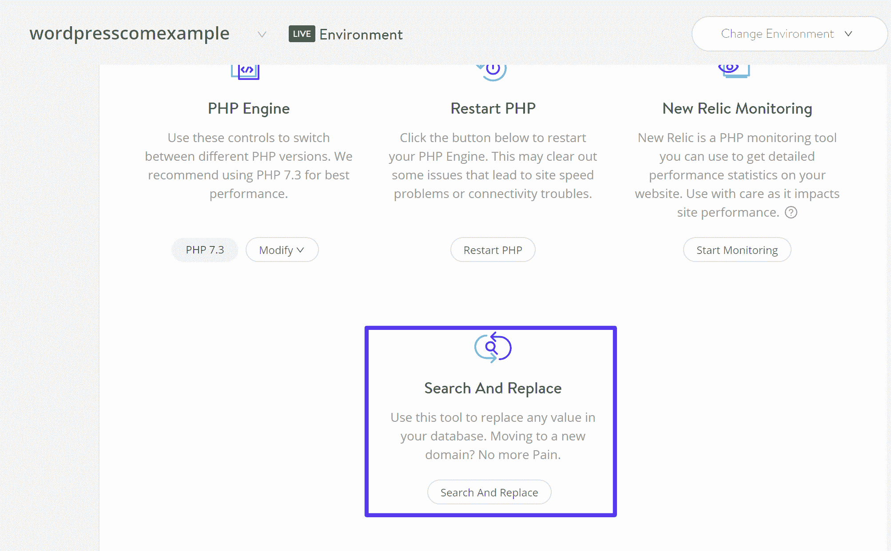

Kinsta Search And Replace tool

在**搜索**框中输入您在 WordPress.com 的旧网址，在**替换**框中输入您在 WordPress.org 的新网址。在这个例子中，我们使用你的临时地址。如果你已经有一个域名，你会想用它来代替。勾选**试运行**框，然后点击**替换**:

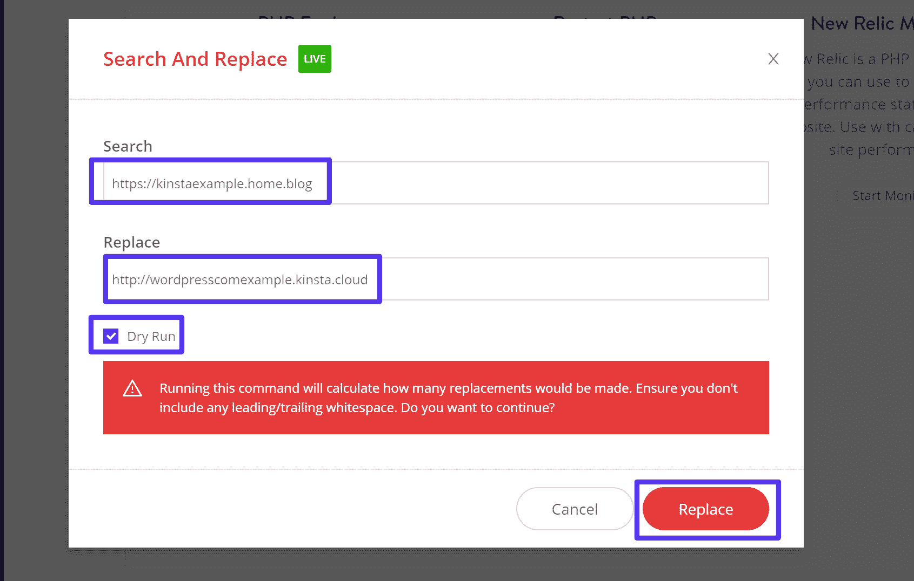

How to configure the Kinsta Search And Replace tool

您应该会看到该工具找到了多少潜在替代品的摘要。理想情况下，它应该是正数:

Struggling with downtime and WordPress problems? Kinsta is the hosting solution designed to save you time! [Check out our features](https://kinsta.com/features/)

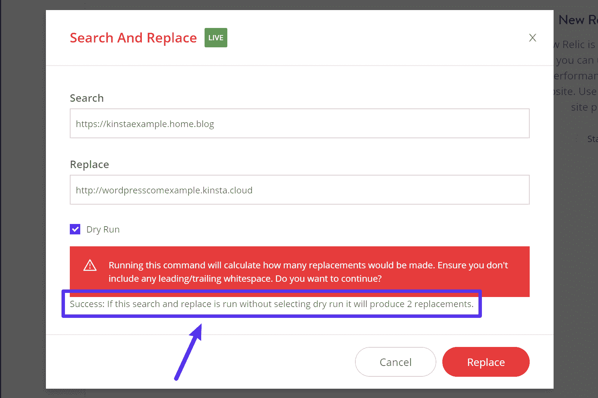

Look for the success message before unchecking the “Dry Run” box

一旦您确认正确输入了信息，取消勾选**试运行**框，并再次点击**替换**:

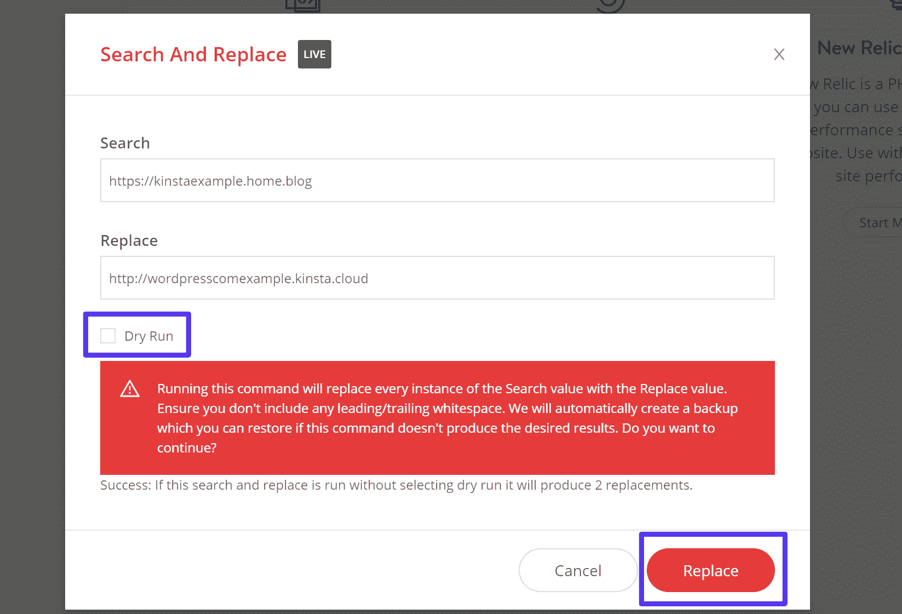

Uncheck the “Dry Run” box

### 修复 WordPress.com 迁移后丢失的图像

如果一切顺利，你应该马上就能看到所有的图像。然而，有时事情会出错，你可能会错过一些图像。

如果是这样的话，你可以使用[免费的自动上传图片插件](https://wordpress.org/plugins/auto-upload-images/)为你导入丢失的图片。

一旦你安装并激活了插件，进入你的 WordPress 仪表盘中的**帖子**区域。使用复选框选择您的所有帖子，然后从下拉列表中选择**编辑**。然后，点击**应用**:

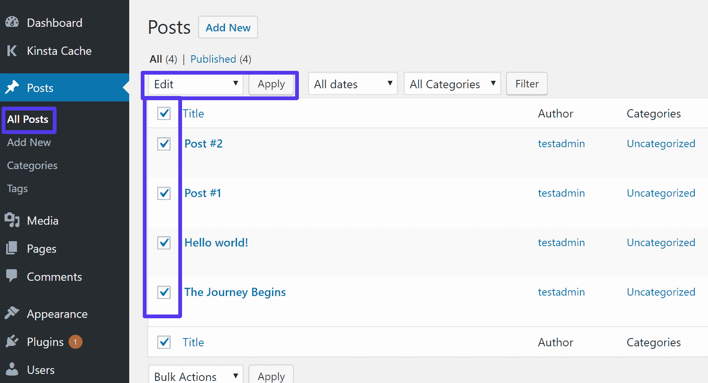

Select all your posts

这将打开一个新的界面。你只需要点击**更新**按钮，插件就会为你导入丢失的图像:

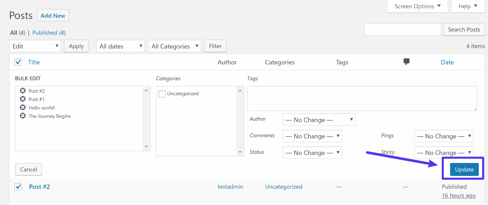

Update all of your posts

### 第四步:重定向 WordPress.com 网站到 WordPress.org(或使私人)

此时，您应该有一个工作的自托管 WordPress.org 网站，所有内容都来自 WordPress.com。

然而，还有一个重要的问题—**既然你已经把所有东西都搬走了，你的 WordPress.com 网站会怎么样？**

这里有两种潜在的情况，取决于你的 WordPress.com 网站的 URL。

#### WordPress.com 和 WordPress.org 的网址相同

如果你在 WordPress.com(`yoursite.com`)使用了自定义网址，并且在 WordPress.org(`yoursite.com`)使用了相同的自定义网址，那么你需要做的就是将你的旧 WordPress.com 网站设为私有。

要做到这一点，在你的 WordPress.com 仪表盘中进入**设置**区域，选择**隐私**设置下的**隐私**选项:

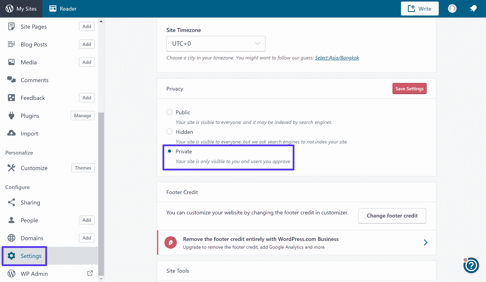

How to make your WordPress.com site private

#### WordPress.com 和 WordPress.org 的不同网址

如果你在从 WordPress.com 迁移到 WordPress.org 的过程中改变了你网站的 URL(例如从`yoursite.wordpress.com`到`yoursite.com`，那么事情就有点棘手了。

看，从技术上讲，你的网站会有两个重复的版本——一个在`yoursite.wordpress.com`另一个在`yoursite.com`。

这很糟糕，因为:

*   访问者可能会点击你以前的反向链接，然后转到`yoursite.wordpress.com`，而实际上你希望他们在`yoursite.com`
*   谷歌可能会看到重复的内容，并且不知道哪个网站应该在谷歌搜索中排名。

要解决这个问题，您可以设置**重定向**。通过重定向，任何试图访问`yoursite.wordpress.com`的人都将被直接带到`yoursite.com`。

WordPress.com 允许你这样做，但他们会收取你每年 13 美元的特权这样做。

虽然付钱从来都不是一件有趣的事，但是如果你已经有了一批现有的观众，并且在你做出改变的时候不想失去他们，那么这笔小小的费用是值得的。

要创建重定向，[转到此处](https://wordpress.com/domains/add/site-redirect)并选择您已迁移的站点:

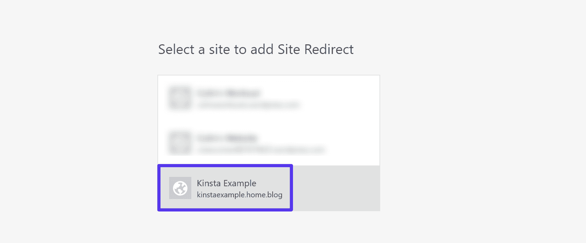

How to set up a redirect at WordPress.com

然后，在框中输入您的新域，并单击 **Go** :

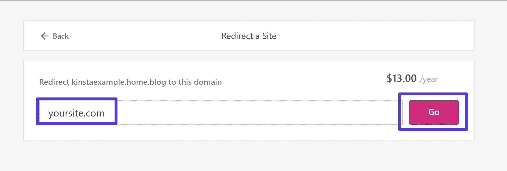

Enter new domain name

然后，你需要输入你的付款信息来完成这个过程。

如果你不想向 WordPress.com 支付每年 13 美元的费用，你也可以按照上一节的方法把你的旧网站变成私有网站。然而，你会失去所有的流量和链接到你的旧 WordPress.com 网站，这是不理想的。

### 使用 Jetpack 访问 WordPress.com 功能

至此，您差不多完成了！

然而，在我们结束本教程之前，我们将留给您一个提示:

如果你想获得一些 WordPress.com 的功能——比如你的 WordPress.com 网站的订户——你可以使用免费的 [Jetpack 插件](https://kinsta.com/knowledgebase/wordpress-jetpack/)将你的 WordPress.org 网站连接到 WordPress.com，并获得你以前拥有的许多相同的功能。

Jetpack 是由 Automattic 开发的——WordPress.com 背后的同一家公司——因此它能够无缝地将许多 WordPress.com 功能添加到您的新 WordPress.org 网站。

## 摘要

从 WordPress.com 搬到 WordPress.org 可能是一段激动人心的时光。这通常意味着你已经准备好采取下一步行动，完全控制你的网站。你能做的事情的可能性是无限的！

如果你在从 WordPress 迁移到 WordPress 的过程中遇到任何麻烦，你可以随时[雇佣一个 WordPress 开发者](https://kinsta.com/blog/hire-wordpress-developer/)。这些类型的项目对于经验丰富的开发人员来说很容易，他们可以很快让你的 WordPress 站点在 Kinsta 上运行起来。

对于上面的迁移指南，您还有其他问题吗？请在评论中告诉我们。

* * *

让你所有的[应用程序](https://kinsta.com/application-hosting/)、[数据库](https://kinsta.com/database-hosting/)和 [WordPress 网站](https://kinsta.com/wordpress-hosting/)在线并在一个屋檐下。我们功能丰富的高性能云平台包括:

*   在 MyKinsta 仪表盘中轻松设置和管理
*   24/7 专家支持
*   最好的谷歌云平台硬件和网络，由 Kubernetes 提供最大的可扩展性
*   面向速度和安全性的企业级 Cloudflare 集成
*   全球受众覆盖全球多达 35 个数据中心和 275 多个 pop

在第一个月使用托管的[应用程序或托管](https://kinsta.com/application-hosting/)的[数据库，您可以享受 20 美元的优惠，亲自测试一下。探索我们的](https://kinsta.com/database-hosting/)[计划](https://kinsta.com/plans/)或[与销售人员交谈](https://kinsta.com/contact-us/)以找到最适合您的方式。