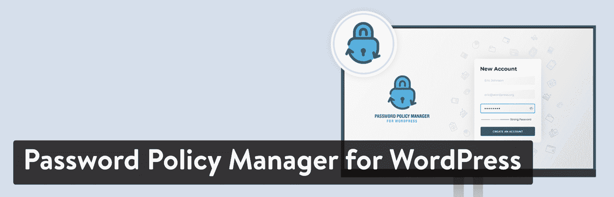

# 金斯塔·金并:罗伯特·阿贝拉访谈

> 原文：<https://kinsta.com/blog/interview-robert-abela/>

罗伯特·阿贝拉是开发 WordPress 安全插件的欧洲公司 WP White Security 的首席执行官和创始人。他们也在博客上谈论所有与 WordPress 安全相关的事情。你可以在[的推特](https://twitter.com/robertabela)和[的 LinkedIn](https://www.linkedin.com/in/robertabela/) 上找到罗伯特。这是我们最近对他的采访，作为我们的[金斯塔·金并](https://kinsta.com/?post_type=post&s=kingpin)系列的一部分。

### Q1:你的背景是什么，你是如何开始使用 WordPress 的？

2013 年，我是一家安全软件公司的产品经理，我们的网站需要一个博客来分享我们的研究成果。在回顾了几个解决方案后，我们选择了 WordPress。作为一家安全软件公司，我们也对 WordPress 的安全方面感兴趣，并对当时 WordPress 是多么容易成为攻击目标感到惊讶。我们自己为 WordPress 开发了一个在线安全服务，但它从未真正起飞。当我们开始使用 WordPress 时，我也开始关注 WordPress 社区，并对以 WordPress 为生的人数感到惊讶。我决定单干，开始提供 WordPress 安全服务——我开始清理被黑的网站，做安全加固。作为自由职业者，我需要一个 WordPress 的活动日志解决方案，所以我开始开发 WP 安全审计日志。剩下的就是历史了。

### Q2:读者应该知道你最近在 WordPress 做了些什么？

我有一个关于 WordPress 安全的博客，我和其他几个人在这里写关于安全的文章，主要关注 WordPress 安全。我也管理一个团队，我们开发一些插件。我们的旗舰产品是 WP 安全审计日志，一个 [WordPress 活动日志插件](https://www.wpsecurityauditlog.com/)。它允许 WordPress 站点和多站点网络所有者保持一个全面的日志，记录他们站点上发生的事情。最近，我们为它发布了一个名为 MainWP 活动日志的扩展，它允许 MainWP 用户在一个中心位置，即 MainWP 仪表板，查看他们网络上所有子网站的活动日志。它还记录 MainWP 网络上发生的变化。

WordPress track user activity

我们还为 WordPress 开发了一个名为[密码策略管理器的插件。有了这个插件，网站管理员可以配置策略来执行强 WordPress 密码。当我读到一些关于有多少人使用弱密码的统计数据时，我有了这个插件的想法，尽管 WordPress 推荐使用强密码。](https://www.wpwhitesecurity.com/wordpress-plugins/password-policy-manager-wordpress/)

Password Policy Manager for WordPress plugin

我们正在开发其他几个插件，应该会在 2019 年推出。我们的重点将始终是具有特定角色的插件，为不喜欢一体化插件的用户提供一种选择。

### Q3:你在创业过程中遇到了哪些挑战？

在开始插件项目之前，我的工作经历是 QA、系统工程、研究、产品和项目管理。所以我可以读和写代码，并做了相当多的脚本，但我不是一个开发人员。但是，我确实开发了 WP 安全审计日志插件的原型！不过，我需要一个开发人员来帮助我进一步开发它。所以我花了五年时间做咨询和其他工作，给开发商发工资。更糟糕的是，我找不到一个愿意致力于这个项目的开发者，因为这个插件不够大，而且当时也不能保证每个月的具体工作时间。所以在前三年，我经常更换开发人员。然而，随着插件的增长，需要更多的工时，我能够找到长期合作的人。然而，找到好的开发者从来都不容易！

## 注册订阅时事通讯

### 想知道我们是怎么让流量增长超过 1000%的吗？

加入 20，000 多名获得我们每周时事通讯和内部消息的人的行列吧！

[Subscribe Now](#newsletter)

### 在 WordPress 的世界里，有没有什么让你感到惊讶的事情？

WordPress 社区中人们的开放和友好让我吃惊。我在非 WordPress 的公司工作了 13 年，这是如此的不同。你看不到竞争企业的员工混在一起，一切都是秘密。WordPress 社区则相反——大多数供应商愿意帮助和分享想法。许多人发布了他们的年终报告，并非常乐意分享对他们有用或无用的细节。因此，如果你正在创业或者已经有了自己的事业，你会发现很多关于如何成功创业的信息和建议。

### Q5:你认为 WordPress 世界的未来会是怎样的？

我们正专注于长期的比赛计划。未来几年，我们希望:

Struggling with downtime and WordPress problems? Kinsta is the hosting solution designed to save you time! [Check out our features](https://kinsta.com/features/)

1.  使 WP 安全审计日志更容易使用:该插件是一个非常全面的活动日志解决方案插件，所以有时它可能是非技术用户压倒性的解决方案。所以我们正在改进插件的用户界面和用户体验。我们已经发布了一些更新来解决这个问题，但我们才刚刚开始。
2.  扩展对第三方插件的支持:到今天为止，WP 安全审计日志插件保留了 WooCommerce 产品和商店更改的详细的[活动日志](https://www.wpsecurityauditlog.com/woocommerce-activity-log-datasheet/)，Yoast SEO 插件设置和 post SEO 更改，bbPress，以及其他几个。展望未来，我们希望分配更多的资源，并与其他插件开发者密切合作，以支持更多的插件。
3.  开发更多的 WordPress 插件:我对更多的 WordPress 插件有一些想法，所以在接下来的几年里，我们将(希望)发布更多的插件。目的是有一个 WordPress 插件的集合来解决特定的利基问题。

### 你在 WordPress 主机中寻找什么？

我所有的网站都是从爱好开始的，所以在那个阶段，价格是最重要的因素。然而，随着网站开始增长并产生收入，价格仍然是一个因素，但它不是一切。以下是我为我的商业网站寻找的一些东西:**优秀的客户支持:对我来说，这是最重要的。**事情可能会出错，也会出现网站或服务器无法访问的情况。客户支持人员是在这种情况下可以挽救局面的人，所以他们需要反应迅速，消息灵通，以便能够帮助您在最短的时间内恢复网站。可靠和坚实的基础设施:这两者是相辅相成的。可靠性是通过坚实的基础设施实现的。了解虚拟主机可靠性的最好方法是阅读评论，向他们的销售团队询问信息，甚至是他们的大客户的推荐信。性能:一个快速网站的非常重要的因素。如今，一些网站主机提供定制的缓存和 CDN 解决方案，这对繁忙的网站至关重要。成本:虚拟主机不是你每个月都要换的，所以我也寻找有长期计划的虚拟主机。比如提前一年付款就有折扣。

### 问题 7:当你离开笔记本电脑时，你喜欢做什么？

我真的很喜欢户外，所以只要有可能，我要么跑步，要么徒步旅行，要么骑山地车。我也参加过一些耐力赛。

Robert Abela biking

### 问题 8:接下来我们应该采访谁&为什么？

我在 WordPress 社区遇到了很多有趣的人。但是如果我必须推荐一个人，我会建议面试 Akshat Choudhary。我在莱顿的第一届欧洲世界夏令营遇见了他。他在一个已经拥挤的市场上创立了在线 WordPress 备份服务 BlogVault 和 WordPress 安全服务 Malcare，但是他成功了。因此，我相信他对自己面临的挑战有一些有趣的见解。

* * *

让你所有的[应用程序](https://kinsta.com/application-hosting/)、[数据库](https://kinsta.com/database-hosting/)和 [WordPress 网站](https://kinsta.com/wordpress-hosting/)在线并在一个屋檐下。我们功能丰富的高性能云平台包括:

*   在 MyKinsta 仪表盘中轻松设置和管理
*   24/7 专家支持
*   最好的谷歌云平台硬件和网络，由 Kubernetes 提供最大的可扩展性
*   面向速度和安全性的企业级 Cloudflare 集成
*   全球受众覆盖全球多达 35 个数据中心和 275 多个 pop

Test it yourself with $20 off your first month of [Application Hosting](https://kinsta.com/application-hosting/) or [Database Hosting](https://kinsta.com/database-hosting/). Explore our [plans](https://kinsta.com/plans/) or [talk to sales](https://kinsta.com/contact-us/) to find your best fit.