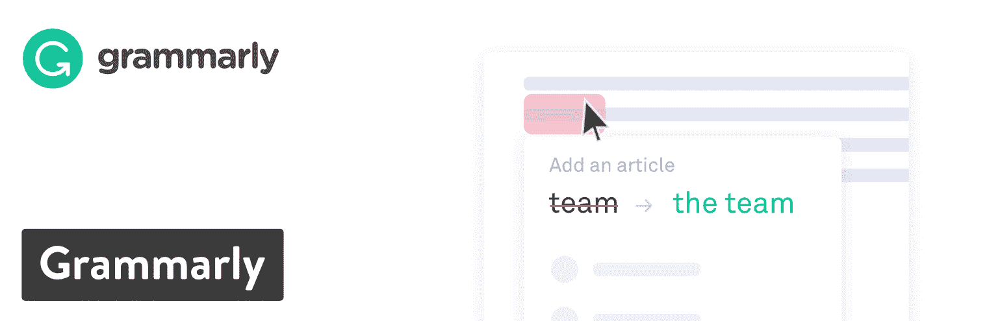
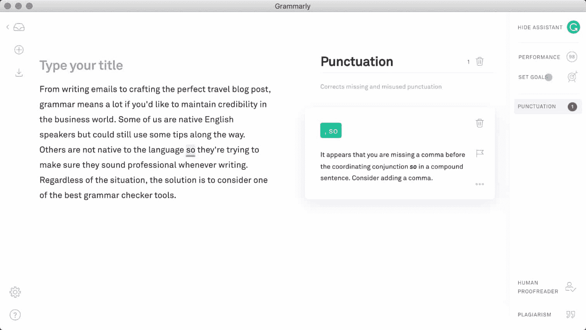
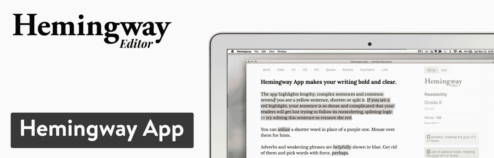
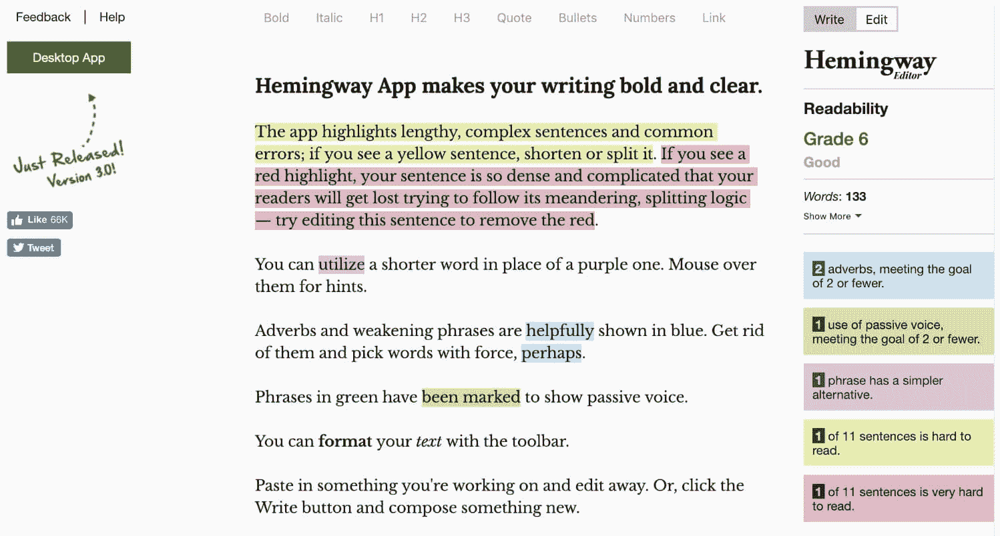
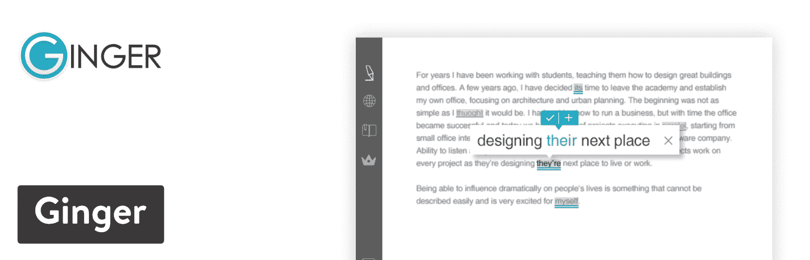
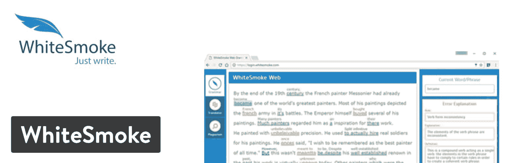
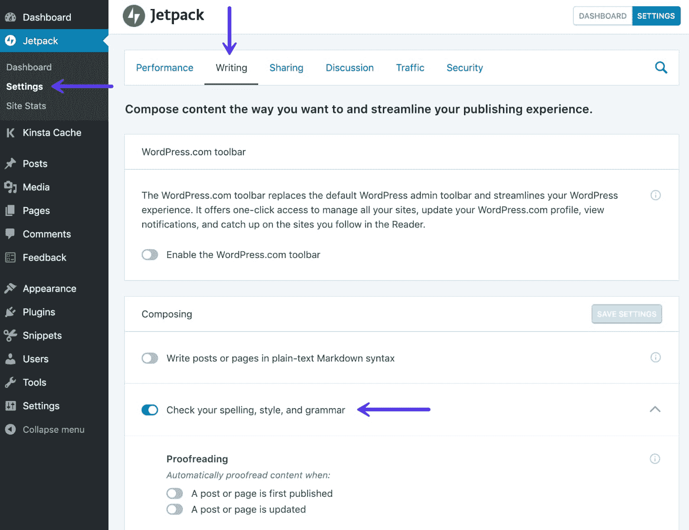
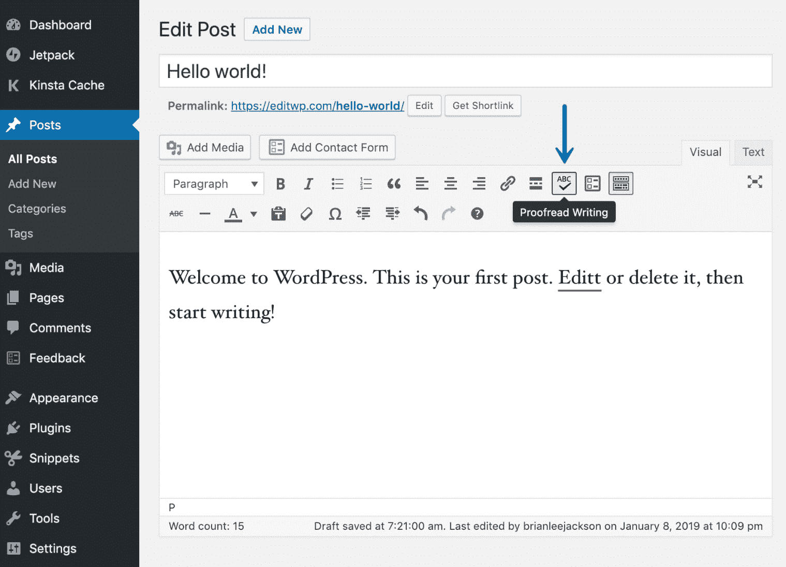
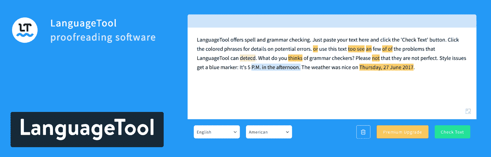
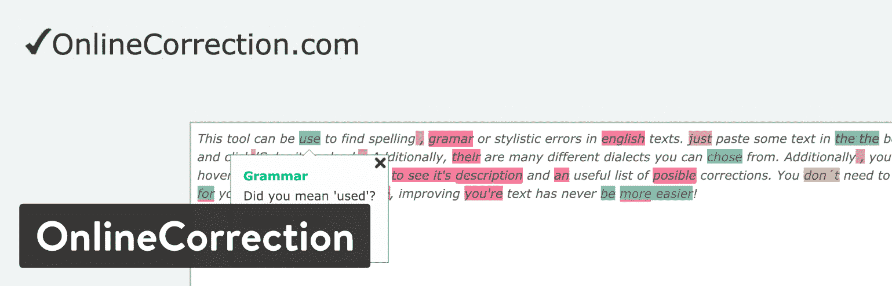

# 写作和 WordPress 的最佳语法检查工具

> 原文：<https://kinsta.com/blog/grammar-checker-tools/>

从[写电子邮件](https://kinsta.com/blog/email-marketing-best-practices/)到精心制作完美的旅游博客文章，**如果你想在商业世界中保持信誉**，语法很重要。我们中的一些人以英语为母语，但仍然可以在这个过程中使用一些技巧。其他人不是这门语言的母语，所以无论何时写作，他们都试图确保自己听起来很专业。不管是哪种情况，解决方案都是考虑最好的语法检查工具之一。

[Some might think grammar checking solutions are a crutch, but nobody is perfect. ✍️ Take advantage of these tools to fix mistakes.Click to Tweet](https://twitter.com/intent/tweet?url=https%3A%2F%2Fkinsta.com%2Fblog%2Fgrammar-checker-tools%2F&via=kinsta&text=Some+might+think+grammar+checking+solutions+are+a+crutch%2C+but+nobody+is+perfect.+%E2%9C%8D%EF%B8%8F+Take+advantage+of+these+tools+to+fix+mistakes.&hashtags=blogging%2Ccontentmarketing)

我们特别喜欢与 WordPress 和其他电子邮件和社交媒体在线应用集成的语法检查器。拥有一个本地应用也是一个优势，因为没有人需要再打开一个标签页。

我们的一些建议更侧重于小众需求，例如纠正被动语态和切换语言。但是我们会把它们全部覆盖！请继续阅读，了解当今市场上最好的语法检查选项。

## 最佳语法检查选项

1.  [语法](#grammarly)
2.  [海明威 App](#hemingway-app)
3.  [姜](#ginger)
4.  [白烟](#whitesmoke)
5.  [喷气背包](#jetpack)
6.  [语言工具](#language-tool)
7.  [在线校正](#onlinecorrection)

列表中所有的语法检查都经过了我们团队的测试和认可。前两个(Grammarly 和 Hemingway 应用程序)经常被 Kinsta 团队用来在 WordPress 中查找语法错误，避免发布前的被动语态，以及仅仅发现我们可能会忽略的错误。👍

同样重要的是要认识到，如今许多公司分布在全球各地，远程办公。这意味着你团队中的许多人可能不会把英语作为他们的第一语言。

例如，Kinsta 的团队成员会说各种语言！从匈牙利语到西班牙语、法语和英语。在这些情况下，语法检查工具变得非常重要！

> 需要在这里大声喊出来。Kinsta 太神奇了，我用它做我的个人网站。支持是迅速和杰出的，他们的服务器是 WordPress 最快的。
> 
> <footer class="wp-block-kinsta-client-quote__footer">
> 
> 
> 
> <cite class="wp-block-kinsta-client-quote__cite">Phillip Stemann</cite></footer>

[View plans](https://kinsta.com/plans/)

## 1.语法上

Grammarly 不仅是最受欢迎和最好的语法检查工具之一，它还为那些使用 WordPress 和其他在线写作程序的人提供了一些优秀的集成。首先，Grammarly 有一个免费的 Chrome [扩展，可以校对](https://chrome.google.com/webstore/detail/grammarly-for-chrome/kbfnbcaeplbcioakkpcpgfkobkghlhen)，并建议在你的浏览器中进行编辑。因此，当 WordPress 打开时，你可以期待看到语法工作，就像在 Gmail、[、Google Docs](https://kinsta.com/blog/google-docs-to-wordpress/) 和社交媒体账户等其他程序中一样。

Grammarly

语法不仅仅是拼写检查。它旨在根据你已经写过的内容来润色你的语法和拼写。由于这种方法，语法上可以识别弱形容词、拼写错误的单词、缺少的冠词和不正确的逗号用法。更重要的是，语法上提供了错误解释，以便你在未来提高写作水平。

基本的 Chrome 扩展是免费的。这个扩展激活了大多数基于浏览器的应用程序中各种各样的语法功能。此外，还可以免费下载适用于微软 Office 的 Grammarly 版本，以及适用于 Windows 和 Mac 的[原生应用](https://www.grammarly.com/native/)。

Grammarly Mac app

也就是说，一些个人和组织可能想要更高级的语法特性。在这种情况下，Grammarly 提供了一个每月 29.95 美元的[高级版本](https://www.grammarly.com/premium)，如果你按年付费，则每月 11.66 美元。这是对原始扩展的扩展，增加了一些特性，比如对句子结构的高级检查、词汇建议和特定于体裁的风格分析。

### 为什么它是 WordPress 最好的语法检查工具之一

*   免费的 Chrome 扩展提供了关键的语法和拼写检查，比常规的拼写检查更先进。
*   你可以升级获得一些令人难以置信的功能，如剽窃检测器和高级上下文检查器。
*   Chrome 应用程序会在几秒钟内自动安装到您的浏览器中，并开始在 WordPress、Gmail、Google Docs 和其他应用程序中运行，而无需配置任何设置。
*   每周的进度报告和错误解释确保你不会把语法当作拐杖，而是从错误中学习。
*   与常规拼写检查不同，语法检查会检查更复杂的错误，比如主谓一致和逗号拼接。
*   您可以选择保存并从任何计算机上访问您过去的工作。
*   语法存储您的个人字典，以便它纠正或忽略您经常使用的某些单词。
*   您可以在某些网站上禁用语法功能。例如，它在某些网站上可能不太好用，或者你可能会发现你不需要它来完成某些任务。
*   原生应用程序运行良好，所以你不需要担心书签或保持另一个标签打开。

## 2.海明威应用程序

海明威应用程序与你的标准语法检查器略有不同。这是因为它努力使你的写作更加简洁、活跃和吸引人。它是以欧内斯特·海明威的名字命名的，他以在写作中包含生动的细节，同时仍然使用简短清晰的句子而闻名。不仅如此，他还专注于总是使用主动语态而不是被动语态。因此，海明威应用程序让你粘贴你的写作(或在应用程序中写作)。然后，它为可读性提供一个等级，同时还告诉您以下内容:

*   使用了多少个副词(越少越好)。
*   你用了多少次被动语态。
*   如果一些短语有更简单的替代词。
*   如果你的一些句子很难读懂。

Hemingway App

海明威应用程序没有直接的 WordPress 插件或与你的浏览器一起使用的 [Chrome 扩展，但对于那些想让他们的写作更熟练的人来说，它仍然是一个必不可少的语法检查工具。我们建议在 WordPress(或任何你最喜欢的文字处理器)中写你的文章，然后在发表前将成品复制到海明威应用程序中。这样，你不仅能知道自己做错了什么，还能在别人阅读之前清理被动语态之类的东西。](https://kinsta.com/blog/best-chrome-extensions/)

Hemingway App

海明威应用程序的在线版本完全免费供您使用。如果你想在 Mac 或 Windows 电脑上安装该工具的原生版本，你也可以考虑售价 19.99 美元的桌面应用。桌面应用的好消息是，它可以直接与 WordPress 集成，实现一键发布流程。

### 为什么它是 WordPress 最好的语法检查工具之一

*   这个免费的工具可以在你的浏览器上找到，允许你在出版前快速复制你的文本。
*   它侧重于纠正被动语态、副词、复杂句子等问题。
*   你会得到一个可读性分数，这样你就能确切地知道你的读者会如何看待你的作品。
*   这款免费应用还包括一些简单的指标，如阅读时间、单词、句子和段落。
*   付费桌面版仅为 19.99 美元的一次性费用。
*   有了桌面版本，你不需要互联网连接，它与 WordPress 连接，你可以导出到微软 Word 和其他编辑器。

## 3.精力

Ginger 软件声称是世界上最好的语法检查工具，所以我们来测试一下。事实证明，这是一个与 Grammarly 类似的绝妙选择。你首先要安装免费的 Ginger Chrome 扩展。之后，你在 WordPress 或其他文字处理软件中的作品会被分析语法、拼写和上下文错误。你甚至可以在像 [Slack](https://kinsta.com/blog/how-to-use-slack/) 、Twitter、LinkedIn 和 Gmail 这样的应用中利用 Ginger。

语法检查器是你在修改写作时会注意到的主要工具，但是 Ginger 也提供了翻译、句子重组和字典查找的工具。Ginger 的唯一问题是令人垂涎的语法检查器实际上并不包含在免费版本中。免费的 Chrome 扩展只有翻译和定义，没有别的。

Ginger

为了激活用于语法检查、句子重组和错误分析的工具，需要高级版本。该计划每月起价 12.48 美元，但前提是你要按年付费。每月的标准价格是 20.97 美元。总的来说，Ginger 是一个高质量的语法检查器，但它更像是一个高级解决方案，你必须付费才能获得最好的特性。

### 为什么它是 WordPress 最好的语法检查工具之一

*   界面简洁、用户友好，支持语法检查、句子重组和文本阅读。
*   有一个免费的翻译和定义的 Chrome 扩展。
*   如果你是按年付费的话，价格就不会那么高。
*   Ginger 会在你输入各种在线应用时进行校对，比如 Gmail、WordPress 和 Slack。
*   它提供了私人教练功能，帮助你随着时间的推移提高你的英语水平。
*   文本阅读器功能允许你听你写的文本，看看它听起来怎么样。
*   您可以在多种设备上书写时使用 Ginger，如电话、计算机和 Microsoft Office 内部。

## 4.白烟

当你写文章、论文或电子邮件时，白烟软件会完成几项测试。WhiteSmoke 有三种独立的产品，它们都完成类似的任务。这完全取决于你使用的程序和设备。

## 注册订阅时事通讯

### 想知道我们是怎么让流量增长超过 1000%的吗？

加入 20，000 多名获得我们每周时事通讯和内部消息的人的行列吧！

[Subscribe Now](#newsletter)

第一个叫做桌面高级版，可以在 Windows 和所有主流桌面浏览器上运行。第二个叫 WhiteSmoke Web，不是原生软件，是基于浏览器的桌面高级版。最后，移动应用程序确保您的所有文本、移动电子邮件和其他通信在您的智能手机和平板电脑上以正确的方式进行。

WhiteSmoke

WhiteSmoke 没有免费计划，但定价从每月 8.33 美元开始，根据你需要的功能，每月高达 22.99 美元。这些价格是针对预付一整年费用的。如果你选择三年付款计划，你也可以选择将价格减半。

### 为什么它是 WordPress 最好的语法检查工具之一

*   WhiteSmoke 附带了数百个电子邮件和文档模板，可以让你的写作有一个良好的开端。
*   虽然 WhiteSmoke 没有免费版本，但收费计划相当实惠，功能集使其物超所值。
*   这是为数不多的语法检查工具之一，它有一个可行的移动应用程序，可以让你在移动设备上保持书写整洁。
*   包括一个剽窃检查器，以确保你没有抄袭别人的作品。
*   你可以把你的作品翻译成其他几种语言。
*   有些计划既适用于 Windows 电脑，也适用于 Mac 电脑。
*   WhiteSmoke 可以在 Microsoft Office 和 Gmail 中即时校对你的工作。
*   当你在浏览器中打开 WordPress 的时候，这个软件看起来运行得很好。

## 5.喷气背包

你可能对作为 WordPress 的一体化插件的 Jetpack 很熟悉。从社交媒体分享到安全工具，你可以利用一切。这只是 Jetpack 所能做的一小部分，但总的来说，对于那些不想在一个 WordPress 网站上安装几十个插件的人来说，这是一个不错的选择。

Jetpack 还提供语法检查和校对支持。这是由截止日期后的技术驱动的，这是一个开源的语法检查软件，在一些公司应用程序中使用，包括 WordPress.com。

Jetpack plugin

因为 Jetpack 使用 After The Deadline 作为它的语法检查器，所以你所要做的就是安装并激活 Jetpack 插件。然后，启用 Jetpack 设置中的“检查拼写、风格和语法”选项。

Enable Jetpack grammar and spell checking

之后，文章和页面的文本编辑器中会出现一个校对按钮。

Proofreading writing with Jetpack

由于这是在 Deadline 技术之后，软件会检查用词不当、拼写问题、风格问题和语法错误。Jetpack 校对最有趣的部分之一是它还检查糟糕的写作——如双重否定、隐藏动词和冒犯性语言。

Struggling with downtime and WordPress problems? Kinsta is the hosting solution designed to save you time! [Check out our features](https://kinsta.com/features/)

Jetpack 中的一些功能需要付费，但校对和语法检查工具是免费的。

### 为什么它是 WordPress 最好的语法检查工具之一

*   Jetpack 是 WordPress 上最常用的插件之一，所以你知道它在写作时会很好用。
*   您还可以通过 Jetpack 获得其他一些工具。其中包括 SEO、安全、社交媒体等功能强大的选项。
*   Jetpack 语法检查器是免费的。
*   您可以选择打开/关闭一些校对设置。
*   风格选项包括检查行话、不良短语、复杂性和有偏见的语言。
*   语法检查不仅仅是为英语用户准备的。它还支持德语、法语、西班牙语和葡萄牙语。

## 6.语言工具

LanguageTool 是市场上最时尚、最好的语法检查工具之一，汇集了众多领域的精华。首先，你可以在语言工具主页上复制并粘贴一段文字。它还提供了一个评价很高的 Chrome 扩展，可以在所有你喜欢的网络应用程序中使用语法检查功能。这包括 Gmail、WordPress 和在线[文本编辑器](https://kinsta.com/blog/best-text-editors/)等选项。

高级版为您提供了更多的语法检查工具，并集成了 Microsft Word，所有这些每月只需 19 美元。如果你提前一年或三年付款，这个价格会降很多。

LanguageTool

考虑到您获得了大多数标准功能，免费版本非常适合大多数用户。唯一的限制是每次语法检查 20，000 个字符。所以，你可能会发现你的一些长篇文章不能利用 LanguageTool 技术。除此之外，我真的很喜欢语言工具对每个语法或拼写纠正的描述。这种解释会自动显示在建议框的顶部，而不是强迫你点击某种“解释”按钮(就像许多竞争对手让你做的那样)。

LanguageTool 最棒的一点是它支持除英语之外的大量语言。该应用程序试图自动检测你的语言，但你也可以从一开始就设置它。写这篇文章的时候，我正在数 27 种语言，包括希腊语、罗马尼亚语和意大利语。

### 为什么它是 WordPress 最好的语法检查工具之一

*   它有一个免费版本，包括大多数语法检查工具。唯一的限制是字符数。
*   语言工具是语言支持方面最强大的选项之一。
*   如果你提前一年或三年付费，高级升级是非常实惠的。
*   你可以在 WordPress、Gmail 和其他应用程序中安装 Chrome 扩展来检查语法。
*   如果你发现语言工具不能与你的应用程序集成，或者 Chrome 扩展不能很好地为应用程序工作，有一个在线语法检查器。
*   为谷歌文档、微软 Word 和 LibreOffice 等软件提供了数十个插件和原生软件选项。

## 7.在线校正

在我们列出的所有最好的语法检查工具中，OnlineCorrection 似乎是最基本的。然而，有一些微妙的功能，使它完美的一些用户。首先，它只是一个基于网络的语法检查器。因此，您必须导航到网站并粘贴您的文本(或在文本框内书写)来查看建议。所以，它没有提供到 WordPress 的直接集成，但是也许我们将来会看到一些东西。

也就是说，我提到一些较小的功能对一些用户来说会很突出。首先，所有的语法建议都被突出显示。这听起来很标准，但 OnlineCorrection 的优势在于当用户滚动突出显示的文本时，建议会自动出现。我知道这听起来微不足道，但是这个列表中的大多数语法检查都需要你点击文本，增加了一个额外的步骤。

OnlineCorrection

此外，OnlineCorrection 涵盖的内容远不止语法。除了语法，它还提供了拼写、印刷错误、间距和重复的提示。您甚至可以让 OnlineCorrection 自动更正这些错误，而无需浏览文档。此外，文本编辑器下面的框中显示了样式提示，扩展了上面显示的内容。

最后，通过 OnlineCorrection 支持一些独特的英语方言。例如，你可以在美国英语、英国英语、澳大利亚英语、新西兰英语和南非英语之间切换。

### 为什么它是 WordPress 最好的语法检查工具之一

*   OnlineCorrection 免费。
*   它有一个干净的在线界面，所以你不必担心与任何其他应用程序集成。只需粘贴您的文本并点击提交按钮。
*   支持少数英语方言。
*   进行一些独特的检查，如间距错误和重复。
*   还为几种不同的语言提供了文本更正，如德语、波兰语和意大利语。
*   当用户滚动突出显示的文本时，所有的语法、风格和拼写提示和建议都会显示出来——而不是必须点击它。

## 哪些最好的语法检查工具最适合你？

一些最好的语法检查选项是为集成多个应用程序而设计的。其他的具有特定的功能来查找独特的错误或支持不同的语言。

如果您对哪种语法检查工具最适合您还有疑问，请看看我们的最终建议:

*   为了集成 WordPress 并获得最好的全面语法检查器——在语法上使用。
*   **解决被动语态和副词问题**——使用[海明威应用程序。](http://www.hemingwayapp.com/)
*   **对于一个干净的[语法上的替代](https://kinsta.com/blog/grammarly-alternative/)**——想想[姜。](https://www.gingersoftware.com/)
*   **如果你想要最好的移动应用程序语法检查器**——选择 [WhiteSmoke。](http://www.whitesmoke.com/)
*   对于一个与 WordPress 完美集成的免费语法检查器，请选择 [JetPack。](https://jetpack.com/)
*   为了一个干净的在线语法框和几十种语言——考虑一下[语言工具。](https://languagetool.org/)
*   如果你想要更快的建议或对其他英语方言的支持——考虑[在线纠错。](https://www.onlinecorrection.com/)

如果你花很多时间在收件箱里，一定要查看这些[顶级 Gmail 插件和扩展](https://kinsta.com/blog/gmail-add-ons/)，学习最重要的 [Gmail 搜索操作符](https://kinsta.com/blog/gmail-search-operators/)来提高你的工作效率。
如果你对最好的语法检查工具有任何进一步的问题或想法，请在下面的评论区告诉我们。

* * *

让你所有的[应用程序](https://kinsta.com/application-hosting/)、[数据库](https://kinsta.com/database-hosting/)和 [WordPress 网站](https://kinsta.com/wordpress-hosting/)在线并在一个屋檐下。我们功能丰富的高性能云平台包括:

*   在 MyKinsta 仪表盘中轻松设置和管理
*   24/7 专家支持
*   最好的谷歌云平台硬件和网络，由 Kubernetes 提供最大的可扩展性
*   面向速度和安全性的企业级 Cloudflare 集成
*   全球受众覆盖全球多达 35 个数据中心和 275 多个 pop

在第一个月使用托管的[应用程序或托管](https://kinsta.com/application-hosting/)的[数据库，您可以享受 20 美元的优惠，亲自测试一下。探索我们的](https://kinsta.com/database-hosting/)[计划](https://kinsta.com/plans/)或[与销售人员交谈](https://kinsta.com/contact-us/)以找到最适合您的方式。