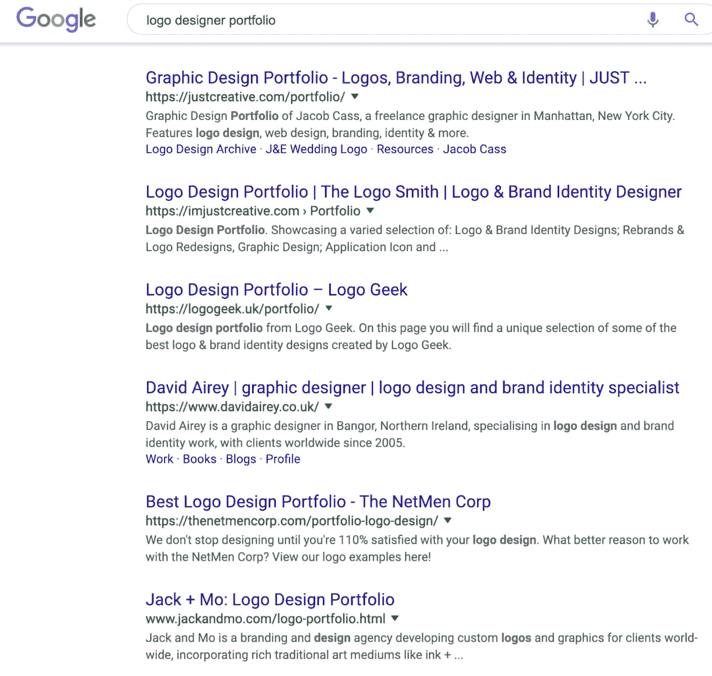
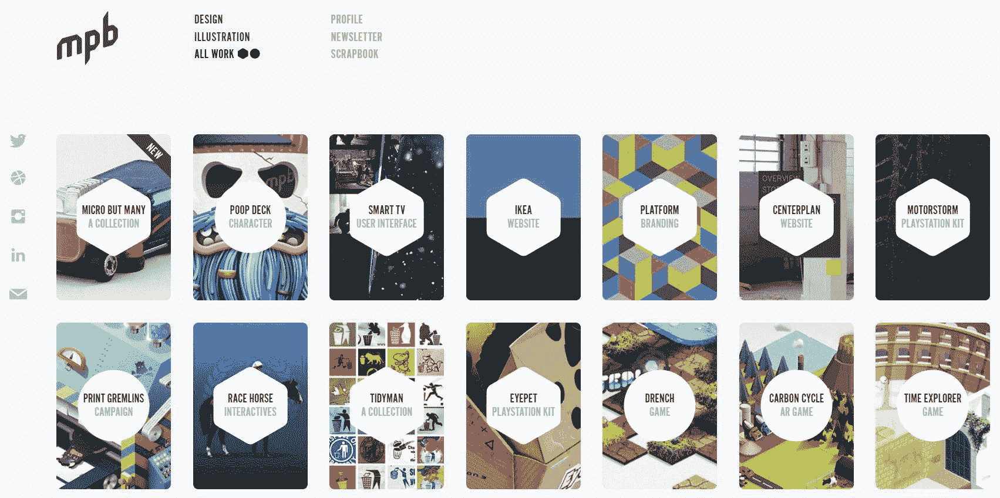
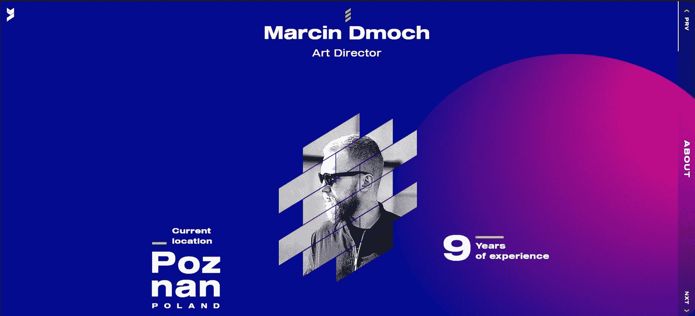
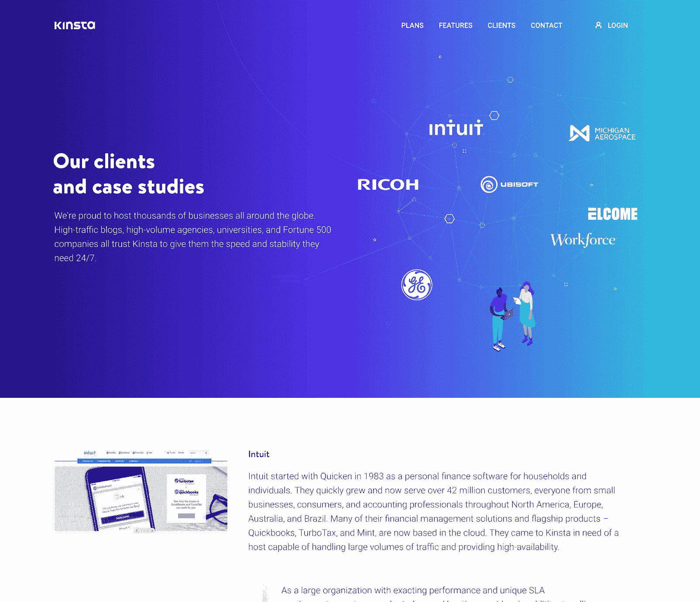
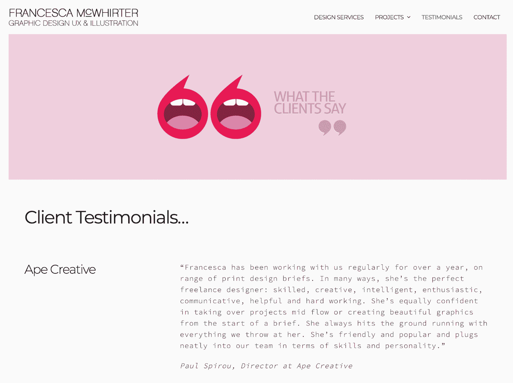
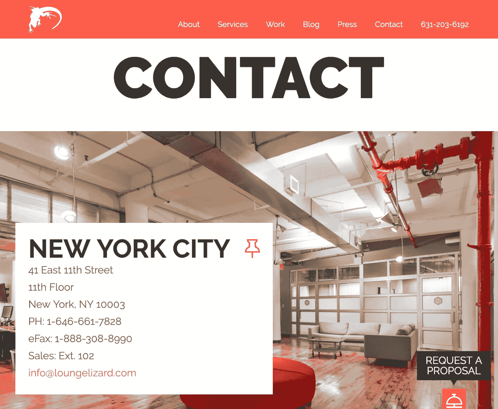
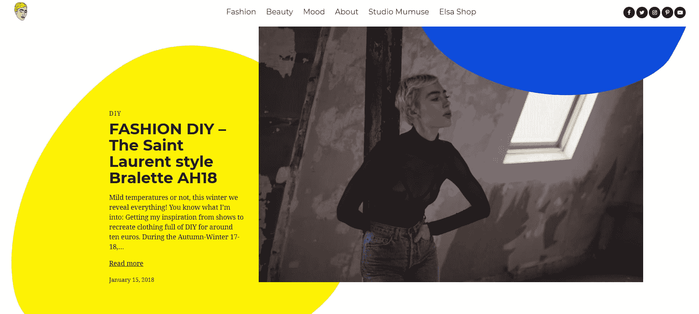
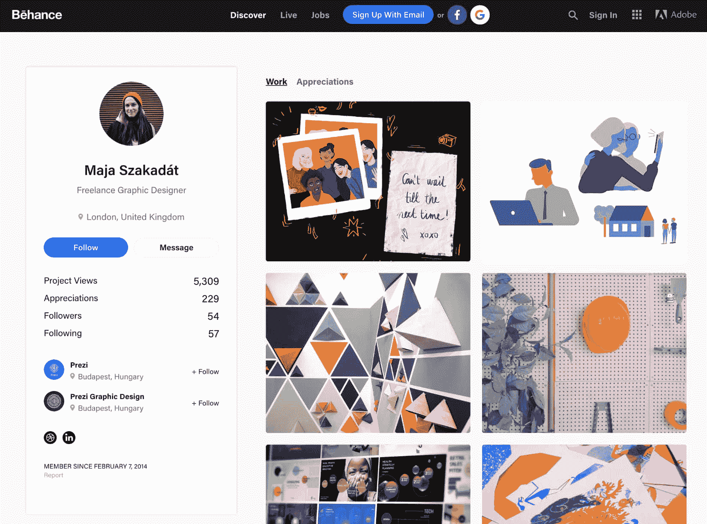

# 解剖一个完美的组合网站来展示你的工作

> 原文：<https://kinsta.com/blog/portfolio-website/>

该卷起袖子了！今天我们将深入投资组合网站的主题，以及哪些行业专家应该使用它们。学习如何创建一个好看的网站，独特地展示你的工作和这样做的重要性。你希望访客和潜在客户在下一个项目中记住你。

*   [什么是作品集网站？](#what-is-a-portfolio-website)
*   [为什么你需要一个投资组合网站](#why-you-need-a-portfolio-website)
*   [投资组合网站的基本要素](#portfolio-website-essential-elements)
*   [建立投资组合网站需要什么](#building-a-portfolio-website)

## 什么是作品集网站？

作品集网站是展示你的作品和让别人了解你的独特方式。对于你的项目、案例研究和你的信息来说，它就像一个常青的平台。此外，这也是表达你的个性、经历和能力的最佳方式之一。

拥有自己的网站意味着客户总是能够找到你，如果他们感兴趣，会主动联系你。如果你现在没有网上业务，那你就落伍了。😉作品集是摄影师、设计师、开发者和各种各样的艺术家在网上展示他们作品的好方法。它让你通过你的作品——照片、平面设计、草图等——反映你的身份。
T3】

## 为什么你需要一个投资组合网站

简而言之，你需要一个作品集网站来展示你的作品。无论你是个人、两个人的小团队还是十个人的公司，拥有独特的在线方式都是至关重要的。网站作品集将帮助你从人群中脱颖而出，展示你的独特性，建立信任，并确保其他人能真正找到你。

在某些领域，网站组合比其他方面更重要。如果你发现自己处于以下情况之一，可以有把握地假设你需要一个投资组合，就像一本书需要文字一样:

*   [网页设计](https://kinsta.com/blog/web-design-best-practices/)
*   网络开发(外包，网上商店)
*   平面设计(标志设计、公司标识、传单、目录、包装)
*   营销(数字营销、平面设计、搜索引擎优化、竞价排名广告)
*   艺术设计(插图、视频、音频、摄影)

但这并不仅限于此，室内设计师、艺术家、模特、作家等也是如此。主要的想法是，你是一个创作者，你需要展示你的作品。作品集网站让你高质量地做到这一点。

### 举例说明您为什么需要投资组合

当有人需要一个新产品、服务或公司的标志时会发生什么？大多数人会通过简单的谷歌开始搜索(或者他们可能会从朋友或商业伙伴那里得到建议)。所以首先，**你想被搜索到**。为了从你客户的角度来演示，这里有一个小实验。

考虑到多数方法，我使用了谷歌。我开始简单地在搜索栏键入“标志设计师组合”，并希望找到一个真正的人谁可以创建我的标志。就在那里，一群潜在的标志设计师在那里等着你。我浏览了一下他们的网站，好像都挺不错的。现在，要做出选择，只是喜好、口味和预算的问题。

Google 1st page search results for “logo designer portfolio”

如你所见，选择就在我面前。我可以选择个人或者[机构](https://kinsta.com/blog/wordpress-agency/)。我可以了解每个人的服务，看到他们的投资组合，阅读他们，并研究他们的项目流程。基本上，他们的网站给我的感觉是他们是谁，他们做什么，如果我决定与他们合作，会有什么期待。

既然你知道了至少一个你需要作品集的原因，那么是时候去了解你的网站上应该包含的最重要的东西了。

## 投资组合网站的基本要素

每个项目都需要一个公式——一个目标。没有它，就很难给人留下深刻印象。

[When creating a portfolio website, first ask yourself, what is the purpose? 🤔Click to Tweet](https://twitter.com/intent/tweet?url=https%3A%2F%2Fkinsta.com%2Fblog%2Fportfolio-website%2F&via=kinsta&text=When+creating+a+portfolio+website%2C+first+ask+yourself%2C+what+is+the+purpose%3F+%F0%9F%A4%94&hashtags=design%2CWordPress)

一个作品集网站的基本公式包括一个标志、标语、你最好的作品和联系信息。有时这是可行的，但在很多情况下，这是一个糟糕的实现。为了从另一个角度突出你的作品集，考虑加入其他关键元素来提升你的作品集的用户体验:案例研究，推荐，博客，甚至是你目前正在做的一个项目。这些都是至关重要的因素。

当你设计投资组合网站时，考虑一下你未来的客户应该能找到的元素。问问你自己—**你投资组合的目的是什么？**你是想卖你的服务，是想找工作想被录用，还是一个关于你的网站？你的作品集网站的主要焦点应该是吸引访问者的注意力，下面的元素将帮助你做到这一点。

*   [展示你的作品](#showcase-work)
*   [你的关于页面](#about-page)
*   [案例分析](#case-studies)
*   [感言](#testimonials)
*   [行动号召(CTA)](#cta)
*   [博客和联合组织](#blog)

### 你作品的展示

失去访客的注意力只需要几秒钟，所以一定要聪明地利用这几秒钟。你的潜在客户将首先看到视觉效果，如果他们喜欢他们所看到的，他们将继续寻找更多的细节。换句话说，你需要一个令人敬畏的、吸引人的作品展示。

这可以通过多种方式实现——照片幻灯片、视频演示、缩略图画廊等。例如，如果你是一个标志设计师，确保你展示了一个不同变化的标志的高质量的图片。把商标印在产品、名片上，用不同的颜色展示出来——这将会扩展你的能力。

看看这个[作品集网站](http://www.mypoorbrain.com/)。它是由伦敦设计师兼作家蒂姆·史密斯创作的。在其中，他使用缩略图画廊展示他的作品。

Portfolio website with a thumbnail gallery

### 您的“关于”页面

你的“关于”页面可以让你的潜在客户看到谁在幕后工作，了解你是谁，以及他们是否愿意和你一起工作。你可能会问，我从哪里开始呢？从最基本的开始——从你自己开始。为了使它更简单，下面是关于页面元素的关键清单:

#### 你的名字

这听起来显而易见，但许多投资组合并不具备这一点。如果你的潜在客户想要对你进行调查，比如 LinkedIn 呢？*大家好，我是马特……*这是继续讲述自己故事的良好开端。

#### 你的照片

一幅画给人一种更个人化的感觉。一张你的肖像或者一张你正在进行新设计的漂亮照片。这是最原始的方式让游客感受到你是谁。让它简单但有吸引力。

#### 关于你自己的信息

通过讲述你的职业和个人经历来展示你的个性。你的教育，你学会了做什么，你喜欢工作的项目，奖励和认可。使用这一页来展示你的技能、你的思维方式和你的激情所在。让它简短、愉快、难忘。

## 注册订阅时事通讯

### 想知道我们是怎么让流量增长超过 1000%的吗？

加入 20，000 多名获得我们每周时事通讯和内部消息的人的行列吧！

[Subscribe Now](#newsletter)

下面是艺术总监 Marcin Dmoch 的一个“关于”页面示例。他用明亮的色彩设计和讲述自己职业经历和最佳项目的小故事来展示自己。他还附上了一份可下载的简历，便于打印或转发给他人。这是一个简洁的设计，包含了有效的“关于”页面所需的所有关键元素。

Portfolio website about page

### 个案研究

案例研究或报告是展示你项目全部范围的最佳方式。每个项目都应该有自己的故事，展示整个过程的进展，从开始到最后的结果。用大量的照片和笔记来分解这个创作过程，揭示每个项目背后的东西。

通过这种方式，你的访问者可以了解你的项目是什么样的，以及你是如何从最初的计划阶段发展到完成的。以下是您的案例研究中应包含的组件:

*   **项目目的:**你为什么开始这个项目。
*   **目标:**你完成了什么。
*   **方法:**你是如何完成的。
*   **项目持续时间:**你花了多长时间。
*   **你的角色:**你如何为团队或项目做出贡献。
*   **最终产品概述:**图片、视频、链接等。

这是一个很好的展示案例研究的例子，来自网站设计师兼品牌顾问 Darian Rosebrook。他用自己的作品集，通过一篇揭示每个项目本质的文章来呈现之前的作品。

Portfolio website case study

再比如金斯塔。他们没有作品集网站，但他们的[案例研究页面](https://kinsta.com/clients/)是一个精心设计的好例子，旨在向潜在客户展示他们引以为豪的作品。

Kinsta case study example

构建您的案例研究部分需要一些时间吗？当然可以，但这是任何投资组合网站的必备。

### 证明书

对于那些刚刚登陆你的页面的人来说，从你的客户那里听到一些话是非常有意义的。你可以列出你的技能，告诉别人你有多棒，但是让别人说会有很大的影响。联系你以前的客户，询问你可以在网站上使用的报价。喜欢和你一起工作的人会很高兴地称赞你的出色工作。

Struggling with downtime and WordPress problems? Kinsta is the hosting solution designed to save you time! [Check out our features](https://kinsta.com/features/)

看看平面设计师 Francesca McWhirter 的这个例子。为了让她的[客户评价页面](http://francescamcwhirter.com/portfolio/testimonials/)真正流行起来，她从一个动态的英雄形象开始，然后继续下面的客户评价。

Portfolio website client testimonials

### 行动呼吁(CTA)

行动号召是对你投资组合目的的补充。为了帮助你为你的网站想出一个行动号召，提醒你自己你的网站的目的。你希望访问者采取什么行动？你的网站应该提供客户联系你的各种方式。确保包括你的商务电子邮件地址，即使你使用联系表格，因为一些客户更喜欢它而不是表格。

在下面的例子中，[创意机构 Lounge Lizard](https://www.loungelizard.com/contact/) 为客户提供了多种联系方式。您可以使用电子邮件地址或填写“索取建议书”表格，直接在您的收件箱中获得报价。

Portfolio website CTA/contact

### 博客和辛迪加

写博客是分享你的想法和给那些想要合作的人增加价值的一种极好的方式。创建定期的博客内容给访问者一个再次访问你的网站的理由。这对 [SEO](https://kinsta.com/blog/what-does-seo-stand-for/) 也很好——谷歌喜欢定性内容！

然而，博客并不是唯一的方法。为了给你的工作制造声势，社交媒体也很有用。例如，[拥有 10 亿活跃用户的 Instagram】是展示你的作品、风格、展现你独特个性的绝佳方式。这有助于建立信任，培养相关受众。内容营销也意味着](https://kinsta.com/blog/instagram-stats/)[你自己的 YouTube 频道](https://kinsta.com/blog/how-to-create-a-youtube-channel/)，一个[播客](https://kinsta.com/blog/wordpress-podcast/)或者网络研讨会。选择自己喜欢的方式，表达自己。创意艺术家 Elsa Muse 就是一个很好的例子，她写了自己的博客并在 Instagram 上发布。

Portfolio website blog

不要忘记把你的作品放在一起！就像内容聚合一样，你可以将你最好的作品上传到像 [Behance](https://www.behance.net) 和 [Dribbble](https://dribbble.com/) 这样的地方。因此，即使你可能有一个惊人的投资组合网站，也要确保利用这些其他网络来获得额外的免费流量。

Behance (Example: [Maja Szakadát](https://www.behance.net/szmaja))

### 要包含的额外内容

你的作品集网站可以包含任何内容。除了基本的关键元素之外，还有更多的项目可以更加突出你的网站。一个工作原型演示，图标集的免费样品，免费软件，主题，甚至插件。

如果你在博客、播客、媒体、娱乐频道上客串，一定要提到他们。如果客户想更多地了解你的个性和工作，面试是很好的阅读材料。同样，为你的成就感到骄傲，不要害怕分享你获奖的细节。

## 你需要建立一个投资组合网站

当你建立一个网站时，确保它有效、实用且易于维护是很重要的。选择正确的工具对于构建专业外观的作品集网站非常重要。最好和最受欢迎的网站建设平台之一—[WordPress](https://kinsta.com/knowledgebase/what-is-wordpress/)是自由职业者的完美解决方案。WordPress 通过无数可用的[主题](https://kinsta.com/blog/wordpress-free-vs-paid-themes/)和[插件](https://kinsta.com/knowledgebase/wordpress-plugin/)给你开箱即用的能力。

WordPress 主题控制你网站的视觉方面:设计、颜色和布局。相反，插件是 WordPress 的扩展，它获取核心 WordPress 软件并编辑或删除其功能。

像联系表格、图片幻灯片、营销弹出栏这样的页面元素是你网站的一部分，通常是使用 WordPress 插件创建和添加的。你不应该在你的网站上使用过多的插件，因为这会(并不总是)让你的网站变得沉重和缓慢。相反，你可以使用[网站生成器](https://visualcomposer.com)和一些其他必备插件来创建你的 WordPress 网站。这可以节省你的时间，帮助你更快地推出你的作品集(艺术家通常没有太多时间花在建立自己的网站上，对吧？)

选择平台后，接下来你需要的是域名和主机。如果你是一名自由设计师，在域名中抢注你的名字对个人品牌推广很有帮助。

一个高质量的 WordPress 主机，如 [Kinsta](https://kinsta.com/plans/) ，将确保你的网站保持在线，快速导航，并且对你的潜在客户始终可用。使用包含的托管功能，如 [CDN](https://kinsta.com/blog/wordpress-cdn/) 可以帮助确保所有这些美丽的展示图片在全球范围内快速加载。别忘了[优化它们](https://kinsta.com/blog/optimize-images-for-web/)！

## 摘要

把[你的投资组合](https://kinsta.com/blog/wordpress-portfolio-plugins/)作为给你的潜在客户惊喜和留下深刻印象的机会。作品集网站可以让你在一个地方展示你所有的作品。这不仅对客户来说很好，而且也能帮助你激发下一个项目的灵感。

告诉别人你的技能和个性。通过案例研究表达自己的独特性。具有可搜索性，并与竞争对手保持同步。没有规则，只要你能让游客微笑并记住你，一切都会顺利。

* * *

让你所有的[应用程序](https://kinsta.com/application-hosting/)、[数据库](https://kinsta.com/database-hosting/)和 [WordPress 网站](https://kinsta.com/wordpress-hosting/)在线并在一个屋檐下。我们功能丰富的高性能云平台包括:

*   在 MyKinsta 仪表盘中轻松设置和管理
*   24/7 专家支持
*   最好的谷歌云平台硬件和网络，由 Kubernetes 提供最大的可扩展性
*   面向速度和安全性的企业级 Cloudflare 集成
*   全球受众覆盖全球多达 35 个数据中心和 275 多个 pop

在第一个月使用托管的[应用程序或托管](https://kinsta.com/application-hosting/)的[数据库，您可以享受 20 美元的优惠，亲自测试一下。探索我们的](https://kinsta.com/database-hosting/)[计划](https://kinsta.com/plans/)或[与销售人员交谈](https://kinsta.com/contact-us/)以找到最适合您的方式。