# 什么是聊天机器人——你应该在你的网站上添加一个吗？

> 原文：<https://kinsta.com/blog/chatbot/>

你可能已经对聊天机器人有些熟悉了，或者至少见过一个聊天机器人在你上网浏览时出现在你电脑屏幕的右下角。

但是到底什么是聊天机器人，为什么这么多品牌争相把它添加到自己的网站上？

请继续阅读，了解这两个问题的答案，以及一些可以用来开始使用聊天机器人作为营销和销售策略一部分的工具。

## 什么是聊天机器人？

聊天机器人是一种由规则或人工智能驱动的计算机程序(或者两者都有！)通过聊天界面与人类用户交互。

例如，必胜客有一个 Facebook Messenger 聊天机器人，让顾客了解特价和促销信息，然后下单送货或取货。

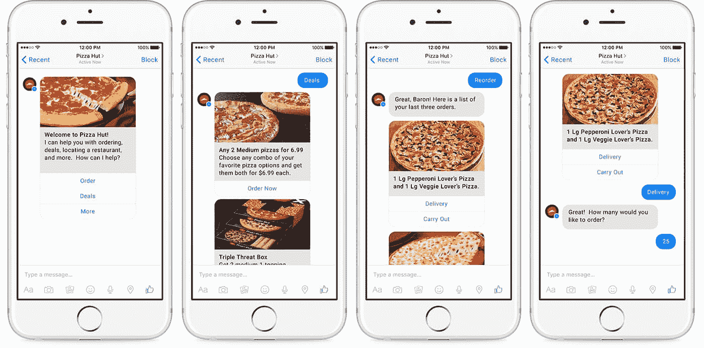

Facebook chatbot (Image source: [Engadget](https://www.engadget.com/2016-07-12-pizza-hut-whole-foods-facebook-twitter-chatbot.html))

该机器人主要依靠多项选择菜单和基本输入来帮助客户，但非常用户友好，并服务于其帮助用户有效地在线下单的目的。

> Kinsta 把我宠坏了，所以我现在要求每个供应商都提供这样的服务。我们还试图通过我们的 SaaS 工具支持达到这一水平。
> 
> <footer class="wp-block-kinsta-client-quote__footer">
> 
> 
> 
> <cite class="wp-block-kinsta-client-quote__cite">Suganthan Mohanadasan from @Suganthanmn</cite></footer>

[View plans](https://kinsta.com/plans/)

像这样的机器人只是开始。事实上，Servion Global Solutions 预测，到 2025 年，95%的客户互动将在没有人工参与的情况下进行。

## 为什么聊天机器人现在这么流行？

最大的一个原因就是符合消费者的喜好。消息传递现在比以往任何时候都更受欢迎，全球前四大消息传递应用的月活跃用户数超过了前四大社交媒体网络。

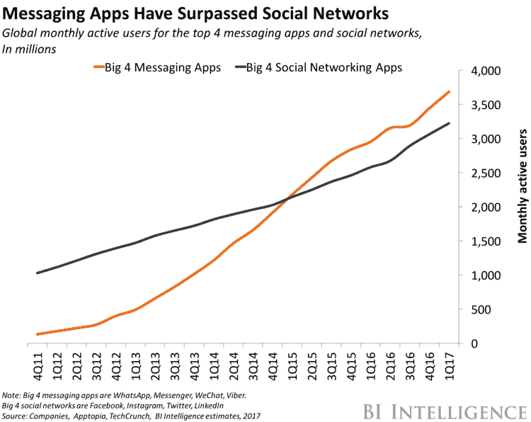

Messaging apps vs social networks (Image source: [Business Insider](https://www.businessinsider.com/the-messaging-app-report-2015-11?IR=T))

另外，[私人信息的平均打开率为 98%](https://businessesgrow.com/2016/05/03/private-media/) ，几乎是**电子邮件平均打开率 20%的五倍**。

很明显，人们更喜欢通过消息接口进行交流。这对于让他们经历顾客旅程的所有阶段大有帮助。

当你考虑到 95%的访问者在他们第一次访问时还没有准备好购物时，这一点尤其正确。他们可能对这个品牌有些兴趣，但是在转换之前需要更多的信息和一些问题的答案。

在许多情况下，公司对他们问题的回应可能是他们最终是否转变的决定性因素。

在《哈佛商业评论》的一项研究中，研究人员观察了公司对新前景做出反应的平均时间。他们发现，回应的时间越长，公司就越不可能与关键决策者进行有意义的对话。

事实上，在一小时内联系新线索的公司比一小时后联系的公司更有可能进行有意义的对话。

不幸的是，许多企业的响应速度不够快，无法实现他们想要的销售额。

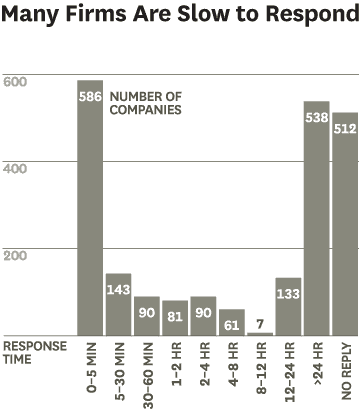

Firms slow to respond (Image source: [HBR](https://hbr.org/2011/03/the-short-life-of-online-sales-leads))

尽管 37%的公司在一小时内回复了他们的线索，16%的公司在一至 24 小时内回复，24%的公司超过了 24 小时，还有 23%的公司根本没有回复。

从消费者的角度来看，这些回复率是不可接受的。

在一项类似的研究中，研究人员发现，回复销售线索的理想时间是他们联系公司后的五分钟，因为互联网销售线索是“如果你在五分钟内回电，进入销售周期的可能性是其他销售线索的 21 倍。”

在这五分钟之后，与领导接触的几率会降低 10 倍。

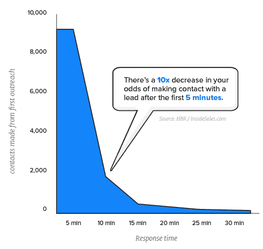

Response times and leads (Image source: [Drift](https://www.drift.com/blog/lead-response-survey/))

现在，如果你经营一家以销售线索为基础的企业，你可能会想知道如何在五分钟内跟进所有填写你网站表格的合格销售线索。

即使你有世界上最敬业的销售团队，他们也可能没有时间经常检查你的 CRM 来寻找新的线索。但是仅仅因为这个问题很普遍，并不意味着你不应该努力去解决它。

毕竟，85%的 B2B 营销人员说他们对结果不满意。因此，很明显，现状并不适合大多数人。

一些公司试图通过在网站上添加实时聊天界面来解决这个问题。在大多数情况下，该渠道由支持代理人员组成，他们可以回答简单的询问，并在有新线索时将其传递给销售团队。

但是，如果你还没有 24/7 的员工可以与你的客户实时聊天，这可能是一个非常昂贵的解决方案。

这就是聊天机器人有潜力变得非常有价值的地方。

## 聊天机器人的重要性是什么？

有了网站上的聊天机器人，你就不必担心当新的潜在客户联系你时，你的销售团队会找不到你，你也不需要雇佣额外的员工来保持实时聊天界面。

相反，你可以[使用聊天机器人自动回复](https://acquire.io/blog/chatbot-benefits-for-business/)并在几秒钟内指引访问者找到他们需要的信息。

他们几乎可以在客户旅程的每个环节做到这一点。

今天，聊天机器人可以处理各种任务，从向访问者推荐信息到确认新线索到安排会议。

访问者更愿意使用聊天机器人来完成这些任务，这一点也不奇怪。

事实上，一项调查发现，40%的消费者表示，如果网站上有聊天机器人，他们会与之互动——这使聊天机器人成为指引你的观众找到他们需要的信息以便转化的完美工具。

## 聊天机器人帮助你提高转化率和实现网站目标的 8 种方法

聊天机器人可以在网站上为不同的目的服务。以下是最有价值的八个:

### 1.为您的销售团队收集销售线索

任何以潜在客户为基础的公司网站最重要的目标是收集你的销售团队可以用来联系新的潜在客户的信息。

聊天机器人非常适合这个目的。例如，1ClickSolar 使用一个带有全屏聊天机器人的登录页面，在访问者到达后立即开始收集他们的信息。

首先，机器人告诉用户，他们需要回答几个问题，以验证他们是否有资格安装太阳能设备，并获得免费报价。

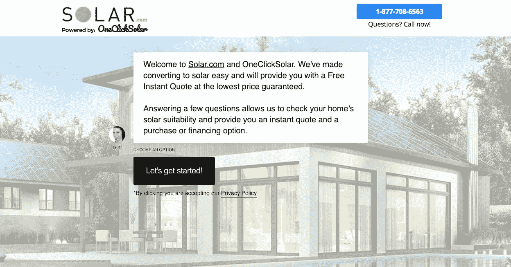

Chatbot example

然后，在用户点击“我们开始吧！，”机器人会问一系列问题来收集基本的联系信息。

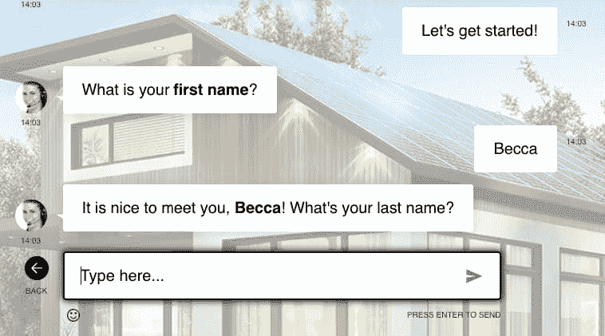

Chatbot example

这个过程基本上收集了大多数网站试图通过标准销售线索表格收集的相同信息，但是以一种对用户更有吸引力的方式。

在那里，它会询问他们的邮政编码、地址、屋顶类型和每月电费，以确定他们是否适合安装太阳能电池板。

在确认了所有这些细节之后，该机器人按照承诺提供了一个免费报价，并让用户知道何时会收到销售代表的后续电子邮件，以更详细地讨论他们的项目——有效地让用户进入他们的销售漏斗，并让他们更接近销售。

### 2.确认和优先考虑新的销售线索

收集稳定的销售线索极具挑战性。但是评估和回应每一条线索可能更具挑战性，尤其是对忙碌的销售团队而言。

但是聊天机器人可以简化这个过程。

除了收集关于你的线索的信息，机器人还可以识别高质量的线索，并使它们成为你的团队的优先事项。

例如， [ServeHQ](https://servehq.church/) 是一个针对教会领袖的视频培训服务。这意味着他们的目标受众相当小众，他们的销售团队希望专注于吸引有可能成为客户的潜在客户。

为了帮助实现这一目标，他们网站的聊天机器人首先会问三个关于访问者角色和兴趣的问题。

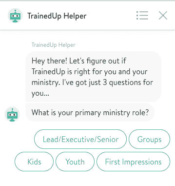

Chatbot questions

然后，根据他们的回答，它可以评估每个访问者是否可能是一个合格的线索，并将最合格的线索作为最高优先级传递。

这使得他们的团队能够尽快帮助这些高质量的销售线索，而且最好是在五分钟内完成。

### 3.为访问者订阅您的时事通讯

TrainedUp 不仅使用他们的聊天机器人来区分新线索的优先级，他们还使用它来为人们订阅他们的每周时事通讯。这可能是对推送通知的一个很好的替代。

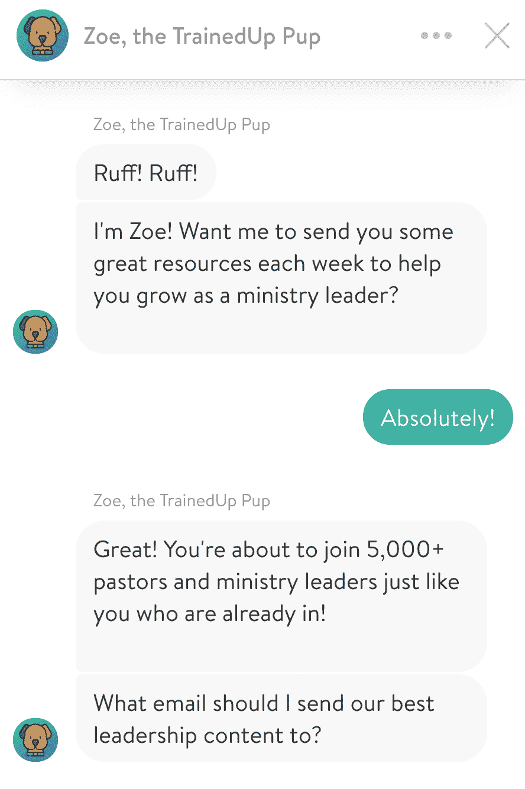

Chatbot newsletter

### 4.让访客与你的团队保持联系

对聊天机器人最常见的误解之一是，它们旨在取代人工支持人员和销售团队。但事实完全不是这样。

事实上，聊天机器人在网站上最大的作用之一就是在你的客户和员工之间建立联系。

例如，CPC Strategy 的聊天机器人问所有访问者的第一个问题是，他们是否愿意与分析师交谈。

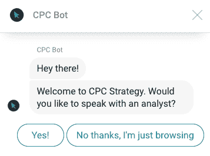

Chatbot question

这样，如果访问者准备好与能够帮助他们确定该公司的服务是否合适的人交谈，他们可以尽快这样做。

此外，对于拥有多个面向客户团队的公司，聊天机器人还可以确保每个客户都能找到最适合帮助他们的人。

例如，Drift 使用其 Driftbot 自动将游客路由到适合他们需求的人。

如果用户伸出手，表示他们想与销售团队交谈，它会将他们添加到该团队的队列中，然后开始收集该团队可能需要的信息，以有效地帮助他们。

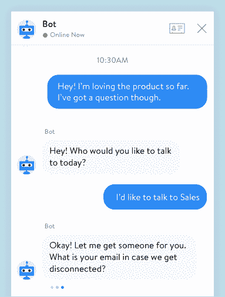

Chatbot collect info (Image source: [Drift](https://www.drift.com/platform/chatbots/))

通过这种方式，当销售代表有空与访问者交谈时，他们将有基本的细节，如他们的联系信息、兴趣和预算，并可以直接了解他们正在寻找的更多信息。

另一方面，如果访问者表示他们希望与客户支持团队交谈，机器人可以将票证发送到该队列，并收集他们寻求帮助的问题的详细信息。

[Chatbots don't replace humans, they create a connection between your customers and your team. 🤖Click to Tweet](https://twitter.com/intent/tweet?url=https%3A%2F%2Fkinsta.com%2Fblog%2Fchatbot%2F&via=kinsta&text=Chatbots+don%27t+replace+humans%2C+they+create+a+connection+between+your+customers+and+your+team.+%F0%9F%A4%96&hashtags=chatbot%2CCRO)

### 5.引导访问者找到有用的资源

如果你已经为你的网站内容投资了，很有可能你已经发表了文章、博客文章和教程，提供了你的客户需要的大部分信息。

你可以通过“训练”一个聊天机器人来引导访问者直接找到与他们的兴趣和问题相关的资源，从而充分利用这些内容。

例如，美国国家铁路客运公司的聊天机器人“Julie”可以在他们网站的每个页面的顶部导航栏中找到。

Chatbot need help CTA

如果访问者提出一个已经在他们的网站上得到回答的问题，机器人会给出一个简短的回答，并提供更深入信息的链接。

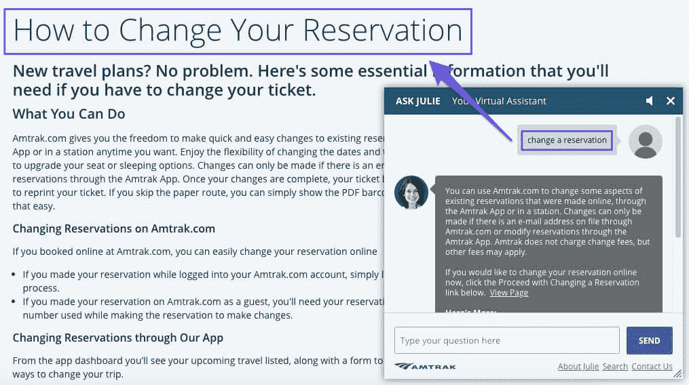

Chatbot content

这样，他们不仅可以帮助用户获得他们需要的信息，还可以最大化他们从网站上的每一个资源中获得的价值。

### 6.个性化浏览体验

如果你曾经浏览过领先公司的网站，并考虑就某个项目或服务与他们联系，你就会知道这并不总是最令人兴奋或最吸引人的经历。

聊天机器人可以改变这一点。

## 注册订阅时事通讯

### 想知道我们是怎么让流量增长超过 1000%的吗？

加入 20，000 多名获得我们每周时事通讯和内部消息的人的行列吧！

[Subscribe Now](#newsletter)

首先，它可以以一种比标准的文本页面更个性化的方式问候用户。从那里，它可以询问细节，使其能够为个人用户量身定制“对话”。

例如，Landbot 会询问每个访问者的姓名，然后在接下来的互动中称呼他们的名字。

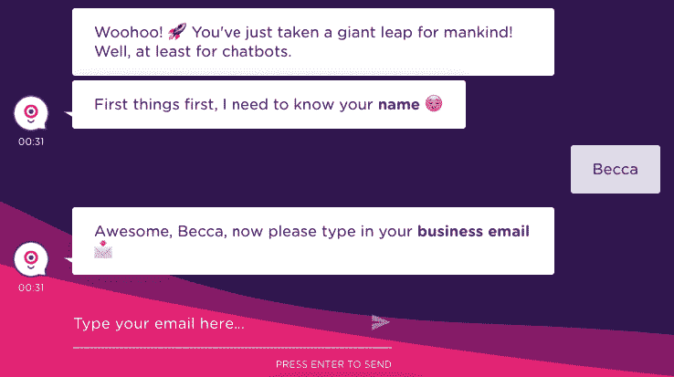

Chatbot personalize browsing experience

虽然这是一个相当基本的例子，但这仅仅是开始。

聊天机器人还可以针对不同的受众群体定制对话，甚至提供与访问者的兴趣特别相关的信息。

### 7.允许客户访问帐户信息

基于服务的公司的支持团队收到的许多询问都是关于他们的项目和客户的具体细节。

在这种情况下，将访问者引导到一个静态的网站页面不足以回答他们的问题。

但是，当与你用来存储和管理客户数据的平台集成时，聊天机器人还可以为客户提供账户信息和其他重要细节。

例如，美国银行的聊天机器人可以告诉客户他们的账户余额和支付信息，甚至可以协助他们完成像账单支付这样的任务。

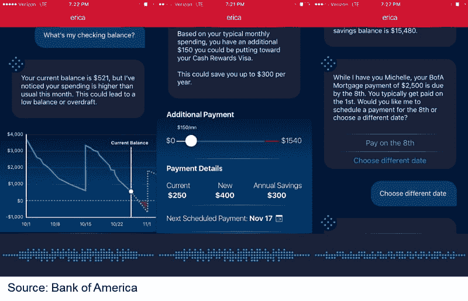

Chatbot account information

这样，客户*总是*能够获得他们想要的信息，即使客户服务代表不能立即帮助他们。

### 8.减轻员工的工作量

该列表中的许多功能，如限定销售线索和引导访问者访问网站资源，通常由客户服务团队处理。

这意味着通过集成聊天机器人，您可以从员工的工作量中消除这些任务。另外，如果您集成了以支持为中心的内容，您甚至可以从团队队列中消除基本的支持查询。

例如，WP Chatbot 的这个机器人可以回答基本的技术问题，并指导用户解决这些问题。

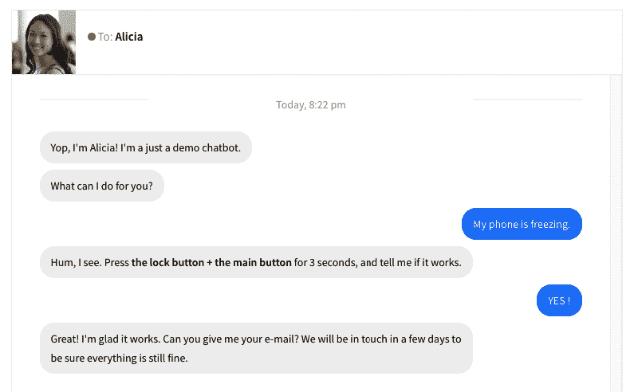

Chatbot technical issues

当机器人能够处理这些直截了当的查询时，它们就从您团队的工作量中消失了——使他们能够专注于更复杂、更重要的任务，并更有效地帮助您的客户。

## WordPress 的最佳聊天机器人

如果你有兴趣在你的网站上添加聊天机器人，第一步是选择一个平台来构建它。幸运的是，有几个很好的选项可以与 WordPress 网站无缝集成——这九个是最好的。

### 1.对讲机

[Intercom](https://www.intercom.com/) 是当今最知名的聊天和支持平台之一。我们在 Kinsta 使用它为我们的托管客户提供 24/7 支持。2018 年，他们通过推出名为“[回答机器人](https://www.intercom.com/blog/introducing-answer-bot/)”的人工智能聊天机器人功能来扩展他们的产品

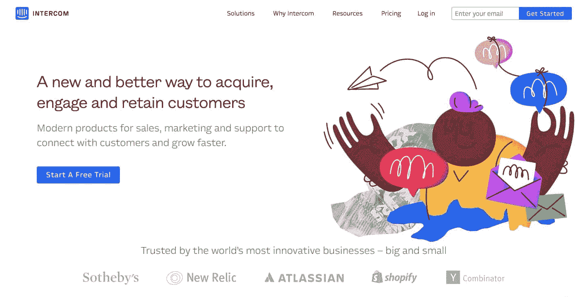

Intercom

在你的 WordPress 网站上安装它很容易。

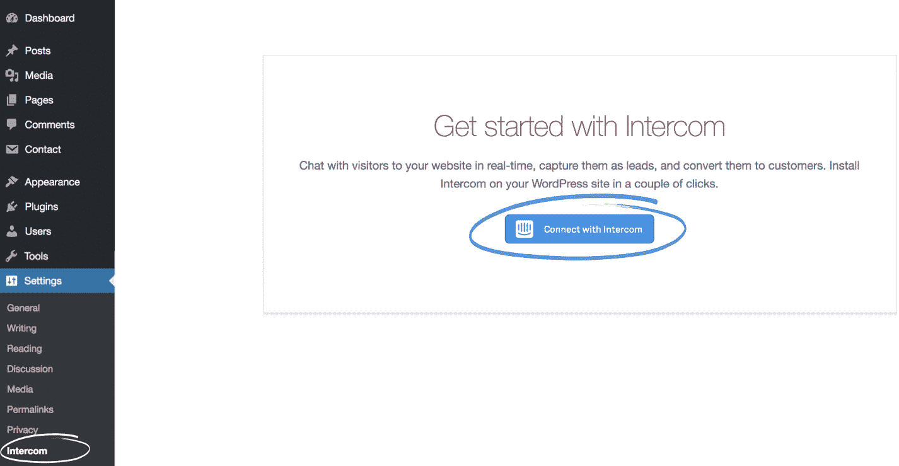

WordPress connect Intercom

一旦你确认了你的 WordPress 站点地址并通过了你的内部通信帐户的认证，你就可以通过右下角的界面与你的 WordPress 站点上的潜在客户和用户聊天了:

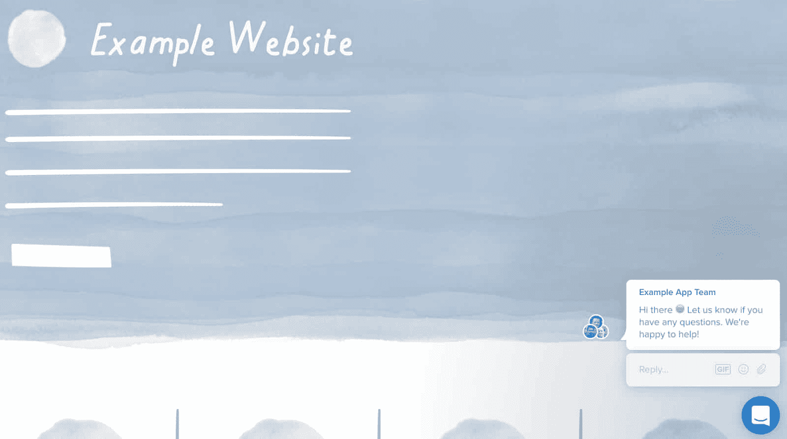

Intercom chatbot

### 2.漂流

漂移是另一个知名的聊天机器人平台，可以很容易地与 WordPress 网站集成。

[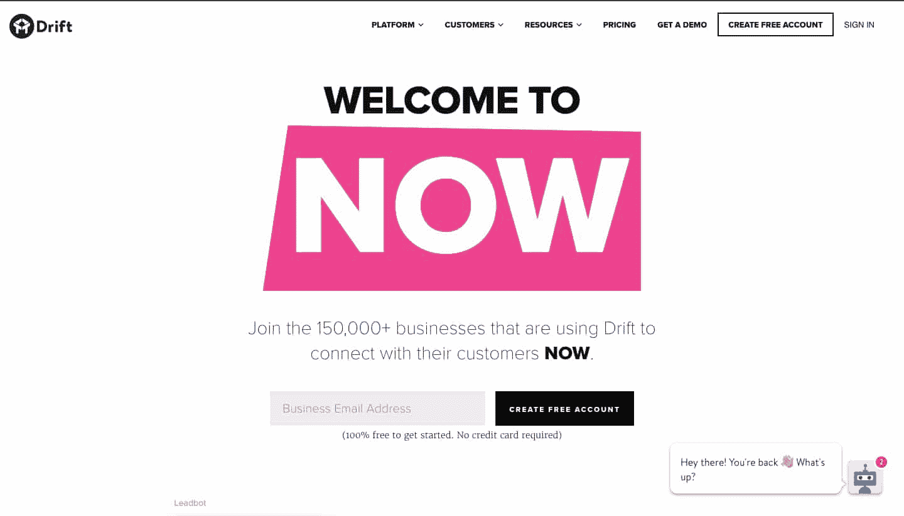](https://www.drift.com/)

Drift

创建帐户后，用户可以简单地[安装平台的插件](https://gethelp.drift.com/s/article/Installing-Drift-on-WordPress)，然后从他们的帐户复制一行插件代码并粘贴到他们网站的标题中。

Struggling with downtime and WordPress problems? Kinsta is the hosting solution designed to save you time! [Check out our features](https://kinsta.com/features/)

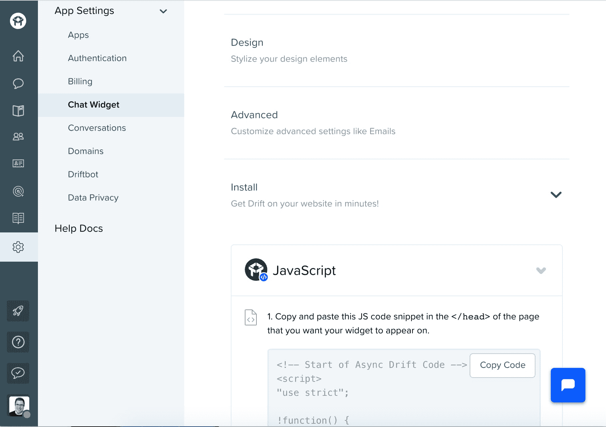

Install Drift in WordPress

然后，启用小部件，将几行代码复制到插件设置中，并保存更改。

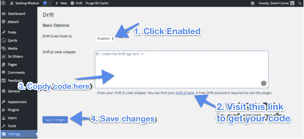

Drift WordPress settings

一旦你完成了这个过程，你的聊天机器人就可以立即开始运行(并收集线索)。

### 3.WP 聊天机器人

WP 聊天机器人是一个非常用户友好的平台，使得构建和安装聊天机器人成为一个简单直接的过程。

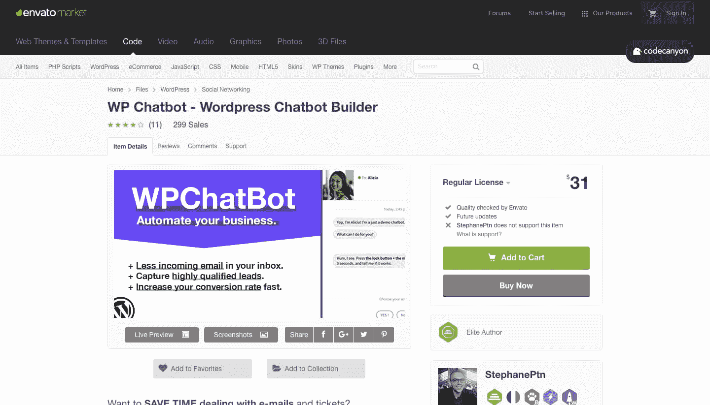

WP Chatbot

使用这个插件，你可以给你的机器人一个“身份”和个性，教它对访问者说什么，并结合问题，使它能够在你的网站上收集线索。

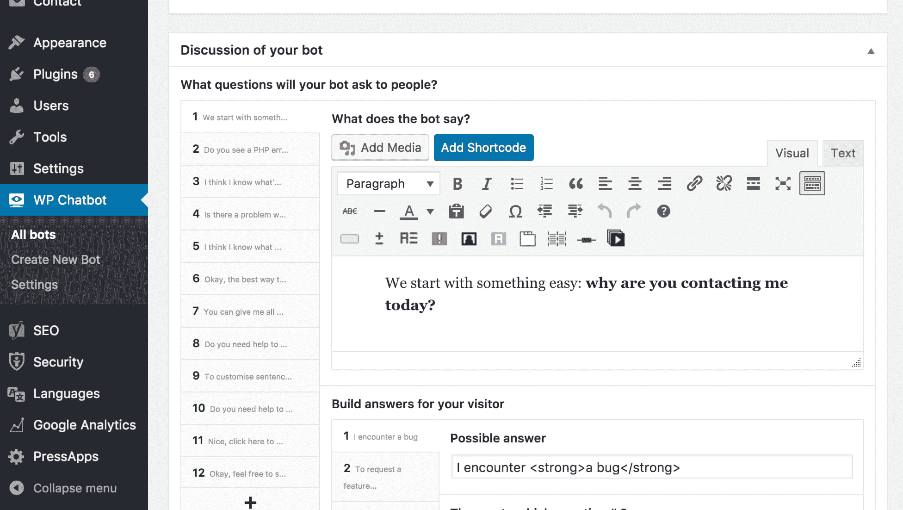

WP Chatbot questions

您还可以创建多个用于不同目的的聊天机器人，如销售或支持，这取决于您希望如何在您的策略中使用聊天机器人。

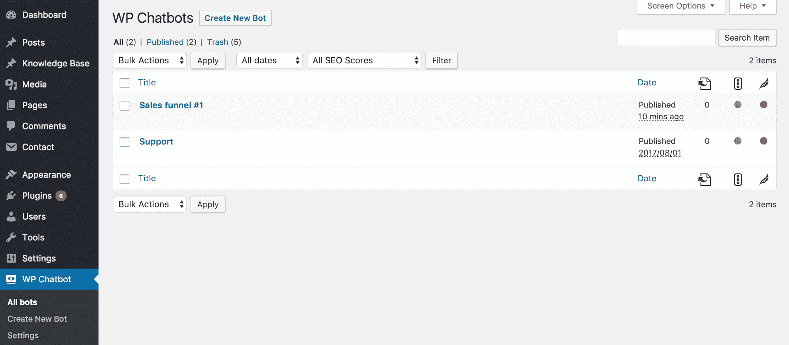

Multiple chatbots

另外，所有聊天机器人都可以用 CSS 完全定制，所以它们可以被设计成在视觉上与你网站的其余部分兼容。

### 4.新鲜事

Freshchat 是一个客户支持实时聊天平台，它也允许用户在其实时聊天界面中创建机器人。

[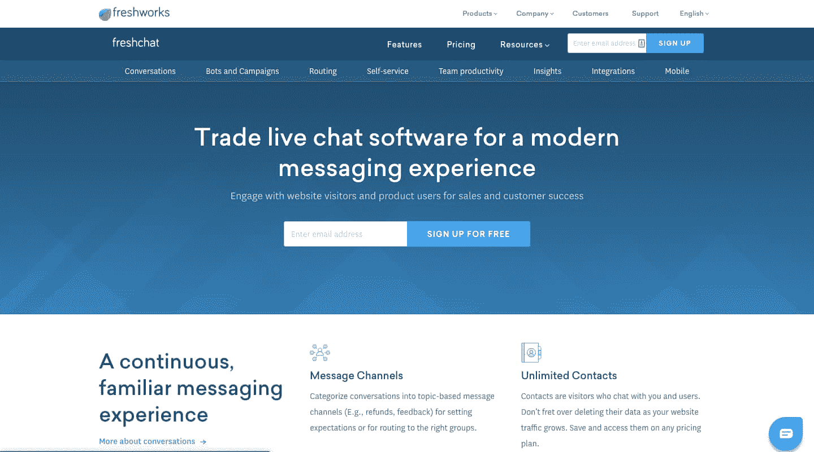](https://www.freshworks.com/live-chat-software/)

Freshchat

用户可以[创建完全可定制的机器人工作流程](https://www.freshworks.com/live-chat-software/features/)，为他们的网站和营销目标量身定制。

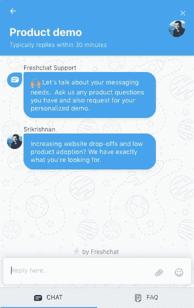

Freshchat bot

由于该平台旨在帮助网站范围内的访问者，不同的机器人对话可以根据反馈、销售查询、支持请求和机器人可能帮助的任何其他主题进行分类。

此外，Freshchat Messenger 不仅可以作为您的网站和应用程序的一部分，还可以作为独立的支持门户使用。

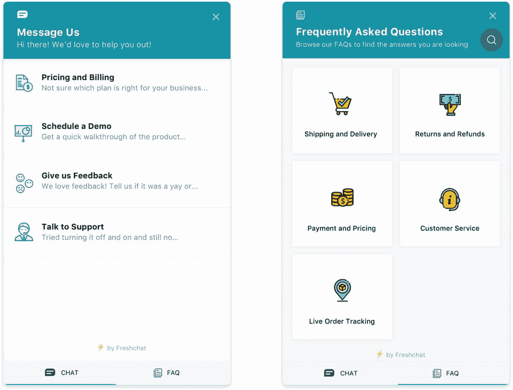

Freshchat Messenger

如果访问者正在寻找某个特定主题的信息，他们可以使用这个界面直接跳转到相关内容。

聊天机器人也有先进的智能人工智能功能。例如，它可以连接到您的[知识库软件](https://freshdesk.com/knowledge-base-software)以自动提供查询答案:

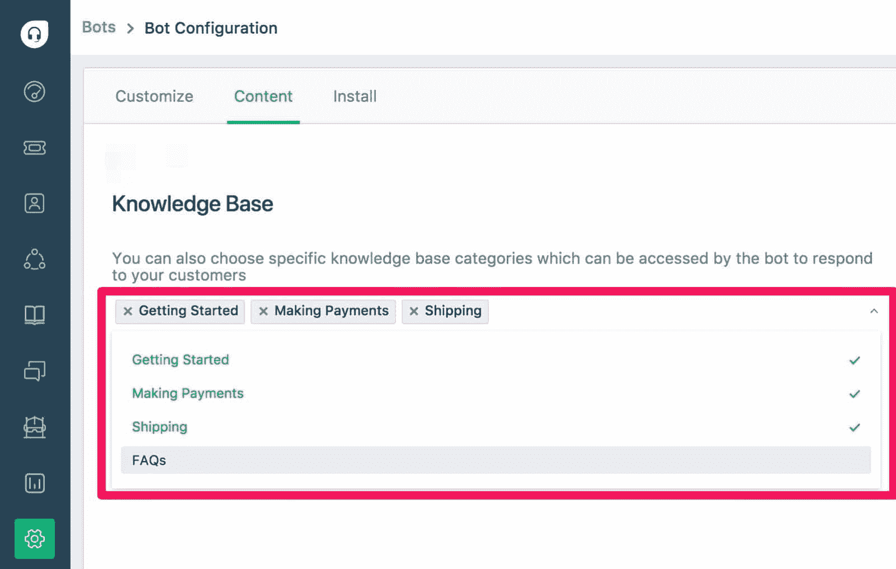

Connect chatbot to KBs

这有助于更快地解决问题，而不需要您有随时待命的现场代理。

如果他们*没有*找到他们想要的东西，聊天机器人可以将对话转换成支持票。

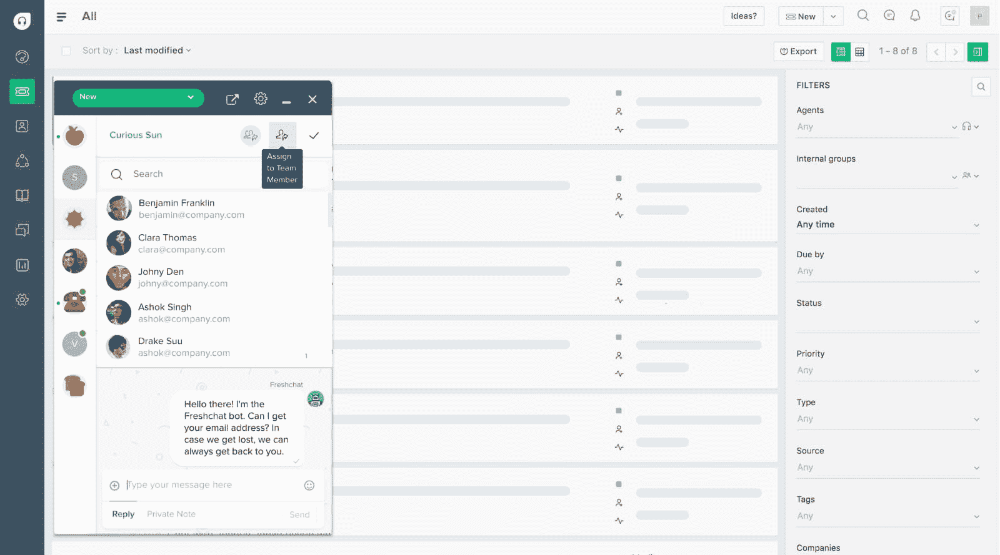

Chatbot support tickets

然后，这些票中的每一张都被传递给支持或销售人员，以便访问者可以得到他们需要的帮助或回答。

### 5\. Landbot

Landbot 是一个聊天机器人平台，旨在帮助企业与其网站访问者创造“对话体验”。

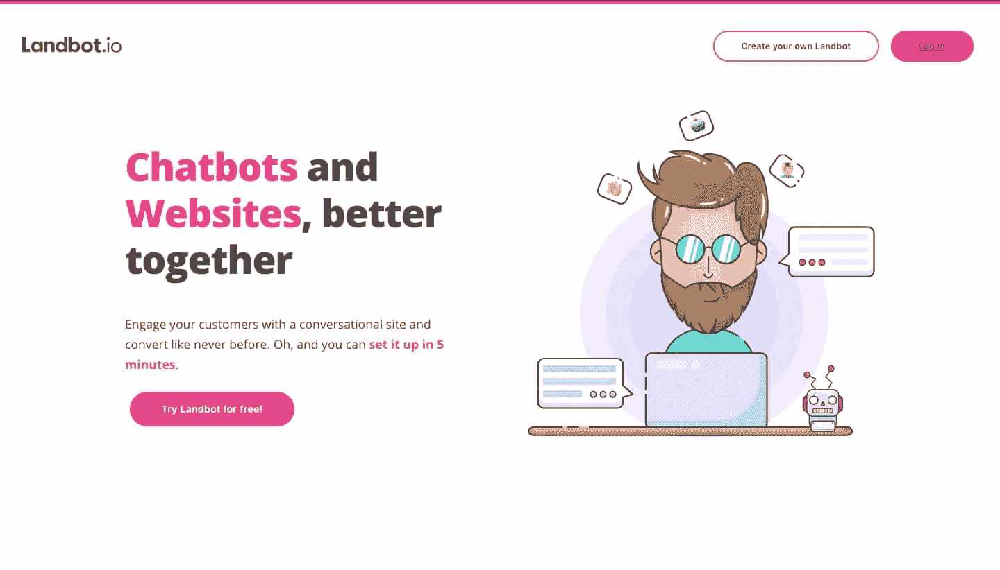

Landbot

在 WordPress 网站上安装聊天机器人很容易。首先，使用平台的构建器为整页、弹出、嵌入式或实时聊天界面生成代码。激活此插件后，您可以继续使用 Landbot builder 更新和改进您的聊天机器人，并看到您的更改自动反映在您的网站上。

### 6.IBM 沃森助手

IBM 的 Watson Assistant 是一款为任何应用、设备或渠道构建对话界面的产品。

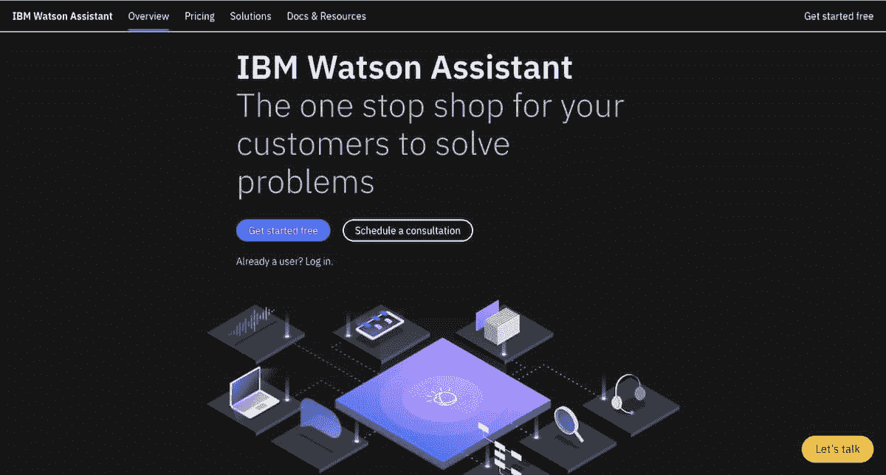

IBM Watson Assistant

虽然今天大多数聊天机器人使用相对简单的多选式菜单来帮助访问者找到信息，并使用基本的问答式设置来收集线索信息，但沃森助手是由人工智能驱动的。

它预先“训练”了某些行业的信息，可以利用用户输入来帮助他们完成各种各样的任务。

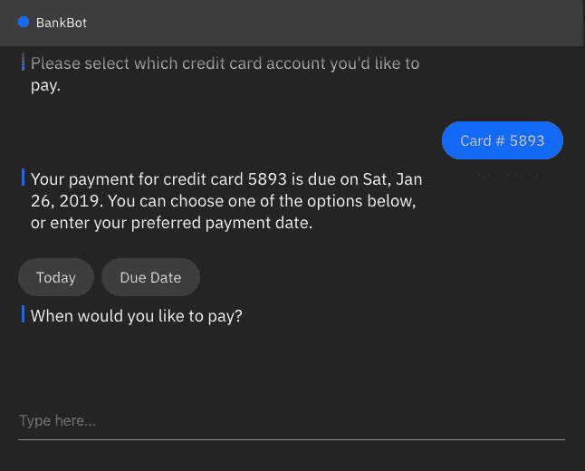

Bankbot

将这个聊天机器人添加到 WordPress 网站就像安装 [Watson Assistant 插件](https://wordpress.org/plugins/conversation-watson/)并定制设置以匹配你的偏好一样简单。

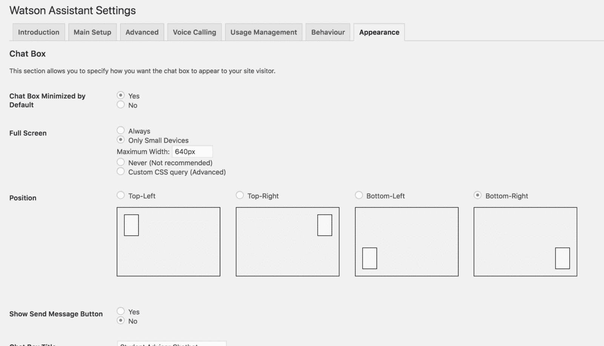

IBM Watson WordPress settings

这些设置允许您自定义聊天界面的外观和感觉，以便它在您的站点上以您想要的方式显示。

### 7.波特西菲

Botsify 是刚开始使用聊天机器人的网站所有者中的一个流行选项。

[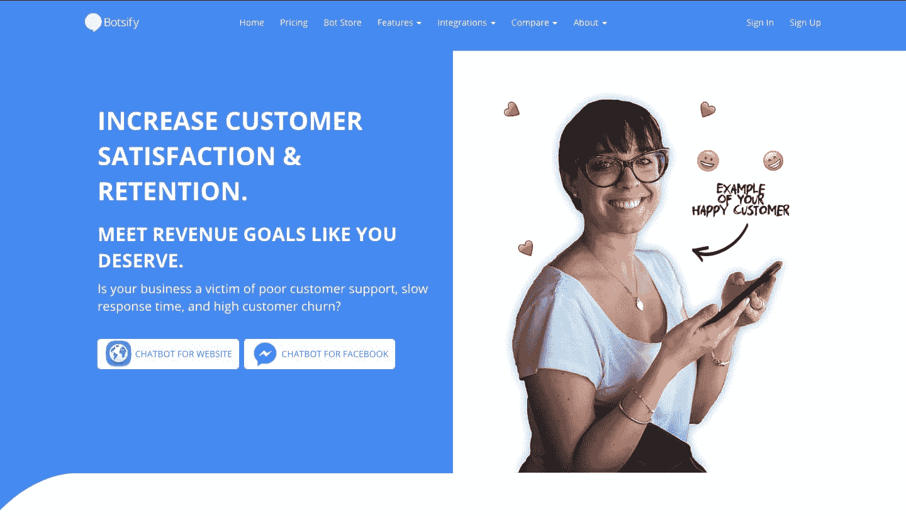](https://botsify.com/)

Botsify

也就是说，就 WordPress 集成而言，这不是最用户友好的，因为这一步必须手动完成。我们建议查看我们的教程，学习如何[添加代码到你的 WordPress 页眉和页脚](https://kinsta.com/knowledgebase/add-code-wordpress-header-footer/)。

### 8.WP-聊天机器人

然后就是 [WP-Chatbot](https://wordpress.org/plugins/wp-chatbot/) 。这是专为 Facebook Messenger 客户聊天而设计的。

如果你熟悉 PPC 或网络营销，你可能听说过 WordStream 公司。WordStream 的创始人拉里·金现在是开发这个插件的公司 [MobileMonkey](https://mobilemonkey.com/) 的首席执行官。他非常了解我们所说的“聊天机器人场景”！这绝对是你想看看的。

[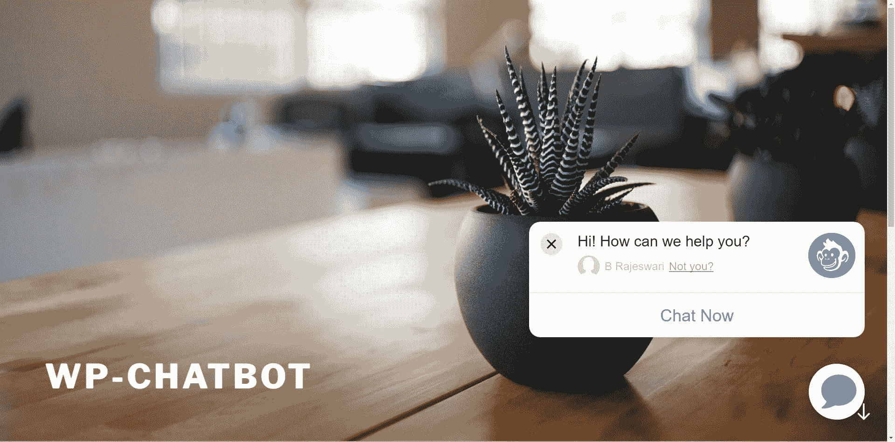](https://wordpress.org/plugins/wp-chatbot/)

WP-Chatbot plugin

### 9.蒂迪奥

[Tidio Live Chat](https://www.tidio.com/) 是为 WordPress 用户提供的一站式聊天解决方案。它允许你[将聊天机器人的功能与电子邮件、实时聊天和信使](https://help.tidio.com/hc/en-us/articles/5379807094684-Install-Tidio-on-WordPress)整合在一起。

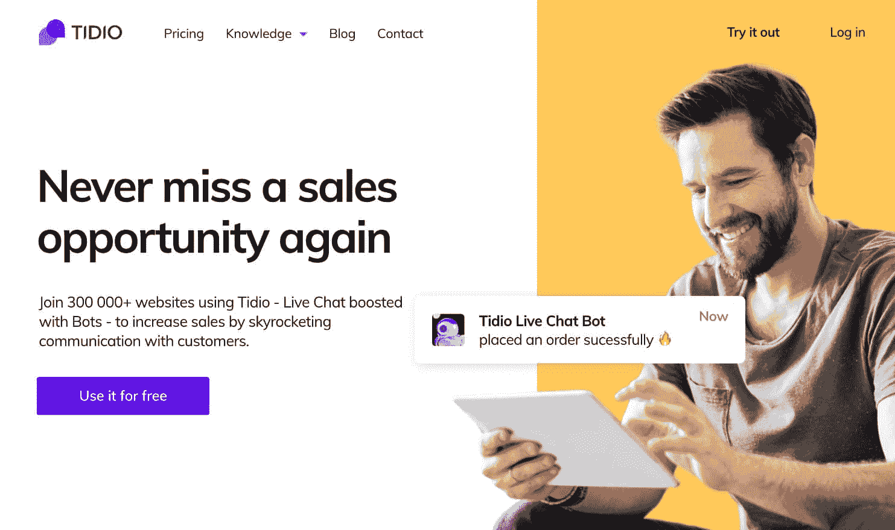

Tidio chatbots

一旦你安装了 Tidio 插件，插件就会弹出来，你就可以开始了。您可以通过一个仪表盘与客户交流，当您不在时，Tidio chatbot 将为您关注客户的查询。

Tidio 安装快速，定制轻松。想象一下你手中的积木，你可以按照你想要的和需要的方式排列——这就是你如何构建聊天机器人的。当您在旅途中时，您可以通过一个[移动应用程序](https://help.tidio.com/hc/en-us/articles/5404870681884-Download-Tidio-Mobile-App)来帮助您的客户，这是您触手可及的专属指挥中心！

但是，如果您的客户更喜欢使用除英语之外的另一种语言呢？蒂迪奥也能处理。Tidio 支持多达 183 种语言，其中 21 种是预翻译的。

另一个伟大的角色？你可以免费使用 Tidio。哦，如果你不喜欢 widget 的默认配色方案，你也可以改变它。

## 摘要

聊天机器人仍然是品牌与潜在顾客和客户互动的一个相对较新的选择，但许多公司已经看到了将它们纳入网站的好处。

这是因为使用网站作为有效的销售工具需要在你的受众需要的时候提供快速的响应和帮助。

聊天机器人可以全天候提供这种服务。他们可以在几秒钟内解决用户的问题和需求，并在他们需要销售或支持人员的帮助时将他们引向正确的人。

这使得它们在收集和优先排序线索、引导访问者到有用的资源、个性化浏览体验，甚至通过处理所有这些任务来减少员工工作量方面非常有效。

虽然聊天机器人曾经只是有预算的企业和开发者从头开始构建它们的可行选择，但现在有很多选择可以让将聊天机器人集成到一个网站变得轻而易举——这使它成为任何公司都值得考虑的一个额外选择。

* * *

让你所有的[应用程序](https://kinsta.com/application-hosting/)、[数据库](https://kinsta.com/database-hosting/)和 [WordPress 网站](https://kinsta.com/wordpress-hosting/)在线并在一个屋檐下。我们功能丰富的高性能云平台包括:

*   在 MyKinsta 仪表盘中轻松设置和管理
*   24/7 专家支持
*   最好的谷歌云平台硬件和网络，由 Kubernetes 提供最大的可扩展性
*   面向速度和安全性的企业级 Cloudflare 集成
*   全球受众覆盖全球多达 35 个数据中心和 275 多个 pop

在第一个月使用托管的[应用程序或托管](https://kinsta.com/application-hosting/)的[数据库，您可以享受 20 美元的优惠，亲自测试一下。探索我们的](https://kinsta.com/database-hosting/)[计划](https://kinsta.com/plans/)或[与销售人员交谈](https://kinsta.com/contact-us/)以找到最适合您的方式。