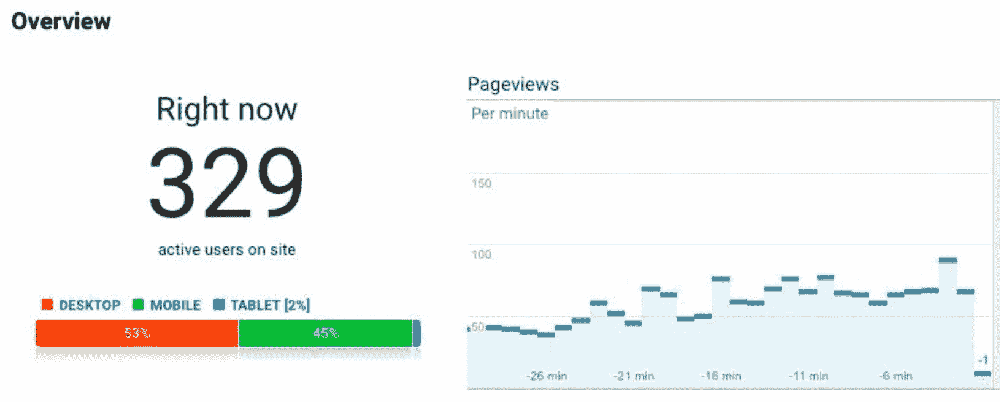

# 发展 SaaS 公司——我们如何接触到神奇的第一批 1000 名客户

> 原文:[https://kinsta.com/blog/growing-saas-company/](https://kinsta.com/blog/growing-saas-company/)

在我发表第一篇关于创业的帖子一年后，我正在写另一篇关于我们在 SaaS 公司成长过程中遇到的挑战和学到的教训。以及如何从你的第一个顾客发展到你的第一个 1000 个顾客。

我决定写第二部分的原因不仅仅是因为我有更多的话要说，而是我们团队收到的反馈令人难以置信！你们真的很喜欢那个帖子，你们留下了一堆评论，分享了你们自己的故事。他们中的许多人都面临着同样的日常挑战，这鼓励我重新开始写作，这样你就可以看到对我们有用的东西。

如果你错过了第一部分，你可以看看这里:[从 0 美元到 7 位数收入的 16 个教训](https://kinsta.com/blog/bootstrapping-startup/)。此外，请务必阅读我们关于 SaaS 营销的深度[指南](https://kinsta.com/blog/saas-marketing/)。

Bootstrapping a startup

我内心深处希望这个帖子会很受欢迎，产生一些反响，但结果超出了我的预期！

在它被提交到《黑客新闻》的同时，它开始获得点击量、上升票数和评论。两个小时后，它成为了第一名，同时有 300-400 名访客。由于我们提供了[应用托管](https://kinsta.com/application-hosting/)、[数据库托管](https://kinsta.com/database-hosting/)和[托管 WordPress 托管](https://kinsta.com/wordpress-hosting/)，并且我们的技术人员知道他们的工作，我们没有任何技术困难来保持网站的正常运行。咳😄

Hundreds of concurrent visitors

数万次访问、315 次投票和 105 条评论之后，我确信，关于公司发展的透明帖子是你作为创始人感兴趣的内容类型，也是我们所有人都可以从中学习的东西。所以我们又来了！

在第一篇文章中，我讲述了 [16 条重要的经验](https://kinsta.com/blog/bootstrapping-startup/),它们不仅帮助我们发展业务和增加 ARR(年度经常性收入),还告诉我们如何在没有任何外部投资的情况下做到这一点。我们在一个由价值数十亿美元的公司主导的行业中获得了牵引力。

当我们在 2013 年决定让 Kinsta 试一试时，我们无法想象会有 1000 名付费客户。现在是 2019 年初，我们已经超越了这第一个但非常重要的里程碑。

<link rel="stylesheet" href="https://kinsta.com/wp-content/themes/kinsta/dist/components/ctas/cta-mini.css?ver=2e932b8aba3918bfb818">

> Kinsta 把我宠坏了，所以我现在要求每个供应商都提供这样的服务。我们还试图通过我们的 SaaS 工具支持达到这一水平。
> 
> <footer class="wp-block-kinsta-client-quote__footer">
> 
> 
> 
> <cite class="wp-block-kinsta-client-quote__cite">Suganthan Mohanadasan from @Suganthanmn</cite></footer>

[View plans](https://kinsta.com/plans/)

我想坚持这个数字，并把它加到文章的标题中，因为这是一个神奇的数字，不是吗？说“嘿，我有一千个顾客”的感觉真好！如果你能达到 1000，你就能达到 10000，50000 等等。😉

作为一家公司，没有什么比从头开始，看着你的客户群随着时间的推移不断增长更令人满意的了。但是，一旦你接触到这神奇的 1000 名客户，你就不能高枕无忧了。在很多方面，这和创业初期一样具有挑战性。你只需要应对各种不同的挑战，比如不断招聘、管理不断壮大的团队、处理财务以及更复杂的产品开发周期。

希望下面的经验和见解可以帮助你快速将你的业务发展到 1，000 个客户甚至更多。下面的一些想法可能听起来像陈词滥调，但我会给每个想法添加上下文来帮助你更好地理解和验证我的观点。我们开始吧！

## 最重要的一点:解决问题

真是老生常谈，对吧？我知道，但是你能想象每天有多少创业公司因为没有解决问题而失败吗？如果他们有一个看起来很酷的产品或工具，这并不意味着市场会奖励它，甚至需要它。我说的奖励是指成为付费客户。打开钱包输入信用卡信息的人们。

Take my money (Image source: [Imgur](https://imgur.com/gallery/eFfmdb3))

你如何说服别人为服务付费？简单，**找到并解决他们的痛点**。

好吧，但这到底是什么意思？您解决的难题有助于他们完成以下一项或多项工作:

1.  省钱
2.  节省时间
3.  帮助他们赚钱

如果你找到了以上任何一个问题的解决方案，现在你就有了一个商业点子！如果你解决了其中两个，你就有一张王牌。三个都是？你可能中大奖了。

[As a startup, you must solve a problem! This is why people whip out their credit cards. 💳Click to Tweet](https://twitter.com/intent/tweet?url=https%3A%2F%2Fkinsta.com%2Fblog%2Fgrowing-saas-company%2F&via=kinsta&text=As+a+startup%2C+you+must+solve+a+problem%21+This+is+why+people+whip+out+their+credit+cards.+%F0%9F%92%B3&hashtags=startups%2CSaaS)

我承诺了更多的上下文，所以这里有一个例子。在 Kinsta，我们提供应用程序、数据库和托管 WordPress 托管服务。这是一个有很多好处的高级解决方案。

**1。我们为客户省钱。怎么会？他们不需要雇佣昂贵而熟练的系统管理员来管理他们的网站和服务器。我们为他们处理这件事。**

**2。我们为客户节省时间**。很多啊！怎么会？如果他们在自己的网站上遇到任何[技术问题](https://kinsta.com/knowledgebase/the-site-is-experiencing-technical-difficulties/)，他们只需点击一下就能获得帮助。一分钟之内，我们的一名支持工程师将与他们取得联系并进行检查。他们不需要谷歌答案，不需要去 Stack Overflow，也不需要打电话给懂技术的朋友。我们全天候待命。

每个曾经编程过对他们来说太复杂的东西的人都会有迷失的感觉，**非常非常沮丧**，并且尝试你所知的一切来使那个东西工作会浪费时间。

客户也不必更新软件版本，为 WordPress 优化服务器，做备份，[拦截 DDoS 攻击](https://kinsta.com/blog/what-is-a-ddos-attack/)，设置 [WordPress 缓存](https://kinsta.com/blog/wordpress-cache/)，或者[监控网站恶意软件](https://kinsta.com/secure-wordpress-hosting/)。我们会处理好这一切。他们托管的网站越多，我们节省的时间就越多。这是他们乐于支付的东西！

**3。我们帮助客户赚钱。我们与许多[网站开发](https://kinsta.com/partners/codeable/)、网站维护( [WP 爱好者](https://kinsta.com/agency-directory/wp-buffs/)、 [WP 补品](https://kinsta.com/agency-directory/wp-tonic/)、[暴涨 WP](https://kinsta.com/agency-directory/skyrocketwp/) )和设计机构合作。通过外包虚拟主机，他们可以专注于自己的核心业务，而不会被这些额外但必要的任务分心，如为客户管理服务器。我们处理他们的这部分业务，然后他们可以接受新的客户和项目。到了月底，他们会赚更多的钱。更不用说，如果他们利用我们的[联盟计划](https://kinsta.com/affiliates/)，他们可以赚取每月经常性收入！**

如你所见，我们解决问题。虚拟主机是一个无聊的行业(至少从用户的角度来看)，但我们解决了大多数网站所有者每天都面临的问题。这就是为什么他们愿意按月订阅。

这应该是你创业的目标。让人们每月为你的服务或产品付费，因为它提供了价值。每月的经常性收入是所有 SaaS 公司的基础。MRR 是我最喜欢的词之一。😄

## 让你的产品与众不同，脱颖而出，否则就关门大吉

大多数企业将保持平庸。但是平庸已经不够了，尤其是在 2019 年。

你想发展你的业务，增加你的[经常性收入](https://kinsta.com/blog/recurring-revenue-model/)，并从中分一杯羹，对吗？你已经用你的产品解决了一个问题(或者你应该),并且渴望新的客户。

那些潜在客户就在那里，你只需要找到并说服他们。如果你只是和竞争对手做同样事情的另一家公司，你如何说服他们？没有人会对另一个小型企业 CRM、照片编辑软件或社交分享工具感兴趣，除非它提供了新的或独特的东西。

你必须与众不同，你必须清楚地表明你不仅仅是另一个基地营的克隆人。告诉并向他们展示你是如何从人群中脱颖而出的，你的产品是如何给他们一些他们在目前的供应商那里得不到的东西。

**比竞争对手低 10 美元并不是你应该瞄准的差异化因素**。

如果较低的价格是你最好的区别，你应该重新考虑你的业务。竞争到底不是一个好的策略，也很少奏效。这个我以后再讲。

许多公司喜欢谈论数字和事实，但实际上，这些并没有你想象的那么重要。标题和营销术语，如:

> 我们是第一个，我们创造了这个十亿美元的产业。所以你应该和我们一起工作。

或者

> 我们和最大的品牌合作。

人们关心这个吗？在某些情况下，是的，但你只能在这种心态下滑行这么久。不要用你过去的成就来推销自己。

> 我们得到了数千万美元的资金，所以我们是最好的合作伙伴！

一堆钱不等于好服务。许多由风投资助的公司提供糟糕的服务，因为他们只关心增长，而忘记了为客户服务。投资者才是幕后真正的决策者。

> 我们有一个 500 人的团队，而业内其他人只有一个小团队！

千万不要用这个来说服线索。这让你听起来很绝望，而且与你的服务质量无关。相信我，绝大多数潜在客户和客户并不关心上面提到的任何事情。这些不是他们寻找的竞争优势。

Differentiators (Image source: [Imgflip](https://imgflip.com/i/2qp1mc))

什么才是真正的不同？

*   您的技术堆栈。
*   你的创新和独一无二的特性。
*   您出色的客户服务。
*   您的知识和专业技能使您成为行业的领导者。
*   根据客户反馈采纳新趋势和产品改进。

当然，还有所有这些的组合。

### 创造伟大的内容

另一种脱颖而出的方法是你的网站文案。然而，这并不总是最容易做到的事情。事实上，在某些情况下，根据你的技能，这可能是最难的。

这不仅需要时间，而且几乎总是需要你做客户调查。在你的网站上，你必须使用客户的语言。你可能会觉得奇怪，或者认为你必须使用复杂的术语和表达，但请相信我，你的客户的语言是最好的转换。

在 Kinsta，我们不卖服务器。我们不出售云中的磁盘空间，也不出售 99.9%的正常运行时间。那我们该怎么办？我们在销售一种体验。安心的是我们的团队打理这个复杂又无聊的叫虚拟主机的东西；即使是在星期天或除夕。

> 要卖掉一架钢琴，不要告诉他们买一架。向他们展示人们在家中享受音乐客厅的乐趣，并让他们想要这样。他们将自愿买一架钢琴。这就是爱德华·伯奈斯在 1928 年发明现代公共关系时所做的。卖的不是东西，而是情感。
> 
> —加里·谭陈嘉兴(@ garry tan)[2018 年 2 月 20 日](https://twitter.com/garrytan/status/965803207002750976?ref_src=twsrc%5Etfw)