# 什么是广告重定位–完整的入门指南

> 原文：<https://kinsta.com/blog/ad-retargeting/>

你已经花费了大量的时间、精力和金钱来推广你的网站。每当有新的访问者访问你的网站时，你可能会很高兴。但是，如果不能帮助你盈利，兴奋感可能会在一段时间后消失。

研究表明，在线企业和电子商务商店仅成功转化了 3%的访问者。换句话说，平均每 100 个访问者中，你只能获得 3 笔交易。这是因为在顾客决定从你这里购买之前，大约需要 [6 到 8 次接触](https://www.salesforce.com/blog/2015/04/takes-6-8-touches-generate-viable-sales-lead-heres-why-gp.html)。

这样做的主要问题是，这些访问者中的大多数将永远不会回来完成销售。那么，你如何跟进并建立 6 到 8 个必要的联系人来获得他们的信任和关注呢？解决方案是在线广告重定向。

[Data says only 3% of visitors convert! Take advantage of retargeting to get that 97% back. 💰Click to Tweet](https://twitter.com/intent/tweet?url=https%3A%2F%2Fkinsta.com%2Fblog%2Fad-retargeting%2F&via=kinsta&text=Data+says+only+3%25+of+visitors+convert%21+Take+advantage+of+retargeting+to+get+that+97%25+back.+%F0%9F%92%B0&hashtags=retargeting%2Cmarketing)

这里是你需要知道的一切关于广告重定向，它是如何工作的，以及如何在几分钟内开始！请随意跳到感兴趣的部分:

*   什么是广告重定向？
*   [重定目标的类型](#types-of-retargeting)
*   你可以在哪些平台上运行重定向广告？
*   [社交媒体重定向平台](#social-media-retargeting)
*   [如何在几分钟内建立一个谷歌广告重定向活动](#google-ads-retargeting)

## 什么是广告重定向？

广告再定位，也称为再定位或再营销，是一种营销过程，在这种过程中，您将广告定位到之前与您的网站或社交媒体平台互动过的用户，而这些用户尚未转化为销售。

Support

例如，如果有人访问你的网站，浏览了几个不同的页面，但没有填写你的联系表格或购买，重新定位可以帮助你再次接触到他们。

> 需要在这里大声喊出来。Kinsta 太神奇了，我用它做我的个人网站。支持是迅速和杰出的，他们的服务器是 WordPress 最快的。
> 
> <footer class="wp-block-kinsta-client-quote__footer">
> 
> 
> 
> <cite class="wp-block-kinsta-client-quote__cite">Phillip Stemann</cite></footer>

[View plans](https://kinsta.com/plans/)

由于你没有他们的电子邮件或联系信息，重定位通过像素和 cookies 工作。因此，当有人登陆你的网站而没有购买就离开时，你可以运行一个重新定位的广告活动，向他们发送进一步的营销信息。

与其浪费你的整个广告预算来获得新的访问者，你必须考虑用个性化的广告和信息来重新定位那些已经访问过你的网站的人。

让我们更深入地了解重定目标实际上是如何工作的。

### 重定目标是如何工作的？

当访问者登陆你的网站时，他们会被贴上一个 cookie 或像素标签。这使得你可以在这些人上网的任何地方为他们定制广告。

举个例子，我最近在读《BigCommerce 联盟营销研究》。这是挤满了有用的信息和线索磁铁在文章的结尾。但是，我最终没有给他们我的信息，比如电子邮件和电话号码。

相反，我读了邮件，继续我的一天。仅仅几天后，我开始在脸书上收到来自 BigCommerce 的广告，内容是关于联盟营销指南和发展网上商店。

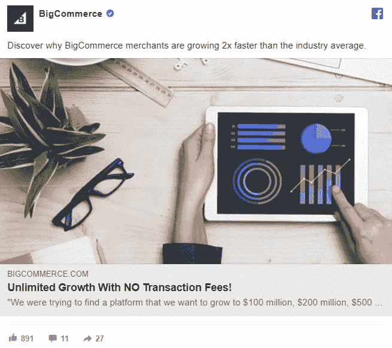

Ad retargeting example on Facebook

这不是巧合。我没有神奇地同时开始得到广告。因为他们安装了脸书像素，一个连接到脸书的网站标签，允许他们向脸书上的人发送广告，我收到了重定向广告。

重定目标实际上是一个非常简单的过程:

1.  首先，网站和广告商在他们的网站上安装一个“标签”来跟踪访问者的行为。
2.  当网站访问者登陆你的网站时，他们会通过 cookies 或 pixel 被标记和跟踪。请记住，由于 [GDPR](https://kinsta.com/blog/wordpress-gdpr-compliance/) 导致数据隐私发生变化，你需要征得访问者的许可才能放置 cookies 或通过 pixels 收集数据。
3.  接下来，广告商开展一项活动，以那些拥有他们感兴趣的相关信息的访问者为目标。

有用吗？你打赌。广告重定向有令人印象深刻的背景。

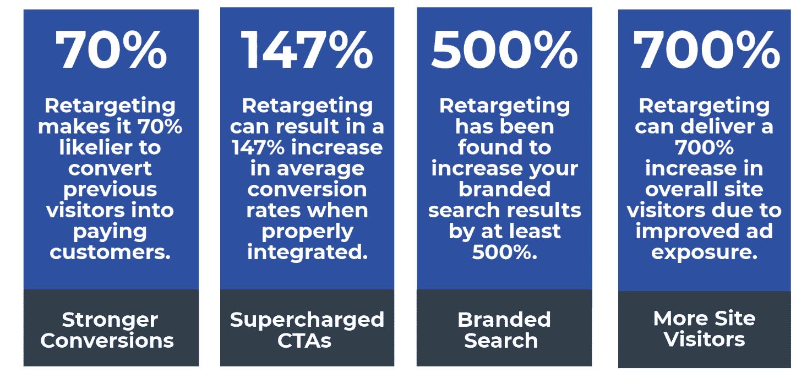

Retargeting stats (Image source: [ReadyCloud](https://www.readycloud.com/info/these-2018-retargeting-statistics-prove-it-works))

*   重新定位增加 70%的网站流量转换机会。
*   重新定位可以产生 147%的平均转化率
*   重新定位显著提高了搜索结果中的品牌认知度(500%)
*   通过带回以前的访问者，你的网站流量暴涨了 700%

那么，今天你如何开始使用重定目标呢？还有什么其他好处？请阅读以下内容，了解详情！

### 重定位的好处:为什么重定位广告优于普通展示广告

重定位广告在许多方面比典型的展示广告更好。

在一个标准的广告活动中，你的广告会被许多不是你潜在客户的人看到并点击(即使有所有的定位选项)。然而，重新定位可以让你锁定那些对你网站的特定页面或类别感兴趣的人，这可以证明他们对你的产品或服务感兴趣。

这意味着你推动销售的机会/可能性大大增加了。为什么？您现在的目标是之前对您销售的产品感兴趣的人的名单！本质上，这是对“热情”的观众做广告，也就是说，这些观众以前和你接触过，显示出他们非常适合你的产品或服务的信号。

在传统的展示广告中，你接触到的许多人将毫无兴趣。

重定目标非常适合:

*   创建个性化广告:你可以根据访问者的行为对他们进行分类，然后为每个访问者提供个性化广告。例如，健身器材商店可以将访问有氧训练类别的人作为有氧配件广告的目标，而访问力量训练的人将看到力量训练器材广告。
*   **获得更多的转化率:**重新定位广告将带来更好的[转化率](https://kinsta.com/blog/conversion-rate-optimization-tips/)和更低的 CPA(每次收购成本),因为你用正确的广告瞄准了正确的人。
*   **建立品牌知名度:**很少有访客会信任他们第一次看到的品牌并购买，因此转化率很低。事实上，研究表明，消费者在[谷歌搜索](https://kinsta.com/blog/google-search-operators/)结果[上首先寻找的是一个品牌名称](https://searchengineland.com/brand-bias-70-of-consumers-look-for-known-retailers-when-doing-product-searches-179570)(知名零售商)，甚至高于价格和评论。

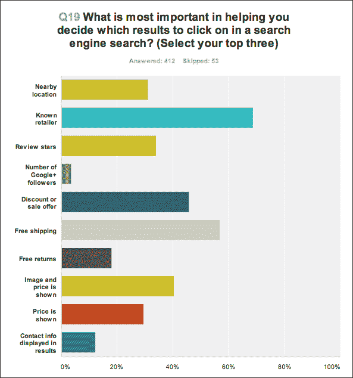

SERPs known retailers (Image source: [Search Engine Land](https://searchengineland.com/brand-bias-70-of-consumers-look-for-known-retailers-when-doing-product-searches-179570))

令人欣慰的是，重定向可以让你跟随这些访问者去网络上的任何地方，给他们留下你是一个大的知名品牌的印象。通过更多地看到你的品牌名称，他们开始熟悉它，有助于未来销售的品牌意识。当他们在这么多网站上看到你的广告时，他们会越来越了解你和你是谁，并会受到你的品牌认同的影响。

既然你已经了解了重新定位广告的好处，让我们来看看你可以利用不同类型的广告来建立你的销售。

## 重定位的类型

你可以根据各种各样的东西重新定位客户，比如搜索、意图、网站访问、电子邮件等。所有这些都可以非常有效地为你的网站带来流量，增加销售额或销售线索。让我们详细了解一下这些类型。

### 1.通用网站重定向

一般网站定位是最常见的重定向类型。在像脸书、推特、Quora、谷歌广告、必应或 LinkedIn 这样的平台上，你可以使用这种类型的重定向。

本质上，你有几个不同的选择与一般网站重定向。最常见的方法是为过去 30-90 天内访问过您网站的任何人创建一个重新定位列表。

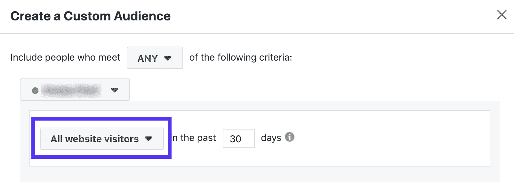

Facebook retargeting audience – last 30 days

这意味着在过去 30 天内访问过您网站上任何页面的每个人都将收到进一步的营销广告。第二个更复杂的选择是获得更具体的，并排除您的网站上特定页面的访问者。例如，您可能不想向已经购买了您的产品或已经填写了您的联系表单的人显示您的广告。这减少了广告支出。

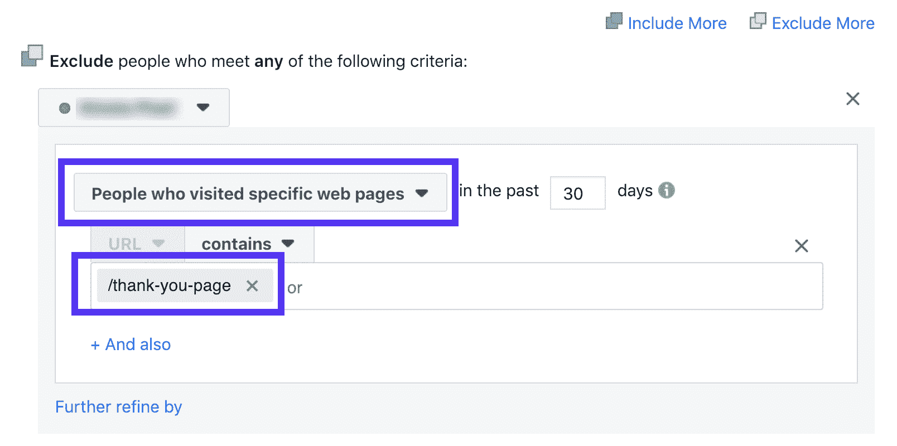

Exclude customers or leads in Facebook audience

或者，你可以只向那些访问过你网站上特定页面(比如你的定价页面)但从未转化过的访问者显示重定向广告，这意味着他们很接近。这让你可以根据具体情况量身定制广告。例如，如果你销售女性和男性服装，如果你的目标是所有的网站访问者，那么个性化广告将会变得更加困难。

但是如果你的目标网站访问是:

1.  男装
2.  女装

然后，您可以创建更具体和个性化的广告内容！

一般的网站重定向通常是在脸书、谷歌合作伙伴网站和其他社交媒体平台上完成的。通过使用通用网站重定向广告，一家奢侈品手表零售商获得了 [1300%的投资回报率和 34%的低 CPAs](https://www.thinkwithgoogle.com/case-studies/watchfinder-increases-roi-by-remarketing-with-google-analytics.html) 。通过重新定位那些有意向但没有在网站上购买的用户，他们是重新定位的主要受众。

### 2.搜索网络重定向

一些广告平台允许你根据人们最近在热门搜索引擎上的搜索来重新定位他们。例如，有人搜索“平衡教练”，并在他们的合作伙伴网站网络的页面上登陆。

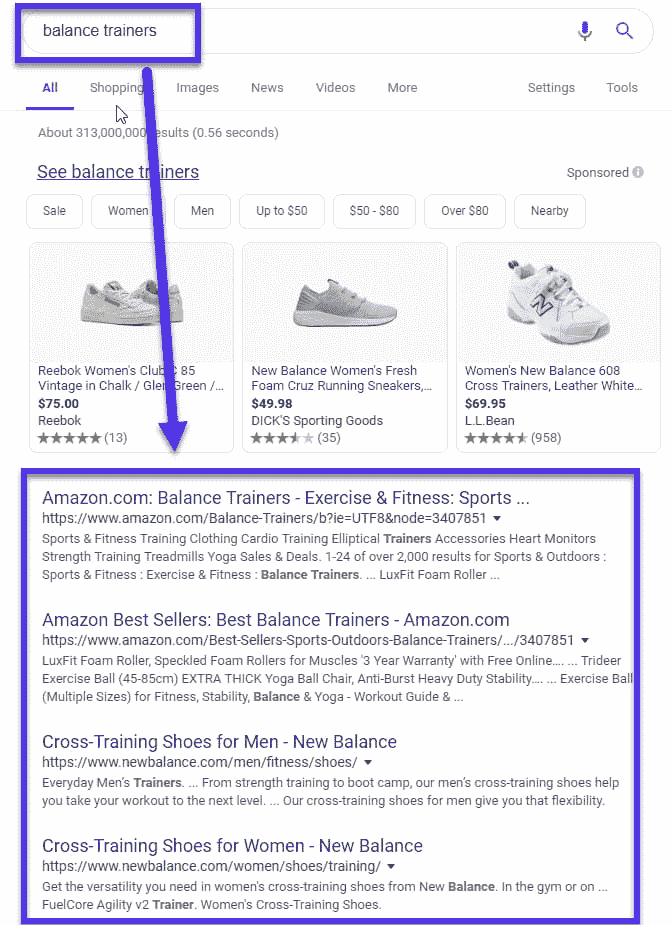

Search network retargeting

访问者将根据搜索结果被标记，你可以用你公司的广告来锁定他们。

### 3.搜索广告的再销售列表

当你的网站访问者在谷歌搜索中搜索相关产品时，谷歌广告允许你重新定位他们。这些被称为搜索广告的再销售列表，更广为人知的是 RLSAs。

你可以为最近访问过你的网站的人设定更高的出价，因为这些人更有可能转化。这个过程很简单。

首先，用户会登陆你的网站，比如 Kinsta.com。

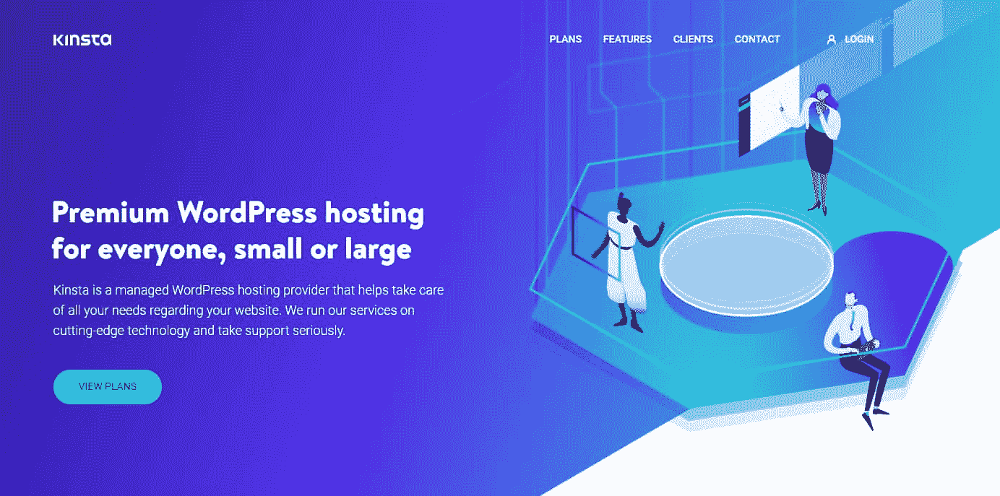

Kinsta website

一旦他们做到了这一点，他们就被贴上了 cookie 或像素标签。

作为广告商，假设你想在 Google 搜索结果中显示“WordPress hosting”关键字(以 Kinsta 为例)。

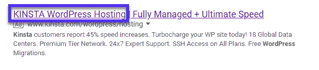

Google ad

你可以只锁定那些曾经登陆过你的网站并搜索过这个关键词的人，而不是完全锁定世界上每一个寻找“WordPress 虚拟主机”的搜索者。

RLSAs 是一个很好的方法，可以根据特定的关键字将访问者从你的网站转移到谷歌上搜索。eBags 是最大的包袋和配饰网上商店之一。阅读此[案例研究](https://www.thinkwithgoogle.com/case-studies/ebags-reaches-next-generation-with-adwords.html)，了解他们如何通过使用搜索广告的再销售列表实现 10-15%的收入增长。

### 4.电子邮件广告重定向

就像上面的方法一样，重定向也可以通过电子邮件来完成！电子邮件重定向允许您通过定制广告识别潜在客户，通过 Gmail 广告直接显示在他们收件箱的顶部。

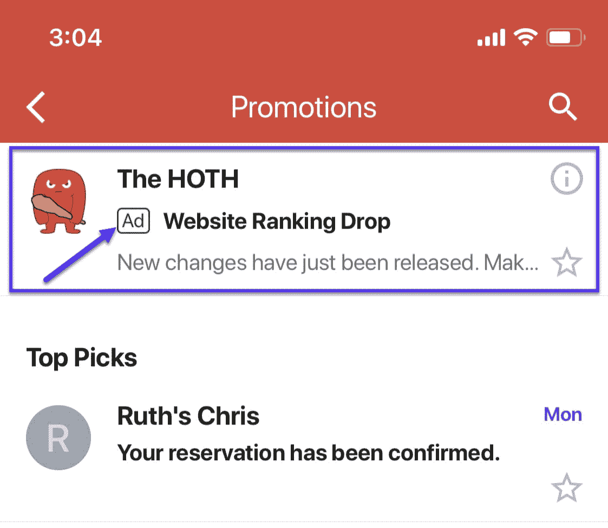

Email retargeting in Gmail

一些平台提供 CRM 重定向，即使他们没有打开你的电子邮件或时事通讯，你也可以把你的邮件列表上的人作为目标。

## 你可以在什么平台上运行重定向广告？

如果你想尝试广告重定向，你必须使用第三方服务来管理技术方面的东西，如跟踪像素、cookies、受众建设、报告和用户细分。

您可以从以下平台中选择一个。其中一些是自助服务，而另一些是完全管理的，这取决于您需要什么级别的外部参与。

如果你对自己的营销能力更有信心，你可以使用谷歌广告或 AdRoll 等平台。如果你找不到可以运作再营销活动的人，你可能不得不雇佣一个自由职业者，一个代理人，或者学习如何去做。

这里有一些很棒的平台可供选择。

### 谷歌广告

谷歌广告是最受欢迎的广告网络。借助易于使用的仪表板和快速设置，您可以在几天内运行重定向广告。如果你使用谷歌广告，建立一个重新定位的活动是非常简单的。您只需要启用重新定位，创建再营销列表，并创建定制的广告来吸引这些列表上的用户。

它还为搜索广告(RLSA)提供网站重定向和再营销列表。请务必查看我们关于如何为您的业务使用 Google AdWords 的详细指南。

### 阿德罗尔

[AdRoll](https://www.adroll.com/) 使设置、执行和分析重新定位活动变得极其容易。它支持所有流行的网络和广告交换，如谷歌、脸书或 Twitter，所以你可以跟踪你的潜在客户，无论他们去哪里。如果你在 AdWords 和 AdRoll 之间争论，AdRoll 有更大的影响力，也更容易设置。

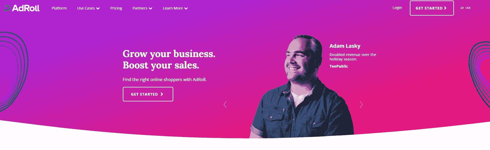

AdRoll

### 完美的观众

[Perfect Audience](http://www.perfectaudience.com/) 是另一个易于使用的平台，提供站点重定向、移动应用重定向、脸书重定向等等。他们没有安装费或最低消费要求，这使它成为小企业的一个很好的选择。

### Retargeter

Retargeter 向客户提供 DIY 和托管服务。DIY 计划仅限于站点重定目标和脸书重定目标，而托管服务附带了 CRM 或搜索重定目标等附加选项。

## 社交媒体重定向平台

除了上面提到的平台，流行的社交媒体网络也可以让你通过原生广告锁定网站访问者。

社交媒体上最受欢迎的重定向网站是脸书。为什么？他们拥有最大的受众群，让你可以接触到每月近 25 亿的活跃用户。看看关于脸书的其他一些疯狂的事实。

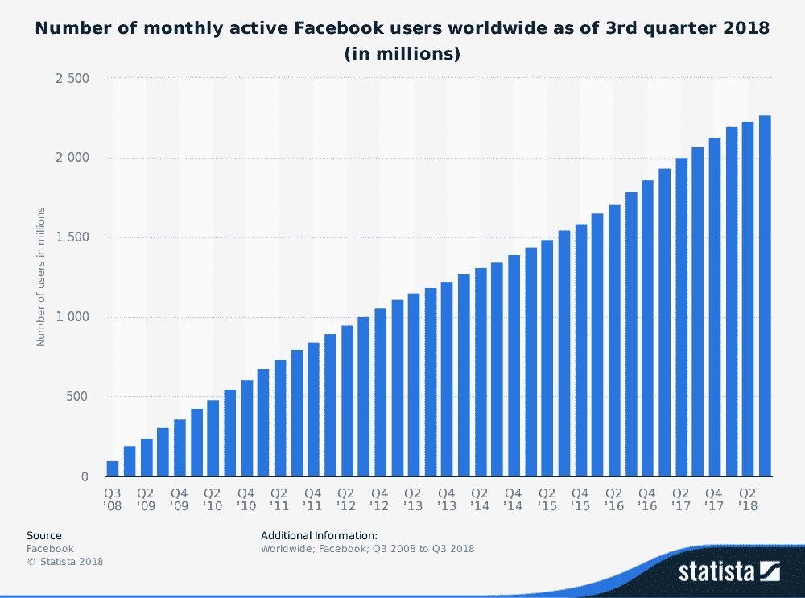

Facebook monthly active users (Image source: [Statista](https://www.statista.com/statistics/264810/number-of-monthly-active-facebook-users-worldwide/))

这里是所有你需要知道的关于开始重定目标在脸书。

## 注册订阅时事通讯

### 想知道我们是怎么让流量增长超过 1000%的吗？

加入 20，000 多名获得我们每周时事通讯和内部消息的人的行列吧！

[Subscribe Now](#newsletter)

### 脸书重新定位

脸书有如此庞大的用户群，吸引了大量的广告潜力。

除此之外，脸书还拥有一些世界上最先进的瞄准工具。

您可以针对您能想到的任何类型的兴趣、行为或人口统计数据，从头开始创建全新的受众:

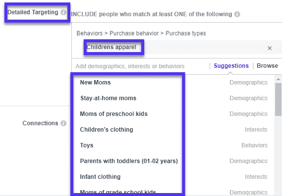

Facebook demographic and interest targeting

目前，脸书提供了三种不同的受众类型，每种类型都包含几十种子类型，以针对任何人，从您网站的访问者到社交活动和全新的受众:

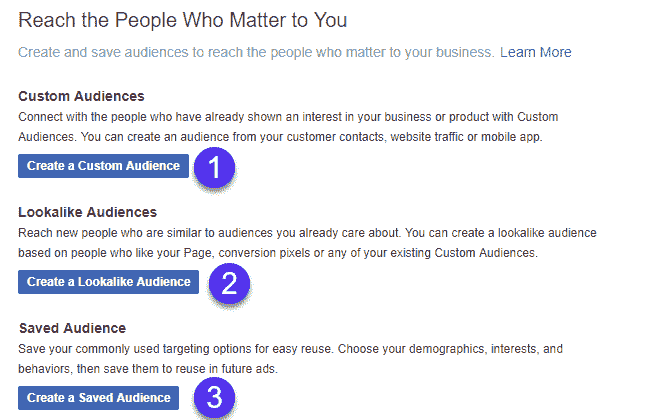

Facebook audience types

1.  **定制受众:**根据之前对你表现出兴趣并与你接触过的人，开发目标受众。这可以在你的网站上，在脸书，通过移动应用程序，等等。
2.  **长相相似的观众:**上传一份你当前客户的名单到脸书，他们会将名单与可比较的目标进行匹配，从而进行精确定位。
3.  **保存的受众:**利用人口统计、兴趣、收入、行为等等，从零开始创造全新的受众。

为了在脸书上设置重定向广告，你将使用[脸书像素](https://kinsta.com/blog/conversion-tracking/#fb-conversion-tracking-pixel)来标记你的网站访问者。

#### 第一步

为此，首先，在[脸书业务经理](https://business.facebook.com/)上创建一个帐户。这个平台将帮助你管理你所有的脸书广告工作。创建您的帐户也是免费的！

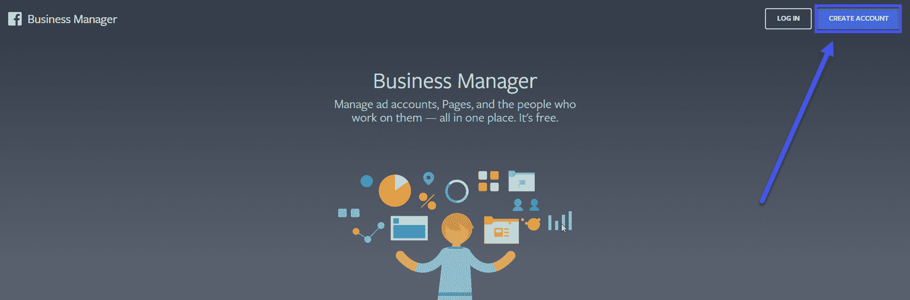

Facebook Business Manager

#### 第二步

在 Business Manager 仪表板上，单击工具栏上的，并从测量和报告部分选择“像素”选项。

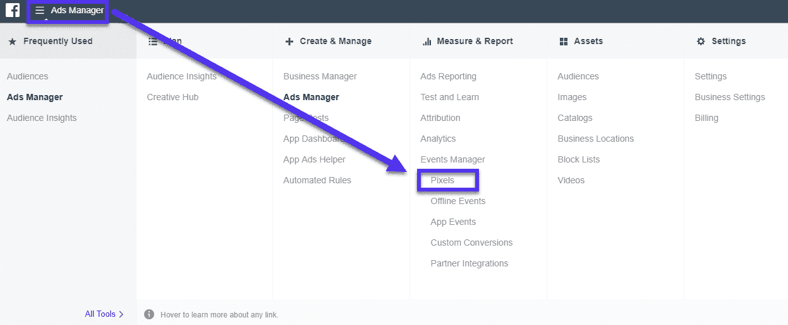

Facebook pixel

#### 第三步

接下来，单击“设置 Pixel”将其添加到您的网站:

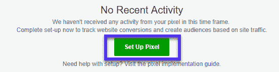

Set up Facebook pixel

#### 第四步

从这里开始，您有三个简单的选项可以开始。

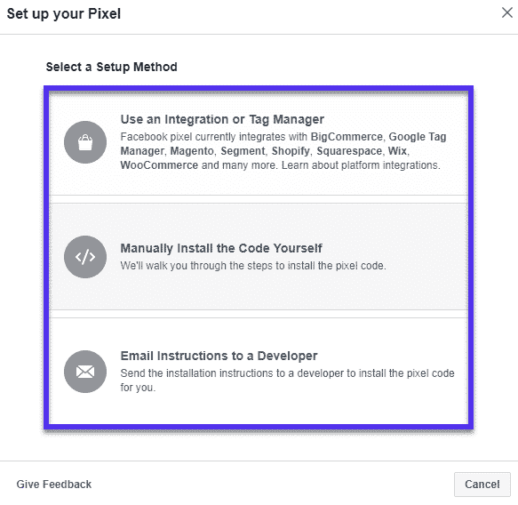

Facebook pixel integration options

1.  使用标签管理器(如果您的站点上已经有了这个设置，并且您不熟悉代码，这是最简单的选择)
2.  手动将代码复制并粘贴到您的网站上
3.  通过电子邮件将说明发送给网站开发者

根据你的选择，脸书将带你走过每一步！如果你需要帮助，你可以查看我们关于如何在你的 WordPress 网站上设置脸书像素的更详细的教程。

#### 第五步

一旦你安装了 pixel，给它几天时间开始收集交通数据，然后再开展活动。虽然尽早开始没有坏处，但是在像素有更多数据之前，您可能看不到太多活动。当您准备好开展活动时，您可以前往脸书业务经理的“受众”部分，为重新定位创建新的自定义受众。

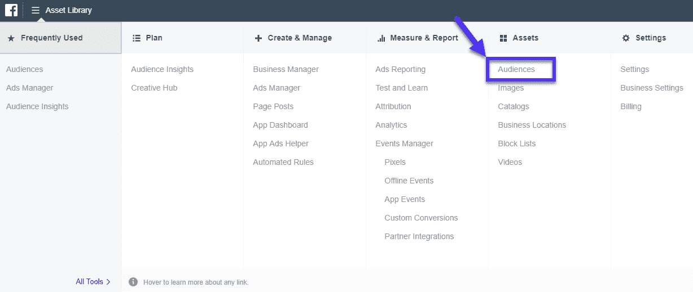

Facebook audiences in Ad Manager

#### 第六步

在这里，您可以基于许多重定位功能创建新的自定义受众。对于重新定位的活动，这通常是“网站流量”

Struggling with downtime and WordPress problems? Kinsta is the hosting solution designed to save you time! [Check out our features](https://kinsta.com/features/)

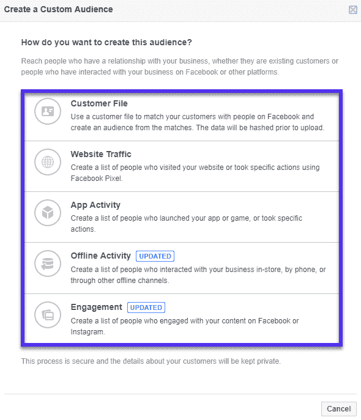

Facebook custom audience

#### 第七步

一旦你创建了你的目标受众，你就可以从广告管理器(在业务管理器中)创建新的广告，并观看滚滚而来的流量！

### 其他社交媒体重定向网络

许多社交媒体网站现在在其广告选项中提供了一些类型的重新定位功能。这里有几个你可能想试试的网络。

*   **Twitter 重新定位** : [在你的网站上放置 Twitter 标签](https://kinsta.com/blog/conversion-tracking/#twitter-conversion-tracking-wordpress)。等待一周，让它创建一个你的网站访问者列表。然后，你可以通过将出现在他们的时间表中的推广推文来锁定这些人。
*   **Pinterest 重定向:** Pinterest 最近为广告商增加了一个重定向选项，这意味着你可以通过推广的 pin 在 Pinterest 上锁定你的网站访客。
*   Quora 重新定位: Quora 允许你在你的广告像素中定位那些访问过你的网站但没有购买的人。
*   LinkedIn 的重新定位: LinkedIn 的工作方式就像脸书和 Twitter 一样。细分并重新吸引那些通过 LinkedIn 广告访问过你网站的访问者。
*   **YouTube 重定位:**通过谷歌广告完成，受众与你为典型的谷歌广告重定位设置的受众相同(如下所示)。

如果你需要在你的 WordPress 网站上设置像素的帮助，一定要看看我们的[终极转换跟踪指南](https://kinsta.com/blog/conversion-tracking/)。

## 如何在几分钟内建立一个谷歌广告重定向运动

用 [Google Ads](https://ads.google.com/home/) (以前的 Google AdWords)建立一个重新定位的活动非常容易。只要遵循这些简单的步骤。

### 第一步

你会得到一小段代码(在某些平台上也称为“标签”或“像素”)，你需要把它放在你的网站上。您可以通过单击工具箱中的“转换”部分找到这段代码。

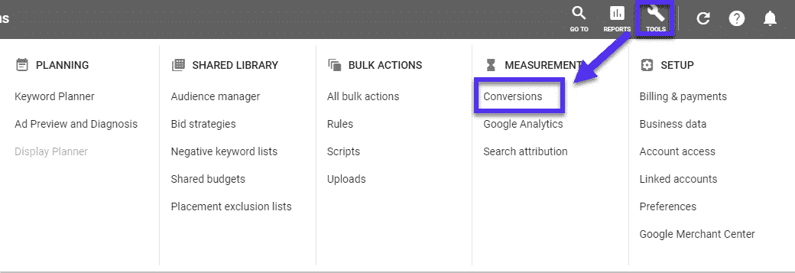

Google Ads conversions

### 第二步

在这里，根据您的网站操作创建一个新的转换跟踪元素。

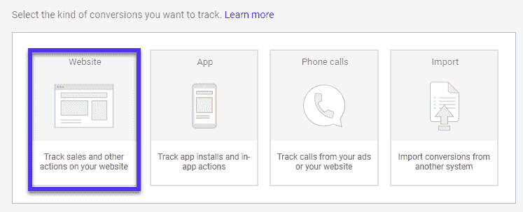

Google Ads website actions

你可以像安装脸书一样安装它。查看我们关于如何在你的 WordPress 网站上设置 Google AdWords 转换跟踪的更详细的教程。一旦到位，这些代码将开始标记您的网站访问者。

### 第三步

接下来，您需要创建再销售列表。

根据您的预算或目标，您可以选择针对所有网站访问者、回头客、浏览特定部分的访问者或在您的网站上执行特定操作的访问者。

创建广告，你的广告将提供给你的再销售名单上的人！

### 第四步

只是给你一个想法，这里是如何建立一个显示网络的谷歌广告重新定位活动。首先，进入谷歌广告仪表板，点击“活动”标签。从这里点击蓝色+按钮创建一个新的活动。

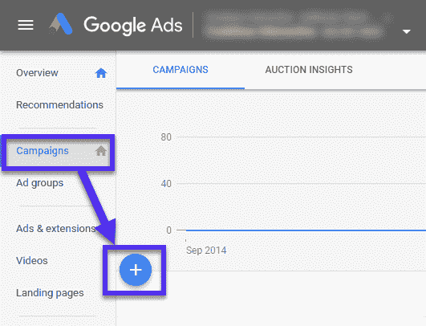

New Google Ads campaign

### 第五步

接下来，谷歌广告会要求你选择你想要完成的目标。根据你选择的目标，你会有不同的选项可供选择。对于重定向，您可以选择网站流量的目标。然后从下拉列表中选择“显示”作为活动类型。

Google Ads website display

### 第六步

展示是开始重新定位活动的最简单方式。选择“标准展示活动”子类型，然后输入您的企业网站。

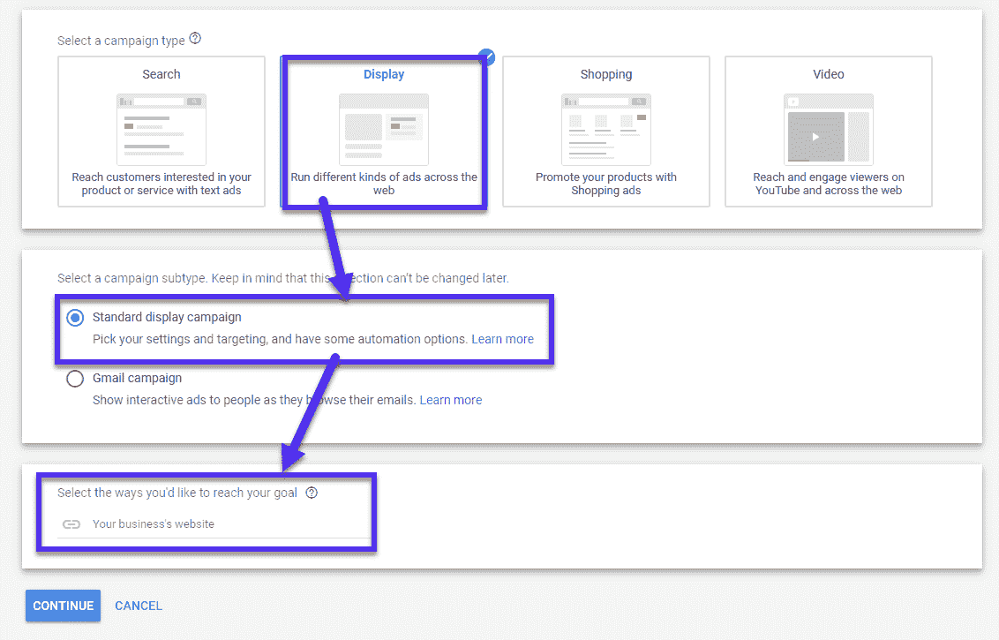

Google Ads display campaign subtype

点击继续，您现在可以调整您的所有活动设置，如预算、支出等。

### 第七步

最重要的下一步是编辑本次活动的受众目标，以选择目标列表！

向下滚动到受众部分，选择“他们如何与您的业务互动”这是你可以找到你的重定目标列表的地方。

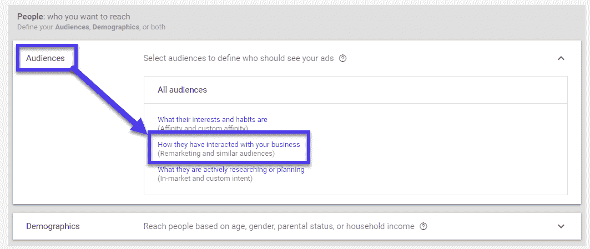

Google Ads remarketing and similar audiences

### 第八步

接下来，您可以直接在“活动设置”选项卡上创建广告，并在准备就绪后实时发送:

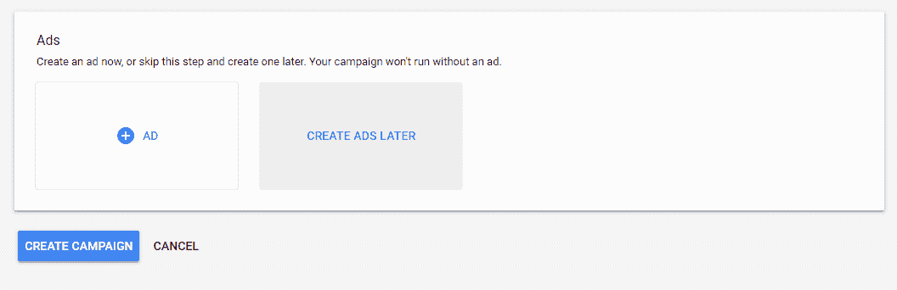

Google Ads create ads

就是这样！

### 从谷歌分析创建重定向列表

除了在谷歌广告上创建重定向广告和受众，你还可以在[谷歌分析](https://kinsta.com/blog/google-analytics-wordpress/)上设置他们。以下是方法。

**重要提示:**我们建议在继续操作之前，确保您已经[将谷歌广告与您的谷歌分析](https://woorkup.com/link-google-adwords-google-analytics/)账户链接。

#### 第一步

转到您的 Google Analytics 帐户。单击左下角的管理工具图标，然后单击“观众”选项卡:

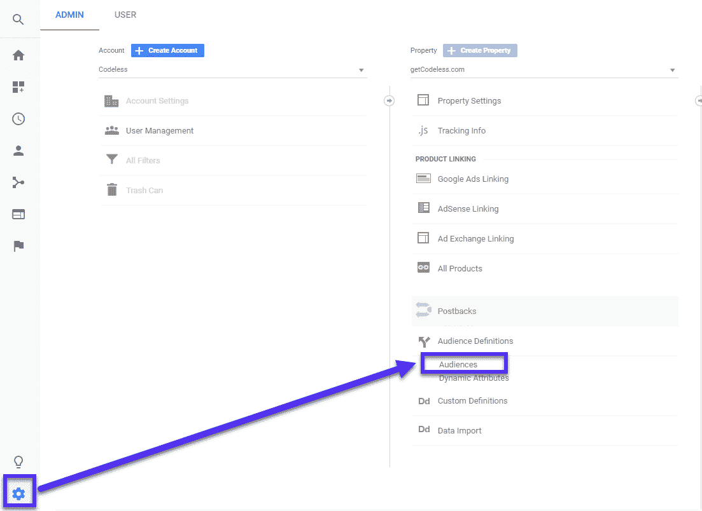

Google Analytics audiences

#### 第二步

单击红色按钮创建新的目标受众。

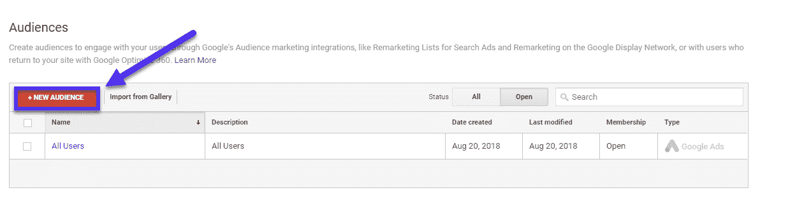

Create a new audience in Google Analytics

#### 第三步

从这里，你可以选择一堆预制的受众类型，如针对所有网站流量、回头客、特定网站页面等。或者，您可以创建自己的受众类型。为简单起见，如果这是您的第一个受众，请选择针对所有用户。

Google Analytics audience definition

#### 第四步

一旦你的受众被创建，只需将其链接到谷歌广告作为你的目的地，并发布受众！

Google Analytics publish audience

刷新你的谷歌广告仪表板，你会看到新的观众随时可以使用。

快乐重定目标！

## 摘要

对于预算有限的人来说，广告重定位是一个非常划算的方法。为什么？因为你可以专注于转化那些已经对你的品牌感兴趣的人。你也可以很容易地排除那些已经购买或接触过你的人。我们强烈建议尝试一下，看看它是否适合您的企业。

但是当然，广告重新定位只是你增加流量或 T2 代销商销售的众多不同方式之一。看看这 25 种不同的方法来[优化你的电子商务转化率](https://www.shoplo.com/blog/ecommerce-conversion-rate-optimization/)。

现在我们想听听你的意见。你有没有建立一个广告重新定位运动？怎么样了？请在评论中分享你的经历！

* * *

让你所有的[应用程序](https://kinsta.com/application-hosting/)、[数据库](https://kinsta.com/database-hosting/)和 [WordPress 网站](https://kinsta.com/wordpress-hosting/)在线并在一个屋檐下。我们功能丰富的高性能云平台包括:

*   在 MyKinsta 仪表盘中轻松设置和管理
*   24/7 专家支持
*   最好的谷歌云平台硬件和网络，由 Kubernetes 提供最大的可扩展性
*   面向速度和安全性的企业级 Cloudflare 集成
*   全球受众覆盖全球多达 35 个数据中心和 275 多个 pop

在第一个月使用托管的[应用程序或托管](https://kinsta.com/application-hosting/)的[数据库，您可以享受 20 美元的优惠，亲自测试一下。探索我们的](https://kinsta.com/database-hosting/)[计划](https://kinsta.com/plans/)或[与销售人员交谈](https://kinsta.com/contact-us/)以找到最适合您的方式。