# 谷歌的专利和搜索引擎优化排名因素:连接点

> 原文：<https://kinsta.com/blog/google-patents-seo-ranking-factors/>

SEO 是一个混乱的领域，要求数字营销专家每天都要突破界限。全球各地的 SEO 总是祈祷好运，因为他们经常被即将到来的谷歌更新或另一种惩罚的恐惧所困扰。当他们最担心的事情发生时，他们会陷入疯狂，试图找到解决办法，控制损失，试图让网站恢复往日的辉煌。

如果你经历过这种紧张的情况，这篇文章可以帮助你预见谷歌未来的算法更新计划，并提前做好准备。然而，谷歌并不总是对的。看看金斯塔是如何[意外获得手动点球](https://kinsta.com/blog/decline-seo-rankings/)的。

这篇文章将会给你一个理解最关键的 SEO 因素的开端，这些因素将会定义 2020 年的 SEO 格局。这应该有望让那些希望超越技巧和黑客来创造 SEO 和数字营销策略的 SEO 专业人士大开眼界，这些策略将产生持久的影响。

## 方法学

我们分析了谷歌在过去几年中一直在研究或已经实施的 20 多项主要专利。根据技术类型的不同，其中一些可能需要数年时间才能在谷歌搜索中显示出来。

总的来说，我们将指出 2020 年 SEO 和数字营销人员应该密切关注的 11 个主要领域。

1.  [更清晰的内容相关性和意图](#content-relevance-intent)
2.  [2019 年上线多语言](#multilingual)
3.  [苹果=应用，但谷歌=谷歌+应用](#google-apps)
4.  [基于位置的搜索的重要性](#location-based-search)
5.  [授权在线社区并增加本地搜索的用户评论](#user-reviews)
6.  [语音识别——未来的搜索模式](#speech-recognition)
7.  [图像优化和消歧](#image-optimization)
8.  [重新获取排名参数](#ranking-parameters)
9.  [跟踪视频中的事件和广告投放](#video)
10.  [定制的搜索结果和更快的访问速度](#tailor-made-search)
11.  [避免使用受版权保护或第三方多媒体内容](#copyrighted-content)

## 1.更清晰的内容相关性和意图

如果你和 SEO 打交道已经有一段时间了，你可能已经知道 Google 创始人写的经典页面排名算法。

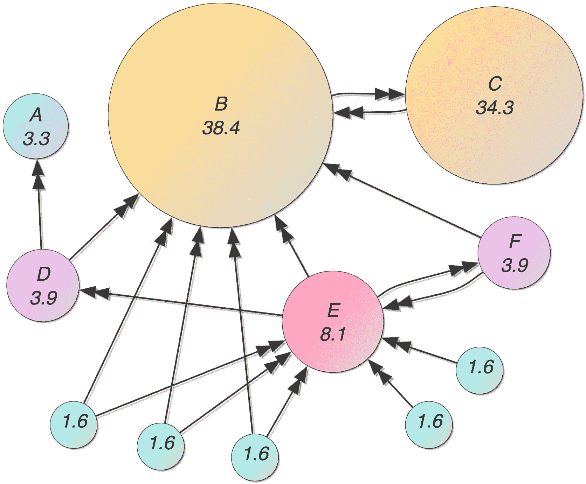

Google PageRank algorithm

### PageRank 算法

我们大多数人现在都知道，今天只有一小部分的页面排名算法仍然在对网页进行排名。PR 算法已经被 SEO 社区误用了，Google 意识到它需要不断地进化来为它的用户提供相关的排名和内容。然而，谷歌可能仍在[内部](https://www.seroundtable.com/google-still-using-pagerank-23392.html)使用 PageRank 算法。

虽然这是一个开拓性的努力，但从那时起，[搜索引擎空间](https://kinsta.com/blog/alternative-search-engines/)已经发展，主要关注于提供准确的搜索结果。此外，很大一部分功劳归于谷歌在开发专利互联网技术方面的持续研发，这些技术为出色的搜索体验铺平了道路，并为数百万像你们这样的公司带来了收入。

在发现大量滥用 PageRank 算法后，谷歌明白了评估内容相关性作为主要排名因素的必要性。从那以后，谷歌投入了大量的时间来创造技术，可以在涉及上下文的页面之间建立相关的联系。

就我们的经验而言，我们已经看到一些网站创建了紧密结合主题的内容，并引导主要关键字的 SERPs。这就是强调内容集群的地方。

谷歌的内容聚类专利也发出了类似的信号。该算法首先考虑一个主题，然后创建子主题与主主题的距离矩阵。副主题离主题越近，出现在搜索结果中的机会就越大。

事实上，强调集群似乎是相当主流的。它是如此深刻，以至于 HubSpot 的营销软件显示了与主主题相关的子主题的相关百分比。

你可能知道，HubSpot 鼓励它的用户在三个不同的层面上[创作内容](https://blog.hubspot.com/news-trends/topic-clusters-seo)。当您在下一个级别创建一个主题时，它会给出一个相关系数，并允许您查看主题之间的联系有多紧密。

许多采用 HubSpot 技术的人承认，在采用内容创建的方法后，他们的流量和查询量都增加了，这种方法只不过是一种内容聚类的形式。

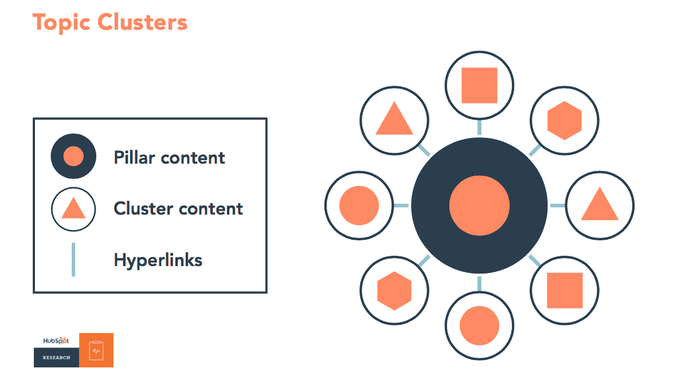

Topic clusters (Image source: [HubSpot](https://blog.hubspot.com/news-trends/topic-clusters-seo))

HubSpot 方法论中的内容集群思想。HubSpot 的营销软件为一个主题或支柱内容下创建的所有子主题赋予一个关联值。

通过这项专利，谷歌正在寻找内容创作者，将内容构建为具有高相关性的集群，他们可以进一步分析参与度指标，以授予相关排名。

谷歌还有另一项名为问答填充知识库的专利，它似乎增强或支持了内容集群的整个实践。谷歌还通过将它与个性化相结合来增强上下文相关性。其中一个例子是一个[动态摘要生成器](https://www.freshpatents.com/-dt20180927ptan20180276210.php)的专利，它强调为从帐户、cookies 或设备中获取的用户数据创建不同的摘要。

除此之外，对上下文相关性的强调也反映在谷歌的一项专利中，该专利围绕参考上下文来推广广告。该专利明确谈到了网页内的推广，暗示了内容的更紧密联系和上下文相关性。

### SEO 应该怎么做？

关注关键字和[内容映射，创建相关内容](https://www.stanventures.com/blog/complete-blog-management-guide/#Fundamental_elements_of_Content_Mapping)。这将是双向的，即在 SERPs 和帮助出版商从广告中赚取更多。
T3】

## 2.2020 年实现多语言

多语言搜索结果越来越受到重视。随着基于应用的环境获得动力，我们看到谷歌和苹果都更加重视多语言应用和搜索。

虽然苹果仅限于应用程序，但谷歌围绕搜索建立的商业模式却从多语言网站中获益良多。截至目前，全球超过 50%的人口没有互联网。关于人口统计，这些人最有可能熟悉他们的母语而不是英语。

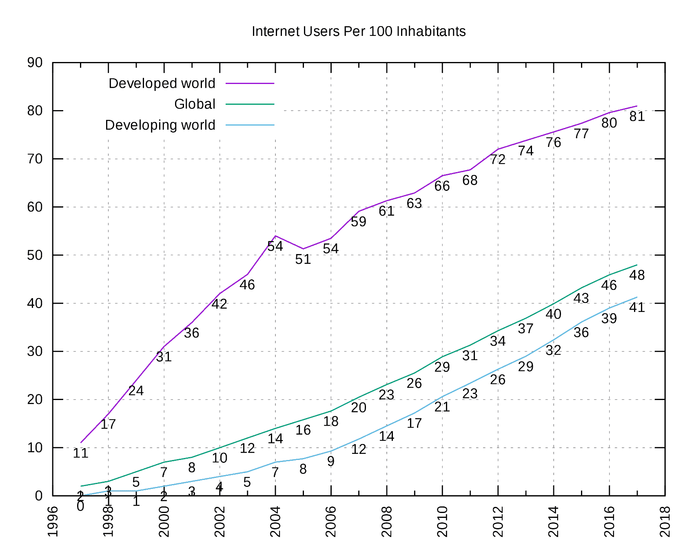

Internet users per 100 inhabitants (Image source: [International Telecommunications Union](https://www.itu.int/en/ITU-D/Statistics/Pages/default.aspx))

着眼于这一点，谷歌已经拿出了多项专利，这些专利将赋予多语言网站更大的权重。

### 众包人工翻译

谷歌获得了一项网络技术的专利，这项技术可以让任意网站的开发者为人工翻译创建一个“选择加入”选项。

虽然我们已经在浏览器上收到了基于机器的翻译，但翻译质量的明显不足是众所周知的。这就是为什么谷歌现在投资于能够带来更重要和更可靠体验的人工翻译技术。

然而，你可以在 2020 年对精确翻译、多语言网站和内容下大赌注。看看 [Kinsta 如何用 10 种不同的语言发布他们的网站](https://kinsta.com/blog/wordpress-multilingual/#custom-multilingual-custom)。

## 3.苹果=应用，但谷歌=谷歌+应用

自从应用驱动的环境随着 iPhone 成为主流以来，搜索领域也发生了巨大的变化。移动使用增加了，这反过来增加了对移动应用和移动网站的需求。

早些年，我们已经看到了在选择手机网站和制作手机应用之间的困惑。许多人建立应用程序而不是移动网站，并在应用程序商店等待下载，但这从未发生过。

突然，拥有百万 app 的 app store 发现了房间里的一头巨象: **app discovery** 。

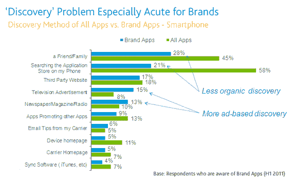

Discovery problem (Image source: [Nielsen](https://www.nielsen.com/us/en/insights/article/2011/you-have-an-app-for-that-now-what/))

长期以来，应用程序发现一直是苹果和谷歌挥之不去的问题，谷歌终于率先解决了这个问题，并通过谷歌搜索和应用商店搜索提供上下文发现。

授予谷歌的其中一项专利强调根据应用程序的社交提及度对应用程序商店应用程序进行排名。该专利称，将对社交媒体网站的大量信号进行分析，然后得出一个综合分数来对应用程序进行排名。

### SEO 应该怎么做？

由于专利属于谷歌，你可能会认为 play 商店的结果比苹果应用商店更明显。

因此，对于 SEO 来说，在 2020 年**关注社交媒体和影响者活动**变得很重要，如果应用增加，已经是你商业模式的中心舞台。

## 4.基于位置的搜索的重要性

我们已经看到谷歌是如何通过内容聚类来提供上下文搜索结果的，这一基于上下文消除输入歧义的专利将这一想法提升到了一个全新的水平。

根据这个[专利](https://www.freshpatents.com/-dt20180906ptan20180254044.php)，模糊的用户查询可以关于用户设备的实时位置、用户移动的速度(开车旅行等)来消除歧义。)、设备类型(移动或桌面)以及其他因素。

### 什么是模糊查询？

模糊查询只不过是通常没有明确搜索意图的查询。许多营销人员追求长尾搜索查询的原因之一是因为他们有明确的搜索和购买意图，因此也有很高的点击费。

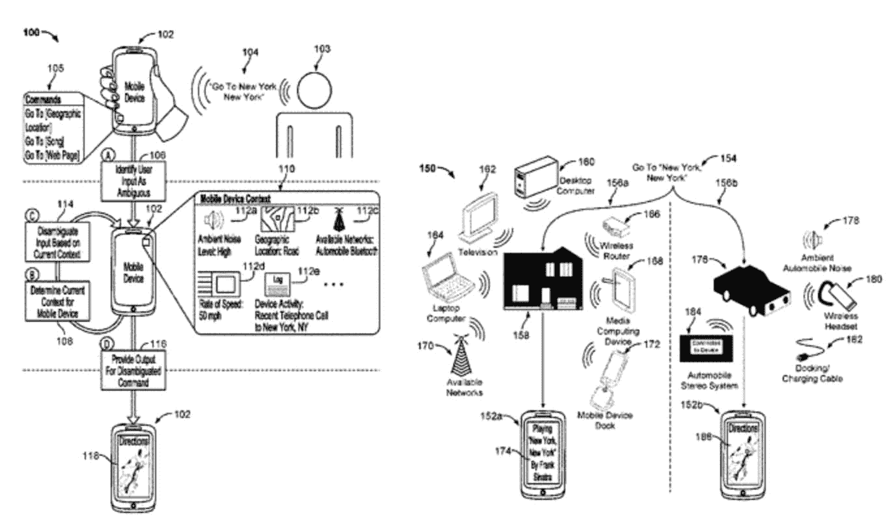

Disambiguation with respect to location, movement, and other factors. (Image source: [FRESHPatents](https://www.freshpatents.com/-dt20180906ptan20180254044.php))

然而，谷歌得到了大量的搜索查询，这些查询在上下文方面可能是宽泛的，就意图而言可能是模糊的。这些查询的主要原因是不合格的用户，他们自己可能不知道搜索的上下文。

所以现在，谷歌不仅会帮助他们了解上下文，还会向他们提供上下文结果，即使查询不是那么简单。

### SEO 应该怎么做？

这无疑属于局部搜索优化的范畴。因此，SEO 经理必须考虑到这一点，并通过他们的本地 SEO 清单以及一个宽泛的术语列表来保持他们的运行，这些术语与他们的[目标关键字](https://kinsta.com/blog/keyword-research/)有关联。

因此，如果你是一家在繁忙街道上卖寿司的餐馆，你最好在谷歌地图上找到你的名字；在你的餐馆名称或潜台词中使用“寿司”，并在谷歌或其他评论网站上吸引一些评论。这就把我们带到了下一个话题，用户评论。

## 5.授权在线社区和增加真正的用户评论来主导本地搜索

除了消除查询歧义，谷歌还发明了另一项[专利，旨在确定来自用户评论](https://patents.justia.com/patent/10061767)的实体属性。

在这里，实体可以指任何可以列出和销售产品的网站，这些网站自然会吸引用户评论。谷歌可能会对实体列出的谷歌评论给予很大重视，以获得本地 SEO 的好处。

该专利称，谷歌可能会专注于从一组元数据中得出结果，这些元数据包括算法、硬件和一块计算机可读介质的结合，以分析用户评论，然后将其与实体列出的产品或网站相关联。

这间接意味着，谷歌专注于确定真正的用户评论，这些评论能够提供对任何业务的可靠和真实的洞察。这也适用于允许谷歌从其服务器收集数据的网站。

倾销负面评论是一种常见的做法。除了谷歌之外，许多其他公司也在对抗同样的威胁，即依靠评论来确定用户资格并创造销售。亚马逊已经打击他们有一段时间了。

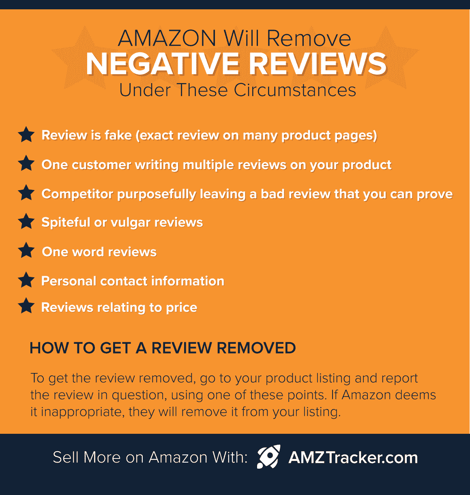

Amazon remove negative reviews (Image source: [AMZ Tracker](https://www.amztracker.com/blog/17-amazon-seller-central-secrets/))

另一项名为[用于在线社区管理的声誉和参与系统](https://patents.justia.com/patent/10049138)的专利同样致力于验证和吸引更好的用户生成数据——这是简化知识图表的又一努力。

该专利旨在识别真正的用户，并根据他们在在线论坛上的贡献给他们一个权重。该值是根据多个主题中的多个因素计算得出的。当搜索相关查询时，这些答案、页面或链接将被优先考虑。

实现这一点的另一种方式是增强搜索查询的形式。在一个名为使用增强搜索查询提供搜索结果的[专利](https://patents.justia.com/patent/10055462)中，声明了搜索结果与实体之一(真实的人)直接相关。由于 [Google plus 已经退出](https://www.theverge.com/2018/12/10/18134541/google-plus-privacy-api-data-leak-developers)，我们可以预计谷歌将在很大程度上依赖 LinkedIn 来完成这项工作。

### SEO 应该怎么做？

如果你在处理移动应用，成为论坛中的思想领袖。如果你正在处理电子商务，试着成为亚马逊卖家论坛的专家。整合您的技术团队进行营销，以获得更好的效果。

关于评论，要明白它将成为未来几年本地 SEO 的一个重要因素。因此，如果你正在考虑带评论的黑帽 SEO，最好重新考虑你的决定。

## 6.语音识别——未来的搜索模式

我们都知道谷歌在语音识别领域一直在开发很多技术。此外，当 3.2 亿用户正在使用语音搜索时，投资这个领域是非常有意义的。

这些数字不仅限于谷歌一家。必须指出的是，每个节日期间，亚马逊 Echo 设备的销量都超过了 400 万台。这是一个相当大的数字。事实上，据世界领先的研究公司 Gartner 称，到 2020 年，几乎一半的搜索将使用语音进行。

看一下[专利](https://patents.justia.com/patent/10055767)，我们可以看到谷歌想要识别长串语音中的关键词。这说明了什么？

机器学习程序现在正在处理谷歌算法中的许多事情。鉴于谷歌收集的大量元数据，搜索和消费内容的整个过程将变得非常直观。这正是谷歌试图通过语音实现的目标。

## 注册订阅时事通讯

### 想知道我们是怎么让流量增长超过 1000%的吗？

加入 20，000 多名获得我们每周时事通讯和内部消息的人的行列吧！

[Subscribe Now](#newsletter)

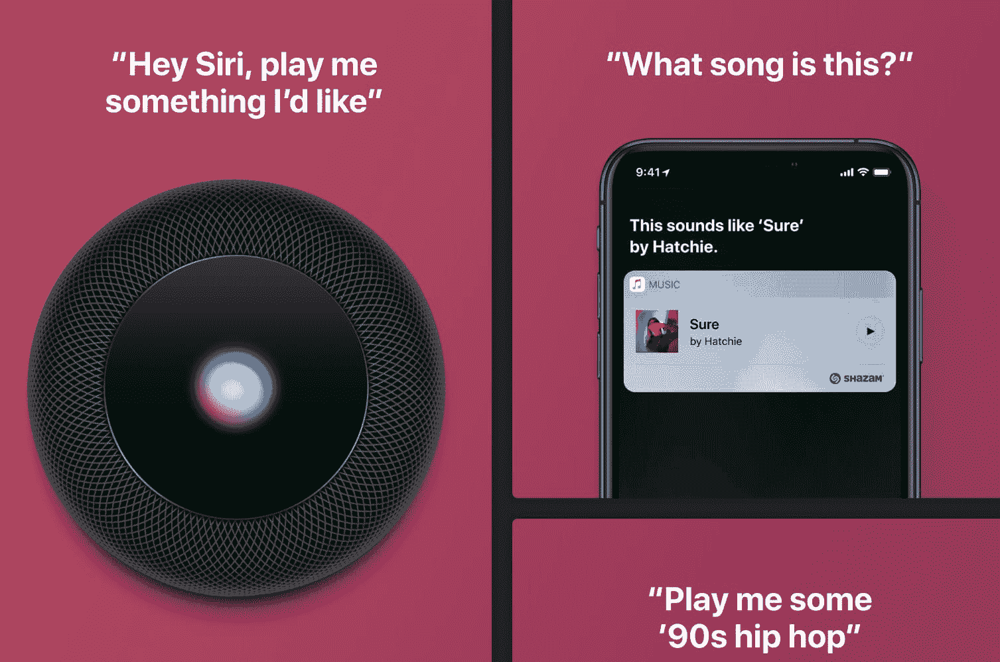

Voice search with Siri

在针对 [Siri](https://www.apple.com/siri/) 的网页上，你可以清楚地了解到，这些公司(包括谷歌)希望人机交互极其直观，以使语音搜索成为主流。

有了这些语音助手，这些公司，无论是亚马逊、苹果还是谷歌，实际上都希望我们能够像对待人类一样与语音服务进行交流。然而，对于谷歌指出相关结果，它仍然需要一些数据点，如关键词，以缩小上下文并提供准确的结果。这就是谷歌专利试图实现的目标。

Amazon Echo (Image source: [Amazon](https://amazon.com/echo))

### SEO 应该怎么做？

由于很多事务性查询自然会被亚马逊吸引，而且他们正在出售大量的 Echos，谷歌希望在未来几年内解决这个问题。因此，SEO 经理必须在 2020 年着眼于用语音搜索的视角优化他们的网站。

## 7.图像优化和消歧

谷歌已经申请了一项关于上下文消歧查询的专利，用户可以直接要求搜索服务实时提供他们正在设备上查看的图片信息。**T3】**

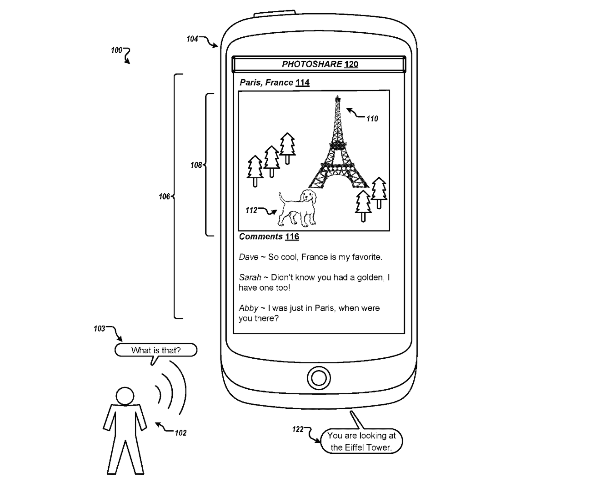

Contextually disambiguating queries (Image source: [FRESHPatent](https://www.freshpatents.com/-dt20180920ptan20180267994.php))

正如所言，这将创建上下文消歧查询，其中搜索服务将调用子图像库，然后给出语音输出——告诉用户当前查看的对象以及这些对象实际上是什么。

我们可以假设，一个增强的活动层也可以占据屏幕，以便于访问关于被观看对象的信息。这是因为当前的 Android 8 和 9 在很大程度上是基于此构建的。

Picture-in-picture feature in Android one ([Computerworld](https://www.computerworld.com/article/3197702/android/android-o-features.html))

就视觉准确性和 UX 而言，谷歌已经有了他们明确定义的材料设计原则来支持它。

### 分布式图像搜索专利的目的

还有一项专利重申了谷歌对图像识别和搜索的关注。在一项名为[分布式图像搜索](https://www.freshpatents.com/-dt20180927ptan20180276250.php)的专利中，谷歌工程师给出了一个有趣的示意图。该专利基于识别和返回与被搜索图像主题具有相似形状和颜色的图像主题。

谷歌强调这一点的关键原因是图像可以驱动大量的搜索查询。

例如，如果你想向你的朋友解释一件新衣服，你最好拿出一张照片给他们看，而不是试图描述它看起来怎么样。你可能知道衣服的名字，但你的朋友可能不知道。这就是图片能够引发快速理解并允许用户更快到达的地方。

这里的主要目标是帮助人们在搜索中找到更好、更准确的图片/搜索结果。因此，如果你搜索某种颜色衬衫的图片，谷歌会提供相似的图片和链接到他们缓存图片的网页。

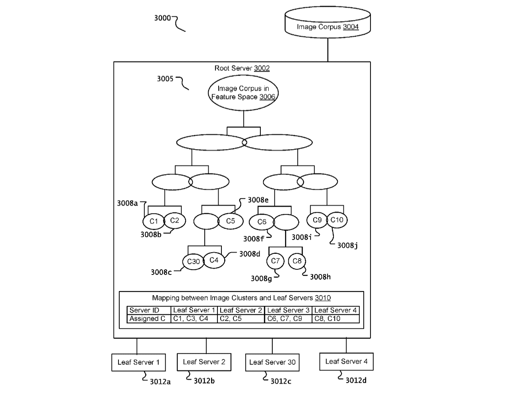

Distributed image search (Image source: [FRESHPatents](https://www.freshpatents.com/-dt20180927ptan20180276250.php))

据尼尔·帕特尔称，超过 10%的谷歌搜索是由 images.google.com 驱动的。这是一个巨大的数字，其结果也成为一个重要的排名因素。

### SEO 应该怎么做？

这是一个电子商务网站的 SEO 经理的金矿。随着谷歌耦合机器学习来识别图像，图像直方图也被认为是为了找到更好的图像。

换句话说，如果你在经营一家[电子商务商店](https://kinsta.com/blog/wordpress-ecommerce-plugins/)，那么试着在网页上使用相关图片。搭配高质量的库存照片或更好的照片拍摄和编辑，以突出色彩。但是，不要改变颜色。

## 8.排名参数的重考

谷歌最近获得了一项在大型数据集上对文档进行排名的专利。这是一个针对垃圾邮件问题的强大解决方案，谷歌已经为此奋斗了很长时间。

众所周知，反向链接的数量是 SERPs 的永久决定因素之一。多年来一直被黑帽 SEO 利用，本专利旨在解决。

Struggling with downtime and WordPress problems? Kinsta is the hosting solution designed to save you time! [Check out our features](https://kinsta.com/features/)

### 这项技术是如何工作的？

这项专利的重点是，仅仅获得一个反向链接是不够的。因此，它所做的是，在一段时间内监视导航链接周围的用户行为，然后得出推论。该专利谈到了实现这一目标的一系列信号。

当导航行为被确定后，链接被赋予一个值，该值被传递给它所链接的页面。

这对于出现在社交媒体网站上的链接来说非常有效。这是另一个从用户产生的大量数据中验证知识图的例子。

### SEO 管理者应该怎么做？

关注第一点，创建紧密结合的内容集群。这将防止你出现在没有上下文的搜索结果中，避免不必要的反向链接，这些反向链接可能会注册较少的导航活动，如专利中所述。

你也应该有针对性的推广，这样你的链接出现在其他网站上时会受到影响，给你的页面带来自然的流量。

在做内容联合的时候也应该小心。考虑高相关性的内容聚类的想法，并相应地计划您的联合活动。

## 9.跟踪视频中的事件和广告投放

YouTube 上的视频或页面上的嵌入式视频已经成为许多公司的重要内容资产。在这场视频海啸中，仅仅统计一个视频的总浏览量是不够的。人们必须通过量化谷歌已经在做的数据来理解视频中发生的用户行为。

用于跟踪用户活动和提供网络分析的[专利](https://patents.justia.com/patent/20180288461)专注于聚合所有用户行为，然后将其反馈给服务器，以赋予视频内容价值，并放置上下文相关的广告。

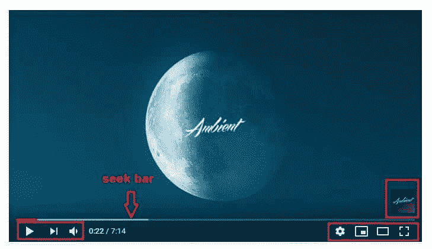

Events on a YouTube video

嵌入式视频有额外的用户操作，如“稍后观看”、“分享”、“字幕开/关”和“相关视频”。

### 谷歌想要收集数据的一些因素:

1.  视频的点击量
2.  用户观看视频的平均时长
3.  人们更喜欢跳过视频时间轴中的哪个位置？
4.  他们是在看广告还是跳过广告？
5.  他们是带字幕看的吗，等等。？

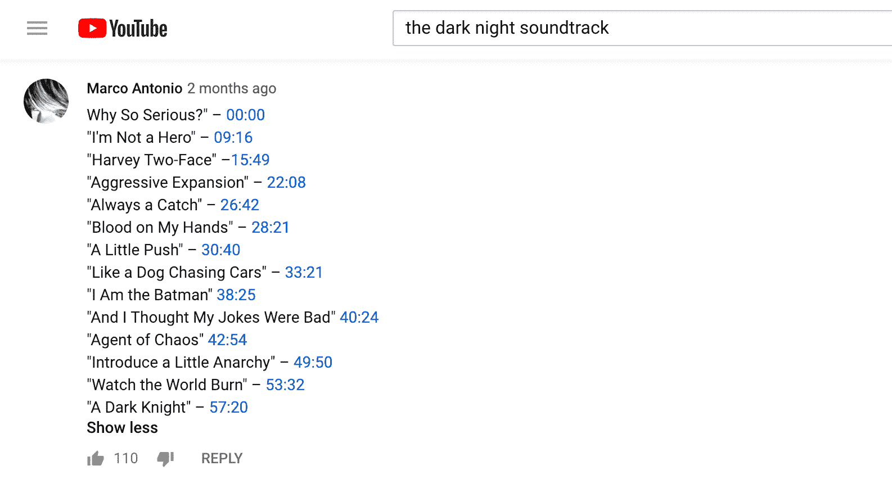

YouTube seek

谷歌已经在搜索栏上实现了跳到某个时间。人们经常预测并点击搜索栏来查看他们想要的内容部分，谷歌正在帮助用户做到这一点。

当与其他元数据结合时，这些数据点可以给出关于视频内容的参与因子以及它们与它们配对的 web 内容的上下文对齐的强烈信号。

另一项追踪媒体内容中对象的[专利](https://www.freshpatents.com/-dt20180920ptan20180268022.php)也已经被确认。它所做的是在机器学习的帮助下分析媒体中的对象，然后找出搜索的上下文。

搜索信号可以是视频中的帧暂停、多媒体内容的时间线内的一部分的回放等等。另一项[专利](https://patents.justia.com/patent/20180242041)进一步推进了这一点，该专利执行面部识别、跟踪标志和标签等。，然后将它们与搜索查询相关联。

### SEO 应该怎么做？

SEO 经理应该理解视频作为排名因素的重要性，这种重要性在 2020 年只会增加。虽然制作更多吸引目标观众的视频内容是一个有用的建议，但这是有代价的。对于财大气粗的大公司来说，这无疑是他们可以重点关注的。

对于较小的公司，他们需要以较小的预算创建高度吸引人的视频，或者使用其他用户的视频。如果他们想这样做，搜索引擎优化经理必须花更多的时间来寻找视频，以及哪些视频将符合他们的内容。

就我们的经验而言，我们建议将视频作为内容的延伸，或者将一个模块连接到整个内容理念。

[Content marketing + video marketing = a win-win. 👏Click to Tweet](https://twitter.com/intent/tweet?url=https%3A%2F%2Fbit.ly%2F2ArJNMX&via=kinsta&text=Content+marketing+%2B+video+marketing+%3D+a+win-win.+%F0%9F%91%8F&hashtags=contentmarketing%2Cvideomarketing)

## 10.定制的搜索结果和更快的访问

这在很大程度上已经铺开，搜索结果迎合了用户喜好。这项名为“基于用户参与的服务内容”的专利使用物理资源来缓存和分析用户之前与内容及其各种元素的交互。

数据被分析和记忆。下一次用户搜索相似或上下文相关的查询时，一些网站可能会比其他网站获得更好的位置。

如果你想测试这一点，你可以搜索一个你经常搜索的查询，然后在 Chrome 上以匿名模式搜索同一个查询。结果会有所不同。你之前互动过的网站会比你没有互动或打开过的网站排在最前面。但是，在隐姓埋名模式下，你不会注意到这个偏好。

Chrome incognito mode

隐名模式不考虑你过去的浏览历史。

一项关于更快检索搜索结果预渲染内容的[专利进一步增强了这一点。换句话说，如果您已经定期搜索了许多关键词，搜索结果页面将毫无延迟地出现，因为首选项将预先呈现给各个用户。](https://patents.justia.com/patent/20180157754)

### SEO 管理者应该怎么做？

最明显的事情是赢得至少一次与所有可能登陆你网站的潜在客户的互动。要做到这一点，最简单的方法之一就是专注于付费营销。

创建网页与目标关键字，然后运行点击付费或脸书活动，为大量用户登陆。然后，下次他们搜索类似的东西时，你的网站可能会比你的竞争对手领先几个位置。

话虽如此，你要避免吸引适度的流量或无关的网站流量。虽然你想排名更高，但你不想同时被谷歌视为无关紧要。

## 11.避免使用版权或第三方多媒体内容

内容剽窃已经成为搜索引擎、主机提供商和其他实体的强大恶魔。看看金斯塔如何处理一个[内容抓取农场](https://kinsta.com/blog/content-scraping/)。没有对剽窃的检查，内容创作者就永远不会有新的内容，互联网也永远不会是现在这个样子。

[SEOs do a lot more than just content nowadays. 😉Click to Tweet](https://twitter.com/intent/tweet?url=https%3A%2F%2Fbit.ly%2F2ArJNMX&via=kinsta&text=SEOs+do+a+lot+more+than+just+content+nowadays.+%F0%9F%98%89&hashtags=marketing%2CSEO)

很多内容窃取是以文本的形式发生的，这很容易识别。然而，当有人窃取了你的视频、音乐或任何形式的多媒体内容时，会发生什么呢？你怎么发现的？嗯，谷歌似乎加强了对这方面的控制。

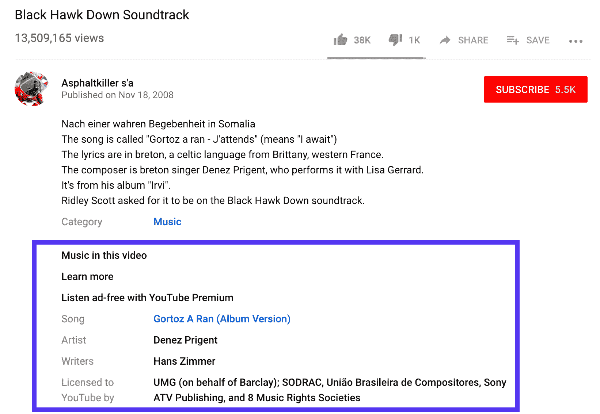

在 YouTube 上查找和识别有版权的音乐已经有一段时间了。然而，谷歌现在正在努力将版权交给真正的内容制作者。谷歌希望所有类型的用户都能制作多媒体内容，窃取这些内容是不可容忍的。

其中一项名为[的谷歌专利识别包含第三方内容的参考内容](https://patents.google.com/patent/US20150193433)揭示了一种识别任何用户在其内容中使用的版权或第三方内容的技术。换句话说，谷歌希望奖励内容的原所有者，同时惩罚抄袭者。

### SEO 应该怎么做？

避免使用第三方多媒体内容，如受版权保护的音乐或属于唱片公司的部分视频等。购买股票视频和其他多媒体内容，或者创建一个免费股票图片库。让设计师投入工作，创造结合免费库存图像，向量和图标的迭代。另外，注册免费的股票音乐。您还可以联系 SoundCloud 上的艺术家，寻求他们的许可，在您的内容中使用他们的作品。他们中的许多人需要曝光，可能不会拒绝你的提议。

**查看我们的视频指南，通过 SEO 增加流量:**

## 摘要

从这些专利的主题来看，谷歌非常注重让自己和整个环境对当地企业更有价值。这可以通过调整知识图，聚合评论的上下文准确性，基于位置的数据，并使用社交媒体验证这些数据点的数量来实现。谷歌已经确定了前进的方向。

我们相信本地搜索引擎优化将在 2020 年末卷土重来，重点放在位置、语音、视频、评论和社交媒体上。虽然许多 SEO 交付物可能会在 2020 年出现，但 SEO 经理的战略倾向应该像激光一样聚焦于整体结果和 ROI 的上下文相关性。

* * *

让你所有的[应用程序](https://kinsta.com/application-hosting/)、[数据库](https://kinsta.com/database-hosting/)和 [WordPress 网站](https://kinsta.com/wordpress-hosting/)在线并在一个屋檐下。我们功能丰富的高性能云平台包括:

*   在 MyKinsta 仪表盘中轻松设置和管理
*   24/7 专家支持
*   最好的谷歌云平台硬件和网络，由 Kubernetes 提供最大的可扩展性
*   面向速度和安全性的企业级 Cloudflare 集成
*   全球受众覆盖全球多达 35 个数据中心和 275 多个 pop

在第一个月使用托管的[应用程序或托管](https://kinsta.com/application-hosting/)的[数据库，您可以享受 20 美元的优惠，亲自测试一下。探索我们的](https://kinsta.com/database-hosting/)[计划](https://kinsta.com/plans/)或[与销售人员交谈](https://kinsta.com/contact-us/)以找到最适合您的方式。