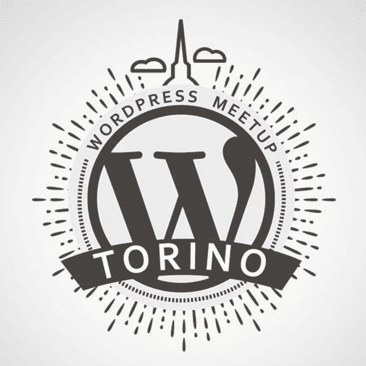
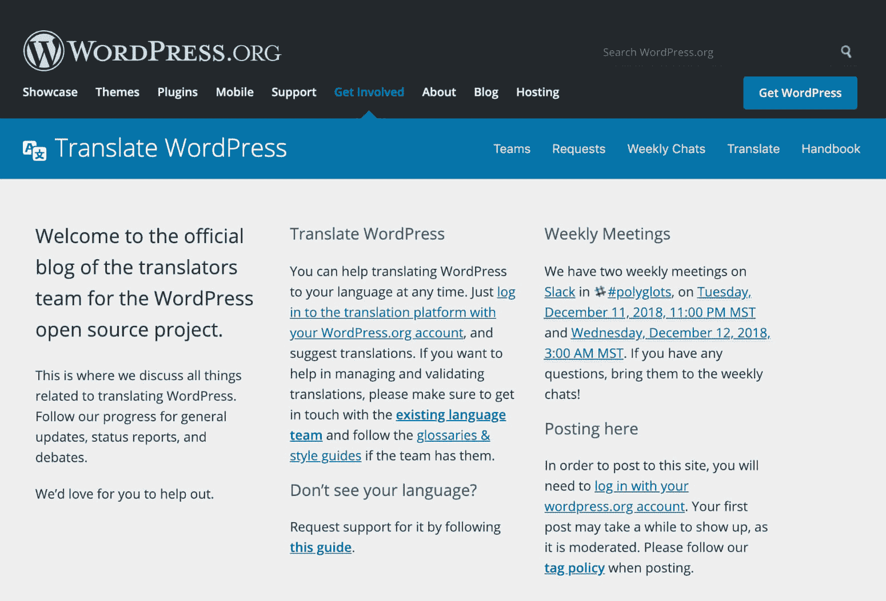
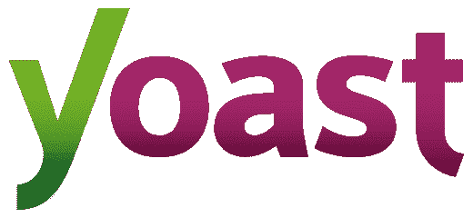
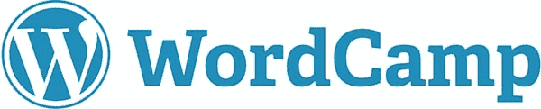

# 金斯塔·金并:劳拉·萨科访谈

> 原文：<https://kinsta.com/blog/interview-laura-sacco/>

劳拉·萨科是 Yoast 的支持工程师和意大利 WordPress.org 社区的翻译编辑。她也是 WordPress Meetup 组织者、WordPress camp 组织者和演讲者。劳拉是即将于 6 月 20 日至 22 日在德国柏林举行的【2019 年欧洲世界语言营的工作人员之一。

你可以在推特(Twitter)或领英(LinkedIn)上找到劳拉。她的个人网站是 [mentoredigitale.it](https://mentoredigitale.it/) 。这是我们最近对她的采访，作为我们的[金斯塔·金并](https://kinsta.com/?post_type=post&s=kingpin)系列的一部分。

### Q1。你的背景是什么，你是如何开始使用 WordPress 的？

我的职业生涯始于一名专业教育工作者，然后我以一篇组织社会学的论文获得了社会学学位，并在社会服务领域工作了 30 年。在 5 年的家庭破裂后，2005 年我回到了社会合作的世界，我成为了一名教育督导。后来，我参加了一个处理商业沟通的筹款项目，包括建立网站，然后我接触了数字通信、社交媒体和博客的世界。

从那时起，我开始投身于互联网 2.0 的新世界，并开通了我的第一个 WordPress.com 博客:这发生在 2008 年。那时，网络和博客发展迅速。2009 年，我推出了我的第一个企业博客，由 WordPress 提供支持。

由于 2015 年的一场企业危机，在对自己的技能进行仔细评估后，我决定开始独立工作，并提议自己成为一名商业顾问。作为一名自由职业者，我知道建立一个网络将是我职业生涯中的第一步，所以我开始定期访问都灵的[工具箱](http://www.toolboxoffice.it/)共同工作空间。在那里，一个偶然的机会，我遇到了新生的 [Torino WordPress Meetup](https://www.meetup.com/WordPress-Meetup-Torino/) :这件事发生在 2015 年 9 月，从那以后我再也没有离开过 WordPress 社区。

成为社区工作和生活的一部分是我回报 WordPress 开源项目的方式。我的意思是，如果每个人都可以免费使用一个可靠的、开发良好的和定期改进的产品，那是因为世界上有成千上万的人免费提供他们的工作。回馈我们的部分时间和技能是我们对 WordPress 变得更加强大和安全的贡献，并表达了我们对其价值的赞赏。

我喜欢用数字工具和互联网工作，它让我从专业的角度提高自己。它让我能够帮助人们，尤其是女性，学会如何使用网络工具，以及如何越来越多地融入这个不可避免地越来越紧密相连的世界。

很多女性有很棒的专业技能，但往往不知道如何利用。此外，技术课程通常很难，这可能会阻碍数字工具的使用。我的目的是提供个人支持，但不是作为老师，而是作为顾问。我的职业是成为一名数字导师。

### Q2。你在 WordPress 社区的角色是什么？

我在社区中迈出了第一步，加入了多语言团队，这是网络民主化的基本工具。每个人都能翻译 WordPress。你只需要一个 WordPress.org 账户。[集团由多个层级构成](https://make.wordpress.org/polyglots/handbook/about/teams/)。每个翻译的字符串都必须经过翻译编辑的批准。编辑由全球翻译编辑(GTE)指定，他们只能批准核心字符串。目前有 5 辆 GTE 活跃在意大利，我就是其中之一。

我参与了与 GTE 同事协调意大利语团队的工作，并为保持社区的活力和活跃做出了贡献。如今，意大利多语言社区有超过 1500 名贡献者。

WordPress Polygots

### Q3。你什么时候开始和 Yoast 合作的？

2017 年底，我的朋友爱丽丝告诉我，一家伟大的美国网络公司正在寻找一位具有我这种技能的人物，她是 WP Rocket T1 的内容作家，也是意大利全球翻译编辑。当时我还没找工作，但我问自己:为什么不试一试？我抓住了机会，寄出了我的申请。我没有被录用，但无论如何这是一个成功:我*释放了我的期望，克服了我说英语的恐惧。*

## 注册订阅时事通讯

### 想知道我们是怎么让流量增长超过 1000%的吗？

加入 20，000 多名获得我们每周时事通讯和内部消息的人的行列吧！

[Subscribe Now](#newsletter)

[T2】](https://yoast.com/)

因此，在 2018 年 1 月，当 Yoast 打开远程支持的选择时，我越过栅栏，提交了我的设备。童话的开始，从 2018 年 3 月开始，[我一直在 Yoast 工作，担任支持工程师](https://yoast.com/about-us/team/laura-sacco/)。

### Q4。像 Yoast 这样的国际化团队和公司对你来说代表了什么？

对我来说，Yoast 不仅仅是一家国际公司，它还是一个具有高度社会影响力的商业实体，与 WordPress 有着相同的价值观:网页可访问性和民主化。对我来说，与我工作的组织分享相同的价值观非常重要。我完全认同他们的企业愿景。毕竟我决定向 Yoast 提交申请是因为他们的价值观就是我的价值观。

### Q5。一个大支架的必备要素是什么？

随着时间的推移，我们获得了技术技能，但为了提供良好的支持服务，我们需要一种乐于助人的态度。Yoast 的社区经理兼支持主管 Taco Verdonschot 表示，“支持不是一种技术技能，支持是一种态度”。我们需要能够感同身受，建立关系，并对你面前寻求帮助的人怀有极大的尊重。你必须有强烈的愿望去真正地帮助别人。

Struggling with downtime and WordPress problems? Kinsta is the hosting solution designed to save you time! [Check out our features](https://kinsta.com/features/)[Support is not a technical skill, support is an attitude. 😎 @tacoverdo @lausaccoClick to Tweet](https://twitter.com/intent/tweet?url=https%3A%2F%2Fbit.ly%2F2AtNxxA&via=kinsta&text=Support+is+not+a+technical+skill%2C+support+is+an+attitude.+%F0%9F%98%8E+%40tacoverdo+%40lausacco)

### Q6。您是 2019 年世界夏令营欧洲站赞助商团队的一员。在你看来，公司和社区之间的联系是什么，公司能从赞助单词营中得到什么？

一个 [WordCamp](https://central.wordcamp.org/) 不仅仅是一个关于专业话题的会议:它远不止于此。这是一个我们可以比较和分享想法，并建立网络的地方。是一个充满正能量的地方。这是当地社区组织的聚会，是单词营特有的。环境是非正式的，热情的，尊重多样性。

在 WordCamp，你会遇到真实的人，真正真实的人，因为在 word camp 中没有什么可以交流或展示来获得客户。这就产生了一种从未入党的人难以理解的魔力。

['At WordCamps you meet real people, truly authentic people.' 👋 - Laura SaccoClick to Tweet](https://twitter.com/intent/tweet?url=https%3A%2F%2Fbit.ly%2F2AtNxxA&via=kinsta&text=%27At+WordCamps+you+meet+real+people%2C+truly+authentic+people.%27+%F0%9F%91%8B+-+Laura+Sacco&hashtags=WordCamp%2Copensource)

该组织总是由志愿者免费管理，门票价格也总是很低，这样价格就不会成为参与的障碍。但是，当然，在组织单词营的过程中，有许多费用需要处理。这就是赞助商的帮助。

他们的角色至关重要:他们是让魔法成真的英雄。首先，赞助一个 WordCamp 意味着支持社区和采用开源哲学。当然，这也有商业的一面:赞助一个单词营会给公司带来很大的知名度，让他们得到认可，并向大量潜在客户展示他们的产品/服务，和/或接触到有技能的专业人士来雇佣。

### Q7。接下来我们应该采访谁&为什么？

Pascal Casier 是一名非常活跃的社区成员、插件开发者和核心贡献者。还有 WordPress.org 的社区代表[弗朗西斯科·迪·坎迪亚](https://twitter.com/fra83)。

* * *

让你所有的[应用程序](https://kinsta.com/application-hosting/)、[数据库](https://kinsta.com/database-hosting/)和 [WordPress 网站](https://kinsta.com/wordpress-hosting/)在线并在一个屋檐下。我们功能丰富的高性能云平台包括:

*   在 MyKinsta 仪表盘中轻松设置和管理
*   24/7 专家支持
*   最好的谷歌云平台硬件和网络，由 Kubernetes 提供最大的可扩展性
*   面向速度和安全性的企业级 Cloudflare 集成
*   全球受众覆盖全球多达 35 个数据中心和 275 多个 pop

在第一个月使用托管的[应用程序或托管](https://kinsta.com/application-hosting/)的[数据库，您可以享受 20 美元的优惠，亲自测试一下。探索我们的](https://kinsta.com/database-hosting/)[计划](https://kinsta.com/plans/)或[与销售人员交谈](https://kinsta.com/contact-us/)以找到最适合您的方式。