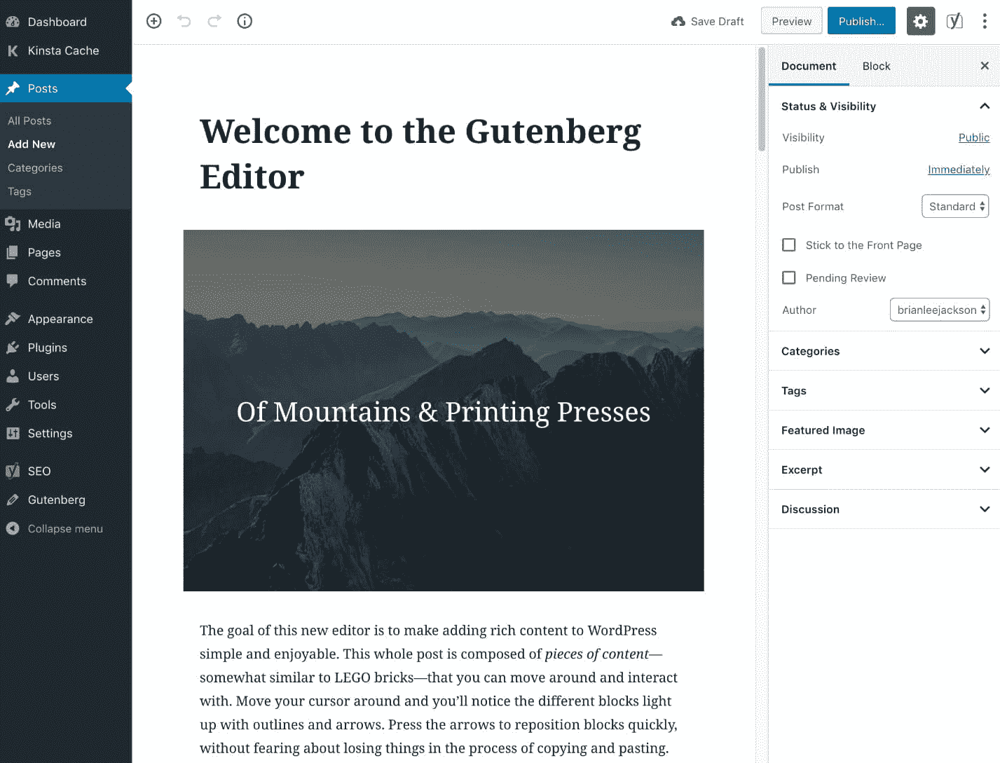
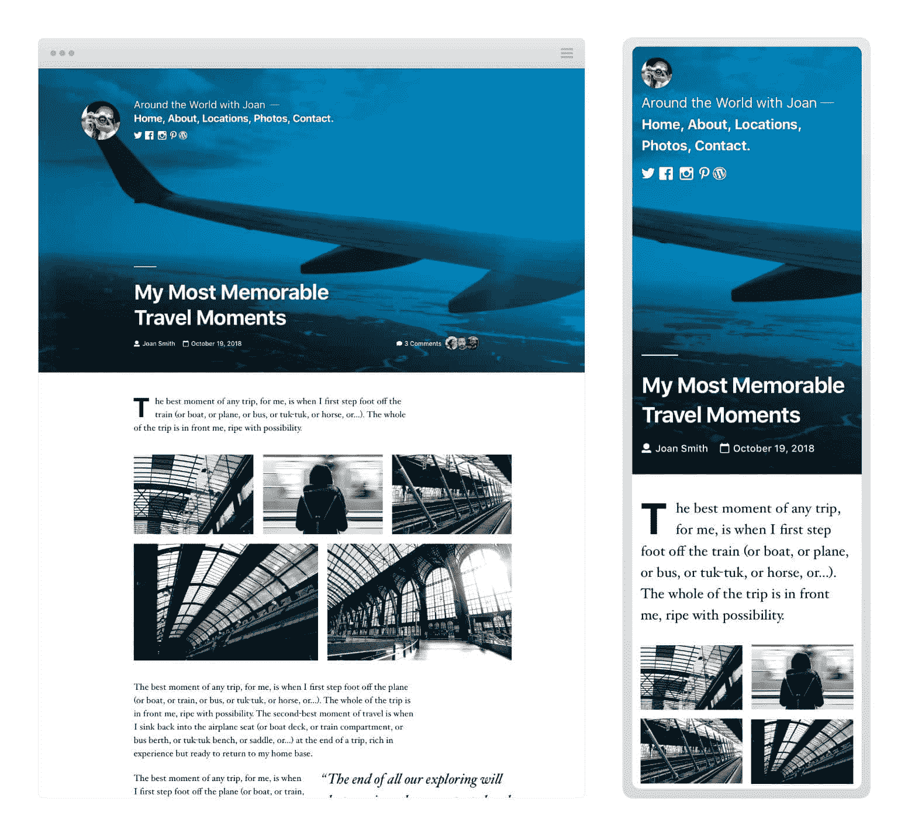
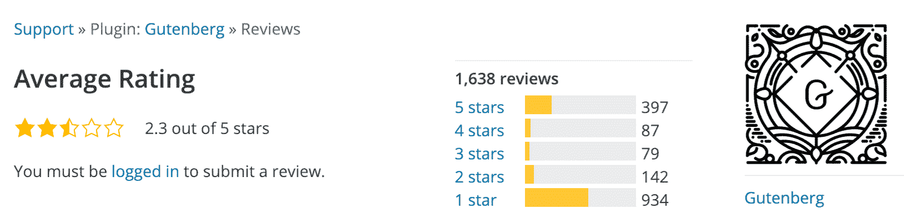

# WordPress 5.0 的新功能(你好，古腾堡)

> 原文：<https://kinsta.com/blog/wordpress-5-0/>

截止 2018 年 12 月 06 日，**WordPress 5.0“Bebo”在此**！如果你忽略了今年的所有其他更新，现在是时候认真关注了，因为这是 2018 年最大的更新。WordPress 正在彻底改造用户和开发者使用带有新古腾堡编辑器的 [CMS](https://kinsta.com/knowledgebase/content-management-system/) 的方式。现在一切都是关于积木。我们还有一个新的[2019 主题](https://kinsta.com/blog/twenty-nineteen-theme/)，这是新装置的默认主题。

**更新**:[WordPress 5.3 的新功能](https://kinsta.com/blog/wordpress-5-3/)

和 WordPress 的任何新版本一样，我们总是建议进行测试。这听起来像是一个破纪录，但是因为这个版本影响了一切，从编辑器到第三方插件，甚至你的主题，**测试不是可选的！**如果不测试，东西很容易损坏。这是一个你不想只是点击更新按钮版本。

也就是说，让我们深入了解 WordPress 5.0 版本的所有新功能。

[WordPress 5.0 改变一切！💥查看今年最大版本中的新内容。 点击推文](https://twitter.com/intent/tweet?url=https%3A%2F%2Fkinsta.com%2Fblog%2Fwordpress-5-0%2F&via=kinsta&text=WordPress+5.0+changes+everything%21+%F0%9F%92%A5Check+out+what%27s+new+in+the+biggest+release+of+the+year.&hashtags=WordPress%2Cgutenberg)

## WordPress 5.0 改变了一切(新功能)

> 这里需要给一个大喊。Kinsta 太神奇了，我用它做我的个人网站。支持是迅速和杰出的，他们的服务器是 WordPress 最快的。
> 
> <footer class="wp-block-kinsta-client-quote__footer">
> 
> 
> 
> <cite class="wp-block-kinsta-client-quote__cite">Phillip Stemann</cite></footer>

[查看计划](https://kinsta.com/plans/)

使用 [WordPress 4.8](https://kinsta.com/blog/wordpress-4-8/) (Evans)我们获得了大量新的小部件和改进，以及对可视编辑器中链接工作方式的方便改进。

有了 [WordPress 4.9](https://kinsta.com/blog/wordpress-4-9/) (Tipton)，我们看到了向更加以用户为中心的方式定制和管理网站迈出了重要的一步，定制器有了很大的改进，小部件有了新的令人兴奋的功能，编辑代码的强大的[文本编辑器](https://kinsta.com/blog/best-text-editors/)。

大多数过去的更新都相对较小，对我们大多数人来说，并没有对我们产生太大的影响。 **WordPress 5.0 不一样。**该版本没有在各处添加小的改进，而是完全专注于以下两件事:

1.  新的古腾堡 WordPress 编辑器
2.  WordPress 主题

除此之外，小的改动和漏洞修复只是在个案的基础上进行研究。实际上，**都是关于古腾堡**的。📇

起初，这听起来好像没有那么多变化，但这与事实相去甚远！Gutenberg 试图将 WordPress 作为 CMS 推向网站建设领域。事实上，WordPress 团队正计划脱离旧的发布周期，在旧的发布周期中，我们只能得到小的更新，而在新的发布周期中，我们将立刻看到更大的变化。然而，他们也表示，现在 WordPress 5.0 已经发布，计划是每月发布两次小型 WordPress 版本。你可以看看他们为[古腾堡二期](https://make.wordpress.org/core/2018/12/08/gutenberg-phase-2/)计划了什么。

那么古腾堡到底是什么？《古腾堡手册》很好地总结了这一点:

> Gutenberg 从 WordPress 编辑器的一个转变开始——一个添加、编辑和操作内容的新界面。它试图让任何人都可以通过一个基于块的 UI 来轻松创建丰富、灵活的内容布局。所有类型的页面组件都表示为模块化块，这意味着它们可以从统一的块菜单访问，放在页面上的任何位置，并直接编辑以创建用户想要的自定义表示。
> 
> 这是 WordPress 体验工作方式的根本性现代化和转变，为用户和开发者创造了新的机会。Gutenberg 为 WordPress 引入了新的框架、交互模式、功能和用户体验…

换句话说，在 WordPress 5.0 中，你将不再拥有过去十年你习惯使用的[经典 WordPress 编辑器](https://kinsta.com/blog/wordpress-tinymce-editor/)或 [WordPress 文本编辑器](https://kinsta.com/blog/wordpress-text-editor/)。😱它现在看起来像这样:

Gutenberg Editor

事实上，你可能已经在你的 WordPress 仪表盘上看到了关于它的标注。这是在 WordPress 4.9.8 次要版本中添加的，作为给用户一个提示，这是真的发生了。

WordPress 5.0 Gutenberg callout

Gutenberg 是 WordPress 5.0 新版本的默认编辑器，也是唯一的编辑器。别担心，如果你愿意，你可以安装[经典编辑器](https://wordpress.org/plugins/classic-editor/)插件。这将允许您继续使用它旁边的新古腾堡编辑器。

然而，公平的警告，WordPress 团队已经表示，经典编辑器插件将只在 2021 年 12 月 31 日之前得到官方支持。所以我们强烈建议尽快进入古腾堡和 WordPress 5.0。

为什么会这样？有几个原因。

### 1.WordPress 必须参与竞争

首先，尽管 WordPress 的自托管版本是开源的，自动化的，但 WordPress.com 背后的团队仍然是一个企业。**它需要与 Wix 和 Squarespace 等其他网站建设解决方案竞争**。如果你看一下 [WordPress 的市场份额](https://kinsta.com/wordpress-market-share/)，从 2017 年到 2018 年，同比增长在 17.3%左右。虽然这看起来很棒，但看看一些竞争对手吧。Squarespace 增长了 180%，Wix 增长了 233%。

虽然开源项目和业务在技术上是分离的，但它们是相互联系的。换句话说，WordPress 需要迎头赶上！你认为为什么所有花哨的[页面生成器插件](https://kinsta.com/blog/wordpress-page-builders/)都在以令人难以置信的速度增长？这是因为人们需要更简单的方法来建立他们的网站和写内容。如果你只是想写博客，坦白地说，其他发布平台如 Medium 和 Ghost 都有更好的写作体验。

[When it comes to WordPress, it's always going to be about market share. 📈Click to Tweet](https://twitter.com/intent/tweet?url=https%3A%2F%2Fkinsta.com%2Fblog%2Fwordpress-5-0%2F&via=kinsta&text=When+it+comes+to+WordPress%2C+it%27s+always+going+to+be+about+market+share.+%F0%9F%93%88&hashtags=WordPress%2CCMS)

这不一定是件坏事。毕竟，竞争是推动产品和社区更快发展的动力。

### 2.需要重写

其次， **Gutenberg 现在建立在 React** 之上，这是一个非常受欢迎的 JavaScript 框架，由脸书和 Instagram 等公司使用和维护。我们在 Kinsta love 的开发人员做出了反应，事实上，当我们决定[推出我们自己的加盟系统](https://kinsta.com/blog/affiliate-system/)时，我们使用了它。除此之外，Gutenberg 还利用了许多其他现代技术，如 REST API、ESnext + JSX、WebPack 等。里亚德·本格拉有一篇关于[古腾堡如何改变 WordPress 开发](https://riad.blog/2017/10/06/how-gutenberg-is-changing-wordpress-development/)的文章。

由于它的结构，它在“块开发”方面为开发人员打开了一个全新的世界记住，古腾堡的一切都是关于街区的。所以你可能会经常听到这个词。

但是这也会使事情变得复杂，因为开发人员通常需要学习新的语言。然而，值得庆幸的是，WordPress 社区已经来拯救我们了，并且有很棒的开源项目，比如 [create-guten-block](https://github.com/ahmadawais/create-guten-block) 。本质上，这是一个零配置开发工具包(#0CJS)，可以在几分钟内开发 WordPress Gutenberg 模块，而无需配置 React、webpack、ES6/7/8/Next、ESLint、Babel 等。

您可能还想查看以下内容:

*   [原子块](https://atomicblocks.com/)
*   [可堆叠](https://wpstackable.com/)
*   [卡登斯块](https://wordpress.org/plugins/kadence-blocks/)

Atomic Blocks

您可能会认为所有这些的目的都是为了提高性能？虽然我们希望如此，但迄今为止，许多报告都显示性能下降。

*   [与经典编辑器相比，感知性能较慢](https://github.com/WordPress/gutenberg/issues/6466)
*   [标杆古腾堡](https://gschoppe.com/wordpress/benchmarking-gutenberg/)

注意:由于 Gutenberg 团队已经推出了许多更新，所以应该对其中的一些内容持保留态度。现在 WordPress 5.0 已经正式发布了，你可以期待更多。

## 注册订阅时事通讯

### 想知道我们是怎么让流量增长超过 1000%的吗？

加入 20，000 多名获得我们每周时事通讯和内部消息的人的行列吧！

[Subscribe Now](#newsletter)

另一个缺点是，大多数(不是全部)WordPress 主题和插件必须重写才能与 Gutenberg 兼容。主要是那些与 WordPress 编辑器交互的。Yoast SEO 是一个 WordPress 插件开发者快速加入的很好的例子！他们在 2017 年 7 月推出了第一个古腾堡更新，此后一直在发布新的更新。尽管他们起初担心[的可达性](https://joost.blog/gutenberg-and-yoast-seo/)。WordPress 团队已经发布了一份关于古腾堡可访问性的声明[。](https://make.wordpress.org/core/2018/10/18/regarding-accessibility-in-gutenberg/)

如果你想深入研究 Gutenberg 的所有特性并真正了解它是如何工作的，请查看我们的[深入研究 Gutenberg WordPress 编辑器](https://kinsta.com/blog/gutenberg-wordpress-editor/)。

如果你还没有准备好，你可以通过[禁用古腾堡 WordPress 编辑器](https://kinsta.com/blog/disable-gutenberg-wordpress-editor/)来推迟这个改变。
T3】

### 2019 主题

WordPress 5.0 也包括了新的最小 219 主题。它在前端和后端都得到了 Gutenberg 的全力支持。我们将在接下来的帖子中更深入地讨论这个主题。😉

Twenty Nineteen WordPress theme

## 社区对古腾堡的看法

随着 WordPress 为互联网上超过 32%的网站提供动力，任何像这样的重大改变都必然会引起一些争议。毕竟，说实话，WordPress 编辑器在过去十年里真的没有什么变化。

如果你看一下[古腾堡 WordPress 插件](https://wordpress.org/plugins/gutenberg/)，有超过 700，000 个活跃安装，它的评分是 2.3 分(五星)。高达 900+ 1 星的收视率。虽然这看起来不太好，但重要的是要认识到，自从古腾堡处于测试阶段以来，人们就一直在对它进行评级。此外，如此巨大的变化，必然会有一些来自用户的评论，他们只是简单地抵制变化。

Gutenberg WordPress ratings

我们[在 Twitter 上做了一个投票](https://twitter.com/kinsta/status/1054875438600740864)来看看用户现在对古腾堡的看法。在 450 多张投票中， **42%的人说他们没怎么用过它**，因此对这两种方式都没什么意见。随着 WordPress 5.0 和 Gutenberg 的快速发展，这本身就有点可怕。另一个 **28%的人说他们讨厌它**，19%的人说他们喜欢它，11%的人说他们越来越喜欢它。

Struggling with downtime and WordPress problems? Kinsta is the hosting solution designed to save you time! [Check out our features](https://kinsta.com/features/)

> 我们想知道，你对新的 [#Gutenberg](https://twitter.com/hashtag/Gutenberg?src=hash&ref_src=twsrc%5Etfw) WordPress 编辑器有什么看法？更多阅读:【https://t.co/bkJvrMmfNE T2】
> 
> —金斯塔(@ Kinsta)[2018 年 10 月 23 日](https://twitter.com/kinsta/status/1054875438600740864?ref_src=twsrc%5Etfw)