# 在 WordPress 中整合和嵌入 YouTube 视频的 10 种方法

> 原文：<https://kinsta.com/blog/embed-youtube-video-wordpress/>

制作一个 YouTube 视频是成功的一半。在不知疲倦的制作过程之后，是时候分享你的成果了，把它发布在脸书、电子邮件简讯，当然还有你的网站上。过去，YouTube 视频嵌入在 WordPress 上需要一点创意或额外的插件。

然而，自从 WordPress 2.9 发布以来，这种情况发生了变化。事实上，你可以在 WordPress 中嵌入 YouTube，只需要 YouTube 链接。然而，你可能想通过创建图库、插入整个 YouTube 页面或管理其他创作者的视频列表来更好地整合。

有了这些独特的 YouTube 选项，您可以从常规的视频嵌入中脱颖而出，为您的用户提供更独特的体验。

*   [在 WordPress 中嵌入 YouTube 视频的最简单方法](#easy-way-embed-youtube-video-wordpress)
*   来自 WordPress YouTube 的有趣功能嵌入插件
*   [在 WordPress 中整合和嵌入 YouTube 视频的最佳方式](#embed-youtube-videos-in-wordpress)

## 在 WordPress 中嵌入 YouTube 视频的最简单方法

WordPress 2.9 增加了一个很酷的功能，他们称之为嵌入。这允许你复制并粘贴 YouTube 视频到你的网站，而不需要任何额外的插件或设置。以下是如何做到这一点:

### 第一步

从 YouTube 视频中复制 URL。您可以从浏览器的地址栏或 YouTube 共享链接按钮复制 URL。

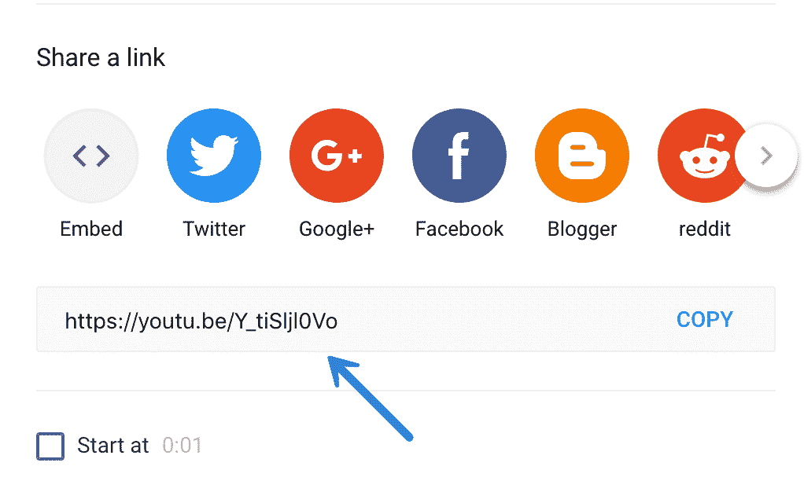

YouTube embed link

提示:您可以通过先选中“开始于”框并选择一个时间，自动让视频从某个地方开始播放(例如，30 秒后)。然后复制链接。

> Kinsta 把我宠坏了，所以我现在要求每个供应商都提供这样的服务。我们还试图通过我们的 SaaS 工具支持达到这一水平。
> 
> <footer class="wp-block-kinsta-client-quote__footer">
> 
> 
> 
> <cite class="wp-block-kinsta-client-quote__cite">Suganthan Mohanadasan from @Suganthanmn</cite></footer>

[View plans](https://kinsta.com/plans/)

### 第二步

将 URL 粘贴到 WordPress 编辑器中，嵌入功能会自动将它变成一个嵌入的视频。

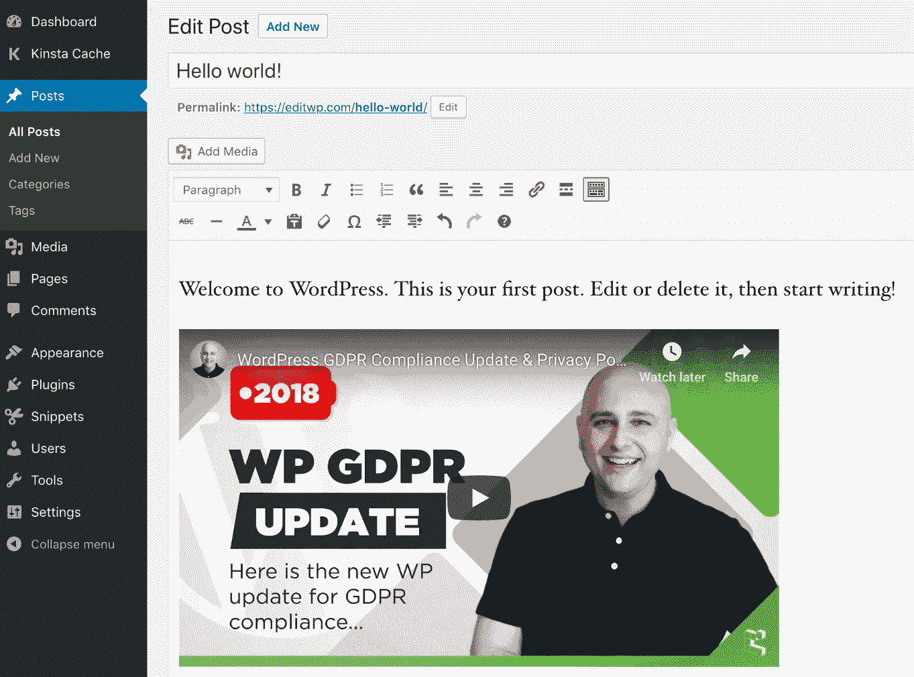

Embed YouTube video in WordPress editor

## YouTube 嵌入插件的有趣特性

虽然上面的方法简单快捷，但是 YouTube embed plugins 可以给你的网站增加很多功能。以下是您可以获得的众多不同功能中的几个:

*   用于改进网站上嵌入的视频的隐私和同意选项的工具。
*   嵌入大型图库的选项，让它们在访问者登陆您的页面时播放，或者在
*   能够[延迟加载你的视频](https://kinsta.com/blog/wordpress-lazy-load/)，这样媒体就不会拖慢你整个网站的速度。
*   视觉设置控制，用于调整视频的颜色、大小和整体外观等项目。
*   在将视频放入 [widgets](https://kinsta.com/blog/wordpress-widgets/) 和帖子等区域时，可以选择使用短代码来更灵活地放置视频。
*   灯箱观看和其他替代视频显示。
*   当用户滚动你的视频时，创建悬停和动画效果的工具。
*   从社交媒体账户和 YouTube 等多个来源获取视频的选项。这是在你自己的网站上策划一个视频频道的好方法。
*   社交媒体按钮，鼓励人们分享你的视频。
*   用于创建和插入完整 YouTube 播放列表的插件，带有附加的格式和设计工具。
*   视频缩略图、[滑块](https://kinsta.com/blog/wordpress-slider/)、颜色变化和各种其他选项，让您的 YouTube 视频嵌入脱颖而出。

## 在 WordPress 中集成和嵌入 YouTube 的最佳方式

我们已经浏览并查看了所有可以用来在 WordPress 中嵌入 YouTube 视频的最好的 WordPress 插件。现在是时候投入进去了！

1.  [YouTube by EmbedPlus](#youtube-embedplus)
2.  [WP YouTube Lyte](#wp-youtube-lyte)
3.  [视频图库 YouTube 图库](#video-gallery)
4.  [喂他们社交](#feed-them-social)
5.  [YotuWP](#yotuwp)
6.  [视频变焦](#videozoom)
7.  [ARVE 高级响应视频嵌入器](#arve)
8.  [WpDevArt YouTube 嵌入、播放列表和弹出菜单](#wpdevart-youtube-embed)
9.  [你的频道](#yourchannel)
10.  [YouTube 图库](#youtube-gallery)

## 1.YouTube by EmbedPlus

EmbedPlus 的 [YouTube 插件](https://wordpress.org/plugins/youtube-embed-plus/)提供了几种方法来定制你在 WordPress 网站上嵌入的视频。首先，该插件具有图库功能，可以将您的播放列表或频道列表拉入您的网站。图库响应迅速，可随时进行定制。然后，您的用户可以根据自己的需要浏览和搜索某些视频。

[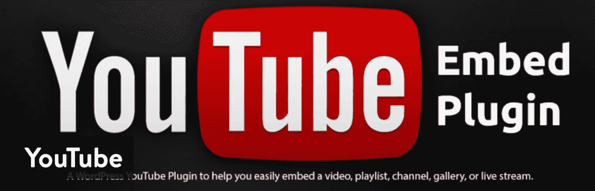](https://wordpress.org/plugins/youtube-embed-plus/)

YouTube WordPress plugin

EmbedPlus 的 YouTube 插件中包含了许多其他功能，但我们将在下面的列表中介绍其中最好的功能。至于价格，这个插件的大部分基本功能都是免费的。例如，你可以加入一些品牌，去掉 YouTube 的一些颜色和标志，同时在你的网站上加入 YouTube 直播流。[高级版](https://www.embedplus.com/dashboard/pro-easy-video-analytics.aspx?ref=readme)起价 19.99 美元，可以终身访问 YouTube 插件。

对一些计划提供了支持，您会收到一些有趣的附加功能，如自动视频 SEO 标记和更快的页面加载。我特别喜欢高级图库定制和移动兼容性检查，以了解人们如何在他们较小的设备上观看视频。

### 为什么这个插件是在 WordPress 中集成和嵌入 YouTube 的最佳方式之一？

*   该插件的基本功能是免费的，我认为大多数人不需要升级。
*   即使是高级版本也是负担得起的，你只需一次性付款就能得到(除非你想要持续的客户支持)。
*   免费版有生成播放列表和图库的工具。您还可以包含 YouTube 实时流，以便这些流直接在您的网站上播放。
*   YouTube 插件有一个漂亮的设计界面，有大量的设置供你调整，比如颜色和大小。
*   您还可以在特定时间开始播放视频，并为客户调整音量。例如，一些网站管理员可能想在客户登陆他们的网站时就开始播放他们的视频。

## 2.WP YouTube Lyte

WP YouTube Lyte 插件有一个主要的工作，那就是延迟加载你嵌入的 YouTube 视频，以便你的网站尽可能快地运行。延迟加载通常可以通过图像来完成，但是这个插件通过主要关注 YouTube 视频将它带到了一个新的水平。延迟加载只加载用户当前看到的媒体。因此，您的服务器不会太努力地加载页面或网站上的所有视频。

因此，网站加载速度更快，您应该会看到整个网站的性能都有所提高。

[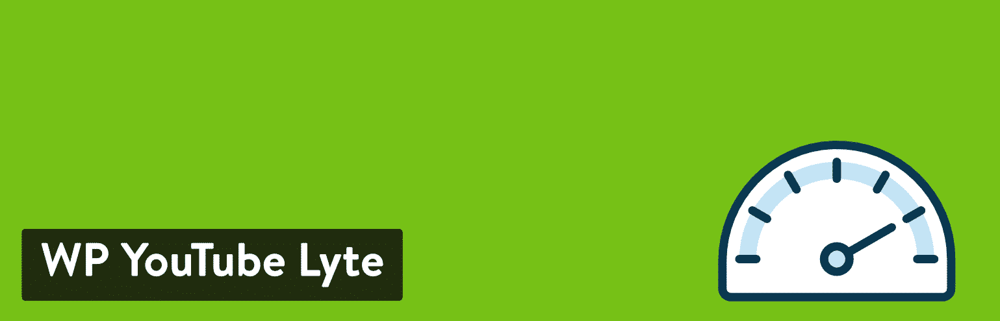](https://wordpress.org/plugins/wp-youtube-lyte/)

WP YouTube Lyte

WP YouTube Lyte 插件是完全免费的，所以没有任何提示向你追加销售或试图让你购买附加软件或高级版本。

这个插件并不像大多数图像载入器那样载入视频。该插件通过嵌入视频的小版本(本质上只是视频缩略图的图像)来工作。直到用户点击缩略图，要求“更重”的版本，YouTube 才会提供。如果你打算在同一个页面上拥有大型图库或多个视频，这一点尤为重要。你的访问者不会注意到普通的 YouTube 嵌入之间的任何差异，所以视频的加载速度仍然和你预期的一样快。

### 为什么这个插件是在 WordPress 中集成和嵌入 YouTube 的最佳方式之一？

*   WP YouTube Lyte 插件提供了 YouTube 视频的轻量级嵌入，直到访问者决定她想要观看它。点击之后，YouTube 视频的完整版本就会播放。
*   它提高了网站的整体性能，尤其是当你在一个页面上有大量的视频时。
*   因为该插件不需要向 YouTube 服务器发出任何请求，所以它实际上提高了 GDPR 合规性。
*   你可以使用短码在你的网站上快速放置优化的 YouTube 视频。
*   该插件已经在所有移动设备上进行了测试，以确保延迟加载不会影响 YouTube 的移动性能。

### 不带 WP YouTube Lyte 的速度测试

想知道它能让你的网站快多少吗？我们用一个普通的 YouTube 嵌入式视频进行了五次速度测试，取了平均值。

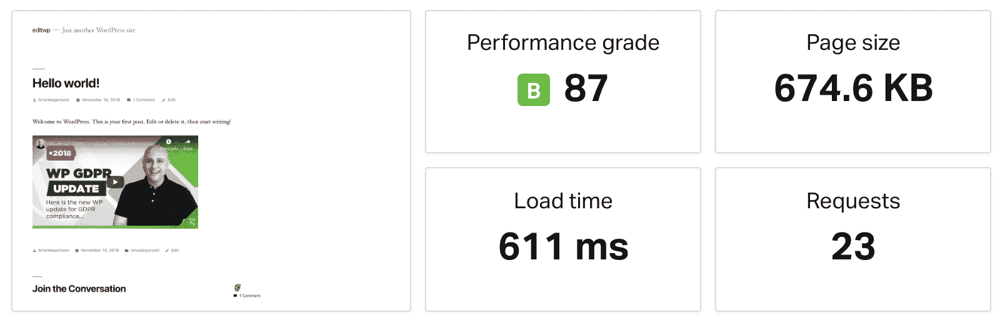

YouTube no lazy loading ([speed test](https://tools.pingdom.com/#59dcbe6a2e800000))

### 用 WP YouTube Lyte 进行速度测试

然后，我们在启用 WP YouTube Lyte 插件及其缓存缩略图选项的情况下运行了五次测试。这个小小的免费插件**减少了 40.43%的总加载时间！更不用说它还减少了页面大小和默认 YouTube 嵌入播放器附带的所有额外的外部请求。**

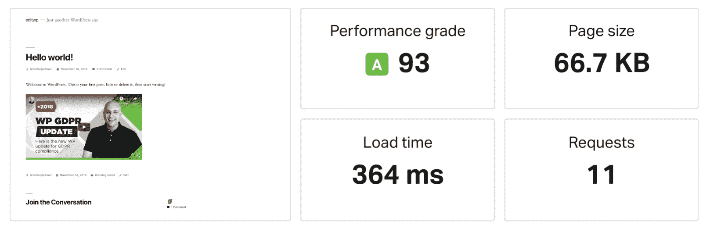

Speed test with lazy load enabled ([speed test](https://tools.pingdom.com/#59dcc16373400000))

[Lazy loading your YouTube videos can easily decrease your page load times by over 40%! 😲Click to Tweet](https://twitter.com/intent/tweet?url=https%3A%2F%2Fkinsta.com%2Fblog%2Fembed-youtube-video-wordpress%2F&via=kinsta&text=Lazy+loading+your+YouTube+videos+can+easily+decrease+your+page+load+times+by+over+40%25%21+%F0%9F%98%B2&hashtags=webperf%2Cperfmatters)

## 3.视频库–YouTube 视频库

[Video Gallery](https://wordpress.org/plugins/gallery-videos/) 工具迎合了那些想要为他们的 YouTube 视频创建一个漂亮的图库而不具备高级设计技能的人。关于这个插件有趣的是，它还支持来自 Vimeo 和 Wistia 等地方的视频，并且你还可以使用所有这些服务的组合创建无限数量的图库。不仅如此，你放在图库中的所有视频都可以在移动设备上观看。

[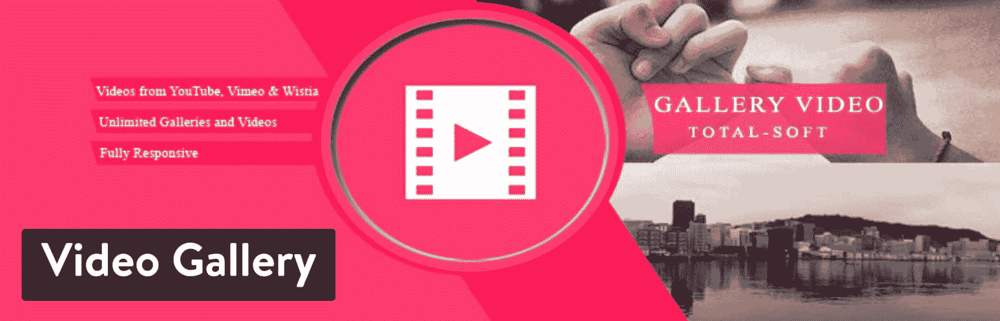](https://wordpress.org/plugins/gallery-videos/)

Video Gallery WordPress plugin

搜索工具也给人留下了深刻的印象，要求用户搜索和浏览某些视频，并通过清晰的导航找到视频。插件还提供了几个主题，在你实现一个主题后，你会得到大量的定制工具来玩。基本插件是免费的，但是你可以选择升级到高级版本。在撰写本文时，付费版本的价格为 45 美元，但开发者有时会有不同的促销活动。

如果您要升级到高级版本，大多数功能都涉及自定义图库的外观。例如，您可能想要调整图标颜色、边框或字体样式。这些设置在高级插件中都有。

### 为什么这个插件是在 WordPress 中集成和嵌入 YouTube 的最佳方式之一？

*   这是一个非常用户友好的图库插件，提供了创建带有主题和图库布局的图库的选项。
*   免费版中有相当多的定制工具。例如，你可以添加灯箱效果或某种悬停效果来吸引用户点击你的视频。
*   你在网站上插入的所有图库都是移动响应的。
*   如果你想更灵活地把你的 YouTube 视频放到网上，有一个无限的短代码生成器。
*   该插件支持多种类型的视频，包括 YouTube、Vimeo、Wistia 和 MP4 视频。
*   您的图库中可以有无限数量的视频。
*   如果你想完全定制和品牌化你的画廊，高级版并不贵。

## 4.让他们学会社交

[Feed Them 社交插件](https://wordpress.org/plugins/feed-them-social/)对 YouTube 嵌入游戏采取了完全不同的方法。安装插件后，你可以选择你最喜欢的社交视频，并显示在帖子、页面或网站的任何地方。对于想要突出显示与博客或产品相关的某些名人页面或特定教程的公司来说，这是一个很好的解决方案。

## 注册订阅时事通讯

### 想知道我们是怎么让流量增长超过 1000%的吗？

加入 20，000 多名获得我们每周时事通讯和内部消息的人的行列吧！

[Subscribe Now](#newsletter)

这个免费的插件可以查看和显示你的脸书页面，以及相册封面和照片。你可以包含任意多的订阅源，但是如果你想限制每个订阅源的条目数量，你就必须[升级到高级版本](https://www.slickremix.com/downloads/feed-them-social-premium-extension/)。单个网站的起价为 50 美元，但开发者也有其他扩展，最终可能会让你花费更多，这取决于你喜欢什么。例如，你会发现脸书评论、组合流和传送带的扩展。

[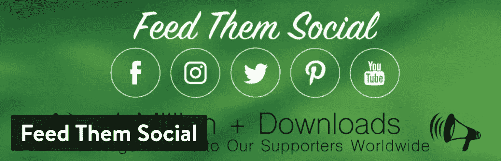](https://wordpress.org/plugins/feed-them-social/)

Feed Them Social WordPress plugin

该插件似乎主要关注脸书视频和媒体内容，但也支持 YouTube、Twitter、Instagram 和 Pinterest。从技术上来说，你可以用它在网站上展示你自己的 YouTube 频道，或者将一组 YouTube 视频组合成一个图库。

### 为什么这个插件是在 WordPress 中集成和嵌入 YouTube 的最佳方式之一？

*   该插件允许你找到你最喜欢的社交媒体视频，并将其添加到你的网站上。
*   添加尽可能多的源，并将其自定义到一个漂亮的图库中。
*   这些提要都有响应，并准备好进行颜色定制。
*   免费版还包括一些工具，人们可以在脸书和 Instagram 等网站上分享你的视频。
*   在网站上管理视频时，内容来源包括 Pinterest、脸书、Twitter 和 YouTube。
*   如果你想获得额外的创意，Feed Them 社交插件的开发者提供了广泛的扩展，比如组合流和传送带。

## 5.约图普

如果你正在寻找一种简单而又时髦的方式来把你的 YouTube 视频放到 WordPress 网站上，那么 [YotuWP 插件](https://wordpress.org/plugins/yotuwp-easy-youtube-embed/)就能帮你搞定。它重量轻，易于使用，功能强大，足以支持来自特定用户名的图库、播放列表、频道和视频。你甚至可以选择从一个来源添加一个视频。YouTube、Vimeo 和 Wistia 都可以作为集成使用，布局包括网格、列表和混合图库。

[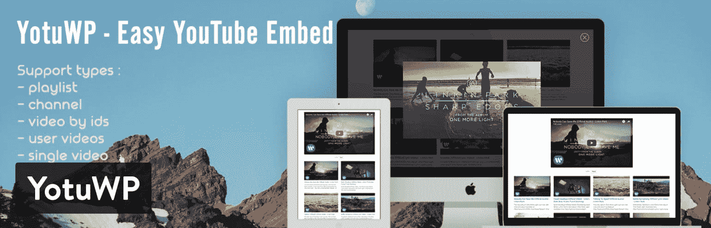](https://wordpress.org/plugins/yotuwp-easy-youtube-embed/)

YotuWP plugin

我觉得你需要的大多数功能都在免费版本中，但它确实更适合那些简单的视频嵌入者，他们想要一种简单的方式来在线获得那些 YouTube 视频，而没有任何混乱的设置。

如果你决定使用[高级版](https://www.yotuwp.com/pricing/)，它的起价为每年 14 美元，包括几个功能，如旋转木马和砖石布局，12 个悬停图标，标题和描述的替代物，以及按钮的自定义文本。简而言之，高级版几乎完全剥离了 YouTube 视频的品牌，使视频更适合你自己的网站。但是，很多人要么不在乎这个，要么不需要在这个上面花钱。

### 为什么这个插件是在 WordPress 中集成和嵌入 YouTube 的最佳方式之一？

*   YotuWP 提供了一个极简主义的设计和一个漂亮的视频演示。我们喜欢它为初学者或只是那些不需要其他插件的所有功能。
*   您可以以多种图库格式显示视频，例如混合图库或列表。
*   该插件提供了从多种来源获取视频的选项。例如，您可能希望从一个播放列表中提取所有视频。或者，您可能更喜欢某个用户名或频道的视频。
*   大视频小视频都有。所有的尺寸定制都是在插件中完成的，留给你一个不需要太多时间就可以在线观看视频的界面。
*   您甚至可以获得一些独特的显示选项，如模态、弹出窗口和灯箱。
*   您仍然可以选择在高级版本中获得强大的定制工具。不仅如此，对于一个高级插件来说，每年 14 美元是非常便宜的。

## 6.视频缩放

Videozoom 没有免费版本，但绝对值得一看。这是因为 Videozoom 实际上是一个完整的 WordPress 主题，而不是一个插件。我们把它放在这里是因为我们知道有些人正在制作以 YouTube 画廊为主要焦点的网站。因此，安装一个支持这种类型的主题而不是一个插件是有意义的。该主题有助于展示来自互联网各地的视频集合。例如，如果你想[开设自己的 YouTube 频道](https://kinsta.com/blog/how-to-create-a-youtube-channel/)，并在你的网站上发布所有这些视频，这可能是一个不错的选择。

如果你打算从其他来源收集视频，情况也是如此。该主题有一个灵活的滑块，用于展示您最重要的或最近的视频。你也可以即时嵌入 YouTube 上的视频或者自己托管视频。

Struggling with downtime and WordPress problems? Kinsta is the hosting solution designed to save you time! [Check out our features](https://kinsta.com/features/)

[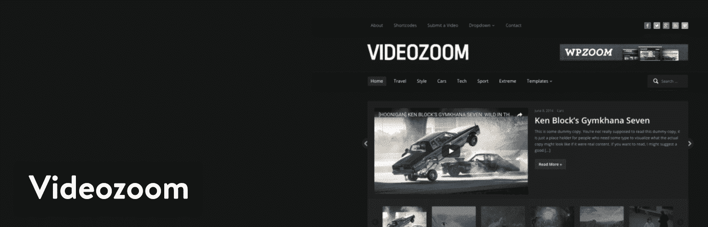](https://www.wpzoom.com/themes/videozoom/)

Videozoom WordPress plugin

这不是一个免费的主题，但 69 美元的价格标签对你得到的所有功能来说并不坏。你也可以考虑为所有的 WPZoom 主题支付 99 美元的会员费。

总的来说，Videozoom 提供了一个即时的解决方案来显示您的视频，并确保它们都可以在移动设备上观看并被搜索引擎发现。你还会发现这个主题提供了翻译就绪的工具，定期的主题更新，以及一个一键式的演示内容导入器，这样你就不用从头开始了。我真的很喜欢用插件来嵌入 YouTube 视频的想法，但是如果你还没有一个配置好的网站，那么用一个主题就很有意义。

### 为什么这个插件是在 WordPress 中集成和嵌入 YouTube 的最佳方式之一？

*   这是一个完整的 WordPress 主题，所以你用所有你需要的嵌入工具开始你的网站，给你的访问者留下印象。
*   它提供两种皮肤，深色和浅色。通过这种方式，你可以给你的网站打上一点烙印，想想你的访问者会如何看待这些视频。
*   如果你是一个开发者，你可以选择使用 WPZoom 会员资格接收超过 40 个 WordPress 主题。
*   从 YouTube 嵌入很容易，你也可以上传你自己的本地视频到你的服务器。
*   从 YouTube 上传视频或链接后，会生成一个视频缩略图。
*   所有界面都相当漂亮，移动设计使你的视频可以立即播放，就像在 YouTube 上一样。

## 7.高级响应视频嵌入器

ARVE Advanced Responsive Video Embedder 在您的网站上毫无问题地呈现视频方面享有盛誉。正如你在你的网站上发布视频时所了解到的，无论是小问题还是大问题，似乎总会出错。

这个插件在完成这项工作的同时，还支持除 YouTube 之外的许多其他视频网站。例如，你可能想从 TED 或 Twitch 或 Comedy Central 下载一个视频。在这些情况下，你并不总能在 YouTube 上找到相同的视频。因此，你需要从实际的源网站抓取链接。这是一个支持数十个其他网站的插件，同时仍然提供我们已经习惯的响应视频观看。

ARVE WordPress plugin

免费版本以一种合理的方式显示你的视频，它还提供了一个所见即所得编辑器，这样你就不用去弄乱任何短代码。之后，视频会显示标题、描述和其他上传信息，这样搜索引擎就可以对其进行索引，人们就可以知道这些视频是关于什么的。

我个人感觉大多数安装插件的人对免费版本都没问题，但也有选择升级到 35 美元的选项。高级版的主要功能之一是允许你禁用视频上的链接。这意味着用户不能点击 Youtube 链接，从你的网站被带走。还有一个懒惰加载功能，灯箱，悬停造型，和不同的播放图标。总的来说，专业版并不贵，所以如果你绝对需要这些功能中的一个，这是一个不错的选择。

### 为什么这个插件是在 WordPress 中集成和嵌入 YouTube 的最佳方式之一？

*   ARVE 高级响应视频嵌入器几乎支持你在网上找到的所有视频。只要你访问的网站使用了 [iframe 嵌入代码](https://kinsta.com/blog/wordpress-iframe/)，你就不会有问题。你还可以毫无问题地即时嵌入 YouTube 视频。
*   WYSIWYG 支持意味着不需要短码。因此，您可以自定义您的视频显示，并将视频放在帖子和页面上。
*   这是一个搜索引擎友好的插件，提供你网站上的视频信息。例如，你可以向你的用户展示标题和描述。
*   如果你喜欢短代码，插件会提供一个选项。
*   当用户登陆你的网站时，视频会自动开始播放。
*   虽然不是每个人都需要，但付费版本有一些延迟加载和禁用 YouTube 链接的选项，这两者都允许更好的控制和优化。

## 8.WpDevArt YouTube 嵌入、播放列表和弹出窗口

[WpDevArt YouTube 嵌入插件](https://wordpress.org/plugins/youtube-video-player/)为初学者提供了简单的安装和流畅的嵌入过程。这个插件的全部目的是提供一个快速嵌入的方法，而不需要知道任何代码。使用 WordPress，嵌入视频不需要编码知识，但是这个插件增加了一些有趣的功能，可以将视频放入小工具中，调整视频的大小，以及改变颜色。虽然插件是免费的，但 Pro 版的功能最令人印象深刻。

[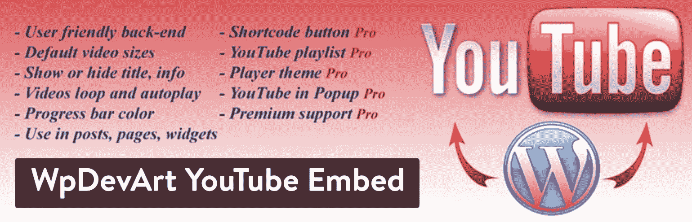](https://wordpress.org/plugins/youtube-video-player/)

WpDevArt YouTube Embed plugin

在 [Pro 版本](http://wpdevart.com/wordpress-youtube-embed-plugin)中，你会发现创建 YouTube 播放列表的工具，在弹出窗口中显示你的视频，以及帖子或页面中的按钮简码选项。您还可以为每个视频设置单独的选项，为视频提供各种可能性。相关视频也会显示出来，还有[不同大小的缩略图](https://kinsta.com/blog/regenerate-thumbnails/)。该插件的个人版起价为 12 美元，这也可以让你获得额外的客户支持，这可能会有所帮助。如果你计划在多个网站上安装这个插件，你需要一个商业或开发者许可证，起价 24 美元。

### 为什么这个插件是在 WordPress 中集成和嵌入 YouTube 的最佳方式之一？

*   WpDevArt YouTube Embed 插件提供了一种简单的方法来嵌入您的 YouTube 视频，而没有太多可能会令人困惑的功能。它很容易安装，你所有的视频都可以在移动设备上很好地显示。
*   该插件允许在帖子、页面和小部件中插入 YouTube 视频。
*   虽然这个插件是轻量级的，但它实际上有很多定制功能，可以调整视频的大小、自动播放功能和循环播放。
*   进度条的颜色可以改变，当有人登陆你的网站时，你可以开始播放视频。
*   专业版是负担得起的，并给你一些功能，可能值得考虑。例如，我喜欢在弹出窗口中显示视频并展示相关视频的想法，以让人们浏览你网站上的更多内容。

## 9.你的频道

就功能和特性集的独特性而言， [YourChannel 插件](https://wordpress.org/plugins/yourchannel/)绝对可以位于这个列表的顶端。你会考虑这个插件的主要原因是如果你已经在自己的 YouTube 频道上积累了很多视频。安装完成后，该插件允许你调出整个频道并发布到你的网站上。与列表中的其他插件不同，YourChannel 模拟了您在 YouTube 上观看频道时看到的内容。它还具有显示单个视频的工具，并包括自动播放功能。

[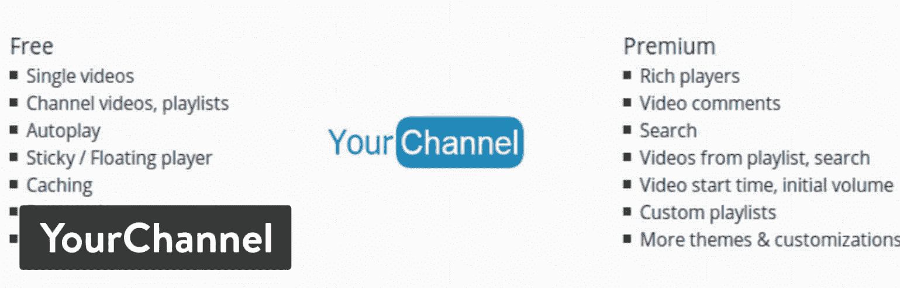](https://wordpress.org/plugins/yourchannel/)

YourChannel WordPress plugin

可视化构建器对于构建您希望 YouTube 频道显示的方式非常有用。还有七种视频缩略图样式，让你在展示自己喜爱的视频时更有创意。所有这些，包括翻译工具，都在免费版本中提供。如果你想买专业版的，个人许可证只需 15 美元。这包括一年的客户支持，以及大量的功能，如分配视频播放数量的选项。值得看看专业版的功能列表，因为有几十个功能-例如搜索频道功能，视频时长显示和颜色改变工具。

### 为什么这个插件是在 WordPress 中集成和嵌入 YouTube 的最佳方式之一？

*   免费版本可以显示完整的 YouTube 频道，类似于它在 YouTube 上的显示方式。
*   您可以显示横幅、播放列表和单个视频等项目，而无需使用编码或复杂的嵌入工具。
*   这些视频都是有针对性的，并且以一种你可以分类的方式组织起来。
*   高级版功能极其强大，价格实惠。
*   例如，一些更独特的高级功能包括主题、[视频评论](https://kinsta.com/blog/wordpress-comment-plugins/)、视频开始时间和播放器导航。
*   免费版本中的缓存肯定会提高你网站的页面加载时间。
*   免费版本也有一个漂亮的灯箱，这样用户就可以在你的视频中出现。

## 10.YouTube 图库

从名字来看， [YouTube 图库插件](https://wordpress.org/plugins/youtube-showcase/)相当简单。它很好地组合了一系列 YouTube 视频，并将其显示在一个时尚的图库或列表中。我们如此喜欢它的原因是，有时你发现一个图库插件，并意识到显示并不优雅。然而，YouTube Gallery 插件使它变得简单而美丽，而无需你做太多的工作。

有趣的是，大多数功能都是在免费版本中提供的，开发者似乎没有对 Pro 版本进行那么多宣传。然而，如果你想要一些附加组件和全面的客户支持， [pro 版本](https://emdplugins.com/plugin-pricing/youtube-showcase-wordpress-plugin-pricing/)是一个很好的选择。客户支持显然是一个优势，但你得到的一些其他升级包括更好的 SEO 工具，批量上传的选项，以及更好的视频插入的短代码生成器。

YouTube Gallery WordPress plugin

如果你想只有一两个视频，这个插件可能不适合你。也就是说，对于那些试图将几十个视频上传到自己网站，而宁愿从 YouTube 上下载视频的人来说，这是一个必不可少的解决方案。或者，你可以选择在 YouTube 上管理多个来源的视频。这个插件工作得这么好的主要原因之一是因为你可以不用做太多的工作就可以调整图库。例如，它提供了网格图库和列表，以及尺寸修改器和短代码创建器。

### 为什么这个插件是在 WordPress 中集成和嵌入 YouTube 的最佳方式之一？

*   该插件以一种时尚优雅的方式显示你的视频集合。
*   基本插件是免费的，但你可以花 99.99 美元升级获得几十个附加功能。
*   主图库将您的视频放在四列响应式布局中。你不必做太多的编辑工作。
*   视频内容显示在视频页面上，便于用户理解视频内容。
*   该插件带有两个侧边栏小部件，用于在几个页面上展示较小的视频。这些小部件用于特色 YouTube 视频和最近的 YouTube 视频。

## 这些插件中，哪一个最适合你在 WordPress 中嵌入 YouTube？

当试图找出如何在 WordPress 中嵌入 YouTube 时，很明显这些插件非常相似。我们已经根据每个插件的最佳特性对其进行了分类，但是看起来还是有点混乱。以下是我们根据您的具体情况给出的最佳建议。这样，你可以选择其中的两到三个，在你自己的网站上进行测试。我发现视频库插件需要测试，因为有些人更喜欢某些布局。此外，你可能会发现一个插件不适合你的主题或其他插件。

*   **寻找最好的 YouTube 嵌入式插件**–使用 YouTube by EmbedPlus。
*   **为了延迟加载你所有嵌入的 YouTube 视频**——考虑 WP YouTube Lyte。
*   **为您的视频创建一个漂亮的图库**–想想视频图库–YouTube 图库
*   **从社交网络上下载视频(并在视频上添加社交分享按钮)**-尝试社交化的视频。
*   如果你喜欢多样的图库布局组合——YotuWP 插件是一个不错的选择。
*   对于那些刚刚建立视频网站并想要一个完整的 YouTube 图库主题的人来说,——video zoom 主题会让你走上正确的道路。
*   如果你喜欢所见即所得编辑器而不是短代码编辑器，考虑 ARVE 高级响应视频嵌入器。
*   **对于一个非常基本的 YouTube 嵌入工具**——想想 WpDevArt YouTube 嵌入、播放列表和弹出窗口。
*   **调出整个 YouTube 频道，并显示其在 YouTube 上的显示效果**–选择您的频道。
*   如果你想测试一个不同的图库插件——YouTube 图库插件可以创建很棒的图库。

如果你对如何在 WordPress 中嵌入 YouTube 有任何疑问，请在评论中告诉我们！

* * *

让你所有的[应用程序](https://kinsta.com/application-hosting/)、[数据库](https://kinsta.com/database-hosting/)和 [WordPress 网站](https://kinsta.com/wordpress-hosting/)在线并在一个屋檐下。我们功能丰富的高性能云平台包括:

*   在 MyKinsta 仪表盘中轻松设置和管理
*   24/7 专家支持
*   最好的谷歌云平台硬件和网络，由 Kubernetes 提供最大的可扩展性
*   面向速度和安全性的企业级 Cloudflare 集成
*   全球受众覆盖全球多达 35 个数据中心和 275 多个 pop

在第一个月使用托管的[应用程序或托管](https://kinsta.com/application-hosting/)的[数据库，您可以享受 20 美元的优惠，亲自测试一下。探索我们的](https://kinsta.com/database-hosting/)[计划](https://kinsta.com/plans/)或[与销售人员交谈](https://kinsta.com/contact-us/)以找到最适合您的方式。