# 被锁定在你的 WordPress 管理面板之外？(下面是要做的事情)

> 原文：<https://kinsta.com/blog/locked-out-of-wordpress-admin/>

被锁在你的 WordPress 管理面板之外会引起各种各样的恐慌。很少有比发现你无法登录 WordPress admin 更令人沮丧的事情了——你心爱的数字权力领域。

这很像你在漫长的一天后回到家，发现钥匙丢了的感觉。你感到恐慌，然后你感到沮丧，最后，你开始寻找解决办法。

如果你在这里，你可能已经在第三点上了。很高兴，你可以采取相当简单的步骤回到你的 WordPress 仪表盘。

所以，你可能想要平静你的神经，深呼吸，掰你的指关节，学习我们向你展示的如何成为一名锁匠大师。

[Locked out of your WordPress admin dashboard? 😰 Don't panic, here's how to quickly get back in.Click to Tweet](https://twitter.com/intent/tweet?url=https%3A%2F%2Fkinsta.com%2Fblog%2Flocked-out-of-wordpress-admin%2F&via=kinsta&text=Locked+out+of+your+WordPress+admin+dashboard%3F+%F0%9F%98%B0+Don%27t+panic%2C+here%27s+how+to+quickly+get+back+in.&hashtags=WordPress%2Cwebdev)

## 还原备份或创建备份

重要的事情先来。根据你运行的 WordPress 站点的类型，恢复你的 WordPress 站点的备份来修复你的登录问题并快速恢复可能会更快。尤其是如果你知道你的问题是什么时候开始发生的。

在 Kinsta，每天都会自动备份，你可以点击一下[恢复你的 WordPress 站点](https://kinsta.com/blog/restore-wordpress-from-backup/)。如果你使用 [WordPress 备份插件](https://kinsta.com/blog/wordpress-backup-plugins/)设置了自动每日备份，情况也是如此。

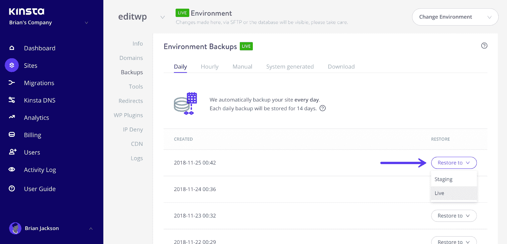

Restore WordPress backup

如果你正在运行一个数据不断变化的网站，比如说一个 WooCommerce 网站或有很多评论的高流量博客，那么你会希望继续下面的步骤，这样你就不会丢失中间的任何数据。

> 需要在这里大声喊出来。Kinsta 太神奇了，我用它做我的个人网站。支持是迅速和杰出的，他们的服务器是 WordPress 最快的。
> 
> <footer class="wp-block-kinsta-client-quote__footer">
> 
> 
> 
> <cite class="wp-block-kinsta-client-quote__cite">Phillip Stemann</cite></footer>

[View plans](https://kinsta.com/plans/)

由于接下来的步骤涉及改变你的[数据库](https://kinsta.com/knowledgebase/wordpress-database/)中的重要数据，我们建议在继续之前做一个 [WordPress 站点备份](https://kinsta.com/blog/backup-wordpress-site/)。因为你不能访问 WordPress 管理仪表板，你必须手动操作。

大多数主机允许您从控制面板生成并下载网站和数据库的完整备份。你可能需要阅读你的网站主持人关于如何做到这一点的指示。在 Kinsta 你可以创建一个[手动备份](https://kinsta.com/help/wordpress-backups/#create-wordpress-backup)或者甚至下载一个完整的网站(。zip)备份。

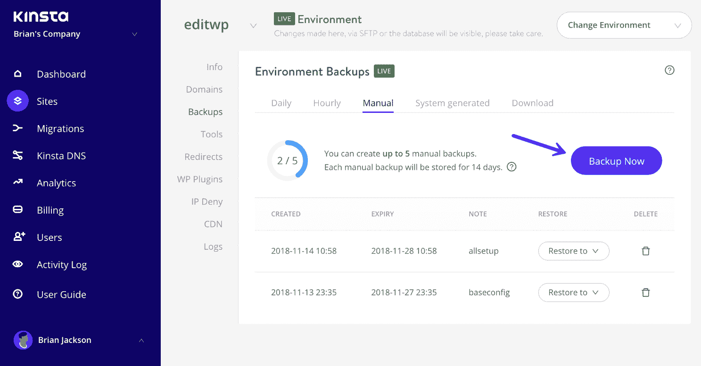

Manual WordPress backup

如果您使用 cPanel，您可以在“备份”工具或“备份向导”下完成此操作

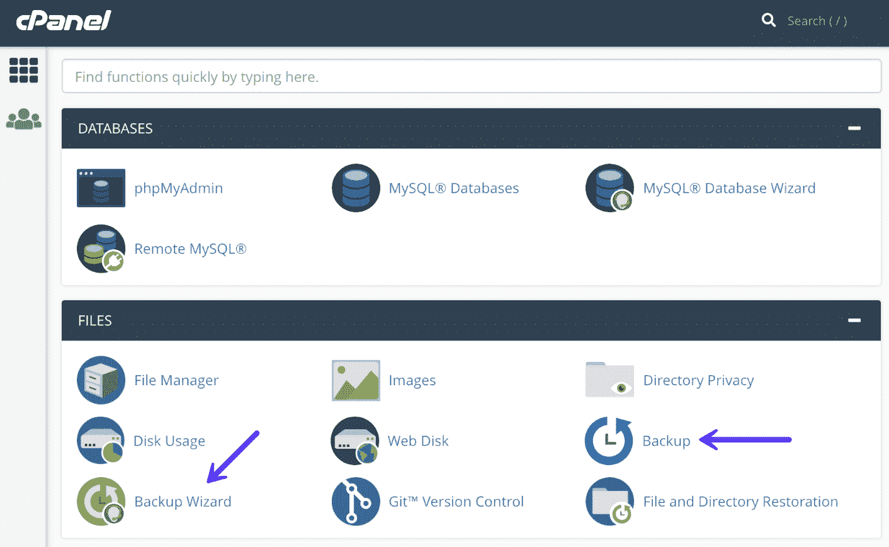

cPanel backup

当您有了可靠的备份后，请继续下面的步骤来解决您的问题。

## 为什么你被锁定在 WordPress 管理面板之外？

你可能在想“为什么 WordPress 不让我登录？”发生这种情况有许多可能的原因。你可能最近修改了你的 WordPress 代码，你可能添加了一个新的插件或主题，或者你可能刚刚醒来就遇到了这个错误。

如果您最近做了导致这个错误的更改，您应该非常清楚从哪里开始纠正这个问题。

无论是哪种情况，本指南都将带您了解有助于解决此问题的各种解决方案。解决方案根据您遇到的错误进行分组，因此您不必全部阅读。

*   **看到“此功能已被禁用”时:**禁用登录或安全插件。
*   **当密码不起作用(密码恢复失败):**使用 phpMyAdmin 重置密码。
*   **当您失去管理员权限时:**创建一个新用户并分配管理员权限。
*   **当你因登录次数过多而被锁定时:**禁用安全插件。
*   **看到白屏死机:**排除白屏死机的常见原因。
*   **看到“建立数据库连接出错”**:修复数据库连接问题。
*   **当您看到“解析错误:语法错误”时:**检查任何最近的代码更改。

## 当你忘记了你的自定义登录网址

一个常见的 WordPress 安全实践是[将默认的管理员登录 URL](https://kinsta.com/blog/wordpress-login-url/#change-login-page) ( `domain.com/wp-admin`)改为自定义的。这有助于防止黑客和机器人不断攻击您的登录 URL 来获取访问权限。

然而，如果因为忘记了你的登录网址而无法登录到 WordPress admin ，当你试图访问你的网站时，你可能会看到一条类似“这已被禁用”的消息。也许你已经把它作为书签删除了，或者它只存在于你的 WordPress 历史记录中，你的缓存已经被清空了。

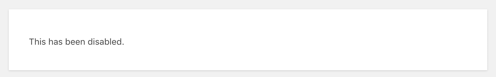

This has been disabled

无论 wp-admin 不工作的原因是什么，如果你使用的是 WPS Hide Login 或 Perfmatters 这样的插件，你可以禁用该插件，暂时将其恢复到原来的登录 URL。Wp-admin 不工作？查看[如何在没有 wp-admin 权限的情况下禁用 WordPress 插件](https://kinsta.com/knowledgebase/disable-wordpress-plugins/)的步骤。

## 当您的密码不起作用(并且密码恢复失败)时

通常，如果你试图登录你的仪表板，得到一个“密码不正确”的消息，简单的解决方法是点击“丢失密码”链接[更改你的 WordPress 密码](https://kinsta.com/blog/change-wordpress-password/)。

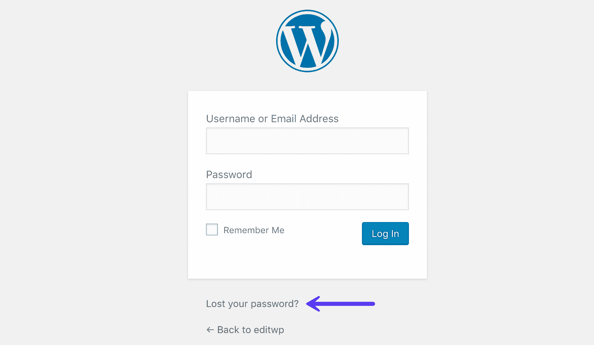

Lost your password

然而，在某些情况下，你可以这样做，但收不到密码重置邮件，可能是因为你的网站有[邮件问题](https://kinsta.com/blog/wordpress-not-sending-email/)。如果这是您的问题，您可以通过直接在数据库上重置密码来解决。

### 使用 phpMyAdmin 重置密码

如果你是一个 Kinsta 客户，你可以在 MyKinsta 的“信息”页面点击“打开 MySQL”来访问 phpMyAdmin。

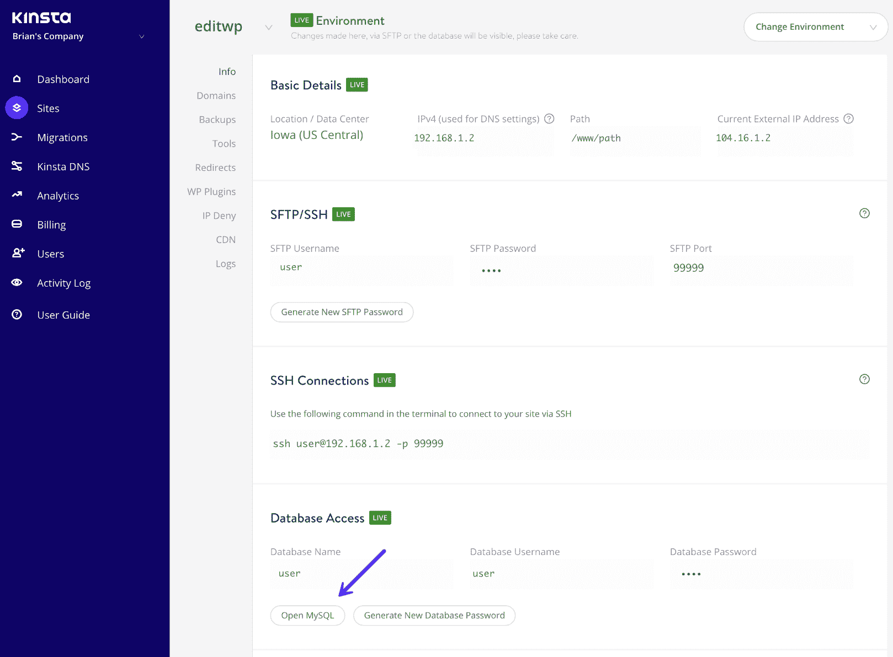

Login phpMyAdmin

如果您使用带有 cPanel 的主机，您可以在“数据库”部分找到 phpMyAdmin 链接。如果您没有 cPanel 登录详细信息，请向您的主机询问。

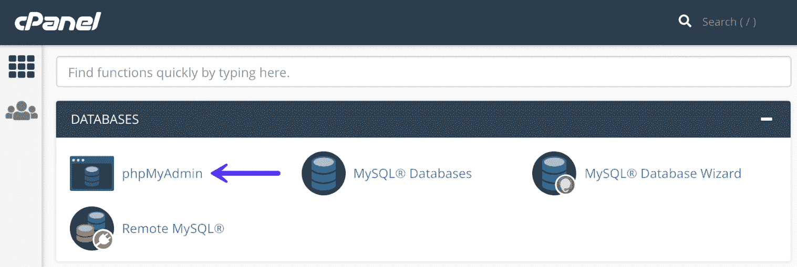

cPanel phpMyAdmin

一旦进入 phpMyAdmin，您将在左侧看到您的数据库列表。点击你的 WordPress 数据库打开它。

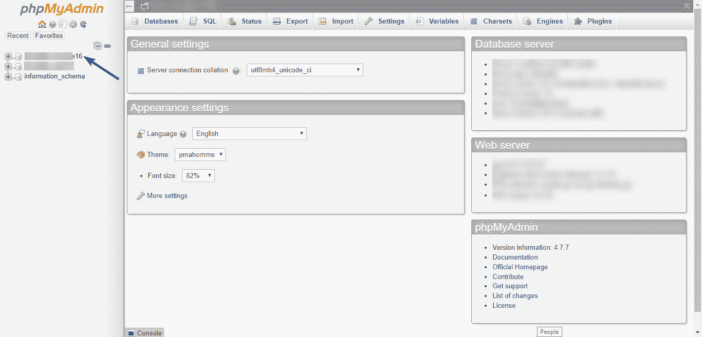

phpMyAdmin database

找到您的`wp_users table`并点击“浏览”

**注意:**前缀不一定总是`wp_`。如果您的前缀不同(例如`site_`，那么您的用户表将是“`site_users`”。

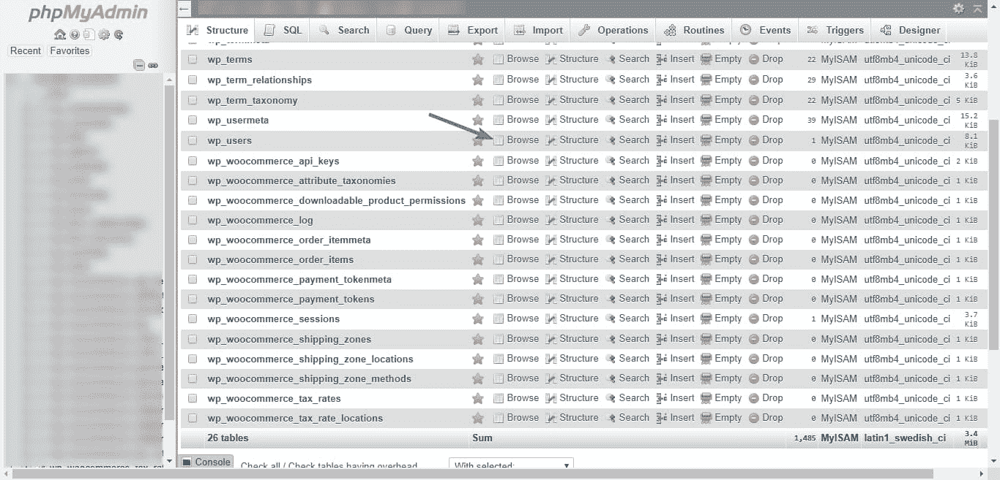

wp_users table

接下来，找到您的管理员用户并单击 Edit。

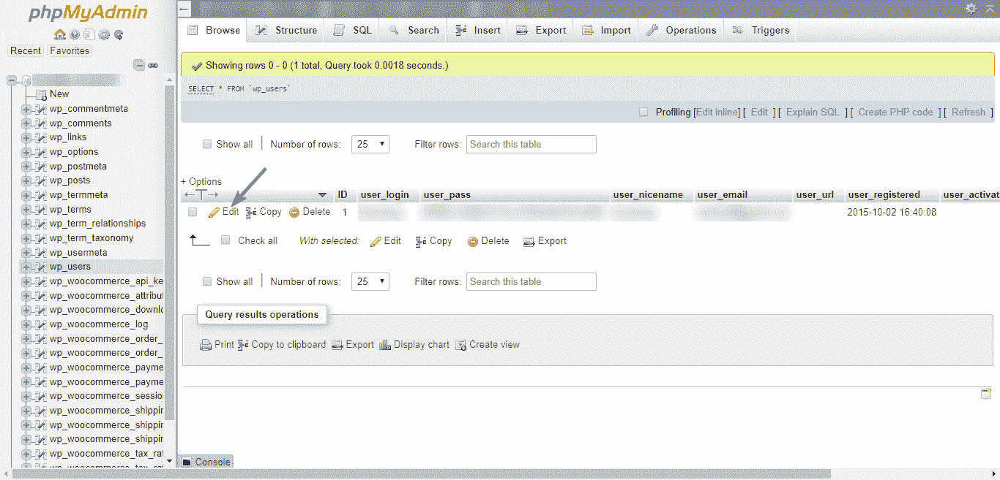

Edit admin user in phpMyAdmin

phpMyAdmin 将在一个表单中显示这个用户的所有信息。要编辑您的密码，找到`user_pass`输入区，清除当前值，并输入您的新密码(记得保存在某个地方)。

在 function 下，选择 MD5 以确保您的新密码经过哈希处理。最后，单击 Go。

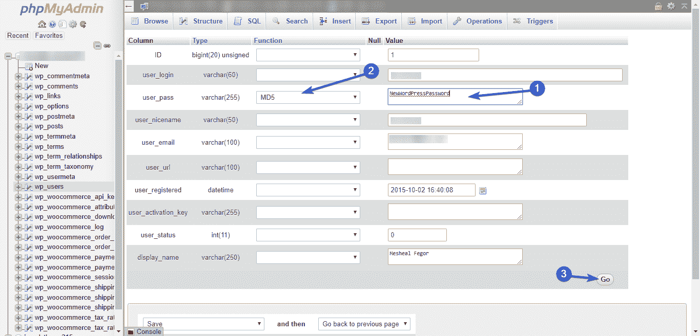

Change password in phpMyAdmin

现在用你的新密码登录到你的 [WordPress 管理仪表板](https://kinsta.com/knowledgebase/wordpress-admin/)。
T3】

## 当您失去管理员权限时

你能正常登录，但发现你不再有管理功能，如插件和主题？如果是这样，那么您的问题是您不再拥有管理员权限。可能是你的 WordPress 网站被黑了，你的权限被删除了。

要解决这个问题，您需要直接在数据库中添加一个新的管理员用户。

### 创建新用户并分配管理员权限

要创建一个新用户，需要使用 phpMyAdmin 访问数据库。在数据库中，我们将编辑`wp_users`和`wp_usermeta`表——第一个用来添加新用户，第二个用来授予管理员权限。

要访问您的数据库，请登录 phpMyAdmin。从左边的列表中选择你的 WordPress 数据库。

phpMyAdmin database

接下来，找到您的`wp_users`表并单击 Insert(同样，您可能有一个不同于`wp_`的前缀)。如果您的前缀是`site_`，则选择`site_users`表)。

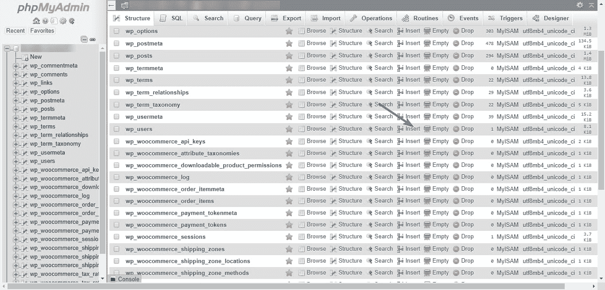

Insert into wp_users table

如下填写插入表单(保留您在此表单中输入的信息，尤其是 ID、`user_login`和`user_pass`字段):

*   **ID—**比您当前拥有的用户数量多的任何数字。例如，如果您有 7 个用户帐户，请输入数字 8。为了安全起见，您可以决定使用一个高得多的数字。或者，您可以随时查看`wp_users`表中现有的 id。
*   **user _ log in**–您想要创建的新用户名。选择一个尚未使用的名称。例如，您不应该使用“admin ”,因为它已经被使用了。
*   **user _ pass**–该用户的密码。确保在 function 下选择 MD5，以便对密码进行哈希运算。此外，请记住保留您输入的密码。
*   **user _ nicename**–您的姓名或昵称。
*   **user _ email**–您想用于该帐户的电子邮件。
*   **用户网址**–您的网站网址。
*   **用户注册**–使用日期选择器选择当前日期。
*   **用户状态**–设置为 0(零)。
*   **display _ name**–您要为该用户显示的名称。您可以输入您的全名或上面设置的昵称。

完成后，单击 Go 保存新用户。

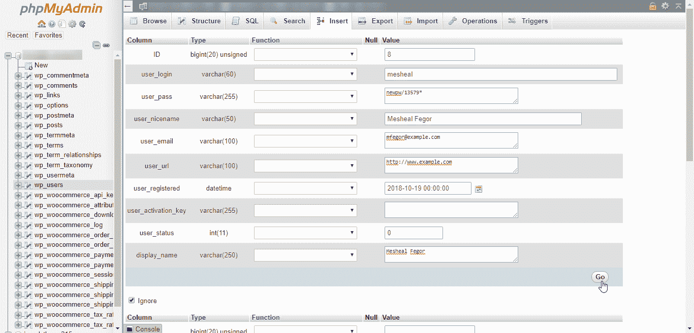

New WordPress user in phpMyAdmin

此时，我们希望向刚刚创建的新用户授予管理员权限。我们通过在`wp_usermeta`表中添加用户的权限来做到这一点。

## 注册订阅时事通讯

### 想知道我们是怎么让流量增长超过 1000%的吗？

加入 20，000 多名获得我们每周时事通讯和内部消息的人的行列吧！

[Subscribe Now](#newsletter)

向下滚动找到`wp_usermeta`表并点击插入。

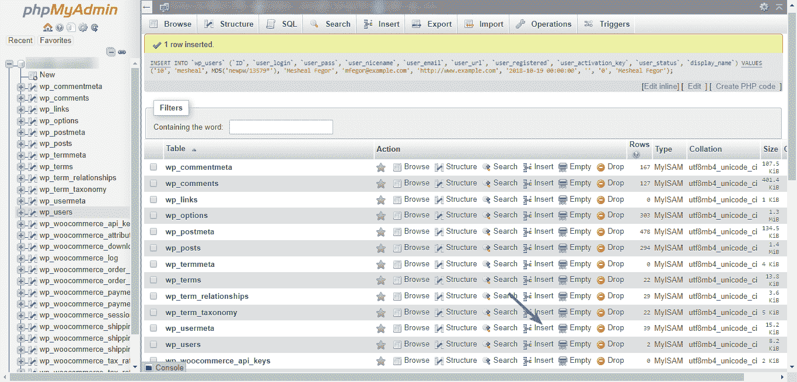

Insert into wp_usermeta table

接下来，使用以下信息填写插入表单:

*   **未见面标识–**留空。它将被生成。
*   **user _ id–**我们刚刚创建的用户的 ID 号。
*   **meta _ key—**输入`wp_capabilities`。
*   **元值**–输入`a:1:{s:13:"administrator";b:1;}`。请确保仔细键入该值。不要复制和粘贴，因为你可能会以无效的引号结束。

单击“开始”添加元值。

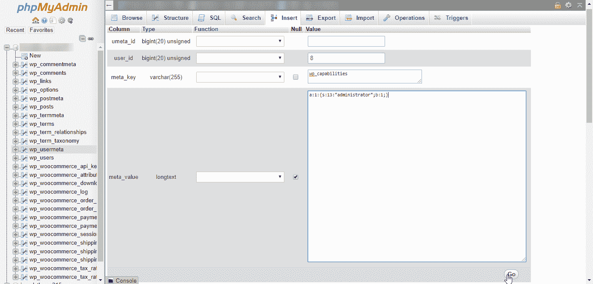

wp_usermeta administrator permissions

重复此过程以添加另一个元，但这一次，使用以下详细信息:

*   **未见面标识–**留空。
*   **user _ id–**我们刚刚创建的用户的 ID 号。
*   **meta _ key—**输入`wp_user_level`
*   **元值**–输入 10。

单击 Go 创建第二个元值。此时，您已经向刚刚创建的用户授予了完全管理员权限。继续使用该用户登录。

## 当你由于太多的登录尝试而不能登录到 WordPress Admin 时

一些 WordPress 安全插件限制登录尝试以防止黑客攻击。这是一个非常有用的安全特性，但是它也可以将你锁在外面。

如果发生这种情况，你发现你不能登录到 WordPress admin，最简单的解决办法是禁用你的安全插件，重新访问你的网站，如果你仍然计划使用安全插件，防止再次被锁定。

要禁用这个插件，使用 FTP 或 [SFTP](https://kinsta.com/knowledgebase/how-to-use-sftp/) 访问你的站点文件(在这里了解两个[的区别)。](https://kinsta.com/knowledgebase/ftp-vs-sftp/)

连接后，双击打开包含你的 WordPress 文件的文件夹(通常是`public_html`)。

接下来，找到你的`wp-content`文件夹，双击打开它。在这个文件夹中，找到您的插件文件夹并打开它。

在那里，你可以看到一个以你的安全插件命名的文件夹。要禁用此插件，请将文件夹重命名为其他名称。在下面的例子中，我们简单地添加了 INACTIVE 作为文件夹名的前缀。

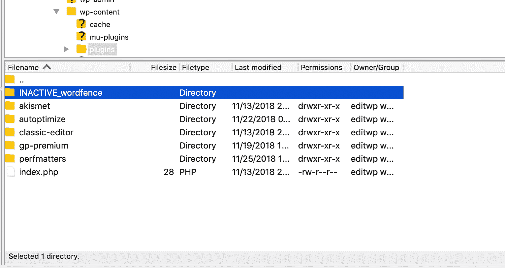

Disable WordPress plugin

现在去尝试访问你的 WordPress 仪表盘。

如果您现在可以成功登录，您需要采取措施防止这种情况再次发生。你可以重新激活插件，将自己从锁定列表中移除，或者将你的 IP 加入白名单，如果这些功能可用的话。否则，你可以决定联系插件的开发者寻求帮助。

## 当你看到死亡的白色屏幕

如果您在尝试访问管理仪表板时看到一个黑屏，那么您的情况就是可怕的白屏死亡。好消息是，有许多解决方案可以让您摆脱这个问题，并让您重新访问您的仪表板。

### 排除白屏死机的常见原因

**通常，白屏死机是由你的插件问题引起的**。因此，你应该尝试的第一件事就是禁用所有插件。

Struggling with downtime and WordPress problems? Kinsta is the hosting solution designed to save you time! [Check out our features](https://kinsta.com/features/)

由于您无权访问您的仪表板，您需要使用 FTP 手动禁用您的插件。

首先，使用 FTP 或 SFTP T2 连接你的站点。连接后，找到包含你的 WordPress 文件的文件夹(通常是`public_html`)，双击打开它。

在那里，找到你的`wp-content`文件夹，双击打开它。在这个文件夹中，你会找到你所有的主要内容，包括你的插件文件夹。要禁用插件，您需要重命名此文件夹，这样 WordPress 就无法再读取它。

为此，右键单击插件文件夹，选择“重命名”，并将名称改为不同的名称，例如“DISABLED_plugins”

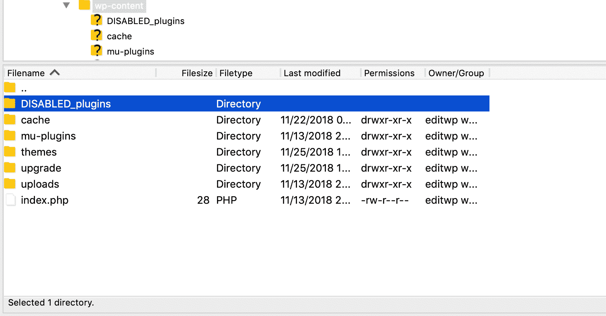

Disabled WordPress plugins folder

接下来，尝试访问您的仪表板，看看问题是否得到解决。如果是，那么您的问题与插件有关。然后，您可以在仪表板中将文件夹名称恢复为“插件”。仍然处于登录状态，您可以在仪表板中禁用所有插件，并开始一个接一个地激活插件，直到错误再次出现。这样，您可以非常容易地指出哪个插件导致了错误。

如果禁用插件不能解决白屏死机的问题，你可以尝试许多其他的解决方案。请阅读我们关于如何修复 WordPress 白屏死机的完整指南。

## 当您看到“建立数据库连接时出错”时

你所有的网站信息，从文章和页面，到用户账号和权限，都存储在你的数据库中。因此，如果您在连接数据库时遇到问题，不用说，您的网站将无法工作。

### 修复数据库连接问题

数据库连接问题经常发生，因为 WordPress 试图用错误的凭证连接。如果你最近修改了你的数据库用户名或密码，你必须更新你的[wp-config.php 文件](https://kinsta.com/blog/wp-config-php/)中的信息，否则，WordPress 将无法建立连接。

要访问您的`wp-config.php`文件，使用 FTP 或 [SFTP](https://kinsta.com/knowledgebase/how-to-use-sftp/) 连接到您的网站。连接后，打开包含你的 WordPress 文件的主文件夹(通常是`public_html`)。在这个文件夹中，找到你的`wp-config.php`文件，点击右键，点击**查看/编辑。**

在 MySQL 设置部分，将您的数据库名称、数据库用户、数据库密码和数据库主机设置为您当前的详细信息。

**注意**DB HOST 并不总是“ [localhost](https://kinsta.com/knowledgebase/what-is-localhost/) ”。你的主机提供商可以给你正确的主机名。

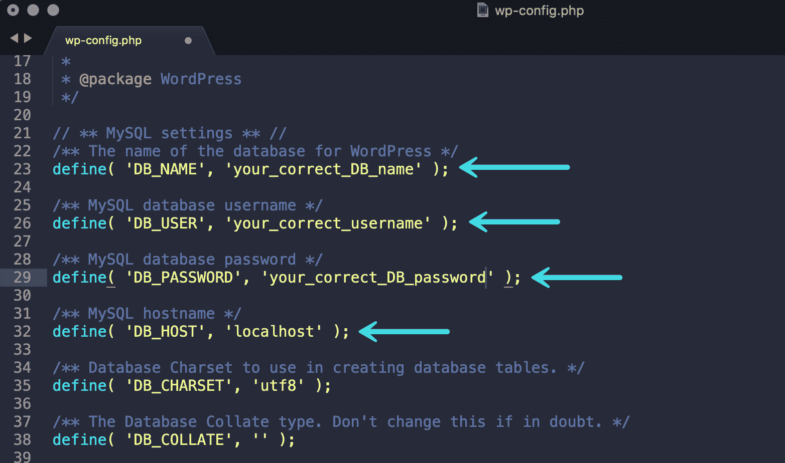

wp-config.php credentials

完成后，尝试访问您的仪表板，看看它是否工作。如果是，那么你的问题是错误的凭证。

数据库错误的另一个原因是数据库服务器的问题。如果您在共享主机上，并且如果此错误意外发生，这可能是您的问题。

在许多共享主机计划中，允许的并发连接数是有限制的。如果超出此限制，这可能会导致数据库连接错误。这是一个简单的步骤，联系你的主机，验证问题是否是他们造成的，如果是，请他们帮助解决。

在 Kinsta，您不必担心这一点，因为我们在每个站点都使用了容器技术。这意味着每一个 WordPress 站点都被放置在它自己的独立容器中，容器中有运行它所需的所有软件资源(Linux，Nginx，PHP，MySQL)。这些资源是 100%私有的，不会在任何人之间共享，甚至不会在你自己的网站上共享。我们唯一的限制是来自 PHP 工作人员的。

如果更新您的凭据或检查您的主机没有解决您的问题，那么您应该尝试数据库错误的其他解决方案。阅读我们的指南[如何修复在 WordPress](https://kinsta.com/blog/error-establishing-a-database-connection/) 中建立数据库连接的错误。

## 当您看到“解析错误:语法错误”时

WordPress 最大的优点是你可以很容易地添加功能来扩展你的网站的功能。网上有许多代码片段，你可以复制并粘贴到你的 WordPress 代码中，以获得额外的铃声或哨声。

如果你目前在试图访问你的网站时看到“解析错误:语法错误”,很有可能你最近从互联网上复制并粘贴了一个这样的代码到你的 WordPress 文件中。

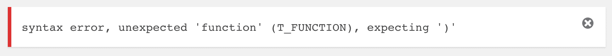

Syntax error

您复制的代码可能包含错误，或者您可能没有正确粘贴它。从 WordPress 4.9 开始，他们应该回滚这些类型的错误，使这种情况更难发生。

### 检查任何最近的代码更改

解析错误消息通常会指出导致错误的文件。很有可能是`functions.php`文件。要恢复您所做的更改并使您的站点重新联机，您需要打开文件进行编辑。

首先，使用 FTP 或 [SFTP](https://kinsta.com/knowledgebase/how-to-use-sftp/) 访问你的站点文件。连接后，找到包含你的 WordPress 文件的文件夹，双击打开它。

如果您查看收到的语法错误，可以看到文件的路径已指定。只需按照这个路径找到您需要编辑的文件。

找到后，右键单击并选择查看/编辑。

接下来，找到并删除您在该文件中所做的更改(注意只删除您添加的代码，不要删除其他代码)。

现在保存文件，并上传回你的服务器，之后你可以重新加载你的网站。

如果您小心地删除了添加的代码，您的站点现在应该可以正常运行了，并且您应该可以访问您的仪表板了。

如果您仍然想要添加代码的附加功能，您可以做一些事情。

1.  检查以确保您复制并粘贴了“整个代码”。有些情况下，一些代码没有被复制，这导致了错误。
2.  检查以确认您正确粘贴了代码。如果指令说，“把它粘贴在底部”，这并不意味着在结束的 php 标签`(?>)`下面。相反，您必须将它粘贴到这个标签之前。
3.  代码实际上可能有错误，在这种情况下，您可以联系获取代码的网站。
4.  找到一个提供该功能的插件。

**提示:**如果你从网上复制并粘贴大量代码，我们强烈推荐使用免费插件，如[代码片段](https://wordpress.org/plugins/code-snippets/)。这使得不破坏某些东西和跟踪你所有的改变变得容易得多，而不必启动一个单独的[子主题](https://kinsta.com/blog/wordpress-child-theme/)。

## 摘要

本指南涵盖了可能导致你无法使用 WordPress admin 的主要问题，以及你可以采取的快速返回网站的步骤。

希望您已经能够快速解决您的问题，并重新控制您的仪表板。如果你仍然有问题，那么这篇关于[常见 WordPress 错误以及如何修复它们的文章](https://www.fixrunner.com/common-wordpress-errors/)可能会包含一个适合你的解决方案。

如果您使用了本指南之外的其他步骤来解决您的问题，请在下面的评论中与我们分享。

* * *

让你所有的[应用程序](https://kinsta.com/application-hosting/)、[数据库](https://kinsta.com/database-hosting/)和 [WordPress 网站](https://kinsta.com/wordpress-hosting/)在线并在一个屋檐下。我们功能丰富的高性能云平台包括:

*   在 MyKinsta 仪表盘中轻松设置和管理
*   24/7 专家支持
*   最好的谷歌云平台硬件和网络，由 Kubernetes 提供最大的可扩展性
*   面向速度和安全性的企业级 Cloudflare 集成
*   全球受众覆盖全球多达 35 个数据中心和 275 多个 pop

在第一个月使用托管的[应用程序或托管](https://kinsta.com/application-hosting/)的[数据库，您可以享受 20 美元的优惠，亲自测试一下。探索我们的](https://kinsta.com/database-hosting/)[计划](https://kinsta.com/plans/)或[与销售人员交谈](https://kinsta.com/contact-us/)以找到最适合您的方式。