# 如何以及为什么提交脸书商标侵权报告

> 原文：<https://kinsta.com/blog/trademark-infringement/>

从商标侵权到内容盗窃，这些只是随着你的品牌越来越大，你必须处理的一些麻烦。在过去的一年里，Kinsta 的内容被盗的次数多得数不清。事实上，[提交 DMCA 撤下](https://kinsta.com/blog/dmca-takedown-notice/)请求已经不幸成为我们的一项常规持续任务。

越大越不好。然而，重要的是通过正当的法律渠道采取行动，以**保护你的品牌形象**并确保潜在客户只看到你想让他们看到的东西。在某种程度上，你几乎可以将商标侵权报告视为转化率优化的一种形式。

[Don't ignore trademark infringements. They tarnish your brand and confuse potential customers. 🤺Click to Tweet](https://twitter.com/intent/tweet?url=https%3A%2F%2Fbit.ly%2F2VFaXuo&via=kinsta&text=Don%27t+ignore+trademark+infringements.+They+tarnish+your+brand+and+confuse+potential+customers.+%F0%9F%A4%BA&hashtags=smm%2Csmallbusiness)

今天，我们将讨论为什么不应该留下商标侵权的内容，并向您介绍如何提交脸书商标侵权报告。虽然这可能不是最吸引人的话题，但你很可能最终不得不在某个时候为你的品牌做同样的事情。

## 什么是商标？

商标可以是代表你的品牌的任何东西，比如一个词、企业名称、短语、符号，甚至是一个设计(标志)。它可以合法注册和保护，因为它是用来区分你的服务和/或商品从另一个。与专利和版权不同，商标不会过期。

Support

*   [人们为什么会侵犯 Brand 的商标？](#why-people-infringe-trademarks)
*   [脸书网页商标侵权如何伤害你的品牌](#trademark-infringed-pages-hurt-your-brand)
*   [如何提交脸书商标侵权报告](#file-facebook-trademark-infringement-report)

## 为什么有人会侵犯 Brand 的商标？

正如你可能猜到的，我们的“金斯塔”品牌名称是注册商标。所以不允许别人用这个。不幸的是，这并不总是清楚的，或者也许个人只是不在乎，因为他们试图赚快钱。

人们为什么要这样做？在我们今天要展示的例子中，Kinsta 的一个分支机构[创建了一个名为“Kinsta Hosting”的脸书页面](https://kinsta.com/blog/how-to-create-a-facebook-page)(如下所示)。目的是让他们看起来像是 Kinsta，并从我们的网站定期发布内容更新。问题是，他们会将他们的 Kinsta 附属链接附加到所有东西上，试图赚取佣金。在 99%的情况下，你可以放心地打赌，有人试图冒充你的原因是为了赚钱。

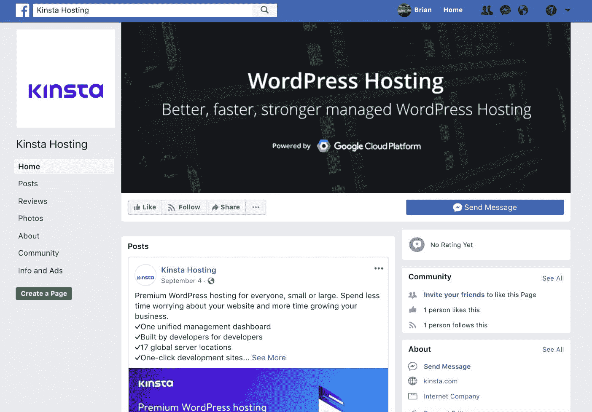

Facebook page trademark infringement (Page not created by Kinsta)

我们总是喜欢假定人们是无辜的。所以在这种情况下，我们给脸书页面的所有者发了信息，指示他们立即删除该页面。首先，它在 [Kinsta 附属条款](https://kinsta.com/legal/affiliate-terms/)中明确陈述了以下内容:

> 代销商不得在网址或在线广告中使用 Kinsta.com 或金士达的商标名称。

我们给了他们两个星期的时间来回复，但没有收到任何回复。当然，我们可以禁止他们加入我们的会员计划。然而，仅仅禁止它们是不够的，因为脸书页面仍然存在。下面，我们将与您分享为什么这样做是一个坏主意。

## 商标侵权脸书网页如何伤害你的品牌

起初，你可能不会认为放弃一个侵犯脸书·佩奇的商标是什么大不了的事情。然而，让我们向您展示它之所以重要的四个主要原因。这同样适用于所有的社交网络，不仅仅是脸书。

### 1.它出现在脸书的搜索结果中

正如你在下面看到的，这个人创建的脸书页面出现在搜索结果中。在我们的例子中，如果人们搜索“Kinsta”或“Kinsta hosting ”,这个人的页面就会出现，有时在我们的上面或下面。😠这太可怕了！如果有人专门搜索我们的公司，我们绝不希望潜在客户登陆不受我们控制的另一个页面。

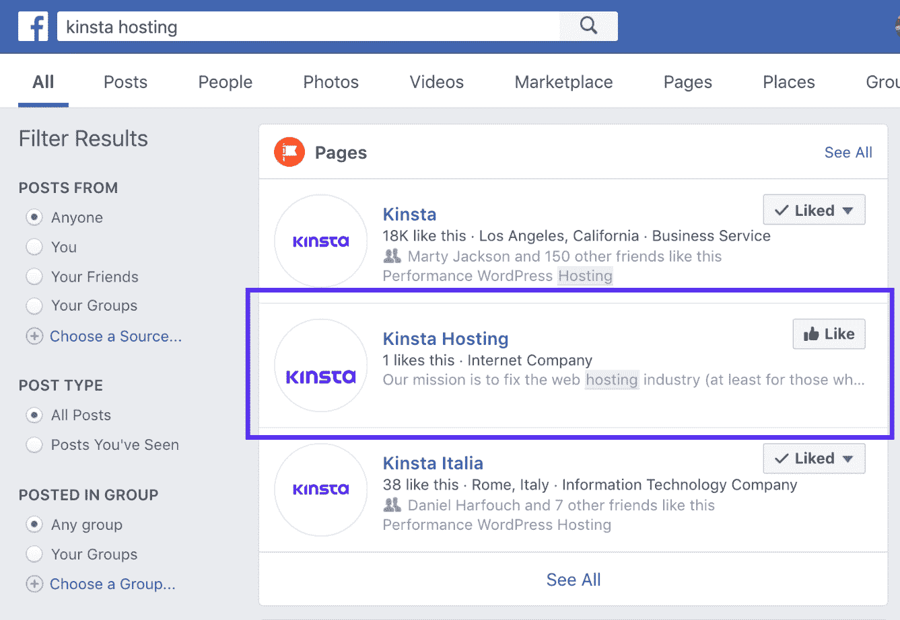

Facebook search results trademark

### 2.它在谷歌中被编入索引，并在 URL 中使用商标名称

脸书网页是在谷歌索引。这又是一种处理搜索结果的方法。如果有人在谷歌搜索你的脸书页面，你不希望别人出现。另一方面，它还在脸书网页的 URL 中使用了商标名称。当涉及到 URL 时，你应该尽可能地保护你的商标。

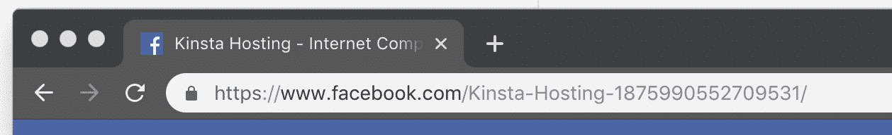

Facebook page URL trademark

### 3.当试图给你的品牌贴标签时，人们会感到困惑

标签功能被许多不同的社交媒体网络使用，包括脸书。基本上它是如何工作的，如果有人想让你看到他们分享的东西，他们会用@符号和你的品牌名称来标记你的公司。如果有人创建了额外的脸书网页来模仿你的品牌，人们可能会标记错误的网页，而你会完全错过这些提及。

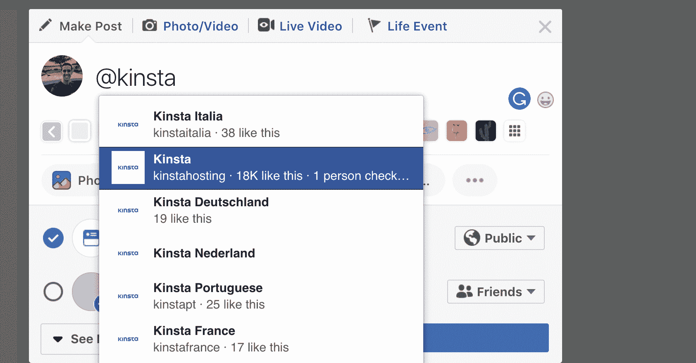

Facebook tagging

有时，当人们有问题时，他们也会给你贴标签。你最不想看到的就是他们给别人贴标签，而你却永远无法回应。如此简单的事情可能会让你失去一个客户。

### 4.您无法控制页面的内容或品牌

虽然有点显而易见，但你需要关闭这些页面的最后一个原因是，你将无法控制内容和品牌。以下是此人玷污我们品牌的几种方式:

*   他们上传了一个位置或大小不正确的徽标。
*   他们使用了两年多前的脸书页面横幅。
*   他们的页面没有评级。这立刻给人的印象是我们公司不是很大，或者没有得到客户的任何正面评价。
*   这个人分享的内容不是最新的，也不是我们在脸书通常使用的格式。

Facebook branding

现在你已经听到了一些你应该确保把这些页面拿下来的理由，让我们来看看到底该怎么做。

## 注册订阅时事通讯

### 想知道我们是怎么让流量增长超过 1000%的吗？

加入 20，000 多名获得我们每周时事通讯和内部消息的人的行列吧！

[Subscribe Now](#newsletter)

## 如何提交脸书商标侵权报告

脸书非常重视商标侵权，在我们提交的所有报告中，他们总是在 24 小时内删除令人不快的内容和/或页面。至少可以说令人印象深刻。

### 第一步

第一步是前往脸书，填写他们的[商标报告表](https://www.facebook.com/help/contact/trademarkform)。在表格中，他们给你以下选择:

*   我的账户被黑了
*   我无法访问以前管理的组或页面
*   我发现了一个伪装成我的虚假个人资料
*   我被欺负或骚扰
*   我发现不适当或侮辱性的内容
*   我想为我的生意申请一页
*   我发现了我认为侵犯我版权的内容
*   **我发现了我认为侵犯了我的商标**的内容(这就是我们在本例中使用的内容)

Content which infringes my trademark

正如您在上面看到的，该表单还可以用于版权投诉和其他问题。

### 第二步

第二步，填写你公司的联系方式。

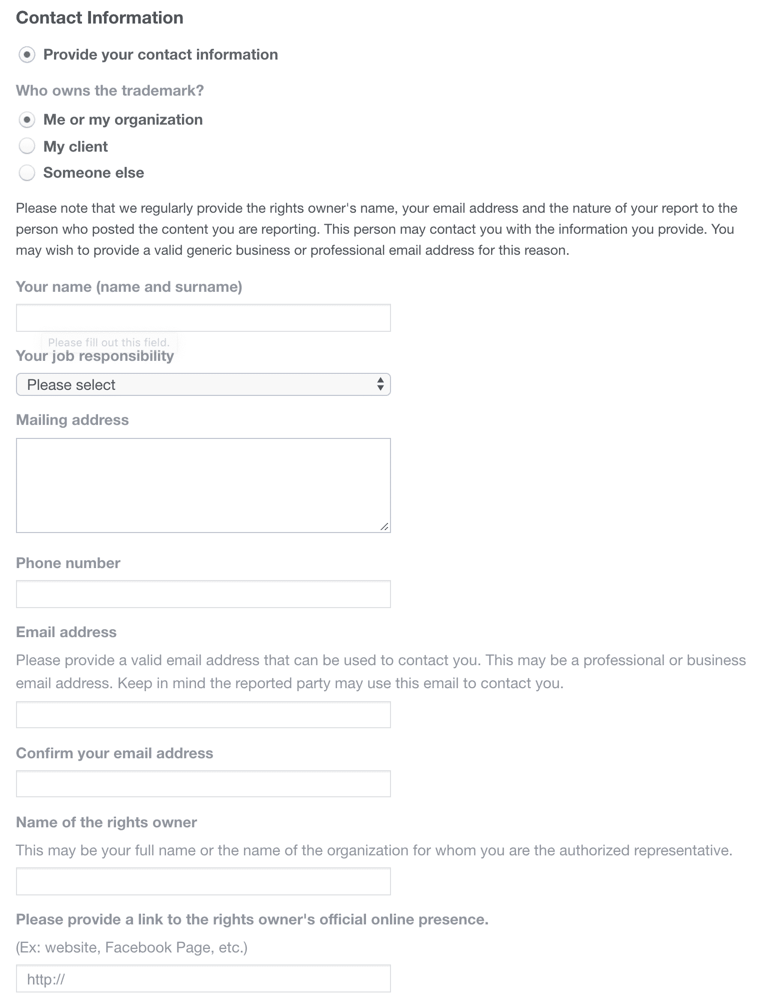

Facebook trademark infringement contact information

### 第三步

下一步是提供您的商标信息。请参见下文，了解如何找到您的商标信息。

Struggling with downtime and WordPress problems? Kinsta is the hosting solution designed to save you time! [Check out our features](https://kinsta.com/features/)

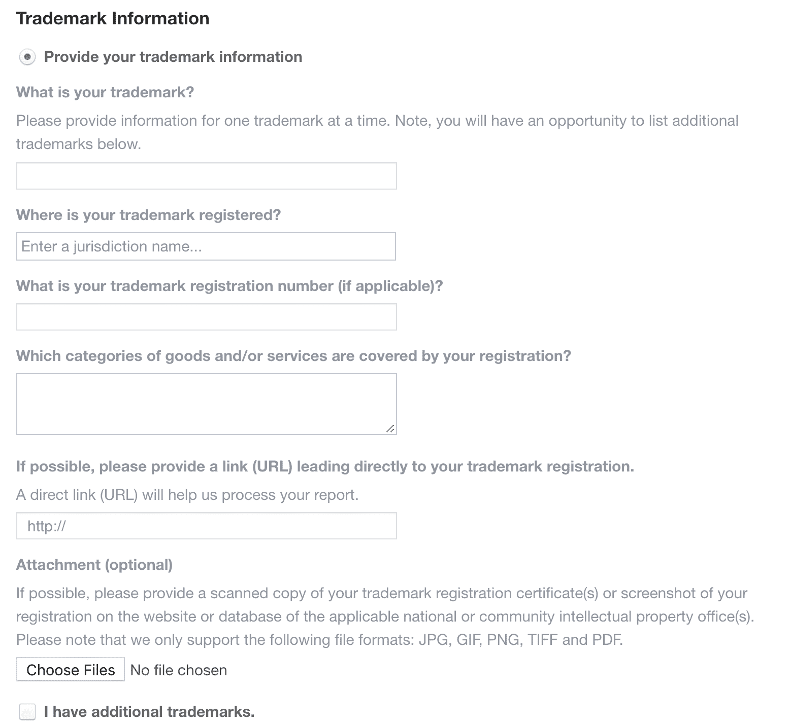

Facebook trademark information

有几个地方可以找到你的商标信息。这将取决于你的商标和公司注册地。如果你的商标是在美国注册的，它很可能会出现在美国专利商标局的商标数据库中。

在英国，可以使用 [GOV.UK](https://www.gov.uk/search-for-trademark) 。你也可以查看 [WIPO 全球品牌数据库](http://www.wipo.int/branddb)。否则，你可以在谷歌上快速搜索你自己国家的商标数据库。

在这个例子中，我们将使用 USPTO 商标数据库。要开始搜索，请点击菜单中的“商标”，然后点击“搜索商标数据库”

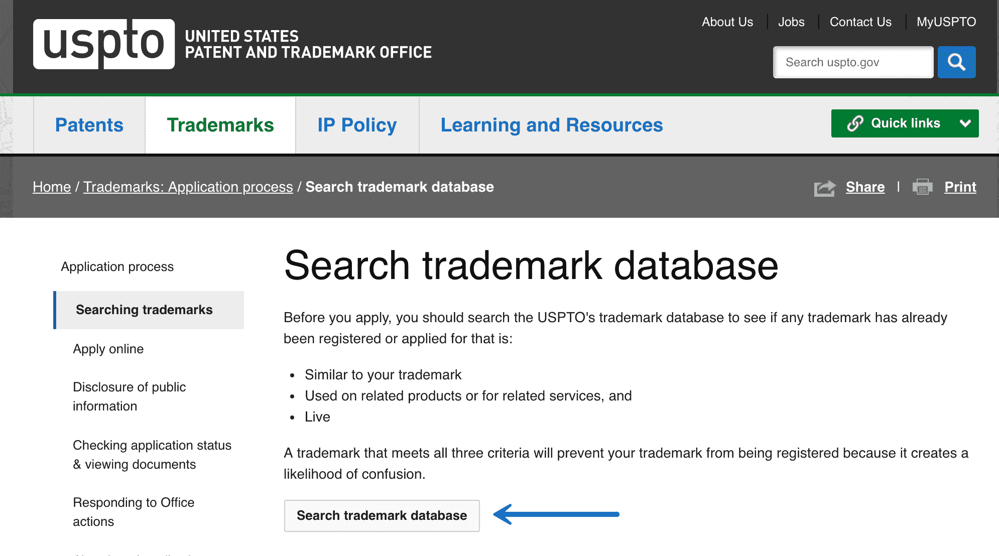

Search trademark database

点击“基本单词标记搜索(新用户)”的搜索选项。

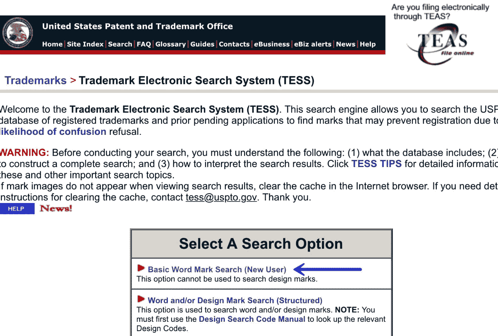

Basic word mark search

然后输入贵公司的品牌名称作为搜索词。然后，它将返回现有的商标。

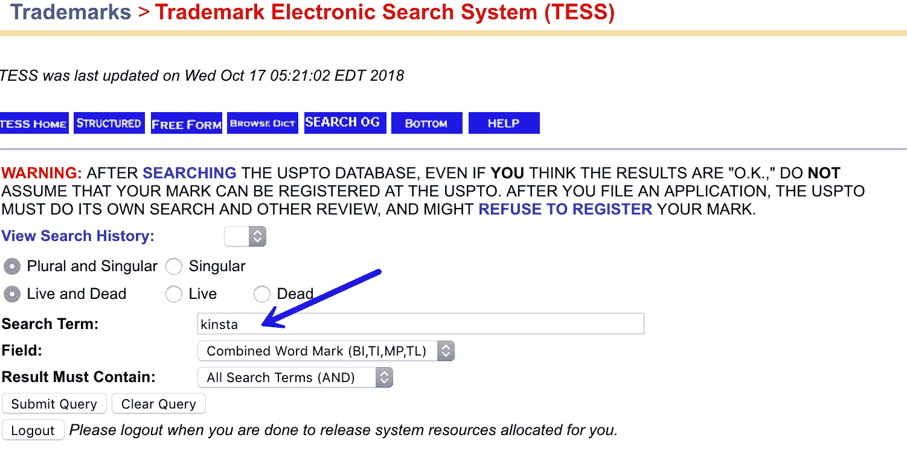

Trademark search term

在商标页，你会找到一个商标注册号码，你需要填写脸书表格。他们还为您提供了附加 PDF 或 PNG 商标页面的选项。我们建议这样做，因为我们发现一些在线商标数据库在直接链接到搜索结果方面不能正常工作。

### 第四步

在最后一步，脸书将询问您想要报告的内容的位置。在这种情况下，它是“整个页面、组或简档”只需复制并粘贴页面的 URL。

点击提交按钮后，你会收到一封来自脸书的电子邮件，其中附有报告#并确认他们会调查你的情况。

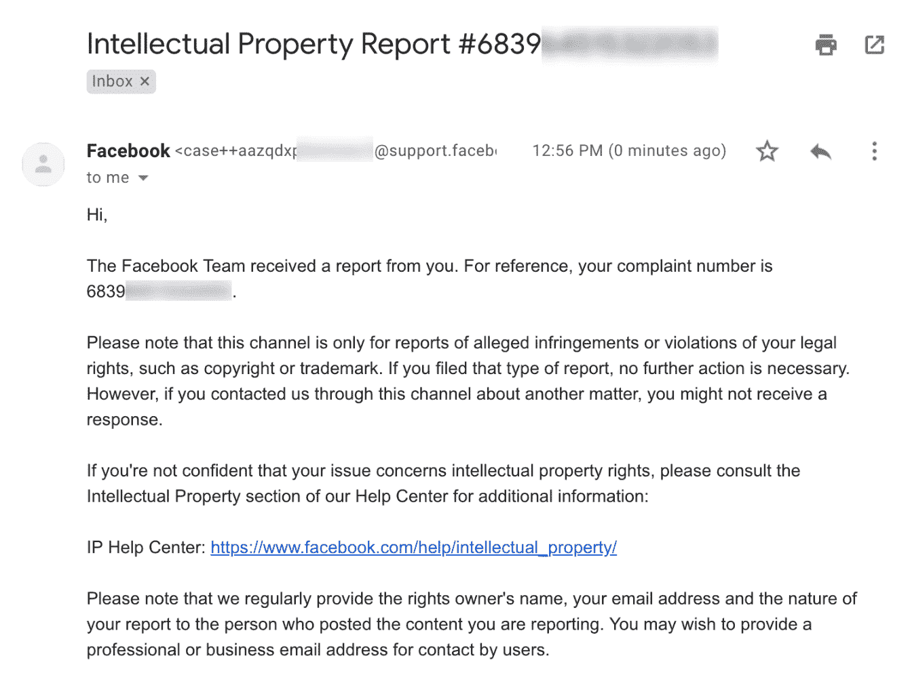

Facebook intellectual property report

我们已经提交了多份商标侵权报告，脸书总是在 24 小时内做出回应，并删除违规页面。相比其他类似商标侵权举报的网络，脸书确实是最快的之一！

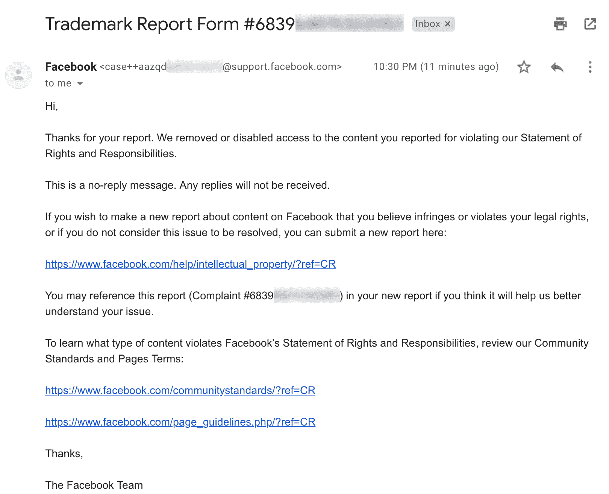

Trademark removal success Facebook

内容被拿下后会怎么样？它将不再可访问，并将显示以下消息:“对不起，此内容现在不可用。”一旦你看到这个，它已经从脸书搜索结果中删除，不再是可标记的。几天后，它将从谷歌的索引中消失。

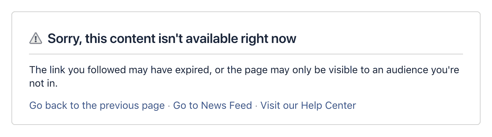

Facebook trademark page removed

## 摘要

我们的建议是，你不应该忽视商标侵权。他们玷污你的品牌，迷惑潜在客户。谢天谢地，脸书让举报商标侵权变得超级简单！只需几个简单的步骤，您就可以立即删除不良内容或页面。

你是否处理过脸书商标侵权或个人假冒你的品牌？我们希望在下面的评论中听到你对这个话题的想法。

* * *

让你所有的[应用程序](https://kinsta.com/application-hosting/)、[数据库](https://kinsta.com/database-hosting/)和 [WordPress 网站](https://kinsta.com/wordpress-hosting/)在线并在一个屋檐下。我们功能丰富的高性能云平台包括:

*   在 MyKinsta 仪表盘中轻松设置和管理
*   24/7 专家支持
*   最好的谷歌云平台硬件和网络，由 Kubernetes 提供最大的可扩展性
*   面向速度和安全性的企业级 Cloudflare 集成
*   全球受众覆盖全球多达 35 个数据中心和 275 多个 pop

在第一个月使用托管的[应用程序或托管](https://kinsta.com/application-hosting/)的[数据库，您可以享受 20 美元的优惠，亲自测试一下。探索我们的](https://kinsta.com/database-hosting/)[计划](https://kinsta.com/plans/)或[与销售人员交谈](https://kinsta.com/contact-us/)以找到最适合您的方式。