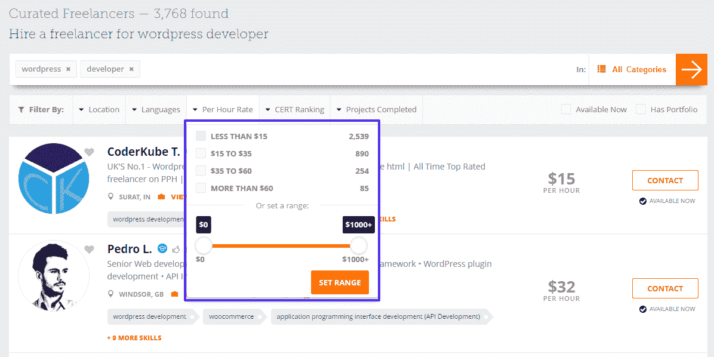
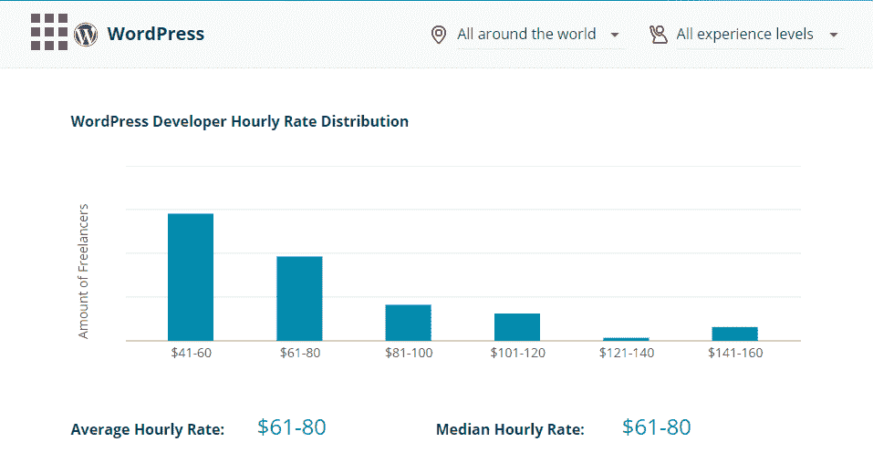
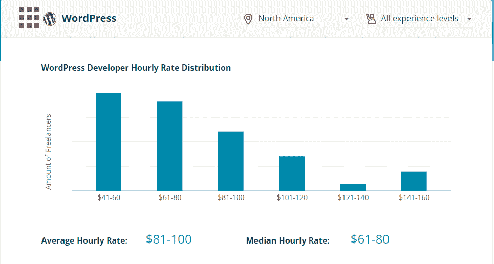

# WordPress 开发者工资:平均水平，加上如何增加你的

> 原文:[https://kinsta.com/blog/wordpress-developer-salary/](https://kinsta.com/blog/wordpress-developer-salary/)

对于一些人来说，薪水可能是一个禁忌话题，但是如果你是一个 WordPress 开发者，或者正在考虑从事 WordPress 开发，了解人们的收入对于最大化你的收入能力是至关重要的。

所以让我们来谈谈这个秘密——让我们来谈谈 WordPress 开发者的平均工资。这样，你就会确切地知道自己的价值(以及如何挣得更多)。

为了完全公正地对待这个话题，我们将这篇文章分成两部分。

首先，我们来看看来自求职网站和自由职业平台的数据，了解一下:

*   [全职工作的 WordPress 开发者的平均工资](#average-wordpress-developer-salary)
*   【WordPress 开发者自由职业者的工资是多少
*   【WordPress 开发者如何与其他开发者(Drupal 或 Joomla)竞争

然后，在我们讨论了平均值之后，我们将讨论一些增加你自己薪水的[小贴士](#increasing-salary)，这样你就可以向薪水钟形曲线的右侧移动。

但首先，有一点需要注意的是…

### 查看我们的[视频指南](https://www.youtube.com/watch?v=YbOCpNGw1Mc)成为一名网页开发者

<kinsta-video src="https://www.youtube.com/watch?v=YbOCpNGw1Mc"></kinsta-video>

## 计算一个“WordPress 开发者的薪水”是很难的

有几件事可能会扭曲这些数字。首先，因为 WordPress 是如此受欢迎(目前超过 32%的网站使用了[),有很多人可能会被贴上“WordPress 开发者”的标签。](https://kinsta.com/wordpress-market-share/)

<link rel="stylesheet" href="https://kinsta.com/wp-content/themes/kinsta/dist/components/ctas/cta-mini.css?ver=2e932b8aba3918bfb818">

> 需要在这里大声喊出来。Kinsta 太神奇了，我用它做我的个人网站。支持是迅速和杰出的，他们的服务器是 WordPress 最快的。
> 
> <footer class="wp-block-kinsta-client-quote__footer">
> 
> 
> 
> <cite class="wp-block-kinsta-client-quote__cite">Phillip Stemann</cite></footer>

[View plans](https://kinsta.com/plans/)

例如，WordPress 的“开发者”和“实现者”是有区别的。

开发人员是直接处理代码和构建解决方案的人，而实现人员更多的是将这些解决方案转化为面向客户的网站。

但是对很多人来说，他们都被认为是“WordPress 开发者”，尤其是在自由职业方面。

然后，让事情更复杂的是，你有了 [WordPress](https://kinsta.com/knowledgebase/what-is-wordpress/) 的全局性质。世界各地都有开发人员和自由职业者，这意味着地理位置将在平均值中发挥重要作用，尤其是当涉及到自由职业者的费率时。

基本上，有很多东西会扭曲平均值，所以当你看数据时要记住这一点。

[Want to be a WordPress developer? Here's the average salary + freelance rates. 💰Click to Tweet](https://twitter.com/intent/tweet?url=https%3A%2F%2Fbit.ly%2F2ZA9QNQ&via=kinsta&text=Want+to+be+a+WordPress+developer%3F+Here%27s+the+average+salary+%2B+freelance+rates.+%F0%9F%92%B0&hashtags=freelancing%2Cwebdev)

## 关于 WordPress 开发者的平均工资，工作网站是怎么说的

在第一部分，我们从流行的工作网站上收集了 WordPress 开发者的工资数据。

对于所有这些网站，我们使用整个美国的平均值。显然，其他国家，甚至特定的美国州，会与这个平均值有所不同:

*   **玻璃门**68224 美元([来源](https://www.glassdoor.com/Salaries/wordpress-developer-salary-SRCH_KO0,19.htm)
*   **的确是**——每小时 59987 美元或 28.84 美元([来源](https://www.indeed.com/salaries/Wordpress-Developer-Salaries)
*   zip recruiter71019 美元([来源](https://www.ziprecruiter.com/Salaries/PHP-Wordpress-Developer-Salary)
*   WordPress 网站开发人员的薪资水平为 50，447 美元([来源](https://www.payscale.com/research/US/Skill=Wordpress/Salary)
*   简单雇佣——62164 美元([来源](https://www.simplyhired.com/salaries-k-wordpress-developer-jobs.html)
*   **纽沃**——68250 美元([消息来源](https://neuvoo.com/salary/?job=Wordpress+Developer)

把这些数字放在一起，你会得到整个美国全职 WordPress 开发者的平均工资为 63，348 美元。这与前端、后端或全栈开发人员相比如何？以下是不同类型的开发人员的[薪资数字。](https://kinsta.com/blog/web-developer-salary/)

## 关于 WordPress 开发者自由职业者的费用，数据说明了什么

很多 WordPress 开发者是自由职业者，而不是全职员工。

在这里，我们将从一些流行的自由职业者市场收集数据。

与全职工资不同，这里不一定只有一个平均值。相反，我们会找到每个平台上大多数自由职业 WordPress 开发者的范围。

此外，这些数字是全球性的，因为大多数自由职业网站都有大量来自世界各地的自由职业者。

### 一般市场上 WordPress 开发者自由职业者的价格

我们所说的“一般”是指大型自由职业市场，如:

*   向上工作
*   自由记者
*   每小时的人数
*   等等。

任何人都可以注册，对于谁可以自称为 WordPress 开发者并没有真正的审查过程。

我们这里有两个数据点…

首先，根据 Upwork 的一篇文章[，WordPress 平台上自由职业开发者的平均收费从**20 美元到 100 美元**不等。](https://www.upwork.com/hiring/for-clients/how-much-does-it-cost-to-hire-wordpress-developer/)

第二，我们研究了每小时的人数，这是自由职业者收费的有用分类:

WordPress developer salary at People Per Hour

3768 名自由职业者参与了“WordPress 开发者”关键词搜索，下面是他们的比例:

*   67%的费用**低于每小时**15 美元 **。**
*   24%的费用 **$15 到$35 每小时**。
*   7%的费用 **$35 到$60 每小时**。
*   每小时 60 美元以上收取 2%费用**。**

 **### 专业自由职业者市场

上述数字在一般的自由职业市场上看起来并不太热门。事实上，我们不得不同意布丽奇特的观点，它们太可怕了！😞然而，如果你看看专门的自由职业者市场，他们会变得更好一点。

与 Upwork 或每小时人数的开放性不同，这些市场在允许自由职业者开始找工作之前需要进行测试。

因此，他们更难进入。但是如果你通过了测试，价格看起来会好很多。

首先，有**可编码**。你在 Codeable 上得到的绝对**最低**价格是**每小时**60 美元。Codeable 说他们的价格通常是每小时 60 到 90 美元。

其次，还有 **CodementorX** ，这里[的平均和中间值](https://www.codementor.io/freelance-rates/wordpress-developers) WordPress 开发者的小时工资是**每小时 61 美元到 80 美元**全球范围内:

CodementorX freelance rates globally

或者，如果你将搜索范围限制在北美，平均值就变成了 **$81 到$100 每小时**(你可以看到收费 141 美元以上的人的上升，这使得平均值上升):

CodementorX freelance rates in North America

希望你看到这里的图片！下一节将详细介绍这一点…

## WordPress 开发人员的工资与 Drupal 和 Joomla 开发人员的工资

关于这些工资数字，有一个令人悲伤的事实:

在主要开源内容管理平台的开发者中(*或一般的网络开发*)，WordPress 的开发者经常处于底层。

WP Site Care 的 Ryan Sullivan 很好地总结了这一点(整个 Tweet 链值得一读):

> 有意思。将“WordPress”添加到几乎所有的开发职位搜索中，你会发现薪水神奇地下降了 30%。有什么想法吗为什么？
> 
> —瑞安·唐·沙利文·⤴️(@ ryandonsullivan)[2014 年 7 月 14 日](https://twitter.com/ryandonsullivan/status/488519912277557248?ref_src=twsrc%5Etfw)**