# 如何快速有效地建立电子邮件列表(行之有效的策略)

> 原文：<https://kinsta.com/blog/how-to-build-an-email-list/>

有没有比周一早上的邮件叙旧更古老的拖延方法？或者，仅在 2017 年就有[37 亿电子邮件用户](http://www.leightoninteractive.com/blog/2018-most-insightful-email-marketing-statistics)，更广泛？

但是电子邮件不仅仅是用来打发星期一的。更有利于营销。考虑一下:在 122% 的平均投资回报率**下，电子邮件营销号称[比其他营销策略的回报率](https://www.business2community.com/email-marketing/email-marketing-statistics-guide-email-strategy-2018-01984125)高出四倍多。**

这就是营销机构 Promodo 在帮助 Shokosmile(一家所有巧克力产品的在线零售商)将他们的电子邮件转变为一个几乎和他们的产品一样甜蜜的成熟销售渠道时发现的。准确地说，销售额增长了 2100%,转化率增长了 5-10%。

你可以从同样的糖衣成功中获利。因为就像巧克力一样，成功的电子邮件营销就像找到最好的配料并在恰当的时间组合它们一样简单。换句话说，这一切都归结为建立你的电子邮件列表。

[Email lists boast incredible ROI and are the bread-and-butter for successful marketing. 🍞Click to Tweet](https://twitter.com/intent/tweet?url=https%3A%2F%2Fkinsta.com%2Fblog%2Fhow-to-build-an-email-list%2F&via=kinsta&text=Email+lists+boast+incredible+ROI+and+are+the+bread-and-butter+for+successful+marketing.+%F0%9F%8D%9E&hashtags=emailmarketing%2CCRO)

但是如果你不确定从哪里开始，不要担心。在本帖中，我们将为你提供快速扩充邮件列表的可行方法，包括:

*   [创建用户友好的捕获表单](#email-list-capture-forms)
*   [使用赠品来建立即时名单](#email-list-giveaways)
*   [进行磁性含量升级](#content-upgrades)
*   [利用社交媒体促进社区发展](#social-media)

事不宜迟，让我们深入讨论一下捕获表单。

## 创建用户友好的捕获表单

询问某人的电子邮件地址很像邀请某人参加舞会。如果太过强势，他们会逃之夭夭。弄得太微妙，他们不会注意到你在问。

> Kinsta 把我宠坏了，所以我现在要求每个供应商都提供这样的服务。我们还试图通过我们的 SaaS 工具支持达到这一水平。
> 
> <footer class="wp-block-kinsta-client-quote__footer">
> 
> 
> 
> <cite class="wp-block-kinsta-client-quote__cite">Suganthan Mohanadasan from @Suganthanmn</cite></footer>

[View plans](https://kinsta.com/plans/)

在最简单的情况下，你可以使用[页面上的小部件](https://kinsta.com/blog/wordpress-widgets/)进行询问。在他们的主页的内容之间，看看百胜三明治[是如何夹在中间的。](https://pinchofyum.com/)

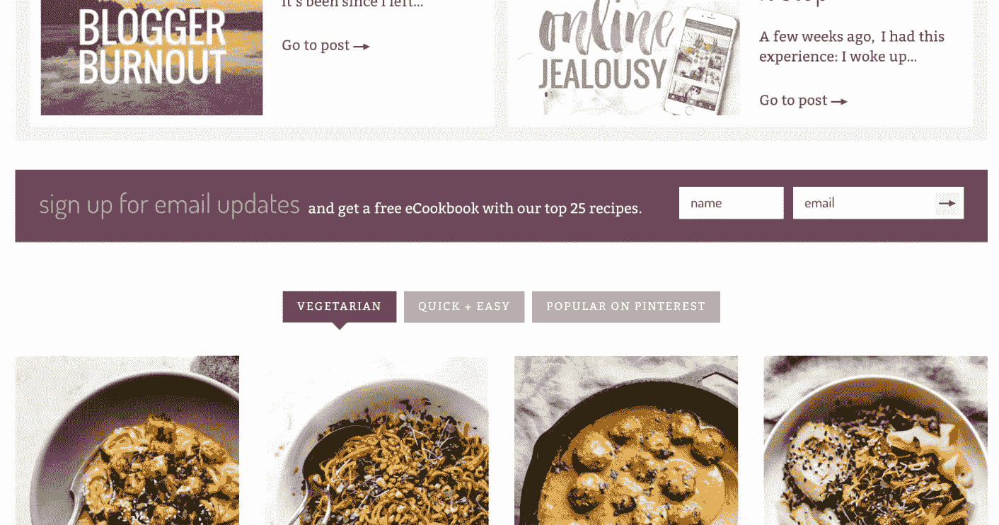

Pinch of Yum email capture form

我们在 Kinsta 上使用了类似的方法，在我们的主博客页面上用询问框散布我们的内容。

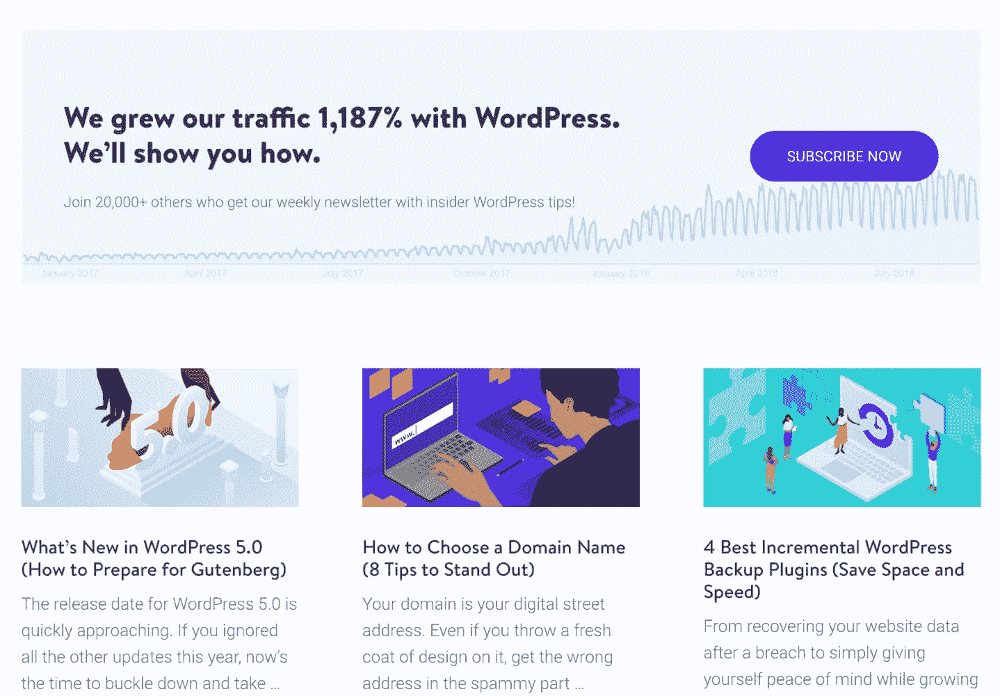

Kinsta email capture form

我们还将它嵌入到我们的博客文章中，正如你可以在我们最近的一篇关于 T2 的文章中看到的，WordPress 5.0 的新特性。我们的内部开发人员对它进行了编程，使它在一定数量的段落之后显示出来。如果您已经订阅，您将看不到 CTA 框。

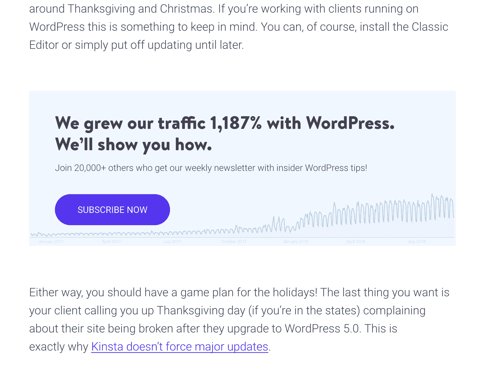

Kinsta blog post email capture form

如果你喜欢一种比传统的询问框更具互动性的方法来产生销售线索，你可以用弹出窗口和标题部件来增加趣味性。但是为了最好的结果？考虑将它们结合在一起。

Buffer 就是这么做的。在他们的网站上添加多种注册表格帮助他们的订户数量增长到原来的两倍——所有这些都是在一个月内完成的。

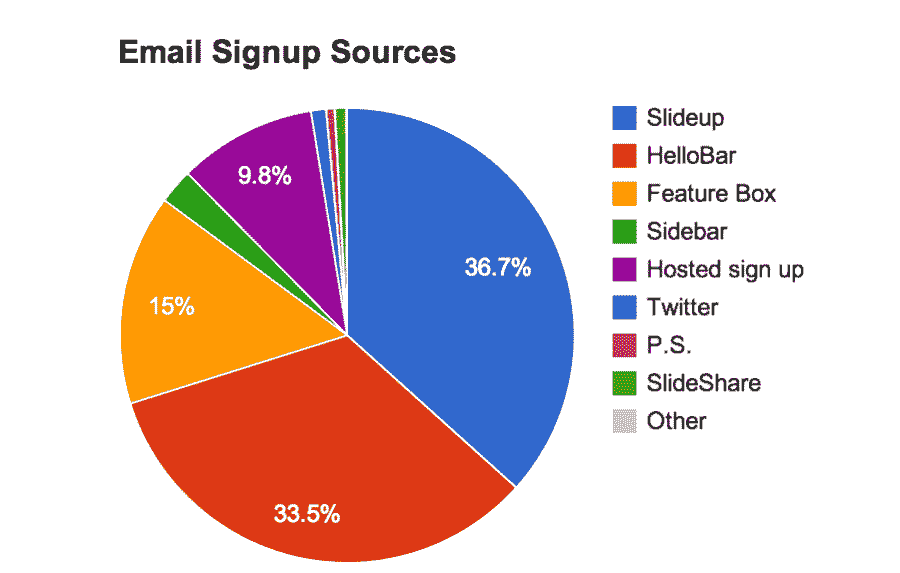

Email signup sources (Image source: Buffer)

因此，将多种类型的注册表单组合在一起是成功的不二法门。但是，在我们深入研究不同类型的弹出窗口和[工具之前，您可以使用](https://kinsta.com/blog/wordpress-lead-generation/)，这是一个关于中间程序的快速注释。

被认为是[中断营销](https://www.marketingterms.com/dictionary/interstitial/)的一种形式，间隙是任何一个页面或弹出窗口，它通过显示内容或中断内容，对用户访问内容的路径形成障碍。用户别无选择，只能在继续之前与显示器进行交互。《福布斯》是“前”间质(也被称为“前间质”)的一个典型例子[。](https://searchengineland.com/google-hates-obnoxious-pop-ads-heres-need-look-ads-site-280970)

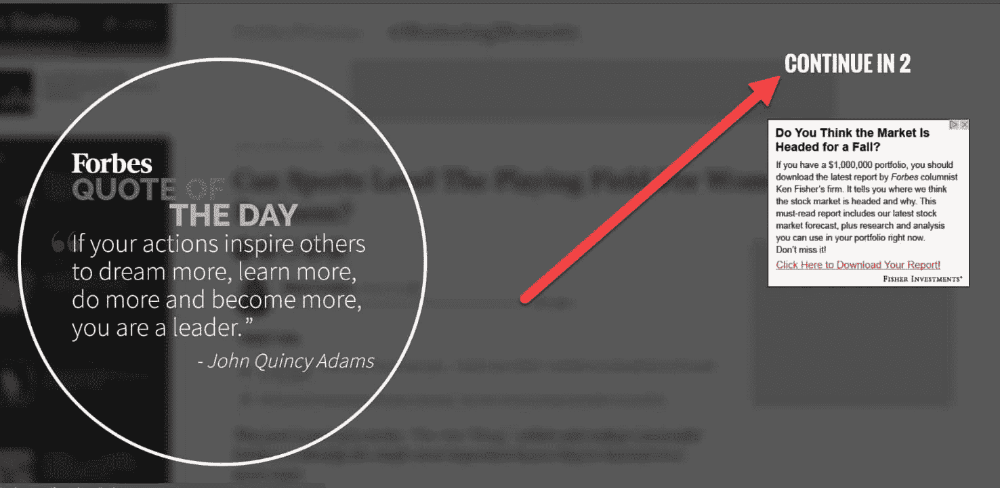

Prestitial (Image source: Search Engine Land)

作为一个最佳实践，避免这些像周日早午餐高峰。谷歌将削弱任何被其标记为具有这些侵入性形式的网站的排名。也就是说，对于任何想保持或提高搜索引擎地位的人来说，下面这些都是大忌。

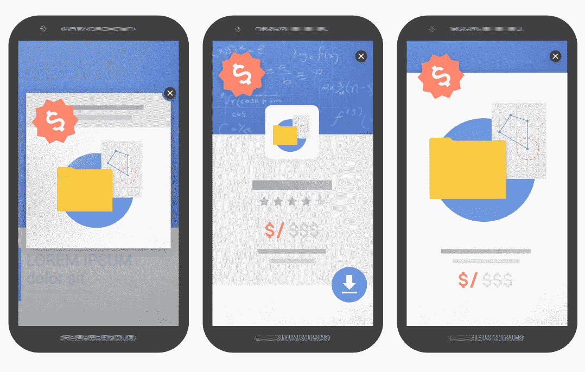

Interstitials (Image source: Google Webmaster Blog)

请注意，虽然这一变化是专门为移动版本的网站推出的，但谷歌已经将所有内容转移到了移动优先的索引中，因此这对所有网站都很重要。

如果这还不足以说服你把插播广告扔进垃圾箱，不再回头看，还有一个事实是，用户报告这些互动是他们最讨厌的广告行为之一(在尼尔森诺曼集团的这项研究中定义为“情态动词”)。在 1 到 7 的范围内，桌面用户和移动用户的情态动词得分分别为 5.82 和 5.89，甚至超过了最可怕的广告类型的自动播放视频。

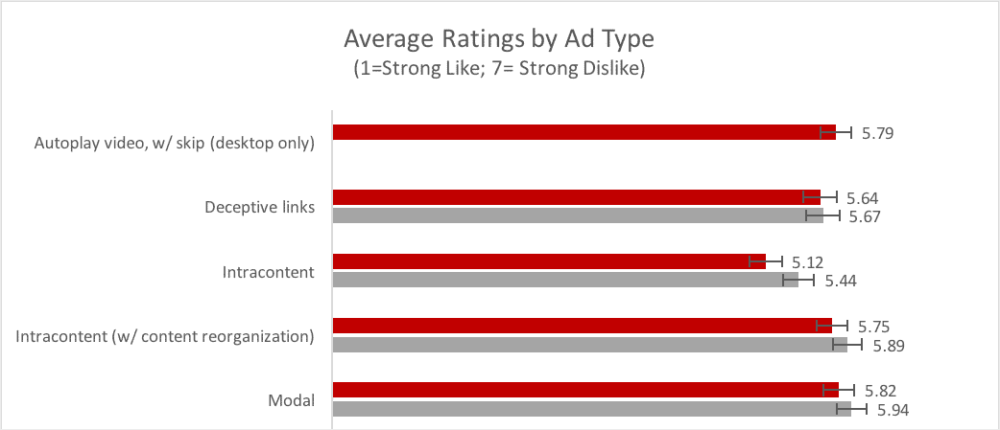

Ad type ratings (Image source: Nielsen Norman Group)

说完这些，让我们快速浏览一下一些非常有效的注册表单选项。首先是**迎宾席**。

这可能是一个有争议的话题，因为许多人会认为这是一个间隙。有些人可能不喜欢这种方法，因为它可能不是最用户友好的。然而，如果做得正确，他们可以有一些严重的注册权力。在线学习管理系统 Fedora，现在更名为 Teachable，[在其主页上部署了这一策略](https://sumo.com/stories/welcome-mat-fedora),以增加促销网络研讨会的注册人数。

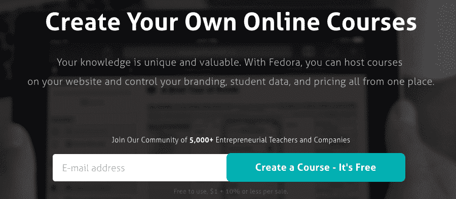

Welcome mat

结果是 ***短短五天**涨幅 **70.37%。因此，如果你想在比新一集《权力的游戏》播出时间更短的时间内将你的电子邮件列表增加一倍，迎宾垫绝对是一个值得考虑的选择。然而，如果你担心[谷歌弹出窗口的惩罚](https://kinsta.com/blog/google-mobile-popup-penalty/)，你可能想要谨慎行事，只在桌面设备上启用这种方法。***

如果你有兴趣在你的网站上设置这个插件，[Thrive Leads 插件](https://thrivethemes.com/leads/)是一个很好的选择，一次性许可费为 67 美元。

现在，我们换个话题，谈谈**浮动条**。这些注册表单悬浮在网页上方或下方，随着用户滚动而“浮动”。American Eagle 使用页面底部的浮动栏来创建一个[不显眼但无处不在的注册点](https://www.ae.com/)。

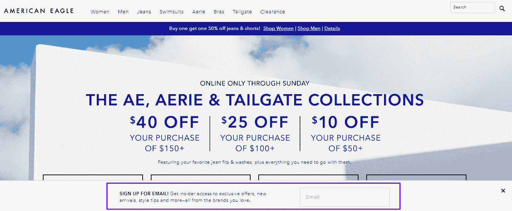

American Eagle floating bar email capture form

只是这些低调的形式效果如何？使用浮动条奖励 ActiveCampaign，每月有 800 个新的免费试用注册。

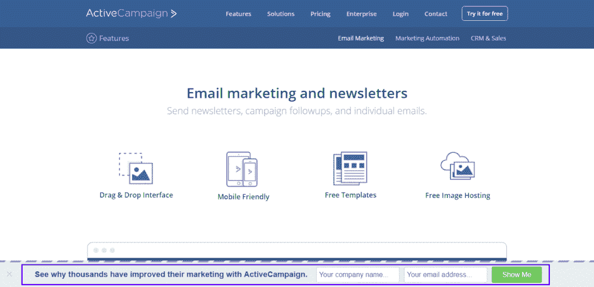

ActiveCampaign floating bar email list

所以简而言之，答案是“非常有效。”要在你的 WordPress 站点上免费添加一个浮动注册栏，[查看弹出制作插件](https://wordpress.org/plugins/popup-maker/)。

恰当地结束我们对选择加入表单的讨论是退出意图弹出窗口。顾名思义，当用户表现出想要离开页面的行为时，这些弹出窗口就会出现。退出意图的触发可以是鼠标快速移动到屏幕的右上角(关闭按钮通常在那里)，点击页面外的链接，设置一个定时器，或者在滚动时激活。

这里有一个特别准确的例子，是我们自己的一个登陆页面实验中的退出意图。请注意，您可以轻松地将它用于电子邮件捕获。在我们的例子中，[将流量导向计划页面](https://kinsta.com/blog/how-to-drive-traffic-to-your-website/)更有意义。

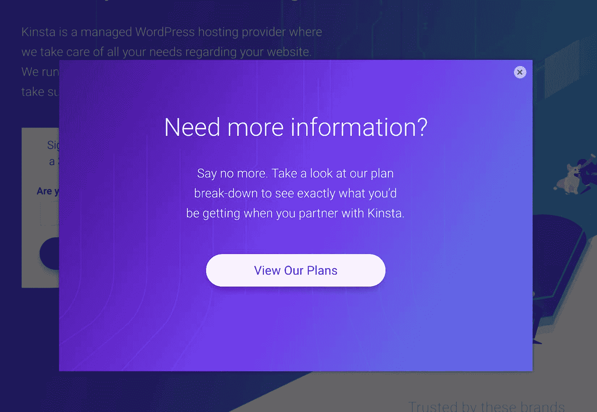

Exit intent

由于这些弹出窗口只有在用户与他们想要的内容交互后才会出现，因此它们不像其他形式的全页面或覆盖弹出窗口那样具有侵扰性。他们也相当成功。

一个恰当的例子是，使用退出意向覆盖帮助华尔街将时事通讯的注册人数[增加了 279%](https://blog.omniconvert.com/exit-intent-website-overlay-examples-case-studies.html) 。

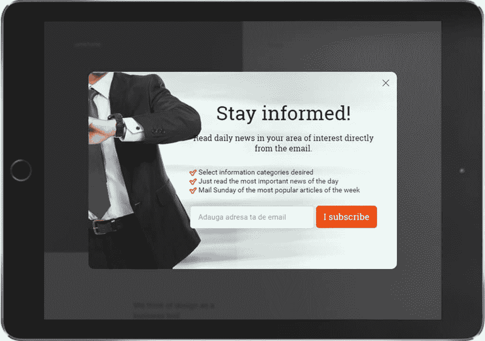

Exit intent newsletter (Image source: omniconvert)

由于《华尔街》是一份被吹捧为全球最大读者群之一的在线商业出版物，279%的增长是他们众所周知的——和金融——资本中的一大亮点。像 [Hotjar](https://www.hotjar.com/) 这样的工具非常适合这个。

但是如果你喜欢一种比插件更实用的方法来构建你的捕获表单，Sleeknote 是一个很好的解决方案，它免费试用，直观，并且易于与你的 WordPress 站点集成。首先，请跳到 [Sleeknote](https://sleeknote.com/) 。

单击两个紫色按钮中的一个，开始并完成注册流程。不需要任何信用卡，所以只需要一分钟就可以完成。

[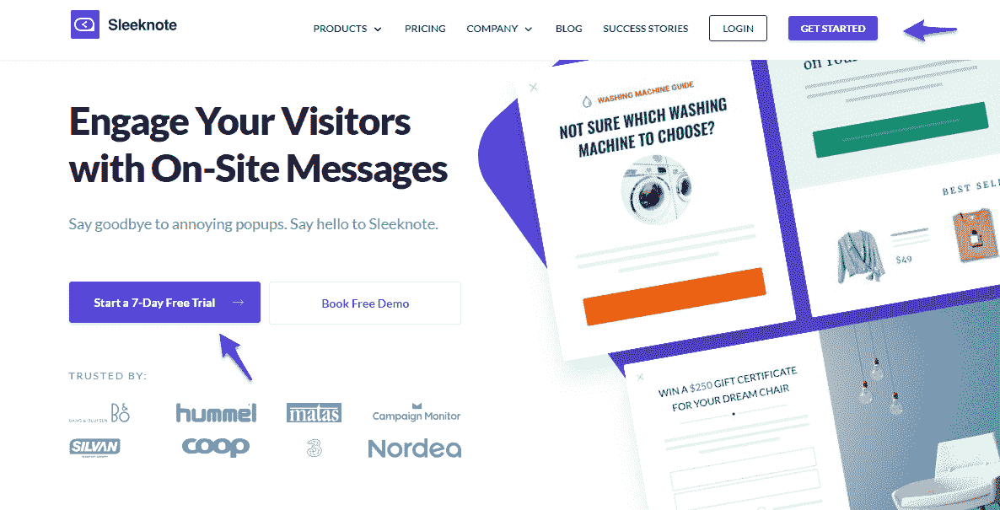](https://sleeknote.com/)

Sleeknote

接下来，输入您想要为其构建电子邮件捕获表单的网站，然后单击“使用此网站”

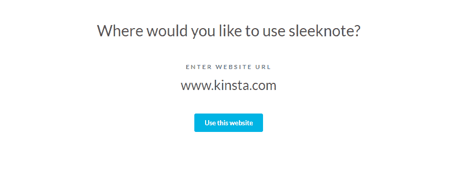

Sleeknote website

之后，选择最符合您需求的选项。对于我们的目的，选择第一个，“收集电子邮件地址”，并点击选择。

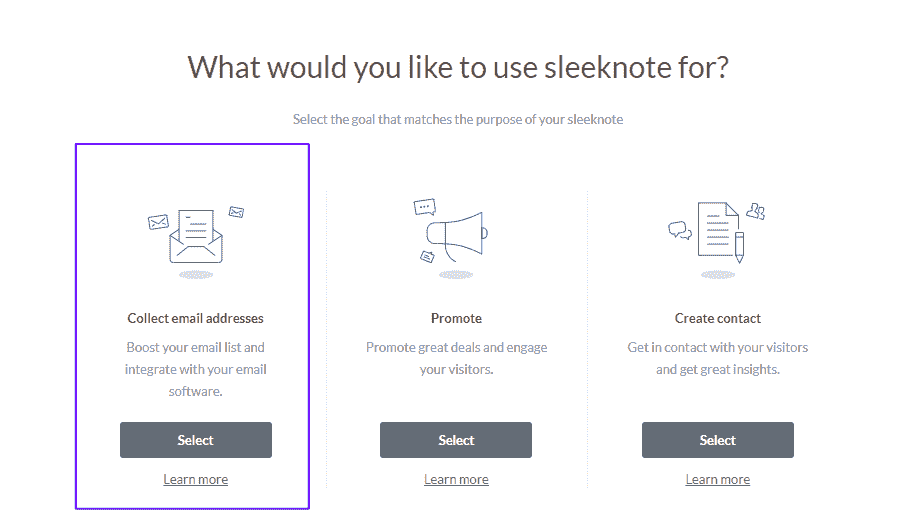

Sleeknote collect email addresses

从那里，您将被带到模板页面。目前有 21 个现成模板可供选择，4 个空白模板。让我们看看下面突出显示的浮动栏选项。

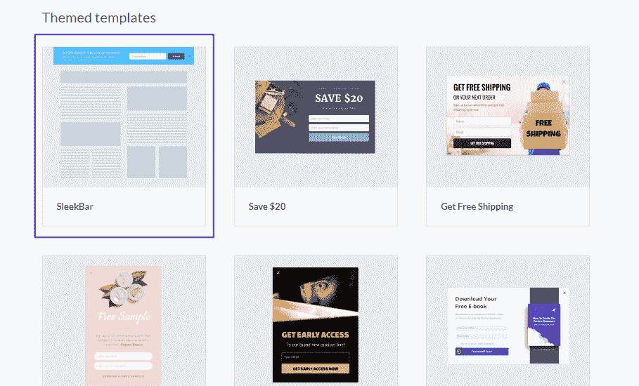

Sleeknote templates

选择模板后，您将被要求选择浮动栏的位置。

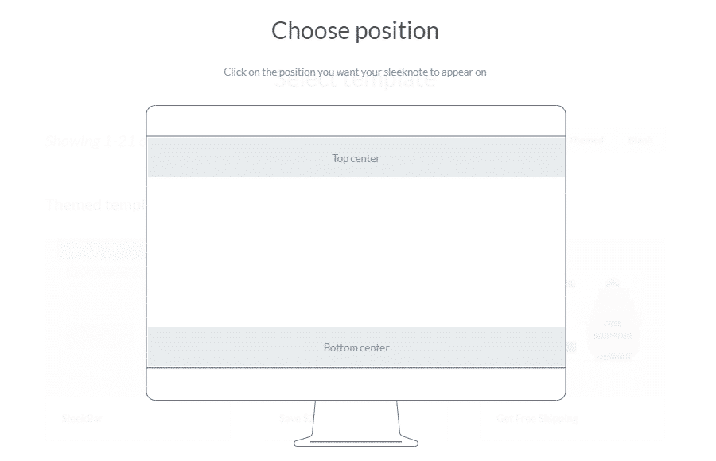

Sleeknote position

这里没有真正的正确或错误的选择，所以选择最适合你的网站，并继续点击。接下来，您将被带到编辑仪表板。

当你点击单个元素时，侧边菜单会改变并允许你定制你的浮动栏。

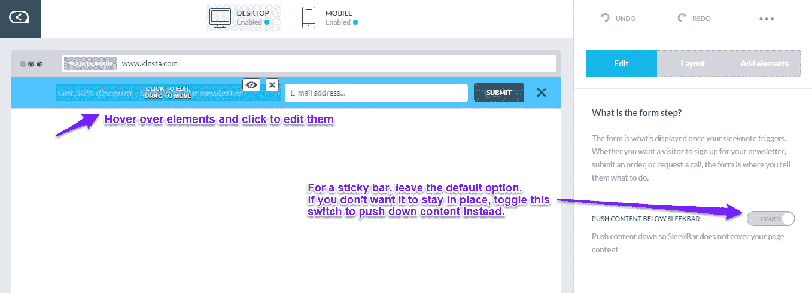

Sleeknote customize floating bar

这是我们做了一些定制后的样子。

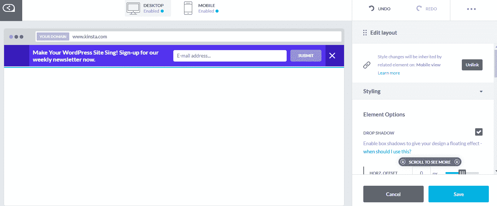

Sleeknote floating bar

满意后，点击页面底部的“下一步”。如果你想在用户输入他们的电子邮件地址后改变小部件，你将被带到一个“成功”屏幕。现在，让它禁用，并继续点击。

在最后一页，你将被要求命名你的 Sleeknote，并给出选项来改变显示规则，与电子邮件软件集成，并设置你的目标。

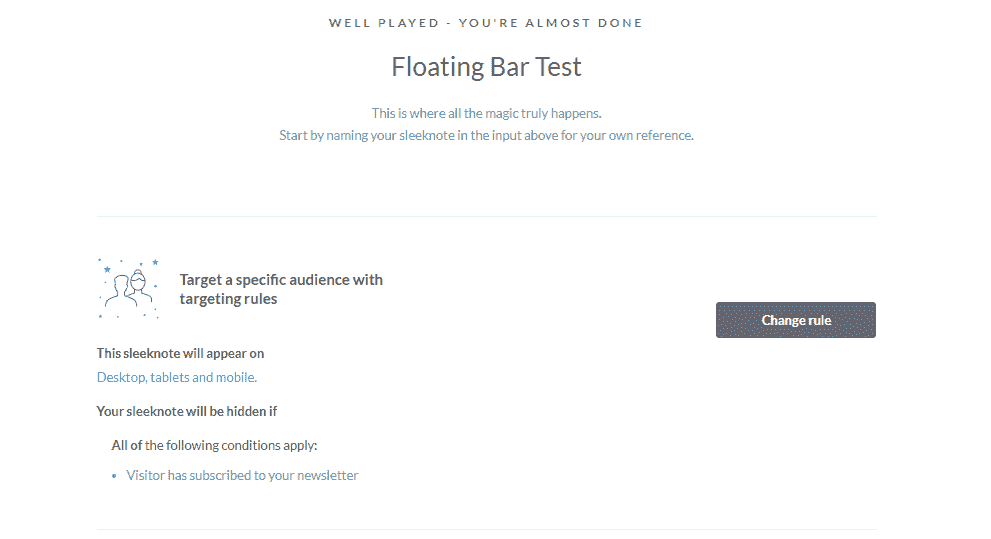

Sleeknote rules

现在你需要做的就是点击底部的“保存”,进入下一个屏幕，获得一个复制粘贴代码，将你的 Sleeknote 添加到你的网站上。查看我们关于如何[添加代码到你的 WordPress 标题](https://kinsta.com/knowledgebase/add-code-wordpress-header-footer/)的一步一步的教程。

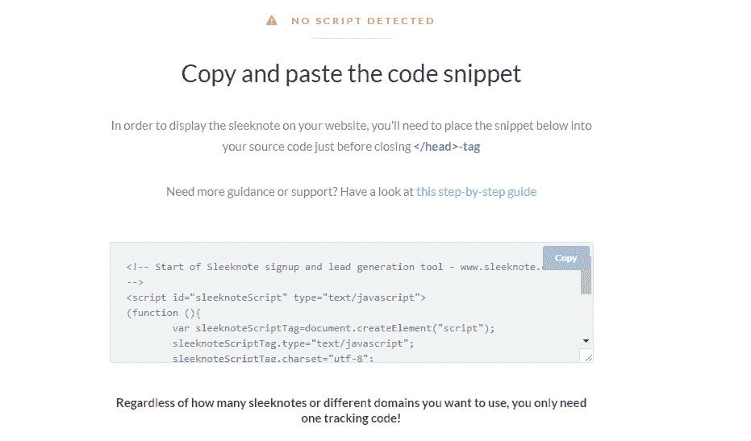

Sleeknote code

之后，如果你想编辑你的浮动栏或者跟踪它的进度，你可以通过“[我的 Sleeknotes](https://dashboard.sleeknote.com/mysleeknotes) ”选项来访问它。

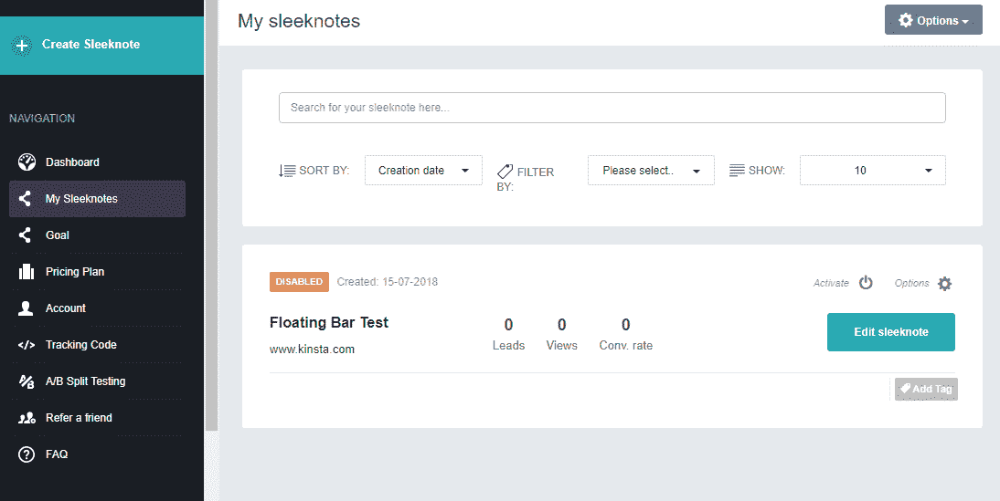

Sleeknote dashboard

就这么简单。要想获得更多将注册表单整合到你的网站的好方法，请查看我们最喜欢的潜在客户插件列表。

别忘了创建一个简单的重新订阅表格。如果你有创意(下面 clickup 的例子很好)，你可能会让一些用户选择退订你的邮件列表。

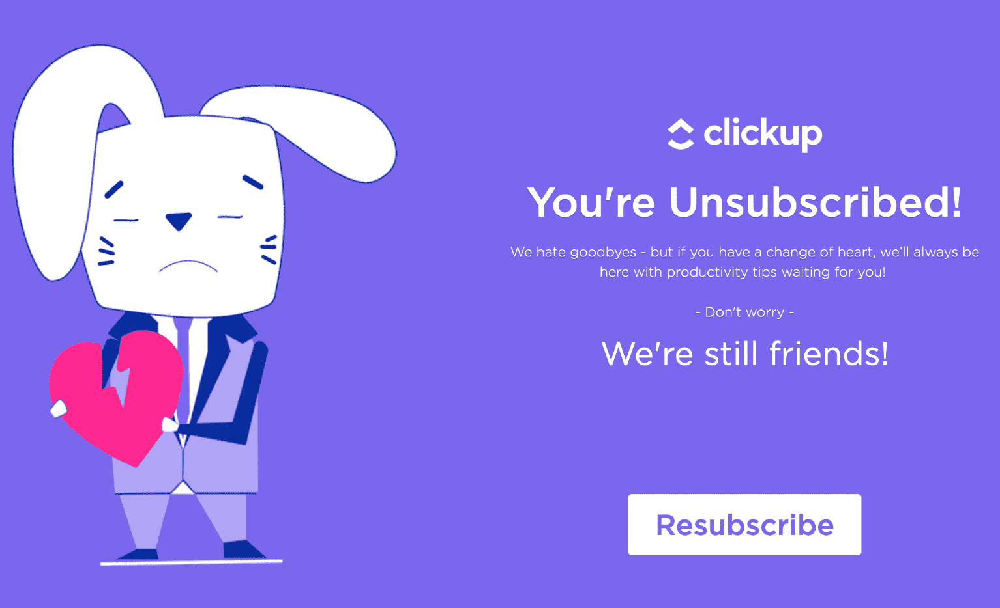

Resubscribe email list CTA

接下来，让我们来谈谈建立电子邮件列表的最具爆炸性的方法之一。

赠品。

## 使用赠品来即时建立清单

有什么比赢得一场比赛更令人满意的吗？即使我们要做的只是输入我们的名字，或者在网站的情况下，输入电子邮件地址，击败其他竞争对手的喜悦就像蜂蜜一样甜。

你可以利用这种快乐来搜索电子邮件地址。虽然举行赠品并不总是最便宜的解决方案，但它是电子邮件营销人员最有效的方法之一。为什么？

因为网上比赛都普遍收集一样东西:[梦寐以求的邮箱](https://brandongaille.com/17-new-statistics-and-trends-online-contest-promotion/)。

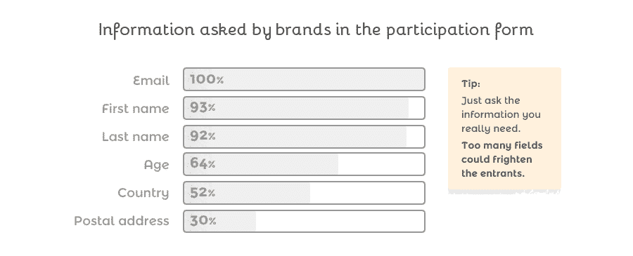

Information asked by brands (Image source: BrandonGaille)

竞赛中收集的第二个最常见的元素是参与者的名字，这增加了电子邮件营销人员的喜悦。将名字放在手边会让你有能力发送个性化的电子邮件活动，82%的专业人士称这能增加他们的总打开率。

## 注册订阅时事通讯

### 想知道我们是怎么让流量增长超过 1000%的吗？

加入 20，000 多名获得我们每周时事通讯和内部消息的人的行列吧！

[Subscribe Now](#newsletter)

好处是复合的。自动化电子邮件，如个性化营销活动，其点击率比非自动化营销活动高出 152%以上。所以，总的来说，对于那些想要建立自己的清单的人来说，赠品是一座持久的金矿，可以在此时此地和时不时地提供奖励。

但是到底有多少金矿呢？当 Josh Earl 提供一个高级代码编辑器 [Sublime Text](https://kinsta.com/blog/how-to-use-sublime-text/) 作为赠品的一部分时，他达到了相当于加利福尼亚淘金热的程度。他的清单在 11 天内[爆炸了 3418%](https://neilpatel.com/blog/giveaway-accelerate-email-list/)(建议阅读:[市场上为 WordPress 开发者和高级用户准备的 10 款免费 HTML 编辑器](https://kinsta.com/blog/free-html-editor/))。

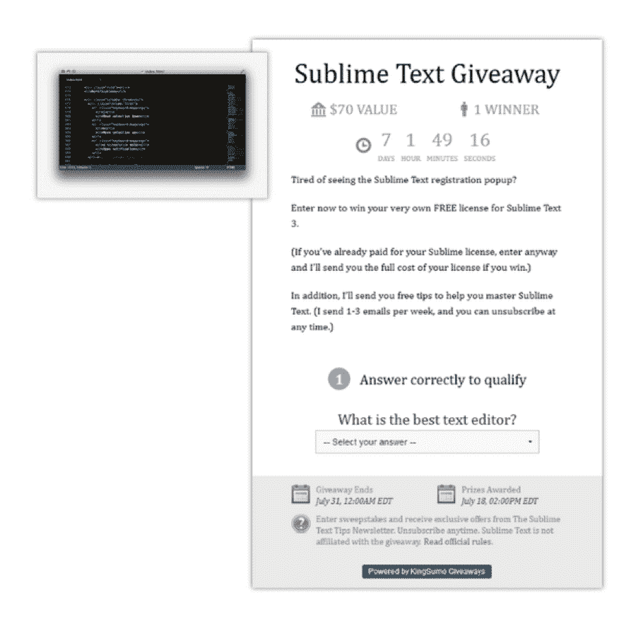

Giveaway

这个简单的赠品不仅增加了他的邮件列表。这帮助他的网站绕过了 200 多万竞争对手，在 Alexa 的全球网站排名中名列第 49137 位。还不服气？还有更多。

另一位企业家在她的博客上使用赠品来增加她的订户。她的努力使流量和用户增加了一倍多，[导致增长速度大幅提升](https://doyouevenblog.com/blog-giveaway/)。

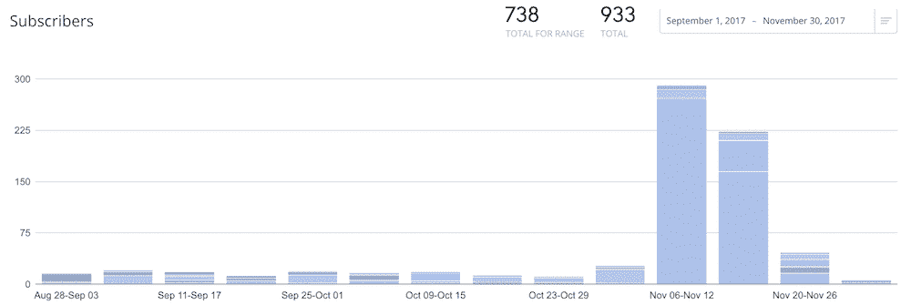

Giveaway increase subscribers

再举一个例子。在过去的四年里，相扑团体的首席“相扑”诺亚·卡根利用赠品创造了 50 多万新的电子邮件订户。你可以在下面看到他的一个例子。

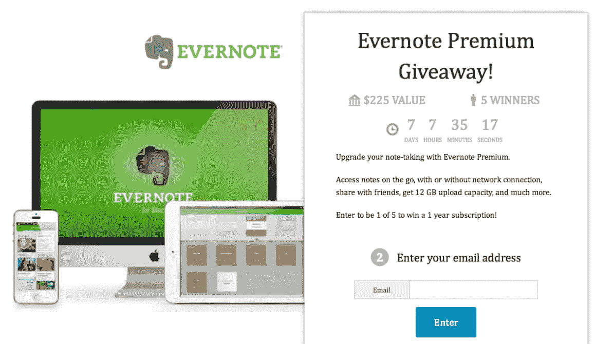

Evernote giveaway

好了，现在我们已经消除了一点怀疑，让我们来看看是什么让免费赠品变得值得——对你的新订户和你的预算都是如此。赠品最重要的元素是确保你为你的用户提供有用的东西，并且不排除你的任何人口统计数据，无论你的比赛是在社交媒体上还是直接在你的网站上。

你可以像 InkBox 在他们的网站上疯狂购物一样，提供一些直接价值的东西。

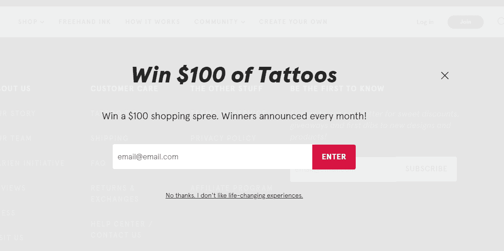

Capture email with a shopping spree

或者，你可以像诺亚和乔希那样颁发个人奖项。这里有一个来自[抽动通道](http://www.sypherpk.com/blogarchive/2018/2/25/3000-twitch-subscriber-giveaway)的例子。

Giveaway items to capture email

虽然奖品都是高价的，但让这种赠品有效的是它的观众调谐。所有的奖品都是以游戏为中心的观众想要使用的。

例如，考虑一下，如果提供的是凯膳怡立式搅拌机。当然，它可能会与游戏机的美元价值相竞争，但如果用户群不喜欢烘焙，它就不太可能引起他们的共鸣。

好吧，如果你要赠送一些与受众相关的东西，赠品是一个很好的列表生成器，但是你如何为你的网站设置一个呢？

为此，像 WooBox 这样的免费工具是必不可少的。现在让我们兜一圈。首先，转到 [WooBox 主页](https://woobox.com/)。点击两个海军按钮中的一个来注册。

[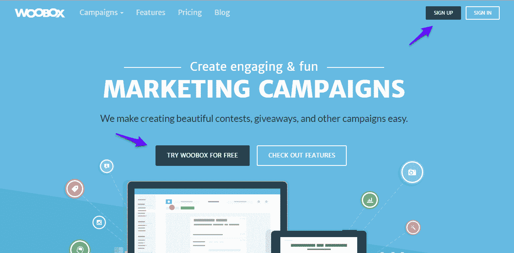](https://woobox.com/)

WooBox

一旦你完成了，你就会降落在这个仪表板上。确保在顶部选择了第一个选项“微型网站”。

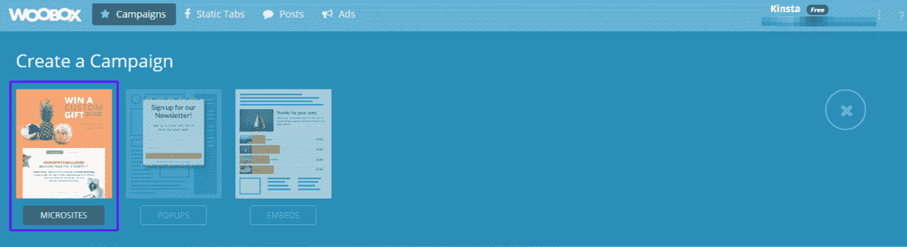

WooBox microsites

然后，向下滚动查看模板。选择第二个选项“抽奖”

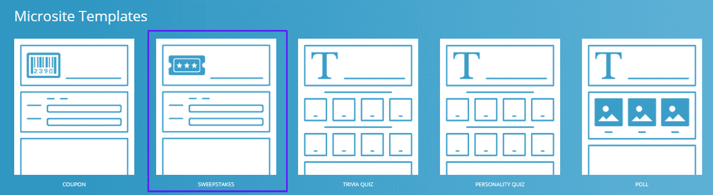

WooBox sweepstakes

给你的活动起个名字。想到立式搅拌机让我想到了饼干，所以这就是我这次测试要用的。如果这是一场真正的战役，像高级插件或 Kinsta 包这样的东西会是一个主题更好的选择。记住，观众调谐。

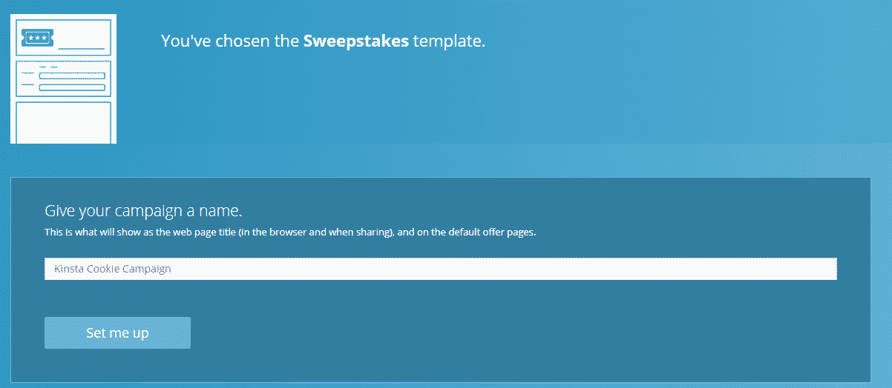

WooBox sweepstakes name

以下是编辑选项。在这里，您可以重命名您的活动，添加描述，设置开始和结束日期，并设置参赛规则。完成后，在左侧菜单中选择“定制”

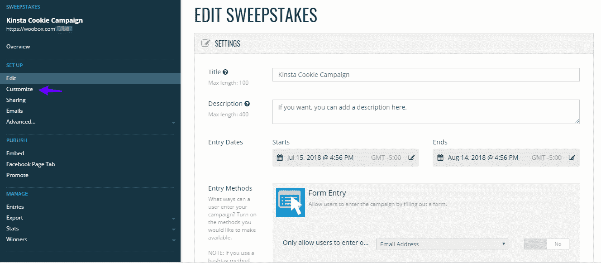

WooBox customize sweepstakes

这是一件非常朴素的衣服，没有任何改动。幸运的是，定制您的赠品非常简单。

Struggling with downtime and WordPress problems? Kinsta is the hosting solution designed to save you time! [Check out our features](https://kinsta.com/features/)

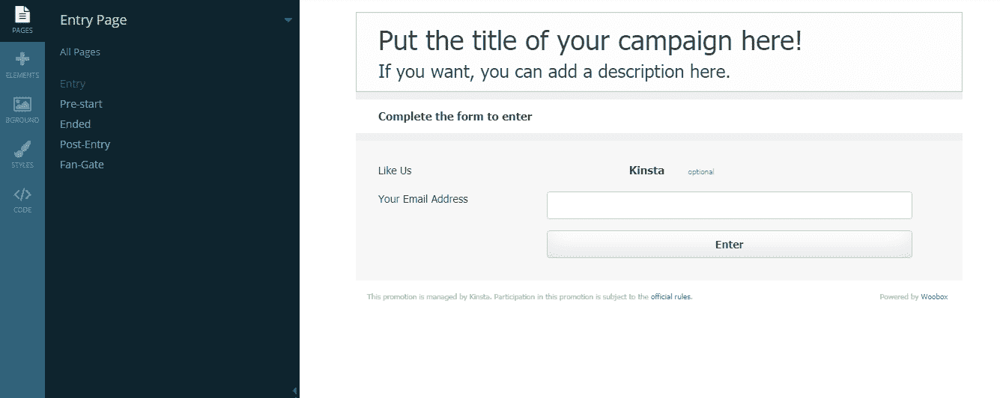

WooBox sweepstakes default

单击一个元素直接编辑它，并自定义每个功能。完成后，点击顶部绿色的“保存更改”按钮。

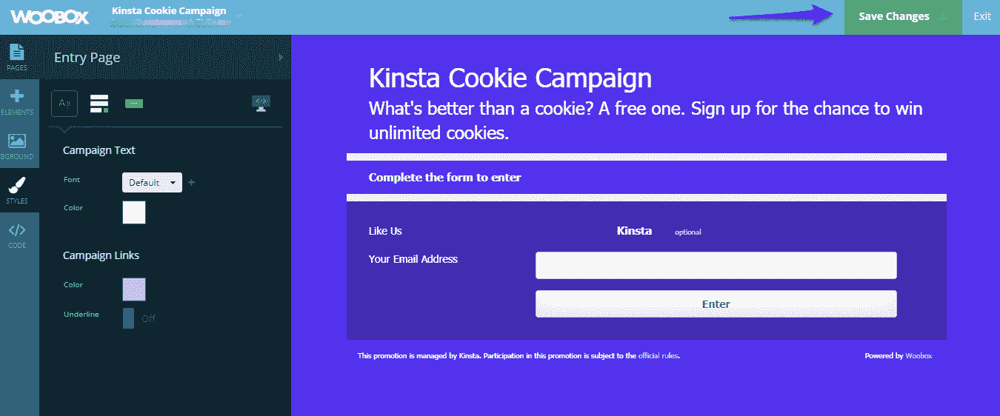

WooBox save changes

保存您的活动后，选择“退出”进入您的概览页面，您可以在该页面跟踪您的进度、抓取嵌入代码并将其直接放在您的网站上、设置社交共享等。

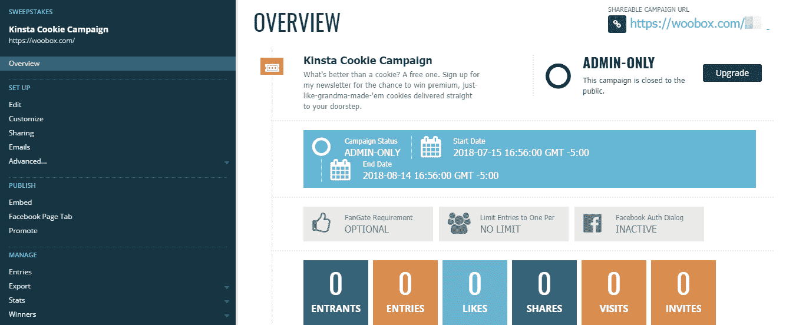

WooBox sweepstakes overview

这就是全部了。另一个运行你可能想检查的赠品的选择是新的 [Woorise](https://wordpress.org/plugins/woorise/) WordPress 插件。

好吧，如果你不准备承诺赠送，你还有什么其他选择？如果你已经拿到了[内容饼干罐](https://kinsta.com/learn/content-marketing/)，是时候开始考虑升级了。

## 进行磁性内容升级

在拥有博客的企业中，只有 57%的企业从他们的读者那里赢得了客户。确保你在那 57%中着陆的入场券是什么？

在正确的时间做出正确的提议。具体来说，提供内容升级。如果你不熟悉这个术语，内容升级就是你向用户提供额外的内容来交换他们的电子邮件地址。不一定要超级花哨。它只需[为用户](https://autogrow.co/what-is-a-content-upgrade/)增值。

备忘单、清单和电子书都是受欢迎的选择。你的升级越有针对性，越好。在他们的博客帖子上使用定制内容升级有助于 CodeinWP 的内容更好地转换[，从 831%到 1613%](https://www.codeinwp.com/blog/case-study-part-1-from-0-to-4000-email-marketing/) 。

Tim Soulo 也吹捧内容升级对电子邮件转换率的好处。由于增加了内容升级，他的转化率在一个月内增长了 300%。

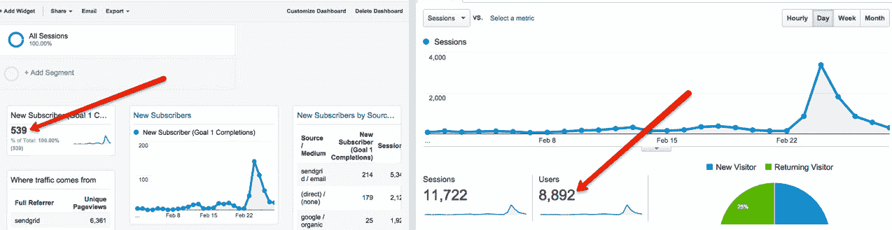

Conversion rate with content upgrade (Image source: Bloggerjet)

这里有一个你可以在你的网站上提供的潜在内容升级的快速视觉总结。

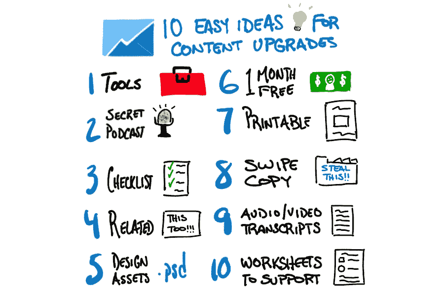

Content upgrade options (Image source: [ConvertKit](https://convertkit.com/complete-guide-content-upgrades/))

现在，让我们具体看看其他人是如何使用内容升级的。

这里有一个温蒂·梅纳德的例子，她是一位为小企业工作的营销专家。

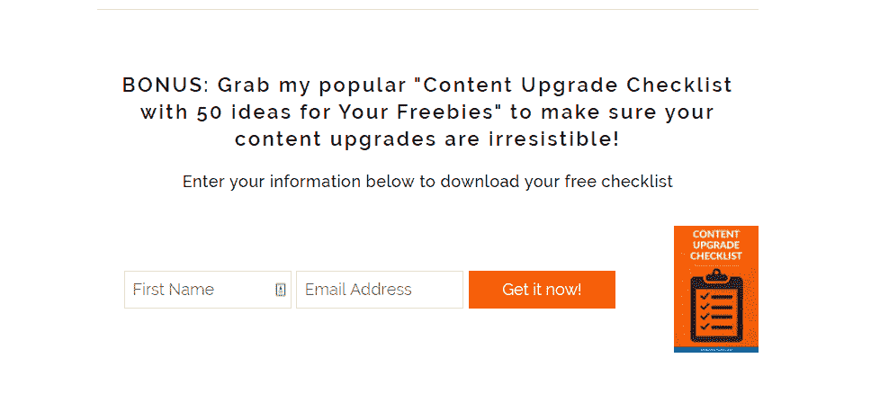

Checklist as a content upgrade

除了高度元化的吸引力之外，这种内容升级是针对它所在的页面的。如果你正在读她的博客，关于什么是内容升级，一个额外的、简单的列表可能会是一个受欢迎的补充。

NerdWallet 采取了一种*稍微*更普遍的方法，[在一个专门写商业计划的页面上提供了一个免费的电子书](https://www.nerdwallet.com/blog/small-business/business-plan/)，介绍了创业的最佳行业。

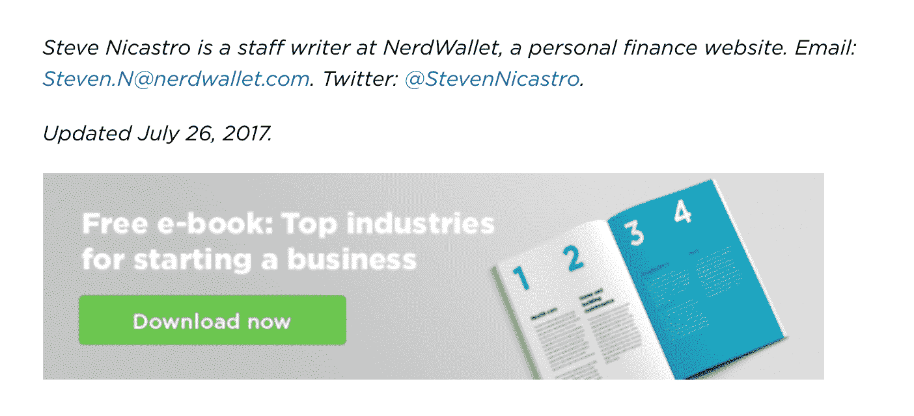

ebook as a content upgrade

最终，您提供的内容升级将取决于您的受众、资源和具体目标。要设置它，请参考本文的第一部分，并使用那里的 capture form 工具来构建您的内容升级——只需确保它真的是一个升级。

没有什么比垃圾邮件更能让人迅速取消订阅了，假设电子邮件在第一时间就通过了。

对于我们的最后一条建议，是时候离开现场，投入到派对本身中去了。具体来说，是时候进行社交了。

## 利用社交媒体促进社区发展

社交媒体可以通过付费和免费的方式帮助你的名单繁荣。

考虑到 77%的美国人口拥有社交媒体档案，它肯定有能力找到你未来的订户。

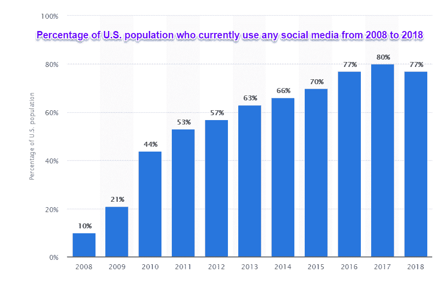

Social media usage (Image source: Statista)

让我们先看看免费选项。

脸书允许品牌将 CTA 按钮直接放在封面照片下方。你可以在我们的脸书页面上看到这个[的运行。](https://www.facebook.com/kinstahosting/)

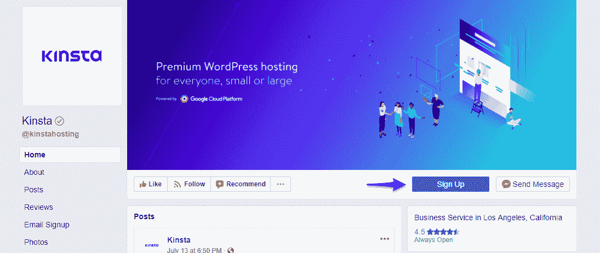

Facebook CTA

点击注册按钮，您将直接进入一个页面，使用电子邮件地址登录或注册 Kinsta。

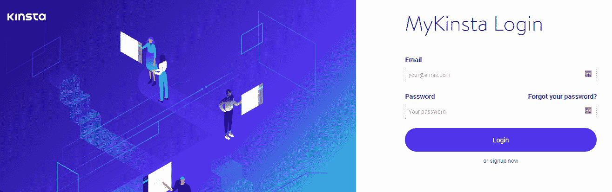

Kinsta signup page

Twitter 提供了一个类似的选择，尽管稍微不那么直接。虽然你不能链接一个按钮，但你可以把你的电子邮件注册页面放在简历部分。只是一定要使用“订阅”这个词，这样人们就知道他们要去做什么了。

这里有一个来自内容营销机构 Twitter 的例子。

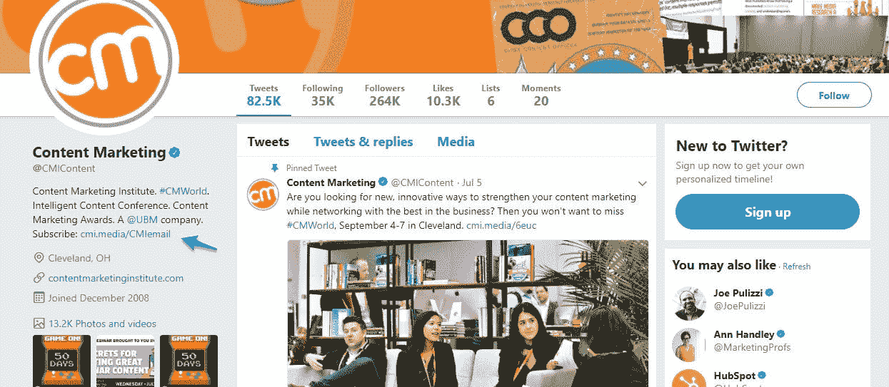

Twitter CTA

不认为使用在线社区会对你的电子邮件列表产生很大影响？以丹尼尔·恩杜克武为例，他利用社交世界在短短两个月内使他的订户增长了 339%。

温室软件看到了类似的结果，当他们在社交媒体上使用分割测试和重新定位时，他们的电子邮件列表在一个月内增长了 15 %( T2 )( T3 ),并提供了最低的付费广告。

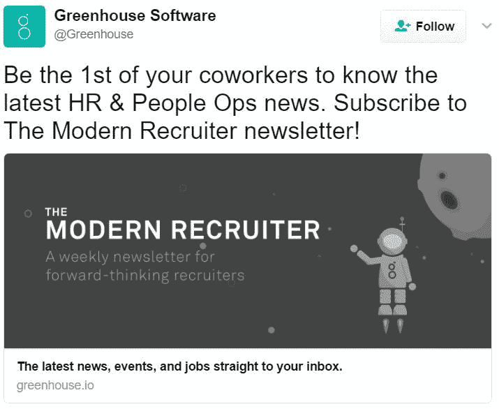

Twitter ad email list

童鞋在线零售商 Wee Squeak 同样在市场支出较低的情况下获得了惊人的回报。在脸书广告上花 90 美元，他们就收到了 600 多封电子邮件。

那么，你如何利用这些平台来发展呢？除了在你的简历和商业页面中链接你的注册页面，还有两个大的(便宜的)选项。

虽然 Twitter 卡不再直接收集电子邮件地址，但这些可以用来询问订户或将用户导向一个你可以提供内容升级的页面。或者，您可以将它们与我们上一步中的赠品一起使用，以获得更出色的结果。在下面的中，看看 PCH 和维萨如何使用[这些不同的组合。](https://instapage.com/blog/twitter-website-cards)

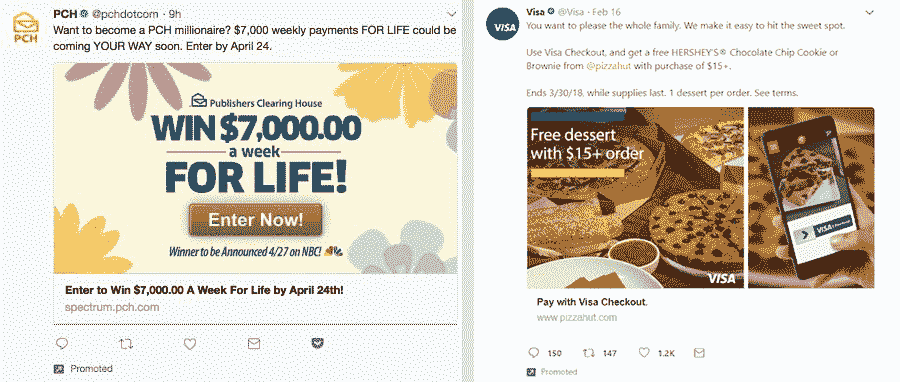

Twitter ad giveaways

第二种付费解决方案是由[脸书主导广告](https://www.facebook.com/business/a/lead-ads)。如果你以前从未见过它们，这里有一个来自兽医的[窥视。注意赠品是如何被再次使用的。](https://www.socialmediaexaminer.com/how-to-use-facebook-lead-ads-for-more-prospects/)

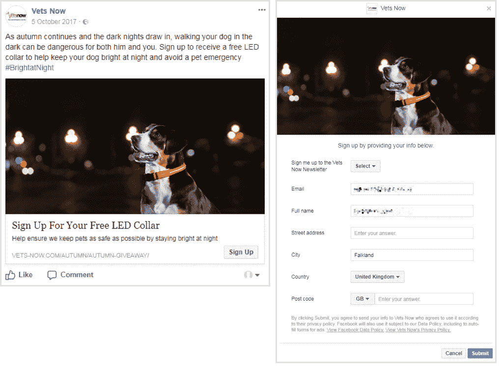

Facebook lead ad

与 Twitter 卡片类似，脸书的领先广告允许你直接在帖子中加入 CTA。然而，与 Twitter 不同的是，你可以使用一个按钮，点击它将触发一个电子邮件捕获的下拉表单。

使用脸书领先的广告帮助我们之前的例子，小佳乐，实现了他们的增长。他们也为 Hubble Contacts 的成功做出了贡献，[以最低的 2.30 美元 CPL 为该业务创造了近 3000 条新线索。](https://www.facebook.com/business/success/hubble-contacts)

这是底线:

如果你想让你的邮件列表开花结果，你可能需要用社交媒体来给场外的土壤施肥。免费和付费选项都可以帮助你的列表达到高潮，让订户滚滚而来。

## 结论

电子邮件列表是你成功营销的面包和黄油，与其他形式的营销相比具有极高的投资回报率。而且，它们很容易构建。为了快速扩充你的列表，首先要确保你的捕获表单尽可能的用户友好。

然后，分享爱:更具体地说，举办一个赠品，以获得一些即时订户增长。之后，转向你的内容。以内容升级的形式创造简单(但有针对性)的增值，以获取更多的电子邮件地址。

最后，不要忘记关闭你的网站。社交媒体社区提供付费和免费的机会来增加你的订户数量。

虽然电子邮件营销可能令人望而生畏，如果你只是刚刚涉足，鼓起勇气。这种形式的营销是低努力，高收益，并与一点肘油脂，可能会成为你最喜欢的销售渠道。

* * *

让你所有的[应用程序](https://kinsta.com/application-hosting/)、[数据库](https://kinsta.com/database-hosting/)和 [WordPress 网站](https://kinsta.com/wordpress-hosting/)在线并在一个屋檐下。我们功能丰富的高性能云平台包括:

*   在 MyKinsta 仪表盘中轻松设置和管理
*   24/7 专家支持
*   最好的谷歌云平台硬件和网络，由 Kubernetes 提供最大的可扩展性
*   面向速度和安全性的企业级 Cloudflare 集成
*   全球受众覆盖全球多达 35 个数据中心和 275 多个 pop

在第一个月使用托管的[应用程序或托管](https://kinsta.com/application-hosting/)的[数据库，您可以享受 20 美元的优惠，亲自测试一下。探索我们的](https://kinsta.com/database-hosting/)[计划](https://kinsta.com/plans/)或[与销售人员交谈](https://kinsta.com/contact-us/)以找到最适合您的方式。