# 终极 WordPress 多语言指南——我们如何推出 10 种语言

> 原文：<https://kinsta.com/blog/wordpress-multilingual/>

让我们首先开始说，建立一个 WordPress 多语言网站可能会非常混乱！即使对于经验丰富的 WordPress 开发者和用户来说，在第一次考虑如何用多种语言发布你的网站时，也会突然出现很多问题。比如它将如何影响 [SEO](https://kinsta.com/blog/what-does-seo-stand-for/) 以及有哪些技术障碍需要克服？

截至 2022 年，我们的 Kinsta 网站现已提供 10 种不同语言版本。所以我们想分享一下我们在全面多语言设置方面的第一手经验。希望我们能够回答其中的一些问题，或者**解决你可能有的任何疑问**。拥有一个多语言网站有很多好处，所以不要让技术方面或 SEO 方面的问题吓跑你。

有很多方法可以接近一个多语言的 WordPress 站点，所以我们也将分享一些替代的解决方案。

## WordPress 多语言索引

*   [多语言优势](#multilingual-advantages)
*   [多语种问题解答](#multilingual-questions)
*   [外包 WordPress 翻译服务](#wordpress-translation)
*   [选项 1–带有 Polylang 插件的 WordPress 多语言设置(免费)](#setup-polylang)
*   [选项 2–使用 Weglot(高级版)的 WordPress 多语言设置](#setup-weglot)
*   [选项 3–WordPress 多语言设置–自定义](#custom-multilingual-custom)
*   [替代 WordPress 多语言插件](#wordpress-multilingual-plugins)
*   [如何测试你的 hreflang 标签](#test-hreflang-tags)
*   [支持多种语言的谷歌分析](#multilingual-analytics)

## 多语言优势

拥有一个 WordPress 多语种网站有很多好处，根据你的业务类型，这可能是一个开拓额外市场的好方法。

### 1.SEO 优势

在你的网站上有额外的语言的最大好处之一是为了 SEO。假设你已经将 WordPress 网站上的内容翻译成了西班牙语和德语。谷歌将抓取您的网站，并开始索引您的额外语言作为单独的内容。这意味着你将立即在搜索引擎结果页面(SERPs)中拥有更多的内容。不仅如此，你还可以让它把你的内容转换成访问者浏览器所使用的语言。


在 Kinsta，我们看到通过将我们的博客翻译成 10 种不同的语言，整体有机流量增加了 18%。最重要的是，创建英文内容的艰苦工作已经完成了。除了流量的增加，我们还从世界各地获得了新的客户，否则他们可能不会找到我们。利用这个可怕的策略来获得更多的流量和客户！

如果你愿意，你甚至可以学习更多的语言。知名 SEO 尼尔·帕特尔在他的网站上做了一个实验，将他的博客翻译成多达 82 种不同的语言。结果呢？三周之内，他看到总流量增加了 47%!

然而，请记住，翻译的质量也很重要。一次推出多种语言，说起来容易做起来难。我们将在下面深入探讨这个问题。

[Kinsta saw an 18% boost in organic traffic from implementing a multilingual strategy. 📈Click to Tweet](https://twitter.com/intent/tweet?url=https%3A%2F%2Fkinsta.com%2Fblog%2Fwordpress-multilingual%2F&via=kinsta&text=Kinsta+saw+an+18%25+boost+in+organic+traffic+from+implementing+a+multilingual+strategy.+%F0%9F%93%88&hashtags=SEO%2Cmultingual)

应该看到更多流量的原因是因为其他语言的**竞争通常要少得多**。说到内容营销和 SERPs，英语市场已经非常饱和了。下面是一些[关键词研究](https://kinsta.com/blog/keyword-research/)的例子。在英语中，我们查找术语“营销策略”我们可以看到，它每月的搜索量约为 40，000 次。这将很难排名。如果你看一下 SERPs，你会立刻反对拥有高域名权限的大型域名。如果你聪明，你可能不会试图解决这个关键词。

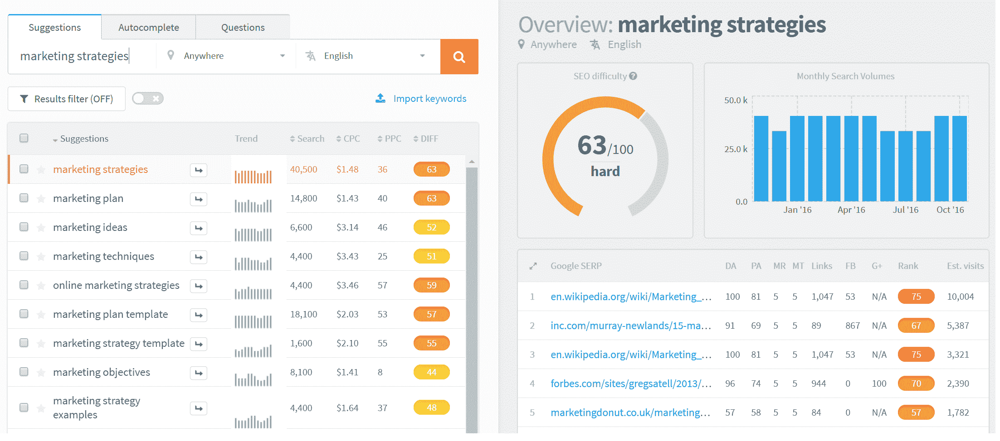

English keyword volume


现在，如果你用西班牙语使用相同的术语“estrategias de marketing”，我们可以看到它的搜索量没有那么大，但仍然很大，大约每月 15，000 次。你猜怎么着？难度不难排。你竞争的域名都有低于 40 的低权限。这是你现在可以解决的问题。当涉及到其他语言时，你会发现很多搜索词更容易排序。


Spanish keyword volume


在决定你应该投入时间和金钱的语言之前，做关键词研究是多么重要，我们怎么强调都不为过。不要仅仅因为一种语言有搜索量，就认为另一种语言也有搜索量。

永远不要因为一种语言在另一种语言中有效，就认为这种语言的搜索量很大。🇺🇸🇪🇸🇩🇪 点击推文


### 2.用户体验优势

除了搜索引擎优化的优势，拥有一个本地语言的网站会自动带来更好的用户体验。更好的用户体验会影响你的转换率、停留时间和跳出率。

> 提高转化率是更好的用户体验和更多的用户研究的最强有力的 ROI 论据之一。随着时间的推移进行跟踪，因为这是一个相对指标。–[尼尔森诺曼集团](https://www.nngroup.com/articles/conversion-rates/)

有人最不想做的事情就是在 Chrome 上点击鼠标右键，说“翻译成……”谷歌尽可能地做好翻译，但质量远不及那些实际上每天都在说这种语言的人。如果你想改善用户体验，花点时间**投资高质量的翻译**，我们将在下面详细介绍。

### 3.信任和可信度

对企业来说，与客户使用相同的语言是很重要的。不仅仅是在你所处的领域的营销行话和术语，还包括简单地说同一种母语。为什么？因为这能建立信任和可信度。自然地，我们人类更喜欢用我们的母语交谈，因为这是我们成长的文化。

[Multilingual tip: speak in the same language as your customers. 🤘Click to Tweet](https://twitter.com/intent/tweet?url=https%3A%2F%2Fkinsta.com%2Fblog%2Fwordpress-multilingual%2F&via=kinsta&text=Multilingual+tip%3A+speak+in+the+same+language+as+your+customers.+%F0%9F%A4%98&hashtags=CRO%2CSERPs)

世界上大多数人实际上不会说英语，或者他们把英语作为第二语言。根据杜塞尔多夫大学的研究，在比较人们使用什么作为母语时，英语实际上排在第六位。

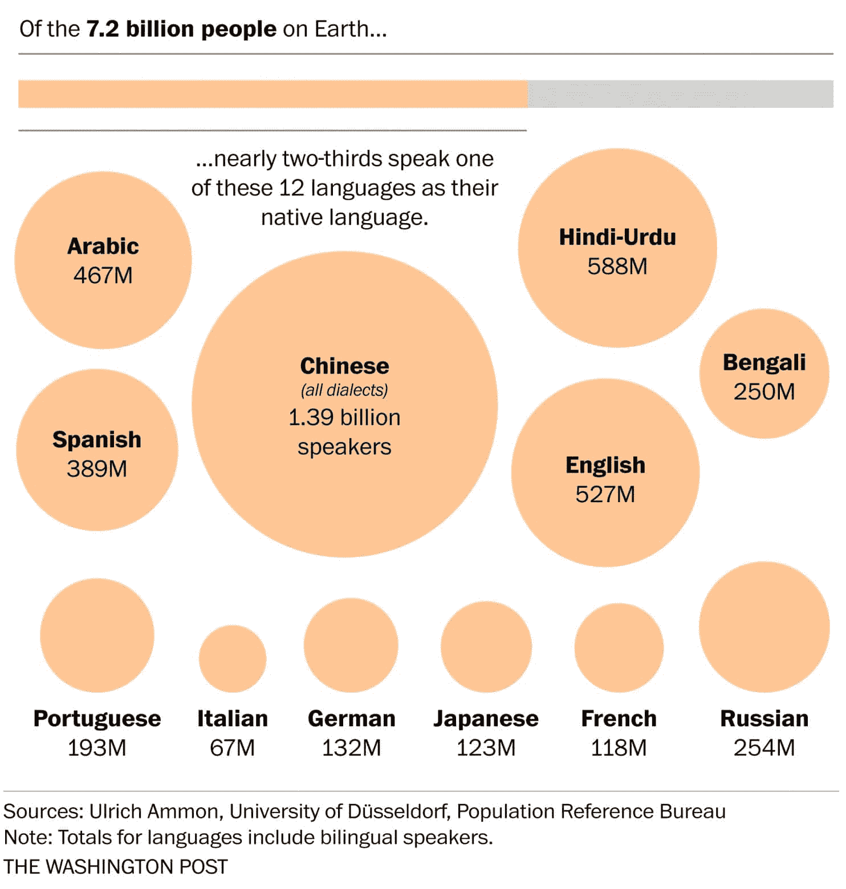

Native languages – Image source: [The Washington Post](https://www.washingtonpost.com/news/worldviews/wp/2015/04/23/the-worlds-languages-in-7-maps-and-charts/?utm_term=.b5201d95d322)


语言是最常见的交流障碍之一，这反过来会导致人们之间的误解和曲解。如果你使用的语言和方言不同于其他人理解的语言和方言，这就使得交流变得无效，并阻碍了真正信息的传达。这可能直接关系到你的销售。

## WordPress 多语言问题解答

当你第一次看到一个 WordPress 多语言网站时，会立刻有很多关于一切如何工作的问题。希望下面我们能为你解答一些问题。

### 你需要一个多语言网站吗？

你可能想知道，你真的需要一个多语言网站吗？嗯，你能做的第一件事是检查你是否已经得到任何国际交通。我们建议[在谷歌分析](https://kinsta.com/blog/how-to-use-google-analytics/)中寻找一年的数据，如果你有的话。第一位是“受众→地理→语言。”谷歌分析从访问者的网络浏览器中获取这些价值。

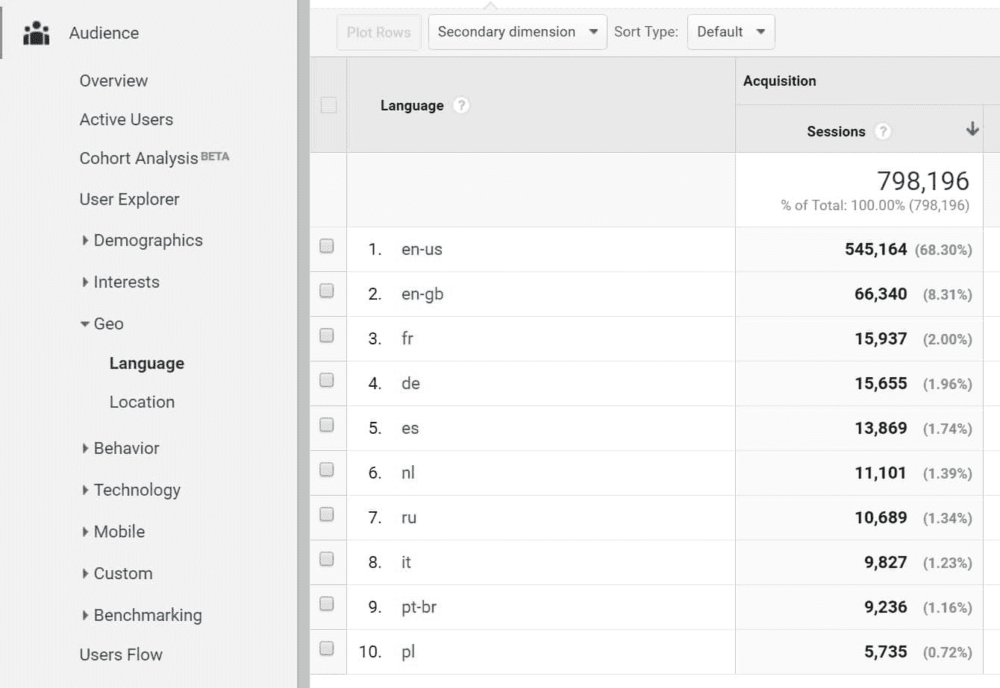

Google Analytics geo language


第二位是“受众→地域→位置。”但是请记住，如果你的内容已经在这些地区排名的话，这个数据和上面的数据会更高。但它给了你一个开始的基础。

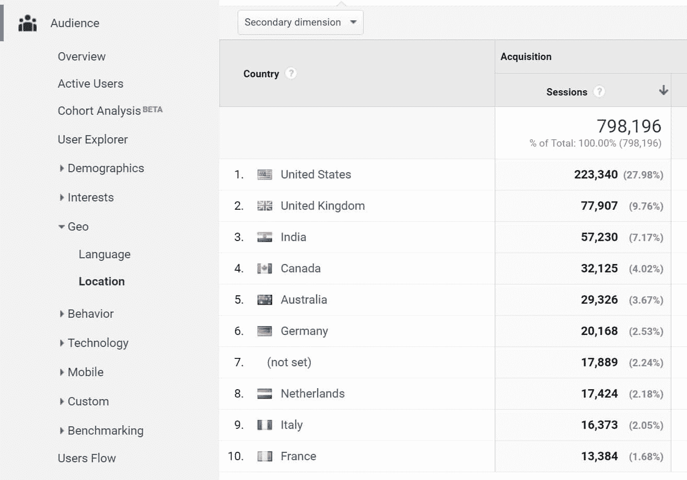

Google Analytics geo location


此外，作为一个企业或大型网站，你应该已经从与客户和访问者的互动中有了一些想法。你有很多来自西班牙顾客的支持票吗？你的大部分销售额来自哪里？利用你必须知道的历史，如果他们有可能翻译你的 WordPress 站点。


### 你应该使用什么样的 URL 结构？

当配置一个 WordPress 多语言站点时，基本上有三种不同的场景可供选择。

**1。顶级域名**

https://domain.com/

https://domain.es/

https://domain.de/

TLD 是顶级域名的缩写，是域名的最后一部分，即最后一个点之后的部分。

这种方法可以很好地瞄准特定的国家，然而，它也是最复杂的方法，因为每个国家都有自己的搜索引擎优化策略，域名权限等。你很可能要做更多的工作。可以设置为独立安装或多站点安装(使用[域映射](https://kinsta.com/knowledgebase/wordpress-multisite-domain-mapping/))。

**2。子域**

```
https://domain.com/
https://es.domain.com/
https://de.domain.com/
```

这是一种相当常见的方法。可以设置为独立安装或作为一个 [WordPress 多站点](https://kinsta.com/wordpress-multisite-hosting/)。

**3。子目录**

```
https://domain.com/
https://domain.com/es/
https://domain.com/de/
```

这可能是**最常见的方法之一**以及我们在金斯塔的站点所走的路线。可以设置为独立安装、多站点或使用插件的单个站点。如果你想了解以上每个场景的优缺点，WPLANG 有一篇很棒的文章，解释了当[为你的多语言网站选择 URL 结构](http://wplang.org/domain-subdomain-subdirectory/)时你有不同的选择。

### 什么是 hreflang 标签？

在一个多语言 WordPress 网站上，你应该使用 hreflang **标签**，并遵循谷歌为[语言和地区网址](https://support.google.com/webmasters/answer/189077?hl=en)提出的建议。这些在你的网站的每一页上都被用来标识所使用的语言。

例如，如果你的网站提供英语和西班牙语的内容，除了英语版本的链接之外，西班牙语版本必须包括一个`rel="alternate" hreflang="x"`链接。同样，英文版本必须包含对西班牙文版本的相同引用。注意:俄罗斯搜索引擎 [Yandex 也使用 hreflang 标签](https://yandex.ru/blog/webmaster/15326)。

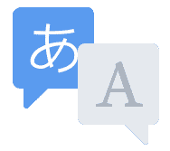

这里有几个例子。您可能会遇到两种不同的情况，一种是简单地针对不同的语言。第二是针对同一种语言但不同地区。

**场景 1:以语言为目标的 hreflang 标签**

这通常是**最常见的场景**，你只是有不同的语言，你想通知谷歌。例如，您可能有英语和西班牙语版本，但您不想按地区缩小范围，因为在美国有大量说西班牙语的人口。这就是语言的 [ISO 代码](https://en.wikipedia.org/wiki/List_of_ISO_639-1_codes) (ISO 639-1)派上用场的地方。

英文网站:

```


```

西班牙网站:

```


```

**场景 2:针对语言和地区的 hreflang 标签**

在这种情况下，您可能有相同的语言，并希望指定不同的地区。比如美国的英语，英国(UK)的英语。这就是国家的 ISO 代码(ISO 3166-1 Alpha 2)派上用场的地方。英文网站:

```


```

英国网站:

```


```

你也可以修改 ISO 代码，例如，de-ES 会告诉谷歌你有德国内容，但想针对西班牙的用户。一定要检查一下 [hreflang 标签工具生成器](http://www.aleydasolis.com/en/international-seo-tools/hreflang-tags-generator/)，它允许你为你的网站创建 hreflang 标签模式，使用正确的值和符合 Google 规范的语法。

### 什么是 hreflang x-default 标签？

当用户浏览器与 hreflang 标记中的任何内容都不匹配时，将使用 hreflang x-default 标记。举例来说，如果你有一个英语和西班牙语的网站，有人用他们的浏览器/谷歌点击你的页面，它会简单地把他们重定向到你为`x-default`标签设置的任何地方。请将此视为您的默认后备标签。这里有一个例子。

```

```

结合一个英语和西班牙语的网站，它会像这样。

英文网站:

```


```

西班牙网站:

```


```

如果你想了解更多关于 hreflang 标签的信息，我们推荐你去 Yoast 的 awesome 团队查看 [hreflang:终极指南](https://yoast.com/hreflang-ultimate-guide/)。

### Bing 呢？

所以我们总是在谈论谷歌，但重要的是不要忘记必应。如上所述，Bing 实际上不支持 hreflang 标记，它们利用了`<html>`标记语言属性、HTTP 响应头或 HTML 元元素。

**< html >标签语言属性**

我们只关心标签语言属性，因为这是 WordPress 默认使用的。这是一个英语和西班牙语网站的例子。

英文网站:

```
<html lang="en-US">
...
</html>
```

西班牙网站:

```
<html lang="es-ES">
...
</html>
```

要做到这一点，你需要通过编程[改变 WordPress](http://stackoverflow.com/questions/7741280/change-html-language-from-en-us-in-to-en-gb-in-wordpress/37571439#37571439) 中的 HTML 语言。下面提到的教程和插件会自动为你做这些。

### 添加额外的语言会对你的搜索引擎优化产生负面影响吗？

不，如果设置正确，额外的语言不会伤害你的搜索引擎优化，事实上，正如我们上面分享的，它可以帮助你的搜索引擎优化。不需要担心内容重复的问题。

### 你应该翻译什么？

当谈到选择在你的网站上翻译什么时，通常最好的做法是翻译一切。这既是从用户体验的角度，也是从 SEO 的角度。

[What should you translate in a WordPress multilingual setup? One word, everything. 👍Click to Tweet](https://twitter.com/intent/tweet?url=https%3A%2F%2Fkinsta.com%2Fblog%2Fwordpress-multilingual%2F&via=kinsta&text=What+should+you+translate+in+a+WordPress+multilingual+setup%3F+One+word%2C+everything.+%F0%9F%91%8D&hashtags=multilingual%2CWordPress)

**网址(slugs)**

说到 SEO，很多 SEO 都推荐尝试在你的 URL 中有你的关键词。这就是为什么如果可以的话，最好把你的 URL 翻译成他们的母语。例如，我们的“关于我们”页面如下所示:

英文网站:

```
https://kinsta.com/about-us/
```

西班牙网站:

```
https://kinsta.com/es/sobre-nosotros/
```

您可以看到我们的“关于我们”页面的 URL 被翻译成了西班牙语。这也会增加你在 SERPs 中的点击率，因为人们更有可能点击他们母语的网址。

这个规则的一个例外是有时使用特殊字符的语言，如日语。虽然谷歌和 WordPress 支持这些字符，但你可能会遇到第三方插件的问题。所以通常还是稳妥一点比较好。例如，在 Kinsta 的日本网站上，我们的[联系我们页面](https://kinsta.com/jp/contact-us/)，仍然在页面 URL 中使用英语。

```
https://kinsta.com/jp/contact-us/
```

然而，话虽如此，它也可能取决于语言。例如，普通话有一种叫做[拼音](https://en.wikipedia.org/wiki/Pinyin)的东西，这是 mainland China 标准汉语的官方罗马化系统，可以在永久链接中使用。你可以使用像[拼音 Slugs](https://wordpress.org/plugins/so-pinyin-slugs/) 这样的插件，它会自动将新内容的 URL (slug)从中文汉字转换成搜索引擎更友好的拼音。

谈到特殊字符，我们的建议是首先对该语言做一些额外的研究，并与母语为该语言的人或经常访问该语言网站的人聊天。

**图像文件名**

正如我们在 [SEO 清单](https://kinsta.com/blog/wordpress-seo/)中分享的，使用智能图像文件名很重要。这包括将文件名翻译成他们的母语。示例:

英文网站:

```
https://kinsta.com/wp-content/security.png
```

西班牙网站:

```
https://kinsta.com/es/wp-content/seguridad.png
```

**SEO Meta**

不要忘记翻译你的 SEO 元，包括标题和元描述。 [Yoast SEO 插件](https://kinsta.com/blog/yoast-seo/)几乎兼容市场上所有的 WordPress 多语言设置和插件。

## 注册订阅时事通讯


### 想知道我们是怎么让流量增长超过 1000%的吗？

加入 20，000 多名获得我们每周时事通讯和内部消息的人的行列吧！

[Subscribe Now](#newsletter)

**内容**

当然，翻译尽可能多的内容。这包括你的 [WordPress 菜单项](https://kinsta.com/blog/wordpress-menu-plugins/)，类别，标签，部件，页脚内容等。许多多语言插件，他们称之为“翻译字符串”，使你能够更新你的小工具等。

## 外包 WordPress 翻译服务

现在你对 WordPress 多语言设置所需的标签有了更多的了解，知道从哪里获得高质量的内容翻译也很重要。如果你能在内部翻译你的内容，你可能对质量有更多的控制。

然而，由于时间限制，或缺乏语言知识，许多企业不得不寻求外包翻译。有几十个地方可以让你的内容得到翻译，这里只是几个让你开始的地方:

### 五元

在使用 Fiverr 提供服务时，你必须非常小心，但是我们发现他们确实有一些不错的翻译器。根据内容的长度，翻译费用从 5 美元到 20 美元不等。寻找那些收视率高和体面的评论。许多 Fiverr 语言翻译人员也将获得他们工作语言的认证。

如果你预算紧张，Fiverr 绝对是个不错的选择。你可以在我们关于 Fiverr 的文章中找到更多的细节:[如何使用 Fiverr 来减少商务繁忙](https://kinsta.com/blog/how-to-use-fiverr/)

[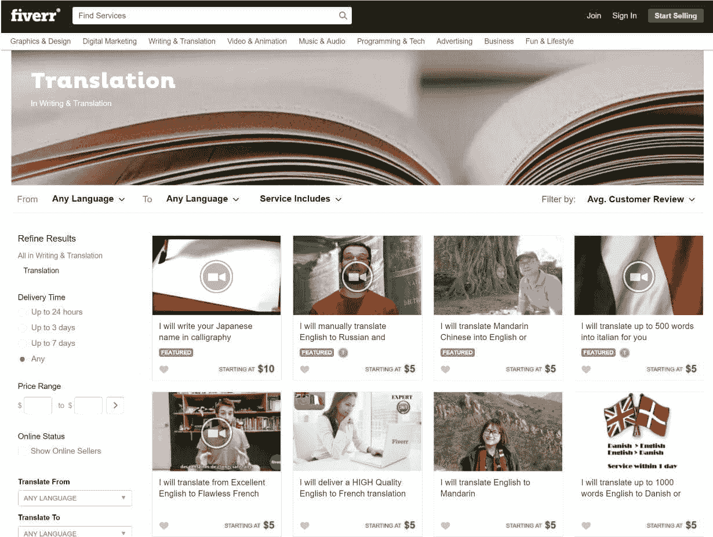](https://www.fiverr.com/categories/writing-translation/quality-translation-services/#filter=auto&page=1)

Fiverr translate


### Gengo

Gengo 由全球 20，000 多名母语人士组成的社区提供快速、经济、高质量的翻译服务。它们的起价仅为 0.05 美元/字，95%的订单都在几小时内完成。

[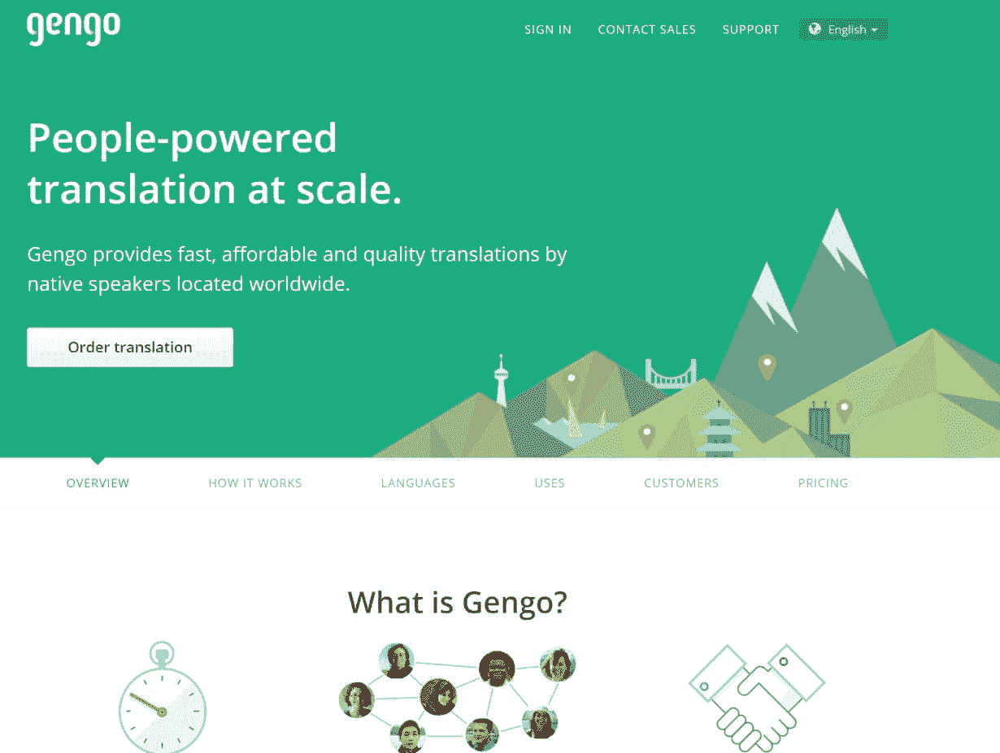](https://gengo.com/)

Gengo translation


### 一小时翻译

[一小时翻译](https://www.onehourtranslation.com/)提供 75 种语言的全天候专业翻译服务。他们有一个超过 15000 名认证人工翻译的网络。一般翻译价格起价仅为 0.079 美元/字。

[](https://www.onehourtranslation.com/)

One hour translation


### 文本大师

TextMaster 由母语为英语的翻译人员提供快速、经济的翻译和文案服务。它们的平均翻译时间为 12 小时，一般翻译价格仅为 0.066 美元/字。

[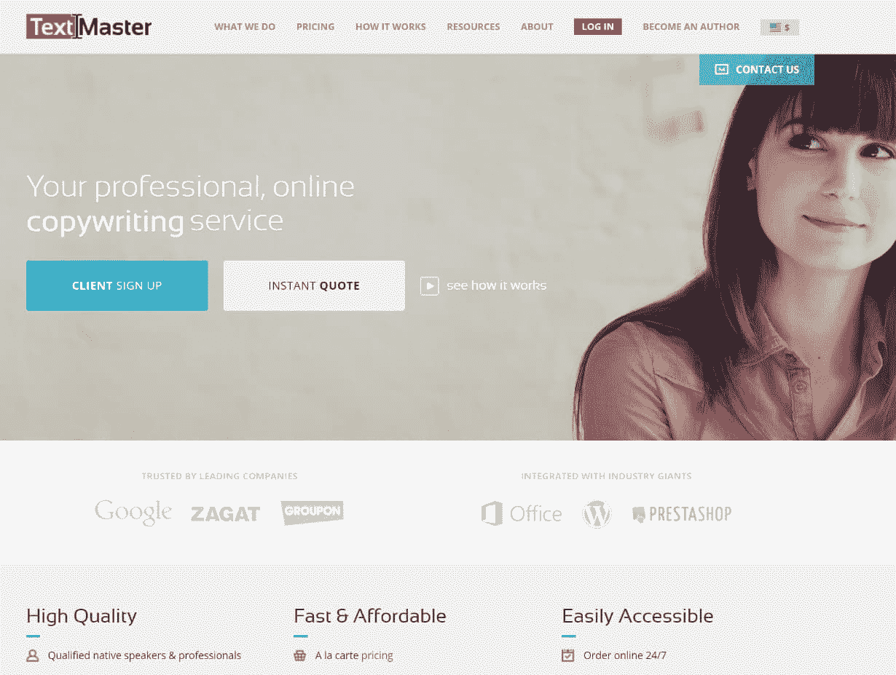](https://www.textmaster.com/professional-translation-services)

TextMaster translation services


其他一些你可能想看看的包括 [ICanLocalize](http://www.icanlocalize.com/site/services/wordpress-translation/) 、 [cloudwords](https://www.cloudwords.com/wordpress) 、[translations.com](http://www.translations.com/)、 [e2f](https://e2f.com/) 和 [Lingotek](https://www.lingotek.com/lingotek_polylang_wordpress_power_translate_now_inside_wordpress) 。

## 选项 1——使用 Polylang 的免费多语种 WordPress

如果你正在寻找一种简单而免费的方式在你的 WordPress 网站上设置多种语言，那么 [Polylang 插件](https://wordpress.org/plugins/polylang/)非常好用！Polylang 允许你创建一个双语或多语言的 WordPress 网站。你像往常一样写文章、页面、创建类别和文章标签，然后为它们定义语言。帖子的翻译，无论是否使用默认语言，都是可选的。这对于单个 WordPress 安装来说也很有用，因为你想让事情变得简单。

[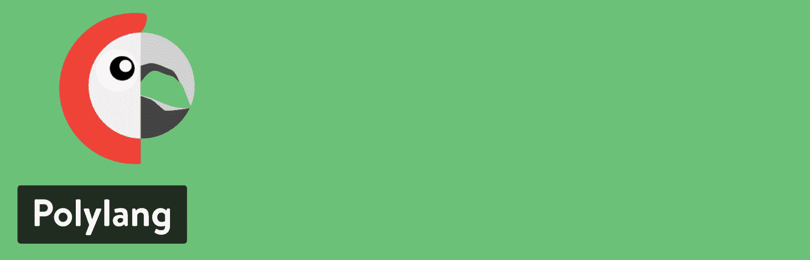](https://wordpress.org/plugins/polylang/)

WordPress multilingual Polylang plugin


该插件有 400，000+的活跃安装，5 星评级中的 4.5，并由开发人员积极更新。你可以从 WordPress 知识库下载 [Polylang](https://wordpress.org/plugins/polylang/) ,或者在你的 WordPress 仪表盘的“添加新插件”下搜索它。以下是该插件的功能列表:

*   支持无限数量的语言
*   你可以翻译几乎所有的东西，从帖子、页面、类别、菜单、小工具等等。
*   它支持自定义文章类型和[分类](https://kinsta.com/knowledgebase/what-is-taxonomy/)
*   语言由 URL 中的内容或语言代码设置，或者您可以为每种语言使用一个不同的子域或域
*   当添加新的帖子或页面翻译时，类别、帖子标签以及其他一些元会被自动复制
*   可定制的语言切换器作为一个小部件或在导航菜单中提供
*   管理界面是多语言的，每个用户都可以在他们的个人资料中设置语言

Polylang 确实遵循了 Google 推荐的最佳实践，使用了 hreflang 标签，并自动为您更改了< html >标签语言属性。Polylang 插件还有一个高级版本，它允许您执行以下操作:

*   在不同语言的文章和术语中共享相同的 URL。
*   翻译 URL 中的自定义文章类型和分类。

按照下面的步骤在你的 WordPress 站点上配置免费的 Polylang 插件。在我们的例子中，我们建立了一个有英语和西班牙语翻译的网站。

### 第一步

安装并激活插件后，你需要首先添加语言。所以在你的 WordPress 仪表盘中点击“设置”下的“语言”,首先添加 English–en _ US。默认是好的。点击“添加新语言”

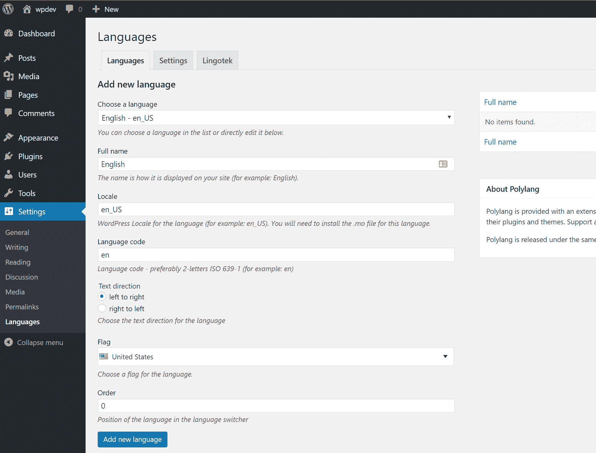

Add English language


### 第二步

你会在顶部看到一条关于文章、页面和类别没有语言的消息。点击“您可以将它们全部设置为默认语言”链接，它会将所有内容默认为英语，也就是您刚才添加的语言。


Set default language


### 第三步

接下来，您需要添加您想要使用的任何附加语言。我们正在添加西班牙语，所以我们选择 Espanol–ES _ ES。然后将顺序更改为高于前一个顺序的顺序，在本例中是 1，因为英语设置为 0。点击“添加新语言”

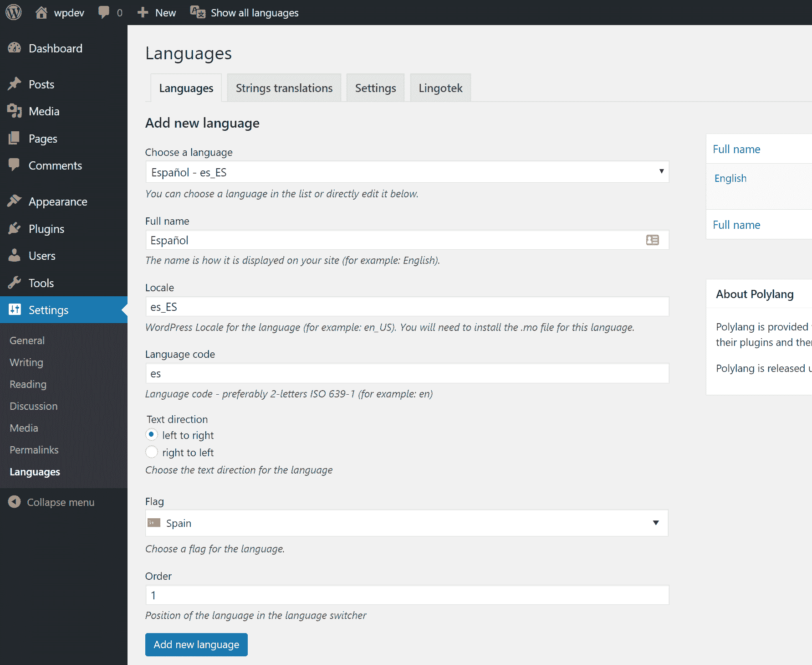

Add Spanish language


### 第四步

接下来点击 PolyLang 的“设置”选项卡，在 URL 修改部分，您将希望启用“隐藏默认语言的 URL 语言信息”选项这将从您的英语语言 slugs 中去除/en/

Struggling with downtime and WordPress problems? Kinsta is the hosting solution designed to save you time! [Check out our features](https://kinsta.com/features/)

```
English Version: https://kinsta.com/about-us/
Spanish Version: https://kinsta.com/es/sobre-nosotros/
```


Hide language URL for the default language


### 第五步

接下来，是时候添加一个西班牙语翻译了。默认情况下，每种语言都会有一个新的栏(标志),出现在 WordPress 仪表盘的“所有帖子”部分。单击+号添加西班牙语版本。(你也可以在每篇文章中这样做)

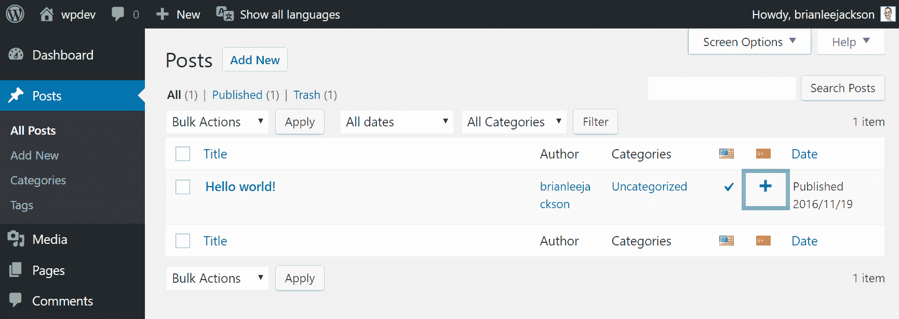

Add Spanish translation


### 第六步

如果你想的话，你可以把你的帖子和网址翻译出来。出于搜索引擎优化的目的，最好使用母语的 slug。Yoast SEO 与 PolyLang 完全兼容，所以也要确保你的标题标签和元描述也被翻译。然后点击“发布”

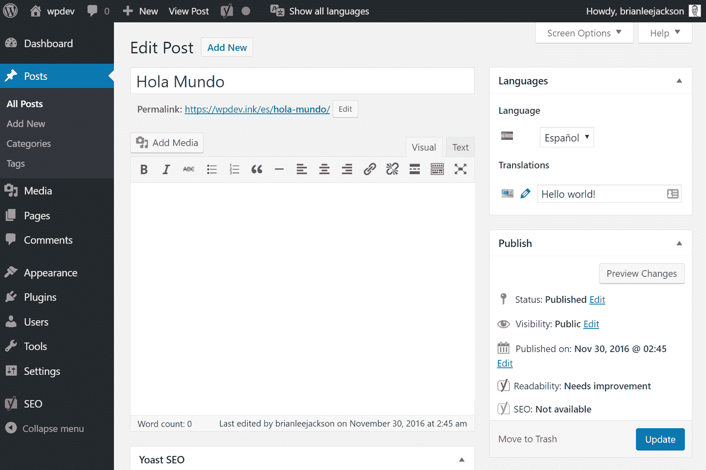

Spanish post URL


也就这样了！现在你在你的 WordPress 仪表盘上有了单独的帖子，每个帖子都可以通过他们自己的本地语言 URL 访问。PolyLang 会自动添加适当的 hreflang 标签，因此您不必担心这些问题。

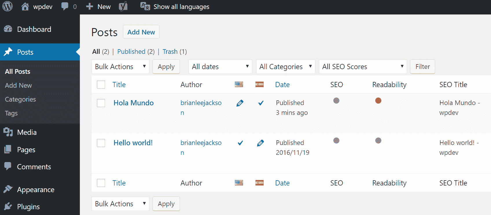

Separate language posts


您还需要浏览您的类别和菜单，并创建西班牙语版本。然后在“字符串翻译”部分，您可以翻译其他项目。

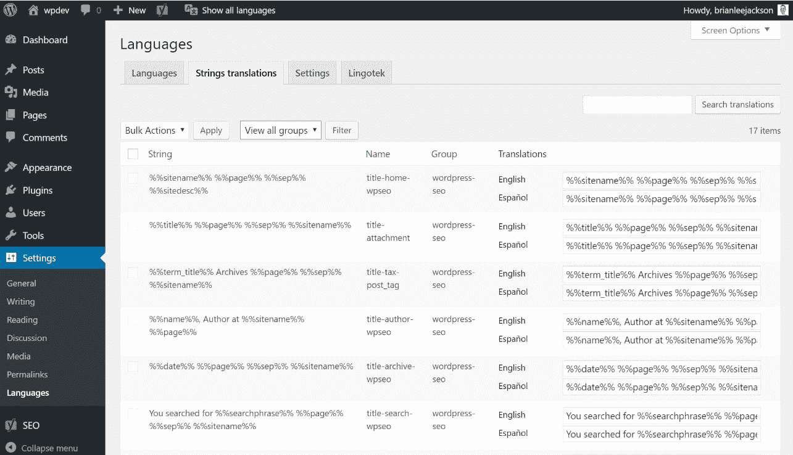

String translations in Polylang


如果你愿意，你也可以使用 PolyLang 的语言切换工具。

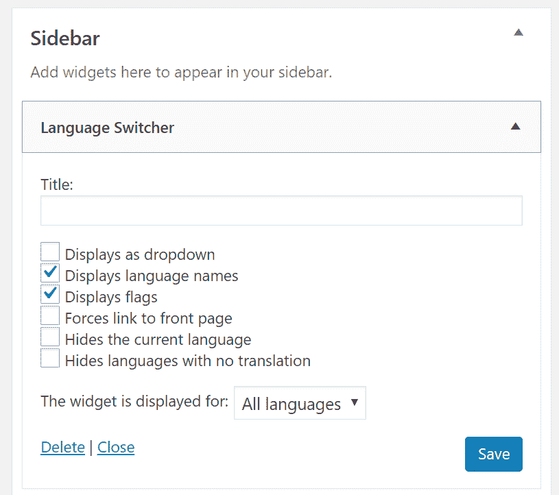

Polylang language widget


同样重要的是要注意，如果有人从一个索引西班牙语帖子点击你的网站，并在 domain.com/es/*登陆，那么下次他们访问你的网站时，它将自动转到你的网站的西班牙语版本。反之亦然。

## 选项 2–使用 Weglot 的高级 WordPress 多语言设置

如果你正在寻找翻译整个 WordPress 网站的最快方法，那么你必须看看 [Weglot](https://wordpress.org/plugins/weglot/) ！字面意思，5 分钟左右就可以搞定。这是市场上一个较新的插件，作为翻译服务，你必须支付月费。他们发展迅速，非常受欢迎，最近月收入超过了[1 万美元](https://wptavern.com/weglot-multilingual-wordpress-plugin-passes-e10000-in-monthly-revenue)。

Weglot 可以即时翻译你的网站。虽然一开始听起来可能不好，但我们对他们的翻译质量印象深刻。当然，它并不完美，但是如果你想改进的话，它们可以让你编辑你的翻译。你没有这个选项与其他谷歌翻译的替代品。

[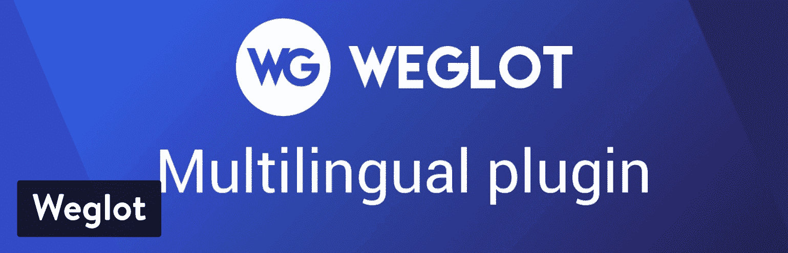](https://wordpress.org/plugins/weglot/)

Weglot multilingual WordPress plugin


该插件目前有超过 20，000 个活跃安装，令人印象深刻的 5 星评级，并由开发者积极更新。你可以从 WordPress 知识库下载 [Weglot](https://wordpress.org/plugins/weglot/) ，或者在你的 WordPress 仪表盘[的“添加新插件](https://kinsta.com/knowledgebase/how-to-install-wordpress-plugins/)下搜索它。他们有一个基本的免费计划，价格从每月 10 美元开始。以下是插件和/或服务的功能列表:

*   翻译页面上的每个字符串(窗口小部件、页脚项、菜单项，你说出它的名字，它就翻译它)
*   不需要编码或复杂的设置。几分钟内即可启动并运行。
*   内容被自动检测和翻译。
*   一个仪表板来管理您的所有翻译，编辑和改善机器翻译提供。
*   SEO 就绪，并在新的语言中优化:翻译后的页面将有自己的专用网址，遵循谷歌最佳实践指南的多语言(hreflang 标签自动创建)。
*   联系专业翻译订购专业翻译(正在开发中)。
*   可定制的语言切换器按钮。
*   从翻译中轻松排除字符串和页面的选项。
*   有 60 多种翻译语言可供选择。

Weglot 确实遵循了 Google 推荐的最佳实践，使用 hreflang 标签并自动为您更改< html >标签语言属性。注意:我们发现这个插件唯一的缺点是它不允许你翻译你的 URL(slugs)。但是，你要权衡一下这样做的利弊。在几天内翻译整个网站并开始索引可能会更有好处。

按照下面的步骤在你的 WordPress 站点上配置 Weglot 插件。在我们的例子中，我们建立了一个有英语和西班牙语翻译的网站。

### 第一步

在 weglot.com 注册一个免费账户。

### 第二步

安装并激活插件后，你需要在你的 WordPress 仪表盘的“Weglot”中设置主要配置。你可以从你的 [Weglot 的账户页面](https://weglot.com/account)获取你的 API 密匙。在我们的例子中，我们的默认网站是英文的，我们想要一个西班牙语翻译。所以我们输入 es 作为目的语言。其他一切我们都保持默认，然后单击“保存更改”

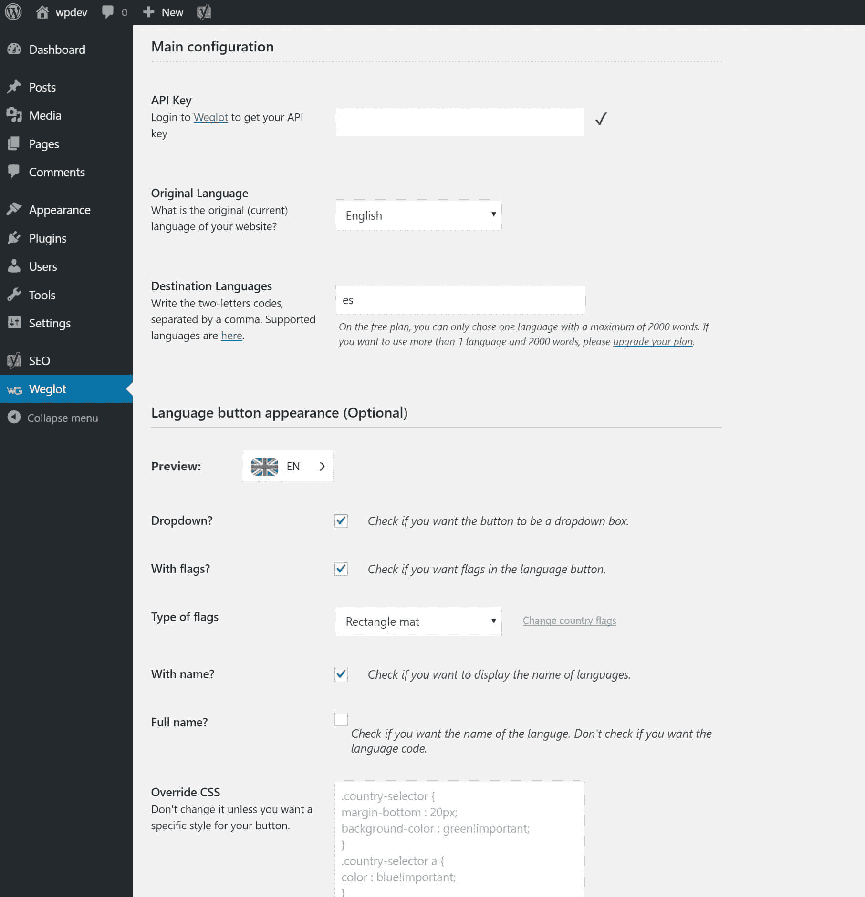

Weglot configuration


信不信由你，这就是全部！如果你浏览你的主页，你会在右下角看到一个语言切换器。

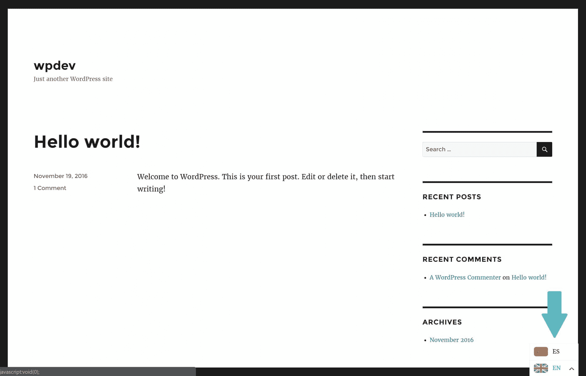

Language switcher


如果我们把它转换成西班牙语，这就是它的样子。正如你所看到的，它翻译了网站的署名、文章内容、小部件内容、搜索框、小部件标题等。它还翻译你所有的搜索引擎优化和元信息。

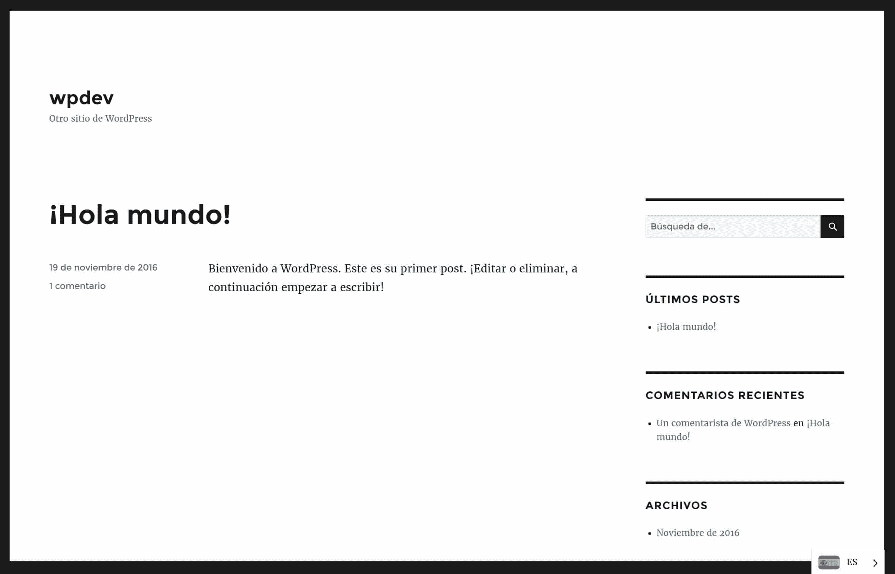

Weglot Spanish version


如果您对任何翻译字符串不满意，您可以从 Weglot 仪表板编辑它们。这包括将图像 URL 文件名更改为西班牙语的能力。

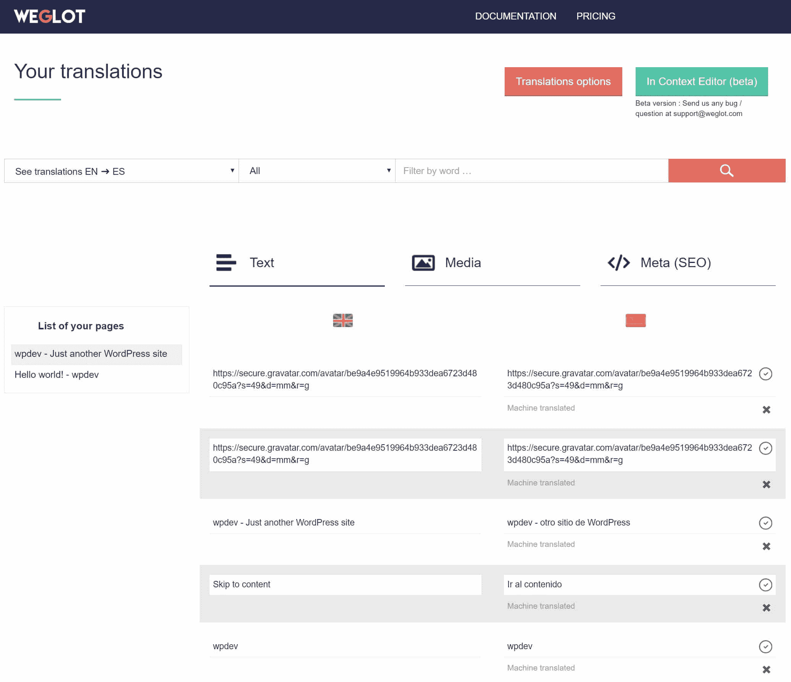

Weglot translation dashboard


就像 Polylang 一样，它有一个可以使用的语言切换小工具。

## 选项 3-自定义 WordPress 多语言设置

第三种选择，也是我们在金斯塔所做的，就是自己动手。😄公平的警告，这将需要一些自定义开发。但是你可以雇佣一个 WordPress 开发者来帮你做这件事。从长远来看，自定义设置可能是有利的，因为您可以完全根据需要构建工作流。

我们知道我们将推出许多语言，所以为了使管理更容易，我们采用了一种 [WordPress multisite](https://kinsta.com/blog/wordpress-multisite/) 的方法。如果你已经有了一个 WordPress 站点，你可以将现有的站点转换成多站点。使用 multisite 实现多语言的一些优势包括:

*   **No need for separate login credentials**. Multisite user profiles are shared across all subsites. This makes bouncing around between 10 different languages a breeze.

    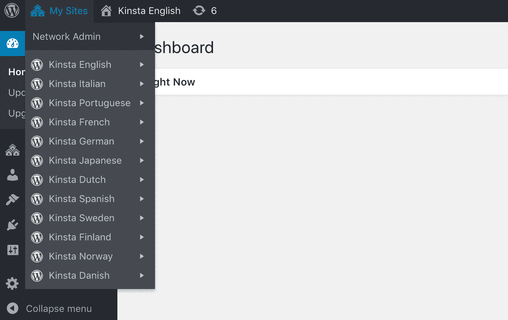

    多国语言

    

*   就管理费用而言，多站点设置被视为每个安装一次。例如，你可以有一个有 10 个子站点的多站点，这仍然被认为是一个安装，因为网络中的所有子站点共享相同的 [WordPress 数据库](https://kinsta.com/knowledgebase/wordpress-database/)和安装。因此，从技术上来说**需要的资源更少**，需要管理的东西也更少。

### 翻译和 hreflang 标签的自定义链接

如果你正在开发一个定制的解决方案，你首先需要的是在 WordPress 仪表盘上链接翻译的方法。我们的内部开发人员创建了一个简单的解决方案，允许您链接现有帖子和页面的翻译，以及将整个帖子复制到新的子网站进行翻译。

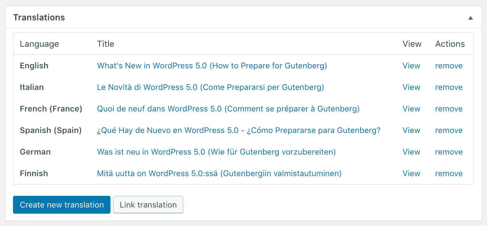

Linking translations in WordPress


当帖子在后端链接时，hreflang 标签会自动生成，用于 SEO 目的，并让 Google 知道哪个版本是哪个语言。

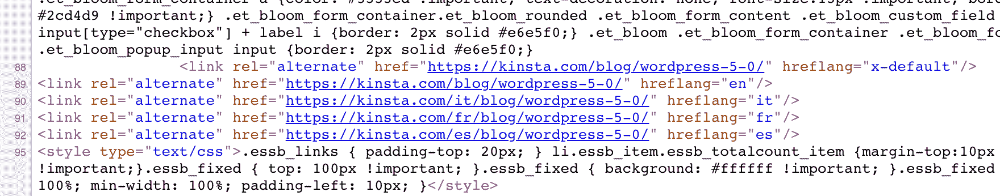

hreflang tags on multisite


它还与我们在网站页脚处构建的语言切换器相关联。这使得访问者可以在需要时轻松切换到他们自己的语言。


Language switcher


### 内容翻译

在翻译方面，我们网站的西班牙语版本很容易，因为我们内部的西班牙语团队翻译了我们所有的内容。对于其他网站，我们与讲母语的人进行一对一的交流。我们从不做任何不合标准的事情，因此在高质量的翻译上投入了大量的资金。

金斯塔的一些网站，如我们的主页，关于我们的网页等。位于 WordPress 中，但是完全由自定义代码编译。我们使用一个名为 [Crowdin](https://crowdin.com/) 的工具来确保所有的内容更新和更改都被翻译。

至于 WordPress 编辑器中的内容，比如我们的博客文章，我们的开发者构建了一个很棒的 WordPress 到 Trello 的集成。它基于 WordPress 修订历史。基本上，每当网站的英文版本发生变化时，我们会将其推送到相应的语言 Trello 板，翻译人员可以检查修订历史，查看发生了什么变化。

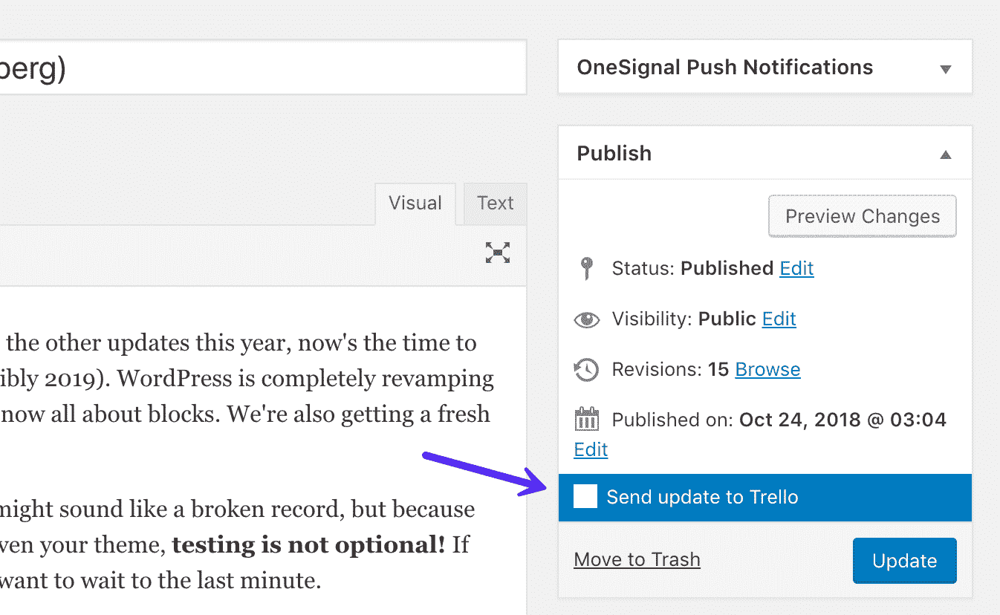

WordPress to Trello multilingual solution


如果你的企业可以接触到 WordPress 开发者和说第二语言的人，这可能是最好的方法，因为你可以完全控制这两个网站的每个方面。使用 WordPress 插件，总会有一些限制或问题，你必须解决。对于大多数企业来说，虽然这可能不是一个选项，所以插件路线肯定是你最好的路线。

[Take your English content and extend its reach around the globe! 🌎Click to Tweet](https://twitter.com/intent/tweet?url=https%3A%2F%2Fkinsta.com%2Fblog%2Fwordpress-multilingual%2F&via=kinsta&text=Take+your+English+content+and+extend+its+reach+around+the+globe%21+%F0%9F%8C%8E&hashtags=SEO%2Cmarketing)

## 可选的 WordPress 多语言插件

我们不可能在本指南中涵盖所有插件，但是除了上面提到的 Polylang 和 Weglot，还有一些其他的 WordPress 多语言插件绝对值得一提:

*   WPML: 可能是市场上最强大的多语言插件之一。如果你正在寻找更多的定制选项，你应该看看这个。
*   [多站点语言切换器](https://wordpress.org/plugins/multisite-language-switcher/)
*   [q 平移 X](https://wordpress.org/plugins/qtranslate-x/)
*   [GTranslate](https://gtranslate.io/)
*   [translate press–多语言](https://wordpress.org/plugins/translatepress-multilingual/)
*   [多语言按下](https://wordpress.org/plugins/multilingual-press/)
*   [传送这个翻译](https://wordpress.org/plugins/conveythis-translate/)

## 如何测试你的 hreflang 标签

当你用多种语言配置了你的 WordPress 站点后，建议你测试一下配置。你当然可以检查你的源代码。但是，也有一些很棒的工具可以提供帮助。首先是 [flang](http://flang.dejanseo.com.au/) ，其实是 Yoast 团队推荐的。只需输入您的域名，它将验证您的标签。

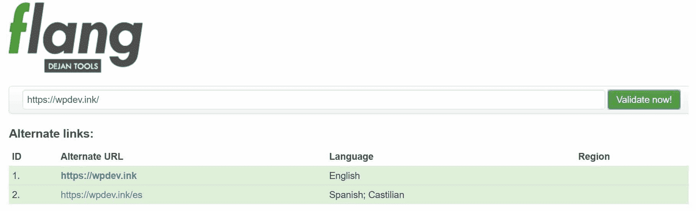

flang hreflang test tool


如果你想更深入一点，TechnicalSEO.com 的 hreflang 标签测试工具也非常有用。

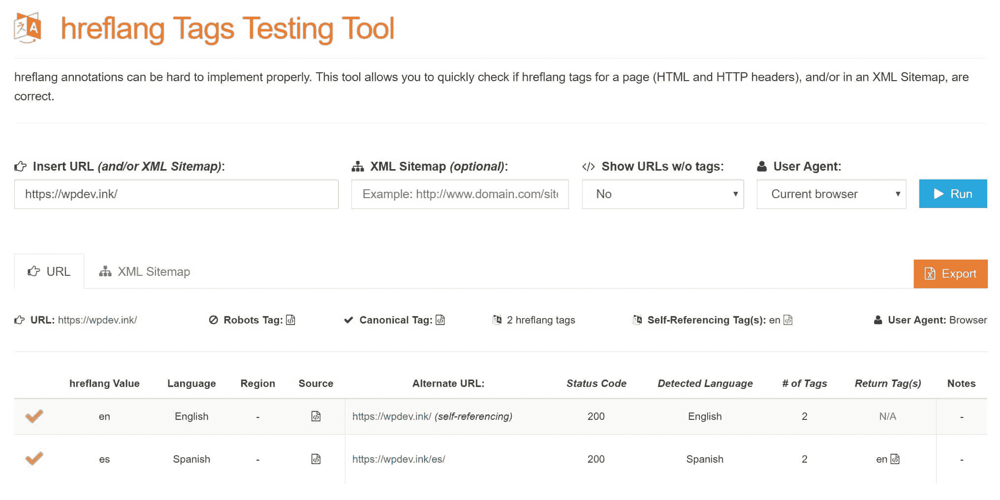

hreflang tags testing tool


[谷歌搜索控制台](https://kinsta.com/blog/google-search-console/)也会在“搜索流量→国际定位”下报告您的 hreflang 标签是否有任何错误请记住，添加其他语言后，搜索控制台中的数据可能需要几天甚至一个月才能跟上。所以要有耐心。

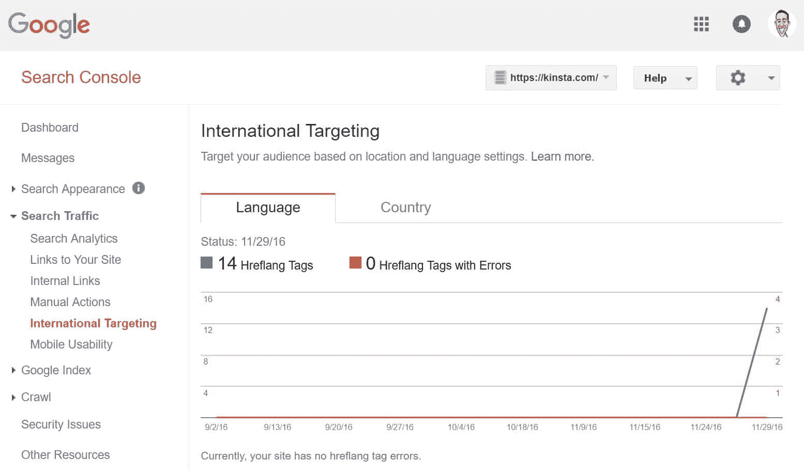

Google Search Console international targeting


## 使用多种语言的谷歌分析

现在你有了一个 WordPress 多语言网站，你必须弄清楚如何[配置 Google Analytics](https://kinsta.com/blog/google-analytics-wordpress/) ,这样一切才不会一片混乱。这可以通过很多不同的方式来设置，其中一些取决于网站所有者的偏好。有些人甚至把他们分成完全不同的谷歌分析账户。但是下面有一个选项，使用新语言的第二个视图和过滤器来包括和排除流量。

### 第一步

在您的主个人资料下，在 Google Analytics 中创建一个新视图。你可以称之为“西班牙语交通”或任何你的额外语言。

### 第二步

回到您的默认视图，创建一个过滤器，**将包含您的新语言的子目录**的流量排除在外，比如/es/。

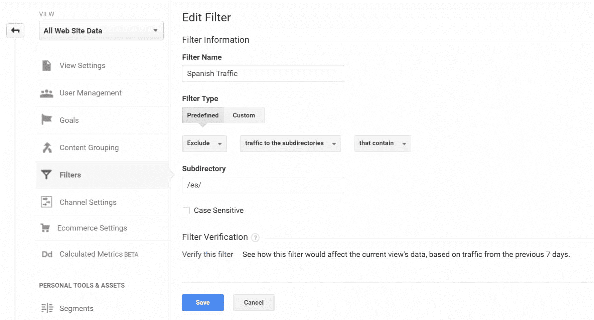

Exclude Spanish traffic


### 第三步

然后在您的新视图中，创建一个过滤器，**只包含到子目录**的流量，该子目录包含您的新语言，比如/es/。

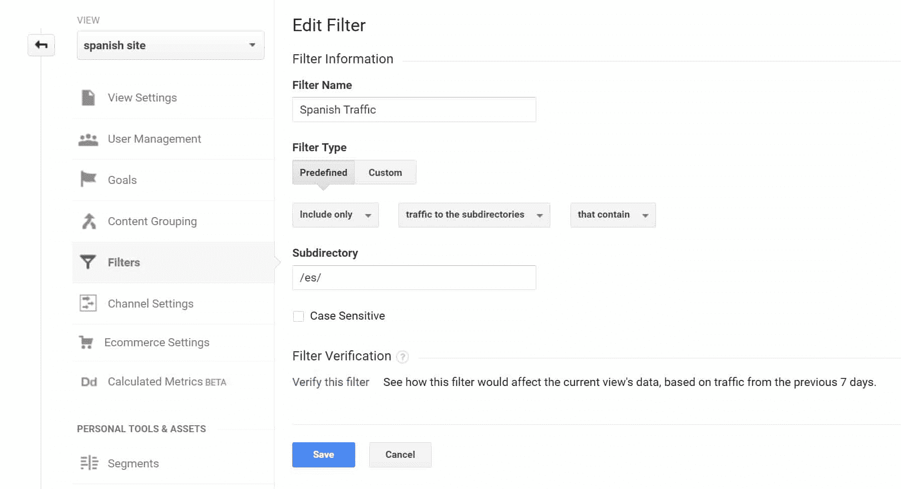

Include only Spanish traffic


然后，您可以着手为每个视图创建目标和事件。如果你使用的是 [WordPress 子域名](https://kinsta.com/blog/wordpress-subdomain/)而不是子目录，只需在你的过滤器中使用“到主机名的流量”即可。

## 摘要

当你第一次进入 WordPress 多语言设置时，可能会有点困惑。尤其是因为你可以选择很多不同的方向，而且没有正确或错误的选择。但是不要让这吓走你，因为好处肯定大于坏处。只要你遵循谷歌的建议，比如利用 hreflang 标签和最佳 SEO 实践，你肯定会有更好的机会让多语言流量激增，而不是减少。

我们错过了什么重要的事情吗？或者，您可能有自己的经验想要分享，因为它与多语言设置有关。如果是这样，我们很乐意在下面的评论中听到。

* * *

让你所有的[应用程序](https://kinsta.com/application-hosting/)、[数据库](https://kinsta.com/database-hosting/)和 [WordPress 网站](https://kinsta.com/wordpress-hosting/)在线并在一个屋檐下。我们功能丰富的高性能云平台包括:

*   在 MyKinsta 仪表盘中轻松设置和管理
*   24/7 专家支持
*   最好的谷歌云平台硬件和网络，由 Kubernetes 提供最大的可扩展性
*   面向速度和安全性的企业级 Cloudflare 集成
*   全球受众覆盖全球多达 35 个数据中心和 275 多个 pop

在第一个月使用托管的[应用程序或托管](https://kinsta.com/application-hosting/)的[数据库，您可以享受 20 美元的优惠，亲自测试一下。探索我们的](https://kinsta.com/database-hosting/)[计划](https://kinsta.com/plans/)或[与销售人员交谈](https://kinsta.com/contact-us/)以找到最适合您的方式。