# 如何选择域名(脱颖而出的 8 个技巧)

> 原文：<https://kinsta.com/blog/choose-domain-name/>

你的域名就是你的数字街道地址。即使你披上一件新的设计外衣，在垃圾邮件区得到错误的地址，你也可能在顾客看到你的网站之前失去他们。

然而，找到正确的地址，你的地址就会为访客打开大门，让他们进来并停留一段时间。它从地址栏开始灌输一种专业和优雅的感觉。

而且随着[近 2](http://www.internetlivestats.com/total-number-of-websites/) [*十亿*](http://www.internetlivestats.com/total-number-of-websites/) [网站](http://www.internetlivestats.com/total-number-of-websites/)的流通，对完美域名的竞争比以往更加激烈。那么，你如何为你的网站挑选一个完美的名字呢？我们有八个可靠的建议来告诉你如何选择一个最适合你的目标的域名。

这是我们今天要讲的内容:

*   [域名里有什么？](#domain-name)
*   [选择最容易记忆的组合](#easy-combination)
*   [让您的地址便于移动使用](#mobile-friendly)
*   [添加关键字(有意义时)](#keywords)
*   [选择品牌域名](#brandable)
*   [注册前清除法律字段](#legal)
*   [选择右边的分机](#extension)
*   [寻找域名的工具](#find-domain-name-tools)
*   [获取现有或过期的域名以提前跳转](#expired-existing-domain)

事不宜迟，让我们来讨论一下什么是域名*什么是*以及为什么一朵玫瑰换成其他名字就不那么甜美了。

## 域名里有什么？

当我们提到域名时，我们特指“https”和扩展名(“.com”)。也就是说，我们的域名是“Kinsta”以下是解析域名的可视化布局:

Domain name ([BrandYourself](https://brandyourself.com/blog/complete-guide-to-personal-domain-names/))

现在，让我们用一个简短的历史插曲来回答这个莎士比亚式的问题:域名中的*是什么？*

> Kinsta 把我宠坏了，所以我现在要求每个供应商都提供这样的服务。我们还试图通过我们的 SaaS 工具支持达到这一水平。
> 
> <footer class="wp-block-kinsta-client-quote__footer">
> 
> 
> 
> <cite class="wp-block-kinsta-client-quote__cite">Suganthan Mohanadasan from @Suganthanmn</cite></footer>

[View plans](https://kinsta.com/plans/)

在互联网(非常)初期，域名最初没有被使用。取而代之的是，用户将 IP 地址与特定的网站联系起来，并输入一串数字，如 192.168.0.1。

显然，一旦互联网开始发展，这就变得很难管理了。

单词比数字串更容易记忆，它作为一种访问网站的新方法进入了流通领域。[域名](https://www.networkworld.com/article/3268449/internet/what-is-dns-and-how-does-it-work.html)就这样诞生了。

按照我们的地址类比，你的域名是你网站的地址，但是[域名网络系统](https://kinsta.com/knowledgebase/what-is-dns/)与之通信的 [IP 地址](https://kinsta.com/tools/what-is-my-ip/what-is-my-ip/)是 GPS 坐标。

两者都可以带你去同一个地方，但其中一个更容易被人类找到。以这个地址为例:[www.dogs.com](http://www.dogs.com)。

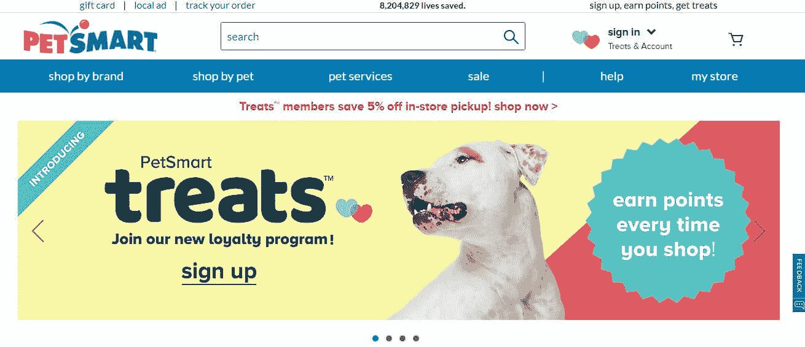

PetSmart different domain name

如果你点击它，你可能会非常惊讶地发现 [PetSmart](https://www.petsmart.com/) load。(可能还有点羡慕。)

像上面例子中的强域名可以帮助人们找到你的网站，而不需要任何干预。不需要复杂的数字串或搜索引擎。

不幸的是，在当今这个拥有近 3.324 亿注册域名的时代，你不太可能用这种方法获得更多的关注。Dogs.com 早在 1998 年就注册了。而更令人沮丧的是，[的三分之一。com 域名未使用](https://singaporedatacompany.com/blog/how-many-domain-names-are-unused)。

但是你不能像上面那样抢断一个词，并不意味着你不能想出一个伟大的域名。例如，[www.ukpets.com](https://www.ukpets.com/)将一个地点与一个超级相关的词结合起来。以下是我们已经看到的八个奏效的策略。

## 1.选择最容易记住的组合

域名的出现是因为人类的记忆是有限的。虽然你可以跳过对神经科学的探究，但在选择域名时，你应该记住这些限制。

具体来说，你对工作记忆施加的压力越大，人类就越难完成任务。工作记忆能够保留的信息有一个“缓冲”限制。

Working-memory buffer (Image source: [Nielson Norman Group](https://www.nngroup.com/articles/working-memory-external-memory/))

虽然这似乎是一个非常常识性的限制，但它并不像听起来那样明确。“项目”在人类记忆中的位置取决于项目本身以及它们是否与任何其他记忆系统相关联。

这意味着，尽管“www.catsdogs.com”这样的网址比“www.animalia.com”长得多，但对大多数人来说，它可能更容易记住。

为什么？因为“猫”和“狗”构成了两个项目，而“动物”将需要大多数人记住三个不同的项目:

*   “动物”这个词
*   字母“我”
*   字母 a。

显然，如果一个人有生物学背景，这个例子就站不住脚了，但它阐明了我想表达的观点。

容易记住的东西并不总是简洁，因为识别度会胜过简洁。您的域名元素越容易识别，您的地址就越容易使用，因此也就越有用。

根据经验，尽量将涉及的元素限制在 7 个以内。

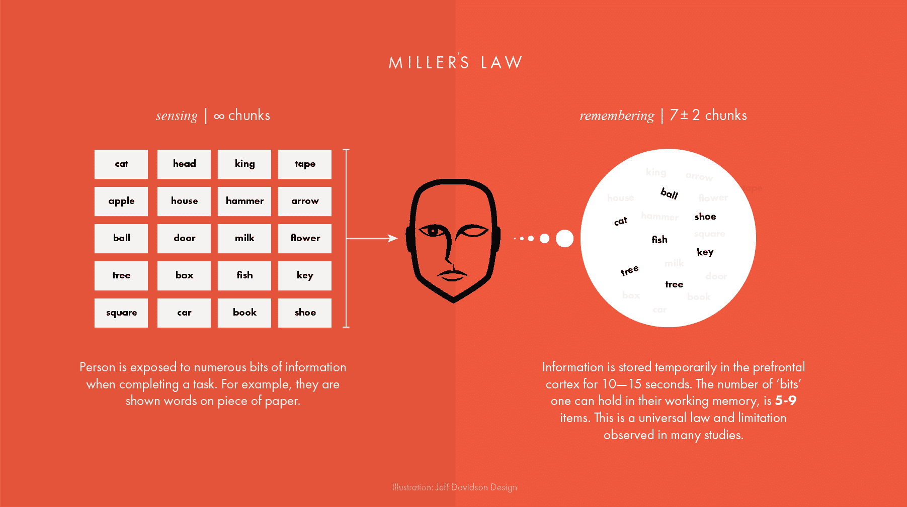

Miller’s Law (Image source: [Prototypr](https://blog.prototypr.io/the-most-important-rule-in-ux-design-that-everyone-breaks-1c1cb188931))

通常被称为“米勒的神奇数字”，过去几十年进行的大量研究发现，短期记忆“块”(元素)的极限是 7，正负 2。

(注意，工作记忆和短期记忆在技术上是分开的实体，但是对于我们的环境和心理学来说，它们互换使用是安全的。)

但是，考虑到人们在记忆更多项目时经历的“缓冲”退化，如果你能把它削减到 7 个以上，那就更好了。

尤其是我们下一步的策略。

## 2.让您的地址适合手机使用

截至 2018 年第二季度，移动设备驱动 **51.89%的互联网流量**。

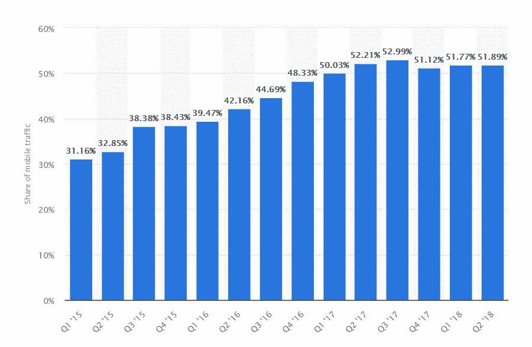

Mobile website traffic (Image source: [Statista](https://www.statista.com/statistics/277125/share-of-website-traffic-coming-from-mobile-devices/))

有趣的是，这一数字较 2017 年第三季度的峰值有所下降，但事实仍然是:

*至少有一半使用你的域名的人会使用移动设备到达那里。*

这意味着你需要考虑到世界上所有的自动更正受害者，并使你的域名尽可能地容易记忆*和*简洁。

我想到的简单、移动友好的域名分别是[谷歌](https://www.google.com/)和[必应](https://www.bing.com/)。它们又短又简单，每个人都知道如何拼写它们。

远非手机友好的例子包括玛莎·斯图尔特的网站和臭名昭著的 T2 动漫展的主页。

虽然这两个域名都很容易记住，但它们因为容易打字错误而失分，而且在动漫展上，需要用户在数字键盘之间切换才能打字。

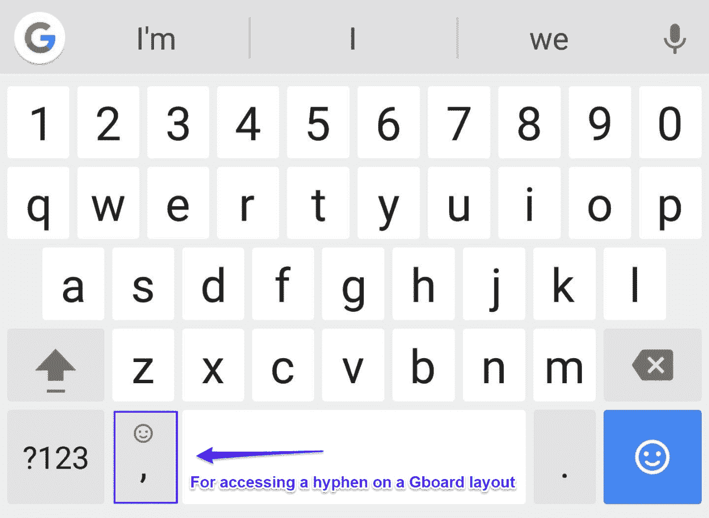

Hyphen mobile domain name (Image source: [GadgetHacks](https://android.gadgethacks.com/how-to/20-tips-help-you-master-gboard-for-android-0176623/))

所以，当你选择域名时，先在你的手机上试一试。打字有多容易？如果你是一个专家级的电话打字者，让一个不那么精明的人在你的电话上试试。

(这是对你的域名进行的最基本的可用性测试，在注册任何域名之前都是一个好主意。)

现在，让我们稍微改变一下话题，谈谈 SEO。

## 3.添加关键字(当有意义时)

域名中的关键词很像华夫饼上的糖粉。

不错的奖金，但不是必需品。如果可以，并且使用关键字是有意义的，你应该这样做。平均来说，63%表现最好的域名在他们的 URL 中有关键词。

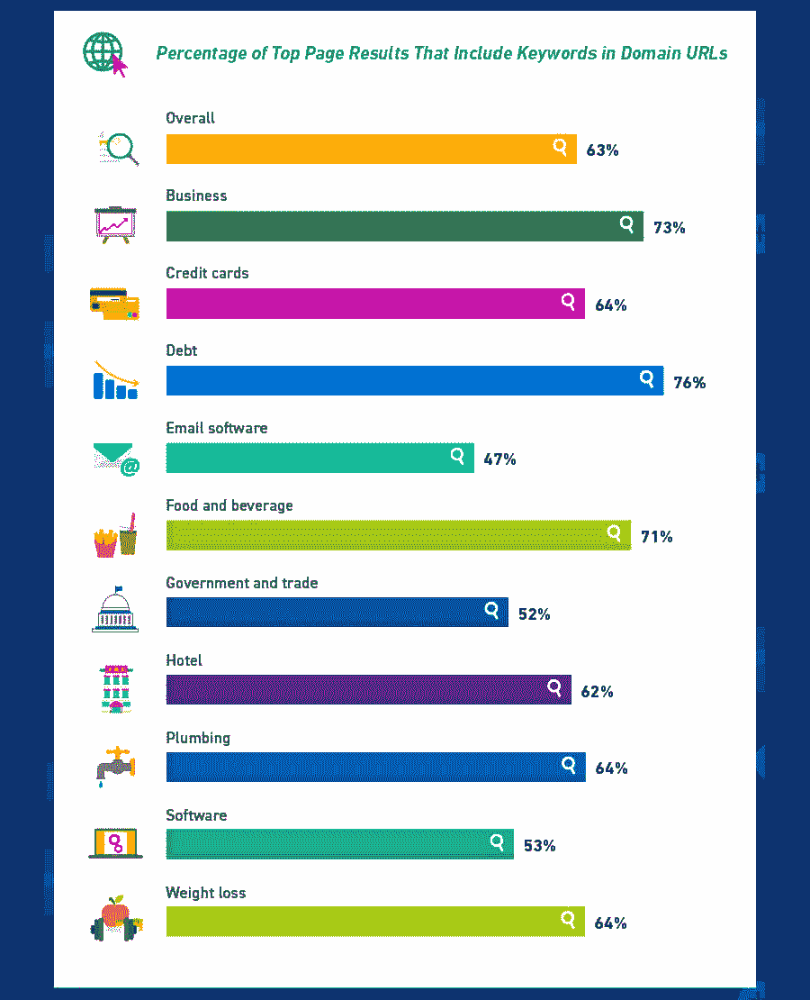

Keywords in domain names ([HigherVisibility](https://www.highervisibility.com/blog/how-valuable-is-it-to-have-a-keyword-in-your-domain-url/))

但是，如果你不能输入一个关键词，它们对你的 SEO 的提升[微乎其微，如果有的话，当你考虑修改你的策略以包含它们时，应该仔细权衡。](https://yoast.com/domain-names-seo/)

Rand Fishkin，SEO 巨头 Moz 的创始人(现在是 [Sparktoro](https://sparktoro.com/) 的领导人)，[对关键词丰富的域名有这样的说法](https://moz.com/blog/how-to-choose-a-domain-name-whiteboard-friday):

> 他们不再像以前那样有影响力，并且有你应该避免的负面联系(与用户和搜索引擎)。

所以，糖粉。适度添加是好的，但没有必要，如果滥用，可能会在你下次网站体检时导致令人失望的结果。

不过，有趣的是，任何想在赌博或游戏行业开设网站的人——特别是堡垒之夜的利基市场——都会希望动作快点。根据 Verisign 的说法，这些关键词在 2018 年 Q2 奥运会上很受欢迎。

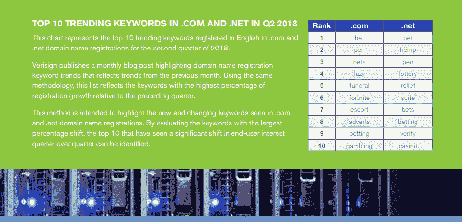

Trending keywords in domain names (Image source: [Verisign](https://www.verisign.com/assets/domain-name-report-Q22018.pdf))

否则，坚持有意义的东西，优先考虑令人难忘的、可打字的和可品牌化的(这是我们的下一个技巧),远在关键词之上。

## 4.选择品牌域名

如果不谈论品牌的重要性，任何域名策略列表都是不完整的。

[77%的顾客](https://domain.me/the-ultimate-guide-to-choosing-a-brandable-name-for-your-startup/)根据产品的品牌进行购买。更疯狂的是，这些决定中有 90%被认为是下意识地基于品牌联想和积极的感觉做出的。

高品牌域名的例子包括亚马逊、IBM 和特斯拉。

不幸的是，选择一个可品牌化的域名并不像我们的其他建议那样简单，但是一个好的测试是大声说出来，看看它听起来是否像一个品牌。例如:

*   lularoe.com
*   不包括:salmonroe.com
*   doreimefashion.com
*   不包括:doreimefasolatido.com

但是如果你在挣扎，这是有市场的，尽管价格不菲。Brandpa 就是这样一个市场。它的最低票价是 1000 美元。

Brandpa

从好的方面来说，你买的东西会有一个标志。用户在观看的前十秒钟内形成印象的东西。(因此，也是对你的品牌的印象。)

## 注册订阅时事通讯

### 想知道我们是怎么让流量增长超过 1000%的吗？

加入 20，000 多名获得我们每周时事通讯和内部消息的人的行列吧！

[Subscribe Now](#newsletter)

另一方面，对于一个新网站来说，这个价格并不低。对于一个稍微更具成本效益的解决方案，你可以看看 [BrandDo](https://www.branddo.com/) ，它的市场提供更多三位数的条目。

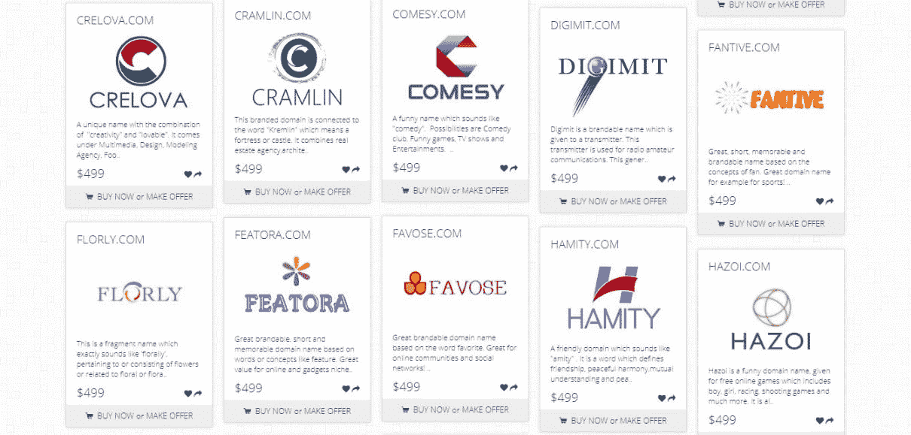

BrandDo

所以，我们已经讨论了你的域名的可记忆性、移动友好性、关键词和品牌准备度的重要性，但是还有一个因素需要考虑——理想的是在你注册之前。

合法性。

## 5.注册前清除法律字段

你已经注册了你的域名…但是你瞧，几个星期后，你收到一封来自律师事务所的停止信，这个人每 30 秒钟赚的钱是你的 5 倍。

这不是一张漂亮的照片，但也不是不寻常的照片。如果你想避免陷入不必要的诉讼，确保你潜在的域名没有被注册商标是绝对必要的。

幸运的是，这很容易检查。对于将在美国运营的网站，您可以通过搜索[美国专利商标局的网站](http://tess2.uspto.gov/)来检查商标状态。

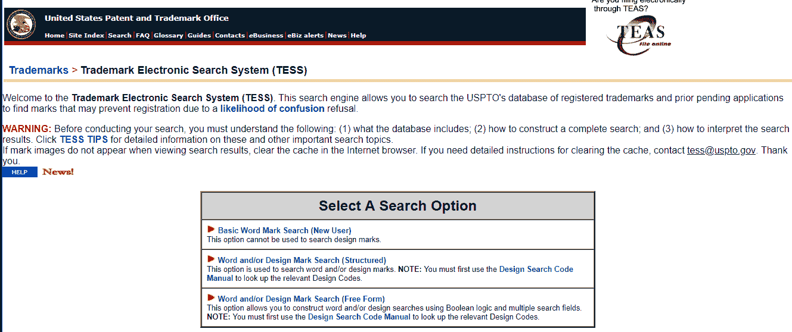

United States Patent and Trademark Office

也就是说，检查二手资料也是个好主意。在 USPTO 系统中导航并不像其他来源那么简单，比如商标 411 或 T2 知识产权组织 T3。

WIPO

说到法律依据，重复两遍也无妨，对吧？尤其是当“信仰”在域名案例法中成为一个决定性因素时，[正如彭博发现的](https://giga.law/blog/2017/6/14/trademark-owner-loses-two-domain-name-disputes-on-same-domain-name)。

考虑商标时要记住的其他事情是消费者混淆。如果你的域名[可能与另一个与之竞争的域名](https://www.nolo.com/legal-encyclopedia/avoid-trademark-infringement-domain-name-29032.html)相混淆，那么你可能会输掉仲裁。

关于 WordPress 的网站怎么样？以下是 [WordPress 团队](https://wordpress.org/about/domains/)对此的评论:

> 出于与我们的 WordPress 商标相关的各种原因，我们询问您是否打算创建一个关于 WordPress 或与之相关的网站，您不要在域名中使用“WordPress”。请尝试使用“wp”或其他变体。我们不是律师，但非常好的律师告诉我们，我们必须这样做，以保护我们的商标。此外，许多用户告诉我们，他们发现它令人困惑。

简单来说，不要冒这个险。

此外，如果您的网站将在美国以外的地区运营，无论是现在还是将来，您都需要熟悉并检查这些国家的商标。

这让我们想到了选择域名的最后一个策略:弄清楚它的结尾是什么。

## 6.选择正确的分机

[伟大的顶级。com](https://kinsta.com/knowledgebase/what-is-a-tld/) 仍然是[域名扩展](https://kinsta.com/blog/domain-extensions/)的王者，无论是 [SEO](https://novanym.com/pages/why-com-is-the-best-domain-extension-for-seo) 还是记忆性。

但是现在的域名扩展比以前多了很多，如果有策略地使用，你应该不会有任何问题。

实际上，他们的增长非常迅猛。从 2016 年到 2017 年，新的“非传统”扩展增长了 [145%。](https://thedna.org/numbers-namescon-dnas-domain-name-industry-growth-report/)

Struggling with downtime and WordPress problems? Kinsta is the hosting solution designed to save you time! [Check out our features](https://kinsta.com/features/)

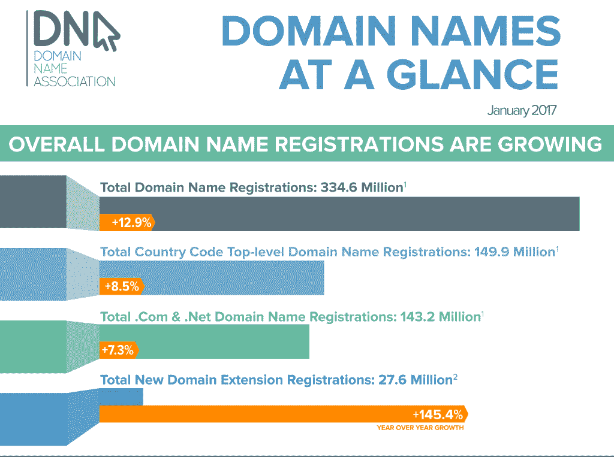

Domain extensions growth (Image source: [The Domain Name Association](https://thedna.org/numbers-namescon-dnas-domain-name-industry-growth-report/))

所以当。目前，延伸世界的趋势正在改变。这对一个新网站来说是个好消息。

因为新的域名后缀。xyz，。技术。纽约市等。—比传统的顶级域名要便宜得多。

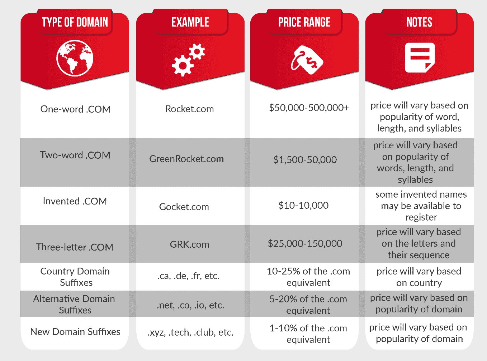

Price range domain extensions (Image source: [Name Ninja](https://www.nameninja.com/startup-domain-name-price-guide.html))

负担能力是一个因素，除非你是一个庞然大物，否则必须与其他因素相平衡。

如果你能以一个合适的价格买到一个. com 网站，这是可能的，只要它满足这里列出的所有其他要求，你就应该去买。

如果没有，你最好选择一个新的域名扩展。鉴于这种趋势，它的可接受性只会随着时间的推移而增加，就像国产葡萄酒一样。

想知道在哪里注册您的新域名？查看一下像[Name.com](https://www.name.com/)、[谷歌域名](https://kinsta.com/blog/google-domains-review/)、 [NameCheap](https://www.namecheap.com/) 和 [eNom](http://www.enom.com/) 这样的地方。

最终，扩展的试金石将取决于你的域名与这里列出的其他因素的紧密程度，如品牌、记忆和打字。

如果它在手机上不太容易打印或者不容易记住，你真的不能跳过。com，但如果是，[。co 在商业领域和中级网站越来越受欢迎](https://w3techs.com/technologies/details/tld-co-/all/all)。

这是我们选择域名的策略，尽管下一个策略可以被认为是一个额外的策略。如果你想不出一个名字有困难，有各种各样的生成器可以让它变得更容易。

现在让我们来看几个。

## 7.用于查找域名的工具

想出一个满足所有这些要求的域名绝对是说起来容易做起来难。幸运的是，如果你的创意团队需要休息，你可以把一些责任推给发电机。

### 域名轮

DomainWheel 是一个简单易用的域名生成器，由 ThemeIsle 的 awesome 团队开发。只需输入一个关键字，并检查出所有可用的域名。它甚至输出听起来像它的领域，押韵，和随机建议。

[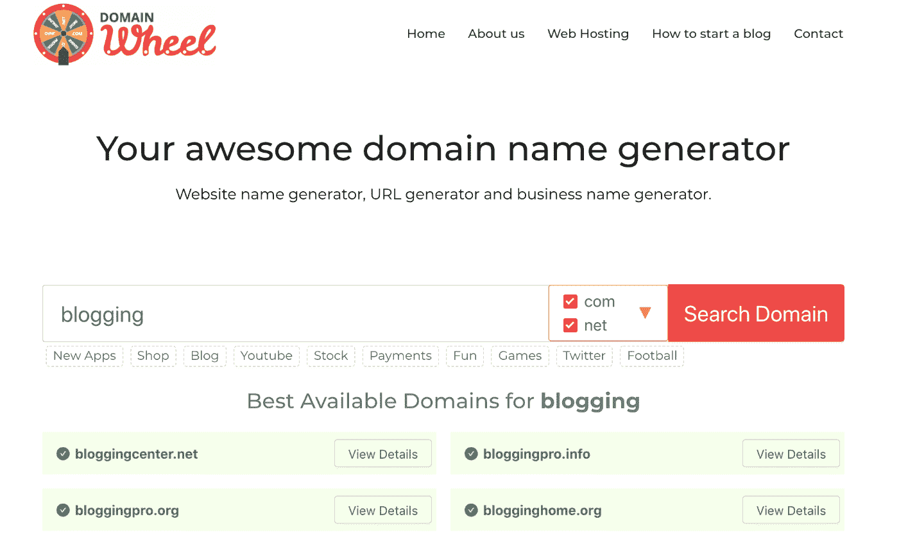](https://domainwheel.com/)

DomainWheel

### 也就是

如果你在寻找完美的。com 域名， [NameQL](https://www.nameql.com/) 一眨眼就帮你找到了。只需在输入栏中键入一个单词或单词的一部分，然后滚动搜索结果。

[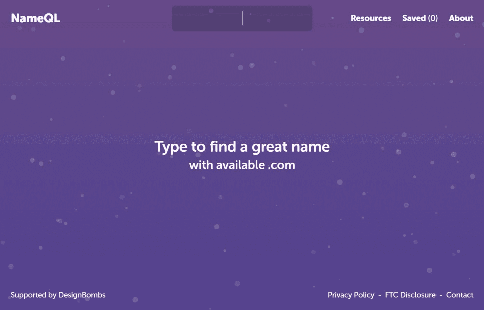](https://www.nameql.com/)

The NameQL homepage.

以下是它为“音乐”生成的结果:

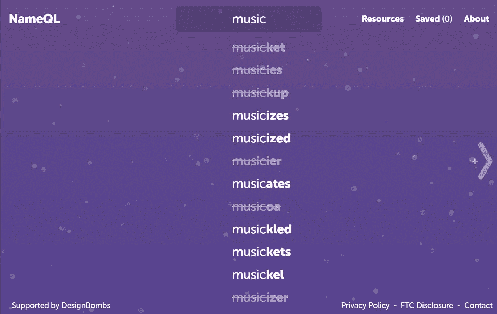

NameQL search results for the word “music.”

如果你在音乐技术行业，你可能想尽快抢到一个域名！

### 打破名声

包括一个令人羡慕的自己的域名， [Bust a Name](http://www.bustaname.com/word_maker) 在设计上与 NameMesh 或 DomainWheel 相比是比较简单的，但结果要快得多，而且非常有创意。

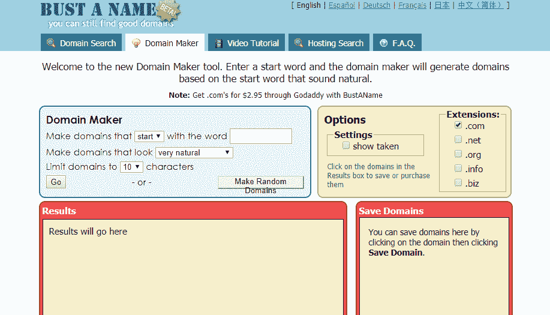

Bust a Name

你只需输入一个单词，选择你的扩展名，点击“Go”按钮，然后等待搜索结果。

这里有一个搜索术语“音频”的例子

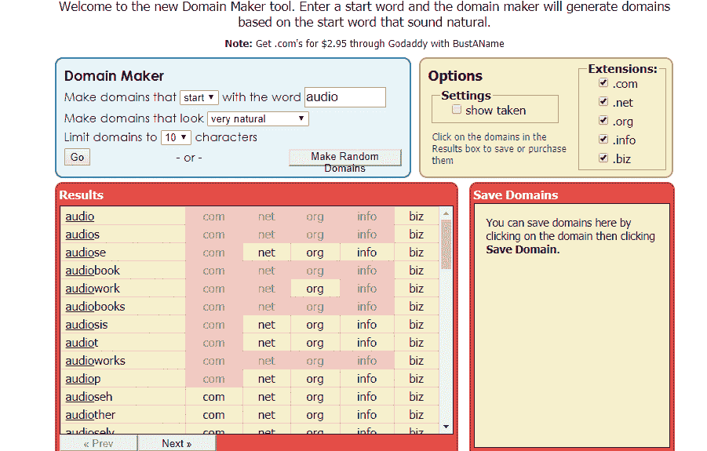

Bust a Name results

它在设计上的不足，通过巧妙的建议和简单性得到了弥补。

记住，如果你发现一个域名很适合使用这些工具或者改变主意，你可以随时[转让你的域名](https://kinsta.com/blog/wordpress-change-domain/)而不会失去你所有的 SEO 好处。

## 8.获取现有的或过期的域名向前跳跃

最后但并非最不重要的，你可能要考虑收购一个现有的域名。为什么？因为现有的域可能已经具有以下一些内容:

*   权威反向链接。使用类似于 [Ahrefs](https://ahrefs.com/) 的工具来检查现有的反向链接。
*   高域权限(Moz)和域评级(Ahrefs)。
*   高 PageRank。[谷歌内部仍然使用 PageRank](https://twitter.com/methode/status/829755916895535104) 。
*   现有流量和品牌。

即使是一点点提升也能让你快速起步，排名更快。你可以使用类似于[过期域名](https://www.expireddomains.net/)或 [Flippa 域名](https://flippa.com/domains)的工具来找到这些。

然而，你也应该非常小心地使用这个策略。首先，确保检查任何现有商标。

其次，如果该域名目前正被一个你试图收购的现有品牌使用，确保检查其流量模式。持续的下降趋势可能意味着它在某个时候受到了谷歌的处罚。或者这可能仅仅意味着他们停止了在这个领域的工作。

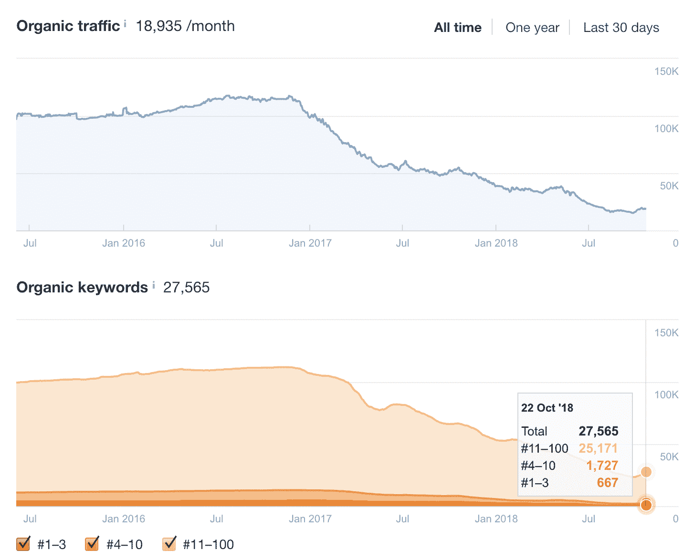

Check traffic

第三，用 Ahref 的站点浏览器工具检查域的当前反向链接。如果大量的反向链接来自垃圾网站，这不是一个好的指标。这可能意味着域名/网站所有者在某个时候为反向链接付费，或者甚至受到负面 SEO 攻击。

再次，当涉及到获取一个现有的领域，确保检查它的所有方面。如果你不知道怎么做，社区里有很多优秀的 SEO 专家可以雇佣。

## 如何选择域名:摘要

域名是你的数字街道地址。他们可以极大地塑造访问者对你的品牌的看法。

不幸的是，大多数像“Dogs.com”这样的热门名字都是在互联网早期使用的。但这并不意味着你不能为你的新网站找到一个好域名。

当你创建一个新的域名时，只需要使用这八个技巧:

*   让它令人难忘。
*   保持移动打字友好。
*   添加关键词…但前提是有意义。
*   选择一个有品牌的域名——它们比宽泛的术语更有价值，也更容易获得。
*   确保你在这个过程中没有踩到任何人的注册商标。
*   选择适当的扩展名。而。com 仍然处于前沿，更新的——也便宜得多——扩展正变得越来越流行，所以它们也值得考虑。
*   如果你绞尽脑汁想取一个名字，使用域名工具生成器。
*   考虑通过收购过期或现有的域名来启动这一过程。

找到一个完美的域名就像找到一首完美的歌曲。最适合你的业务，最能引起用户共鸣的，必然会改变。但是遵循这八条建议，你一定会拥有一个经得起时间考验的域名。

建议阅读:[停放的域名:如何识别，购买，或停放一个。](https://kinsta.com/knowledgebase/parked-domain/)

* * *

让你所有的[应用程序](https://kinsta.com/application-hosting/)、[数据库](https://kinsta.com/database-hosting/)和 [WordPress 网站](https://kinsta.com/wordpress-hosting/)在线并在一个屋檐下。我们功能丰富的高性能云平台包括:

*   在 MyKinsta 仪表盘中轻松设置和管理
*   24/7 专家支持
*   最好的谷歌云平台硬件和网络，由 Kubernetes 提供最大的可扩展性
*   面向速度和安全性的企业级 Cloudflare 集成
*   全球受众覆盖全球多达 35 个数据中心和 275 多个 pop

在第一个月使用托管的[应用程序或托管](https://kinsta.com/application-hosting/)的[数据库，您可以享受 20 美元的优惠，亲自测试一下。探索我们的](https://kinsta.com/database-hosting/)[计划](https://kinsta.com/plans/)或[与销售人员交谈](https://kinsta.com/contact-us/)以找到最适合您的方式。