# WordPress 活动日志——你应该跟踪的 7 件事

> 原文：<https://kinsta.com/blog/wordpress-activity-log/>

当你的 WordPress 网站很小的时候，你很容易就能看到网站上发生的一切。然而，随着它的规模和复杂性的增长，它会变得更加难以跟上。如果你让用户在你的网站上注册，运行一个会员网站，或者有多个贡献者，这一点尤其正确。

无论如何，随时了解网站上发生的事情是至关重要的。您可以通过跟踪用户活动来做到这一点，如内容更改、配置文件更新、登录失败等。当您手边有这样的信息时，您可以快速跟踪任何问题的来源，并保持严密的安全性。

在这篇文章中，我们将简要讨论为什么你想要跟踪你的 WordPress 站点的活动。然后，我们将帮助您找出最需要关注的活动类型。让我们直接跳进来吧！

[Regardless of the size, it's important to know what is happening on your WordPress site at all times. 🔍Click to Tweet](https://twitter.com/intent/tweet?url=https%3A%2F%2Fkinsta.com%2Fblog%2Fwordpress-activity-log%2F&via=kinsta&text=Regardless+of+the+size%2C+it%27s+important+to+know+what+is+happening+on+your+WordPress+site+at+all+times.+%F0%9F%94%8D&hashtags=websec%2CWordPress)

## 为什么使用 WordPress 活动日志至关重要

活动日志可以帮助您跟踪网站的重要变化。

如果你的网站只有一个用户——你——那就没什么好奇怪的了。除非你的 [WordPress 网站被黑了](https://kinsta.com/blog/wordpress-hacked/)(我们稍后会详细讨论)，否则每一次修改和更新都是你自己做的。

WordPress track user activity

然而，许多网站允许不止一个用户注册。例如，你可以鼓励你的访问者注册订阅账户。或者，您可能有一个由作者、开发人员、编辑和第三方承包商组成的完整团队来帮助您创建和管理内容。

不管怎样，有这么多人访问你的网站会导致很多不确定性。找出是谁删除了一篇帖子，或者弄清楚为什么用户档案被修改，并不总是那么容易。如果您担心某个特定的更改是恶意的，或者您只是想知道它为什么会发生，您可能没有好的方法来继续。

这就是为什么跟踪你的 WordPress 网站上的活动如此重要。拥有每个重大变更的活动日志，以及关于变更发生时间和涉及哪些用户的详细信息，使得处理意外事件变得更加简单。即使您是站点上的唯一用户，这种类型的日志也可以帮助您跟踪成功的黑客攻击所导致的更改的来源。

当然，您不能手动维护活动日志。幸运的是，你可以使用一个 [WordPress 活动日志插件](https://www.wpsecurityauditlog.com/)来自动处理这项工作。你需要做的就是在你需要信息的时候查看你的日志。

## WP 安全审核日志

市场上最好的插件之一是 WP 安全审计日志。你可以在 [WordPress 知识库](https://wordpress.org/plugins/wp-security-audit-log/)上下载免费版本。在撰写本文时，它已经有超过 70，000 个活跃安装，并获得了令人印象深刻的 4.5 分(满分为 5 星)。它也由开发人员定期更新。

[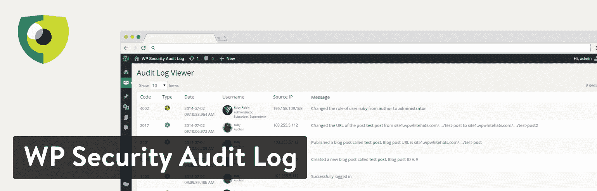](https://wordpress.org/plugins/wp-security-audit-log/)

WP Security Audit Log plugin

还有一个高级版本(每年 89 美元起)，为您提供额外的功能，如报告、即时电子邮件提醒和搜索。但是所有的日志功能都是完全免费的。

### 配置 WP 安全审核日志

在这篇文章中，我们使用的是 WP 安全审计日志的免费版本。安装完成后，激活后首先看到的是配置向导。

### 第一步

点击“开始配置插件”开始。

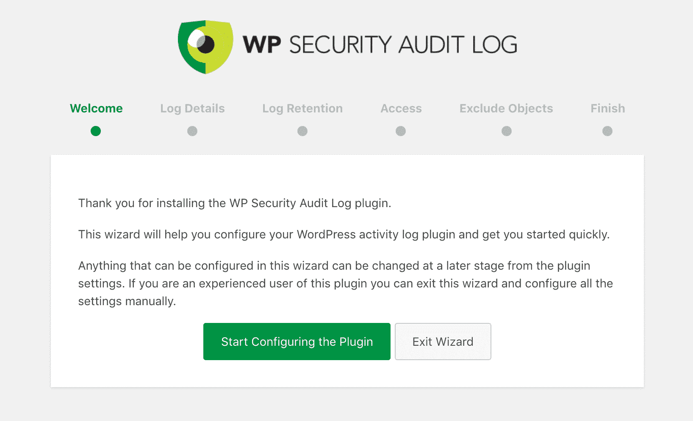

Configure WP Security Audit Log plugin

### 第二步

选择“基本”或“极客”

*   **基本:**如果您只想要基本的记录数据，请选择此选项。
*   如果你想要插件提供的所有数据，选择这个选项。

你可以在以后的任何时候改变这些设置，但是在这个例子中，我们将选择“极客”选项来展示更多的 WP 安全审计日志插件。

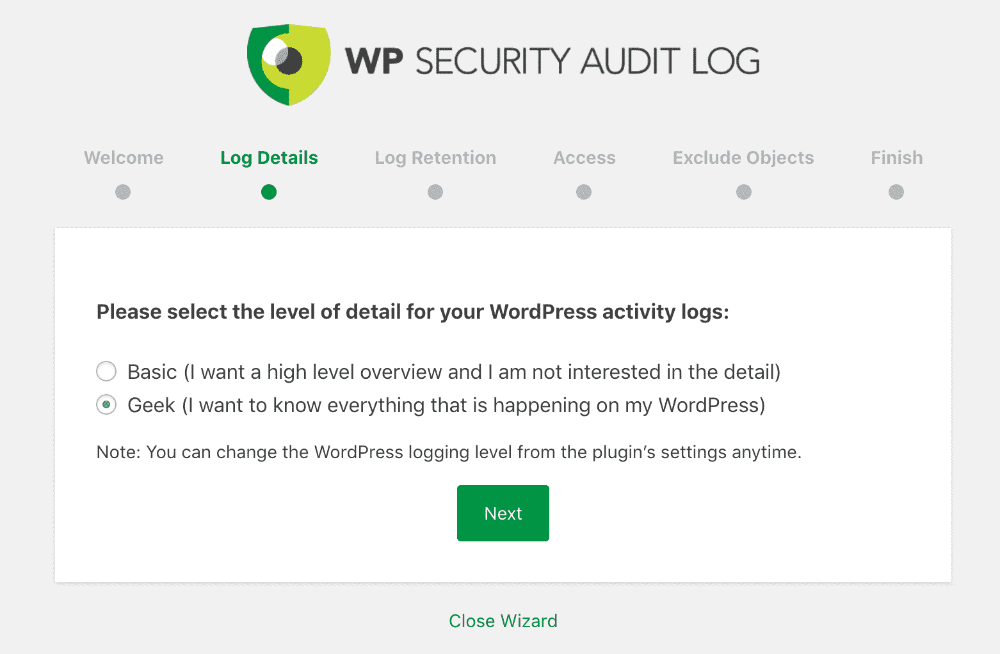

WP Security Audit Log geek settings

### 第三步

接下来，您需要选择保存 WP 安全审计日志数据的时间。对于本例，我们将选择 6 个月。

*   6 个月(超过 6 个月的数据将被删除)
*   12 个月(超过 12 个月的数据将被删除)
*   保留所有数据。

您可以在以后更改它。但是需要注意的是，数据存储在你的数据库中。虽然这是以一种高效的方式完成的，但是你永远不应该存储比你认为你会使用的更多的数据。对大多数人来说，6 个月应该没问题，尤其是当问题出现时，你非常积极地解决问题。

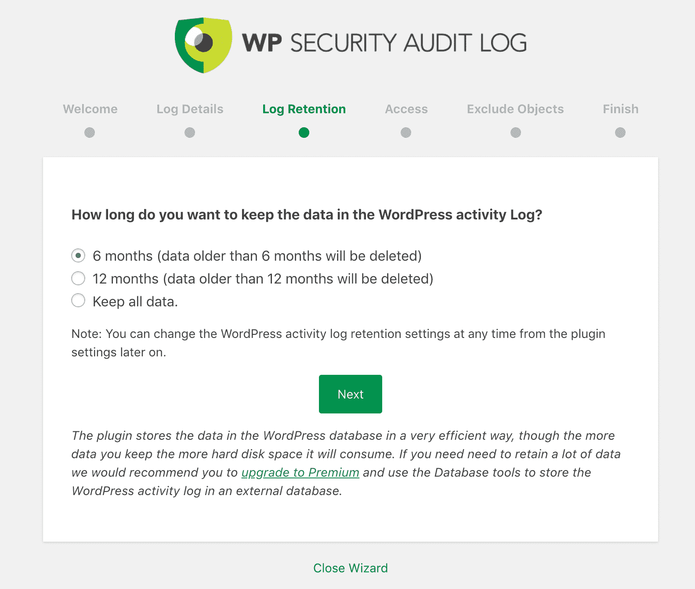

WP Security Audit Log data retention

如果您购买了 WP 安全审计日志的高级版本，您可以保留数据甚至更长时间，甚至可以将它存储在外部数据库中。

### 第四步

下一步是根据需要配置额外的访问权限。默认情况下，只有管理员能够访问 WordPress 活动日志。

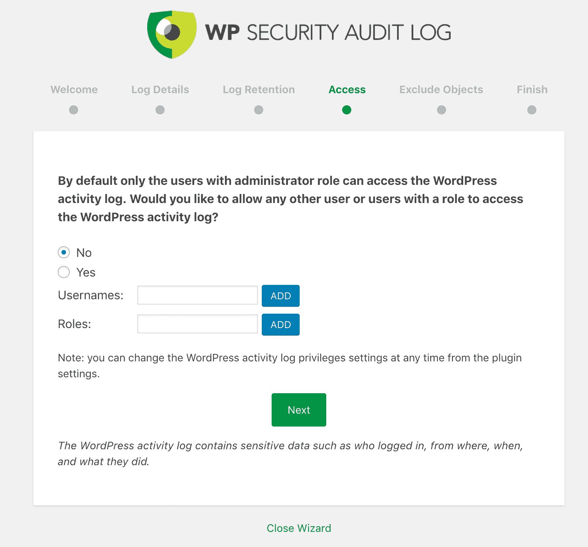

WP Security Audit Log access

### 第五步

在下一个屏幕上，您可以将对象(用户名、角色、IP 地址)排除在记录之外。也许你是 WordPress 网站的唯一管理员，只想看到作者和编辑所做的修改。或者您可能只是想监视登录和帐户注册。不管什么原因，你都可以轻易地将自己排除在数据之外。

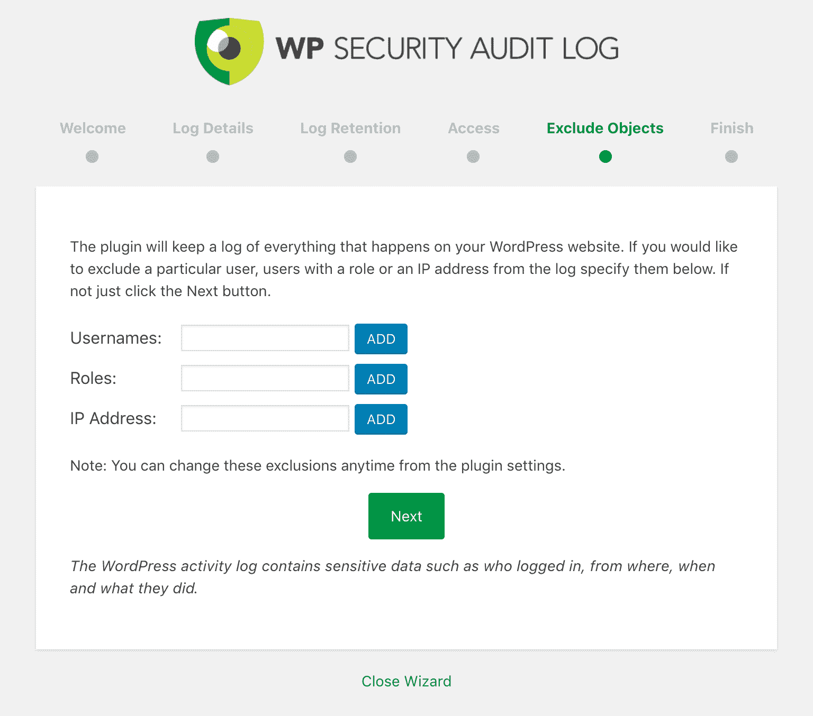

WP Security Audit Log exclude objects

就是这样！为了安全起见，你的 WordPress 站点上的所有更改都将被记录下来。WP 安全审计日志的数据和设置可以在你的 WordPress 仪表盘的“审计日志”菜单中看到。要真正深入了解所有设置，我们建议查看他们的[入门文档](https://www.wpsecurityauditlog.com/support-documentation/getting-started-wp-security-audit-log/)。

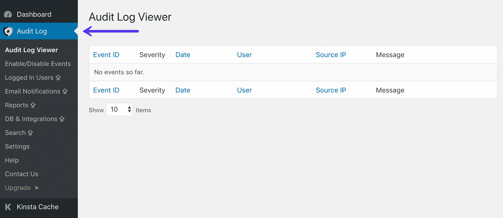

Audit log in WordPress dashboard

这篇文章的其余部分将会强调一些你想要记录在日志中的各种类型的活动。

## 你的 WordPress 活动日志插件应该记录的 7 种变化

即使是最简单的 WordPress 网站也有很多事情要做。其中一些变更和事件比其他的更重要(更有可能表明潜在的问题或安全漏洞)。

在这篇文章的剩余部分，我们将讨论你网站上最重要的七个活动。虽然这不是一个详尽的列表，但是这些是你绝对想要包含在 WordPress 活动日志中的项目。

1.  [内容变更](#changes-to-content)
2.  [新增和删除的用户](#changes-to-users)
3.  [失败的登录尝试](#failed-login-attempts)
4.  [主题或插件的变化](#changes-plugins-themes)
5.  [WordPress 核心和设置更改](#wordpress-core-changes)
6.  [用户档案调整](#user-profile-tweaks)
7.  [多站点设置中网站和用户的变化](#changes-multisite)

### 1.内容的更改

内容是任何成功网站的核心。至少，你的网站将由一个或多个页面组成，如果你想让它们保持相关性，这些页面应该定期更新新的或修改过的信息。

此外，许多 WordPress 网站经常以帖子的形式发布新内容。你可以用你的网站来经营一个博客，发布关于你的企业的新闻文章，或者做其他的事情。一旦你的网站存在了一段时间，**帖子的数量会迅速飙升**。

所有这些内容的质量和准确性是为你的访问者提供价值、增强你的权威以及确保你的听众信任你所说的内容的关键。这都意味着密切关注你的内容是至关重要的。您需要确保新内容和对现有内容的更改都很好地反映在您的网站和/或公司中。

这就是为什么你想在 WordPress 中跟踪所有与内容相关的变化。这包括:

*   创建新页面、帖子或其他[内容类型](https://codex.wordpress.org/Post_Types)。
*   对现有页面或帖子的标题、日期、URL、自定义字段或其他关键变量的更改。
*   现有内容中的修改内容–是否添加、编辑或删除了某些内容。
*   状态更改，如已发布的帖子或返回草稿形式的帖子。

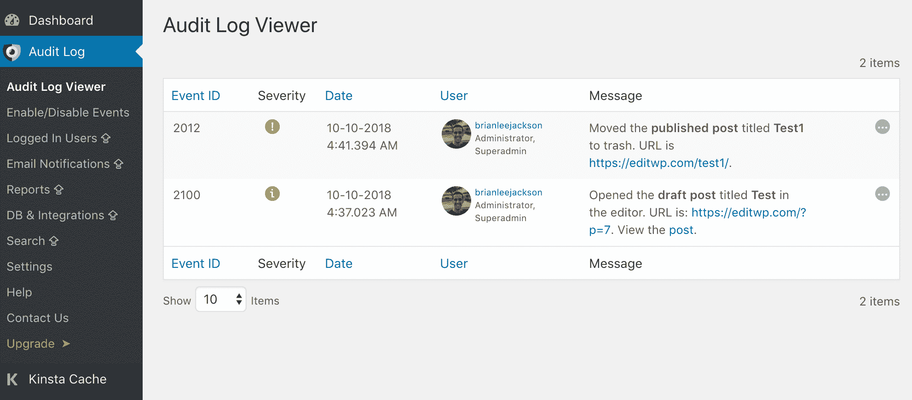

WP Security Audit Log content changes

SEO 是始终关注不断变化的内容的另一大原因。例如，如果一个 URL 在一个有流量和反向链接的热门帖子上发生了变化，而你并不知道，这可能是灾难性的。虽然 WordPress 有内置的重定向功能，并且会尽力尝试重定向到更新的内容，但这并不总是有效。出于性能原因，如果可能的话，您应该始终在服务器级别添加 301 重定向。Kinsta 的[重定向工具](https://kinsta.com/help/redirect-rules/)让这变得超级简单！

## 注册订阅时事通讯

### 想知道我们是怎么让流量增长超过 1000%的吗？

加入 20，000 多名获得我们每周时事通讯和内部消息的人的行列吧！

[Subscribe Now](#newsletter)

在一个活跃的 WordPress 站点上，上述所有的变化都相当有规律地发生，并且通常不是问题。然而，你应该总是为意外的事情做好准备。例如，一篇文章可能发布得太快，或者页面中的某个部分可能被删除。在这些场景中，如果您一直在跟踪网站上的内容变化，您将确切地知道是谁在何时进行了更改(并且能够很好地找出原因)。

### 2.新用户和已删除用户

正如我们之前提到的，许多 WordPress 网站最终会增加一些用户到他们的行列中。这通常是一个繁荣网站的标志，因为你有更多的人参与和工作。

然而，你需要对你的网站的用户群保持一定程度的控制。即使您[启用了开放注册](https://www.templatemonster.com/help/how-to-allow-user-registration-on-your-wordpress-site.html)，您也需要知道谁持有每个用户帐户以及为什么持有。因此，至少，当用户被添加到您的站点或从您的站点中删除时，您会希望注意到这一点。

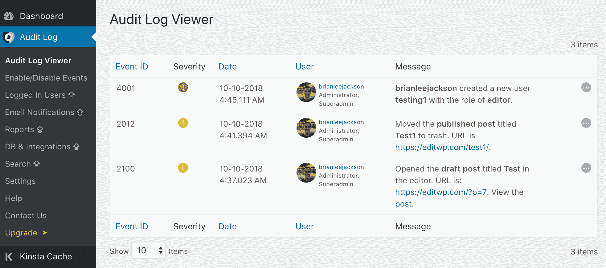

WP Security Audit Log user registrations

跟踪这两种活动很重要。如果一个新用户在你的网站上意外注册，你会想马上知道。如果你不启用开放注册，这可能是一个黑客企图的迹象。对于被删除的用户来说也是一样——同样，这不是你希望意外发生的事情。

### 3.失败的登录尝试

每个人都必须登录才能访问你的 WordPress 管理页面——即使是你。事实上，当涉及到保护你的站点仪表板或“客户保留”页面时，你的登录屏幕形成了至关重要的第一道防线。虽然有多种方法可以尝试并强制访问您的站点，但大多数攻击者会集中精力尝试通过登录屏幕进入。

一般来说，这些尝试第一次不会成功。黑客编写的程序会尝试数千种登录组合，直到找到一种有效的组合。因此，记录失败的登录尝试可以在有人试图以这种方式暴力攻击你的网站时给你一个警告。

当然，每个网站偶尔都会有登录失败的情况。大多数用户经常忘记他们的密码，或者拼错他们的凭证。你要寻找的是来自同一个 IP 地址的重复失败的尝试。如果某个地方的人连续尝试登录几次都失败了，他们可能并没有把你的最佳利益放在心上。

幸运的是，如果您通过活动日志跟踪失败的登录，您将知道尝试了多少次，何时以及来自何处。这可以帮助您追踪来源，并找出它是否是一个黑客企图或只是一个持久的用户。你也可以临时[屏蔽有问题的 IP 地址](https://kinsta.com/knowledgebase/block-ip-address/)，安全起见。

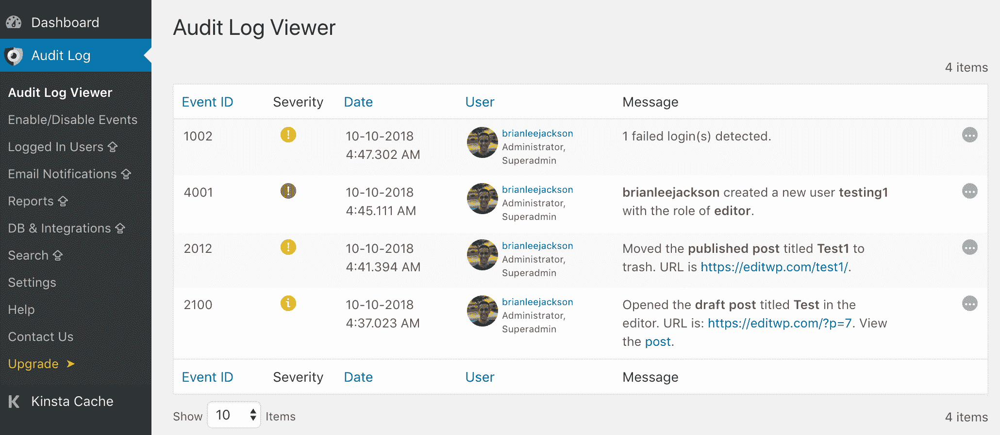

WP Security Audit Log failed login

当然，你也会想采取其他措施来保护你的 WordPress 登录界面。改变你的 WordPress 登录网址很简单。你越是能把网站的“前门”关紧，你就越不需要担心恶意用户强行进入。

### 4.主题或插件的更改

现在，让我们花点时间来谈谈 WordPress 用户角色。每个被允许访问你的网站的人都被赋予了特定的角色。虽然有插件添加了额外的选项，但 WordPress 中的默认角色是*管理员*、*编辑*、*作者*、*投稿人*和*订阅者*(以及[多站点安装](https://kinsta.com/blog/wordpress-multisite/)上的*超级管理员*)。

Struggling with downtime and WordPress problems? Kinsta is the hosting solution designed to save you time! [Check out our features](https://kinsta.com/features/)

每个角色都有自己的权限集，换句话说，就是允许用户执行的操作。例如，管理员可以做他们喜欢的任何事情，而订户只能管理他们的个人资料。其他角色介于两者之间。

这很重要，因为有些操作只有顶级用户才能执行。例如，在常规(非多)站点上，只有管理员可以安装、移除或更新插件和主题。

由于管理员可以对您的站点进行如此重要的更改，所以建议您只让一个用户拥有此级别的访问权限(很可能是您)。在你的网站上安装或删除附加组件的能力给了用户对其功能进行巨大改变的能力，如果他们不小心的话，甚至会完全破坏网站。

这意味着如果其他人正在对插件和主题进行修改，可能是出了问题。要么是恶意用户正在执行这些操作(例如，他们试图在您的网站上安装他们自己的东西)，要么是被批准的用户拥有[太高的权限级别](https://codex.wordpress.org/Roles_and_Capabilities#Capability_vs._Role_Table)。

WP Security Audit Log change to theme

不管怎样，这些都是你想要立即处理的问题。如果你在你的 WordPress 活动日志中发现了一个不是你自己做的对你网站插件或主题的改变，你将能够马上找到源头。另外，您将确切地看到所做的更改，因此如果需要，您可以撤销它们。

### 5.WordPress 核心和设置更改

在某种程度上，这些类型的活动与上一节中的活动非常相似。除了安装插件和主题，还有其他各种只有管理员才能做的事情。事实上，在你的网站上，几乎所有的[管理员特权](https://codex.wordpress.org/Roles_and_Capabilities#Administrator)都值得追踪。

然而，最重要的是对核心 WordPress 平台和网站整体设置的任何改变。为什么这两个类别如此重要应该是相当清楚的。两者都会以一种非常戏剧化的方式影响你的网站。

例如，对 WordPress 核心的改动会导致插件、主题和网站的其他部分不兼容。至于设置，如果不小心使用，会有很多问题。首先，改变网站的永久链接会严重破坏搜索引擎优化(SEO)。还有一些设置可以改变你的网站主页，启用或禁用评论，等等。

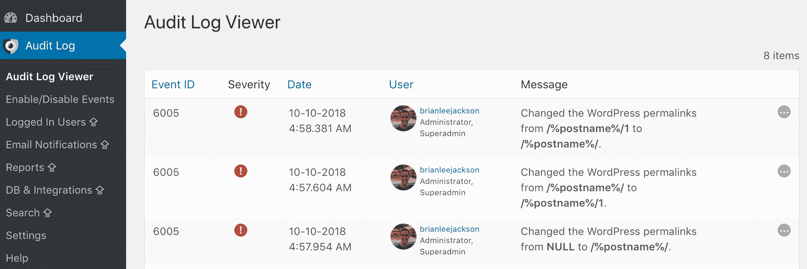

WP Security Audit Log WordPress core settings

换句话说，应该非常小心地对 WordPress 核心和你的设置进行修改。所以你肯定想马上知道你网站的这些元素是否被其他人改变了。如前一节所述，这可能意味着您的站点受到攻击，或者有人拥有超出他们需要的权限。

### 6.用户配置文件调整

在你的网站上拥有用户帐户的每个人都能够对他们自己的个人资料进行至少一些基本的更改。然而，[用户角色](https://kinsta.com/blog/wordpress-user-roles/)决定了每个人可以执行什么类型的活动。例如，大多数用户无法编辑其他人的账户。此外，只有管理员可以更改用户的角色。

在一个繁忙的 WordPress 网站上，经常会看到用户信息的变化。但是，仍有一些活动需要注意，包括:

*   **密码、电子邮件和显示名称的更改。**虽然用户不时更改这些信息是正常的(对于密码来说是聪明的)，但短时间内不寻常的大量更改可能表明存在问题。
*   **用户角色变化。**就用户档案而言，这是最需要跟踪的活动。作为管理员，任何人的用户角色都不应该在你不知情的情况下在你的网站上被改变。

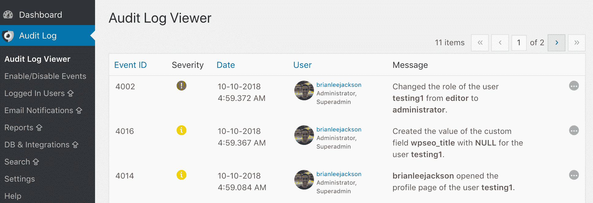

WP Security Audit Log user profile tweaks

如果你允许在你的网站上公开注册，你会特别想知道新账户上不寻常的活动水平。这可能表明该帐户的所有者不是合法用户。

### 7.对多站点设置的网站和用户的更改

之前，我们简要提到了[多站点安装](https://kinsta.com/blog/wordpress-multisite/)。这是 WordPress 鲜为人知但最有用的功能之一。使用多站点功能，您可以在一个有组织的网络中运行多个独立但相互连接的网站。

当您运行多站点设置时，每个站点都是它自己的实体。同时，所有这些都可以通过一个中央控制面板进行管理。一个或多个超级管理员监管整个网络，对用户、设置、插件和主题做出大规模决策。然后，每个网站都有自己的管理员，他们只能对特定的网站进行更改。

保持组织有序和安全的多站点设置尤其具有挑战性。毕竟，你现在有多个网站需要担心，每个网站都有自己的用户群。这意味着跟踪每个站点上的活动(以及整个网络)比以往任何时候都更重要。

如果你经营一个多站点网络，以下是一些你需要特别注意的活动:

*   **添加或删除站点。**这个是大的。作为超级管理员，你是唯一能够创建或删除网站的人——任何其他用户都不应该执行这样的关键操作。
*   **从站点添加或删除用户。**出于前面讨论的同样原因，跟踪网络上每个站点的注册用户是一个明智的想法。
*   **网络设置的更改。**在多站点设置中，您可以通过[网络特定选项](https://codex.wordpress.org/Network_Admin_Settings_Screen)进入特殊屏幕。这些设置影响深远，不应该轻易修改。

使用 WordPress 多站点网络的[活动日志](https://www.wpsecurityauditlog.com/support-documentation/audit-trail-features-wordpress-multisite/)可以让你从所有可能的方向跟踪活动。这使您可以监视每个单独站点上的用户行为，以及对整个网络所做的更改。

### 不要忘记你的托管账户

除了你的 WordPress 站点，跟踪你的 WordPress 托管账户上发生的事情也是明智的。这当然是幕后驱动一切的东西。

如果你是 Kinsta 的客户，你可以很容易地从 MyKinsta 仪表板的[活动日志](https://my.kinsta.com/actions)屏幕中看到变化。一切从网站创建，删除，域名变更，重定向等。如果您的帐户上有多个用户，它会被全局记录，因此您可以看到谁做了什么操作。

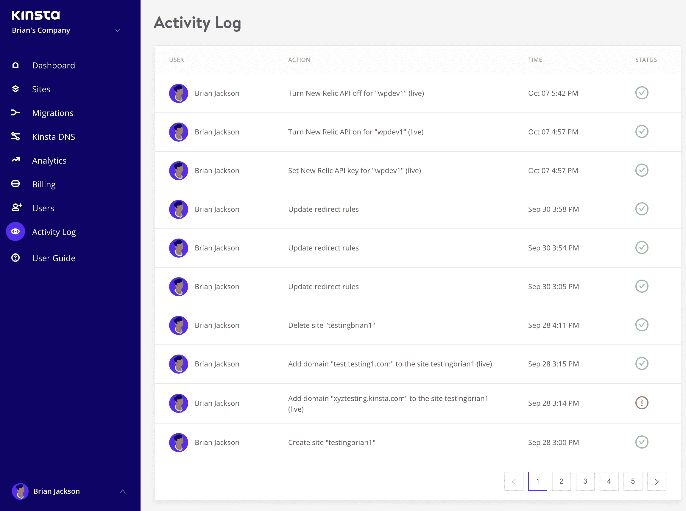

MyKinsta activity log

## 摘要

WordPress 网站上最小的改变都会产生戏剧性的结果。一个简单的设置调整可以改变你网站的工作方式，安装一个与你的其他工具不兼容的插件或主题会破坏重要的功能。这就是为什么，特别是如果你有很多用户，你会想跟踪你的网站上发生的一切。以下是如何安全地[删除一个 WordPress 主题](https://kinsta.com/blog/wordpress-delete-theme/)。

最好的方法之一是获得一个 [WordPress 活动日志插件](https://wordpress.org/plugins/wp-security-audit-log/),它将你的网站的每一个变化信息编辑成一个方便的日志。该日志应该跟踪所有最重要的(和潜在的问题)变更，例如:

1.  对内容的更改。
2.  新用户和已删除用户。
3.  登录尝试失败。
4.  主题或插件的变化。
5.  WordPress 核心和设置更改。
6.  用户配置文件调整。
7.  对多站点设置的网站和用户的更改。

关于如何在你的 WordPress 网站上追踪用户活动，你有什么问题吗？请在下面的评论区提问！

* * *

让你所有的[应用程序](https://kinsta.com/application-hosting/)、[数据库](https://kinsta.com/database-hosting/)和 [WordPress 网站](https://kinsta.com/wordpress-hosting/)在线并在一个屋檐下。我们功能丰富的高性能云平台包括:

*   在 MyKinsta 仪表盘中轻松设置和管理
*   24/7 专家支持
*   最好的谷歌云平台硬件和网络，由 Kubernetes 提供最大的可扩展性
*   面向速度和安全性的企业级 Cloudflare 集成
*   全球受众覆盖全球多达 35 个数据中心和 275 多个 pop

在第一个月使用托管的[应用程序或托管](https://kinsta.com/application-hosting/)的[数据库，您可以享受 20 美元的优惠，亲自测试一下。探索我们的](https://kinsta.com/database-hosting/)[计划](https://kinsta.com/plans/)或[与销售人员交谈](https://kinsta.com/contact-us/)以找到最适合您的方式。