# 令人兴奋的 LinkedIn 统计数据和事实(2022)

> 原文：<https://kinsta.com/blog/linkedin-statistics/>

脸书可能是当今世界上最大的社交网站，但 LinkedIn 为其用户提供支持的时间更长。更重要的是，对于那些寻求社交和发展商业关系的人来说， [LinkedIn 用户](https://kinsta.com/blog/linkedin-marketing/)知道这个平台是“专业社交网站”

在一个技术快速变化的世界里，这家成立于 2002 年的科技公司的长寿是对其在社交媒体领域的实用性和主导地位的致敬。

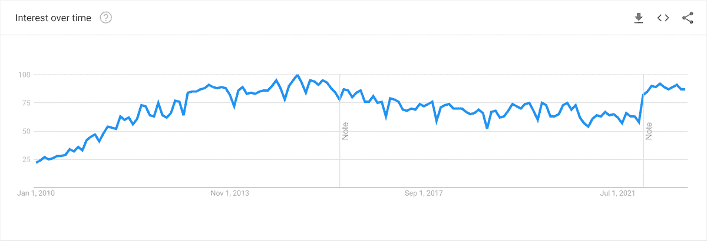

Google Search Trends “LinkedIn”

事实上，自 2010 年以来，“LinkedIn”一词的搜索兴趣增加了 295%以上。而且，当谈到有趣的 LinkedIn 统计数据和 LinkedIn 事实时，有惊人的丰富性。

## 挖掘 LinkedIn 的人口统计数据

LinkedIn 现在拥有超过 8 . 75 亿会员，注册公司超过 5800 万家。

在频繁使用 LinkedIn 平台的用户中，40%的人每天都会访问该平台，每月超过 10 亿次互动。然而，LinkedIn 很少使用，所以你只有几分钟的时间来产生影响。用户每月在 LinkedIn 上只花大约 17 分钟*。*

 *根据皮尤研究中心的 2021 年社交媒体使用研究，LinkedIn 仍然受到大学生的欢迎。对这些 LinkedIn 统计数据的进一步研究显示，在美国，超过 50%拥有学士或高等学位的成年人是 LinkedIn 的用户，而该网站只吸引了 10%教育程度不超过高中的人。

然而，越来越多的趋势表明，Linkedin 上发布的不要求申请人拥有学位的工作岗位数量有所增加。Linkedin 的研究显示，这占了该平台工作岗位的 20%,高于前一年的 15%,也就是 33%。

> 需要在这里大声喊出来。Kinsta 太神奇了，我用它做我的个人网站。支持是迅速和杰出的，他们的服务器是 WordPress 最快的。
> 
> <footer class="wp-block-kinsta-client-quote__footer">
> 
> 
> 
> <cite class="wp-block-kinsta-client-quote__cite">Phillip Stemann</cite></footer>

[View plans](https://kinsta.com/plans/)

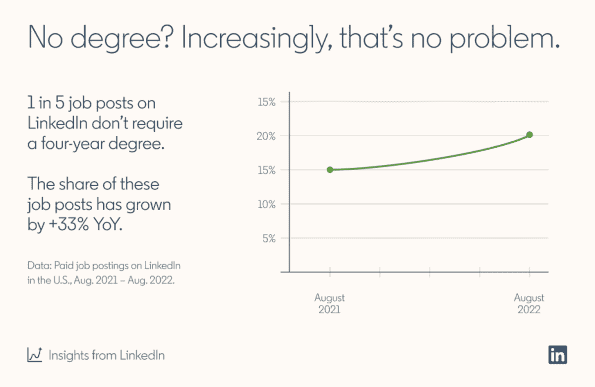

Growing trend in jobs that don’t require a degree

此外， **44%的 LinkedIn 用户每年收入超过 75，000 美元**，高于美国全国中位数[。](https://www.census.gov/library/publications/2022/demo/p60-276.html#:~:text=Highlights,and%20Table%20A%2D1).)

尽管美国拥有最多的 LinkedIn 用户，达到 1.94 亿，但超过 78%的 LinkedIn 用户来自美国以外。

从性别来看，LinkedIn 更受男性欢迎，男性占其用户群的 57%(截至 2022 年 1 月)。有趣的是，千禧一代占 LinkedIn 用户群的 59%以上，8700 万千禧一代中有 1100 万人在决策层(T3)。

## LinkedIn 收入:财务事实

微软认识到 LinkedIn 的价值，[在 2016 年以 262 亿美元收购了该公司](https://www.wsj.com/articles/microsoft-to-acquire-linkedin-in-deal-valued-at-26-2-billion-1465821523)。然而，与许多其他依赖广告的[社交媒体平台](https://kinsta.com/blog/social-media-image-sizes/)不同，LinkedIn 的服务是用户愿意付费的。

Linkedin 目前的年收入超过 138 亿美元，与 2021 年相比，同比增长 34%。这标志着在已经令人印象深刻的 5 年中重要的一年。

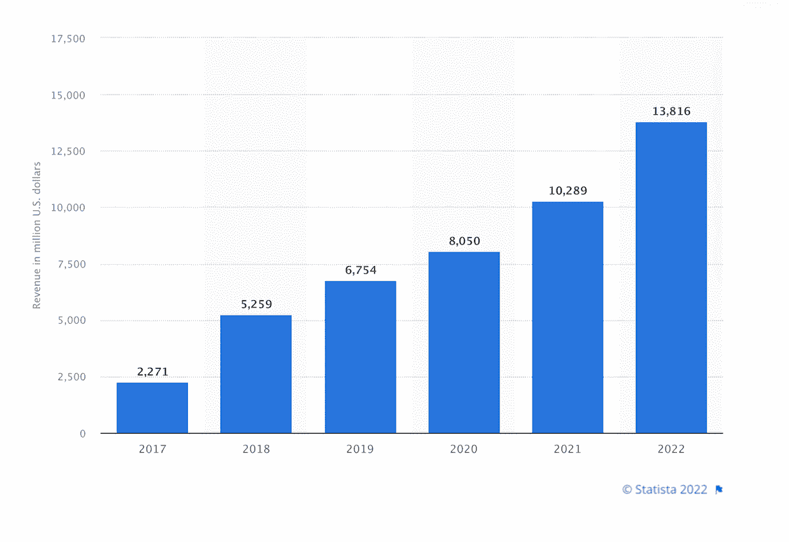

LinkedIn Annual Revenue (Image source: [Statista](https://www.statista.com/statistics/976194/annual-revenue-of-linkedin/))

总共有 39%的 LinkedIn 用户支付 LinkedIn Premium，它有四个价格等级:

*   职业:每月 39.99 美元(按年计费，每月 26.99 美元)
*   业务:69.99 美元/月(55.99 美元/月按年计费)
*   销售导航核心:99.99 美元/月(79.99 美元/月按年计费)
*   招聘简装版(招聘):199.95 美元/月(169.95 美元/月【按年计费的 T0】)

*未计入月定价的销售税 

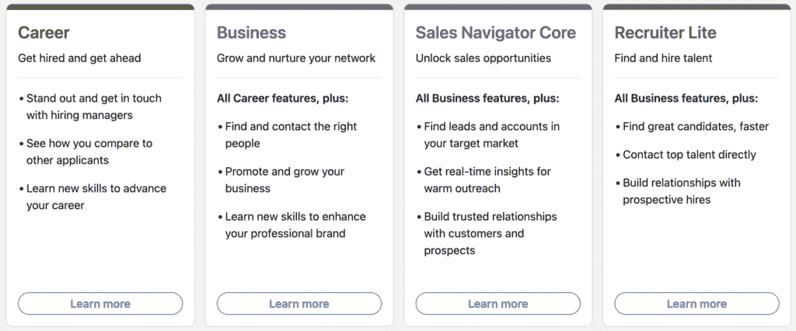

职业规划最适合找工作的人。它可以让你每月访问五封电子邮件和点播视频，还可以查看谁查看了你的个人资料，你出现了多少次搜索，以及发布的职位的其他信息(包括工资)。

其他层基本上包括相同的基本功能，但又更进了一两步。商业计划给你更多的信息，关于企业和无限的人搜索；Sales Navigator Core 为您提供了高级搜索过滤器、对不同销售工具的访问，以及在用户资料上做笔记的能力；Recruiter Lite 为您提供了引导搜索智能建议和更多以招聘人员为中心的工具。

无论你购买哪个高级账户，你都将**获得改进的指标和实现 LinkedIn 增长的各种方式**。

## 注册订阅时事通讯

### 想知道我们是怎么让流量增长超过 1000%的吗？

加入 20，000 多名获得我们每周时事通讯和内部消息的人的行列吧！

[Subscribe Now](#newsletter)

### 联系 LinkedIn 支持

LinkedIn 帮助中心包含资源、故障排除技巧和有用的信息，帮助你使用他们的产品。如果你找不到你要找的东西，你可以通过[提交支持案例](https://www.linkedin.com/help/linkedin/answer/a518597/contact-linkedin-customer-service?lang=en)联系 LinkedIn 的客户服务代表，但是你必须登录你的 LinkedIn 账户才能这样做。

### 有 LinkedIn 客服电话吗？

不，LinkedIn 目前不提供客户支持电话号码。然而，有许多网站声称提供付费的 LinkedIn 电话支持，但这些网站与 LinkedIn 没有任何关系。

## 在 LinkedIn 上挖掘潜在客户

LinkedIn 是发现潜在客户的一个特别好的来源。Hubspot 发现 LinkedIn 比脸书和 Twitter 在挖掘潜在客户方面的效率高出 277%。

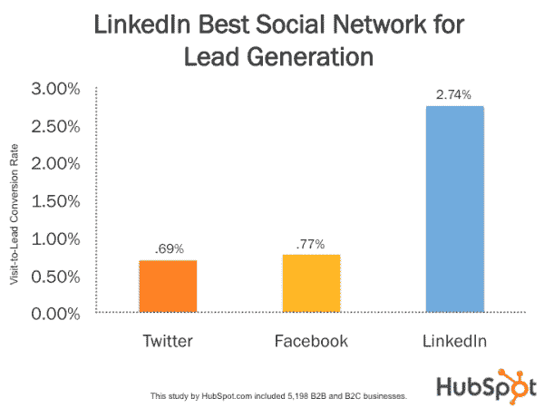

LinkedIn lead generation (Image source: HubSpot)

有鉴于此，毫不奇怪，79%的营销人员认为 LinkedIn 是一个非常好的潜在客户来源，43%的营销人员说他们已经从 LinkedIn 获得了至少一个客户。

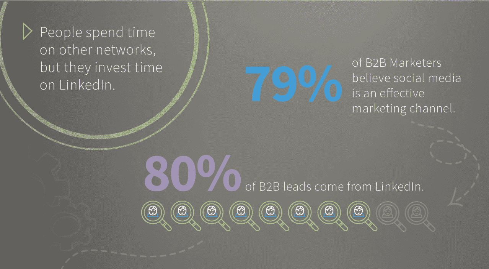

B2B LinkedIn leads (Image source: LinkedIn)

对于 B2B 营销人员来说，这一数字还在增加，他们报告称，80%的社交媒体线索来自 LinkedIn，40%的人认为 LinkedIn 是他们在 T2 获得高质量线索的最有效渠道。

## 为招聘加分

LinkedIn 用户在平台上活跃的另一个主要原因是为了招聘工作。网站上列出了 5800 多万家公司，每周有 5200 万人在 LinkedIn 上搜索工作，所以毫不奇怪，T2 77%的招聘人员经常使用 LinkedIn。

事实上，一项研究发现，1.22 亿人[通过 LinkedIn](https://www.statisticbrain.com/linkedin-company-profile-and-statistics/) 接受了面试，其中 3550 万人被他们在该网站上联系的人雇用。所以毫不奇怪，每秒钟有 101 份工作申请通过 LinkedIn 提交，每分钟有 8 个人被雇佣。

从 2020 年 3 月到 12 月，LinkedIn 在美国增加的远程职位发布数量增长了 6 倍，超过 30 万个远程职位。

对于招聘人员来说，LinkedIn 的一个很好的统计数据是，通过该网站招聘的员工在前 6 个月内离开公司的可能性降低了 40%。

根据 LinkedIn 的数据，女性现在占公司领导层的近 42%，在过去五年中，担任技术领导职务的女性增长了 79%。

## LinkedIn 个人资料优化入门

由于 LinkedIn 能够识别布尔运算符，并根据公司、经验年限、职能和资历水平等指标过滤结果，该平台在帮助人们建立重要的业务联系方面轻松超越了竞争对手。

然而，尽管有先进的搜索功能，你仍然希望优化你的 LinkedIn 个人资料(建议阅读:[如何在 LinkedIn 上创建公司页面](https://kinsta.com/blog/how-to-create-a-company-page-on-linkedin/))。做到这一点的第一步是添加一张专业照片，这平均会让用户[获得比其他类型的个人资料图片多 14 倍的浏览量](https://business.linkedin.com/talent-solutions/blog/2014/12/5-tips-for-picking-the-right-linkedin-profile-picture)。

为了让你的连接请求增加五倍，确保你的[列出了你当前的位置](https://blog.linkedin.com/2016/05/25/get-comfortable-with-being-uncomfortable-why-now-is-the-time-to)。此外，不要忘记列出至少五项相关技能，因为这样做会增加你的个人资料被发现和有人给你发[消息的几率，比你不发](https://blog.linkedin.com/2016/05/25/get-comfortable-with-being-uncomfortable-why-now-is-the-time-to)多 31 倍。

<iframe loading="lazy" title="How To Tell Your #workstory" src="https://www.slideshare.net/slideshow/embed_code/key/rEdKXLVgd34ho0" width="427" height="356" frameborder="0" marginwidth="0" marginheight="0" scrolling="no" style="border:1px solid #CCC; border-width:1px; margin-bottom:5px; max-width: 100%;" allowfullscreen=""></iframe>

**[How To Tell Your #workstory](https://www.slideshare.net/linkedin/how-to-tell-your-workstory "How To Tell Your #workstory")** from **[LinkedIn](https://www.slideshare.net/linkedin)**

## 关于新功能的有趣 LinkedIn 统计

微软介入后，LinkedIn 推出了几个新功能，比如展示页面。业务页面的这种扩展旨在突出您公司的业务单位或计划。

LinkedIn 还推出了一款[日历聊天机器人](https://www.inc.com/associated-press/linkedin-adds-new-features-chatbot-customized-news-feed-training.html)，它可以同步两个 LinkedIn 用户的日历，这样他们就可以见面了。这对于想要与不同时区的人联系的人来说特别有帮助。尽管聊天机器人功能尚未在 LinkedIn 上实现，但人工智能技术已经以智能回复或建议回复的形式进入了该平台。

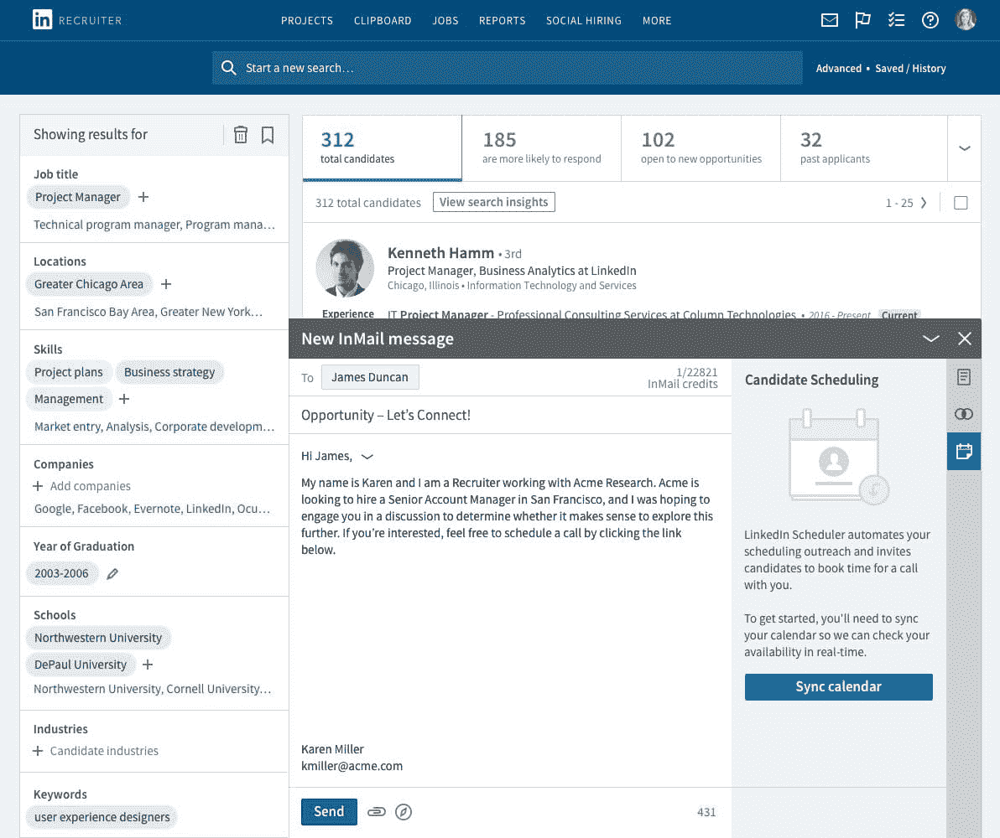

LinkedIn Scheduler (Image source: [LinkedIn](https://business.linkedin.com/talent-solutions/blog/product-updates/2017/introducing-linkedin-scheduler))

此外，LinkedIn 还推出了消息服务，允许用户以聊天的形式发送电子邮件，而不是电子邮件格式，这样可以减少过多的点击。该功能还包括赞助消息。

其他新功能包括:

*   将[向上滑动链接](https://www.linkedin.com/posts/mrlinkedin_linkedintips-socialmedia-linkedin-ugcPost-6755054513192767488-y3MS)添加到 LinkedIn 故事的能力，让你的内容更加清晰可见。
*   #招聘和#开放工作框架可以应用到您的个人资料图片，让潜在的候选人或雇主知道您的当前状态。
*   评论中的标签[现在被 LinkedIn 索引](https://www.linkedin.com/posts/president_newlinkedinfeature-hashtags-hashtag-activity-6726454799329452032-GXNN)，这意味着当你搜索标签时，你将会看到包含评论的结果。这使得标签的使用更加重要！

## 内容创作者利用 LinkedIn

LinkedIn 允许你分享不同类型的内容。可以在你的个人资料或 LinkedIn Pulse 上发布的文章、你的网站链接、幻灯片和视频是 LinkedIn 用户发布的最受欢迎的内容类型。

2019 年，LinkedIn 会话同比增长 25%，观看了 3580 亿次更新。但是每周只有大约 300 万用户分享内容。这意味着 LinkedIn 每月 2.6 亿用户中只有约 1%的人分享帖子，而这 300 万左右的用户获得了 90 亿次展示。

LinkedIn 为 B2B 网站带来了 46%的社交流量，被认为是 T2 最可靠的内容来源。所以，毫不奇怪 [98%的内容营销人员](https://business.linkedin.com/content/dam/me/business/en-us/marketing-solutions/cx/2017/pdfs/Sophisticated-Marketers-Guide-to-LinkedIn-v03.12.pdf)使用 LinkedIn 进行[内容营销](https://kinsta.com/learn/content-marketing/)，尤其是 [B2B 营销和销售线索生成](https://kinsta.com/blog/b2b-lead-generation/)。

OkDork 的一项研究分析了 3000 多篇 LinkedIn 帖子，发现“如何做”和列表帖子表现最好，尤其是那些标题有 40-49 个字符的帖子。此外，它发现有五个标题的帖子有最多的浏览量。它还揭示了长格式的内容(1900-2000 字)表现最好，以及有八个图像的内容。

确保你发送的 LinkedIn 是一个快速可靠的网站。[免费试用 kin sta](https://hubs.ly/H0pklC_0)。

只是不要让我们开始使用“[bro try](https://www.buzzfeednews.com/article/ryanmac/why-are-these-posts-taking-over-your-linkedin-feed-because)”背后的 LinkedIn 统计数据——多个单行句子，写起来可能和读起来一样烦人。

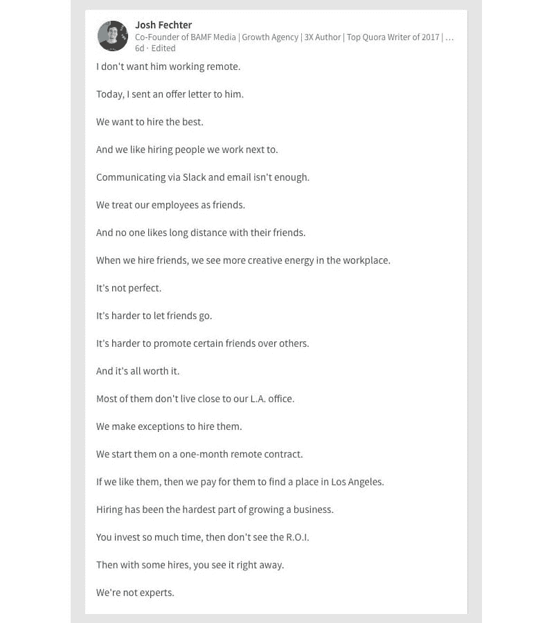

LinkedIn broetry

支持图片可以提高帖子受欢迎程度的观点是，包含照片可以提高 98%的评论率。一次又一次，我们看到一个[视觉内容战略](https://kinsta.com/blog/visual-content-strategy/)刚刚奏效。

现在，一个有趣的事实是，你可能无法梳理出你自己的发布结果，即周四发布的内容往往表现最好。

值得庆幸的是，你不必出名就能让你的内容表现出色。看看 LinkedIn 在营销&广告类别中的[2020 年](https://www.linkedin.com/pulse/linkedin-top-voices-2020-meet-professionals-driving-todays-roth)十大声音就清楚了:

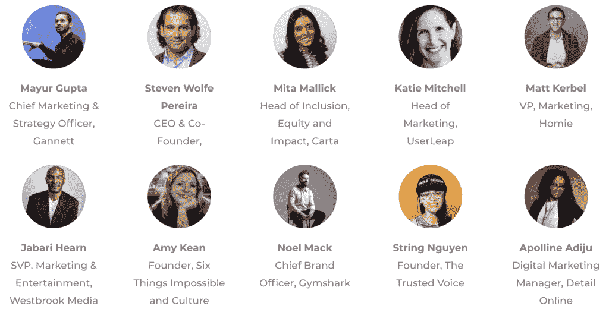

Top 10 LinkedIn Influencers 2020: Marketing & Advertising

## LinkedIn 视频是一个胜利

马克·扎克伯格宣称[视频是‘下一个大趋势’](https://www.cnbc.com/2017/02/01/mark-zuckerberg-video-mega-trend-like-mobile.html)，像[脸书](https://kinsta.com/blog/facebook-marketing/)、 [Instagram](https://kinsta.com/blog/instagram-stats/) 、 [Twitter](https://kinsta.com/blog/twitter-stats/) 、 [YouTube](https://kinsta.com/blog/youtube-stats/) 和 Snapchat 这样的平台让用户上传视频内容变得更加容易。

LinkedIn 不会被落下，特别是因为人们发现，如果内容以视频和书面形式出现， [59%的高管](https://www.digitalinformationworld.com/2016/12/infographic-video-marketing-statistics-2017.html#postimages-2)表示他们会选择通过视频来消费。

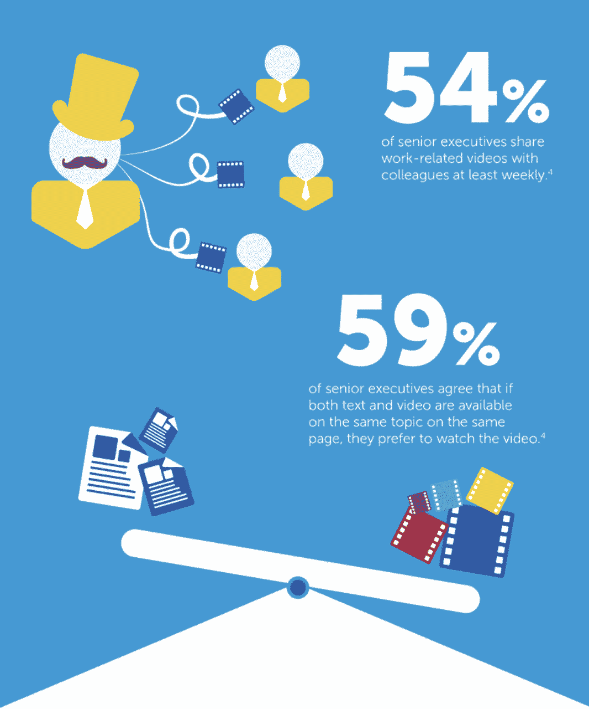

Video consumption on LinkedIn (Image source: MWP Digital Media)

LinkedIn 用户一度只能嵌入其他来源的视频内容。然而，LinkedIn 现在允许通过移动应用程序上传原生视频。这让 LinkedIn 用户看到了企业更“人性化”的一面，让企业背后的品牌更加平易近人。

事实上，LinkedIn 视频被评为最有效的视频营销平台之一，尽管只有 28%的营销人员同意。这 28%可能看起来很弱，但鉴于 LinkedIn 视频只是在 2017 年 8 月[向用户推出](https://blog.linkedin.com/2017/august/22/Introducing-LinkedIn-Video-Show-Your-Experience-and-Perspective)，那么多人同意*已经*了，这实际上是相当令人印象深刻的。

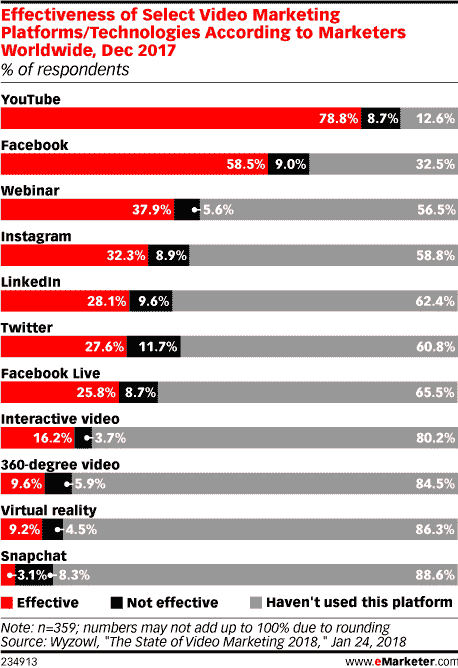

LinkedIn statistics on video (Image source: eMarketer)

从那以后，LinkedIn 引入了视频过滤器，以及作为赞助内容的一部分的原生视频广告。这使得企业能够分享他们自己的视频内容。在此之前，视频内容仅适用于个人会员用户帐户。

视频广告与其他广告的区别在于，你可以从许多目标选项中进行选择，如职位、位置和公司规模。您还可以应用高级功能，如再营销和匹配受众集成。

自从赞助内容的测试版推出以来，LinkedIn 报告称，用户观看视频的时间是观看静态内容的三倍。在 LinkedIn 视频的限量版或测试版发布期间，人们发现视频的[分享量是任何其他类型内容的](https://smallbiztrends.com/2017/08/linkedin-video.html)20 倍。

## 最后的想法:令人兴奋的 LinkedIn 统计数据和事实

当谈到一些支持社交媒体平台将继续占据主导地位的观点的 LinkedIn 统计数据时，你有正确的事实吗？

从大约 300 万用户每月 90 亿次的点击量，到意识到甚至 LinkedIn 的统计数据也支持扎克伯格的声明，即视频是下一个大趋势，很明显，关于谁在使用这个平台以及他们为什么这样做，有很多东西需要了解。

你有什么有趣的 LinkedIn 数据可以分享吗？把它们贴在下面的评论里吧！

* * *

让你所有的[应用程序](https://kinsta.com/application-hosting/)、[数据库](https://kinsta.com/database-hosting/)和 [WordPress 网站](https://kinsta.com/wordpress-hosting/)在线并在一个屋檐下。我们功能丰富的高性能云平台包括:

*   在 MyKinsta 仪表盘中轻松设置和管理
*   24/7 专家支持
*   最好的谷歌云平台硬件和网络，由 Kubernetes 提供最大的可扩展性
*   面向速度和安全性的企业级 Cloudflare 集成
*   全球受众覆盖全球多达 35 个数据中心和 275 多个 pop

在第一个月使用托管的[应用程序或托管](https://kinsta.com/application-hosting/)的[数据库，您可以享受 20 美元的优惠，亲自测试一下。探索我们的](https://kinsta.com/database-hosting/)[计划](https://kinsta.com/plans/)或[与销售人员交谈](https://kinsta.com/contact-us/)以找到最适合您的方式。*