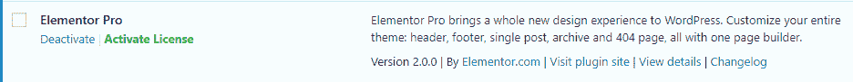

# 为什么你应该停止使用空的 WordPress 插件和主题

> 原文：<https://kinsta.com/blog/nulled-wordpress-plugins-themes/>

没有人喜欢花不必要的钱，这是人之常情。即使是世界上最富有的人之一，沃伦·巴菲特，仍然在搜索他购买的汽车的折扣(*好吧，也许这是一个极端的例子——你明白了*)。

因为人们总是在寻找降低成本的方法，一些 WordPress 用户倾向于转向无价值的 WordPress 主题和插件，而不是为官方高级版本付费。

在这篇文章中，我们将告诉你**为什么使用空的 WordPress 插件和主题是一个坏主意**…即使它不一定违反任何法律。

## 什么被认为是空插件和主题？

谈到术语 nulled，网络上有各种各样的定义。当我们定义 nulled 时，它指的是被黑客攻击的优质 WordPress 插件或主题，或者包含旨在造成伤害或收集信息的修改代码。这些是从第三方网站(不是原作者或创作者)获得的，有时是在没有许可证密钥的情况下工作的。

Support

## 被清空的 WordPress 插件和主题不一定是非法的

如果你使用无效的 WordPress 插件或主题，联邦调查局不太可能踢开你的门。这是因为，与人们通常“盗版”的其他内容(如音乐、电影)相比，被清空的 WordPress 插件和主题通常不违法。

这里的原因与 GPL ( [通用公共许可证](https://en.wikipedia.org/wiki/GNU_General_Public_License))有关。不要把这当成一堂关于版权的课，你只需要知道 GPL 许可允许的一部分是任何人都可以自由发布 GPL 许可的软件(是的，甚至是高级 GPL 许可的软件)。

因此，如果一个被清空的插件网站把一个 GPL 许可的软件放出来供下载，从技术上来说，他们并没有违反法律，因为他们有权自由发布 GPL 代码。

GPL 是 WordPress 的一大部分，大多数(但不一定是全部) [WordPress 主题](https://kinsta.com/best-wordpress-themes/)和插件都使用 GPL。这部分是因为主题和插件必须符合 GPL 才能被列入 WordPress.org 目录。

虽然**高级插件不需要 GPL 许可**，但是许多在 WordPress 知识库上也有一个免费的版本，它需要 GPL 许可。或者他们选择拥有 GPL 许可。许多高级插件如 WP Rocket 和 Gravity Forms 都是 GPL 许可的。

还有其他原因——比如能够在插件和主题中使用现有的 GPL 许可的代码。通常情况下，如果你在一个产品中使用现有的 GPL 许可的代码，你必须在 GPL 下发布后续产品(这就是 2017 年 WordPress 和 Wix 之间[爆发的原因)。](https://wptavern.com/wix-removes-gpl-licensed-wordpress-code-from-mobile-app-forks-original-mit-library)

GPL 很复杂，我们过度简化了一些原则，将核心思想浓缩成几个段落。但是基本上——你看到的大多数被清空的 WordPress 插件和主题可能没有做任何违法的事情。事实上，GPL 是 WordPress 伟大的一个原因。

**但这并不意味着你应该走出去，让你的网站充满被清空的扩展…**

## 你仍然不应该使用空 WordPress 扩展的四个理由(即使它们是合法的)

仅仅因为空扩展名是合法的，这并不意味着在你的 WordPress 站点上使用它们是个好主意。

以下是你仍然不应该在网站上使用空插件或主题的四个原因。

1.  [你不知道代码里还有什么](#code)
2.  [开发者需要钱来继续改进他们的产品](#support-developers)
3.  你不会从开发商那里得到任何支持
4.  [你不会得到任何自动更新](#automatic-updates)

### 1.你不知道代码里还有什么

当你从开发人员之外的来源(或者像 WordPress.org 这样的可信存储库)下载扩展时，你不知道代码中还隐藏着什么。

恶意行为者喜欢使用空的插件或主题来插入他们自己讨厌的有效载荷，如 SEO 的注入链接，甚至更邪恶的动作。

[There are many Facebook groups where members share nulled WordPress plugins. Scary! 😧Click to Tweet](https://twitter.com/intent/tweet?url=https%3A%2F%2Fkinsta.com%2Fblog%2Fnulled-wordpress-plugins-themes%2F&via=kinsta&text=There+are+many+Facebook+groups+where+members+share+nulled+WordPress+plugins.+Scary%21+%F0%9F%98%A7&hashtags=WordPress%2Cwebdev)

当您使用一个空扩展时，您将自己暴露在这种类型的利用之下，因为，除非您有知识和时间来挖掘所有代码，否则您不知道空扩展中还隐藏着什么。

除此之外，你可能会失去主人潜在的帮助。例如，我们在 Kinsta 这里提供了[免费的黑客修复保证，但是如果你的](https://kinsta.com/secure-wordpress-hosting/) [WordPress 网站由于一个被清空的插件或主题中的后门而被黑客攻击](https://kinsta.com/blog/wordpress-hacked/)，这个保证就不适用。

这不是一个普遍的问题，因为你可以找到提供清洁产品的合法 GPL 俱乐部(通常按月收费)。但是，即使你为一个提供免费下载恶意代码的 GPL 俱乐部付费，仍然有其他重要的原因说明这些扩展不是一个好主意。你怎么知道哪个 GPL 俱乐部是可信的？

An example of a paid GPL club

这就是为什么我们通常将从第三方网站获得的插件称为空插件。更安全的假设是，如果你不是从原作者那里获得的，它可能被修改过，是不安全的代码，甚至是病毒。你可以使用像 [VirusTotal](https://www.virustotal.com/#/home/upload) 这样的在线工具来扫描插件或主题的文件，看看它是否检测到任何[类型的恶意软件](https://kinsta.com/blog/types-of-malware/)。

VirusTotal

### 2.开发者需要钱来继续改进他们的产品

虽然大多数开发人员确实喜欢创建 WordPress 产品，但是他们中的大多数人也喜欢能够吃饭和买得起房子。

也就是说，WordPress 开发者需要收入来证明他们花费在维护和改进产品上的时间是值得的。

当你使用一个空的扩展，你剥夺了他们的收入，他们可以用它来进一步增强他们的插件。

基本上，你吃白食就是搬起石头砸自己的脚！

如果每个人都使用一个空版本，那么[Elementor](https://kinsta.com/blog/wordpress-elementor/)[page builder](https://kinsta.com/blog/wordpress-page-builders/)团队能让[推出新功能](https://kinsta.com/blog/interview-ben-pines/)吗，比如主题构建？如果没有收入的话，OceanWP 主题会有那些很棒的附加组件吗？

## 注册订阅时事通讯

### 想知道我们是怎么让流量增长超过 1000%的吗？

加入 20，000 多名获得我们每周时事通讯和内部消息的人的行列吧！

[Subscribe Now](#newsletter)[The WordPress community needs to support developers. This is how we grow. 🌱Click to Tweet](https://twitter.com/intent/tweet?url=https%3A%2F%2Fkinsta.com%2Fblog%2Fnulled-wordpress-plugins-themes%2F&via=kinsta&text=The+WordPress+community+needs+to+support+developers.+This+is+how+we+grow.+%F0%9F%8C%B1&hashtags=WordPress%2Cwebdev)

不要！当然不是。

如果你想尽办法找到一个插件或主题的空版本，这可能意味着你认为它对你的网站是一个有价值的补充。

所以，即使你认为不值得向开发人员支付他们为构建你的产品所付出的努力，你为什么要剥夺自己在未来获得更好的产品的机会呢？

基本上，你应该帮助开发人员把食物放在桌子上，这样他们就可以继续创造令人敬畏的东西，使你的生活更容易。

### 3.你不会从开发商那里得到任何支持

被清空的扩展可以让你获得高级插件或主题的所有特性，但它们永远无法让你获得付费用户所获得的所有好处。

那是因为你为 GPL 许可的软件所支付的很大一部分是来自开发者的支持。

当您为产品付费时，如果您遇到产品的任何问题，您可以选择直接联系开发人员。

另一方面，对于空扩展，您得到的是零支持。遇到困难了吗？希望谷歌有所帮助！因为这是你唯一的选择。如果你使用的插件在 WordPress 知识库中有免费版本，你可能会在那里得到回应。但是说实话，这就像是在玩彩票。这仅仅是因为开发人员无法承担免费工作。

如果你浪费了三个小时去解决一个开发者可以在五分钟内解决的问题，你最终真的“省钱”了吗？可能不会(如果你珍惜时间的话)。

### 4.你不会得到任何自动更新

为了启用高级插件或主题的自动更新，你需要一个许可证密钥。

Struggling with downtime and WordPress problems? Kinsta is the hosting solution designed to save you time! [Check out our features](https://kinsta.com/features/)

如果没有有效的许可证密钥，每次有新的更新时，你都必须手动更新扩展。

这有两个大问题:

首先，这很烦人，也很费时间。你不再需要简单地点击一个按钮，而是每次都要删除并重新上传一个插件。

No updates without the license key

虽然这不是最大的问题。

更重要的是，你将不再在你的 WordPress 仪表盘上看到红色的更新通知。这意味着您必须找到另一种方法来跟踪新的更新何时出现。

如果开发人员发布了一个紧急的安全补丁，但是您直到几个星期后才收到备忘录，该怎么办？过时的扩展是 WordPress 网站的一大攻击媒介，所以如果你不能及时应用新的更新，你的网站将面临不必要的风险。

的确，一些 GPL 俱乐部会去获取最新版本，然后在他们的网站上发布更新。但是你想信任谁呢？一个有一千个不同插件的 GPL 俱乐部，或者插件的开发者。这种风险值得省几个钱吗？

你更信任谁来更新？一个有几千个插件的 GPL 俱乐部，或者插件的开发者。🤭 点击推文

## 例外

我们看不到任何使用空插件或主题的好理由。然而，如果你真的想吹毛求疵，这里有一个我们亲自从用户那里听到的场景。

许多[高级 WordPress 插件](https://kinsta.com/best-wordpress-plugins/)没有免费版本或试用版，他们的退款政策可能只适用于由于技术原因插件无法工作的情况。很多时候，插件开发者必须严格遵守他们的退款政策，以防止那些试图获得免费拷贝的人滥用。

如果你是一个 WordPress 开发者、[机构](https://kinsta.com/blog/wordpress-agency/)或者自由职业者，可能有些情况下你只需要看看一个插件是否适合客户。如果插件最终不能满足你的需求，那么购买它并不总是有意义的。因为那样你就没钱了。

在本地测试一个被清空的插件或主题，或者在一个临时站点上测试可能是你决定要走的路。我们不会在我们的网站上分享从哪里得到这些。

如果你这样做了，并且发现插件或主题确实交付了，那么，尽一切办法，与你的客户聊天，购买它以获得合法的许可密钥、支持和更新。

## 不要在生产网站上使用空扩展——不值得

从表面上看，免费获得一个优质插件或主题似乎是一笔不错的交易。但在我们看来，就是不值得。即使你找到了合法、干净的 GPL 插件和主题的来源，你仍然会浪费额外的时间，因为你:

*   由于无法获得支持，您必须自己配置和修复一切。
*   将不得不不断检查新版本，并手动更新自己。

时间就是金钱，被清空的插件和主题会让你花更多的时间去使用。

除此之外，你只是剥夺了开发者已经投入的辛勤工作的回报，以及继续改进他们产品的钱。即使你在道德上没有问题，如果每个人都使用空扩展，你也会失败，因为开发者没有改进的动力。

所以——当提到无效安装时——在安装主题或插件之前要三思。尤其是当你在别人的 WordPress 站点上构建或工作的时候。不要让你的客户以后陷入困境。这种事情我们已经见得太多了。

如果你真的预算有限，可以考虑 WordPress 网站上 55，000 多个免费插件和数千个免费主题中的一个。

有什么想法吗？我们希望在下面的评论中听到更多 WordPress 用户对这个话题的看法。

* * *

让你所有的[应用程序](https://kinsta.com/application-hosting/)、[数据库](https://kinsta.com/database-hosting/)和 [WordPress 网站](https://kinsta.com/wordpress-hosting/)在线并在一个屋檐下。我们功能丰富的高性能云平台包括:

*   在 MyKinsta 仪表盘中轻松设置和管理
*   24/7 专家支持
*   最好的谷歌云平台硬件和网络，由 Kubernetes 提供最大的可扩展性
*   面向速度和安全性的企业级 Cloudflare 集成
*   全球受众覆盖全球多达 35 个数据中心和 275 多个 pop

在第一个月使用托管的[应用程序或托管](https://kinsta.com/application-hosting/)的[数据库，您可以享受 20 美元的优惠，亲自测试一下。探索我们的](https://kinsta.com/database-hosting/)[计划](https://kinsta.com/plans/)或[与销售人员交谈](https://kinsta.com/contact-us/)以找到最适合您的方式。