# 广告拦截器——它们会影响你的收入吗？(怎么办)

> 原文：<https://kinsta.com/blog/ad-blockers/>

根据一些报道，美国至少有 40%的互联网用户安装了主动广告拦截器。当你考虑到 Chrome 自 2018 年 2 月以来已经预装了广告拦截功能[，以及大量其他可安装的广告拦截扩展时，在线广告的前景看起来很黯淡。是吗？🤔](https://blog.chromium.org/2018/02/how-chromes-ad-filtering-works.html)

然而，对于那些依靠[广告从网站](https://kinsta.com/blog/how-to-monetize-a-blog/)中赚钱的企业主来说，这并不是当务之急。你真正想知道的是:广告第三方广告拦截器，包括 Chrome 的内置广告拦截器，是否会导致你的收入受到影响？还是已经有了？简而言之:看情况。长的回答:取决于很多不同的因素。

广告屏蔽和广告是一种微妙的共存关系，没有一成不变的答案。今天，我们将深入探讨广告拦截、广告商、谷歌和你的网站之间的关系。然后，我们将涵盖可行的替代货币化您的网站。

*   [第三方广告拦截器如何工作](#how-third-party-ad-blockers-work)
*   [谷歌浏览器的广告拦截器如何工作](#google-chrome-ad-blocker)
*   [如何禁用网站上的 Chrome 广告拦截器](#disable-chrome-ad-blocker)
*   [广告拦截的未来如何](#future-of-ad-blocking)
*   [6 种让你的网站赚钱的方法](#alternative-ways-to-monetize)

## 第三方广告拦截器的工作原理

让我们回溯一下，讨论一下广告拦截器是如何工作的，以及它们在 Chrome 新增功能之前的状态。

据估计，18 至 29 岁的消费者中有 41%使用广告拦截技术。13 至 17 岁的孩子以 29%的比例落后。然后，年龄越大，使用率就越低。

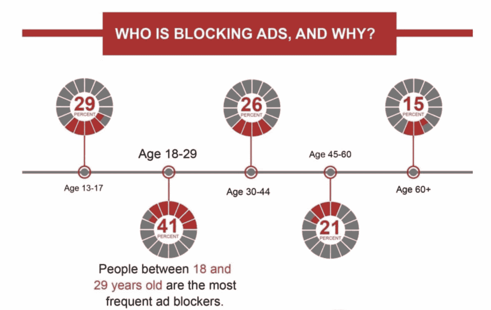

Who is blocking ads? (Image source: MGR Consulting Group)

随之而来的是，拥有更多精通技术的用户的行业将会体验到更高的广告拦截技术。

用户说他们开始使用广告拦截技术有两个主要原因:

> 需要在这里大声喊出来。Kinsta 太神奇了，我用它做我的个人网站。支持是迅速和杰出的，他们的服务器是 WordPress 最快的。
> 
> <footer class="wp-block-kinsta-client-quote__footer">
> 
> 
> 
> <cite class="wp-block-kinsta-client-quote__cite">Phillip Stemann</cite></footer>

[View plans](https://kinsta.com/plans/)

1.  他们的计算机感染了病毒(与恶意软件和间谍软件没有区别)。
2.  他们被告知广告拦截器。

因此，尽管出版商可能不喜欢广告拦截器，但用户显然喜欢。但是广告拦截者是如何赢得赞誉的呢？广告拦截器对用户来说就像看门人一样，防止他们下载不需要的内容。它会在广告显示之前中断服务器和用户之间的对话。

你可以看到这一点很好地说明如下。

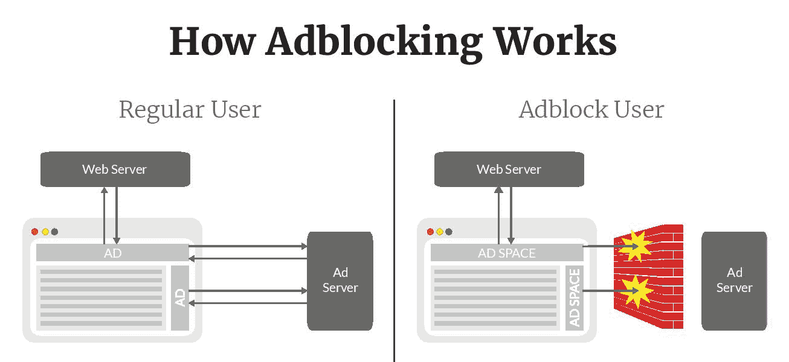

How ad blocking works (Image source: [AdGuard](https://adguard.com/en/blog/how_adblocking_works/))

然而，它们不仅仅打断广告和用户之间的对话。一些网站还停止跟踪代码向网站发回用户活动的信息。对于营销人员来说，这可能是一个严重的分析杀手。

默认情况下，许多新的广告拦截器和隐私功能会拦截[谷歌分析](https://kinsta.com/blog/how-to-use-google-analytics/)。😨这意味着如果你使用谷歌分析来跟踪流量，转换，甚至将数据发送回 AdWords，你的整个数据集可能会严重失真。

*   [uBlock Origin](https://chrome.google.com/webstore/detail/ublock-origin/cjpalhdlnbpafiamejdnhcphjbkeiagm?hl=en) 广告拦截器 Chrome extension **默认拦截 Google Analytics**(阻止`gtag.js`和`analytics.js`脚本加载。).这个扩展有 1000 多万用户。
*   如果启用了 Easylist 选项，Adblock + Adblock plus Chrome 扩展**都会阻止 Google Analytics。**
*   Mozilla Firefox 中的跟踪保护功能会自动屏蔽 Google Analytics。
*   像 [Ghost](https://ghostbrowser.com/) **这样的浏览器默认屏蔽 Google Analytics** 。
*   数百个其他扩展和工具，如 [Disconnect](https://chrome.google.com/webstore/detail/disconnect/jeoacafpbcihiomhlakheieifhpjdfeo?hl=en) 也屏蔽了谷歌分析。
*   GDPR 现在也在其中发挥着作用。

[Ad blockers could be skewing your Google Analytics and AdWords data by 30-40%! 😱Click to Tweet](https://twitter.com/intent/tweet?url=https%3A%2F%2Fkinsta.com%2Fblog%2Fad-blockers%2F&via=kinsta&text=Ad+blockers+could+be+skewing+your+Google+Analytics+and+AdWords+data+by+30-40%25%21+%F0%9F%98%B1&hashtags=analytics%2Cmarketing)

但是对于用户来说，这是一个主要的隐私问题。这不是不必要的担心。只需考虑时尚的的例子，一个现在被禁止的浏览器扩展，让用户定制他们的网络体验，减少混乱。它深受粉丝们的喜爱，直到有人发现它严重侵犯了隐私。

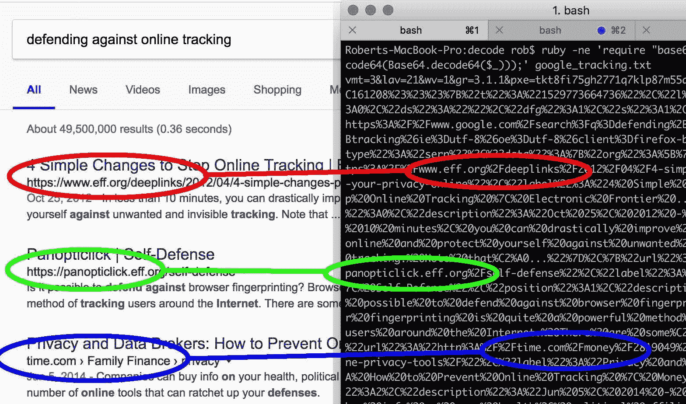

Browser extension steal internet history (Image source: [Robert Heaton](https://robertheaton.com/2018/07/02/stylish-browser-extension-steals-your-internet-history/))

它发回了每个访问过的网址，并且自 2017 年 1 月以来，它一直在存储每个用户的网络历史。虽然这个故事将它发挥到了极致，从技术上来说是浏览器的扩展，但它很好地说明了这一点:追踪器可能是一个真正的问题，广告拦截器对于普通用户来说也是一个同样真实的解决方法。

不过，这也让依赖广告收入的网站所有者处境艰难。有几个解决方案来对抗第三方广告拦截器，但它们并不总是容易或值得努力。

你可以随时控制你的内容，就像 [Business Insider 在这里](https://www.businessinsider.com/pagefair-2017-ad-blocking-report-2017-1)所做的那样。一方面，这可以通过让用户注册特殊会员来帮助你获得收入(稍后会有更多的介绍)。

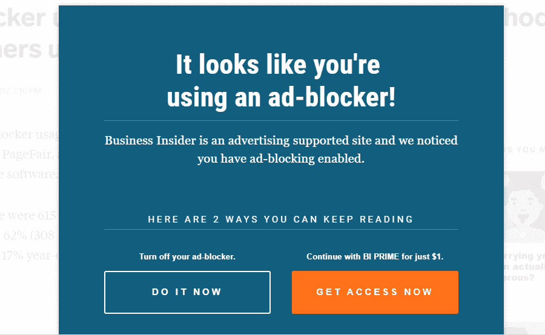

Gate content

另一方面，如果他们决定转向更环保、对广告更友好的领域，你可能会完全失去领先优势。

或者，你可以采取更激进的方法，通过"[拦截广告拦截器](https://www.shopify.com/enterprise/56344515-how-to-block-the-ad-blockers-whether-you-should)"来完全绕过这项技术，但这更像是一场赌博。

你可能最终会投入资金，在已经表示不想看广告的潜在客户面前强行投放广告。最多，你会赔钱。最坏的情况是，你会让你的用户感到沮丧。请记住，这种方法只对尚未使用 Chrome 的用户有效，Chrome 是全球最受欢迎的浏览器。

因此，你的里程可能会有所不同。另外，你可以直接问。毕竟，穿过一扇锁着的门最快的方法通常是敲门。

这里有一个来自 [Nexus Mods](https://www.nexusmods.com/) 的例子。

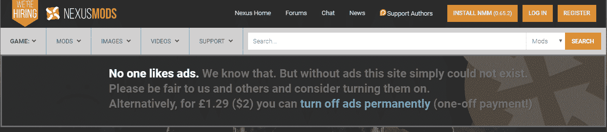

Ask to turn off ads (Image source: Nexus Mods)

这个请求不引人注目地填充了广告应该出现的空间。它维护了用户的体验，并给了他们一些思考的东西。这是另一个来自金融服务/信贷提供商 [Credit One Bank](https://www.creditonebank.com/) 的例子。

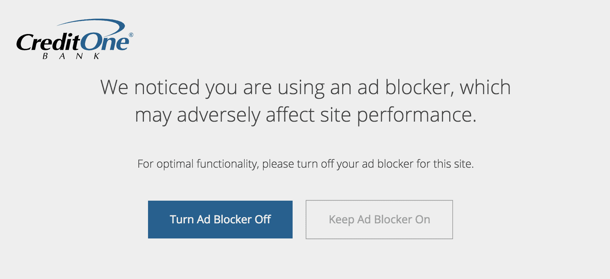

Using ad blocker notification

在这两种情况下，用户都被请求(但不是强制)将提供商加入白名单。如果他们对浏览网站或使用服务感兴趣，他们仍然可以通过广告拦截器的安全毯来了解网站。

相比之下，访问 Business Insider 的用户必须在购买、移除广告拦截器或离开之间做出决定。

如果他们没有足够的动力去付费或关闭广告拦截器，他们就没有机会自己找到动力。

既然你已经知道了第三方广告拦截器是如何工作的，以及你可能的解决方案，那就让我们来谈谈 Chrome 与众不同的地方吧。

## 谷歌浏览器的广告拦截器是如何工作的

我们已经提到 Chrome 是最流行的浏览器。但是它到底有多受欢迎呢？最近的一项研究显示，Chrome 占据了 77.03%的浏览器市场份额。太多了！😮

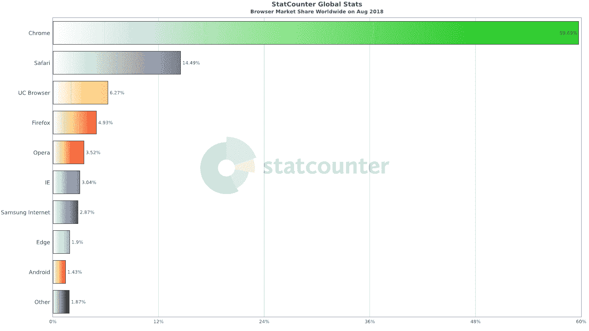

Global browser market share

因此，无论你如何削减，广告拦截器都会用在线广告打击任何人。除非没有。

让我解释一下。Chrome 的新广告拦截功能与第三方广告拦截器的功能相同，即中断服务器和最终用户之间的对话。然而，它如何评估“不想要的元素”，是基于网站的可用性以及它与 T2 更好广告标准的符合程度。

该标准是基于对美国和欧洲超过 25，000 名用户的研究而制定的，旨在确定迫使用户采用广告拦截器的广告类型。换句话说，那些对用户体验有害的广告才是最值得畏缩的。

结果相当有趣。以下是让桌面用户渴望广告拦截器的四类广告。

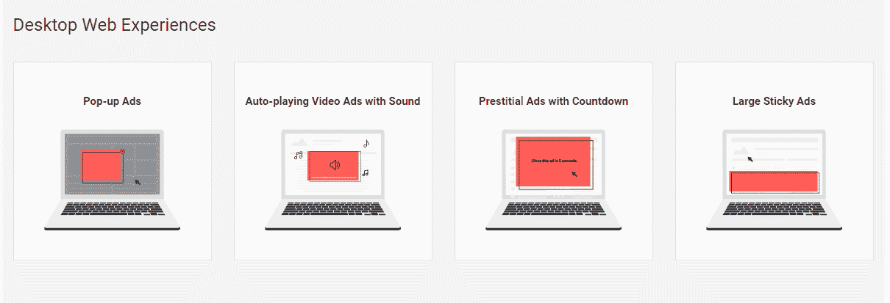

Desktop web experiences

请注意，广告特指广告，而不是可能采用相同格式的模式或选择加入。移动用户认为令他们反感的广告类型是以前的两倍。

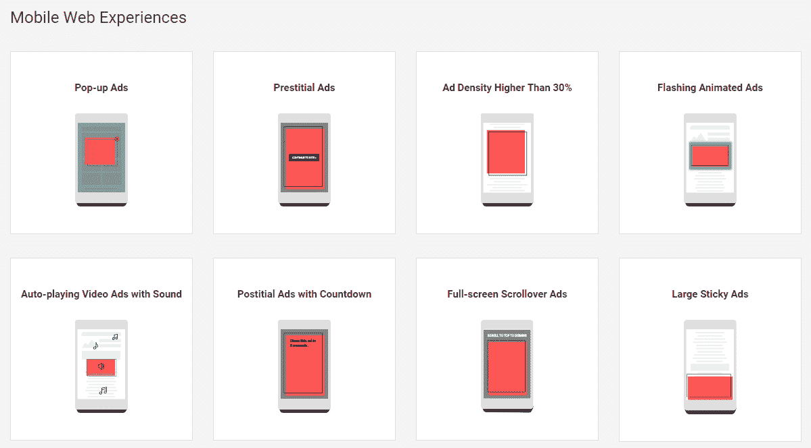

Mobile web experiences

如果你目前的广告不属于这些类别中的任何一个，你就是黄金。但是如果他们这样做了，如果你的网站被标记为违反了更好的广告标准超过三十天，你可以期待 Chrome 屏蔽你网站上的所有广告。

谷歌网站管理员趋势分析师约翰·穆勒在谷歌网站管理员“办公时间”聚会上解释道:

> 如果我们发现一个网站违反了标准，那么 Chrome 会选择不显示任何广告。这是专门针对 Chrome 的。

顺便说一句，那些不是打字错误。与第三方广告拦截器不同， [Chrome 不能逐个广告地运行](https://www.theverge.com/2018/2/14/17011266/google-chrome-ad-blocker-features)。如果你被发现违反了更好的广告标准，并且没有在 30 天的窗口内提交重新审查，所有的广告，无论是否合规，都将被屏蔽。

这是 Chrome 在广告拦截方面的一个例子。

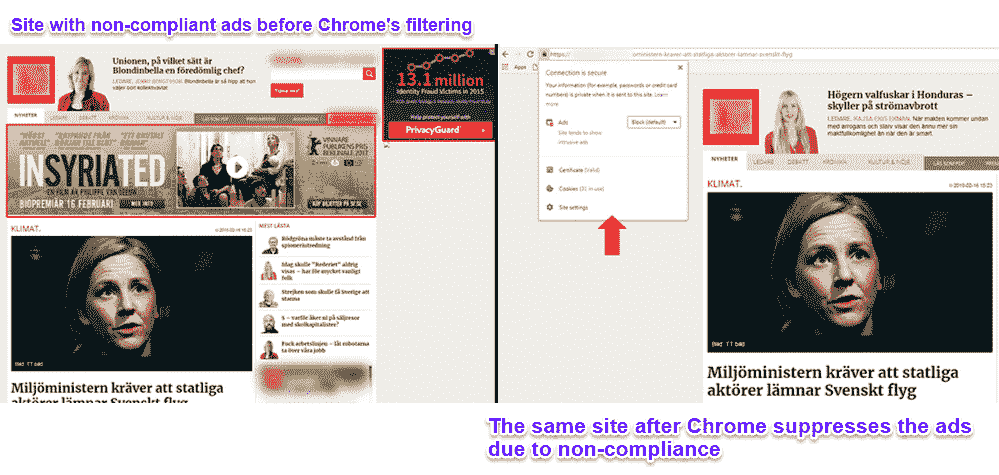

Chrome blocking ads (Image source: [GSQi](https://www.gsqi.com/marketing-blog/chrome-ad-filtering-in-action-first-examples/))

值得注意的是，违例*被*视为基于设备。例如，如果您的网站的移动版本违规，但桌面版本没有违规，则桌面版本将正常显示。反之亦然。

换句话说，如果你的广告符合更好的广告标准，那么这种变化不会对你产生任何影响。你可以在谷歌搜索控制台中查看你的网站。如果你看到“状态:未审查”，那么你的网站没有违规。

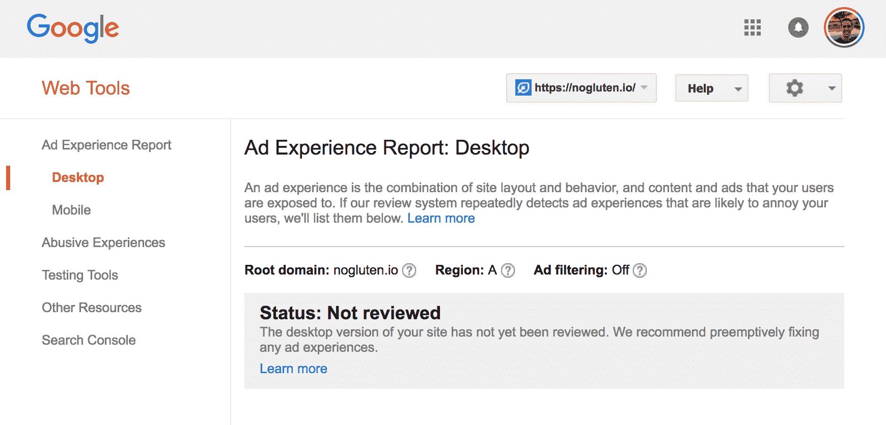

Ad Experience Report not reviewed

如果你的网站是违规的，那么检查网站设计问题标签或创意问题标签。这些将有额外的信息告诉你为什么，你可以做些什么来修复它。

然而，你会想看看这篇文章的结尾，看看我们为你的网站赚钱的五种方法。

## 如何禁用网站上的 Chrome 广告拦截器

Chrome 的广告拦截器现在内置在浏览器中，默认情况下，每个网站都可以使用。如果你想在一个网站上禁用 Chrome 广告拦截器(允许广告)，只需点击地址栏中网站名称旁边的小图标，然后点击“网站设置”

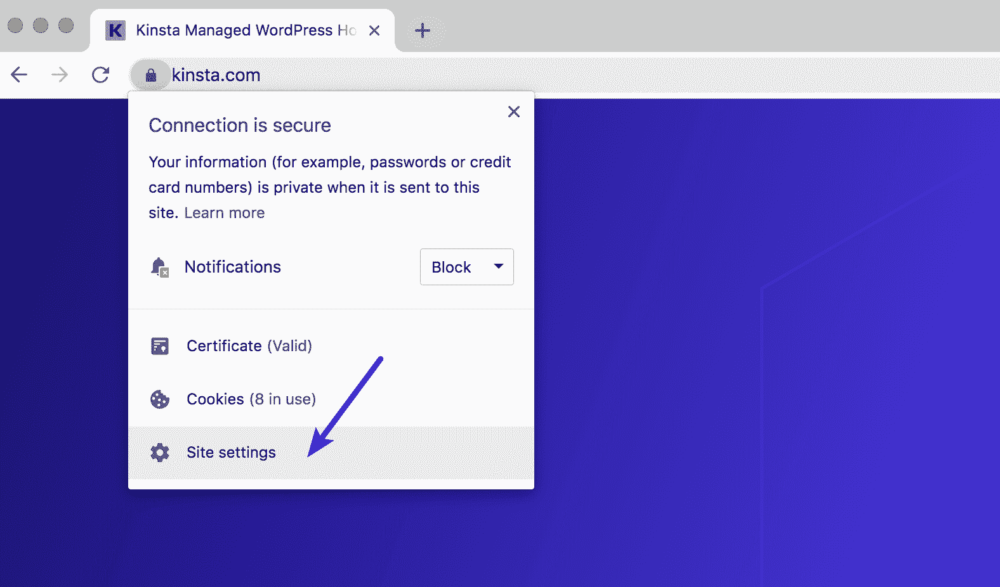

Chrome site settings

然后，您可以选择是否允许在页面上插入广告。同样，这些设置是基于单个站点的。

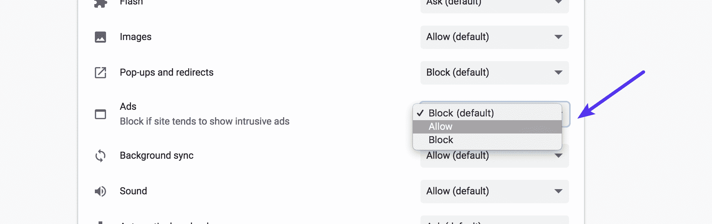

Allow Chrome Ad Blocker

## 广告拦截的未来会如何

如果你有机会的话，去 Chrome 商店逛逛，看看他们的[广告区](https://chrome.google.com/webstore/search/adblock?_category=extensions)。它(仍然)蓬勃发展。

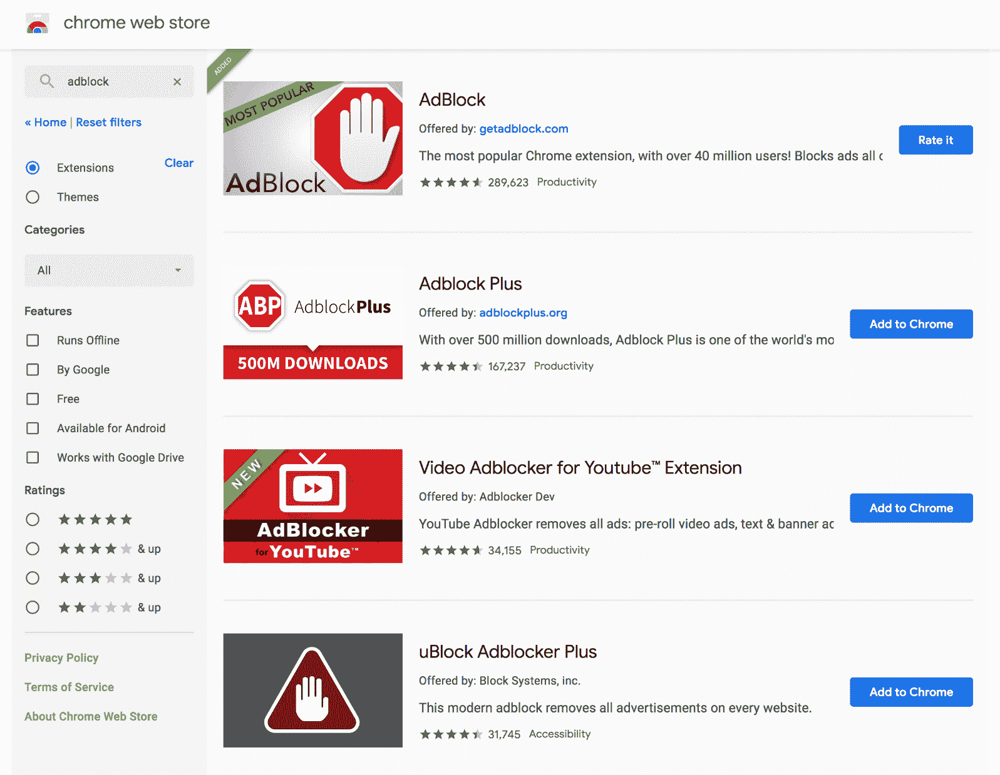

Chrome store ad block extensions

然而，随着时间的推移，这一势头预计将会减弱。这是个好消息。

尽管这些广告拦截器将继续发挥作用，但专家预计，随着越来越多的用户了解并受益于 Chrome 的新广告拦截功能，越来越少的用户会选择它们。

这意味着，随着时间的推移，与第三方市场放任自流相比，Chrome 实际上可能会导致更多谷歌友好(和用户友好)的广告出现在用户面前。

## 注册订阅时事通讯

### 想知道我们是怎么让流量增长超过 1000%的吗？

加入 20，000 多名获得我们每周时事通讯和内部消息的人的行列吧！

[Subscribe Now](#newsletter)

反过来，从长远来看，[只会让广告商](https://www.thedrum.com/opinion/2018/01/30/why-googles-new-built-chrome-ad-blocker-actually-beneficial-advertisers)受益。然而，这是一场持久战。关于一家公司支配广告和浏览器使用的地位，也不是没有一些[道德上的棘手问题。](https://www.cnbc.com/2018/02/17/google-chrome-ad-blocking-reactions.html)

与此同时，这是一个复杂的网络(没有双关语的意思),需要企业主来导航。很多同样的事情会损害你在谷歌“移动第一”指数中的搜索引擎排名，这些事情与更好的广告标准重叠。

一家企业眼看着自己的有机排名[稳步下降](https://www.bluearray.co.uk/news/google/ads-web-page-effect-seo/)，这要归功于广告密集的布局，尽管合规。

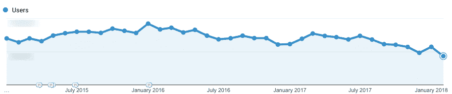

Advertisement-heavy traffic decline

没有人希望看到这样的性能下降。虽然搜索引擎优化和广告不是同义词，但它们都可能损害你的底线，解决它们是营销人员最头疼的事情。

另外，还有更好的方法。

## 6 种不同的方法让你的网站赚钱

在这个勇敢的新广告拦截世界里，不要试图争论合规性，让你的旧广告策略发挥作用，为什么不转向替代性的(而且往往是有利可图的)解决方案来让你的网站赚钱呢？

现在来说说其中的六个。

### 1.退回到替代广告格式或显示警告

您可以使用类似于 [Detect AdBlock](https://www.detectadblock.com/) 的解决方案来计算您的网站受到了多大程度的影响。如果检测到广告拦截器或向其显示警告，您可以使用替代广告格式。

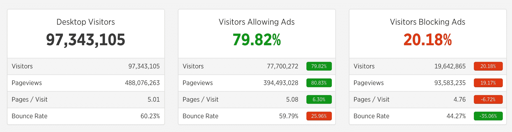

Ad blocking statistics

例如，也许你运行 [Google Adsense](https://kinsta.com/blog/how-to-add-google-adsense-to-wordpress/) 或者一些 [Google AdSense 替代品](https://kinsta.com/blog/adsense-alternatives/)。如果检测到广告拦截器，您可以让它退回到联盟广告。通常，联盟广告只是[图片横幅](https://kinsta.com/blog/banner-ad-sizes/)，不应该受到广告拦截器的影响。广告插入器是一个为使用广告拦截器的用户提供不同广告的插件。

或者你可以走这条路，给运行广告拦截器的访问者显示警告，类似于[广告疯狂插件](https://adsanityplugin.com/downloads/ad-block-detection/)。这里的想法是，你鼓励访问者在你的网站上禁用广告拦截(白名单)，以帮助支持运行它的成本。

一定要看看我们关于你可以使用的其他 [WordPress 广告插件](https://kinsta.com/blog/wordpress-advertising-plugin/)的帖子。

### 2.出售电子书或数字下载

两周内 3000 美元怎么样？随着时间的推移，用你建立的一个小小的电子邮件列表怎么样？如果你是道格·贝尼，这听起来就像是你的第一本电子书《T2》的发行。

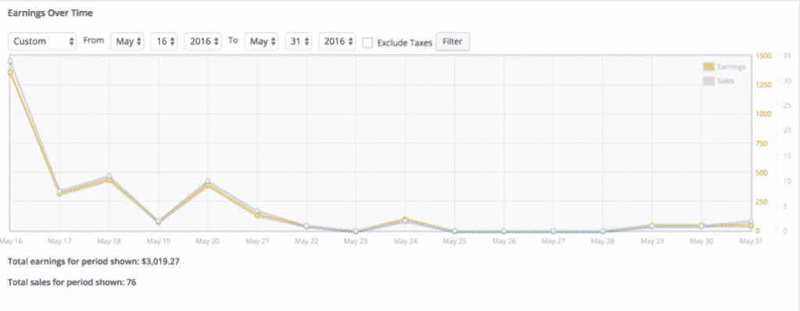

Ebook launch success

很好，对吧？道格的故事证明了两件事:

1.  首先，你不需要成为一个大的出版社来使数字下载有利可图。
2.  第二，Google Workspace 真的可以做任何事情。

毕竟，他是用谷歌幻灯片制作电子书的。印象深刻！

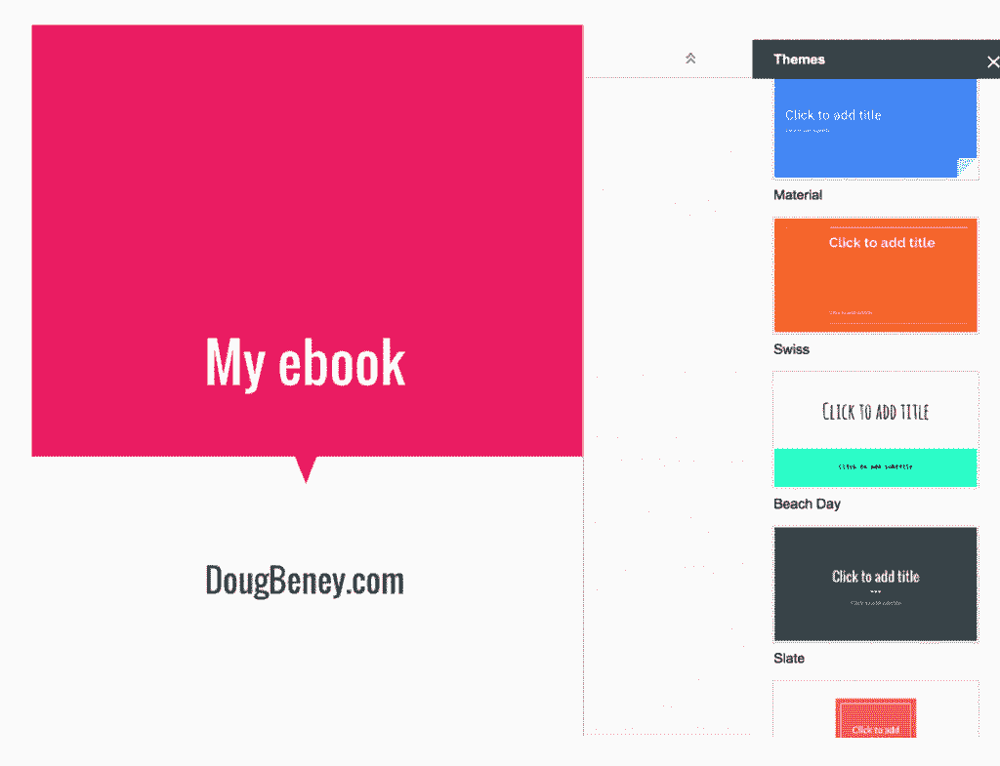

Ebook in Google Slides

但是严肃地说，电子书产业正在蓬勃发展。传统出版社感到 2017 年电子书销量下降了 10%，但这对网站所有者来说是个好消息。为什么？因为这一损失是由独立出版商造成的。

所以趁时机还不错，赶紧进去吧。如果你有一个故事或知识要分享，找到你的市场，像道格一样测试你的想法，并加载谷歌幻灯片。

Struggling with downtime and WordPress problems? Kinsta is the hosting solution designed to save you time! [Check out our features](https://kinsta.com/features/)

### 3.创建在线课程

电子学习市场是另一个尚未开发的热点。预计到 2025 年，这一数字将猛增至 3250 亿美元。有大量的 [LMS 插件可以直接将](https://kinsta.com/blog/wordpress-lms-plugins/)与你的 WordPress 站点集成。

设置在线课程很容易，有专家 [LMS 主持](https://kinsta.com/wordpress-lms-hosting/)就可以了。如果蓬勃发展的市场增长还不足以让你相信它的价值，那就想想尼克·斯蒂芬森的故事吧。尼克在第一周的销售中为[赚了 130，208 美元。](https://therisetothetop.com/davids-blog/130208-case-study-nick-stephenson-created-launched-online/)

有大约 3500 封邮件。为了推出你的在线课程，你能做些什么呢？今天安装一个 LMS WordPress 插件来找出答案。

对于我们的第三个货币化选择，让我们谈谈会员资格。

### 4.提供高级会员资格

会员资格不是一夜之间就能盈利的，但是他们的缓慢燃烧值得等待。为什么？因为会员资格是一种可扩展的，最重要的是，[经常性的收入来源](https://foundr.com/profitable-membership/)。

什么是会员制网站？这很大程度上取决于你问谁。但一般来说，它是任何收取固定费用(每月或每年)并为会员提供独家内容的网站。

通常，内容包括网络研讨会、文章、播客和社区论坛。例如，Copyblogger 的“ [My Copyblogger](https://my.copyblogger.com/) ”符合这个定义。

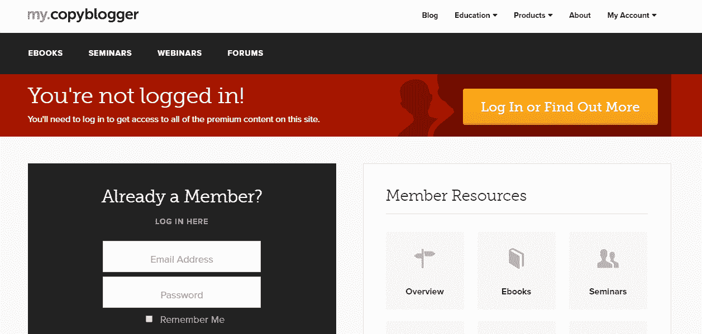

Copyblogger membership site

该网站为访问者提供免费内容和线索磁铁，但他们将最好的功能留给付费用户。

你如何知道会员制模式是否适合你的网站？这取决于你生产什么。如果你是一个电子零售商，高级会员套餐可能不是一个容易的飞跃。

但是如果你已经写出了非常棒的长篇文章，这可能是一个完美的选择。

另一个要考虑的因素是你的 WordPress 主机的技术需求。由于并发用户和 WordPress 会员网站面临的独特挑战，如果你想走这条路，最好有一个基于性能的计划。

但是我有没有提到会员网站有多赚钱？这太令人震惊了。一位创作者能够将她的社交媒体粉丝转化为 8000 美元的会员资格。另一个人通过她的课程会员网站为[维持着每月 5000 美元的收入流](https://www.optimizepress.com/blogger-builds-5k-month-business/)。

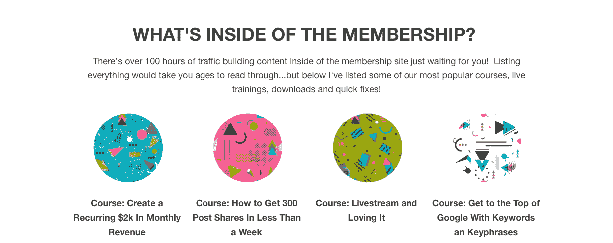

Membership

因此，如果你已经在内容世界中，并在寻找一种方法来赚钱你的网站，会员计划绝对值得考虑。你可以看看我们关于运行 WordPress 会员网站的实用技巧和[最喜欢的插件。](https://kinsta.com/blog/wordpress-membership-plugins/)

我们今天的最后一个提示可能是迄今为止最好的。有什么比额外收入更好的？填满你编辑日历的额外收入。

### 5.展示赞助内容和评论

如果你关注任何食物博客，你可能已经看到了一个赞助的帖子。例如，[这里有一个来自一撮百胜](https://pinchofyum.com/garlic-herb-spaghetti-chicken-meatballs)代表蓝湖黄油。

Sponsored post example

顾名思义，赞助内容是指由赞助商付费并由所有者或影响者发布在网站或平台上的[内容。](https://www.brandpoint.com/blog/native-advertising-vs-sponsored-content-whats-the-difference/)

然而，将它与广告区分开来是很重要的。虽然它是赞助商的一种广告形式，但内容本身对用户来说是真正有价值的，比如上面的食谱。此外，如果做得好，赞助内容在参与度和品牌印象方面绝对可以让广告相形见绌。

想想卢拉·基德的例子。创建三个独特的、引人入胜的内容，作为赞助内容分发给母公司的观众[，为他们赢得了超过 125，000 次展示](https://drive.google.com/viewerng/viewer?url=https://static1.squarespace.com/static/59b9a9ba51a584c6ef85d08e/t/5a5d0198085229750fd1d397/1516044699988/ParentCo-CS-LulaKids.pdf)。

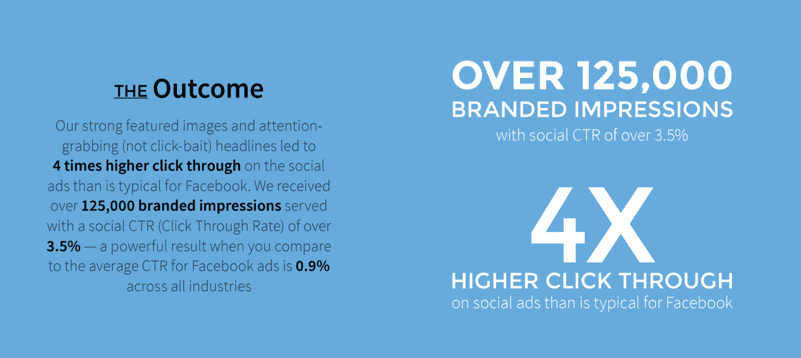

Sponsored content impressions

它的点击率比脸书的标准高出四倍。这也是公司愿意为此买单的原因。

你应该收多少钱或者期望赚多少钱？确定一个平均价格是困难的。像领域权威、利基、追随者规模等因素会改变它。但是 Hobo 和笔记本电脑背后的写作头脑为那些有兴趣接受(或创造)赞助内容的博客们准备了一张极好的“收费卡”。

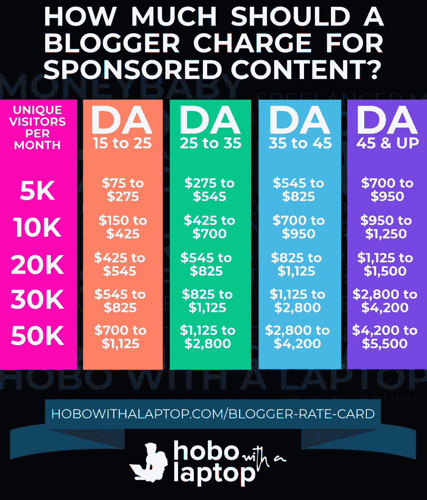

Charge for sponsored content

但是这种货币化策略还有最后一点需要记住:如果你接受赞助内容来换取收入、服务或商品，那么[你绝对](https://www.ftc.gov/tips-advice/business-center/guidance/ftcs-endorsement-guides-what-people-are-asking) [*必须*](https://www.ftc.gov/tips-advice/business-center/guidance/ftcs-endorsement-guides-what-people-are-asking) [披露](https://www.ftc.gov/tips-advice/business-center/guidance/ftcs-endorsement-guides-what-people-are-asking)你在内容中的关系。

它可以像你在 Pinch of Yum 看到的例子一样简单。或者，它可以是一个关于产品的说明，例如，“谢谢，X 公司，给我寄来一个免费样品。”但是跳过这一步会产生法律问题，所以如果有疑问，一定要把它加粗，清晰，放在顶部。

总结如下:如果你有一个活跃的博客，你可以通过接受或创建赞助内容来增加收入。只要确保你是公开的，并收取对赞助商和你自己都公平的费用。

### 6.通过联盟营销使收入来源多样化

最后但同样重要的是，你有联盟营销！这是一种营销方式，你通过销售别人的服务或产品来获得佣金。通常，这涉及到访问者在您的网站上点击一个特殊的链接，导致一个 cookie 被放置在访问者的浏览器中一段预定义的时间(通常为 30 到 60 天)。如果访问者最终在这段时间内购买了服务或产品，推广它的网站所有者将获得佣金。

这可能是广告收入的一个很好的替代品。你可以利用多种不同的联盟计划，因此不要把所有的鸡蛋放在一个篮子里。🥚或者甚至将联盟营销与你现有的广告收入相结合。

有时联盟营销得到一个坏的刻板印象，因为一些营销人员倾向于歪曲事实，只是为了使销售。但许多人只靠推销他们使用和喜爱的高质量产品为生。这可以是任何东西，一个[旅游博客](https://kinsta.com/blog/how-to-start-a-travel-blog/)，一个[美食博客](https://kinsta.com/blog/how-to-start-a-food-blog/)，或者甚至是一个你只是在那里谈论你使用的 WordPress 产品的网站！

我们知道这很有效，因为事实上，我们在 Kinsta 有一个[会员计划。每推荐一次，您可以获得高达 500 美元的奖励，外加 10%的每月定期终身佣金。许多人每个月已经赚了很多钱。](https://kinsta.com/affiliates/)

[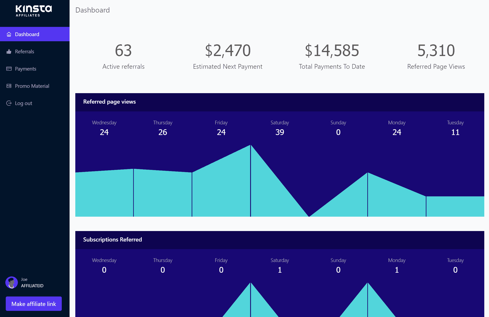](https://kinsta.com/affiliates/)

Kinsta affiliate program

[When it comes to affiliate marketing, it's hard to beat passive income. 👍Click to Tweet](https://twitter.com/intent/tweet?url=https%3A%2F%2Fkinsta.com%2Fblog%2Fad-blockers%2F&via=kinsta&text=When+it+comes+to+affiliate+marketing%2C+it%27s+hard+to+beat+passive+income.+%F0%9F%91%8D&hashtags=passiveincome%2Caffiliatemarketing)

想了解更多的赚钱方法，请看我们的详细指南:[如何将博客货币化——13 种盈利方法](https://kinsta.com/blog/how-to-monetize-a-blog/)

## 摘要

要了解 Chrome 的新广告拦截器将如何影响你的收入，你必须了解它与第三方广告拦截器有何不同。例如，第三方广告拦截器的工作原理是中断用户电脑和负责广告的服务器之间的通信。其中一些还屏蔽了谷歌分析等跟踪代码。

Chrome 的广告拦截器或多或少都有些歧视。与第三方广告拦截器不同，Chrome 是逐网站运行的。如果它标记你的网站违反了更好的广告标准，而你没有在 30 天内修复它，它将禁止你网站上的所有广告。即使是合规的广告。

但这种变化对广告业来说其实是积极的。从长远来看，预计这将导致第三方广告拦截器的下降，并帮助广告商在用户面前获得更多合规的广告。

底线是:如果你目前的广告是合规的，你不应该期待任何改变。如果他们不是，你将不得不改变策略。很快。更好的是，为什么不彻底改变你的盈利策略呢？

电子书(或数字下载)、在线课程、会员网站、赞助内容和联盟营销都是你网站赚钱的简单而有利可图的选择。最重要的是，你不必等待另一只广告鞋掉下来。

然而，当涉及到第三方广告拦截器和新的浏览器隐私跟踪功能时，这些对网站所有者产生了巨大的影响。无论是从收入角度还是从营销人员的角度来看，谷歌分析对许多用户来说可能会被完全屏蔽。

广告拦截器对你的收入或数据有影响吗？我们很想听听你的想法。

* * *

让你所有的[应用程序](https://kinsta.com/application-hosting/)、[数据库](https://kinsta.com/database-hosting/)和 [WordPress 网站](https://kinsta.com/wordpress-hosting/)在线并在一个屋檐下。我们功能丰富的高性能云平台包括:

*   在 MyKinsta 仪表盘中轻松设置和管理
*   24/7 专家支持
*   最好的谷歌云平台硬件和网络，由 Kubernetes 提供最大的可扩展性
*   面向速度和安全性的企业级 Cloudflare 集成
*   全球受众覆盖全球多达 35 个数据中心和 275 多个 pop

在第一个月使用托管的[应用程序或托管](https://kinsta.com/application-hosting/)的[数据库，您可以享受 20 美元的优惠，亲自测试一下。探索我们的](https://kinsta.com/database-hosting/)[计划](https://kinsta.com/plans/)或[与销售人员交谈](https://kinsta.com/contact-us/)以找到最适合您的方式。