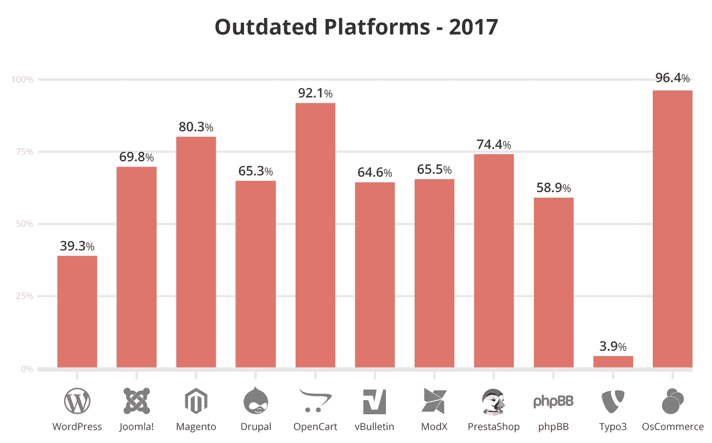
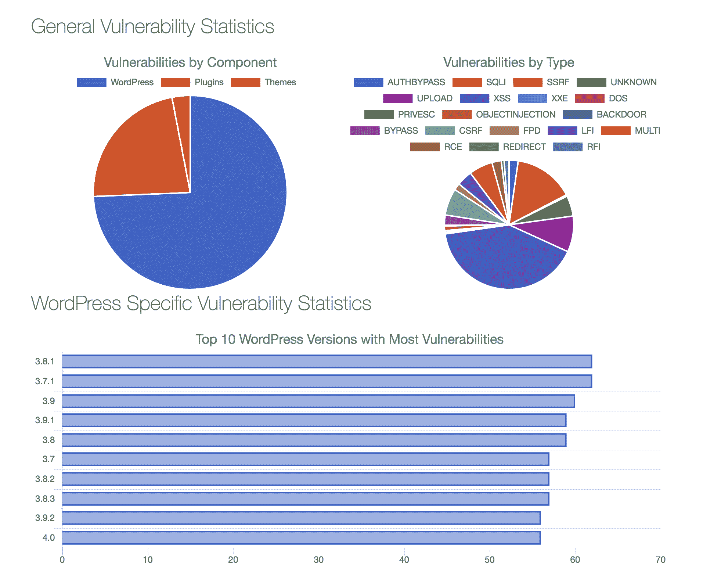
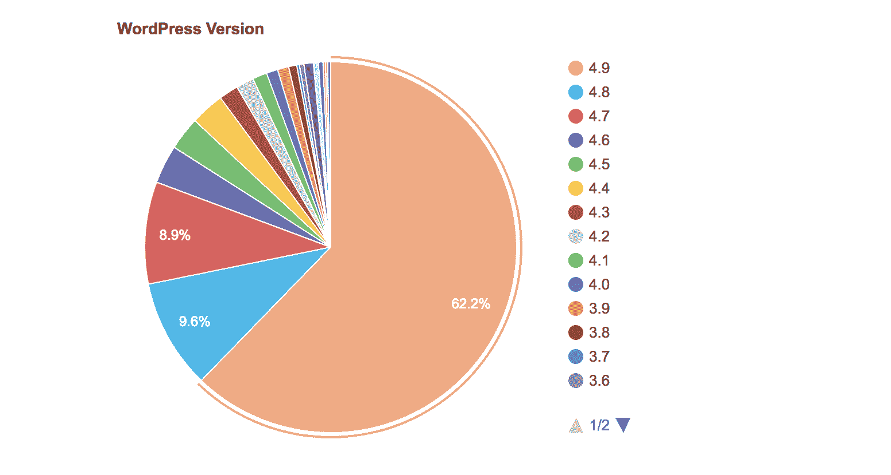
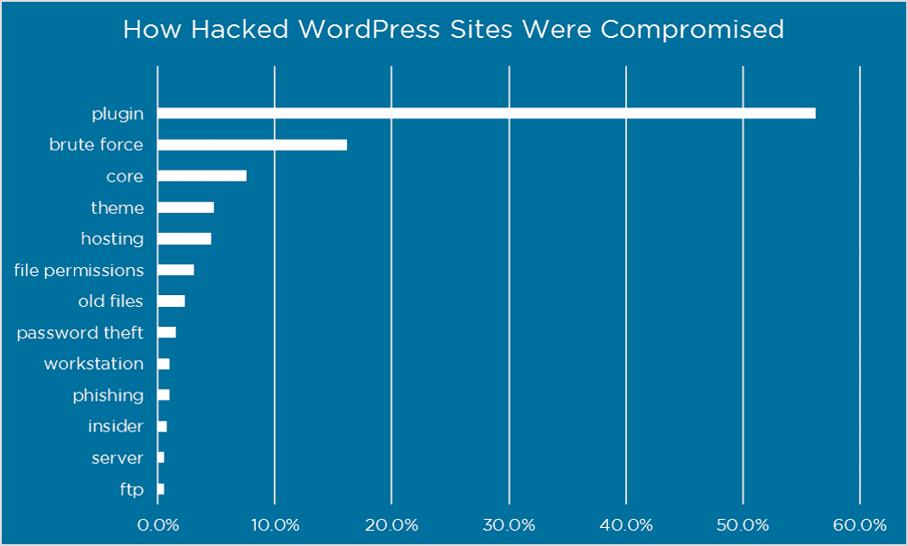
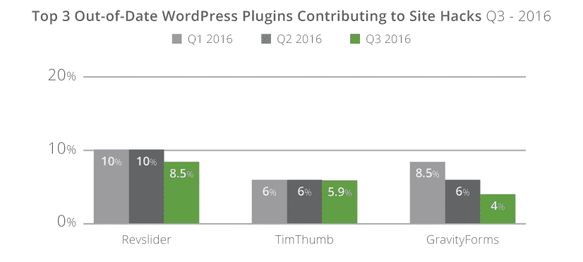
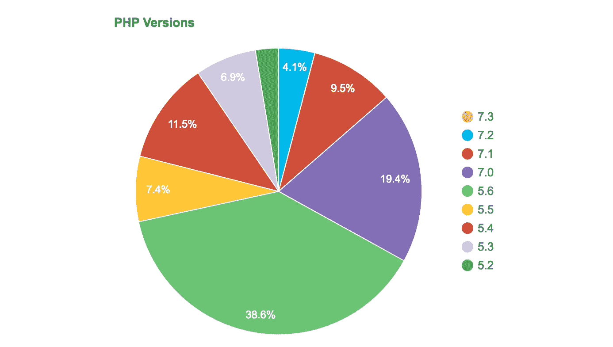

# WordPress 安全吗？数据是这样说的

> 原文：<https://kinsta.com/blog/is-wordpress-secure/>

WordPress 是迄今为止最流行的建立网站的方式。这种流行有一个不幸的副作用，那就是 WordPress 网站成为全世界恶意行为者的一个诱人的目标。这可能会让你怀疑 WordPress 是否足够安全来应对这些攻击。

首先——一些坏消息:每年都有成千上万的 WordPress 网站和电子商务网站遭到黑客攻击(这就是为什么我们有一个关于 T2 电子商务欺诈防范的深度指南)。

听起来很可怕，对吧？嗯……不完全是，因为也有好消息:

由于最新的 WordPress 核心软件存在漏洞，黑客无法进入。相反，*大多数*网站被黑客攻击完全是可以预防的问题，比如[没有保持更新](https://kinsta.com/blog/wordpress-automatic-updates/)或者使用不安全的密码。

因此，回答“WordPress 安全吗？”需要一些细微差别。为此，我们将从几个不同的角度进行介绍:

*   统计 WordPress 网站实际上是如何被黑客攻击的，这样你就能了解安全漏洞在哪里。
*   WordPress 核心团队如何解决安全问题，这样你就知道谁负责，他们负责保护什么。
*   如果你遵循最佳实践，WordPress 是安全的，那么你就知道你的网站是否安全。

## WordPress 网站如何被黑客攻击(数据)

好吧，你知道每年都有大量的 WordPress 网站被黑。但是……这是怎么发生的？这是全球 WordPress 的问题吗？还是来源于那些站长的行动？

> Kinsta 把我宠坏了，所以我现在要求每个供应商都提供这样的服务。我们还试图通过我们的 SaaS 工具支持达到这一水平。
> 
> <footer class="wp-block-kinsta-client-quote__footer">
> 
> 
> 
> <cite class="wp-block-kinsta-client-quote__cite">Suganthan Mohanadasan from @Suganthanmn</cite></footer>

[View plans](https://kinsta.com/plans/)

根据我们掌握的数据，这是大多数 WordPress 网站被黑的原因…

### 过时的核心软件

这里有一个毫不奇怪的关联，来自于 [Sucuri 的 2017 年被黑网站报告](https://blog.sucuri.net/2018/04/hacked-website-trend-report-2017.html)。在苏库里查看的所有被黑的 WordPress 网站中， **39.3%在事件发生时运行过期的 WordPress 核心软件**。

Hacked websites (Image source: Sucuri)

所以，你马上就能看到被黑客攻击和使用过期软件之间的密切关系。不过这绝对比 2016 年的 [61%有进步。👏](https://sucuri.net/reports/2016-q3-hacked-website-report)

根据 WPScan 漏洞数据库的数据，他们记录的大约 74%的已知漏洞都在 WordPress 核心软件中。**但是这里有个问题**——有最多漏洞的版本早在 WordPress 3 中就有了。x:

WPScan list of known vulnerabilities

但是，不幸的是，只有 62%的 WordPress 网站运行最新版本，这就是为什么许多网站仍然容易受到这些漏洞的攻击:

WordPress Usage By Version. (Image source: WordPress.org)

最后，你可以再一次看到这种联系与 2017 年 2 月的主要 WordPress REST API 漏洞有数十万个网站遭到破坏。

WordPress 4.7.1 包含了多个最终被用来破坏这些网站的漏洞。但是……在漏洞被利用的几周前，WordPress 4.7.2 发布了，修复了所有这些漏洞。

所有没有禁用自动安全补丁或者及时更新到 WordPress 4.7.2 的 WordPress 网站所有者都是安全的。但是那些没有应用更新的人就不是了。

总结:WordPress 安全团队在快速修复 WordPress 核心软件中的问题方面做得非常好。如果您及时应用了所有的安全更新，那么您的站点不太可能因为核心漏洞而遇到任何问题。但是如果你不这样做，一旦漏洞被利用，你就要承担风险。

### 2.过时的插件或主题

人们喜欢 WordPress 的原因之一是令人眼花缭乱的可用插件和主题。在我写这篇文章的时候，WordPress 知识库上有超过 56，000 个，还有成千上万个分散在网络上的额外的优质网站。

虽然所有这些选项对于扩展您的站点都很好，但是每个扩展都是恶意行为者的新的潜在入口。虽然大多数 WordPress 开发者在遵循代码标准和修补任何已知的更新方面做得很好，但仍然有一些潜在的问题:

*   一个插件或主题有一个漏洞，因为没有 WordPress 核心软件那么多眼睛盯着它，这个漏洞没有被发现。
*   开发者已经停止了扩展的工作，但是人们仍然在使用它。
*   开发者很快修补了这个问题，但是人们就是不更新。

那么这个问题有多大呢？

嗯，在 Wordfence 对被黑网站所有者的[调查中，超过 60%的**知道黑客如何进入** 的网站所有者 ***将其归因于插件或主题漏洞。***](https://www.wordfence.com/blog/2016/03/attackers-gain-access-wordpress-sites/)

Wordfence hacked website survey (Image source: Wordfence)

同样，在 su curi 2016 年的报告中，**仅 3 个插件就占了他们查看的被黑网站的 15%以上**。

Sucuri hacked plugin list

**这里有一个难题:**

这些插件中的漏洞早就被修补了——网站所有者只是没有更新插件来保护他们的网站。

**外卖** : [WordPress 主题](https://kinsta.com/best-wordpress-themes/)和插件引入了通配符*可以*向恶意行为者开放你的网站。不过，这种风险大部分可以通过遵循最佳实践来减轻。保持您的扩展更新，并且只安装来自可靠来源的扩展。

我们还必须提到这些 GPL 俱乐部，你可能会在网上看到，在那里你只需要花几美元就可以得到任何优质的 WordPress 插件或主题。虽然 WordPress 是在 GPL 下授权的，这很棒，也是我们喜欢它的一个原因，但是买家要小心。这些有时也被称为空插件。

## 注册订阅时事通讯

### 想知道我们是怎么让流量增长超过 1000%的吗？

加入 20，000 多名获得我们每周时事通讯和内部消息的人的行列吧！

[Subscribe Now](#newsletter)

从 GPL 俱乐部购买插件意味着你信任第三方从开发者那里获取最新更新，很多时候你得不到支持。**从开发者那里获得插件更新是最安全的途径**。此外，我们都是关于支持开发人员和他们的辛勤工作！

### 3.WordPress、FTP 或主机的登录凭证受损

好吧，这不是 WordPress 的错。但是很大一部分黑客攻击来自恶意行为者，他们得到了 WordPress 的登录凭证，或者网站管理员的主机或 FTP 账户的登录凭证。

在同一个 Wordfence 调查中，暴力攻击占被黑网站的大约 16%,密码窃取、工作站、网络钓鱼和 FTP 帐户都有少量但明显的表现。

一旦一个恶意的行为者获得了前门的隐喻钥匙，无论你的 WordPress 站点在其他方面有多安全都没有关系。

WordPress 实际上通过自动生成安全密码做了很好的工作来减轻这一点，但是仍然由用户来保证这些密码的安全，并且为主机和 FTP 使用强密码。

**提示**:采取基本措施来保证账户凭证的安全可以防止恶意行为者的进入。对所有 WordPress 账户使用/强制使用强密码，并限制登录尝试，以防止暴力攻击( [Kinsta hosting](https://kinsta.com/secure-wordpress-hosting/) 默认这样做)👍).

对于托管账户，如果可能的话，使用双因素认证，并且不要以纯文本形式存储你的 FTP 密码(像一些 FTP 程序那样)。

如果你在 FTP 和 SFTP (SSH 文件传输协议)之间有选择的话， [**永远用 SFTP**](https://kinsta.com/knowledgebase/how-to-use-sftp/) (了解一下 FTP 和 SFTP 的[区别，你就明白为什么了)。如果您的主机只使用 FTP，我们建议询问 s FTP 支持或切换到支持 SFTP 的主机。这可以确保不会传输明文密码或文件数据。在 Kinsta，我们只支持 SFTP 文件传输。](https://kinsta.com/knowledgebase/ftp-vs-sftp/)

### 4.供应链攻击

最近，出现了一些黑客通过一种叫做供应链攻击的卑鄙手段进入网站的例子。本质上，恶意行为者会:

*   购买之前在 WordPress.org 上市的高质量插件
*   在插件代码中添加一个后门
*   等人更新插件再注入后门

如果你感兴趣的话，Wordfence 有更深入的解释。虽然这些类型的攻击并不普遍，但它们更难预防，因为它们是由您应该做的事情(保持插件更新)引起的。

Struggling with downtime and WordPress problems? Kinsta is the hosting solution designed to save you time! [Check out our features](https://kinsta.com/features/)

也就是说，WordPress.org 团队通常会很快发现这些问题，并从目录中删除插件。

**外卖**:这个可能很难预防，因为总是更新到[最新版本](https://kinsta.com/blog/wordpress-5-3/)是件好事。为了有所帮助，像 Wordfence 这样的安全插件可以在插件从 WordPress.org 移除时提醒你，以便你快速解决问题。一个好的备份策略可以帮助您回滚，而不会造成任何永久性的损害。

### 5.糟糕的托管环境和过时的技术

除了你的 WordPress 网站上发生的事情，你的主机环境和你使用的技术也会有所不同。例如，尽管 [PHP 7 比 PHP 5 提供了许多安全增强](https://kinsta.com/blog/php-versions/),但是只有大约 33%的 WordPress 网站在使用 PHP 7 或更高版本。

WordPress website PHP usage. (Image source: [WordPress.org](https://wordpress.org/about/stats/))

PHP 5.6 的安全支持正式[2018 年底](http://php.net/supported-versions.php)到期。PHP 5 的早期版本已经多年没有安全支持了。

这意味着使用 PHP 5.6 或更低版本的托管环境将很快让您暴露于未打补丁的 PHP 安全漏洞的潜在威胁。

尽管如此，高达 28%的 WordPress 网站仍在使用 5.6 以下的 PHP 版本，考虑到最近[我们发现的 PHP 漏洞数量创下历史新高](https://www.cvedetails.com/product/128/PHP-PHP.html?vendor_id=74)，这是一个大问题。

除了让你接触到最新的技术，[使用安全的 WordPress hosting](https://kinsta.com/secure-wordpress-hosting/) 还可以帮助你自动减少许多其他潜在的安全漏洞:

*   Web 应用防火墙，如[cloud flare](https://kinsta.com/knowledgebase/install-cloudflare/)(kin sta 上的所有网站都受到我们的 [Cloudflare 集成](https://kinsta.com/cloudflare-integration/)和 [Sucuri](https://kinsta.com/blog/sucuri-firewall/) 的保护)
*   [安全版本的自动更新](https://kinsta.com/blog/wordpress-automatic-updates/)
*   [双因素认证](https://kinsta.com/blog/wordpress-two-factor-authentication/)
*   [自动备份](https://kinsta.com/help/wordpress-backups/)

使用安全的托管环境和 PHP 等重要技术的最新版本有助于进一步确保你的 WordPress 网站的安全。
T3】

## 谁负责保证 WordPress 的安全？

现在你可能想知道，谁负责解决上述所有问题？

官方的说法是，这个责任落在了 WordPress 安全团队身上(*尽管来自世界各地的个人贡献者和开发者也在保证 WordPress 安全方面发挥了巨大的作用*)。

WordPress 安全团队是“50 名专家，包括首席开发人员和安全研究人员”。这些专家中大约有一半在 Automattic 工作。其他人从事网络安全工作，该团队也向安全研究人员和托管公司咨询。

如果你有兴趣详细了解 WordPress 安全团队是如何运作的，你可以[观看 Aaron Campbell 在 2017 年 WordPress 欧洲峰会上的 48 分钟演讲](https://wordpress.tv/2017/10/31/aaron-campbell-how-the-wordpress-security-team-works/)。但是总的来说，WordPress 安全团队:

*   部分使用像 [HackerOne 的 bug boundaries](https://hackerone.com/wordpress)这样的工具来检测和修补 bug 和潜在问题
*   咨询所有 WordPress 核心版本

WordPress 安全团队有一个披露政策，这意味着一旦他们成功修补了漏洞并发布了安全修复，他们就会公开披露这个问题(*这是为什么如此多的网站* [*在 2017 年*](https://wptavern.com/wordpress-rest-api-vulnerability-is-being-actively-exploited-hundreds-of-thousands-of-sites-defaced) *【即使在安全团队公开披露了漏洞*)之后，他们仍然没有应用更新)。

WordPress 安全团队没有做的是在 WordPress 检查所有的主题和插件。WordPress.org 的主题和插件是由志愿者手工审核的。但是这种审查并不能“保证他们没有安全漏洞”。

## 那么——如果你遵循最佳实践，WordPress 安全吗？

如果你看看上面所有的数据和事实，你会看到这个总趋势:

虽然**没有[内容管理系统](https://kinsta.com/knowledgebase/content-management-system/)是 100%安全的**，但是 WordPress 已经为核心软件准备好了质量安全设备，大多数黑客攻击都是网站管理员没有遵循[基本安全最佳实践](https://kinsta.com/blog/wordpress-security/)的直接结果。

如果你做的事情像…

*   保持你的核心 WordPress 软件、[插件](https://kinsta.com/knowledgebase/manually-update-wordpress-plugin/)和主题[更新](https://kinsta.com/blog/wordpress-automatic-updates/)。
*   明智地选择插件和主题，只安装来自知名开发者/资源的扩展。当心 GPL 俱乐部和无效插件/主题。
*   如果你可以在 FTP 和 SFTP 之间进行选择，请始终使用 SFTP。
*   为 WordPress 以及你的主机和 SFTP 账户使用强密码(如果可以的话，使用双重认证)。
*   不要用“admin”作为你的用户名。
*   在你的站点前设置一个[防火墙](https://kinsta.com/blog/what-is-a-firewall/)。所有 Kinsta 站点都受到我们的[免费 Cloudflare 集成](https://kinsta.com/cloudflare-integration/)的保护，其中包括内置 DDoS 保护的企业级防火墙。如果你没有在 Kinsta 上托管，添加 Cloudflare 或 Sucuri 的 WAF 可以让你的站点更加安全。
*   让你自己的电脑远离病毒。
*   [更改你的 WordPress 登录网址](https://kinsta.com/blog/wordpress-login-url/)以减少暴力破解。
*   使用一个 [TLS 证书](https://kinsta.com/knowledgebase/tls-vs-ssl/) (HTTPS ),这样所有与你的 WordPress 站点的通信(比如登录你的仪表板)都是加密的。金士达提供[免费 HTTPS 证书](https://kinsta.com/blog/free-ssl-certificate/)！
*   利用 [SSH 密钥](https://kinsta.com/help/connect-to-ssh/)。这提供了一种更安全的登录服务器的方式，并且不需要密码。
*   [选择一个环境安全的主机](https://kinsta.com/blog/managed-wordpress-hosting/)，使用 PHP 7+等最新技术。

…那么 WordPress 是安全的，你的网站现在和将来都不会被黑客攻击。如果你是 Kinsta 的客户，你也不需要担心。如果万一你的网站被黑了，[我们会免费修复它](https://kinsta.com/knowledgebase/malware-security/)！

* * *

让你所有的[应用程序](https://kinsta.com/application-hosting/)、[数据库](https://kinsta.com/database-hosting/)和 [WordPress 网站](https://kinsta.com/wordpress-hosting/)在线并在一个屋檐下。我们功能丰富的高性能云平台包括:

*   在 MyKinsta 仪表盘中轻松设置和管理
*   24/7 专家支持
*   最好的谷歌云平台硬件和网络，由 Kubernetes 提供最大的可扩展性
*   面向速度和安全性的企业级 Cloudflare 集成
*   全球受众覆盖全球多达 35 个数据中心和 275 多个 pop

在第一个月使用托管的[应用程序或托管](https://kinsta.com/application-hosting/)的[数据库，您可以享受 20 美元的优惠，亲自测试一下。探索我们的](https://kinsta.com/database-hosting/)[计划](https://kinsta.com/plans/)或[与销售人员交谈](https://kinsta.com/contact-us/)以找到最适合您的方式。