# 如何为你的企业创建 Quora 营销策略

> 原文：<https://kinsta.com/blog/quora-marketing/>

对于希望增加公司曝光率和接触更多受众的营销人员来说，不缺乏这样做的平台。挑战在于决定哪些平台为你的品牌提供了最好的机会。但是不管你的企业属于哪个行业，今天扩大你的影响的最好平台之一是 Quora。

而且，这很有效。乔希·费彻花了四个月时间在 Quora 上建立了 7000 名粉丝。这为他的脸书小组赢得了 2000 名新成员，3000 名新成员进入了他的电子邮件列表。我的意思是，你认为尼尔·帕特尔为什么会在 Quora 上写 2500 多字的长答案？因为它有效。

继续阅读，了解为什么它有可能成为你企业的一个有价值的营销工具，以及你可以用来**启动你的 Quora 营销战略**的七个技巧。

## 你为什么要有 Quora 营销策略？

到目前为止，即使你不是一个活跃用户，你也可能至少听说过 Quora 的*。这是因为它现在是世界上访问量最大的网站之一。*

虽然该网站不分享其用户群的更新信息，但截至 2017 年 4 月，它的月用户数从 2016 年的 1 亿增加到了 1 . 9 亿。

但是，如果潜在的受众并没有向你推销 Quora 的价值，那么将它作为你营销策略的一部分有三个最重要的好处。

### 1.将你的品牌定位为行业领导者

Quora 的基本前提很简单。**用户提问，其他用户回答**。

网站上的话题从为人父母到计算机编程，再到你能想到的任何事情——回答这些问题的用户通常在主题方面非常合格。因此，该网站已经成为希望专家解答其问题的用户的首选来源。例如，看看为这个回答了[一个关于人工智能](https://www.quora.com/Why-is-artificial-intelligence-driven-by-Python-and-not-C/answer/Travis-Addair?share=edc6fd0b&srid=24k5)的问题的用户列出的资格。

> Kinsta 把我宠坏了，所以我现在要求每个供应商都提供这样的服务。我们还试图通过我们的 SaaS 工具支持达到这一水平。
> 
> <footer class="wp-block-kinsta-client-quote__footer">
> 
> 
> 
> <cite class="wp-block-kinsta-client-quote__cite">Suganthan Mohanadasan from @Suganthanmn</cite></footer>

[View plans](https://kinsta.com/plans/)

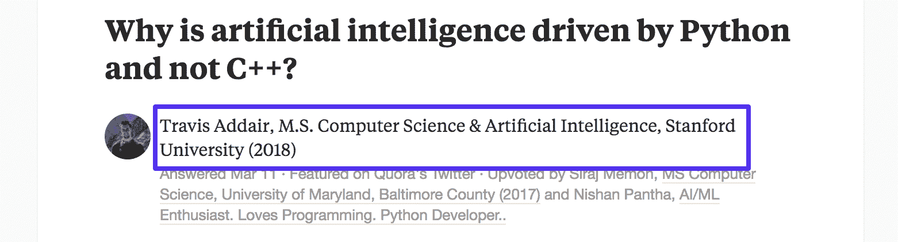

Quora qualifications

他的教育和经历使他成为唯一有资格写这个主题的人——这是 Quora 用户所期望的可信度。

因此，当用户搜索与你的行业相关的信息并从你的公司找到答案时，他们会将你的品牌视为权威。如果你能够获得“顶级作家”的地位，这一点尤其正确。这种区分是给予对任何给定主题有最多观点的作者的。

正如马里奥·佩舍夫解释的那样，他能够在一年内赢得 WordPress 类别的顶级作家地位和超过 100 万的回答浏览量。赢得这个位置有助于他在网站上获得信誉，并继续增加他在平台上的浏览量。

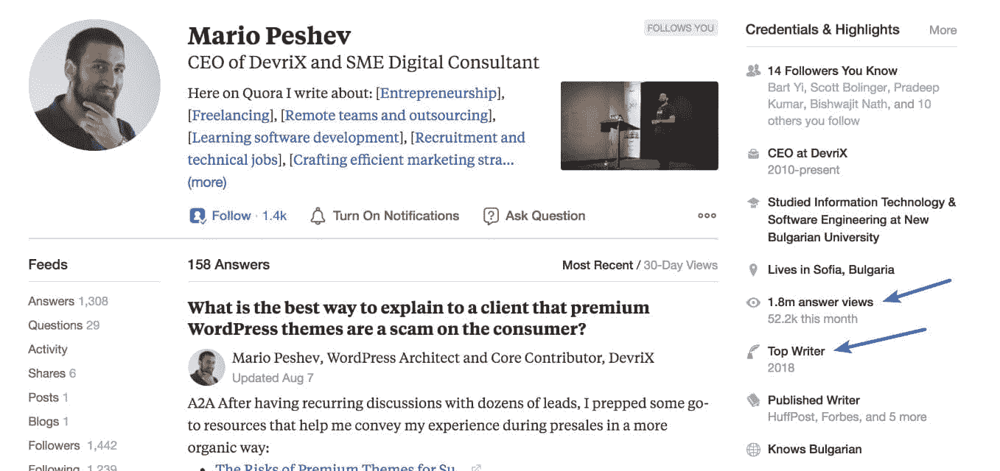

Quora top writer status

虽然成为一名顶级作家是一个具有挑战性的目标，尤其是对于流行的主题，但一旦你对这个平台感到舒适，这可能是一个值得追求的目标。这样，你不仅在对你的行业感兴趣的消费者中增加了曝光率，同时也将你的公司定位为领导者。

通过正确的方法，这也可以转化为您企业的销售线索和销售额。通过回答与目标受众高度相关的问题，他能够树立自己的权威——然后将这种权威转化为线索。

### 2.增加你网站的流量

当你在 Quora 上回答问题时，你可以包含你的来源和其他相关内容的链接。例如，看看[对“了解股票的最佳方式是什么？”这个问题的回答](https://www.quora.com/Finance-Which-is-the-best-way-to-learn-about-stocks/answer/Rohit-Jain-47?share=c400d8b4&srid=24k5)

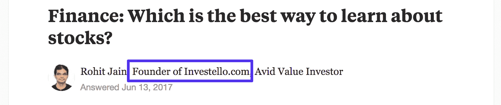

Quora profile

这个用户是一家股票分析公司的创始人，所以他当然有资格回答。他的回答只有 1000 多字，并全面概述了消费者应该了解的相关知识。

在文章的最后，他附上了一个他公司的链接，并解释了它对想要了解更多信息的读者的帮助。

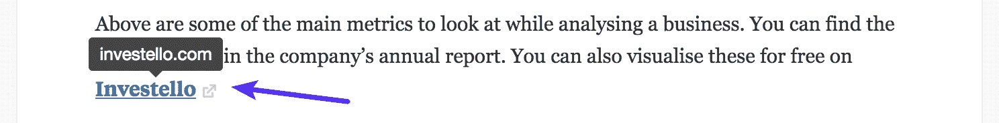

Quora link

如果用户发现他的回答很有帮助，并且对使用他推荐的方法感兴趣，他们就有机会点击。如果你想知道这种方法是否有效，在使用 Quora 三个月后，看看[这份在线世界推荐流量报告](https://thisonlineworld.com/2018/04/19/quora-marketing-guide/)。

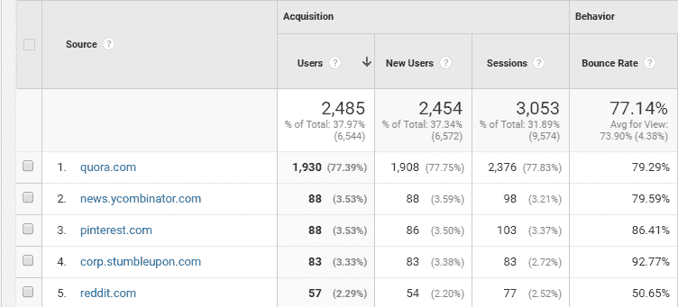

Quora referral traffic (Image source: This Online World)

仅仅在平台上回答问题几个月后，就有超过 2000 次会议。

### 3.在其他出版物中获得提及

如果你幸运的话，你在 Quora 营销上的影响力可以超越网站的用户群。这是因为越来越多的网站从 Quora 获取内容。例如，对 Forbes.com 的网站搜索显示了大量最初出现在该网站上的文章。

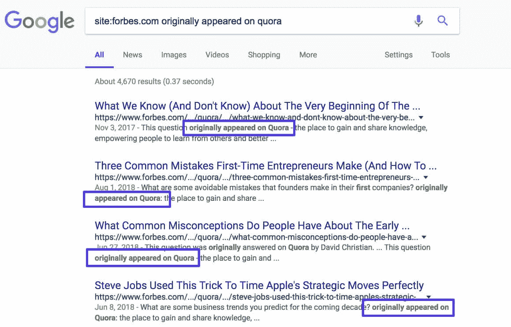

Originally appeared on Quora

为了说明为什么这很有价值，让我们看看上面截图的第二个结果。在这里，福布斯转载了作者霍华德于对这个问题的完整回答，“你预测未来十年的商业趋势是什么？”

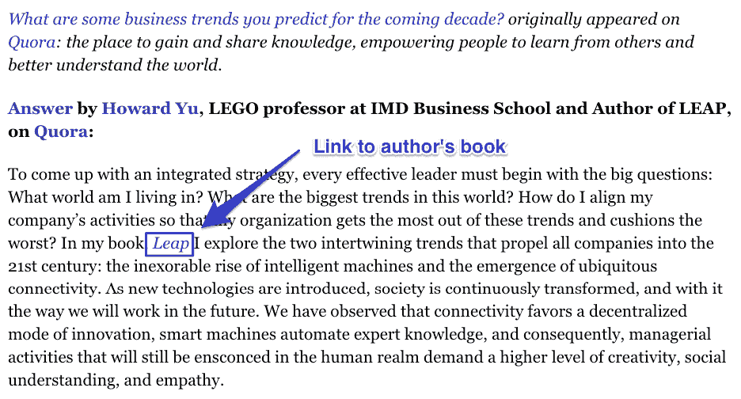

Quora link to book

正如你在上面的截图中看到的，这个答案包括了他的书的网站的链接。说清楚一点，它*是*一个[没有跟随链接](https://kinsta.com/knowledgebase/add-nofollow-links-in-wordpress/)。尽管如此，这是一个主要网站的免费曝光。当你考虑到在像福布斯这样的网站上做广告通常要花多少钱时，在 Quora 上写一个答案是一个*巨大的*回报。

但正如顶级作家尼古拉斯·科尔解释的那样，获得这种成功的唯一途径是坚持不懈地在平台上写作。回到 2013 年，他决定全年每天写一个答案。经过两周的努力，他的回答第一次获得了超过 10，000 的浏览量。

同年，他发表在 Inc 杂志、赫芬顿邮报、PopSugar、时代周刊、福布斯和财富杂志上，并登上了 Reddit 的头版。在不到一年的时间里，他也获得了顶级作家的地位，他的回答获得了几百万次的点击量。

这都是因为一件事:一致性。所以，如果你在寻找一个“快速取胜”的方法，或者一个能帮你登上福布斯的“窍门”，这里没有。你最好的选择是开始写作并坚持下去——你可能会看到科尔在这个平台上取得的成功。

## 7 个 Quora 营销技巧

Quora 有潜力成为你企业的强大营销工具。如果做得正确，它可以成为你的流量和线索的最佳来源之一。如果你不相信我，看看 Wishpond 的这份[社交网络推荐报告](https://neilpatel.com/blog/how-to-attract-9872-visitors-from-quora-in-one-month/)。

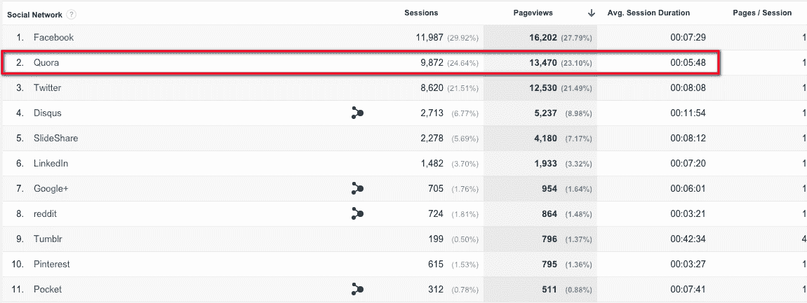

Quora network referrals (Image source: Neil Patel)

仅一个月就有 9872 次会话，Quora 的社交流量位居第二，仅次于脸书。实现这些结果的第一步就是开始行动。

幸运的是，这并不困难。只要你对你的行业和你有经验的主题写得很舒服，你就可以开始回答问题了。但是如果你想在这个平台上充分利用你的努力，这七个 Quora 营销技巧可以帮助你。

1.  [充分利用您的个人资料](#quora-profile)
2.  [添加相关的“了解”主题](#knows-about-topics)
3.  [用 Quora 的广告平台找问题](#ad-platform)
4.  [选择与目标受众相关的问题](#questions-target-audience)
5.  [写出有价值的内容](#valuable-content)
6.  [在有意义的地方加入链接](#quora-links)
7.  [建议编辑热门答案](#edits-top-answers)

### 1.充分利用您的个人资料

在回答任何问题之前，请花时间完整填写您的个人资料。当你这样做的时候，请记住 Quora 会在你的每个回答中包含你个人资料的前 50 个字符。所以，如果你想增加你的品牌曝光率，确保把你公司的名字放在最上面。

例如，IMPACT 的 Bob Ruffolo 使用[他的个人资料标题](https://www.quora.com/profile/Bob-Ruffolo)来提及公司的名称和他们的工作。

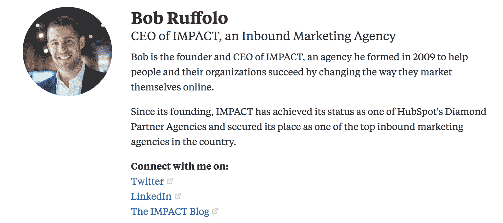

Quora profile

每当他的一个答案出现在用户的反馈中，他们会立即知道他是一家集客营销机构的首席执行官。这样，他们会将答案中获得的任何价值与影响品牌联系起来，并可能寻求更多相关信息。

除此之外，你还想利用 Quora 允许用户在个人资料中包含链接的优势。作者约翰·格林在他的个人资料中很好地完成了这个[。](https://www.quora.com/profile/John-Green-116)

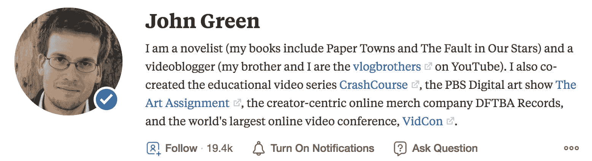

Quora profile links

这个简短的段落解释了他是谁，为什么读者应该关心，然后链接到他参与的所有在线项目。所以当你写简历的时候，记得包括你公司网站的链接，你的社交账户，以及任何你想增加流量的地方。

最后，填写“凭证和亮点”部分。

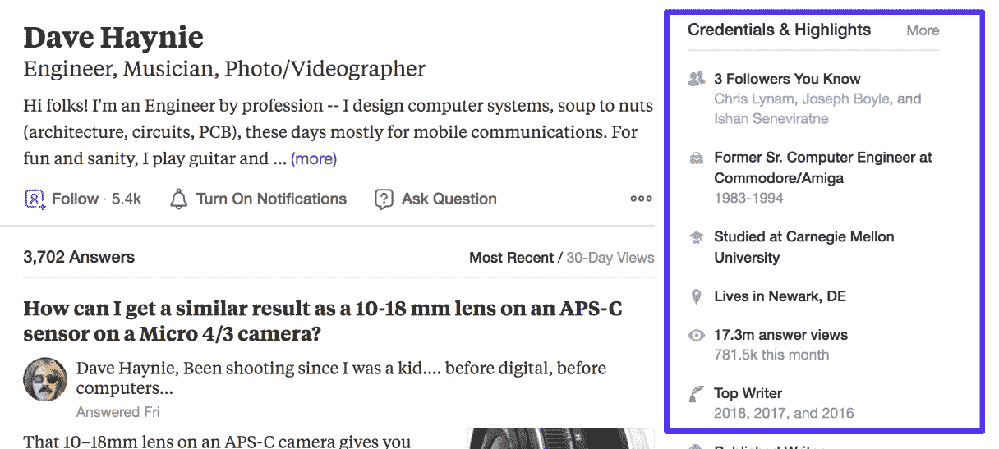

Quora credentials

这一部分不必是你的成就的完整简历，但应该包括与你将要回答的问题类型相关的任何教育或经历。

### 2.添加相关的“了解”主题

虽然从技术上讲，填写“了解”部分是填写个人资料的一部分，但它的目的不仅仅是展示你的资历。顾名思义，此部分显示了您个人资料中熟悉的所有主题。

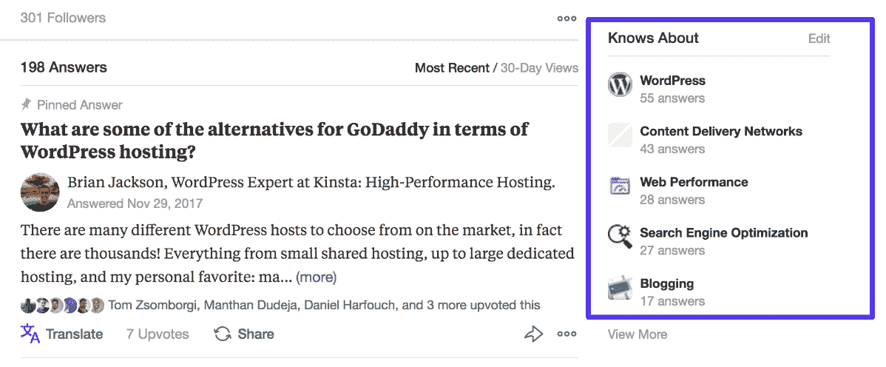

Quora knows about

您在此包含的主题也可以帮助您找到要回答的相关问题。当你编辑这个部分时，你可以从[开始搜索与你的行业](https://kinsta.com/blog/keyword-research/)相关的关键词和话题。然后，您将看到有多少用户订阅了这些主题。

例如，看看下面关于“内容营销”一词的结果

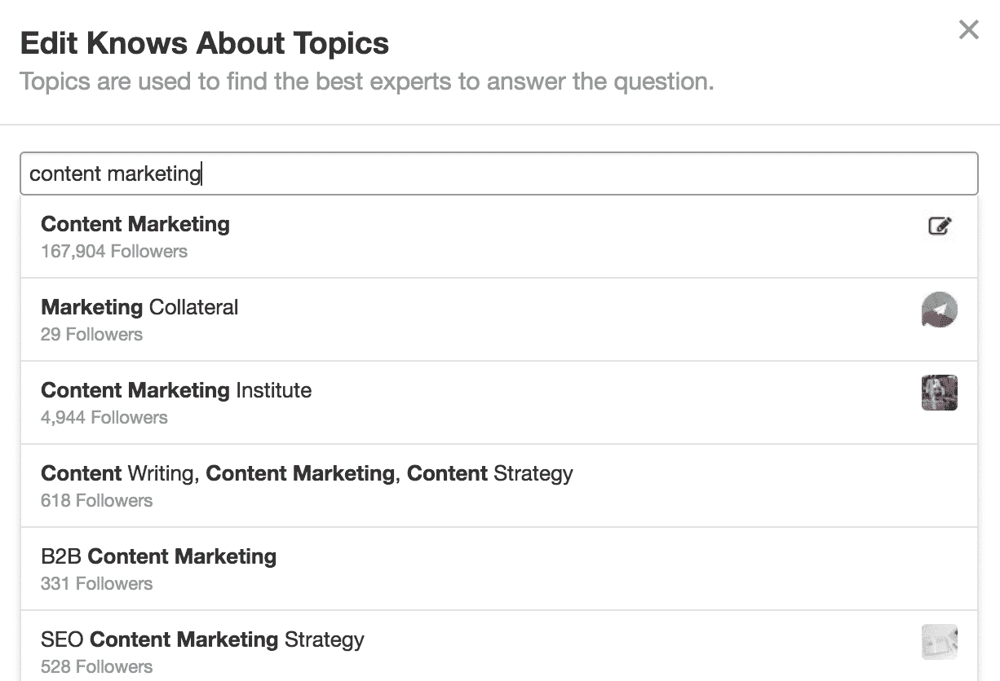

Quora knows about topics

在这种情况下，只有不到 150，000 名用户订阅了该主题。这意味着，如果你能够在这个类别中写出一个受欢迎的答案，你可以期待一个相当大的范围。

因此，假设您选择将此添加到“了解”部分。当你准备写答案时，你会看到一个与主题直接相关的热门问题列表。

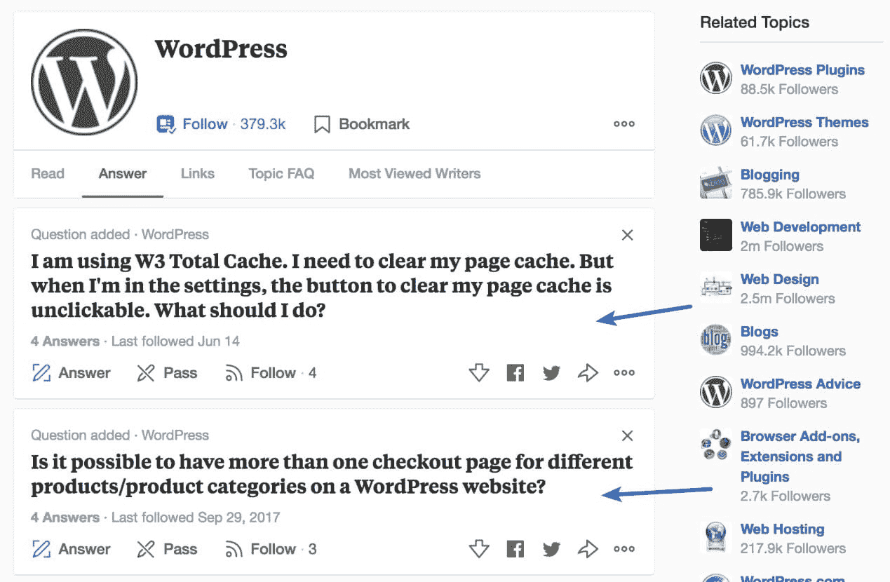

Quora topics

这样就很容易找到需要答案的问题。虽然你不一定需要把注意力完全集中在有很多订阅者的话题上，但是写一些热门话题的答案可以帮助你在网站上获得曝光率。

## 注册订阅时事通讯

### 想知道我们是怎么让流量增长超过 1000%的吗？

加入 20，000 多名获得我们每周时事通讯和内部消息的人的行列吧！

[Subscribe Now](#newsletter)

当你完成个人资料的这一部分时，请记住这一点，这样你就可以花更少的时间寻找相关问题，而有更多的时间为其他用户提供有用的答案。

### 3.使用 Quora 的广告平台寻找问题

如果你愿意花时间写一些有用的答案，Quora 会是一个给你的网站带来流量的好方法。也就是说，要真正知道回答一个问题能带来多少流量并不容易。

幸运的是，该平台提供了一些工具，可以帮助您做出准确的估计。作为访问量最大的在线网站之一，Quora 提供广告选择并不奇怪。这些选项对于驱动平台的流量非常有帮助。

[WordStream 的销售线索获取主管 Aaron Doherty 解释道](https://www.wordstream.com/blog/ws/2017/10/25/quora-ads):

> 我很喜欢 Quora。这是新的意图来源。虽然 AdWords 仍然是高意向线索的最佳来源，但 Quora 也差不多。事实上，内容是用户生成的，答案是实时发生的，这使它成为营销人员兴奋的地方。

即使你不准备发起付费活动，你仍然可以使用该网站的广告平台来发现新问题，并对其潜力进行粗略估计。

首先，你需要[创建一个 Quora 广告账户](https://www.quora.com/business)并建立一个虚拟活动。Quora 的广告平台可以让公司以几种不同的方式投放广告。出于研究目的，其中最有帮助的是问题定位。

当您进入活动的目标部分时，从主要目标选项卡中选择此选项。

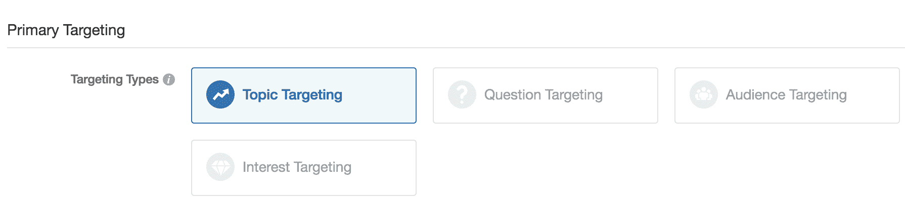

Quora ad targeting

在这里，您将看到一个对话框，您可以在其中输入关键字列表。添加一些与你想回答的问题相关的关键词。然后，你会在 Quora 上看到一个问题列表，以及他们的平均周浏览量。

例如，看看关键词“金融”和“个人金融”的结果

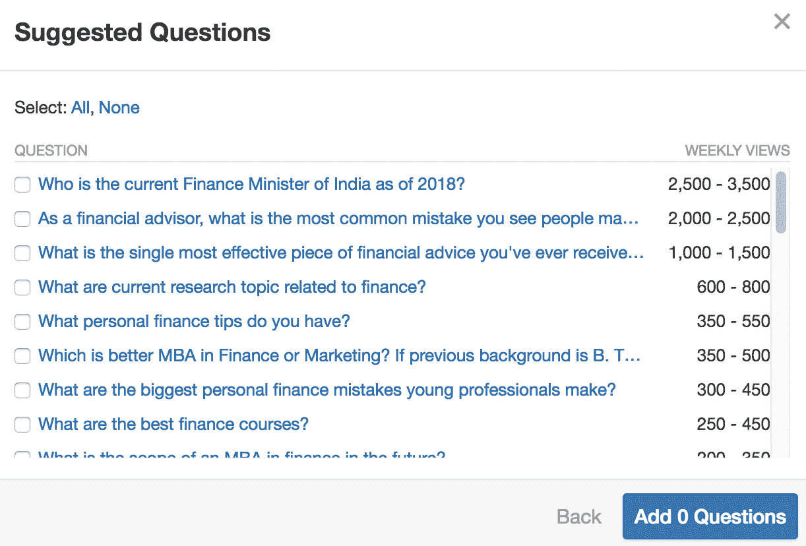

Quora suggested questions

如果这些问题中的任何一个与你的经历相关，并且有相对高的周浏览量，这将是一个写新答案的绝好机会。在这种情况下，您可以单击链接直接进入该问题，然后将其保存到列表中以备将来使用，或者立即开始写下您的答案。

### 4.选择与目标受众相关的问题

当您选择要回答的问题时，很容易陷入与您的专业知识和兴趣最密切相关的问题中。而如果这些特点直接符合你受众的问题和需求，那就太好了！

但是选择正确的问题通常需要更多的思考。这是因为归根结底，任何内容营销战略的首要目标都是 T2 的潜在客户。

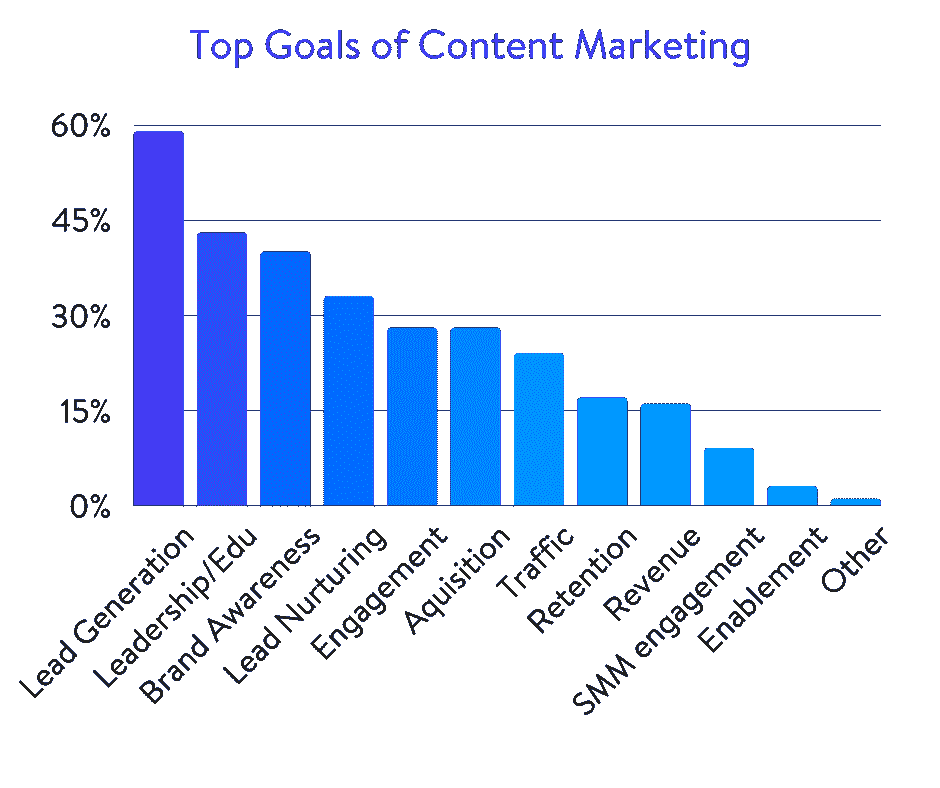

Goals of content marketing

写一个有帮助的、有深度的答案需要时间。为了让这些时间物有所值，你的策略需要为你的企业创造商机。这只有在你回答了你的目标人群感兴趣的问题时才会发生。当然，这听起来很明显。但重要的是要记住，你的潜在顾客和客户可能会问你所在行业的其他专家不同的问题。

例如，假设你是一名会计。你可能有资格回答关于税收法规变化、会计技术和行业面临的问题的复杂问题。虽然你的同行可能会觉得这些答案很有趣，但你需要考虑你的潜在客户是否也会这么想。毕竟，Quora 不是为了给你的竞争对手留下深刻印象。

Struggling with downtime and WordPress problems? Kinsta is the hosting solution designed to save you time! [Check out our features](https://kinsta.com/features/)

当然，回答几个深入的问题可以帮助你在平台上建立你在行业内的声誉。但是，除非你也回答了你的听众提出的问题，否则这不可能给你的业务带来真正的价值。因此，坚持会计的例子，这意味着你的时间可能更好地花在回答简单的问题，如税收和工资。

虽然这些答案可能不会突出你的专业知识，但它们会更有效地让你的公司出现在潜在客户面前。这最终将对你更接近你的数字营销目标产生更大的影响，比如潜在客户的产生。所以在你花时间写下答案之前，确保这个问题有可能带来你想要的结果。

这就是为什么在评估问题时，你应该寻找以下六个属性:

*   关注者与提供的答案数量之比为 7:1。
*   关注者很多，但是回答不好的也很多。
*   一个你可以提供个人形象来补充的问题。
*   情感的牵引。这种拉力使得用发人深省的故事写出更真实的答案变得更容易。
*   与你的简历相关。
*   一个回答糟糕的问题会让你的问题更加突出。

然后，当您确定了具有这些品质的问题时，您可以通过选择“稍后回答”来保存它们

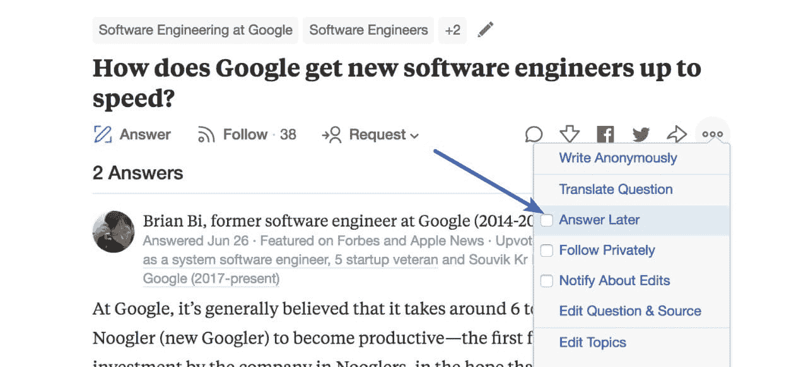

Quora answer later

当你选择这个选项时，问题会出现在 Quora 网站的“答案”标签下。或者，如果您想跟踪与上述属性相关的附加信息，您可以像 Fetcher 一样将您的问题保存在定制的电子表格中。

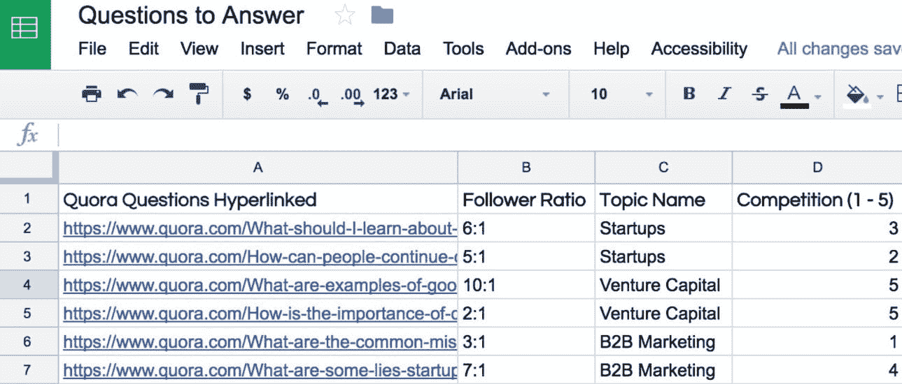

Quora questions spreadsheet (Image source: Sumo)

这样，当你准备好回答问题时，你将能够快速有效地选择那些有可能带来最佳结果的问题。

### 5.写有价值的内容

就像一般的内容营销一样，只有你为你的读者提供价值，你才会在 Quora 上成功。所以当你浏览和使用网站时，记住质量比数量更重要。考虑到用户已经提出的大量问题，尽可能多地写下答案是很有诱惑力的。

如果你抱着每一个新答案都是一个链接到你网站的新机会的心态来看待这个问题，那就更是如此了。但是说到底，Quora 上已经有很多内容了。除非你是一个利基行业的专家，否则对于你想写的主题相关的所有最受欢迎的问题，可能都有大量的答案。

考虑到这一点，就不值得你花时间去写表层内容了。相反，一次只关注一个问题，从查看现有的答案开始。你的目标应该始终是在对话中加入新的内容。如果你只是重复其他用户已经说过的观点，你就没有提供价值——你的答案很可能会被忽略。但是一旦你发现一个没有多少答案的问题，或者一个流行问题的新角度，是时候开始写作了。

如果你是 Quora 的新用户，这可能会令人生畏。因此，如果你不确定从哪里开始，花一些时间浏览与你想写的主题相关的流行答案是一个好主意。这将让您了解其他用户喜欢的样式和格式。虽然你没有义务像其他作者一样使用相同的方法，但是有一个大概的概念可以让你更容易开始。

然后，一旦你对整体基调感到满意，就把完整回答这个问题作为你的目标。这样，你可以确信你在为你的观众提供价值——而不仅仅是在肤浅的内容上浪费时间。

### 6.在有意义的地方加入链接

Quora 最大的好处之一就是能够在你的答案中包含链接。对于希望增加网站流量的营销人员来说，这是一个巨大的机会。但是要让用户访问你的网站，你需要有策略地放置链接。你不能简单地在答案中加入链接，然后期望读者点击。

相反，你需要解释链接的内容是如何相关的，以及读者点击后会发现什么。例如，看看[对“你如何跟踪和跟进电子邮件”这个问题的回答](https://www.quora.com/How-do-you-keep-track-and-follow-up-on-emails/answer/Ashok-Kammara?)

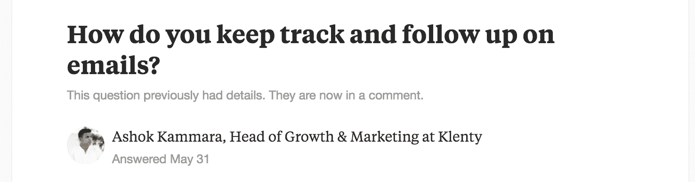

Answering questions on Quora

如果你对完整的答案感兴趣，你可以点击上面的链接自己阅读。但总结一下，这个用户包括了创建跟进策略的三个策略，以及撰写五种不同类型邮件的说明。这完全回答了这个问题，并可能为读者提供足够的信息来开始制定自己的后续策略。

但在答案的底部，这位作者还链接到他公司网站上的一篇文章，里面有 12 个电子邮件模板。

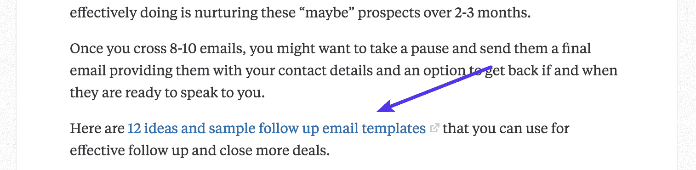

Quora answer link

值得注意的是，他没有采取过度销售的方式，也没有告诉读者他们*需要*他的公司。相反，他将他们引向另一个高度相关的资源。通过这种方式，感兴趣的读者可以继续在他的网站上了解这个主题，并从那里决定他们是否有兴趣了解这家公司的产品。

因此，当你在寻找给你的答案添加链接的方法时，超越你的主页或以转换为中心的页面是一个好主意。毕竟，Quora 的用户来这个网站寻找信息，而不一定是新产品和服务。

所以在大多数情况下，如果你不提供与他们兴趣相关的额外内容，他们不会点击你公司网站的链接。这意味着，如果你专注于链接到信息页面，你可能会从平台上看到更多的流量。

在你的网站上选择与手头问题最相关的资源，并考虑它们如何对读者有益。然后，在加入你的链接之前解释一下它的好处。通过这种方式，读者确切地知道他们点击时会得到什么。你越清楚访问你的网站的好处，他们就越倾向于这样做。

当你添加链接时，[包含 UTM 参数](https://audienceops.com/5-minute-guide-content-marketing-quora/)来监控你的结果也是一个好主意。如果你使用 Google Analytics 来跟踪和衡量活动的成功，你可能已经熟悉了这些 URL 参数——使用它们来跟踪 Quora 的结果很简单。谷歌分析已经显示 Quora 为网络推荐，但如果你想进一步缩小范围，你可以使用 UTM 参数。

多花几秒钟将这些添加到你的答案的链接中，这样可以很容易地确定你的答案是否会增加你网站的流量，以及它是否会对你的营销目标产生影响。

### 7.对热门答案提出编辑建议

除了撰写您的答案，您还可以建议编辑其他用户的答案。只需滚动到现有答案的底部，然后单击“建议编辑”按钮。

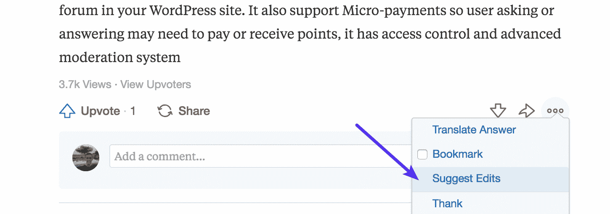

Quora suggest edits

这将在一个文本编辑器中打开答案，让您能够以您认为合适的方式编辑它。不过，需要注意的是，你不能在没有得到其他用户许可的情况下简单地修改他们的答案，所以你所做的任何修改都将首先发送给他们进行审批。

理论上，这种方法的优势不难看出。热门问题的顶级答案往往会吸引大量的浏览量，因此在其中一个答案中获得你的网站链接是吸引流量的一个简单方法。

但是你可以想象，让另一个作者接受你的编辑(包括你的链接)是很有挑战性的。毕竟，如果他们的答案本身已经很受欢迎，就没有什么动力去更新或改变它——尤其是如果改变的唯一原因是为了让另一个用户从他们的工作中受益。

因此，如果你试图使用这种策略，确保你的编辑真正增加了用户答案的价值。详细阐述一个观点，支持他们的主张，或填补信息空白，使他们的回应更有说服力或更有说服力。然后，如果您打算添加一个链接，使用它作为您添加的内容的来源。

但是，如果链接实际上包含支持信息，*只有*这样做。大多数 Quora 作者会看穿任何添加无关链接的企图——这样做太多次对你在平台上的声誉没有任何好处。

## 摘要

Quora 对任何公司的营销策略来说都是一个有价值的补充。虽然有许多技巧和诀窍可以用来改善你的结果，但成功的关键是保持与平台的主要目标一致，即**成为有用的资源**。

不要只是给 Quora 发垃圾邮件，否则你会像戴夫·汉姆里克一样被永久封禁。当在第三方平台和你自己的网站上贡献内容时，找到一个好的平衡是很重要的。记住，当你把内容发布到 Quora 上时，你就不再拥有它了。

就像今天的许多数字营销策略一样，你需要带着为你的受众提供真正价值的目标去接近 Quora。为此，您需要:

*   旨在帮助你的观众更好地了解你的行业，了解更多他们感兴趣的话题，并实现他们的目标。
*   坚持写。
*   充分利用你的个人资料告诉用户你是谁，为什么他们应该信任你。
*   花时间选择有可能接触到正确受众并增加网站流量的问题。
*   在有意义的地方加入链接，并提供一个上下文来告诉读者为什么他们应该点击。

有了这种方法，你将更有效地在网站上建立你想要的声誉——并且更有可能通过你的努力产生真正的结果。记住这一点，是时候开始了！如果你在 Quora 上发现了其他特别有效的策略，请在下面的评论中告诉我们！

* * *

让你所有的[应用程序](https://kinsta.com/application-hosting/)、[数据库](https://kinsta.com/database-hosting/)和 [WordPress 网站](https://kinsta.com/wordpress-hosting/)在线并在一个屋檐下。我们功能丰富的高性能云平台包括:

*   在 MyKinsta 仪表盘中轻松设置和管理
*   24/7 专家支持
*   最好的谷歌云平台硬件和网络，由 Kubernetes 提供最大的可扩展性
*   面向速度和安全性的企业级 Cloudflare 集成
*   全球受众覆盖全球多达 35 个数据中心和 275 多个 pop

在第一个月使用托管的[应用程序或托管](https://kinsta.com/application-hosting/)的[数据库，您可以享受 20 美元的优惠，亲自测试一下。探索我们的](https://kinsta.com/database-hosting/)[计划](https://kinsta.com/plans/)或[与销售人员交谈](https://kinsta.com/contact-us/)以找到最适合您的方式。