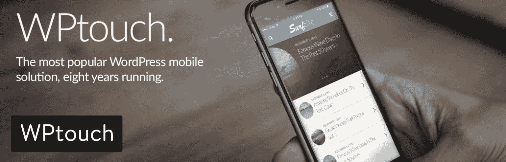
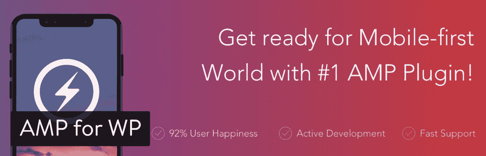
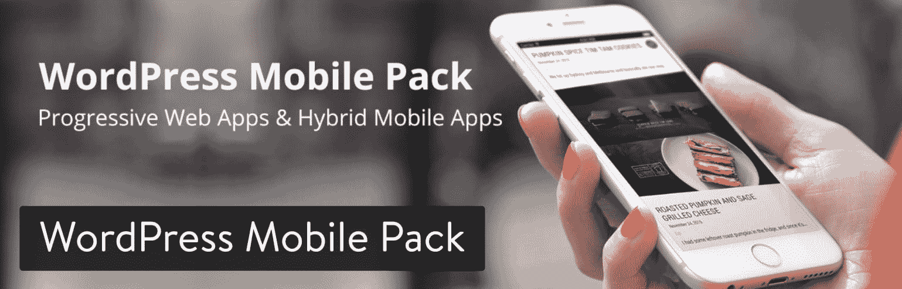
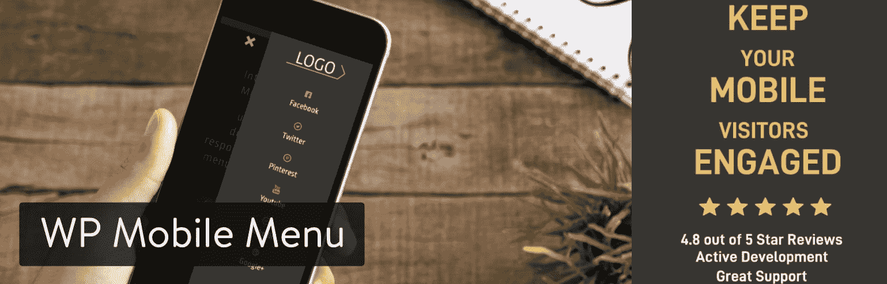
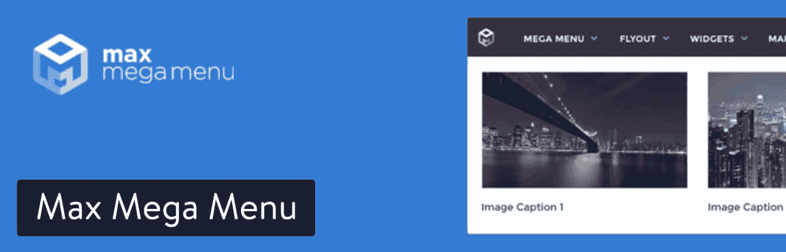
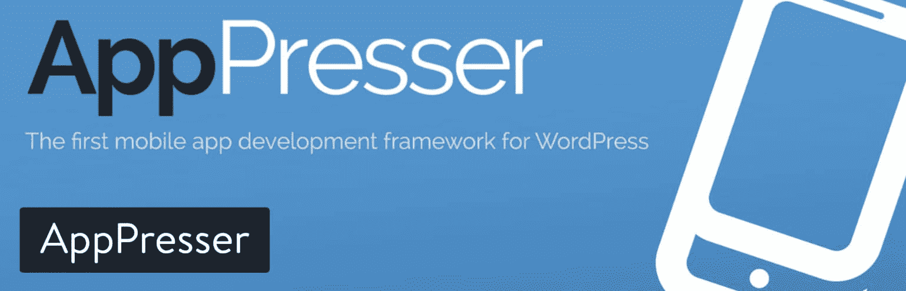

# 最佳 WordPress 移动插件——比较前 7 名

> 原文：<https://kinsta.com/blog/wordpress-mobile-plugin/>

在线企业被期望在他们的 WordPress 部署中采用一个流动的“一个网站”策略，以确保跨所有平台和设备的简化的、响应性的和适应性的网站体验。不仅仅是为了用户，也是因为谷歌现在希望你的网站能够在移动设备上完美运行。

[Don't jeopardize your business by ignoring mobile users on your website! 📱Click to Tweet](https://twitter.com/intent/tweet?url=https%3A%2F%2Fbit.ly%2F2sZnR9Z&via=kinsta&text=Don%27t+jeopardize+your+business+by+ignoring+mobile+users+on+your+website%21+%F0%9F%93%B1&hashtags=mobile%2CWordPress)

在选择最好的 WordPress 移动插件之前，将你的网站转换成某种移动版本需要一些思考。你可能只想做一个移动网站，而不是一个发送推送通知和使用地理定位服务的应用程序。你可能已经喜欢上了 WordPress 网站的移动版本，但是不喜欢它的菜单。

所以，第一步是了解有不同的移动界面可供选择。

1.  第一个是移动网站，通常被称为**响应式网站**，网站内容保持不变，但使用媒体查询(代码)进行了调整，以适应移动观看。
2.  你也可以使用一个移动插件，把你的 WordPress 网站变成一个**应用**。这是一个完全不同的程序，通常具有比您的移动网站更强大的移动功能。这甚至可能包括做一个进步的网络应用程序。
3.  最后，一些 WordPress 移动插件仅仅是为了[改变你的移动菜单](https://kinsta.com/blog/wordpress-menu-plugins/)，因为许多移动网站不能生成看起来不错的菜单。

在这篇文章中，我们将概述几个具有完全不同特性的 WordPress 移动插件。然后，我们将讨论最适合您和您的组织的方法。

## 2022 年最佳 WordPress 移动插件选项

开始学习哪个 WordPress 移动插件适合你的最好方法之一是把它们安装在你的 WordPress 网站上，看看哪个感觉合适。所以，这是我们已经测试并决定的插件清单。即使你直接阅读下面的深度评论，我仍然鼓励你亲自测试其中的一些——因为有些会比其他的更适合你的主题。

1.  [WPtouch](#wptouch)
2.  [WP 的放大器](#amp-for-wp)
3.  WordPress.com 的喷气背包
4.  [WordPress Mobile Pack](#wordpress-mobile-pack)
5.  [WP 手机菜单](#wp-mobile-menu)
6.  [最大超大菜单](#max-mega-menu)
7.  [AppPresser](#apppresser)

乍一看，似乎所有的 WordPress 移动插件解决方案都非常相似。你可能会想，为什么不直接拿一个来搭配呢？嗯，经过深入研究后，我们意识到事实远非如此。在接下来的评论中，你将了解到一些界面如何比其他界面更优雅，以及一些插件如何提供应用程序，而其他插件则更侧重于移动网站。

也就是说，继续阅读，了解每个 WordPress 移动插件的突出特点。之后，我们将概述每种情况下哪一种最适合您。

### 1.WPtouch

当 WordPress 网站所有者需要快速将他们的网站转变为移动界面时，WPtouch 插件无疑是最受欢迎的选择之一。该插件背后的关键是，它可以快速改变你安装的任何主题，并使其更适合使用移动设备的人。WPtouch 有趣的一点是，它包含在谷歌移动测试中，并确保你的网站通过测试。这样，你就能够保持你的搜索引擎优化排名，并有可能在未来提高排名。

有了免费版的 WPtouch，你的桌面网站设计保持不变，但移动版变成了一个快速、时尚、用户友好的版本，只为手机和平板电脑等较小的设备制作。此外，你能够完成这个过程，而不是一个程序员。

WPtouch WordPress plugin

WPtouch 插件的高级版本适用于那些希望通过更好的移动主题和某些扩展来改进其功能的人，以便将广告合并到您的移动网站中。除此之外，高级版本还包括缓存选项、web 字体控制和来自 WPtouch 开发人员的直接支持。你可以从其网站购买 [WPtouch Pro 插件。最便宜的方案是每年 79 美元起，在一个 WordPress 网站上运行。](https://www.wptouch.com/)

如果你想把插件放在更多的站点上，或者获得开发者或多站点支持，你可以选择一个更贵的方案。总而言之，如果你对更好看的移动主题和一些广告、相关帖子等功能感兴趣，价格看起来相当合理。

#### 是什么让它成为顶级的 WordPress 移动插件？

*   WPtouch 有一个免费插件，几乎可以立即将你当前的网站主题转换成移动主题。
*   专业版并不贵，而且它提供了大量漂亮的主题和很酷的扩展，比如广告和高级排版。
*   WPtouch 的设置页面被很好地整合到了 WordPress 仪表盘中，对于所有网站所有者来说都很容易理解。
*   该插件在替换大量使用图像文件、JavaScript 和 CSS 的响应主题方面做得很好。提供的移动主题是快速、轻量级的，非常适合那些对当前移动主题不满意的人。
*   您可以稍微定制您的移动浏览器查看体验。例如，这个插件让你选择你想要支持的浏览器，同时也给你工具来改变你的手机菜单。
*   高级版的客户支持是通过电子邮件地址和全面的操作方法和最佳实践文章集合提供的。

### 2.WP 放大器

WP 的 [AMP 插件为你当前的站点提供了一个移动网站。AMP 代表加速移动页面，指的是它的速度和效率。这是一个令人印象深刻的包，需要你投入最少的努力来替换你当前的无响应主题。另外，如果你有一个响应式主题，测试一下它的加载速度是个好主意。如果它不符合你的标准，简单地用 WP 的 AMP 插件替换它。WP 插件的实际核心放大器是完全免费的。你可以从 WordPress 插件库中快速下载所有的特性。然而，与台式机相比，手机上的一些元素并没有很好地显示出来。](https://wordpress.org/plugins/accelerated-mobile-pages/)

因此，AMP for WP 单独或打包销售某些扩展。你也可以购买不同的手机主题，它们通常比默认的更实用、更美观。这个设置的伟大之处在于大多数扩展和主题的售价不到 10 美元。其中一个扩展是用于在你的移动主题上发布广告，而其他的则允许你的主题更好地与联系表单、WooCommerce、缓存插件等等一起工作。

AMP for WP plugin

也可以选择成为会员并访问所有的主题和扩展。例如，如果你只需要一个个人网站的扩展和主题，你每年要花费 149 美元。其他几个计划也是可行的，但是对于需要无限数量站点扩展的机构来说，它的最高价格是每年 499 美元。

但是请记住，整个 WP 插件是免费的。所以，你不应该升级，除非有你绝对需要的特定扩展，或者如果你想改进你的主题。我认为大部分功能已经被打包到核心插件中，包括支持脸书评论的工具、登陆页面、电子邮件订阅等等。

查看我们关于如何为 WP 配置和[设置 AMP 的深入教程。](https://kinsta.com/blog/google-amp/)

#### 是什么让它成为顶级的 WordPress 移动插件？

*   该插件是完全免费的，已经包含了大部分最好的特性。
*   不到 10 美元，你就可以得到很多其他的扩展。例如，如果你想让你的简易数字下载商店在移动主题上看起来不错，你可以买一个插件。
*   会员价格非常合理，它允许你访问 WP 库中所有的扩展和主题。
*   AMP for WP 为你创建的移动网站很可能会比你的 WordPress 主题的响应网站更快更干净。
*   AMP for WP 在支持网站上用 JavaScript 或 CSS 编码的元素方面做得非常好(这些元素在移动设备上有时会有问题)。例如，该插件支持星级评定和评论。您还可以嵌入各种来源的视频。
*   注意: [AMP 并不适合所有人](https://kinsta.com/blog/disable-google-amp/)，在我们看到转化率下降后，我们最终在我们的网站上禁用了它。永远为自己测试。

### 3.WordPress.com 的喷气背包

[Jetpack](https://wordpress.org/plugins/jetpack/) ，你可能知道，来自 Automattic，提供了一个工具集合，这样你就不用一直安装几十个插件了。从安全工具到社交选项，从设计服务到营销模块，你都能收到。考虑到这是一篇关于 WordPress 移动插件的文章，把重点放在移动功能上肯定是有意义的。嗯，Jetpack 还提供了一个移动主题，可以通过[进入你的 Jetpack 设置区域](https://kinsta.com/knowledgebase/wordpress-jetpack/)为你的网站实现。

该主题只有在检测到移动设备时才会运行，如果你愿意，它可以覆盖你当前的响应主题。我们最喜欢 Jetpack 移动主题的一点是，它有相当多的设置来调整网站在这些较小设备上的外观。例如，您可能想要改变菜单的外观，或者如果您认为它们在移动电话上看起来过于杂乱，则显示巨大的特色图像。

Jetpack WordPress mobile plugin

这是 Jetpack 的一个免费功能，所以如果你打算使用它附带的其他一些 Jetpack 功能，这可能是值得的。我们也喜欢 Jetpack 移动主题的简单性。它看起来就像有基本的 WordPress 品牌，但是你可以改变颜色来匹配你自己的业务。但总的来说，这是你能找到的最可靠的移动界面之一。它干净、快捷，可以让你的网站对用户和搜索引擎都好看。

## 注册订阅时事通讯

### 想知道我们是怎么让流量增长超过 1000%的吗？

加入 20，000 多名获得我们每周时事通讯和内部消息的人的行列吧！

[Subscribe Now](#newsletter)

#### 是什么让它成为顶级的 WordPress 移动插件？

*   虽然 Jetpack 中的许多功能需要付费，但移动主题是免费的，只需点击一个按钮即可实现。
*   主题是基本的，但它很现代，几乎保证在所有浏览器和设备上都很棒。如果你想确保谷歌对你的移动体验竖起大拇指，这是一个加分项。
*   Jetpack 插件还包括了移动主题图片的延迟加载。因此，当用户在你的移动网站上向下滚动时，图片不会加载，直到他们真正到达那里。这样，你的网站就能以更高效的速度运行，并且不会浪费任何资源，直到需要的时候。
*   移动主题会自动将侧边栏放置在主要内容的下方，这样它们仍会在页面上，但不会弄乱在移动设备上运行良好的单列格式。
*   支持自定义标题和背景，所以你有一些设置来改变它们，并确保你的主图像对你的用户来说看起来很棒。
*   默认情况下，Jetpack mobile 主题会抓取您的主菜单并显示给移动用户。然而，有一种方法可以调整这一点，并为这些人显示一个完全不同的菜单。
*   还有一些其他的设置，比如隐藏特色图片、展示推广或者修改你的博客文章摘录。

### 4.WordPress 移动包

WordPress Mobile Pack 提供所谓的渐进式网络应用。这些是快速、可靠的应用程序，具有一些有趣的功能，如推送通知和移动界面的平滑动画。重要的是不要被开发人员如何使用术语“应用程序”所迷惑这些应用不同于你从应用商店下载到手机上的那些应用。这些是加载到用户浏览器上的标准移动网站。他们称之为应用程序的原因是，你可以从几个模仿实际 iPhone 或 Android 应用程序用户界面的模板中进行选择。

所以，请记住，如果你想为你的 WordPress 网站找一个真正的应用程序，你必须去别处看看。然而，主题是美丽的，这种类型的“应用程序”设计肯定会让你的移动网站比我们在市场上看到的一些标准的响应主题更突出。

WordPress Mobile Pack plugin

WordPress Mobile Pack 的免费版本有广泛的功能，并且设置你的移动网站的过程很简单。它试图尽可能模仿一个应用程序，提示用户将移动网站保存到他们的主屏幕上以备后用。您还会得到一个默认主题，其中包括六个不同的封面，这些封面会一直旋转，给人一种新鲜的感觉。你可以调整像你的标志、字体和颜色这样的项目，所有这些都可以从你的 WordPress 仪表盘中方便地完成。正如我们之前提到的，WordPress Mobile Pack 插件确实有免费版本。但是，如果你想获得更多的定制选项和大量的应用程序主题， [Pro 版本的起价为每年 99 美元。](https://wpmobilepack.com/)

#### 是什么让它成为顶级的 WordPress 移动插件？

*   核心插件的主要特性是免费的。
*   您可以升级经济实惠的专业版，获得更多功能、货币化选项、无限推送通知等。
*   虽然你收到的是一个移动网站，而不是一个真正的应用程序，但这些模板的外观和工作方式与你手机上的常规应用程序非常相似。例如，所有的主题看起来更像一个应用程序，而不是一个移动网站。此外，你还可以发送推送通知，并要求用户在手机上保存该页面的链接。
*   您可以选择决定哪些页面和帖子将显示在移动网站上。例如，您可能认为没有必要在移动界面上显示“联系我们”页面，因为您已经在标题中显示了一个电话号码。
*   读者可以将你的手机网站添加到他们手机的主屏幕上。这又一次模拟了实际应用在用户手机上的工作方式。
*   [Google Analytics](https://kinsta.com/blog/how-to-use-google-analytics/) 与您的移动网站集成，因此您可以区分哪些人和多少人在访问您的移动网站，而不是您的常规网站。

### 5.WP 手机菜单

WP 手机菜单插件对于那些想把更多注意力放在网站手机菜单部分的人来说是一个很好的解决方案。看到漂亮的响应网站有糟糕的菜单是很常见的。不幸的是，菜单通常是人们在你的网站上移动的方式，除非他们点击行动号召按钮或链接。移动菜单应该有平滑的滑入效果，有大图标、菜单文本和按钮。

所以，你会考虑这个 WordPress 移动插件的主要原因是，如果你已经有了一个你喜欢的响应网站，但你认为菜单中还有一些你想要的东西。因此，你可以安装这个插件并完全控制移动菜单，而不会破坏你之前创建的移动网站(可能是你的 WordPress 主题)显示的内容。

WP Mobile Menu WordPress plugin

这些手机菜单很漂亮。他们提供了对谷歌字体、背景图片、裸标题等的控制。您可以将菜单配置为显示三个深度级别，或者坚持您网站的常规菜单配置。标准的 WP 手机菜单插件可以免费下载。不管你在多少网站上实现了移动菜单。

Struggling with downtime and WordPress problems? Kinsta is the hosting solution designed to save you time! [Check out our features](https://kinsta.com/features/)

一些组织[更喜欢专业版](https://www.wpmobilemenu.com/pricing/)，起价每月 6.99 美元，支持标题搜索、菜单项图标和 2000 多个图标等功能。甚至还有每月 9.99 美元的 WooCommerce 计划。它具有专业计划的所有功能，以及菜单购物车图标、滑动购物车等等。最后，企业版是 39.99 美元，并提供一个私人 Slack 频道，个人成功管理器，以及定制开发的特殊费率。

#### 是什么让它成为顶级的 WordPress 移动插件？

*   对于那些已经喜欢自己的移动网站设计，但希望改进移动菜单的人来说，这是一个很好的解决方案。
*   核心插件是免费的，但你也可以选择其他版本，比如专业版，或者电子商务版，以便在移动界面上添加购物车等项目。
*   谷歌字体和数以千计的图标被整合到一些计划中，这意味着你将能够创建一个更加可视化的移动菜单。
*   你可以选择一个裸露的标题(有点透明)或者一个带有图像背景的菜单。考虑到你不常见到这两者，这两者都是突出你的手机设计的极好方法。
*   免费版本包括菜单上三个深度级别的选项。如果你报名参加专业计划，你可以一直达到五个深度级别。
*   菜单品牌(带标志)在免费计划中是可能的。
*   用户可以隐藏手机菜单中的某些元素，而不是被迫使用你的常规网站菜单中的所有内容。

### 6.最大超大菜单

最大菜单菜单插件可以在你的网站设计的多个层面上工作。总的来说，它将任何现有的 WordPress 菜单转换成一个大菜单——一个显示所有页面选项的菜单，即使有几十个选项(非常适合电子商务网站或在线杂志)。首先，你的桌面菜单被转换成一个大菜单，然后你可以定制在菜单上显示哪些页面和文章。该插件也在移动浏览器上进行了广泛的测试，因此它在移动界面上的大型菜单上表现出色。唯一的问题是你仍然停留在你的网站的移动版本上，所以希望你已经有了一个漂亮的移动界面和你的 WordPress 主题。

Max Mega Menu WordPress plugin

该插件包括一个拖放菜单生成器，用于删除通常会涉及到的任何代码。安装插件并激活菜单后，你就可以将任何 WordPress 小部件放入菜单，以及你网站上其他页面的按钮。所有的功能都建立在当前的 WordPress 菜单系统上，它甚至支持弹出菜单和其他动画菜单风格。

到目前为止提到的所有功能都包含在免费版本中，但是您可以选择[升级到 Max Mega Menu 的专业版本](https://www.megamenu.com/upgrade/)。这取决于你想在多少个网站上使用这个插件，但是一个网站的使用价格是每年 23 美元起。之后，有 5 个网站每年 39 美元的商业许可证和 99 个网站每年 99 美元的开发者许可证。

#### 是什么让它成为顶级的 WordPress 移动插件？

*   这个插件有独特的能力将任何 WordPress 菜单转换成一个大菜单。这既强大又特别，因为大多数时候你必须选择一个从一开始就有大量菜单的 WordPress 菜单。
*   这些菜单构建在桌面和移动版本上，具有动画、弹出和淡入淡出的设置。
*   菜单提供了一个不寻常的特性，在菜单区域接受 WordPress 小部件。因此，从技术上讲，你可以通过菜单中的一个小部件来拖放一个图像或自定义代码。
*   你可以在菜单上添加图标，而不必为专业版付费。
*   专业版一年的费用不多，它提供了像粘性菜单、WooCommerce 支持和谷歌字体这样的功能。

### 7.AppPresser

一些公司试图用 WordPress 建立一个应用程序或移动网站，但最终只是一个将博客文章拉进应用程序的 RSS 提要。然而， [AppPresser](https://apppresser.com/) 插件采取了一种完全不同的方法，制作链接到你的 WordPress 站点的真正应用。因此，你生成的不是一个移动网站，而是一个合法的应用程序，可以在用户的手机上运行，并有可能被放在某个应用程序商店中。AppPresser 程序创建 Android 和 iPhone 应用程序，使用功能的优秀组合来集成您当前的插件，并使您的网站在移动设备上看起来独特而美丽。

请记住，AppPresser 开发者声明该插件主要是为有一些经验的网站建设者。如果你是一个完全的初学者，你可能会觉得这太复杂，应该联系 AppPresser 定制应用程序构建服务。

不管怎样，AppPresser 有几个集成的 WordPress 插件。所以你有机会链接到 WooCommerce 和 BuddyPress 这样的插件。因为它为你创建了一个应用程序，所以还有很多其他功能，如推送通知和设备摄像头上传。

AppPresser WordPress mobile plugin

由于 AppPresser 实际上只面向开发者，所以定价比你一般的移动 WordPress 插件要高一点。也就是说，如果你向制作手机应用和网站的客户收费，这应该是值得的。入门计划每月售价 19 美元，可以获得应用构建者、一年的支持和一个主题。真正的功能来自代理计划，每月 49 美元，提供地理定位服务、社交分享和 AdMob 广告等功能。

#### 是什么让它成为顶级的 WordPress 移动插件？

*   AppPresser 帮助开发人员将之前构建的 WordPress 网站转化为功能齐全的移动应用。这意味着应用程序可以保存在用户的手机上，并放在任何应用程序商店。
*   它集成了一些流行的 WordPress 插件，比如 WooCommerce、LearnDash 和 BuddyPress。
*   这款应用不仅仅是把你的 WordPress 网站变成一个移动博客订阅源。事实上，这是一个更强大的解决方案，可以和流行的插件一起工作，把一个 WordPress 站点变成一个有价值的应用。
*   除了您网站上已有的内容之外，还提供了自定义页面和模板供您自定义。
*   一个应用程序测试器附带了一个程序，可以通过你的手机运行你的应用程序，测试所有的按钮和页面。
*   AppPresser 有一个在线仪表板，用于管理所有客户端应用程序。该仪表板可通过您的桌面使用。

## 如何选择适合你的 WordPress 移动插件

不是所有的插件都适合所有的情况。例如，其中一些只用于创建移动菜单，而其他的将会把你当前的网站转变成一个可用的移动网站。

那么，哪一个才是适合你的呢？让我们来分解一下:

*   **立即将你的 WordPress 网站变成一个漂亮的移动网站**——使用 WPtouch 或 WP AMP。
*   **为你的 WordPress 博客创建一个干净的移动订阅源**——使用 WordPress 的 Jetpack
*   **生成一个功能类似于完整应用程序的移动网站**——使用 WordPress Mobile Pack。
*   如果你想制作一个更好的移动菜单，但又想保留你当前的移动网站，请选择 WP 移动菜单。
*   **将您的桌面和手机菜单更改为大型菜单(保持网站原样)**–选择 Max Mega Menu。
*   对于这个列表中唯一能让你的 WordPress 网站成为真正的移动应用的选项——选择 AppPresser。

如果你对最适合你的 WordPress 移动插件有任何疑问，请在下面的评论区告诉我们。希望这个指南能帮助你做出正确的决定！

* * *

让你所有的[应用程序](https://kinsta.com/application-hosting/)、[数据库](https://kinsta.com/database-hosting/)和 [WordPress 网站](https://kinsta.com/wordpress-hosting/)在线并在一个屋檐下。我们功能丰富的高性能云平台包括:

*   在 MyKinsta 仪表盘中轻松设置和管理
*   24/7 专家支持
*   最好的谷歌云平台硬件和网络，由 Kubernetes 提供最大的可扩展性
*   面向速度和安全性的企业级 Cloudflare 集成
*   全球受众覆盖全球多达 35 个数据中心和 275 多个 pop

在第一个月使用托管的[应用程序或托管](https://kinsta.com/application-hosting/)的[数据库，您可以享受 20 美元的优惠，亲自测试一下。探索我们的](https://kinsta.com/database-hosting/)[计划](https://kinsta.com/plans/)或[与销售人员交谈](https://kinsta.com/contact-us/)以找到最适合您的方式。