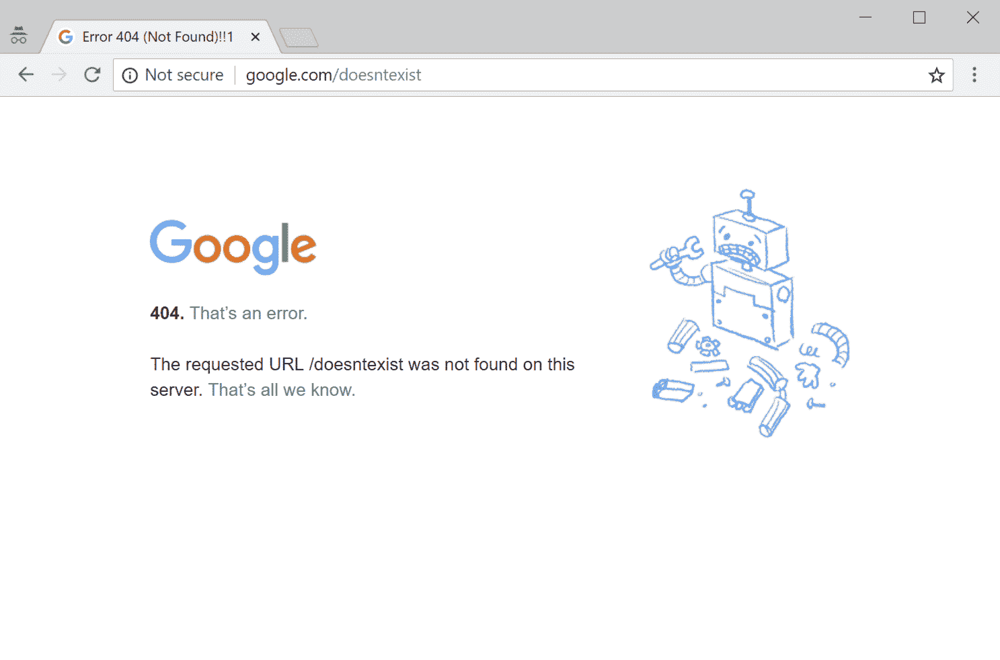
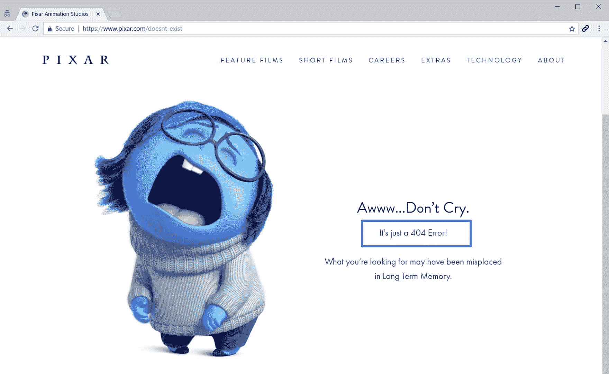
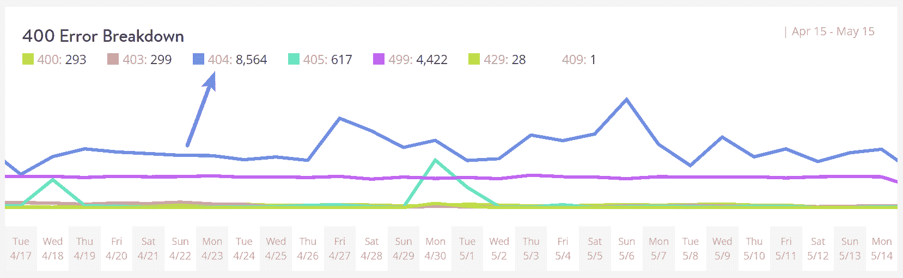
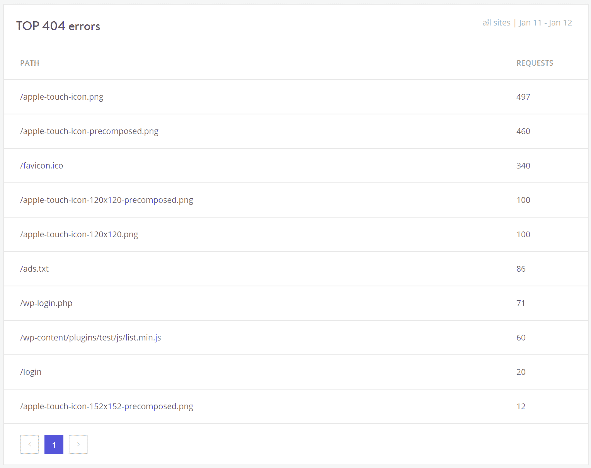
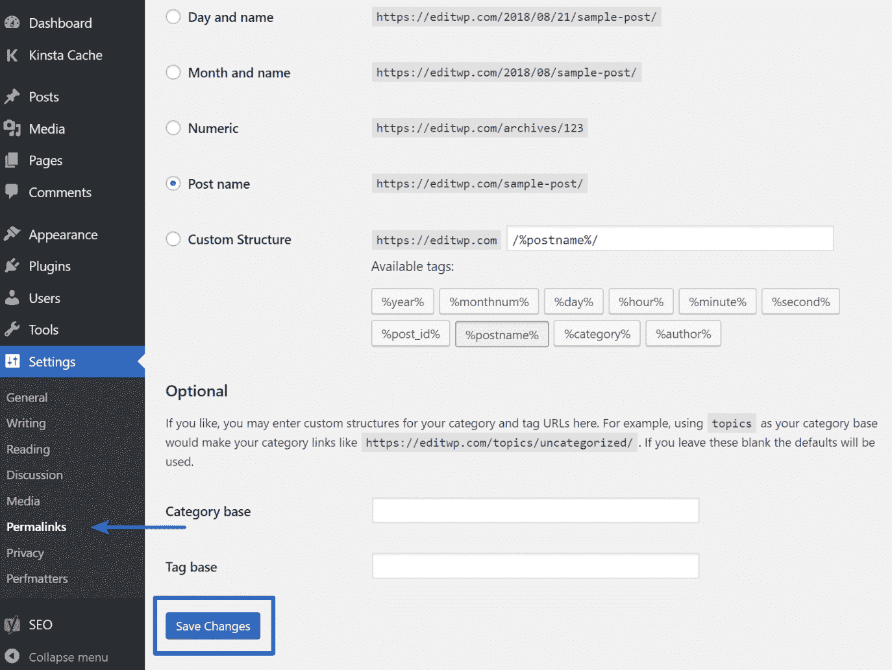
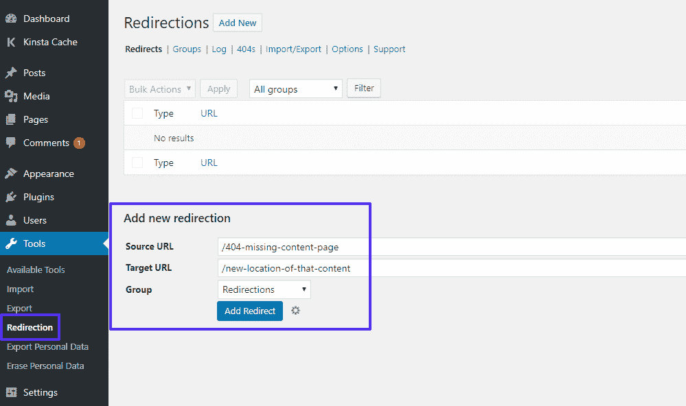
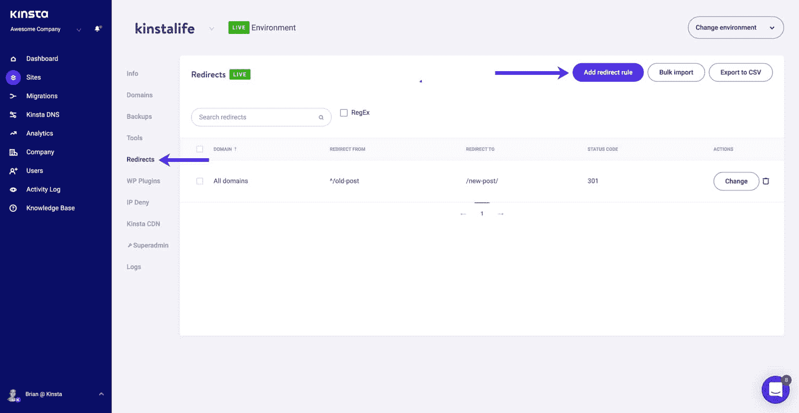
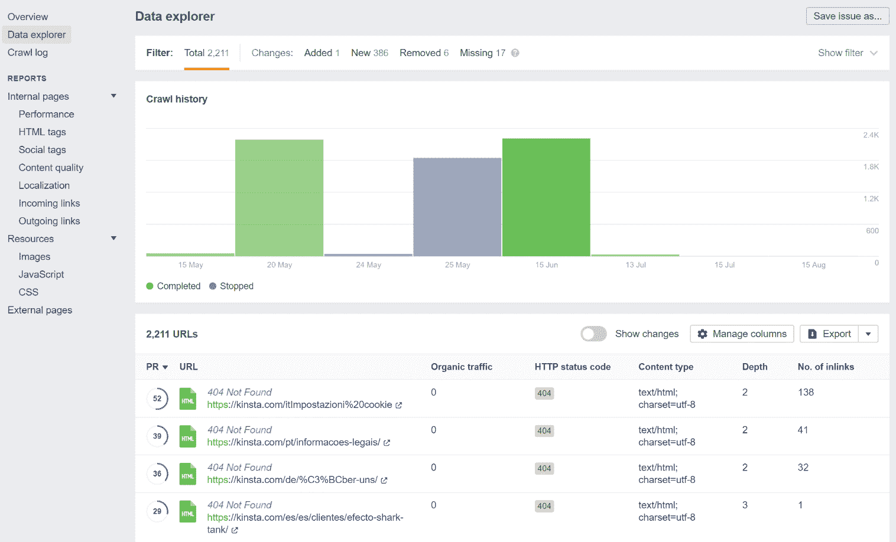
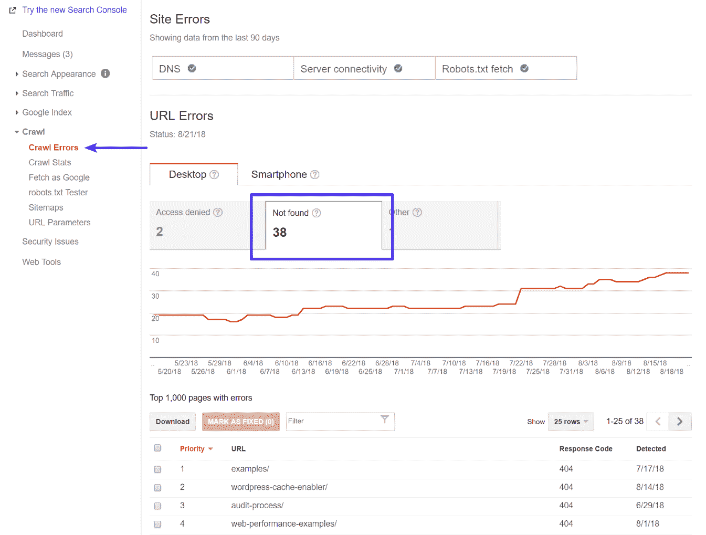

# 如何修复在你的 WordPress 网站上找不到的错误 404

> 原文：<https://kinsta.com/blog/error-404-not-found/>

在你的 WordPress 网站上，你可能会看到许多潜在的错误，错误 404 Not Found 是其中一个比较温和的错误。但这并不意味着当你或你的访问者试图浏览你的网站，并不断运行到错误 404 未找到消息时，它不会令人沮丧。😒这是你最不希望首次潜在客户从你的品牌中看到的。一个 404 错误也可能是一个指示器，告诉你一些东西已经改变或移动，可能需要添加一个 301 重定向来进行 [SEO](https://kinsta.com/blog/what-does-seo-stand-for/) 。

在这篇文章中，我们将通过解释几件事来帮助你的网站重新运行:

### 更喜欢看[视频版](https://www.youtube.com/watch?v=tCq5Sed-4PQ)？

## 404 未找到是什么错误？

互联网工程任务组(IETF)将错误 [404 未找到](https://tools.ietf.org/html/rfc7231#section-6.5.4)定义为:

> 404(未找到)状态代码指示源服务器没有找到目标资源的当前表示或者不愿意公开存在的表示。*404 状态码并不表示这种代表性的缺乏是暂时的还是永久的；如果源服务器大概通过一些可配置的手段知道该状况可能是永久性的，则 410(消失)状态码优于 404。*

每当您或您的访问者访问您的网站时，您的浏览器都会向 web 服务器发送一个请求，并接收返回的数据，其中包括一个叫做 HTTP 头的东西。HTTP 报头包括 [HTTP 状态代码](https://kinsta.com/blog/http-status-codes/)来解释请求“发生了什么”。

大多数情况下，请求工作得很好，实际上您永远看不到 HTTP 状态代码(*，除非您去查看*)。但是如果某个*出错了*，你的网络浏览器通常会显示一条带有 HTTP 状态码的消息来指出确切的问题。

就像其他错误信息( [500 错误](https://kinsta.com/blog/500-internal-server-error/)、 [502 错误](https://kinsta.com/blog/502-bad-gateway/)、 [503 错误](https://kinsta.com/blog/http-error-503/)、 [504 错误](https://kinsta.com/blog/504-gateway-timeout/)等。)，错误 404 Not Found 消息就是该过程的结果。

### 错误 404 未找到实际上是什么意思？

基本上，这意味着客户端(*你的，或者你的访问者的，网页浏览器*)能够成功连接到主机(*你的网站的服务器*)，但是它无法找到所请求的实际资源(*，例如一个特定的 [URL](https://kinsta.com/knowledgebase/wordpress-change-url/) 或者文件名*)。

例如，如果有人试图访问`yoursite.com/post-name`，但你没有任何与 slug `post-name`相关的内容。访问者将会看到一个 404 错误，因为即使您的 web 服务器运行正常，请求的资源也不存在。

不仅仅是帖子或页面，任何资产丢失都会在服务器上生成 404 错误，比如丢失图像文件、丢失 JavaScript、丢失 [CSS](https://kinsta.com/blog/wordpress-css/) 等。
T3】

### WordPress 上找不到错误 404 的原因是什么？

如果你在你网站的所有内容上看到这个错误，通常是由于你的 WordPress 网站的[永久链接](https://kinsta.com/blog/wordpress-permalinks/)有问题。如果你只在单个内容上看到它，很可能是因为你在没有设置重定向的情况下改变了一个内容的 slug。

此外，404 错误并不总是一件坏事——**只有当它干扰可用性时才是坏事**。有时候事情不在你的掌控之中！

例如，有时一个人可能只是在地址栏中输入了错误的 URL。在这种情况下，他们仍然会看到一个 404 错误，但是您的站点的配置没有实际问题。这实际上是期望的响应，您可以创建自己的自定义 404 页面来帮助访问者找到正确的位置(*我们稍后将向您展示如何做*)。

### 错误 404 找不到变化

由于不同的浏览器显示不同的错误信息，您可能会看到不同的错误信息。其他常见的变化包括:

*   "错误 404 "
*   " 404 找不到"
*   " HTTP 错误 404 "
*   "找不到"
*   "找不到页面"
*   "在此服务器上找不到请求的 URL。"
*   "找不到该页面"
*   “我们找不到您要查找的页面。”
*   "在此服务器上找不到请求的 URL /~我们只知道这些。

Google 404 error page

错误 404 Not Found 消息也是独特的，因为许多网站实际上会创建一个自定义页面来解决该错误，而不是显示上述消息之一。默认情况下，一些 WordPress 主题也包括自定义 404 页面。出于这个原因，你可能根本看不到错误信息，因为许多网站会使用[有趣或有创意的 404 页面来代替](https://www.creativebloq.com/web-design/best-404-pages-812505)。

Funny 404 page example

下面是一个我们自己的金斯塔 404 页的例子。我们包括一个搜索框和一些我们最近的博客帖子，以帮助访问者找到他们可能一直在寻找的东西。永远在你的 404 页面上包含搜索功能。

Kinsta 404 page

### 错误 404 未发现对 SEO 的影响

错误 404 没有找到没有任何内在的负面影响搜索引擎优化。但是根据错误发生的原因，它可能会产生负面影响。

例如，如果一个访问者只是打错了一个网址，看到一个 404 错误，这不会对搜索引擎优化产生负面影响。但是，如果你有个别错误，因为破碎的网址，这将抑制谷歌的能力，妥善抓取您的网站，并有负面的搜索引擎优化的影响。

此外，如果一个永久链接问题导致了网站范围的 404 错误，谷歌将无法抓取你网站的任何内容。换句话说，**总是尽快修复你的 404 错误**。
T3】

### 错误 404 未发现对站点性能的影响

许多人没有意识到这一点，但产生大量 404 错误的网站很容易遇到性能问题，因为这些响应通常不会被缓存。我们在较大的网站上看到了很多这样的情况，如果你不小心推广了一个 404 页面，或者病毒式流量激增，这将是一个大问题。为了最小化 404 请求对站点性能的影响，我们自动[缓存 404 页面 15 分钟](https://kinsta.com/blog/wordpress-cache/#caching-404-pages)。如果您创建了一个与缓存的 404 页面具有相同 URL 的新页面，我们将自动清除缓存，以便您的访问者能够立即看到新页面。这意味着您的网站将受到保护，免受 PHP 和 CPU 高峰所造成的流量，以动态 404 网页。

您生成的 404 错误可能比您想象的要多！我们的 [MyKinsta analytics](https://kinsta.com/help/mykinsta-analytics/) 工具可以帮助您确定准确的金额(如下所示)。

404 Errors

您还可以快速查看前 404 个错误是什么。在下面这个例子中，你可以看到网站缺少了一些移动图标，比如`/apple-touch-icon.png`。这些最有可能出现在被查询的主题或插件代码中，但实际的图标从未被添加。因此，服务器会生成 404 错误，因为它找不到资源。

Top 404 errors

你也可以在[谷歌搜索控制台](https://kinsta.com/blog/google-search-console/)中检查 404 错误，或者安装一个第三方插件，比如记录 404 错误的[重定向](https://wordpress.org/plugins/redirection/)。但是，请记住，像这样的插件也会对性能产生影响。依靠一个服务器级的工具要好得多。这就是我们为所有 Kinsta 客户提供这些工具的原因。

## 注册订阅时事通讯

### 想知道我们是怎么让流量增长超过 1000%的吗？

加入 20，000 多名获得我们每周时事通讯和内部消息的人的行列吧！

[Subscribe Now](#newsletter)

这些错误之所以糟糕，是因为许多 404 页面非常耗费资源。对于大型网站来说，你会想要避免沉重的 404 页面。创建一个[简单的 404 模板](https://codex.wordpress.org/Creating_an_Error_404_Page)，尽可能避免进一步查询数据库。

## 如何修复在 WordPress 上找不到的错误 404

下面，我们将介绍几种不同的方法来修复错误 404 Not Found 消息，这取决于它是发生在站点范围内还是针对特定内容。

### 更新你的 WordPress 站点的永久链接

如果你在尝试访问内容时遇到了站点范围的 404 错误，最有可能的原因是你的永久链接(或你的[)有问题。htaccess 文件](https://kinsta.com/knowledgebase/wordpress-htaccess-file/)，如果你的主机使用 [Apache](https://kinsta.com/knowledgebase/what-is-apache/) 。如果你是 Kinsta 的客户，我们利用 [Nginx](https://kinsta.com/knowledgebase/what-is-nginx/) ，所以你可以排除。htaccess 文件是一个可能的原因。

解决这个问题最简单的方法是通过 WordPress 仪表盘更新你的[永久链接设置](https://kinsta.com/blog/wordpress-permalinks/)。你需要做的就是进入设置→永久链接，点击保存更改(你不需要做任何更改——点击保存更改就够了)。

Regenerate permalinks in WordPress

### 为移动或重命名的内容设置 301 重定向

如果您在某个特定内容上遇到 404 错误，问题很可能是您:

*   更改了该内容的 URL slug[。](https://kinsta.com/knowledgebase/what-is-a-wordpress-slug/)
*   手动移动该内容，例如删除现有帖子并将其粘贴到新帖子中。

然后，用户试图访问旧位置的内容，并看到 404 页面，而不是他们期望的资源。解决这个问题的最好方法是自动将任何试图访问旧位置的人重定向到新位置。那样的话，他们将会没有任何 404 错误地到达正确的地点。对 SEO 也有好处。如果你在没有添加重定向的情况下移动或重命名一篇文章，你将失去该文章反向链接的所有域名权限。

默认情况下，WordPress 将尝试重定向更改/移动的内容。但是它并不总是有效，你不应该依赖 WordPress 来实现这个功能。但是不要担心，在 WordPress 中设置[重定向有几种简单的方法:](https://kinsta.com/blog/wordpress-redirect/)

首先，你可以使用[免费重定向插件](https://wordpress.org/plugins/redirection/)从你的 WordPress 仪表盘管理重定向。安装并激活插件后，转到工具→重定向，在源 URL 框中输入 404 页面 URL，并在目标 URL 框中输入内容的新位置:

How to set up redirects with the Redirection plugin

如果你用 Kinsta 托管，你也可以从 MyKinsta 仪表板[管理重定向](https://kinsta.com/help/redirect-rules/)。使用 Kinsta 的工具实际上是一种更好的方式，因为**规则是在服务器级**实现的，这在性能方面是一种更优的方式。这也意味着你要担心的第三方插件少了一个。

Struggling with downtime and WordPress problems? Kinsta is the hosting solution designed to save you time! [Check out our features](https://kinsta.com/features/)

转到您想要管理的站点。然后，单击“重定向”选项卡。要添加新的重定向，请单击大的“添加重定向规则”按钮:

How to set up redirects from your Kinsta dashboard

最后，如果您的主机使用 Apache 服务器，您可以使用。htaccess 设置重定向。[。htaccess Generator site](https://www.htaccessredirect.net/) 可以帮助你生成合适的代码添加到你站点的。htaccess 文件。

## 如何创建自己的错误 404 未找到页面

虽然你可以按照上面的提示尽最大努力防止 404 错误，但是完全消除 404 错误是不可能的，因为有些事情完全超出了你的控制范围。小型 WordPress 网站每个月都有数千个 404 错误，这并不罕见。

例如，如果一个访问者打错了 URL，或者如果另一个网站链接到一个不存在的页面，人们无论如何都会得到 404 错误。

为了提供更加用户友好的错误页面，您可以使用众多 404 页面插件中的一个。例如，免费的[404 页面插件](https://wordpress.org/plugins/404page/)可以让你设置一个自定义的 404 错误页面:

*   搜索框
*   重要链接
*   联系信息

404page 插件的另一个重要特性是它不创建重定向。一个 **404 页面不应该被重定向到一个物理页面**，比如`yoursite.com/404`。404 错误应该总是在有问题的页面上动态生成。

通过包含这些元素，您为访问者提供了找到正确页面所需的工具。但是请记住，**保留您的 404 页面灯** **以获得更好的性能**。只包含绝对需要的内容。

## 如何监控未来的 404 错误

接下来，关注哪些请求会导致您的站点出现 404 错误是有益的。这可以帮助您:

*   [找到将人们导向一个不存在的资源的断开的链接](https://kinsta.com/blog/broken-links/)(这些链接可能是来自其他网站的内部链接或外部链接)。如果可能的话，你会想尽最大努力修复这些链接。
*   查看 Google 抓取哪些页面有问题。然后你会想弄清楚为什么谷歌试图抓取一个不存在的页面，并在需要时设置重定向。
*   排除与 404 错误相关的性能问题。

### 选项 1–谷歌分析

[如果你使用谷歌分析](https://kinsta.com/blog/how-to-use-google-analytics/)，你可以设置一个自定义报告来跟踪来自外部链接的 404 错误。Rebelytics】有一个关于这个话题的很好的教程。

### 选项 2-WordPress 插件

如果你想使用 WordPress 插件，前面提到的[重定向插件](https://wordpress.org/plugins/redirection/)可以帮助你从你的 WordPress 仪表盘监控 404 错误。

### 选项 3–第三方审计工具

你也可以使用第三方审计工具，如 [Ahrefs](https://ahrefs.com/site-audit/) 来监控你的 WordPress 站点上的 404 错误。您甚至可以将其设置为按计划运行。

404 errors audit

### 选项 4–谷歌搜索控制台

最后，你可以跟踪谷歌爬虫在谷歌搜索控制台遇到的 404 错误。一旦[通过谷歌搜索控制台](https://kinsta.com/blog/google-site-verification/)验证了你的站点，进入抓取→抓取错误→未找到查看谷歌遇到的 404 错误列表。这是迄今为止最简单的方法之一。它在性能方面也是最好的，因为它不需要第三方插件或额外扫描你的网站。谷歌的机器人已经在定期抓取你的网站，那么为什么不简单地利用他们已经提供的数据呢？😉

Google Search Console 404 errors

## 摘要

不幸的是，无论你喜欢与否，404 错误都会发生在你的网站上。你的 WordPress 站点越大，你开始看到的就越多。我们建议制定一个良好的工作流程来监控这些类型的错误并着手修复它们。404 错误对访客、对你的品牌从来都不是好事，谷歌也不喜欢看到。

关于错误 404 找不到信息或者它如何影响你的 WordPress 站点，你有其他的建议或者问题吗？请在评论中告诉我们。

* * *

让你所有的[应用程序](https://kinsta.com/application-hosting/)、[数据库](https://kinsta.com/database-hosting/)和 [WordPress 网站](https://kinsta.com/wordpress-hosting/)在线并在一个屋檐下。我们功能丰富的高性能云平台包括:

*   在 MyKinsta 仪表盘中轻松设置和管理
*   24/7 专家支持
*   最好的谷歌云平台硬件和网络，由 Kubernetes 提供最大的可扩展性
*   面向速度和安全性的企业级 Cloudflare 集成
*   全球受众覆盖全球多达 35 个数据中心和 275 多个 pop

在第一个月使用托管的[应用程序或托管](https://kinsta.com/application-hosting/)的[数据库，您可以享受 20 美元的优惠，亲自测试一下。探索我们的](https://kinsta.com/database-hosting/)[计划](https://kinsta.com/plans/)或[与销售人员交谈](https://kinsta.com/contact-us/)以找到最适合您的方式。