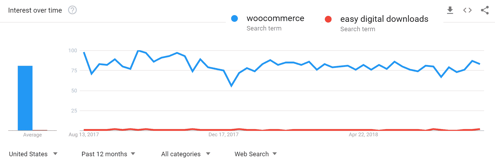
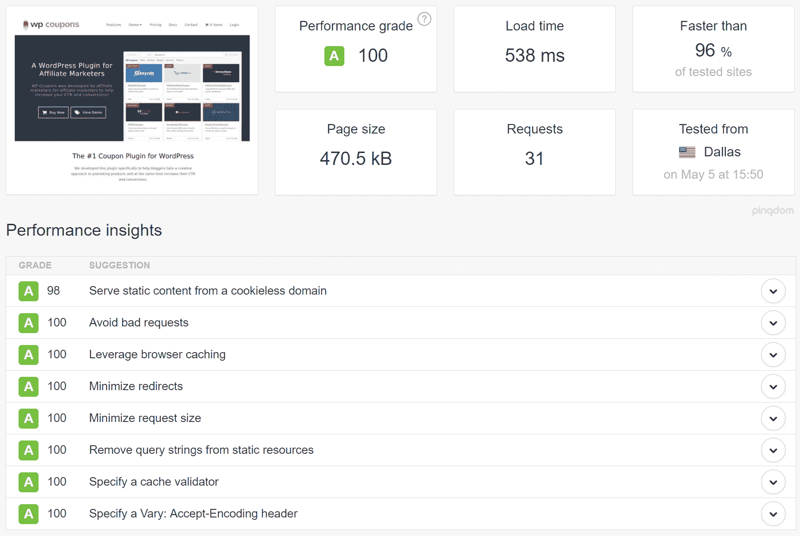

# WooCommerce 与 Easy Digital Downloads:你应该使用哪一个？

> 原文：<https://kinsta.com/blog/woocommerce-vs-easy-digital-downloads/>

从市场份额来看，WordPress 是创建电子商务商店最受欢迎的方式。尽管 WooCommerce 大受欢迎，但实际上你可以通过多种方式使用 WordPress 来创建一个电子商务商店，轻松的数字下载是另一个重要的选择。

这可能会让你想知道…当谈到 WooCommerce 和 Easy Digital Downloads 时，你应该使用哪个插件来建立你的商店？

嗯，简单的答案是，WooCommerce 是针对实体产品的，而 T2 的 Easy Digital Downloads 是针对数字产品的。

虽然上面这句话大体上是对的，但它也有点过于简单了。也就是说，你仍然可以使用 WooCommerce 来销售数字产品，也可以销售易于数字下载的实体产品。

因为答案并不总是那么简单，所以在这篇文章中，我们将对 WooCommerce 和 Easy Digital Downloads 进行全面的比较。

最后，你应该知道哪一个是你的 WordPress 电子商务商店的正确选择。

*   [woo commerce vs Easy Digital Downloads](#woocommerce-vs-edd)
*   每台机器能卖什么？
*   [您可以使用哪些支付网关？](#payment-gateways)
*   有哪些插件和主题可用？
*   一个插件比另一个更容易使用吗？
*   [定价差异](#pricing)
*   [电子商务表现](#performance)

## WooCommerce 和简单的数字下载

毫无疑问，WooCommerce 是 WordPress 电子商务领域的巨头。2015 年被 Automattic 以**~ 3000 万美元**收购，WooCommerce 在互联网上所有[电子商务网站](https://kinsta.com/wordpress-market-share/)中占有 [~8%的市场份额。当你看到排名前 100 万的网站时，这个比例高达 21%。](https://kinsta.com/wordpress-market-share/#woocommerce)

WooCommerce 最初是用来处理实体产品的，不过现在你也可以用它来处理数字产品。


> Kinsta 把我宠坏了，所以我现在要求每个供应商都提供这样的服务。我们还试图通过我们的 SaaS 工具支持达到这一水平。
> 
> <footer class="wp-block-kinsta-client-quote__footer">
> 
> 
> 
> <cite class="wp-block-kinsta-client-quote__cite">Suganthan Mohanadasan from @Suganthanmn</cite></footer>

[View plans](https://kinsta.com/plans/)

它的受欢迎程度，加上它由 Automattic 支持的事实，意味着:

*   WooCommerce extensions 有一个巨大的市场，你可以用它来为你的商店增加额外的功能。WooCommerce 主题也是如此。
*   它得到了持续的支持和发展。基本上，它不会很快消失。
*   如果你遇到任何问题，很容易找到帮助或专家支持。

容易数字下载，通常缩写为 EDD，没有 WooCommerce 那么受欢迎。[根据数据](https://kinsta.com/wordpress-market-share/)，它只为最富有的 100 万人中的 0.2%提供电力。但这没什么可嗤之以鼻的，它在销售数码产品的电子商务商店中很受欢迎。

顾名思义，Easy Digital Downloads 是为处理数字产品而建立的，尽管它现在确实为实体产品提供了基本的支持。比如 WooCommerce:

*   轻松数字下载拥有官方和第三方扩展的市场。2017 年，Easy Digital Downloads 将其托管市场内部化，但你仍然可以找到大量第三方插件。
*   虽然 EDD 背后的公司沙丘发展公司没有 Automattic 那么大，但它仍然很有名气。除了 EDD，它还有像 Restrict Content Pro 和 AffiliateWP 这样的插件。



Google trends – WooCommerce vs Easy Digital Downloads


## 你能用 WooCommerce 和简单的数字下载卖什么？

好的，尽管我们一开始给你的是简化版，你可以使用 WooCommerce 和 Easy Digital Downloads 来销售实体和数字产品。

也就是说，有一个原因仍然是一个很好的经验法则:

*   虽然你[可以使用简单的数字下载来销售实体产品](https://docs.easydigitaldownloads.com/article/1173-can-i-sell-physical-products-with-easy-digital-downloads)，但它仍然是以数字产品为中心构建的，所以对实体产品的支持永远不会像你从 WooCommerce 获得的那样详细。
*   WooCommerce 有很多明显不适用于数码产品的功能。基本上，一个纯数字商店有很多你不需要的多余的东西。
*   虽然两者都支持软件许可密钥，但大多数开发者似乎更喜欢简易数字下载的许可密钥和订阅方式。EDD 的软件许可模块定期更新。

**关键要点**:

*   如果你的商店销售的大多是数字产品，只有少量的实体产品，那么简单的数字下载可能是你最好的选择。
*   如果你的商店销售的**大部分是实体产品**，你可能会想要 WooCommerce，因为简单的数字下载只意味着基本的实体运输。如果你决定在未来销售一些数码产品，你仍然会很好，因为 WooCommerce 确实支持数码产品。请务必查看我们关于 [WooCommerce 订阅的深入指南](https://kinsta.com/blog/woocommerce-subscriptions/)。

## 您可以使用哪些支付网关？

当谈到大牌支付网关时，你可能不会注意到 WooCommerce 和 Easy Digital Downloads 之间的任何区别。也就是说，这两个插件都支持大牌，比如:

*   贝宝
*   [条纹](https://kinsta.com/blog/stripe-for-wordpress/)
*   Authorize.net
*   2 结账

话虽如此，我们想强调的是，WooCommerce 和 Easy Digital Downloads 都免费提供了 Stripe 和 PayPal 的网关(过去，EDD 使用 Stripe 要收 89 美元)。

使用方形？查看我们的深度对比博文:[条纹 vs 方形](https://kinsta.com/blog/stripe-vs-square/)。

此外，如果你需要一个不同的支付网关——比如一个特殊的本地支付网关——woo commerce 因其受欢迎程度而拥有更广泛的扩展。

你可以找到一个很大的列表，上面列有方便数字下载的第三方支付网关，但是其中很多都没有得到很好的维护。

**关键要点**:

*   两者都支持所有主要的支付网关。
*   WooCommerce 免费为您提供更多支付网关。
*   由于 WooCommerce 的流行，它对较小的本地网关有更好的支持。

## 有哪些可用的附加组件和主题？

由于其受欢迎程度，WooCommerce 有更大的插件和主题选择。例如，一些快速搜索会出现:

*   WordPress.org 大约有 5600 个 WooCommerce 插件，相比之下，轻松数字下载只需 600 英镑
*   CodeCanyon 上大约有 2，700 个 WooCommerce 插件，相比之下，轻松数字下载只有大约 300 个插件

当然，你不需要成千上万的插件——你只需要几个关键的插件，或者从这个精选列表中挑选出最好的 WooCommerce 插件。所以这两个数字之间的差异不应该影响你的决定。

这里的想法只是为了说明 WooCommerce 有一个更大的扩展市场，如果你需要一些特殊的利基功能，这可能会有所帮助。

也就是说，Easy Digital Downloads 拥有销售数字产品所需的所有重要功能的扩展，以及大量好看的主题。

**关键要点**:

*   WooCommerce 有一个明显更大的附加产品和主题市场。
*   这在现实生活中可能并不意味着任何区别，因为你可能只需要几个关键插件——你需要检查自己是否每个解决方案都可以通过核心功能或附加功能提供必要的功能。

## 一个插件比另一个更容易使用吗？

这两个插件都使创建电子商务商店变得容易，并且在可用性上没有很大的区别。如果你能使用 WooCommerce，那么使用简易数字下载应该没有问题(反之亦然)。

## 注册订阅时事通讯


### 想知道我们是怎么让流量增长超过 1000%的吗？

加入 20，000 多名获得我们每周时事通讯和内部消息的人的行列吧！

[Subscribe Now](#newsletter)

如果你想比较一下用每个插件创建商店的效果，我们已经为每个插件编写了详细的教程:

*   [WooCommerce 教程](https://kinsta.com/blog/woocommerce-tutorial/)
*   [轻松数字下载教程](https://kinsta.com/blog/easy-digital-downloads/)

这两个教程都将带你经历创建电子商务商店的整个过程，这将让你对这两个插件的易用性有所了解。

**关键外卖**:

*   这两个插件都使得用 WordPress 创建电子商务商店变得容易。

## WooCommerce vs 简易数字下载:定价

最后，我们来谈谈价格…

虽然这两个核心插件都是免费的，但不管你选择哪个插件，你都需要购买至少几个额外的插件。

不幸的是，哪辆车更便宜并没有统一的规则——这有点像问“红色的车比蓝色的车便宜吗？”。答案是，看情况…

由于 2016 年末 Easy Digital Downloads[价格上涨，个人 WooCommerce 扩展*通常*会便宜一点，或者有时价格相对合理。例如:](https://pippinsplugins.com/reflection-on-a-price-increase/)

*   WooCommerce 的付费网关通常售价 79 美元，但对于简单的数字下载，售价 89 美元。
*   WooCommerce 软件授权 129 美元，定期支付 199 美元。在简易数字下载上，软件许可起价为 99.50 美元，定期支付为 199 美元。

不过，简易数字下载[也出售捆绑包](https://easydigitaldownloads.com/pricing/)，这可以帮你省下一大笔钱。例如，你可以在第一年花 499.50 美元(之后是 999 美元/年)获得**的所有扩展，用于无限制的网站**，这为你节省了一大笔钱，尤其是在多个网站上:

[](https://kinsta.com/wp-content/uploads/2018/08/edd-pricing-as-of-oct-2021.png)

Easy Digital Downloads bundles (billed annually)


虽然有几个 WooCommerce 捆绑包，但没有什么比得上 Easy Digital Downloads 捆绑包的价值。

Struggling with downtime and WordPress problems? Kinsta is the hosting solution designed to save you time! [Check out our features](https://kinsta.com/features/)

因此，如果你需要使用大量的扩展，特别是在多个网站上，简易数字下载的捆绑方式实际上可能会让它更实惠。

**关键要点**:

*   对于网络商务和简单的数字下载哪个更便宜，没有硬性规定。
*   个人 WooCommerce 扩展似乎通常会便宜一点。
*   简易数字下载捆绑包可能会让它更实惠，尤其是如果你需要大量的扩展或经营多个商店。

## 电子商务绩效

要记住的一个非常重要的方面是性能。电子商务 WordPress 网站要求非常高,会产生大量绕过缓存的动态页面负载。它们的功能很像会员网站，为此我们有一整篇文章专门讨论在主办时[的注意事项。](https://kinsta.com/blog/hosting-wordpress-membership-sites/)

因为轻松数字下载的方法更集中，它通常具有更好的开箱即用性能。例如，这里有一个经过优化的简易数字下载商店，在 Kinsta 上加载不到 600 毫秒。



Easy Digital Downloads load time example


如果我们看一下新安装的 WooCommerce 和 Easy Digital Downloads，我们也可以看到不同之处。我们建立了一个包含单一产品购物车的商店页面，并运行了一些测试。

### 全新安装 WooCommerce

我们最新的未优化的 WooCommerce 安装[在 774 ms](https://tools.pingdom.com/#!/RAuJx/https://editwp.com/shop/) 内完成。以下是**商店页面加载的八个 WooCommerce 脚本**:

*   `/plugins/woocommerce/assets/css/woocommerce-layout.css`
*   `/plugins/woocommerce/assets/css/woocommerce-smallscreen.css`
*   `/plugins/woocommerce/assets/js/frontend/add-to-cart.min.js`
*   `/plugins/woocommerce/assets/js/jquery-blockui/jquery.blockUI.min.js`
*   `/plugins/woocommerce/assets/js/js-cookie/js.cookie.min.js`
*   `/plugins/woocommerce/assets/js/frontend/woocommerce.min.js`
*   `/plugins/woocommerce/assets/js/frontend/cart-fragments.min.js`
*   `/?wc-ajax=get_refreshed_fragments`

WooCommerce 网站，尤其是大型网站，有时会遇到`/?wc-ajax=get_refreshed_fragments`脚本的加载时间问题。WooCommerce 中的 cart fragments 特性和/或 AJAX 请求用于在不刷新页面的情况下更新购物车总数。问题是这个请求不能被缓存，并且有时是有代价的。

您必须改进的一个选项是让脚本出列。你甚至可以在特定的页面上这样做，比如你最重要的页面，主页。当然，这不是必须的，但可以提高速度。你可以在 GitHub 上看到这个[问题，以及一个你可以使用的出列函数的例子:](https://github.com/woocommerce/woocommerce/issues/9365)

```
add_action( 'wp_enqueue_scripts', 'dequeue_woocommerce_cart_fragments', 11); function dequeue_woocommerce_cart_fragments() { if (is_front_page()) wp_dequeue_script('wc-cart-fragments'); }
```

一些其他的选择是使用一个[性能插件](https://kinsta.com/blog/wordpress-performance-plugins/),它允许您轻松地禁用购物车片段特性或 JavaScript 购物车解决方案。如果你好奇的话，当 WooCommerce 启用时，上面的八个**脚本也会加载整个站点的**。

### 全新安装轻松的数字下载

我们全新的未经优化的简易数字下载安装程序[在 717 毫秒](https://tools.pingdom.com/#!/eB5ym2/https://editwp.com/shop/)内完成加载。与 WooCommerce 相比，总加载时间减少了 7.36%。商店页面上还加载了**仅有的两个简单的数字下载脚本**:

*   `/plugins/easy-digital-downloads/templates/edd.min.css`
*   `/plugins/easy-digital-downloads/assets/js/edd-ajax.min.js`

因此，虽然没有很大的区别，但就商店页面上的内容而言，EDD 的分量绝对较轻。当启用 EDD 时，上述两个脚本也会在站点范围内加载。

### 优化电子商务性能

如果优化得当，轻松数字下载和 WooCommerce 都能快速加载。然而， [WooCommerce 通常需要更多的调整](https://kinsta.com/blog/speed-up-woocommerce/#how-to-speed-up-woocommerce)和 [WooCommerce 优化托管](https://kinsta.com/woocommerce-hosting/)。我们的 WordPress 团队每天都在优化高流量的 WooCommerce 和 EDD 网站。我们都看到了。以下是我们进一步寻找性能和功能之间完美平衡的几种方法:

*   我们有快速的服务器级页面缓存和规则来确保 WooCommerce 和 EDD 的正常运行。
*   默认情况下，某些不应该被缓存的页面，如购物车、我的帐户和结帐，被排除在缓存之外。
*   当检测到`woocommerce_items_in_cart cookie`或`edd_items_in_cart`时，用户会自动绕过缓存，以确保结账过程平稳、同步。

在 Kinsta，你还可以选择一个拥有更多 PHP 工作人员的计划。PHP 工作人员本质上处理所有不是来自缓存的请求。

## 你应该使用 WooCommerce 还是 Easy Digital Downloads？

最后，它仍然回到我们在简介中设置的简单区别:

*   对于一家主要销售实体产品的商店来说，WooCommerce 可能是最好的选择。
*   对于一家主要销售**数字产品的商店来说，**尤其是那些需要软件许可的商店，轻松数字下载可能是最好的选择。

你的商店的独特需求可能会与趋势背道而驰，使一个插件成为比另一个更好的选择，但以上是大多数商店的经验法则。

你呢——你用过这两个插件吗？你会推荐哪一个，为什么/什么时候？

* * *

让你所有的[应用程序](https://kinsta.com/application-hosting/)、[数据库](https://kinsta.com/database-hosting/)和 [WordPress 网站](https://kinsta.com/wordpress-hosting/)在线并在一个屋檐下。我们功能丰富的高性能云平台包括:

*   在 MyKinsta 仪表盘中轻松设置和管理
*   24/7 专家支持
*   最好的谷歌云平台硬件和网络，由 Kubernetes 提供最大的可扩展性
*   面向速度和安全性的企业级 Cloudflare 集成
*   全球受众覆盖全球多达 35 个数据中心和 275 多个 pop

在第一个月使用托管的[应用程序或托管](https://kinsta.com/application-hosting/)的[数据库，您可以享受 20 美元的优惠，亲自测试一下。探索我们的](https://kinsta.com/database-hosting/)[计划](https://kinsta.com/plans/)或[与销售人员交谈](https://kinsta.com/contact-us/)以找到最适合您的方式。