# 利用脸书取得营销成功的 6 种方法

> 原文：<https://kinsta.com/blog/facebook-marketing/>

脸书最近出现在新闻中，但不是因为什么重要的原因。剑桥分析数据恐慌。选举[广告被俄罗斯人篡改](https://www.nytimes.com/2017/11/01/us/politics/russia-2016-election-facebook.html)。马克·扎克伯格的严密审查。似乎脸书一直在克服一个又一个障碍，同时在这个过程中失去了[消费者的信任。这让许多营销人员想知道，“鉴于最近的事件，你还应该费心在脸书进行营销吗？”](http://www.businessinsider.com/consumers-dont-trust-facebook-at-all-new-survey-data-2018-4)

简短的回答是:是的。

谈到社交媒体网站，脸书仍然占据主导地位。首先，它带来了月活跃用户，所以你的客户可能会在网站上闲逛。该平台拥有超过 20 亿的月活跃用户(是的，有 B 的是 10 亿)。这个数字比排名第二的 [YouTube 高出 5 亿多人。](https://kinsta.com/blog/youtube-stats/)

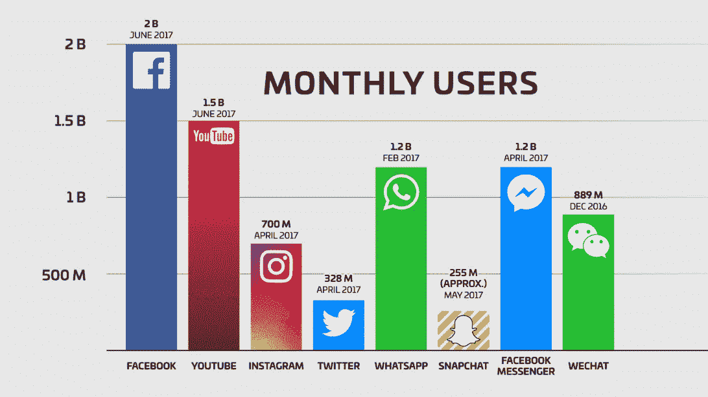

Facebook monthly users (Image source: [TechCrunch](https://techcrunch.com/2017/06/27/facebook-2-billion-users/))

不过，最重要的是，它的营销投资回报率令人印象深刻。它连续获得移动营销投资回报率第一名，并被评为全球营销人员最重要的社交媒体平台 T2 排名第二的 [LinkedIn](https://kinsta.com/blog/linkedin-statistics/) 和脸书之间的差距甚至还没有接近，LinkedIn 大约落后脸书 55%。

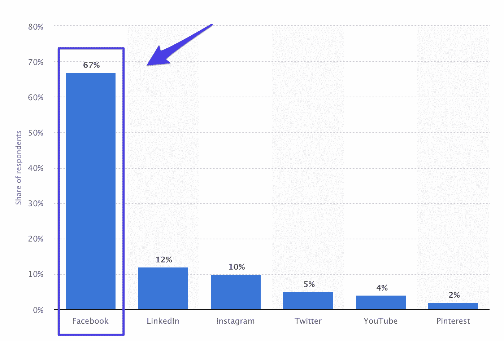

Facebook marketing ROI (Image source: [Statista](https://www.statista.com/statistics/259390/most-important-social-media-platforms-for-marketers-worldwide/))

脸书*影响*消费者的购买行为。研究表明，在评估和发现产品或服务时，社交媒体网站上的营销会影响买家的意识(55%)、考虑(71%)和购后决策(66%)。

但是在脸书进行营销可能会很棘手。这个社交媒体网站自 2004 年成立以来发生了巨大的变化。因此，对营销人员来说，了解脸书的能力是至关重要的，这样他们就可以利用该网站为自己的企业创造销售。在本帖中，我们将分享六种不同的方式来利用这个平台发展你的业务。

1.  [优化您的脸书公司页面](#optimize-facebook-company-page)
2.  [定期发布原创内容](#regularly-post-original-content)
3.  [在您的照片内容中标记您的产品](#tag-products-in-photos)
4.  [支持、鼓励并参与客户评论](#customer-reviews)
5.  [开展脸书广告活动](#facebook-ad-campaign)
6.  [利用你对脸书页面的洞察力](#facebook-page-insights)

推荐阅读:[最好的 WordPress 脸书插件](https://kinsta.com/blog/wordpress-facebook-plugins/)提升你的社交策略。
T3】

## 1.优化您的脸书公司页面

如果你还没有建立你的[脸书公司页面](https://kinsta.com/blog/how-to-create-a-facebook-page/)，你需要把它作为你的首要任务。你的公司页面将成为你分享文章、与粉丝互动甚至投放广告的中心位置。重要的是要知道你的公司粉丝页面将不同于你的个人资料。

### 设置您的公司页面

要设置您的公司页面，请从[这里](https://www.facebook.com/pages/creation/)开始，然后选择“业务”

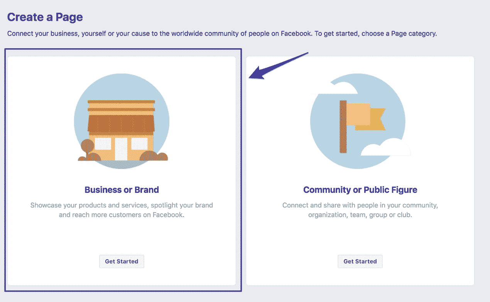

Create a Facebook page

接下来，脸书会问你一系列关于公司总部所在的地理区域、行业类别等问题。这些信息是必要的，因为它会出现在你的脸书页面的“关于”部分。

这可能是您的客户将看到的第一批信息，因此您需要确保这些信息持续准确和最新。

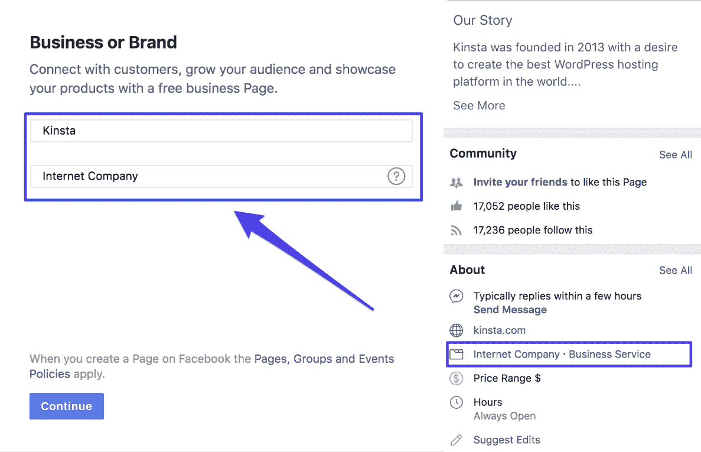

脸书商业类型

### 添加高质量图像

在开始推广你的页面之前，你需要添加两个关键图片。它们是你的个人资料照片和封面照片。当有人浏览你的页面，搜索你的页面，甚至在脸书的新闻订阅上停留在你的页面上时，这些图像会不断地显示出来。因此，你需要确保图像是高质量的，并适合他们的框架。

你的个人资料照片可能是你公司的标志，而你的封面照片可以展示你公司的另一个相关的面貌，包括你的产品、你的客户或更多。

[正确尺寸](https://kinsta.com/blog/social-media-image-sizes/#facebook-image-sizes)如下:

*   **个人资料照片**–它在电脑上以 170×170 像素显示在您的页面上，在智能手机上以 128×128 像素显示，在大多数功能手机上以 36×36 像素显示。对于更高分辨率的显示器**，我们推荐 480 x 480 像素**。
*   **封面照片**–在电脑上显示为 820 像素宽 312 像素，在智能手机上显示为 640 像素宽 360 像素。它必须至少有 400 像素宽和 150 像素高。如果你对高分辨率显示器的质量有任何问题，你也可以尝试 1640 x 624 像素。

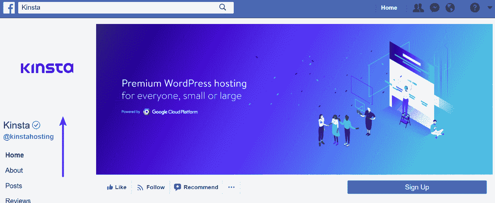

Facebook profile photo

在线[照片编辑工具 Canva](https://www.canva.com/facebook/) 可以帮你设计出高质量的封面照片。或者可以使用 Adobe Photoshop、Sketch、Affinity Designer 之类的软件。此外，有大量的[尺寸模板可用](https://offers.hubspot.com/social-media-cover-photos?_ga=2.50693545.1888342509.1527809751-894896671.1519952315)，以防您需要帮助，以确保您的设计最大化框架中的可用空间。

Zapier 使用高质量的标志作为他们的个人资料图片，并以一种创造性的方式在他们的封面照片中展示企业所做的事情。

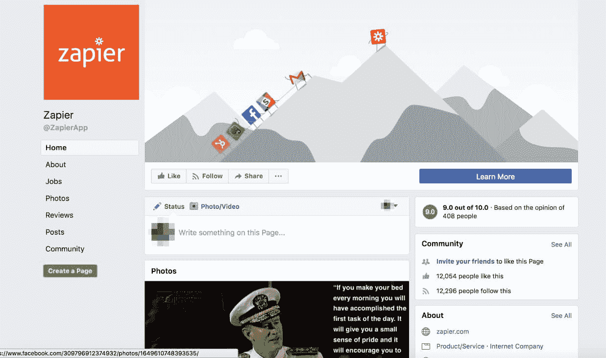

Zapier Facebook page

[安德玛](https://www.facebook.com/UnderArmour/)使用他们的标志作为他们的个人资料图片，并在封面照片中突出一位有影响力的人和他们的“Will Finds A Way”活动。

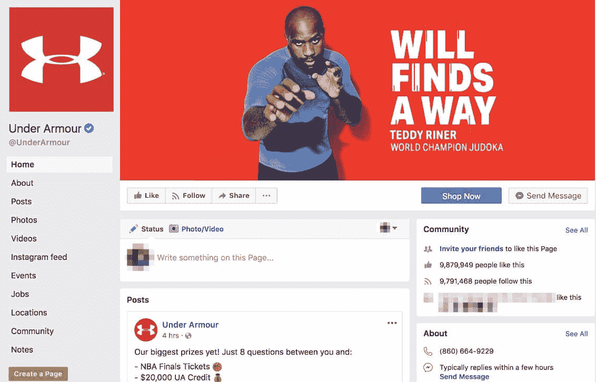

Under Armour Facebook page

[蓝色围裙](https://www.facebook.com/BlueApron/)更进一步，甚至在封面照片上添加了一段视频，展示他们的客户在不同环境下使用他们的产品。脸书封面视频所需的[尺寸](https://www.facebook.com/business/help/community/question/?id=1574705822593637)为 820 x 312。此外，视频必须在 20-90 秒之间。

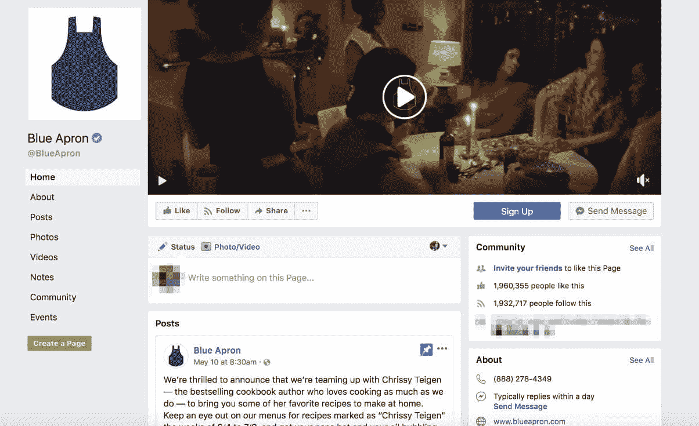

【蓝色围裙】脸书页面(视频示例)

### 优化您的页面

一旦你的页面启动，并且添加了必要的信息，你可以部署各种策略来优化你的页面，并让它出现在尽可能多的人面前。一些建议是:

*   给你的页面添加关键词。重要的是要记住，你的页面的"[名称对应于标题标签](https://unamo.com/blog/social/7-simple-tips-to-optimize-your-facebook-business-page)，你的简短描述作为[元描述标签](https://kinsta.com/blog/meta-description-wordpress/)因此，确保你的页面名称和描述包括[一个焦点关键词](https://kinsta.com/blog/wordpress-seo/)，并准确描述你的页面是关于什么的。
*   在页面上添加行动号召按钮。脸书允许你在你的页面上添加一个行动号召按钮，它会显示在你封面照片的正下方。您可以选择“与您一起预订、联系您、了解您的业务、与您一起购物以进行捐赠、下载您的应用程序或玩您的游戏。”例如，Airtable 邀请用户从他们的脸书页面“注册”时事通讯。

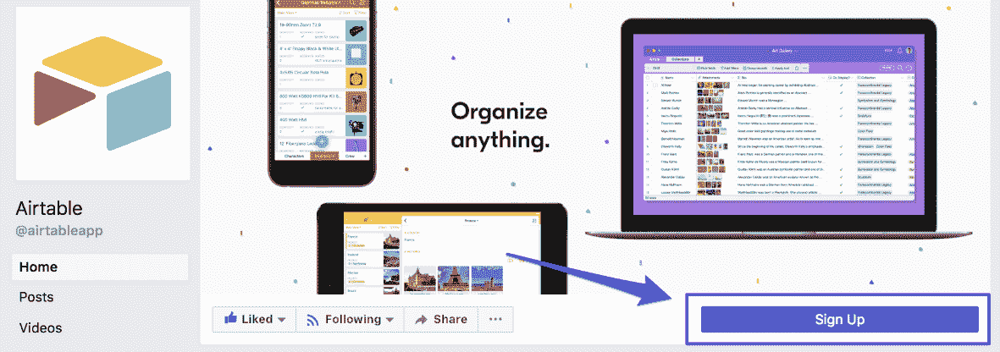

Facebook call to action button

要将此功能添加到您的页面，请单击封面照片下方的“添加按钮”选项，并选择您希望看到的按钮。

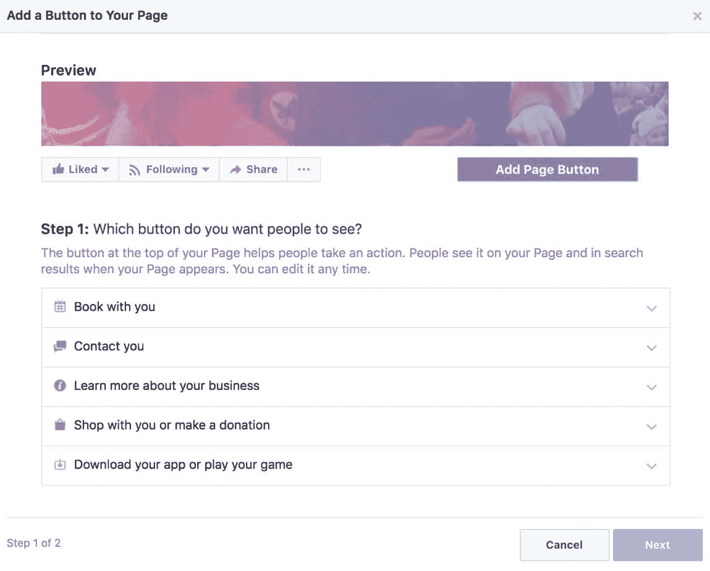

Add button to Facebook page

公司已经通过这个按钮取得了巨大的成功。来自 Dollar Shave Club 的 Brian Kim 表示，“在为期三周的测试过程中，与其他旨在吸引新用户的类似社交广告相比，注册号召按钮的转化率**高出 2.5 倍**。”

## 2.定期发布原创内容

现在您的页面已经优化，您可以开始发布内容与您的观众分享。但是你应该分享什么呢？您的帖子应该与您的业务相关，但不应该总是直接推广您的产品或服务。受欢迎的帖子类型包括:

展示您产品的高质量视频，就像 [Gap](https://www.facebook.com/gap/) 所做的那样。

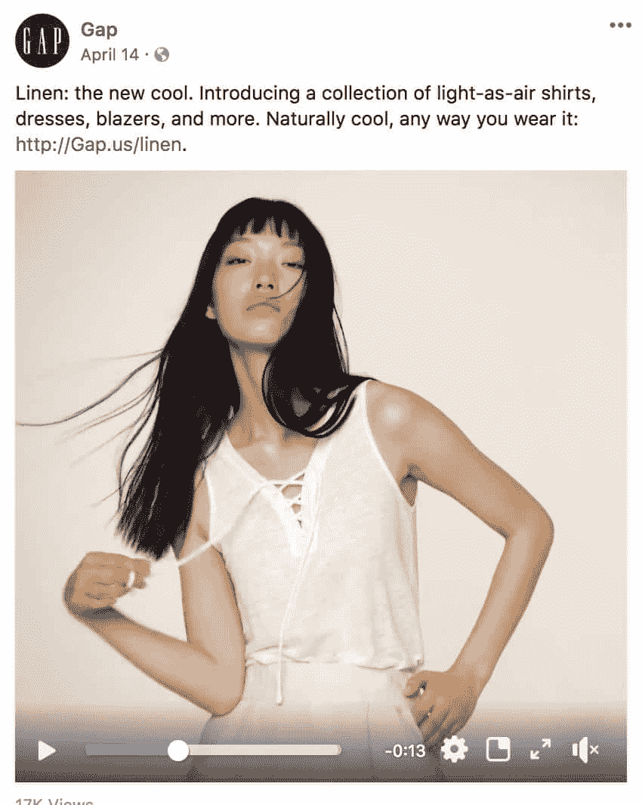

Facebook video post content

或者一篇与你的客户会发现价值的主题相关的文章，就像 [Williams Sonoma](https://www.facebook.com/WilliamsSonoma/) 做的那样。

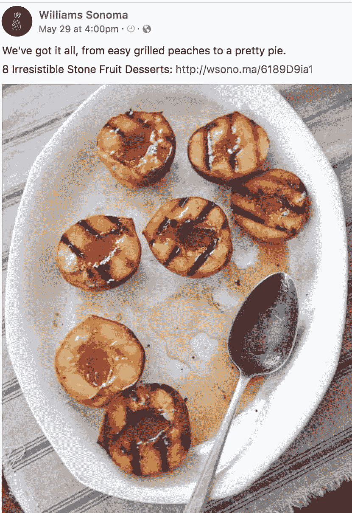

Facebook post content

或者甚至像 Fitbit 所做的那样，举办一场吸引顾客和粉丝的比赛。

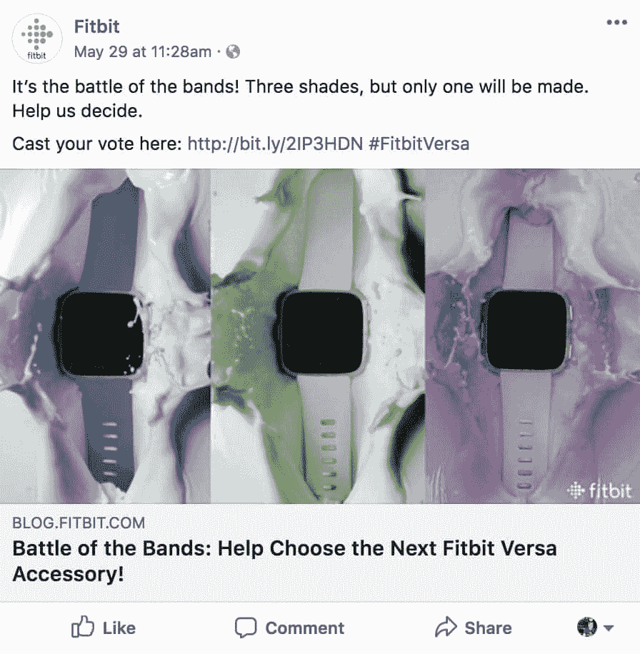

Facebook content post

在脸书算法[减少了显示给企业的有机帖子](http://www.businessinsider.com/facebooks-algorithm-change-makes-it-virtually-impossible-to-launch-new-brands-2018-5)的数量后，让你的帖子尽可能吸引人比以往任何时候都重要。该算法决定哪些帖子出现在一个人的订阅源中的方式是通过评估库存和信号，做出预测，然后分配相关性分数。

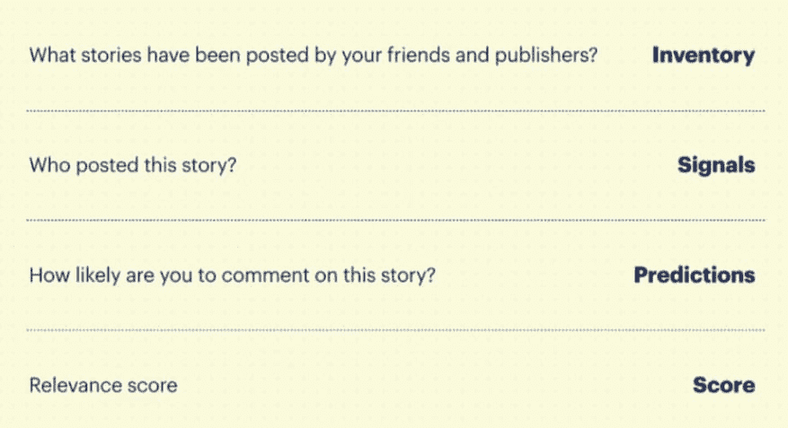

Facebook relevance score (Image source: [Neil Patel](https://neilpatel.com/blog/13-secrets-thatll-boost-your-facebook-organic-reach/))

### 最适合脸书的内容类型

每个人都会问的百万美元问题是，如何让你的帖子更吸引人？

一条经验法则:当有疑问时，看得见。研究表明，视觉内容——图形、图像和视频—[的参与度是纯文本帖子的 2.3 倍。](https://louisem.com/145162/visual-content-marketing-stats)

更进一步说，在参与度方面，[视频优于图片和纯文本帖子](https://animoto.com/blog/business/buffer-video-facebook/)。研究发现“46%的观众说[他们在社交媒体上看了一个品牌视频后进行了购买](https://www.brightcove.com/en/company/press/three-four-consumers-link-social-video-viewing-purchasing-decisions)”

例如，如果你看看 2017 年最热门的脸书帖子，你会注意到一些独特的东西:几乎所有的帖子都是视频形式的。只有一篇文章进入了前 15 名。用户正在参与直接上传到脸书的视频，这是创建高度可分享帖子的一个因素。

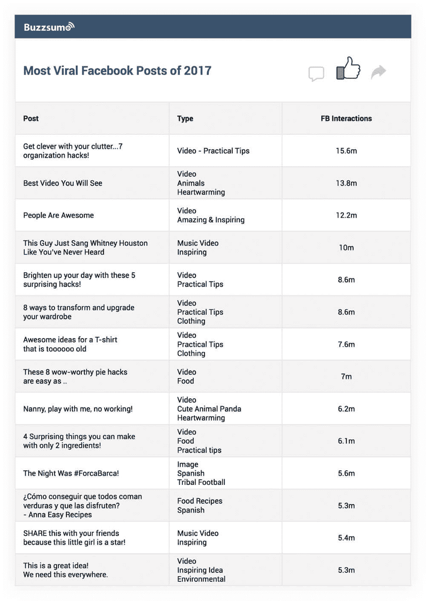

Facebook viral posts (Image source: [Buzzsumo](http://buzzsumo.com/blog/the-most-shared-facebook-content-posts-videos/#gs.2aKiNyQ))

如果你有一个精简的营销部门(或者即使只有你一个人)，视频内容有时会令人生畏。但是不要担心。有很多工具可以帮助你。三个值得一看的例子是:

*   wave . video–这款工具拥有 2 亿个视频、图像和音频文件库。它允许你上传自己的镜头，添加文字效果，视频滤镜和过渡。它还允许您立即将视频调整为 30 多种社交格式，包括方形格式、垂直 Instagram Story 格式和脸书封面。

[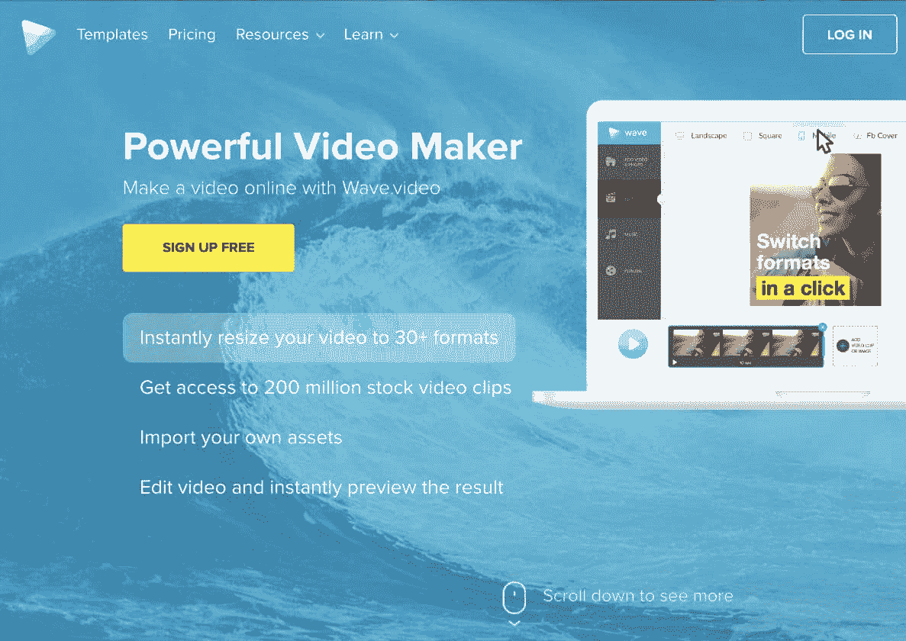](https://www.animatron.com/wave)

Wave.video

*   这个网站标榜自己是“世界上最简单的视频制作商”，老实说这是相当准确的。该工具允许你上传镜头，编辑，添加声音和过渡。这是一个制作可分享的社交媒体内容的伟大工具，甚至允许你直接从网站发布到你的社交频道。

[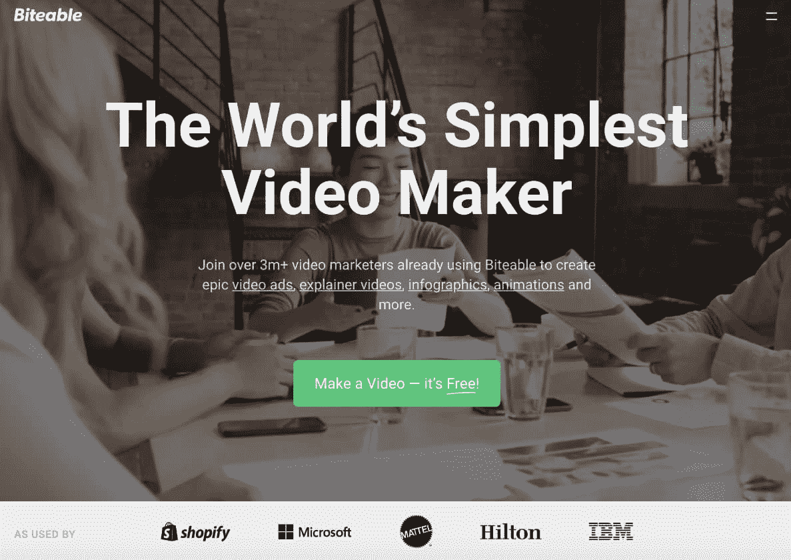](https://biteable.com/)

Biteable

*   这个工具使用人工智能为你轻松地组合视频。换句话说，你可以提供你希望出现在视频中的片段，软件会按照你喜欢的风格把它们放在一起。不需要编辑。

[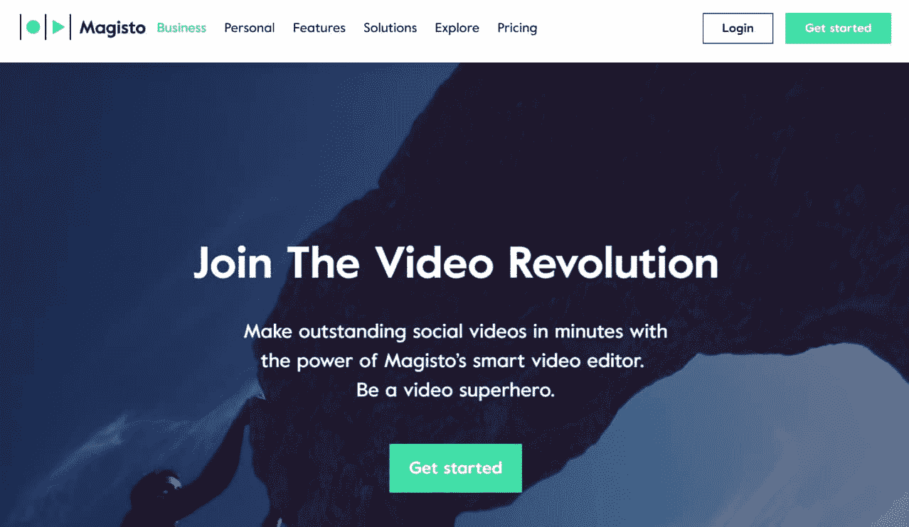](https://www.magisto.com/)

Magisto

## 3.在您的照片内容中标记您的产品

脸书现在允许商家在帖子上添加购物功能。该功能使浏览客户能够收集产品信息，甚至在点击出现在他们提要中的图像后购买产品。

你可以[给你的产品](https://www.engadget.com/2016/10/01/facebook-product-tagging-pages/)贴标签，就像你给平台上的人贴标签一样。寻找小购物袋图标。接下来，您将能够通过键入产品名称并从您的网站添加到产品页面的链接来标记您的产品。

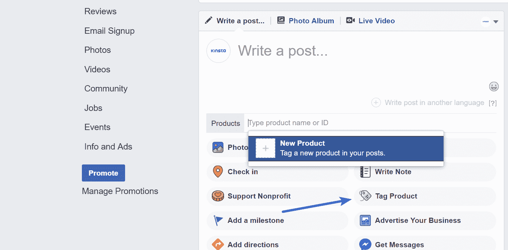

Facebook tag product

[Swell Water Bottle](https://www.facebook.com/SwellBottle/) 使用这个功能在他们的脸书页面上展示和销售他们的水瓶。在他们的许多帖子上，你会看到右上角弹出一个“点击查看详情”的横幅。

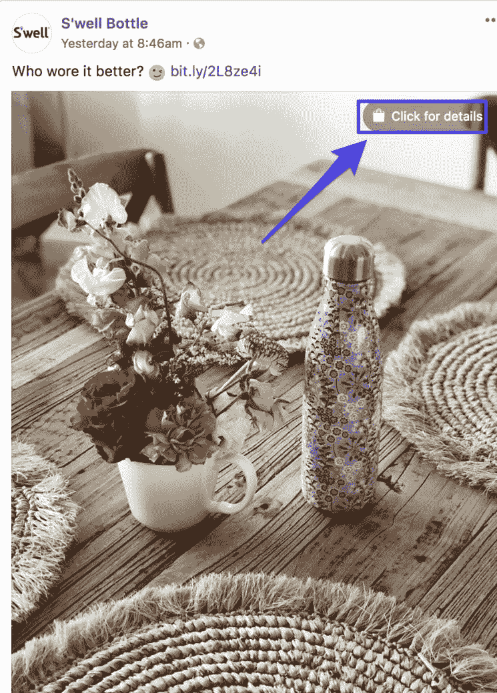

Facebook tag

点击标签后，链接到水瓶的产品页面打开，相关产品甚至显示在图片下方。

## 注册订阅时事通讯

### 想知道我们是怎么让流量增长超过 1000%的吗？

加入 20，000 多名获得我们每周时事通讯和内部消息的人的行列吧！

[Subscribe Now](#newsletter)

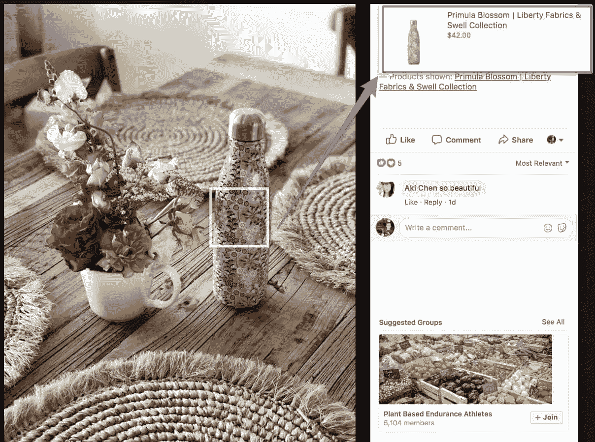

Facebook product

从那里，用户可以点击链接并被发送到 Swell 的在线商店购买产品。这是一个很好的推动购买的工具，因为它可以作为一个漏斗，将客户推向购买页面。这对于促成更多的购买尤其有价值，尤其是对于那些只是随便浏览你的页面的人。

## 4.支持、鼓励并参与客户评审

你的客户是你企业的命脉，他们往往有话要说。不管它是积极的还是消极的，它仍然给你一个机会让他们成为你品牌的热情大使。因此，在您的脸书页面上启用查看选项是非常重要的。

要启用您的评论选项卡，请单击“设置”，然后单击“编辑页面”

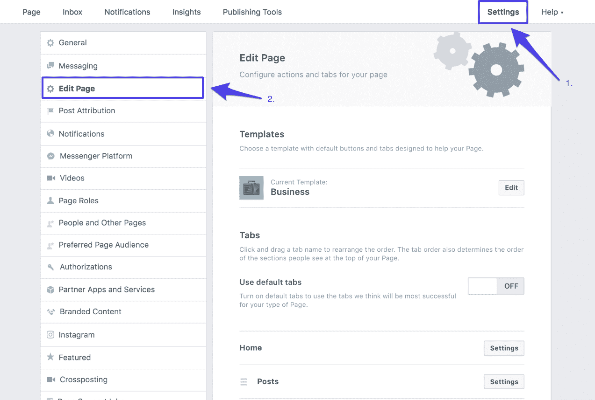

Facebook edit page

然后，向下滚动并选择“添加选项卡”

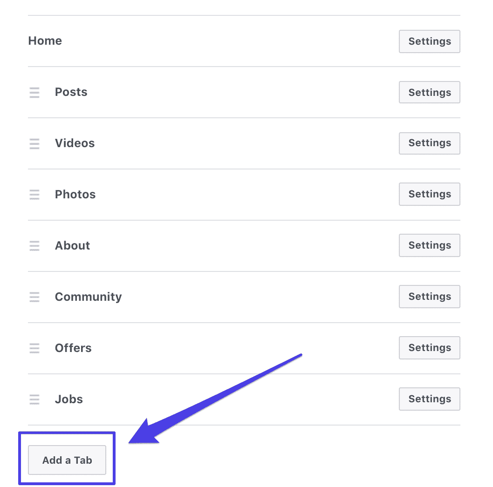

Facebook add a tab

最后，点击“评论”

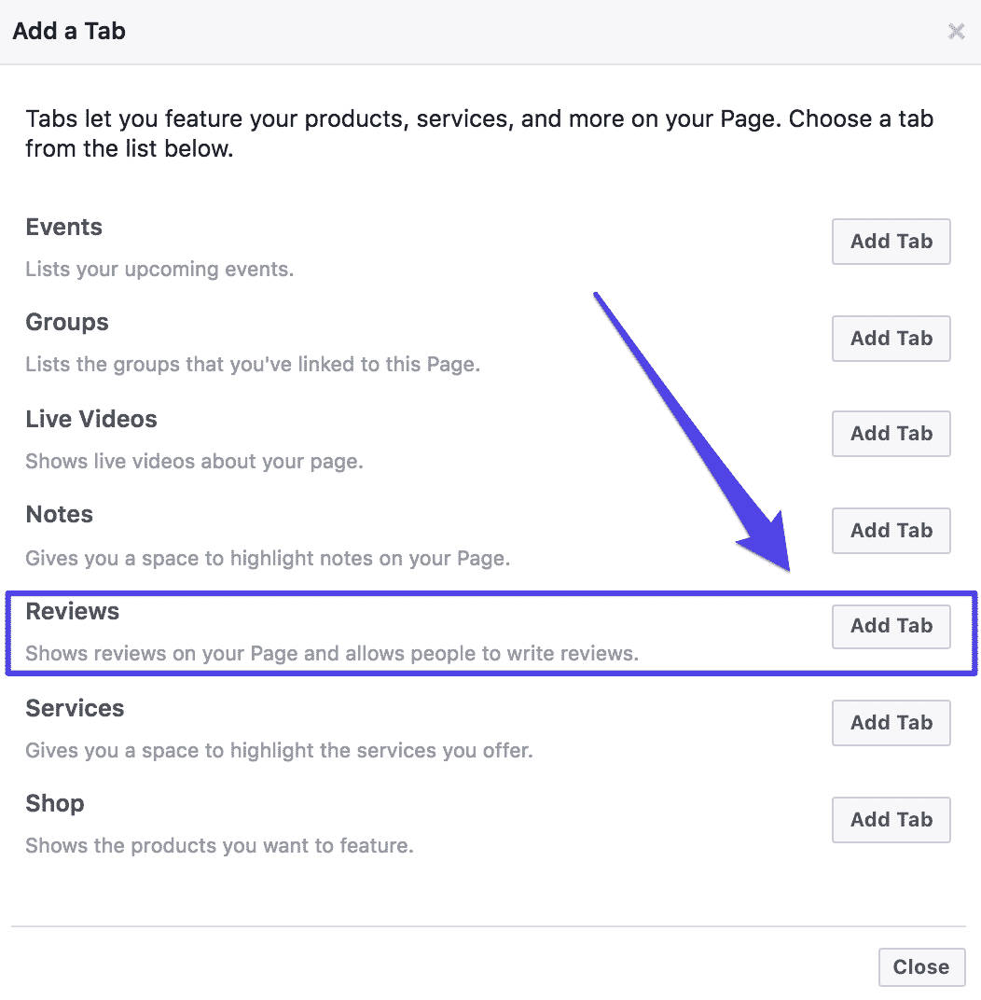

Facebook reviews tab

脸书页面上顾客评论的重要性怎么强调都不为过。2017 年[的一项调查发现](https://www.brightlocal.com/learn/local-consumer-review-survey/):

*   大约 85%的客户“像信任个人推荐一样信任在线评论。”
*   客户“在信任一家企业之前，平均要审查 7 次——高于去年的 6 次”
*   当品牌回复评论说“30%的人认为这是评判当地企业的关键因素”时，消费者会重视这一点

积极的评价可能是你的公司需要的认可。金斯塔尝试过我们的服务后，得到了大量的好评。😉

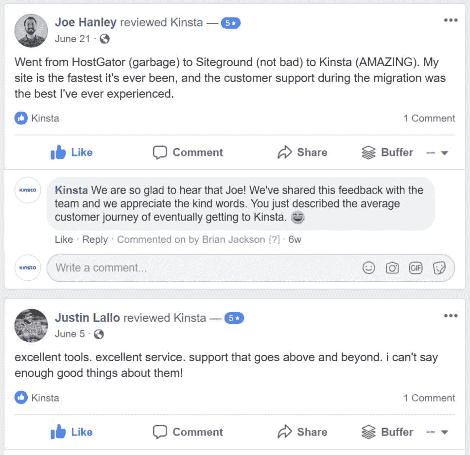

Kinsta reviews

然而，如果你得到的评价不是很正面，也不要担心。负面评论为企业提供了一个测试和展示其客户支持能力的机会。你可以花时间回应评论，并在你的观众面前纠正问题。

例如，当有人在非法蒸馏器中度过了一段不太愉快的时光时，他们会在公司的脸书页面上表达自己的担忧。非法仍然同情地回应，并努力解决这个问题。

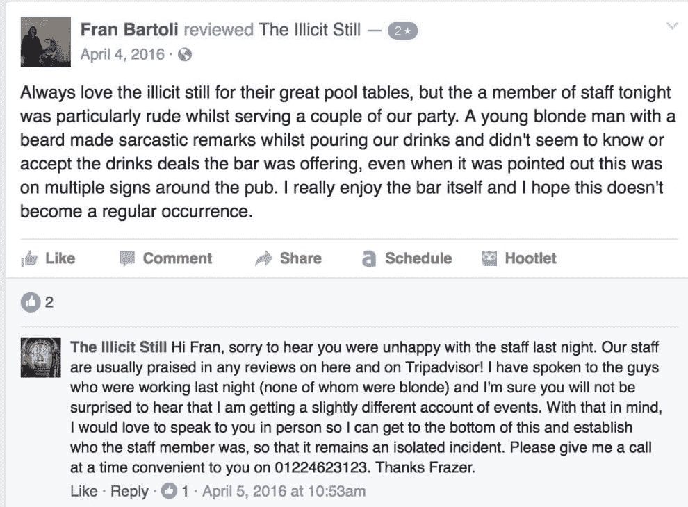

Facebook bad reviews (Image source: [AgoraPulse](https://www.agorapulse.com/blog/negative-reviews-facebook-page/))

评论可以为你的客户提供一个出口，让他们成为你最大的销售人员。确保您启用了该功能，这样就可以分享积极的(也可能有一些消极的)体验，这样您就可以与您的客户联系并扩大他们的影响。不要害怕让你的顾客给你留下反馈。

## 5.开展脸书广告活动

是时候让你的战略进入进攻模式，看看你如何通过[脸书的广告经理](https://www.facebook.com/business/products/ads)开展营销活动。你应该做的第一件事就是[在你的 WordPress 网站上获得脸书追踪像素](https://kinsta.com/blog/conversion-tracking/#fb-conversion-tracking)。这样你就可以开始建立一个已经访问过你的网站的观众群，你可以在以后重新定位他们。

脸书广告可能是获取新客户的一种有效且经济的方式。

例如，倭黑猩猩使用脸书广告，结果令人难以置信。在使用轮播广告开展活动后，Bonobos 实现了“3 倍的线下购买增长、2 倍的线下购买广告支出回报、**3 倍的网站购买增长**，以及 2 倍的网站购买广告支出回报。”

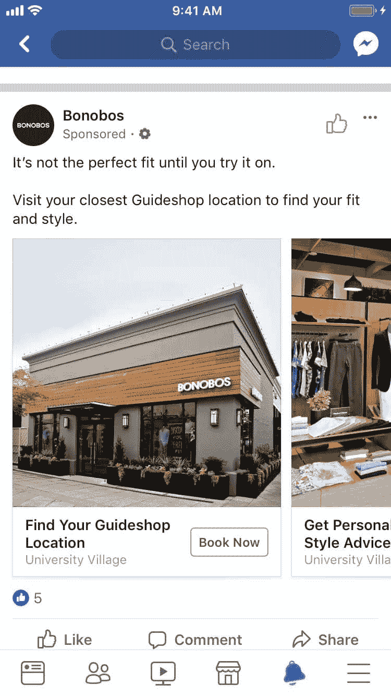

Facebook ad example

但让我们明确一点:脸书的广告活动不仅仅是宣传一个帖子。提升一个帖子只是给一个表现良好的帖子增加一点点，所以它会出现在更多人的订阅中。

Struggling with downtime and WordPress problems? Kinsta is the hosting solution designed to save you time! [Check out our features](https://kinsta.com/features/)

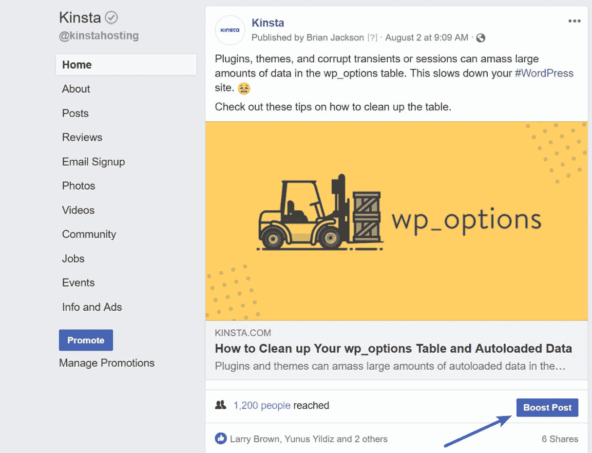

Facebook boost post

然而，脸书的广告活动要复杂得多，而且针对特定的人群。有许多不同类型的脸书广告:

*   域名广告:这些广告直接点击进入企业网站。

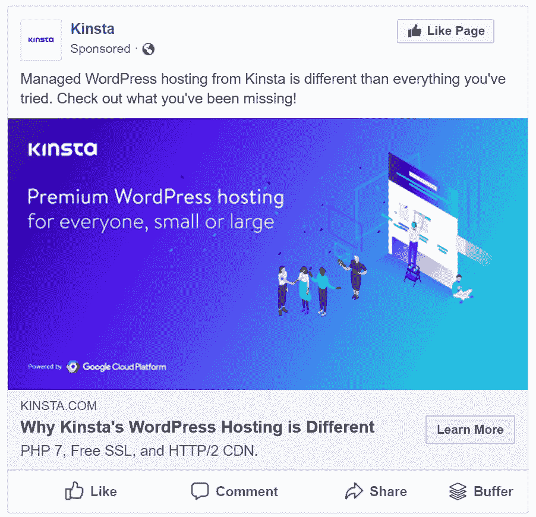

Facebook domain ad

*   **轮播广告:**如果你有多种产品要展示，或者想分享一个包含一系列图片的故事，这些广告会很棒。用户可以滚动浏览它们，因为广告会自然地出现在他们的提要中。

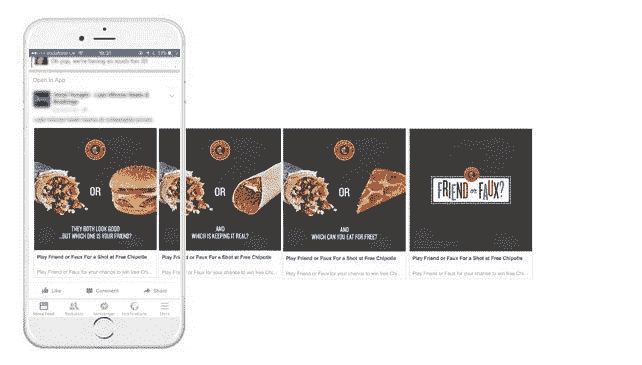

Facebook carousel ad (Image source: [Buffer](https://blog.bufferapp.com/facebook-carousel-ads))

*   **优惠广告:**这些广告允许您包含店内或在线优惠券，供客户兑换。

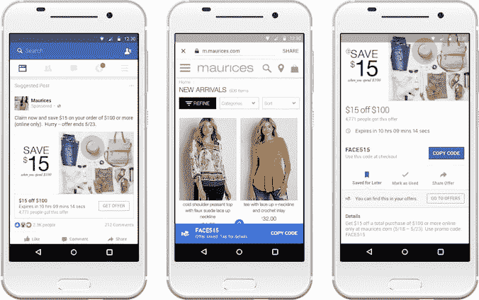

Facebook offer ad (Image source: [SEM Updates](http://www.semupdates.com/create-offer-ads-facebook-rule-holiday-sale/))

*   视频广告:这种类型的广告可以吸引刚刚浏览过它们的人的注意力。大多数人[不会在脸书](https://www.curalate.com/blog/facebook-videos-viewed-no-sound/)上开大音量看视频，所以确保你包括字幕以获得更深刻的效果。

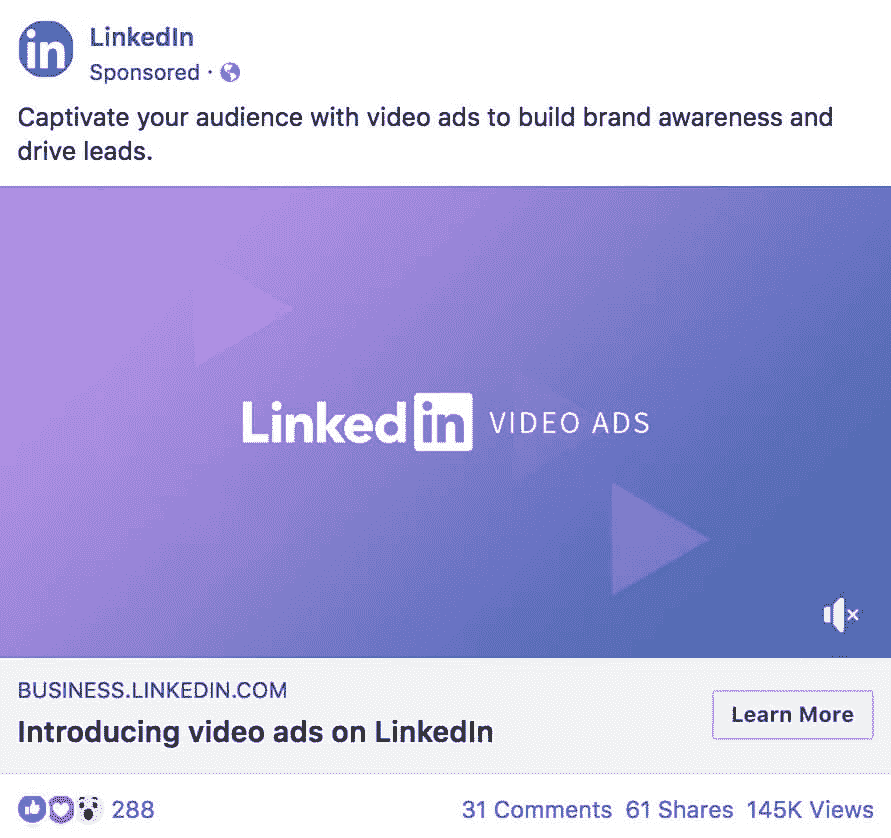

Facebook video ad

*   **销售线索广告:**这些广告非常适合快速获取销售线索信息，如姓名和电子邮件。

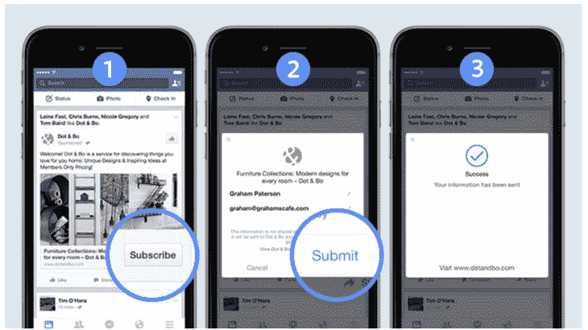

Facebook lead ads (Image source: [Wise Merchant](https://wisemerchant.com/))

*   Canvas: 这种类型的广告提供了令人惊叹的视频，在用户点击之后，它会在整个屏幕上展开。

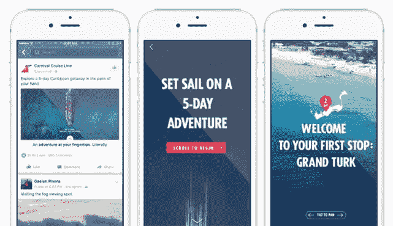

Facebook canvas ads (Image source: [Reshift Media](https://www.reshiftmedia.com/canvas-posts-facebook/))

*   **赞助提及:**这是一种很好的广告类型，会在用户的新闻提要中出现。

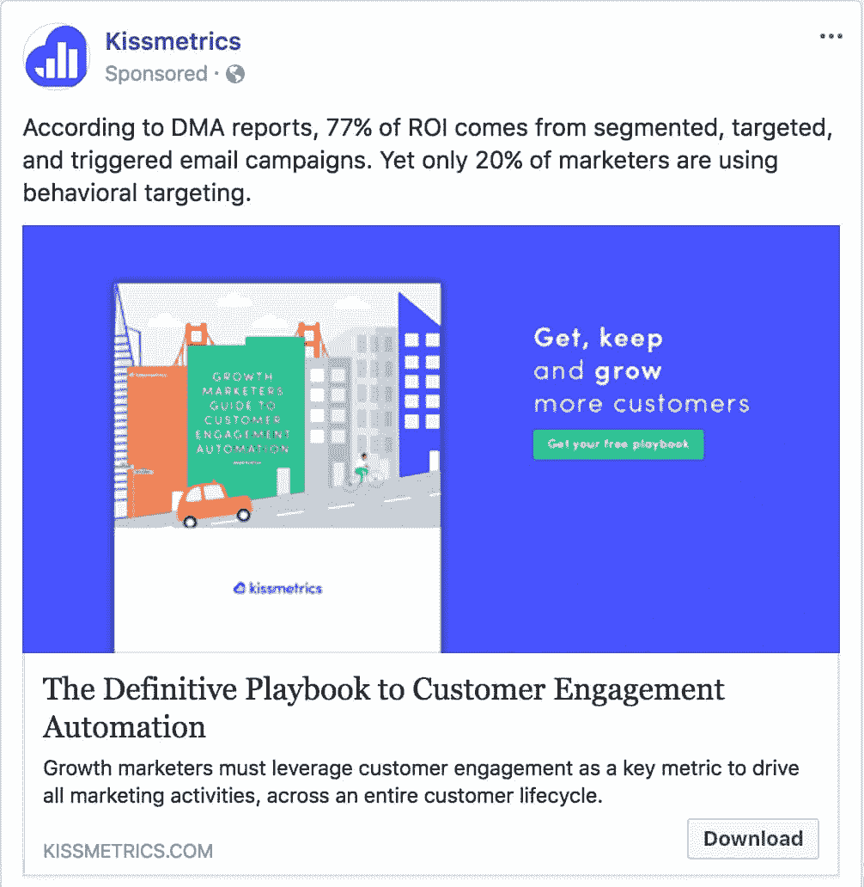

Facebook sponsored mention ad

*   **动态广告:**这些广告比轮播广告更进了一步，并且与你的产品相关联，这意味着如果它们缺货，它们将不再显示为可用。

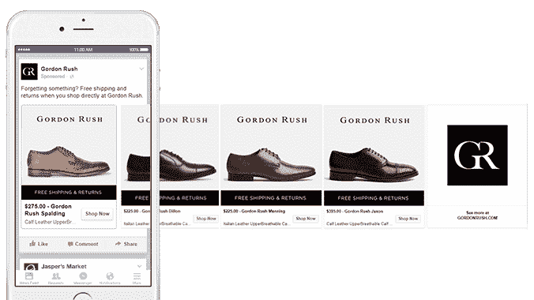

Facebook dynamic ad (Image source: [Mention](https://mention.com/blog/facebook-ads/))

广告对你来说可能是一个非常有价值的营销引擎，但你需要[持续监控和优化它们](https://www.bigcommerce.com/blog/social-media-advertising/)才能取得成功。设置广告时，请确保:

*   交替你的广告文案和设计。每个广告组中可以有多个广告，因此[执行 A/B 测试](https://wisemerchant.com/blog/build-a-million-brand-by-split-testing-facebook-ads/)并使用多个组。
*   利用长相相似的观众。如果你导入一个. csv 格式的客户电子邮件，脸书就可以锁定对你的产品或服务感兴趣的潜在客户。

要开展广告活动，从脸书的广告经理开始。登录后，您可以选择您的公司页面，然后输入您的页眉、正文、图形和网站。

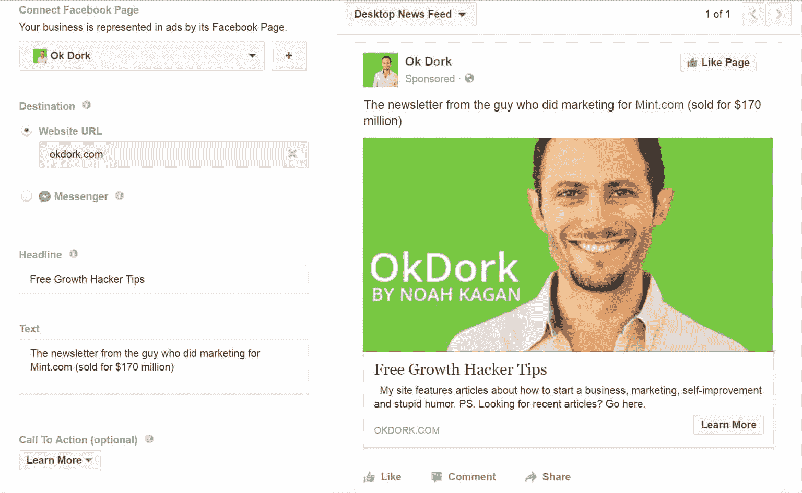

Facebook ad campaign (Image source: [OkDork](https://okdork.com/how-to-start-advertising-on-facebook/))

脸书广告是获得新客户和继续向已有客户营销的好方法。有了正确的广告文案和设计，你可以吸引和诱惑新客户与你的品牌互动。

## 6.利用您的脸书页面洞察力

在你的网站上实施了所有这些策略之后，你需要一种方法来评估什么是有效的，什么对你的业务来说可能是不值得的。也许你需要改变你的发布时间表，或者你需要投放更多有针对性的广告。

您可以在您企业的粉丝页面上的“洞察”选项卡中找到这些信息。这个工具对于你在即将到来的活动中如何分配时间和金钱做出明智的决定非常有价值。

您可以通过点击您企业的粉丝页面工具栏上的“洞察”选项卡来访问此功能。

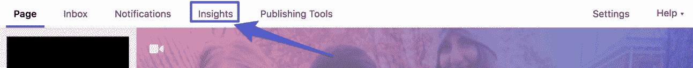

Facebook Insights

仪表板会打开一个“页面摘要”这为用户提供了一个快速、可理解的页面健康状况以及他们发布的活动或内容的快照。

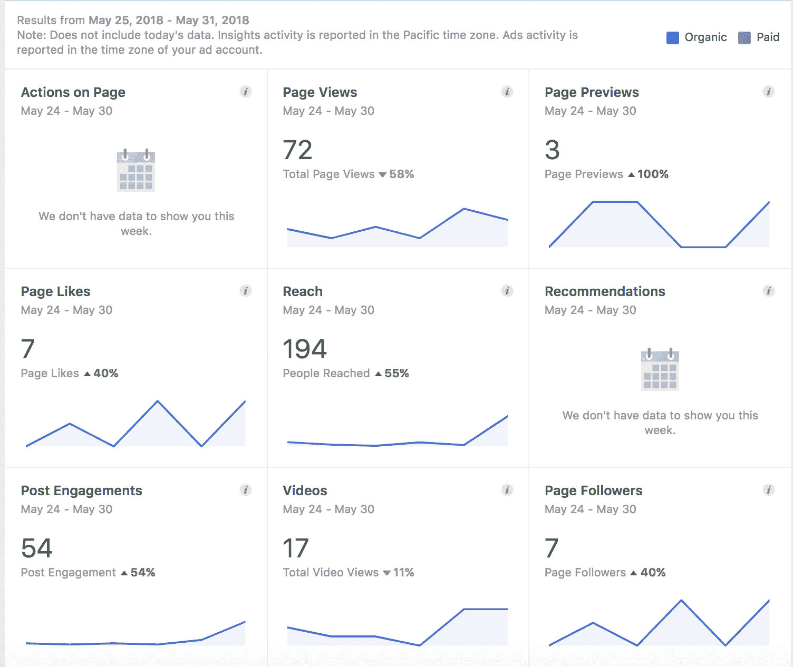

Facebook Insights page summary

“页面概要”选项卡上显示以下度量:

*   **页面上的操作**–这包括用户在公司页面上的所有操作(如分享、评论)。
*   **页面浏览量**–这是你的页面在一段时间内获得的浏览量。
*   页面预览–当有人将鼠标悬停在你的页面上，并且它出现在他们的新闻订阅源中时，这被认为是页面预览。
*   **页面点赞**——这是有人点击“点赞”来点赞你公司的脸书页面的次数。
*   **接触**——这是贵公司在脸书通过贵公司脸书页面上的帖子接触到的*独特*人的数量。
*   **帖子参与度**–这是您的所有帖子在一段时间内收到的互动总数。它包括你在公司的脸书页面上发表的所有帖子。
*   **视频浏览量**–您的视频的总浏览量。在[有人至少看了 3 秒钟](https://marketingland.com/whats-a-video-view-on-facebook-only-3-seconds-vs-30-at-youtube-128311)后才被认为是视图。
*   页面追随者-人们可以在你的脸书页面上选择加入或退出你的帖子，所以这个指标显示了你获得了多少页面追随者。

在那里，用户可以从左侧的菜单中选择各种选项，包括促销、关注者、喜欢、到达、页面查看、页面预览、页面上的操作、帖子、品牌内容、事件、视频、故事、人物和消息。

“页面上的操作”和“帖子”视图有助于评估哪些类型和主题的帖子表现良好。这有助于您集中精力使用新数据开展未来活动。

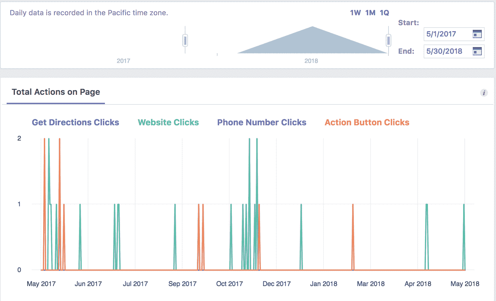

Facebook actions on page

“喜欢”页面是了解你获得了多少粉丝的好地方。这些图表提供了过去几年的历史情况，以显示所取得的进展。

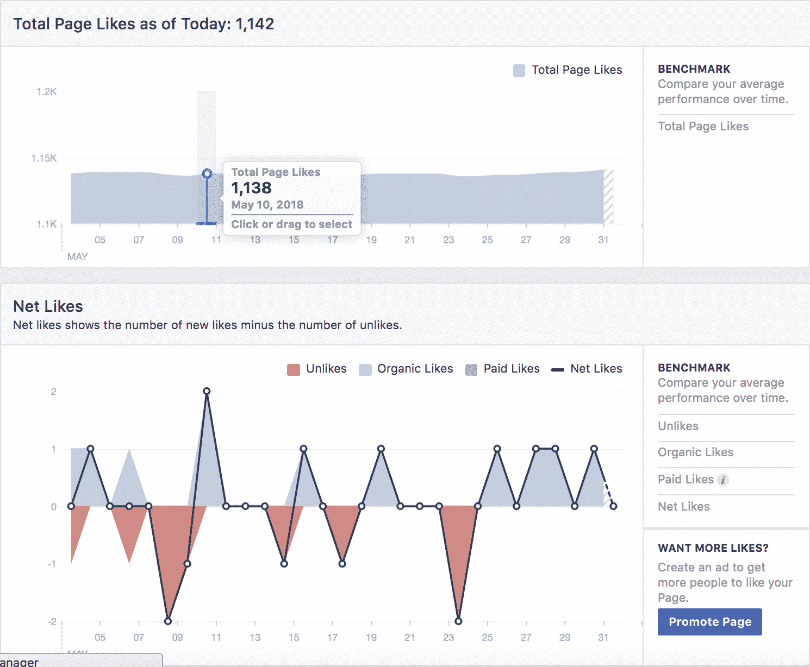

Facebook page likes

所有这些工具在评估、审计和设计你的脸书营销活动和编辑日历时都非常有用。

## 摘要

不可否认:你必须在脸书进行营销。尽管脸书最近犯了一些错误，但这个社交媒体巨头仍然屹立不倒。平台上有几十亿人。对你的数字营销努力来说，完全忽视它们将是一个错误。

要吸引这些人，首先要在脸书上建立自己的公司页面。这将作为您的“大本营”，为您的客户托管各种内容和行动要求。接下来，在你的页面上分享更新，并有一个定期的发布时间表。这将是吸引和发展你的追随者的好方法。

如果您销售实物产品，可以考虑使用“标记产品”功能。这将有助于您的客户在您的页面上获得更加顺畅的购买体验。管理您的客户评论并与客户互动。记住，负面评价给你提供了一个改正错误的机会。利用这一点，将愤怒的顾客转变为对你的品牌感到高兴的人。

此外，不要忘记定期检查使用你的品牌名称的虚假商业页面。你必须保护你的品牌形象，并确保潜在客户只看到你想让他们看到的东西。您可以在此了解更多:[如何以及为何提交脸书商标侵权报告。](https://kinsta.com/blog/trademark-infringement/)

通过脸书的广告活动瞄准新客户。回顾你在脸书洞察力方面的所有进展。这些数据将有助于你做出未来的营销决策，并找出目前哪些是有效的，哪些需要进一步调整。

什么样的脸书营销策略对你的企业有效？我们很乐意在下面的评论中听到他们的消息。

* * *

让你所有的[应用程序](https://kinsta.com/application-hosting/)、[数据库](https://kinsta.com/database-hosting/)和 [WordPress 网站](https://kinsta.com/wordpress-hosting/)在线并在一个屋檐下。我们功能丰富的高性能云平台包括:

*   在 MyKinsta 仪表盘中轻松设置和管理
*   24/7 专家支持
*   最好的谷歌云平台硬件和网络，由 Kubernetes 提供最大的可扩展性
*   面向速度和安全性的企业级 Cloudflare 集成
*   全球受众覆盖全球多达 35 个数据中心和 275 多个 pop

在第一个月使用托管的[应用程序或托管](https://kinsta.com/application-hosting/)的[数据库，您可以享受 20 美元的优惠，亲自测试一下。探索我们的](https://kinsta.com/database-hosting/)[计划](https://kinsta.com/plans/)或[与销售人员交谈](https://kinsta.com/contact-us/)以找到最适合您的方式。