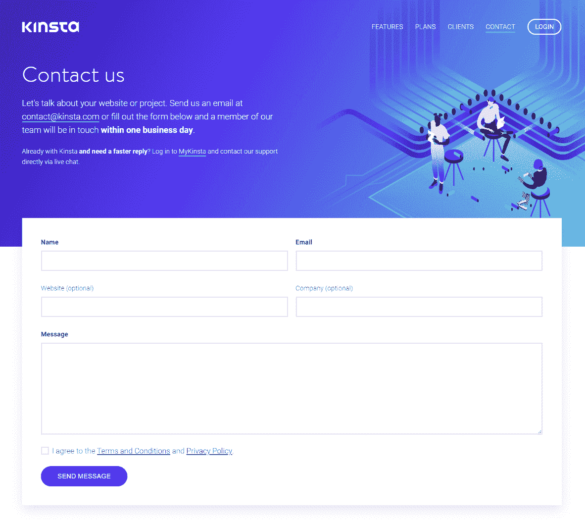
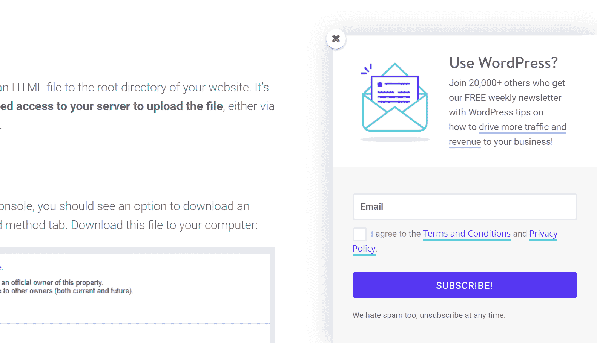
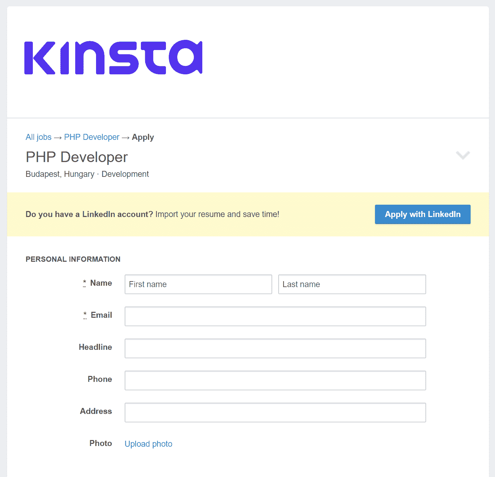
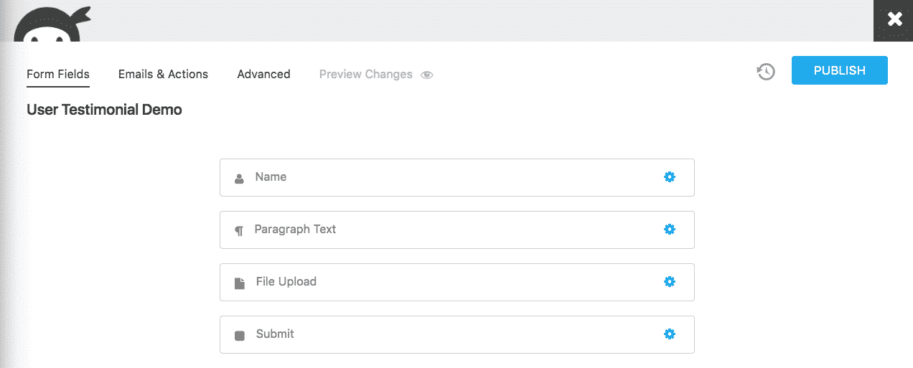
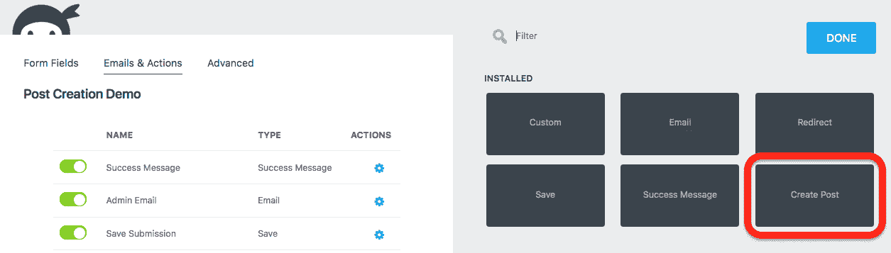

# 使用 WordPress 表单的 15 种有趣方式

> 原文：<https://kinsta.com/blog/wordpress-forms/>

你是否一直在尝试在你的 WordPress 网站上实现一些新的东西？很有可能这个列表中有你从未想过 WordPress 表单是完美的！

找不到适合工作的工具？甚至不确定什么是正确的工具？你上一次仔细研究你能用 WordPress 表单做什么是什么时候？您可能已经安装了所需的工具！

我们每天都有一百万次使用我们的 WordPress 网站。从确认新线索到接受工作申请，再到销售产品和接受捐赠，有成千上万的 WordPress 插件来完成这项任务。

对于其中的许多任务，可能有一个插件可以处理所有这些任务。WordPress 表单比大多数人意识到的要灵活得多。考虑到这一点，请和我们一起花几分钟时间来探索使用 WordPress 表单的 15 种有趣方式！

## 1.联系表格(比你想象的要多)

当然，联系表单绝对是表单插件最常见的用例。实际上每个人都有一个，但是你充分利用你的潜能了吗？很多没有！

Contact us form example

有时候，当你的客人伸出手时，可以等一等，但让他们等太久对生意不好。任何像样的联系表单插件都应该提供自动电子邮件通知，让你知道什么时候有人提交了你的联系表单。使用这些方法来确保你了解客人的需求。

其他提交更为紧急，可能需要立即采取行动。你的 WordPress forms 解决方案可以发送短信/文本通知，或者通过公司的渠道提醒你吗？找一个可以的，快点！建议阅读:[特雷罗 vs 阿萨纳](https://kinsta.com/blog/trello-vs-asana/)。

## 2.借助创意广告和 CTA 扩大您的订户名单

事实上，从 MailChimp 到 Constant Contact 的每一项简讯订阅服务都有股票表格供订阅访问者使用。它们有效，但事实是它们是有限的。设计、布局、美学、功能，它们都被“锁定”了，没有弹性。

一个专用的表单插件可以做的不仅仅是复制这些服务的股票注册表单的功能。使用创造性的技术，让你的订阅表格引起注意，让你所有的列表飞速增长。

CTA newsletter form

以下是您可以使用专用表单解决方案添加的内容示例:

*   形象
*   标题文本，带有行动要求
*   自定义字段的样式和布局
*   当用户与页面进行特定交互时，能够“弹出”

## 3.与您最喜欢的 CRM 服务集成

随着企业客户群的增长，客户关系管理成为一种实际需要。有大量出色的 CRM 服务，但从网站获取客户数据是许多人的一个痛点。

通过采用一个 WordPress forms 解决方案，并稳定、可靠地集成到您选择的 CRM 服务中，完全消除这种痛苦。在您的 CRM 内部工作通常会非常复杂…没有理由通过维护自定义集成或手动移动数据来增加负担。

许多 WordPress 表单解决方案与几乎所有最流行的 CRM 服务进行了本地集成。从 Salesforce 到 Zoho，从 Capsule 到 ConvertKit，您需要的东西就在那里。去找吧！一定要看看这些流行的 [WordPress CRM 解决方案](https://kinsta.com/blog/wordpress-crm/)。
T3】

## 4.获取客户对你的产品或服务的反馈

用户反馈是了解如何改进你的产品或服务的最佳指标之一。口碑会以这样或那样的方式慢慢反馈给你，但是如果你不积极倾听你的顾客，你就会错过巨大的发展机会。

鼓励定期的客户反馈，以告知您未来产品的方向。更重要的是，在任何市场中，简单地掌握付费客户的脉搏都是一个巨大的优势。

**使用表格收集客户反馈**简单明了，但是很有效。您的表格可以通过后续电子邮件链接或放在您网站的任何地方。当有新的反馈提交进来时，通知会让您跟上进度。甚至在您的反馈表单中应用一点条件逻辑，当您有不满意的用户时，通过 SMS/text 立即提醒您！

(建议阅读: [9 个收集用户反馈的强大 WordPress 调查插件](https://kinsta.com/blog/wordpress-survey-plugins/))。

## 5.预订和活动注册

在协调一项活动或安排时间段时，管理大量人员可能是一件非常痛苦的事情。从有组织开始，消除这些情况中固有的混乱！

WordPress 表单是允许用户注册和安排约会和事件的完美工具。限制提交的数量，封锁时间框架，甚至自动将数据填充到电子表格或您最喜欢的组织工具中。发送注册确认，触发自定义通知给特定的活动策划人，甚至直接从表单中收取费用。

更好的是，给你的客人一种方式来交流他们的需求，而不是用不相关的选项让他们超载。智能表单可以向注册人询问基本信息，并根据这些需求有条件地提供选项。永远不要再问素食者是否想要上等肋排；)

很明显，有很多 [WordPress 插件可以通过你的网站管理预订](https://kinsta.com/blog/wordpress-booking-plugins/)。
T3】

## 6.接受工作申请和相关文件

就像几年前移动设备的使用超过了台式机一样，大多数求职者在去游说书面申请之前都会上网寻找潜在的雇主。如果你没有利用这一点，你就错过了一大部分可雇佣的劳动力，也许还有你的下一个明星员工。

如果您希望收集简历、履历和其他相关的雇佣文档，表单为您提供了一种轻松接受上传文件的方式。您甚至可以将表单本身用作应用程序。如果需要的话，让用户注册，填写申请表，收集必要的文档……所有这些都使用 WordPress 表单。

Career form

这种方法的好处？使用表单计算和条件逻辑的组合(这听起来很复杂，但是使用正确的表单生成器非常简单)，您可以在填写表单时对申请人进行后台评分，并在特别合格的申请人提交时 ping 正确的人！

## 7.接受媒体文件，如照片、音频和视频记录

从教育到娱乐，再到文档，你有很多理由允许用户上传媒体文件到你的网站。WordPress 表单不仅使这变得简单，而且安全。

一个坚固的表单生成器插件应该允许你使用一个单独的字段来拖放一个媒体文件。它们还应该允许你通过扩展名、类型和其他因素来限制文件提交，以最大限度地减少垃圾提交。一个额外的功能是将这些文件直接上传到你选择的存储服务，如 Dropbox 或亚马逊 S3，这样你就不会开始耗尽服务器上的存储空间！

## 8.让客户留下评论并提交证明

社会证明是一个强有力的工具。大多数购买者在购买前都会阅读产品评论，看到其他人对产品的积极评价肯定会让犹豫不决的人倾向于购买。

## 注册订阅时事通讯

### 想知道我们是怎么让流量增长超过 1000%的吗？

加入 20，000 多名获得我们每周时事通讯和内部消息的人的行列吧！

[Subscribe Now](#newsletter)

正确的表单构建工具将具有您需要的功能，允许用户在您的产品页面上留下评论。星级评分领域是必须的，正确的形式建设者应该有一个股票期权。您还可以调节这些，并使用条件逻辑和通知的组合来提醒您低评论，以便您可以跟进！

User testimonial demo

推荐通常比简单的评论要复杂一点，但是你也可以用一个表格很容易地做到这一点。允许用户上传图片以增加真实性，选择您希望他们在网站上显示的位置，并在他们上线前审核/批准他们。这是你可以设置一次机制，然后几乎忘记的事情！

## 9.接受捐赠

许多人不会把表格和赚钱的手段联系在一起，但他们实际上擅长这项工作。轻松地将您的表单与许多支付网关集成，如 [Paypal 或 Stripe](https://kinsta.com/blog/stripe-vs-paypal/) 。它比一个简单的 Paypal 按钮更专业，让你更好地控制整个过程。

就像联系方式比简单的电子邮件联系方式更有利于收集提交者的信息一样，捐赠方式也是如此。您甚至可以通过与 Recurly 或 Stripe 等订阅服务集成来设置定期固定捐赠。

我们还建议查看 [Give 表单集成](https://givewp.com/addons/)。

用方形代替？查看我们的深度对比博文:[条纹 vs 方形](https://kinsta.com/blog/stripe-vs-square/)。

## 10.出售产品或收取服务费用

形式不限于一次性(或经常性)捐赠或简单地收取一次性付款。有各种各样的商业 WordPress 店面插件，如 [WooCommerce](https://kinsta.com/blog/woocommerce-tutorial/) ，但是这些插件通常比你所需要的要多得多，也更复杂。

如果你想要的只是一种接受订单和处理付款的方式，WordPress 表单是一种完美的设置方式，不需要完全商业化插件的复杂性。但是，您不能牺牲灵活性！您仍然可以创建漂亮的产品页面，包括图片和各种产品选项。只需与 Stripe 或 PayPal 等支付网关服务集成即可！

最重要的是，设置定期订阅计划非常简单，查看我们关于 [WooCommerce 订阅](https://kinsta.com/blog/woocommerce-subscriptions/)的深入指南。选择合适的表单构建器，您就可以轻松集成可靠的订阅管理服务！

## 11.从表单中填充物理或数字文档

是否有纸质文档或特定格式的 pdf、Word 文档等。你需要按照特定的格式填写吗？你认为你不能通过网络表单来管理它吗？再想想！

Struggling with downtime and WordPress problems? Kinsta is the hosting solution designed to save you time! [Check out our features](https://kinsta.com/features/)

使用与 [WebMerge 服务](https://www.webmerge.me/)集成的表单，您可以填充任何预先格式化的文档，并将其发送给联系人或保留作为您的记录。只需扫描和/或上传该文档到 Webmerge，将表单域映射到需要填写的文档的特定部分，并使该表单对您的用户可用。

最终结果？表单提交会自动填充您精心格式化的文档，它已经准备好了。这是一个非常特殊的用例，但是对于任何有特殊记录需求的人都非常有用！

## 12.允许用户在不访问仪表板的情况下向 WordPress 发布他们自己的内容

通常，为了在 WordPress 中创建帖子，用户必须登录并拥有相关的用户角色权限。这并不总是理想的。例如，让高中生登录你的网站，发布他们自己的研究项目，可能会很快出问题！

幸运的是，如果你有这样的需求，你可以用你的 WordPress 表单相对容易地完成它。如果您使用具有前端发布功能的表单构建器，用户可以通过 web 表单创建帖子。这些帖子会按照您预先定义的方式进行分类和标记，然后发送给您进行审核(如果您愿意)。一旦你批准了它们，它们就出现在你的网站上，就像是在文章编辑器中创建的一样。

Front-end post creation

这一个的额外用例:前端发布对于用户生成的推荐非常有用！

## 13.小测验！

你是哪个星球大战角色？如果你是《老友记》中的角色，你会是谁？不要表现得好像你以前从来没有用过一样:)…事实是，如果你想让它们成为营销手段，它们是一个有效的小花招，或者只是一个简单、有趣的方法，让人们与你互动。

Star Wars quiz (Img src: [Zimbio](http://www.zimbio.com/quiz/Ukldm8Pi5Ub/Star+Wars+Character))

这些很容易用任何有计算能力的 WordPress 表单解决方案来构建。为不同的答案分配计算值，然后在测验结束时根据他们的“分数”有条件地显示成功消息。

这个系统的应用方式比小测验多得多，而且大多数表单生成器也可以很容易地用其他方式构建小测验。想要更严肃的应用？参见#14！

## 14.领导资格

并非所有的销售线索都是平等的！新的潜在客户可能对您的组织有广泛的价值。对于任何销售团队来说，能够从第一次接触中获得对潜在客户价值的可靠估计，以便设定优先级，这是非常有用的。这可以通过一个表单来完成。

类似于我们 13 号的测验，表格中应用的计算和条件逻辑的结合使之成为可能。提出引导性问题，为每个问题赋值，计算总分，每个新提交的问题都有一个合格分数。

使用资格分数有条件地将高质量的销售线索通知给合适的人员。制作定制的成功消息和/或电子邮件通知进行回复。你的想象力是极限！

## 15.在 WordPress 中注册和管理用户

WordPress 自己的用户注册程序非常简单。许多专用的用户注册插件非常复杂，需要学习很多东西。如何达成一个快乐的中间点？

使用正确的表单生成器，您可以通过表单方便地注册和管理用户。让他们注册，登录，甚至更新自己的个人资料与图像，生物文本，等等！

## 额外收获:选择你自己的冒险故事！

所以，是的，这是一个难以置信的小众，但它是一个完美的例子，说明你的想象力真的是你可以使用的形式的天花板。

不久前，我们的支持团队遇到了一个用户，他使用条件逻辑、多部分表单和自由使用下拉字段的组合，用一个表单创建了一个“选择自己的冒险”故事。她使用文本字段在每个表单部分讲述一个故事，然后通过下拉字段询问学生下一步想做什么。根据学生的选择，他们会被送到不同的地方继续这个故事。

多棒啊。这就引出了一个问题…

## 你的 WordPress 表单不能做什么？

老实说，有很多事情是你无法用 web 表单来做的。但是你可以做很多你从未想过的事情。这篇文章甚至还没有开始把它们全部列出来！

要有创意！表单是我们的业务，相信我们，甚至我们也会对用户每天想出的巧妙用法感到惊讶。在你离开之前，我们谦卑地建议你看一下 [Ninja Forms](https://ninjaforms.com/) ，这是 WordPress.org 最受欢迎的 WordPress 表单解决方案，看看你能把你的新表单生成器聪明地用在什么地方。我们上面列出的一切仅仅是冰山一角！😀

* * *

让你所有的[应用程序](https://kinsta.com/application-hosting/)、[数据库](https://kinsta.com/database-hosting/)和 [WordPress 网站](https://kinsta.com/wordpress-hosting/)在线并在一个屋檐下。我们功能丰富的高性能云平台包括:

*   在 MyKinsta 仪表盘中轻松设置和管理
*   24/7 专家支持
*   最好的谷歌云平台硬件和网络，由 Kubernetes 提供最大的可扩展性
*   面向速度和安全性的企业级 Cloudflare 集成
*   全球受众覆盖全球多达 35 个数据中心和 275 多个 pop

在第一个月使用托管的[应用程序或托管](https://kinsta.com/application-hosting/)的[数据库，您可以享受 20 美元的优惠，亲自测试一下。探索我们的](https://kinsta.com/database-hosting/)[计划](https://kinsta.com/plans/)或[与销售人员交谈](https://kinsta.com/contact-us/)以找到最适合您的方式。