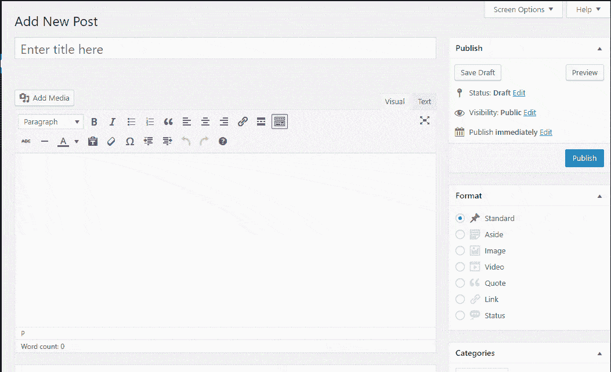
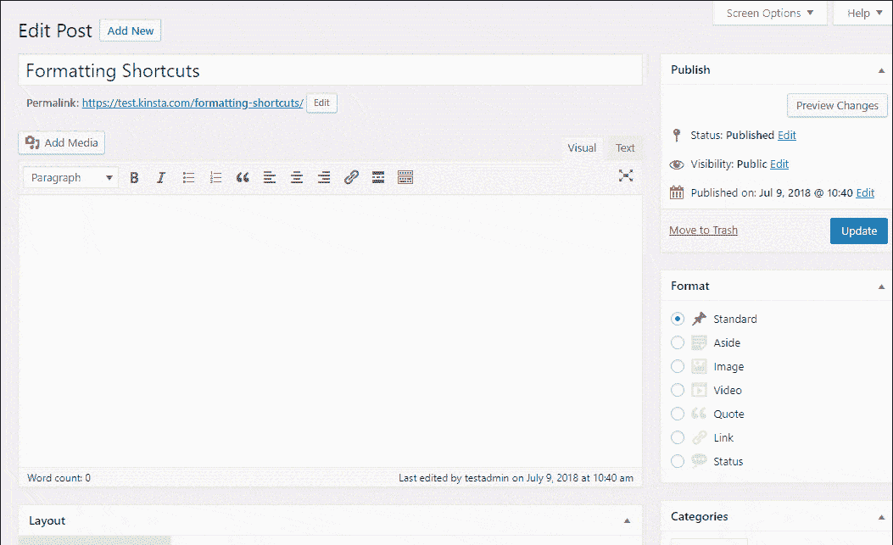
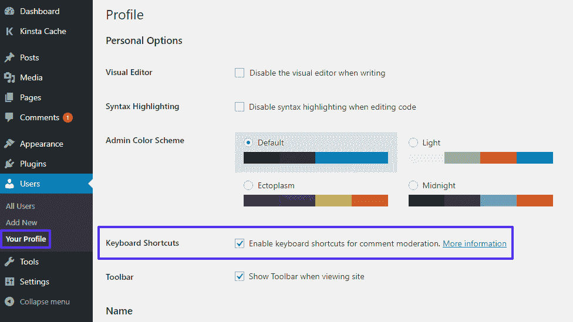
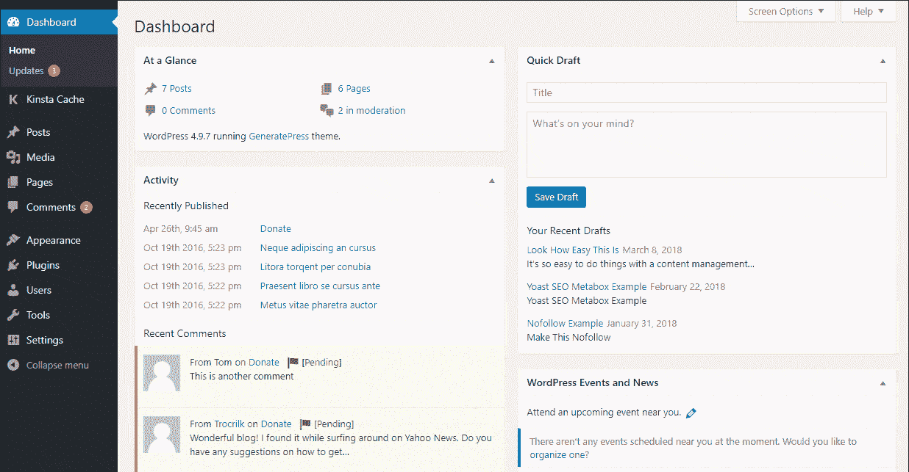
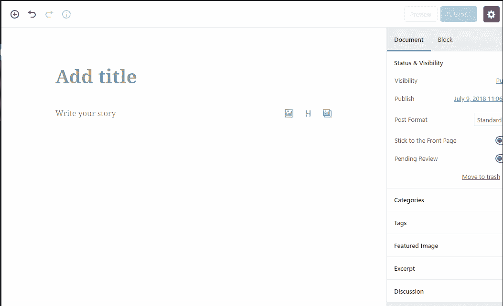

# 用于写作的 65+ WordPress 键盘快捷键，Gutenberg +更多

> 原文：<https://kinsta.com/blog/wordpress-keyboard-shortcuts/>

这看起来并不需要很长时间，但是每次你需要将手从键盘上移开来使用鼠标时，都会有一小段时间被浪费掉。经过一整天的工作，这些时间可以累积起来！这就是 WordPress 键盘快捷键的用处。👍我们每天都使用这些来加速我们的写作流程。

WordPress 键盘快捷键可以让你的手保持在键盘上，而不会失去选择文本，添加格式，甚至是调整评论部分的能力！

为了帮助你在你的 WordPress 站点上工作时尽可能的高效，我们把我们知道的每一个 WordPress 键盘快捷键都放在了一起。

在这篇文章结束时，你会知道大量的 WordPress 键盘快捷键来帮助你更有效地创建内容和管理评论。

尽管[古腾堡编辑器](https://kinsta.com/blog/gutenberg-wordpress-editor/)仍处于测试阶段，我们仍然收集了一些古腾堡特有的快捷方式，让你为 WordPress 5.0 做好准备。

*   用于 WordPress 编辑器的键盘快捷键
*   [WordPress 格式快捷键](#wordpress-formatting-shortcuts)
*   用于审核评论的快捷键
*   古腾堡的快捷键
*   [创建你自己的 WordPress 键盘快捷键](#create-wordpress-keyboard-shortcuts)

## WordPress 编辑器的键盘快捷键

当你在 [WordPress 编辑器](https://kinsta.com/blog/wordpress-text-editor/)中创建内容时，这些键盘快捷键可以帮助你节省时间。

你在日常生活中使用的许多键盘快捷键也可以在使用 WordPress 编辑器时派上用场。其中一些你可能已经很熟悉了——但如果不是，你会很快爱上它们的！

除了一般的快捷方式，还有一些你可以应用的 WordPress 特有的快捷方式。

> 需要在这里大声喊出来。Kinsta 太神奇了，我用它做我的个人网站。支持是迅速和杰出的，他们的服务器是 WordPress 最快的。
> 
> <footer class="wp-block-kinsta-client-quote__footer">
> 
> 
> 
> <cite class="wp-block-kinsta-client-quote__cite">Phillip Stemann</cite></footer>

[View plans](https://kinsta.com/plans/)

### 用于选择文本的 Windows 键盘快捷键

这些 Windows 快捷键可以帮助您在编辑器中选择文本，而无需离开键盘:

*   **CTRL+A**–选择所有文本
*   **Shift +左/右**–向右/左选择一个字母
*   **CTRL + Shift +右/左**–向右/左选择一个单词
*   **CTRL + Shift +上/下**–选择上/下一行
*   **Shift+Home**–选择所有文本，直到当前行的开头
*   **Shift+End**–选择所有文本，直到当前行结束

### 用于选择文本的 Mac 键盘快捷键

这些 Mac 快捷键可以帮助您在编辑器中选择文本，而无需离开键盘:

*   **Cmd+A**–选择所有文本
*   **Shift +左/右**–向右/左选择一个字母
*   **Cmd + Shift +右/左**–向右/左选择一个单词
*   **Cmd + Shift +上/下**–选择上/下一行
*   **Shift+Home**–选择所有文本，直到当前行的开头
*   **Shift+End**–选择所有文本，直到当前行结束

### 操作选定文本的 Windows 键盘快捷键

选择一些文本后，您可以使用这些 Windows 快捷键来操作它或应用格式:

*   **CTRL+C**–复制选中的文本
*   **CTRL+X**–剪切选中的文本
*   **CTRL+V**–粘贴选中的文本
*   **CTRL+Shift+V**–粘贴选中的文本**而不**任何格式
*   **CTRL+B**–粗体
*   **CTRL+I**–斜体
*   **CTRL+U**–下划线
*   **CTRL+K**–插入链接
*   **ALT+Shift+L**–左对齐
*   **ALT+Shift+R**–右对齐
*   **ALT+Shift+J**–两端对齐
*   **ALT+Shift+C**–居中对齐
*   **ALT+Shift+D**–应用删除线
*   **ALT+Shift+A**–插入链接的另一种方式
*   **ALT+Shift+O**–开始一个有序列表
*   **ALT+Shift+U**–开始一个无序列表
*   **ALT+Shift+S**–删除链接
*   **ALT+Shift+Q**–创建报价
*   **ALT+Shift+X**–添加代码标签

### 操作所选文本的 Mac 键盘快捷键

选择一些文本后，您可以使用这些 Mac 快捷键来操作它或应用格式:

*   **Cmd+C**–复制所选文本
*   **Cmd+X**–剪切所选文本
*   **Cmd+V**–粘贴所选文本
*   **Cmd+Shift+V**–粘贴选中的文本**而不**任何格式
*   **Cmd+B**–粗体
*   **Cmd+I**–斜体
*   **Cmd+U**–下划线
*   **Cmd+K**–插入链接
*   **Option+CTRL+L**–左对齐
*   **Option+CTRL+R**–右对齐
*   **Option+CTRL+J**–两端对齐
*   **Option+CTRL+C**–居中对齐
*   **Option+CTRL+D**–应用删除线
*   **Option+CTRL+A**-插入链接的另一种方式
*   **Option+CTRL+O**–启动一个有序列表
*   **Option+CTRL+U**–启动一个无序列表
*   **Option+CTRL+S**–删除链接
*   **Option+CTRL+Q**–创建报价
*   **Option+CTRL+X**–添加代码标签

### 其他 Windows WordPress 编辑器键盘快捷键

这些窗口快捷方式可能不会选择文本或应用格式，但它们仍然非常方便！

*   **CTRL + Z** – Undo
*   **CTRL+Y**–重做
*   **ALT+Shift+M**–打开**添加媒体**屏幕
*   **ALT+Shift+W**–启用无干扰书写模式
*   **ALT+Shift+T**–插入更多标签
*   **ALT+Shift+P**–插入一个分页符
*   **ALT+Shift+H**–打开帮助屏幕
*   **ALT+Shift+Z**–扩展 WordPress 编辑器格式栏
*   **Shift+Enter**–在编辑器中向下移动一行，不插入换行符。

### 其他 Mac WordPress 编辑器键盘快捷键

这些窗口快捷方式可能不会选择文本或应用格式，但它们仍然非常方便！

*   **Cmd+Z**–撤销
*   **Cmd+Y**–重做
*   **Option+CTRL+M**–打开**添加媒体**屏幕
*   **Option+CTRL+W**–启用无干扰书写模式
*   **Option+CTRL+T**–插入更多标签
*   **Option+CTRL+P**–插入一个分页符
*   **Option+CTRL+H**–打开帮助屏幕
*   **Option+CTRL+Z**–展开 WordPress 编辑器格式栏
*   **Shift+Enter**–在编辑器中向下移动一行，不插入换行符。

### 键盘快捷键的作用

下面是一些实际使用的键盘快捷键的例子。我们用的是 Windows。作为参考，我是:

*   键入一些文本
*   使用 **CTRL + Shift + Left** 选择最后一个单词
*   点击 **CTRL + B** 将其加粗
*   使用 **ALT + Shift + R** 来右对齐所有内容
*   使用 **CTRL + Z** 来撤销这两个动作

Example of WordPress Keyboard shortcuts in action

## WordPress 格式快捷键

格式化快捷键不完全是键盘快捷键。但是最终的结果是一样的，作为上面一些快捷键的替代，它们非常方便。

## 注册订阅时事通讯

### 想知道我们是怎么让流量增长超过 1000%的吗？

加入 20，000 多名获得我们每周时事通讯和内部消息的人的行列吧！

[Subscribe Now](#newsletter)

格式快捷方式是 WordPress 4.3 的一个功能，帮助你自动添加格式:

*   有序或无序列表
*   标题
*   引用
*   水平线

对于列表和标题之类的东西，格式化快捷键的主要优点是，它们不需要你像上面的键盘快捷键一样同时敲击那么多的键。

不像上面的键盘快捷键，你可以通过在 WordPress 编辑器中输入一些东西来激活格式快捷键。您必须使用**可视**选项卡，这些快捷键才能工作。

当前的格式快捷方式如下。注意，您需要在输入任何快捷键后点击**空格**或有时**回车**来应用格式:

*   *****–开始一个无序列表
*   **1。**–开始一个有序列表
*   **# #**–应用 H2 格式
*   **# # #**–应用 H3 格式(继续该模式以应用到 H6 格式)
*   **>**–创建块引用
*   **—**—创建一条水平线

下面是一个使用格式快捷键的例子:

An example of formatting shortcuts in action

## 审核评论的快捷键

除了编辑内容，WordPress 还包括内置的快捷方式来帮助你调节评论。

默认情况下，这些快捷键**被禁用**。但是您只需几秒钟就可以启用它们:

*   在你的 WordPress 仪表盘中进入**用户→你的个人资料**。
*   勾选**键盘快捷键**到**旁边的复选框，启用评论审核的键盘快捷键**。
*   保存您的更改。

How to enable comment shortcuts

然后，你可以在 WordPress 仪表盘的**评论**标签中使用这些快捷方式。

Struggling with downtime and WordPress problems? Kinsta is the hosting solution designed to save you time! [Check out our features](https://kinsta.com/features/)

首先，您有一组快捷方式用于**选择注释**(当前选择的注释将有一个蓝色高亮显示):

*   **J**–向下移动当前选择(*如果你在页面的底部，它也会跳到下一页)*
*   **K**–向上移动当前选择
*   **X**–添加复选标记(*这有助于执行批量操作*
*   **Shift+X**–打开或关闭**所有**注释的复选标记

选择一个或多个批注后，您可以使用另一组快捷键来执行操作:

*   **A**–批准评论
*   **S**–将[评论标记为垃圾邮件](https://kinsta.com/blog/wordpress-spam-comments/)
*   **D**–删除注释
*   **Z**–从回收站中恢复评论
*   **U**–取消批准评论
*   开始回复评论
*   **Q**–打开快速编辑屏幕编辑评论
*   **E**–打开完整的编辑屏幕

如果您选择了多个注释，您也可以使用 **Shift +** 这些之前的命令对多个[注释](https://kinsta.com/blog/wordpress-comment-plugins/)执行操作。例如:

*   **Shift+A**–批准所有选中的评论
*   **Shift+S**–将所有选中的评论标记为垃圾邮件
*   等等。

这是一个实际应用的例子。在这张 GIF 中，我:

*   加载**注释**屏幕
*   点击 **J** 选择第一条评论
*   点击 **S** 将其标记为垃圾邮件

An example of comment shortcuts in action

## 古腾堡的键盘快捷键

因为 Gutenberg 仍然处于测试阶段，所以随着 Gutenberg 变得更加定型，这一部分将来肯定会有所发展。

但是现在，这里有一些简单的方法可以让你在新的古腾堡编辑器中加速内容的创建…

注意–这些是古腾堡特有的键盘快捷键。**但是当前编辑器中的许多通用键盘快捷键也可以使用**:

*   **/**–如果您键入斜线，您可以通过名称快速插入块
*   **CTRL+Shift+ALT+M**–(Windows)切换到代码编辑器(如果已经在代码编辑器中，则返回到代码编辑器)
*   **Cmd+Shift+ALT+M**–(Mac)切换到代码编辑器(如果您已经在代码编辑器中，则返回到代码块编辑器)
*   **输入**–创建一个新块。这有助于结合上面的 **/** 快捷键快速插入多个块

下面是这些键盘快捷键的一个例子:

An example of using Gutenberg-specific shortcuts

## 创建你自己的 WordPress 键盘快捷键

如果以上所有的键盘快捷键对你来说还不够，你可以使用像 [AutoHotkey](https://autohotkey.com/) 这样的程序创建你自己的工作流专用键盘快捷键。

如果你不得不在你的 WordPress 站点上执行任何重复的操作，而这些操作没有被上面的快捷键覆盖，AutoHotkey 可以让你很容易的设置脚本和宏来提高你的工作效率。需要更简单的吗？检查[短工](https://cedeq.com/shortkeeper/en)。

## 知道任何其他有用的键盘快捷键吗？

虽然记住所有这些快捷方式可能需要一些时间，但一旦它们成为你肌肉记忆的一部分，这确实是一种更有效的工作方式。

是的——当你努力记住哪个快捷方式有什么作用时，一开始会有点困难。但是过了一会儿，这种延迟就会消失，你的工作效率就会提高。

现在轮到你了——知道任何其他有用的键盘快捷键吗？请在评论中告诉我们！

* * *

让你所有的[应用程序](https://kinsta.com/application-hosting/)、[数据库](https://kinsta.com/database-hosting/)和 [WordPress 网站](https://kinsta.com/wordpress-hosting/)在线并在一个屋檐下。我们功能丰富的高性能云平台包括:

*   在 MyKinsta 仪表盘中轻松设置和管理
*   24/7 专家支持
*   最好的谷歌云平台硬件和网络，由 Kubernetes 提供最大的可扩展性
*   面向速度和安全性的企业级 Cloudflare 集成
*   全球受众覆盖全球多达 35 个数据中心和 275 多个 pop

在第一个月使用托管的[应用程序或托管](https://kinsta.com/application-hosting/)的[数据库，您可以享受 20 美元的优惠，亲自测试一下。探索我们的](https://kinsta.com/database-hosting/)[计划](https://kinsta.com/plans/)或[与销售人员交谈](https://kinsta.com/contact-us/)以找到最适合您的方式。