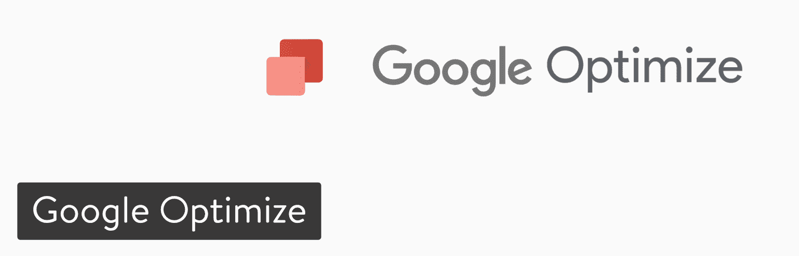
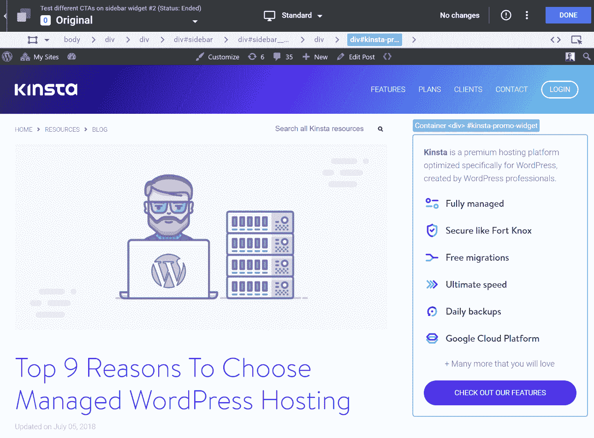
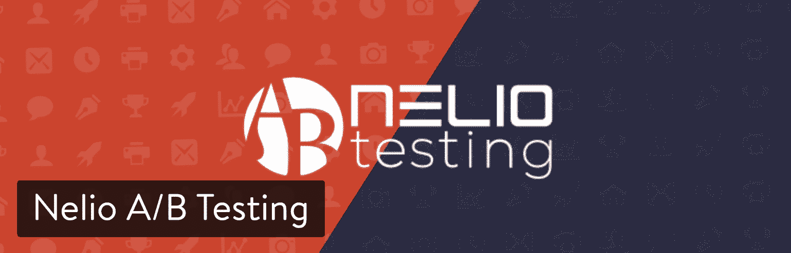
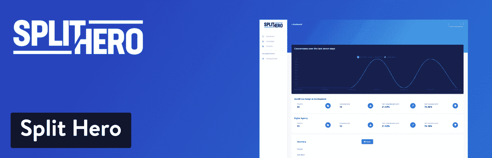
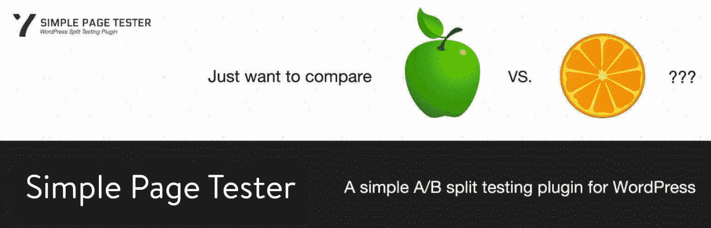
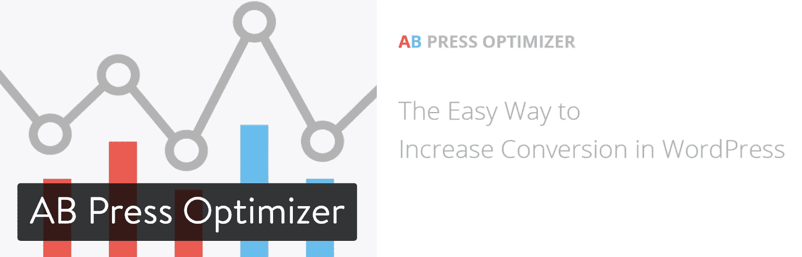
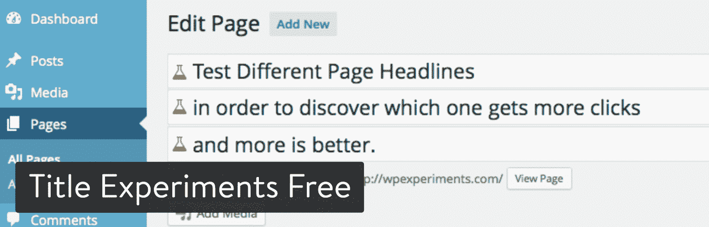
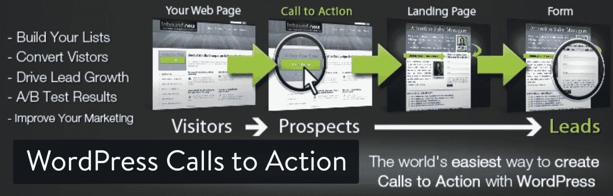

# 优化转化率的 10 个最佳 WordPress A/B 测试工具

> 原文：<https://kinsta.com/blog/wordpress-ab-testing-tools/>

你的 WordPress 网站上的一切都会对你的转化率产生影响。有些东西可能只起了很小的作用，而其他的东西可能会让你的销售大幅飙升。因此，你应该计划一路测试你网站上的每一个元素。当然，有有效和无效的方法来测试和衡量他们的成功。但是在我们深入到一些我们推荐的最好的 WordPress A/B 测试工具之前，让我们讨论一下测试你的网页的重要性，以及为什么它会带来更好的转化率。

*   [什么是 A/B 测试？](#what-is-ab-testing)
*   你能在你的 WordPress 网站上做什么样的测试？
*   [最佳 WordPress A/B 测试工具](#best-wordpress-ab-testing-tools)
*   [附加 A/B 测试工具](#additional-ab-testing-tools)

## 什么是 A/B 测试？

成功的 web 开发人员依赖于两种测试。 **A/B 测试**，也称为分割测试，在面对面的场景中让两页元素相互竞争，告诉你读者对哪个元素的反应更大。例如，如果你想测试一个标题，你可以设计两个相同的网页，分别使用不同的标题，并将流量导向每个网页，看看哪个标题能带来更多的页面浏览量、停留时间、更高的转化率等等。

A/B split testing

另一种在网络营销人员中流行的测试是多元测试。**多元测试**允许你比较和测试同一页面的多种变化，看看用户对哪个页面的反应更积极。这是一个很好的测试方法，但是，它在缩小您想要测试的最佳特定页面元素的范围方面有所限制。

要了解网站访问者对网页上特定元素的反应，A/B 测试更有效。多变量测试可以告诉您哪个版本的网页更有效，但是要测试网页上的单个元素，A/B 测试是首选方法，因为它允许您深入到每个特定的页面元素，并确定哪个版本最适合您的读者，并将更多流量转化为销售额。回报是 A/B 测试通常是一个漫长的过程，但这是因为它为您想要测试的元素提供了最彻底和最准确的结果。

[没有所谓的 A/B 测试，这是一个永无止境的过程。👍 点击推文](https://twitter.com/intent/tweet?url=https%3A%2F%2Fkinsta.com%2Fblog%2Fwordpress-ab-testing-tools%2F&via=kinsta&text=There%27s+no+such+thing+as+being+done+with+A%2FB+testing%2C+it%27s+a+never-ending+process.+%F0%9F%91%8D&hashtags=CRO%2CABtesting)

## 你能在你的 WordPress 站点上进行什么样的拆分测试？

由于 A/B 测试是两种方法中更准确的一种，你应该计划实施一种策略，允许你测试你的网站和每个网页上的每个元素。为了有效地做到这一点，隔离每个元素并分别测试它们。这个想法是挑选同一个页面元素的两个版本，并对它们进行测试，看看哪一个在增加页面浏览量、[转换率](https://kinsta.com/blog/conversions-woocommerce-product-pages/)和其他重要指标方面最有效。

从你的**头**开始。取两个标题，将它们与 A/B 测试进行比较，看哪一个得到的结果更好。

**页脚和侧边栏**可以用同样的方式测试。例如，如果您想知道是三列页脚还是四列页脚更适合站点访问者，那么可以运行 A/B 测试，将每个页脚都作为一部分受众的样本。你的边栏也是一样。你可以测试你的观众对两个侧边栏和一个侧边栏的反应，或者测试两个不同的单侧边栏布局中哪一个最有效。

你可以运行的另一个站点范围的测试包括 [**颜色方案**](https://kinsta.com/blog/website-color-schemes/) 。缩小主题范围后，选择两种配色方案并进行测试，看看哪种更受欢迎。

您可以测试的其他内容包括:

*   页面标题
*   [选择加入表格](https://kinsta.com/blog/wordpress-lead-generation/)
*   图形元素
*   内容
*   副标题
*   页面布局
*   行动呼吁
*   小工具
*   主题或登陆页面(如果你需要一些帮助，比如如何用 WordPress 插件快速创建登陆页面，我们发布了一个详细的教程)

仔细想想，A/B 测试的可能性真的是无穷无尽的。🤓这是令人兴奋的部分。但这也意味着你应该一直测试。

## 2019 年最佳 WordPress A/B 测试工具

WordPress 拥有令人难以置信的 A/B 测试工具。这些工具中的许多都是插件或服务，您可以立即安装并开始使用。大多数都很容易使用，所以你不需要任何技术技能。如果你能安装 WordPress 并做一些轻微的修改，那么你可以使用这些 WordPress 工具在你的网站上运行有效的 A/B 测试。

下面的一些工具测试特定的网页元素，而其他的是通用的测试工具。其中一些是不言自明的，而其他的则是基于开发者的声誉推荐的。注意:**确保用你的缓存**(无论是服务器级缓存还是[缓存插件](https://kinsta.com/blog/wordpress-caching-plugins/))测试 A/B 测试解决方案。

1.  [谷歌优化](#google-optimize)
2.  [内利奥 A/B 测试](#nelio-ab-testing)
3.  [分裂英雄](#split-hero)
4.  [茁壮成长标题优化器](#thrive-headline-optimizer)
5.  [简单页面测试器](#simple-page-tester)
6.  [A/B 压力优化器](#ab-press-optimizer)
7.  [标题实验](#title-expirements)
8.  [WordPress 行动号召](#wordpress-calls-to-action)
9.  [WordPress 登录页面](#wordpress-landing-pages)
10.  [营销优化器](#marketing-optimizer)

### 1.谷歌优化

Google Optimize ，以前叫做 Google Content Experiments，是一个来自 Google 的非常棒的二次开发工具！这是现在与[谷歌分析](https://kinsta.com/blog/how-to-use-google-analytics/)整合，非常容易使用，非常强大。最棒的是，它完全免费可以同时进行 5 个实验。这对你们大多数人来说可能已经足够了。优化 360 提供高级版本。查看一下[谷歌优化和优化 360](https://support.google.com/optimize/answer/7084762?hl=en) 的区别。我们在 Kinsta 使用免费版本的 Google Optimize，非常喜欢它！

Google Optimize

没有 WordPress 插件，但是你所要做的就是在你网站的标题中插入一段代码。我们使用它的一个很好的例子是在我们的 WordPress 工具条上测试不同的副本。更改副本，将按钮与不同的 UTM 参数和事件挂钩，然后在 Google Optimize 中启动 A/B 测试。然后，我们可以跟踪哪个侧边栏小部件转换得更多，点击得也更多。

更好的是，它自动与谷歌分析捆绑在一起，所以你可以直接将其与你的目标挂钩。相当酷！Google Optimize 绝对是我们目前最喜欢的 A/B 测试工具。

A/B testing with Google Optimize

基本上，你的 WordPress 站点上的任何 HTML 或 CSS 元素都可以在 Google Optimize 中轻松更改。关于如何在你的 WordPress 网站上设置它以及我们如何使用它的详细信息，请看我们的详细指南:[如何免费使用 Google Optimize 在 WordPress 中进行 A/B 测试](https://kinsta.com/blog/google-optimize/)。

### 2.内利奥 A/B 测试

内利奥 A/B 测试是 WordPress 最强大最通用的转换优化服务。它帮助您定义、管理和跟踪 A/B 测试实验，并结合强大而美丽的热图。内利奥也兼容 WooCommerce。永远不要离开 WordPress，你可以在你的管理面板上做任何事情。

Nelio A/B Testing WordPress plugin

基本计划是 29 美元/月。还有专业级服务，每月 89 美元，非常适合小型企业。最后，企业级计划 259 美元/月。价格昂贵，但你可以在多达 10 个网站上使用它，你可以安排你的实验，还有其他很酷的功能，如自动停止实验。按年计费可以在这些价格上节省一点。

如果你在寻找一个能和 WordPress 很好集成的工具，内利奥 A/B 测试将是我们的首选。

### 3.分裂英雄

Split Hero 是一个简单的、用户友好的 A/B 测试工具。它主要是针对自由职业者，机构和他们的客户，虽然它也是完美的 DIY 网站建设者期待把他们的网站推向下一步。

## 注册订阅时事通讯

### 想知道我们是怎么让流量增长超过 1000%的吗？

加入 20，000 多名获得我们每周时事通讯和内部消息的人的行列吧！

[Subscribe Now](#newsletter)

Split Hero A/B Testing WordPress plugin

你所要做的就是选择一个你想测试的页面的 4 个变体，再加上转换页面，例如，一个联系表感谢页面，然后输入活动运行日期，你就可以做了。

与更复杂的工具相比，Split Hero 更注重保持简单，只为用户提供他们需要的数据，以便您采取行动。

因为 Split Hero 的工作是基于你在 WordPress 中的任何页面/文章，你可以继续用你喜欢的方式构建你的页面，包括使用你选择的任何页面构建器。

结合简单的理念，Split Hero 只提供 1 个简单的客户计划，价格非常合理，每月 27 美元。这包括它在无限的网页浏览量和无限的访问者以及所有当前和即将推出的功能无限的网站上的使用。唯一的限制是您一次最多可以同时运行 3 个活动，但是如果您需要，可以以每个月 5 美元的价格购买额外的活动。

对于那些准备开始为他们自己或他们的客户进行分割测试的人和机构所有者来说，Split Hero 是一个很好的选择。

### 4.Thrive 标题优化器

[Thrive Headline Optimizer](https://thrivethemes.com/headlineoptimizer/) 是提高点击率、内容浏览时间和滚动时间的绝佳解决方案。这是一个高级插件，一个网站一年 67 美元起。它与 WooCommerce 完全兼容，你可以把它设置为自动驾驶。设置您自己的自动赢家设置，以获得更好的点击率和走开。

Thrive Headline Optimizer WordPress plugin

就像内利奥一样，它与 WordPress 有着非常紧密的集成，并且得到了开发者的良好支持。

### 5.简单页面测试器

简单页面测试器是一个名副其实的插件。它可以免费升级，费用是 59 美元。它的搜索引擎友好，支持缓存解决方案，并与谷歌分析兼容。

Simple Page Tester WordPress plugin

通过高级升级，您可以对自定义帖子类型、短代码、[转换跟踪](https://kinsta.com/blog/conversion-tracking/)、 [WooCommerce 集成](https://kinsta.com/blog/woocommerce-tutorial/)进行测试，并获得一年的电子邮件支持。

Struggling with downtime and WordPress problems? Kinsta is the hosting solution designed to save you time! [Check out our features](https://kinsta.com/features/)

### 6.AB 压力优化器

[AB Press Optimizer](https://abpressoptimizer.com/) 让您快速轻松地创建数十种不同版本的图像、按钮、内容块、表格和标题。这个 WordPress 插件的个人版本允许你花 49 美元在一个网站上安装它。花 99 美元，你可以测试三个网站。该机构计划提供 199 美元的无限制现场测试。每一级服务都为无限数量的访问者提供无限数量的实验。您可以通过专家功能和支持获得实时报告。

AB Press Optimizer WordPress plugin

使用短代码测试你的主题、文章、页面和自定义文章类型。易于使用和安装。这对于分开测试 WordPress 小部件和不同的广告来看哪个有更好的点击率也是很棒的。

### 7.免费实验

[题目实验](https://wordpress.org/plugins/wp-experiments-free/)很基础，但是做一件事，并且做好。测试您的图书，发现哪些图书可以获得更高的免费点击率。有一个 19.99 美元/年的高级版本，允许你测试多种功能图像，详细的统计数据，甚至自动实验冻结。

 

标题实验免费 WordPress 插件

### 8.WordPress 行动号召

除了标题，行动号召是转化优化最重要的页面元素之一。 [WordPress 的行动号召](https://wordpress.org/plugins/cta/)插件可以让你测试你的链接、社交媒体按钮、文件下载，并设置行动号召模板。这个免费插件也将帮助你跟踪转化率和运行多元测试。

WordPress Calls to Action plugin

### 9.WordPress 登录页面

WordPress 登录页面插件由 WordPress 行动号召的开发者创建。您可以在登录页面上运行分割测试，而不是在登录页面上测试单个元素。定制模板，跟踪转化率，如果您想一次测试多个元素，甚至可以运行多元测试。这个免费插件有一个可视化编辑器，预先填充你的表单，并允许你克隆你的页面。

WordPress Landing Pages plugin

你可以购买额外的附加组件来进一步扩展这个插件。

### 10.营销优化器

[营销优化器](https://wordpress.org/plugins/marketing-optimizer/)插件是完全免费的，允许你 A/B 测试一切，从覆盖图、CTA、登陆页、标题、页面布局、图像、按钮样式等等。他们甚至包括一堆免费的模板，你可以开箱即用。它也完全兼容流行的缓存插件和使用[服务器级缓存](https://kinsta.com/blog/wordpress-cache/)的 WordPress 主机。

Marketing Optimizer WordPress plugin

## 附加 A/B 测试工具

这里有几个额外的 A/B 测试工具，可能不像上面的一些工具那样与 WordPress 紧密集成，但仍然值得一提。其中一些类似于 Google Optimize，让你直接在页面上编辑 HTML 和 CSS 元素。但是，它们的实现和使用也需要更高的学习曲线。并且定价明显多于上面提到的解决方案。

*   [优化地](https://wordpress.org/plugins/optimizely-x/)

*   [热罐](https://www.hotjar.com/)

## 摘要

如果你想让你的 WordPress 网站将访问者转化为客户，那么 A/B 测试你的网页元素是必不可少的。这包括[标题](https://kinsta.com/blog/headline-analyzer/)、图片、选择加入表格、内容、页面布局以及任何可能阻碍你销售的东西。记住，A/B 测试是一个永无止境的过程。

我们错过了什么吗？你在你的站点和页面上试过哪些其他的 WordPress A/B 测试工具？希望在下面的评论中听到你的想法。

* * *

让你所有的[应用程序](https://kinsta.com/application-hosting/)、[数据库](https://kinsta.com/database-hosting/)和 [WordPress 网站](https://kinsta.com/wordpress-hosting/)在线并在一个屋檐下。我们功能丰富的高性能云平台包括:

*   在 MyKinsta 仪表盘中轻松设置和管理
*   24/7 专家支持
*   最好的谷歌云平台硬件和网络，由 Kubernetes 提供最大的可扩展性
*   面向速度和安全性的企业级 Cloudflare 集成
*   全球受众覆盖全球多达 35 个数据中心和 275 多个 pop

在第一个月使用托管的[应用程序或托管](https://kinsta.com/application-hosting/)的[数据库，您可以享受 20 美元的优惠，亲自测试一下。探索我们的](https://kinsta.com/database-hosting/)[计划](https://kinsta.com/plans/)或[与销售人员交谈](https://kinsta.com/contact-us/)以找到最适合您的方式。