# WP 工作管理器——一个神奇的 WordPress 工作板插件

> 原文：<https://kinsta.com/blog/wordpress-job-board-plugin/>

如今，越来越多的人开始上网找工作。为什么不通过把你的网站变成一个功能齐全的求职板来挖掘不断增长的在线人才库呢？这是把需要人才的人和有技能的人联系起来的最佳方式。

今天我们想向你展示如何使用 [WP 工作管理器](https://wordpress.org/plugins/wp-job-manager/)，一个神奇的免费 WordPress 工作板插件，轻松地将任何 WordPress 网站变成工作板。完美的公司 WordPress 网站，人力资源部门，或工作目录列表网站。

WP 作业管理器有令人印象深刻的 100，000+活跃安装，4.5 或 5 星评级，目前由 Automattic 的 awesome 团队维护和开发。准备好学习了吗？那我们就直入主题吧。

*   [WP 作业管理器入门](#getting-started-wp-job-manager)
*   [配置 WP 作业管理器](#configuring-wp-job-manager)
*   [发布工作](#posting-job)
*   [求职](#applying-for-jobs)
*   [管理工作列表](#managing-job-listings)
*   [WP 作业管理器小工具](#wp-job-manager-widgets)
*   [WP 作业管理器高级附加组件](#wp-job-manager-premium-add-ons)

## WP 作业管理器入门

你可以从 WordPress 目录下载免费的 [WP 作业管理器](https://wordpress.org/plugins/wp-job-manager/)插件，或者在“插件 *→* 添加新插件”下搜索“WP 作业管理器”点击“立即安装”,然后激活它。

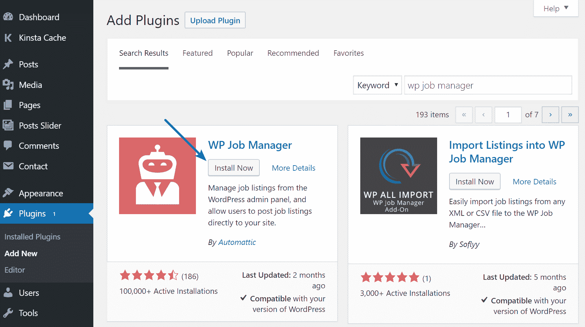

Install WP Job Manager plugin

为了帮助首次用户，WP 作业管理器支持一个神奇的快速安装向导。该向导是一个分三步走的过程，所以一定要坚持到底。

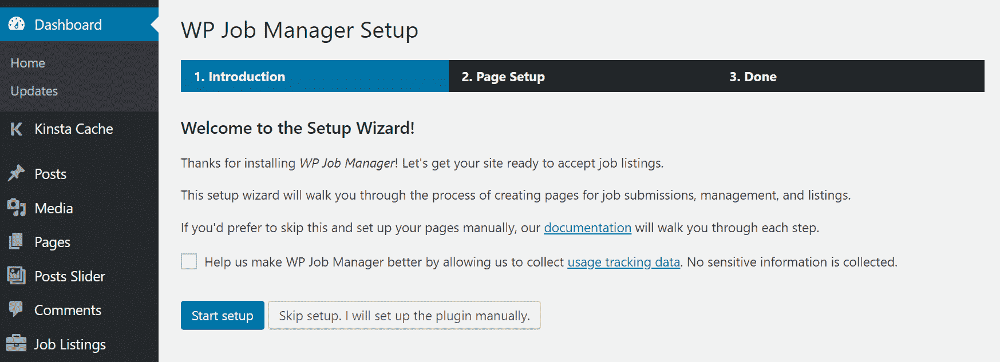

WP Job Board setup

向导会自动添加您的职务公告板需要的三个页面:

> 需要在这里大声喊出来。Kinsta 太神奇了，我用它做我的个人网站。支持是迅速和杰出的，他们的服务器是 WordPress 最快的。
> 
> <footer class="wp-block-kinsta-client-quote__footer">
> 
> 
> 
> <cite class="wp-block-kinsta-client-quote__cite">Phillip Stemann</cite></footer>

[View plans](https://kinsta.com/plans/)

*   **发布职位**:创建一个页面，允许雇主直接在你网站的页面上发布新职位，而不是要求他们登录到管理区。如果您不希望这样做，例如，如果您希望雇主只使用管理仪表板，您可以取消选中此设置。
*   **工作仪表板**:创建一个页面，允许雇主直接从你网站上的页面管理他们的工作列表，而不是要求他们登录到管理区。如果您只想从管理仪表板管理所有职务列表，可以取消选中此设置。
*   **Jobs** :创建一个页面，访问者可以在其中浏览、搜索和过滤工作列表。

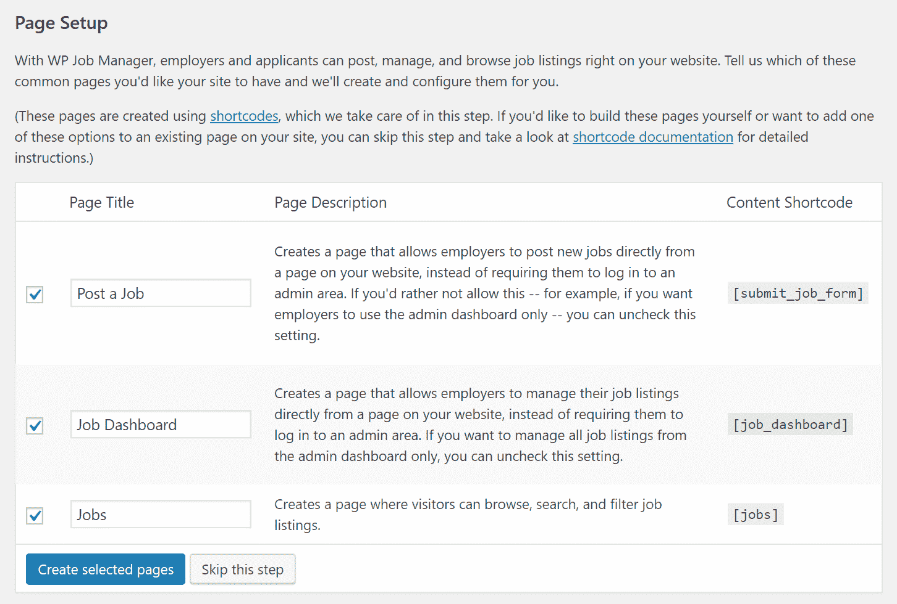

Job board pages

## 配置 WP 作业管理器

只需几秒钟，快速安装向导就会准备好您的工作板，供您使用——但目前，它完全是空的。不过，在开始使用它之前，让我们确保它的配置是正确的。

你会注意到插件已经在你的 [WordPress 菜单](https://kinsta.com/blog/wordpress-menu-plugins/)中添加了一个新的*工作列表*项。转到那里，然后点击*设置。*

在这个屏幕上，你会看到三个标签:*工作列表、工作提交、*和*页面*——如果你已经使用了快速安装向导，你就不需要触摸*页面*标签。

激活众多设置之一就像勾选复选框并点击*保存更改*按钮一样简单。

最重要的字段位于*作业提交*选项卡之后。在这里，你可以选择是否要接受来自客人的工作列表，或者是否要强制招聘人员创建一个帐户——该插件添加了一个新的用户角色，*雇主。*

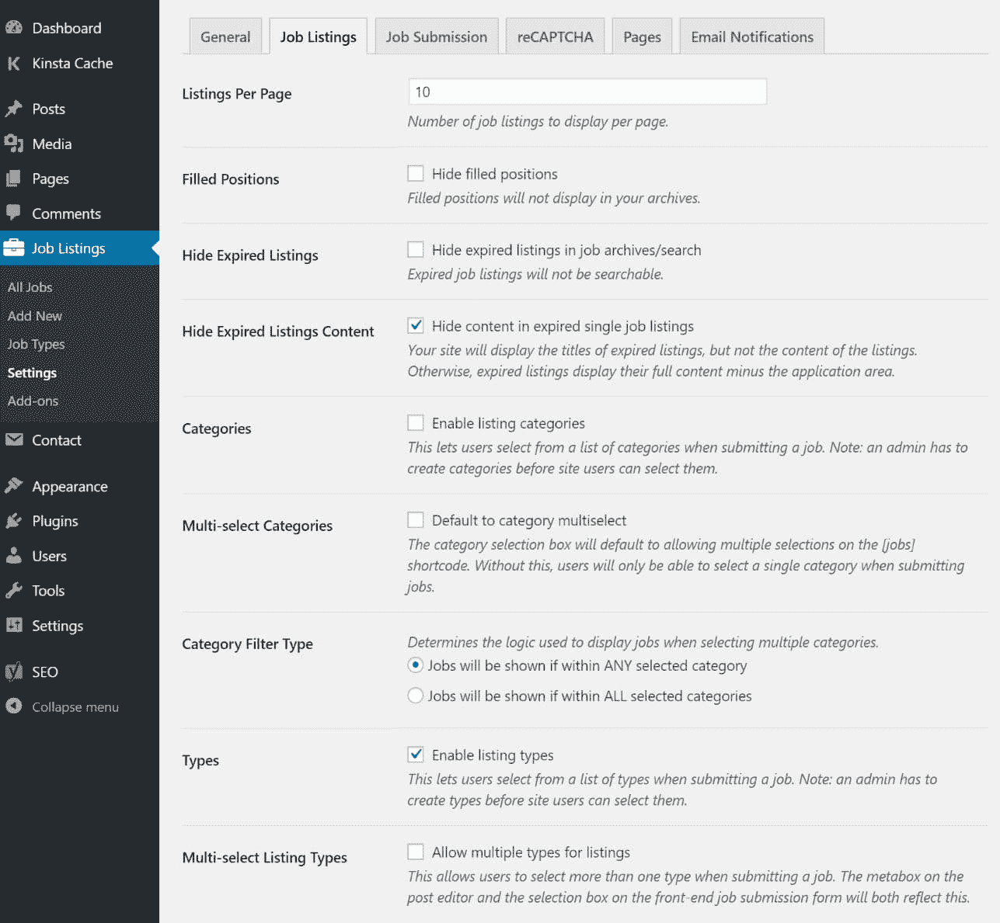

WP Job Board settings

现在，在你让访问者在你的工作板上自由活动之前，我建议你配置你的列表将被分割的类别。这是通过*工作列表 *→** *工作类型*屏幕完成的。

默认创建了五种'*工作类型'*:全职、兼职、临时、实习、自由职业。对大多数人来说，这些应该足够了，除非你想以不同的方式分割你的工作——比如，按行业。

不过，添加新的工作类型很容易；只需键入名称和 slug，然后点击*添加新的作业类型。*

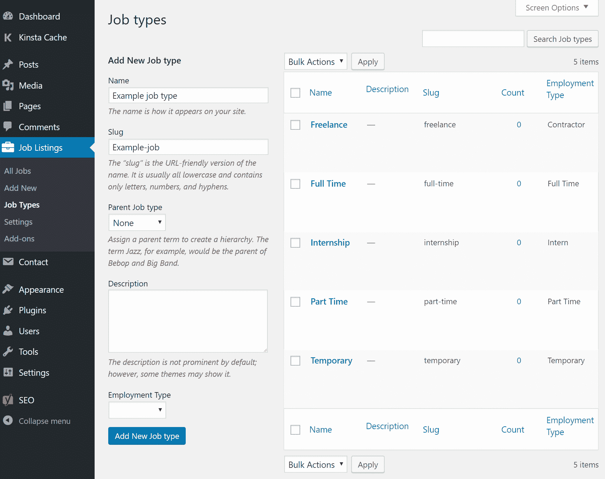

WP Job listing types

## 发布工作

你可以使用 [WordPress 后端](https://kinsta.com/knowledgebase/wordpress-admin/) *或*前端在你闪亮的新工作板上发布工作。

让我们从如何使用 WordPress 后端发布工作开始。从您的仪表盘中，导航至*职位列表→* *添加新职位。*

为你的工作创建一个标题，然后用默认的 WordPress 编辑器写一个描述。

在编辑器下面，您会看到一个元框，它允许您指定所有重要的作业细节。这包括公司名称、工作地点和发送申请的电子邮件地址。使用这个名为*作业数据*的元盒，您还可以将作业标记为特色作业(使其具有粘性)并设置截止日期。

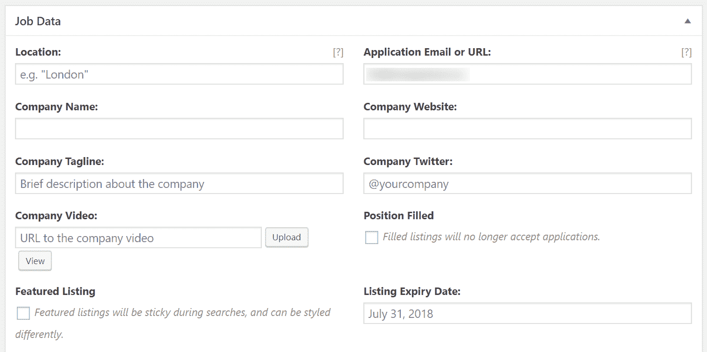

Posting a job

在编辑器的右边，您也可以使用*作业类型*元框为您的作业分配一个类别。

完成后，点击发布以自动将作业发布到您的公告板。请看下面的截图，这是我的招聘启事示例——相对简单，但看起来干净而专业。

WP Job board live listing

正如我已经提到的，WP Job Manager 还允许招聘人员在你网站的前端发布职位——换句话说，就是你网站的实时版本。这是通过安装过程中创建的 *Post Job* 页面完成的。

领域完全一样，唯一不同的是审美。

## 注册订阅时事通讯

### 想知道我们是怎么让流量增长超过 1000%的吗？

加入 20，000 多名获得我们每周时事通讯和内部消息的人的行列吧！

[Subscribe Now](#newsletter)

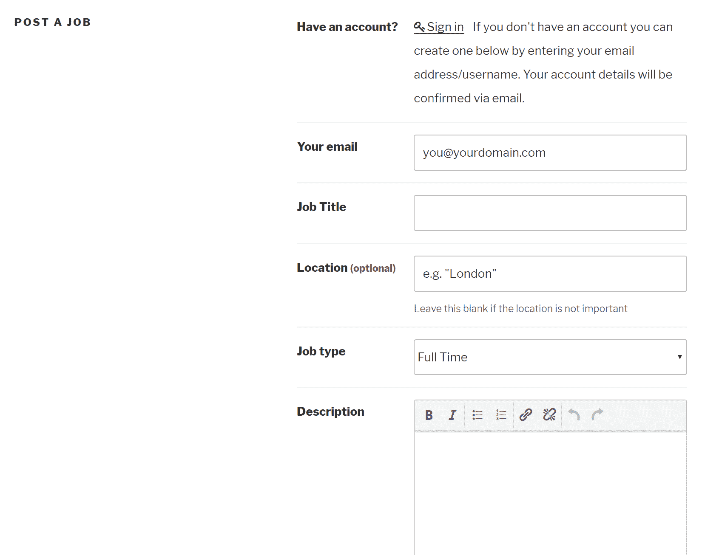

How to post a job

为了确保没有错误，招聘人员可以在点击*提交清单*按钮之前*预览*他们的清单。

这就是发布工作的全部内容——没错，就是这么简单！

## 申请工作

申请过程发生在你网站的前端。

该插件支持直观的过滤器，帮助访问者快速找到最合适的工作。访问者可以通过点击找到关于某个列表的更多信息。

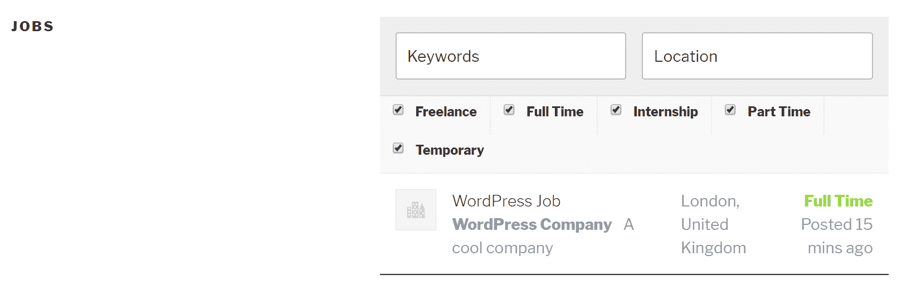

Apply for jobs

一个*应用程序*按钮位于每个工作列表的底部。点击后，这将显示求职者应该把他们的申请发送到哪里。(使用高级扩展允许直接应用是可能的——我们稍后会谈到这一点。)

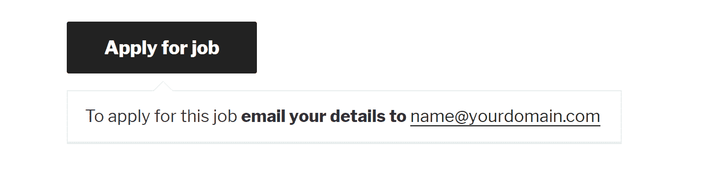

Apply for job button

## 管理工作列表

招聘人员可以从后端和前端管理他们的列表。

这允许招聘人员更改职位详细信息、截止日期，并将职位标记为已满。

Struggling with downtime and WordPress problems? Kinsta is the hosting solution designed to save you time! [Check out our features](https://kinsta.com/features/)

在后端，点击进入*工作列表 *→** *所有工作，*然后点击你想要编辑的工作。

在前端，招聘人员可以使用向导创建的*工作仪表板*页面管理他们的工作列表——招聘人员需要登录才能访问他们的列表。

WP Job Boards dashboard

## WP 作业管理器小部件

从你在网站上安装插件的那一刻起，招聘人员和求职者就可以开始使用你的求职板了。然而，为了充分利用它，你需要确保它是可访问的。

至少，确保将最重要的页面——安装过程中由向导创建的页面——添加到导航菜单中。为了进一步帮助导航，WP 作业管理器还支持两个小部件:

*   特色工作
*   最近的工作

你可以通过导航到*外观 *→** *小部件*然后使用熟悉的拖放界面，将这些添加到网站的任何小部件区域。

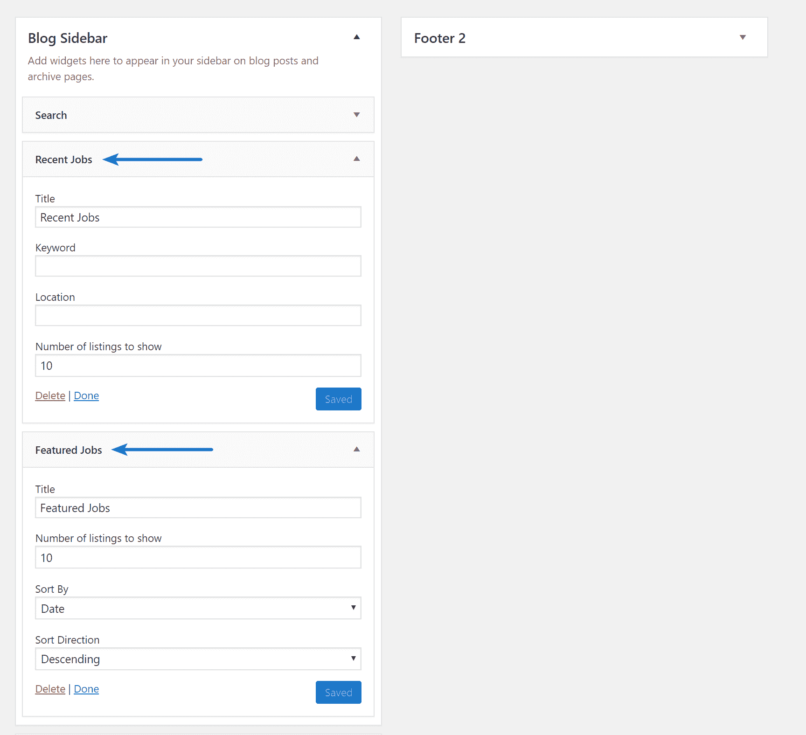

WP Job Board widgets

## WP 作业管理器高级附加组件

核心的 WP 工作管理器插件可以免费使用，这使得它成为一个非常棒的 WordPress 工作板插件解决方案。但是如果你想从插件中得到更多，你可以安装 50 多个附加组件中的一个。所有附加组件的单独定价在 16 美元到 39 美元之间，也有一些免费的附加组件。

您可以通过进入*工作列表 *→** *附加组件来访问附加组件。*

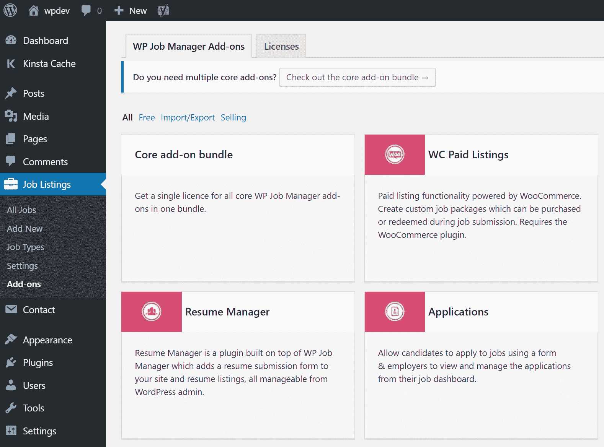

WP Job Board add-ons

让我来介绍一些更有用的附加组件:

*   申请(39 美元起)——求职者可以在工作列表页面上填写一份表格来申请这个职位。
*   简历管理器(39 美元起)——求职者也可以提交简历。
*   **WC 付费列表(39 美元起)**-woo commerce 提供的付费列表功能。创建可在职务提交期间购买或兑换的自定义职务包。
*   **Indeed Integration(39 美元起)**—用 Indeed 提供的工作填满你的工作板。
*   **简单付费列表(19 美元起)**—招聘人员可以使用 PayPal 或 Stripe 支付付费列表。
*   **工作板设计器(39 美元起)**-定制你的工作列表。
*   **限制内容专业集成(免费)**–仅接受订阅者的申请。

您也可以购买 11 个附加组件的捆绑包。核心附加套装的价格为 125 美元，单独购买附加套装的价格为 376 美元。

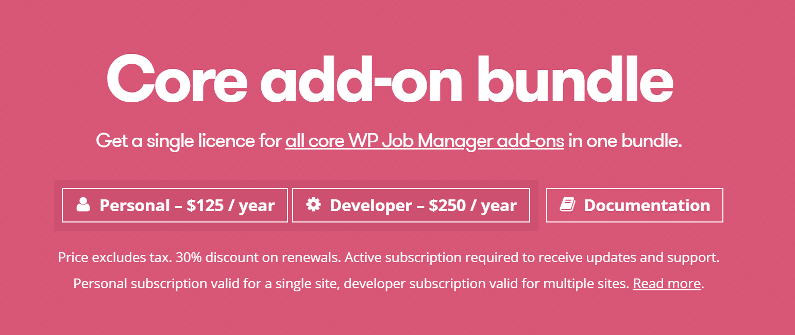

WP Job Board add-ons

## 备选工作板插件

和任何 WordPress 解决方案一样，总会有你想尝试的替代方案。这里有几个例子:

*   [简单工作板](https://wordpress.org/plugins/simple-job-board/)
*   [工作委员会经理](https://wordpress.org/plugins/job-board-manager/)

## 摘要

WP 工作管理器插件是任何想在 WordPress 网站上添加工作板功能的人的理想解决方案。核心插件是完全免费的，支持小型工作板所需的所有基本功能。

更重要的是，它非常容易使用——对你和你的访问者都是如此。如果你从头到尾遵循这个简单的教程，你真的可以在大约 15 分钟内设置并运行你的工作板。

你正在使用 WP 作业管理器插件吗？或者你正在使用一个不同的 WordPress 工作板插件解决方案？在下面的评论区分享你的经历吧！

* * *

让你所有的[应用程序](https://kinsta.com/application-hosting/)、[数据库](https://kinsta.com/database-hosting/)和 [WordPress 网站](https://kinsta.com/wordpress-hosting/)在线并在一个屋檐下。我们功能丰富的高性能云平台包括:

*   在 MyKinsta 仪表盘中轻松设置和管理
*   24/7 专家支持
*   最好的谷歌云平台硬件和网络，由 Kubernetes 提供最大的可扩展性
*   面向速度和安全性的企业级 Cloudflare 集成
*   全球受众覆盖全球多达 35 个数据中心和 275 多个 pop

在第一个月使用托管的[应用程序或托管](https://kinsta.com/application-hosting/)的[数据库，您可以享受 20 美元的优惠，亲自测试一下。探索我们的](https://kinsta.com/database-hosting/)[计划](https://kinsta.com/plans/)或[与销售人员交谈](https://kinsta.com/contact-us/)以找到最适合您的方式。