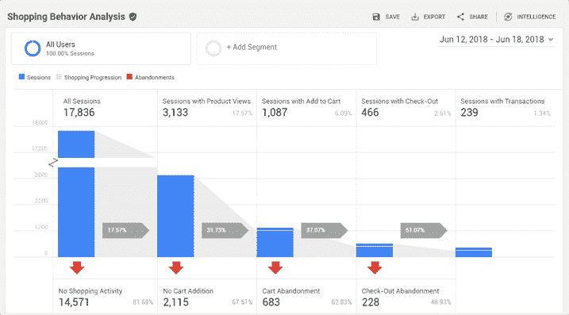
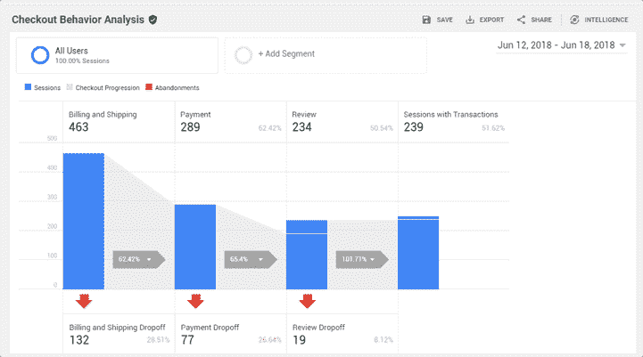
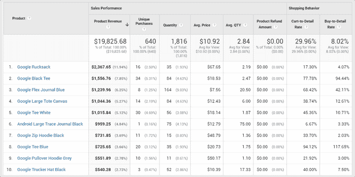
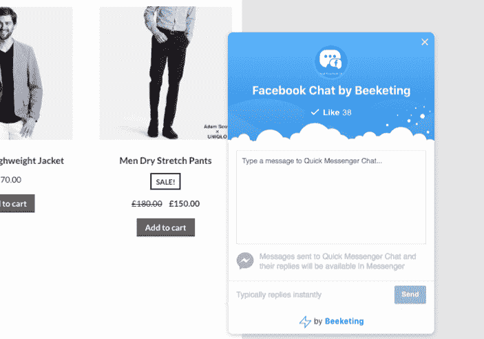
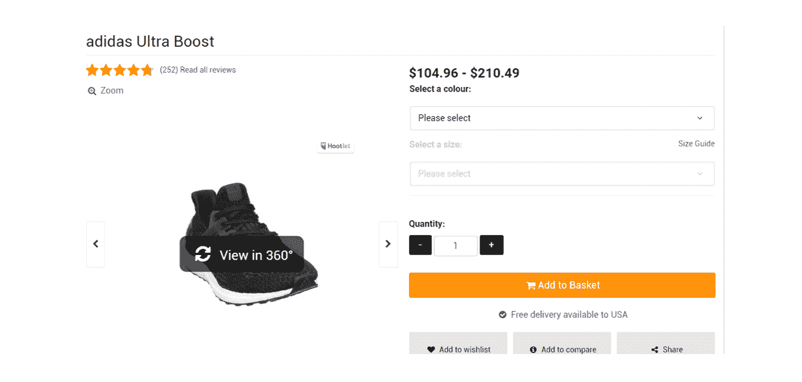
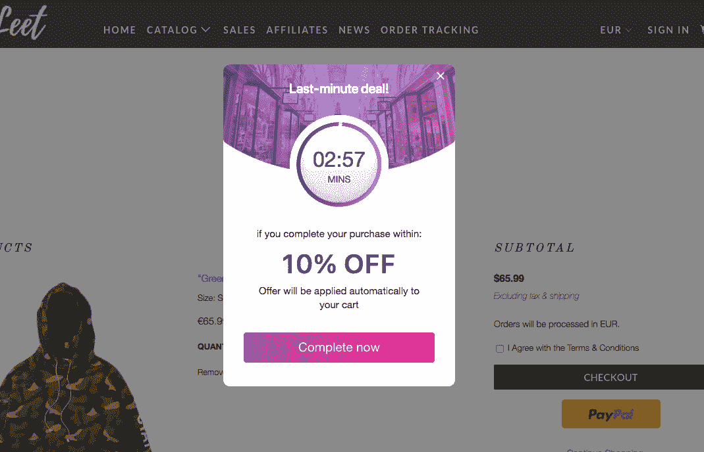
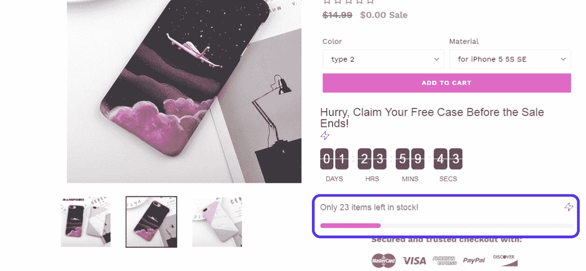
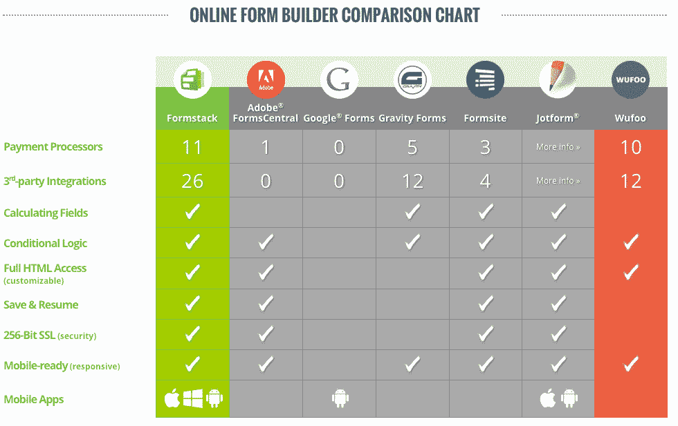

# 如何提高你的 WooCommerce 产品页面的转化率

> 原文：<https://kinsta.com/blog/conversions-woocommerce-product-pages/>

获得了巨大的流量，但没有人购买？拥有大量的访问者是每个在线商店的梦想，但是如果没有他们的购买和转化，你所有的努力都会白费。

这就是为什么你的网上商店的转换率是衡量你的工作成功和提高你的网上商店业绩的一个重要指标。

*   [什么是转化率？](#what-is-a-conversion-rate)
*   [测量转换率](#measuring-conversion-rates)
*   [提高产品页面转化率的 7 种方法](#boost-product-page-conversions)

## 什么是转化率？

简而言之，转化率是导致期望的电子商务行为的**访问百分比。很多时候，我们认为这是销售，但转换可能包括许多不同的东西。典型的电子商务行为包括以下内容:**

*   电子邮件订阅
*   社交媒体分享
*   购物车附加物
*   表单提交
*   产品采购

以上所有类型都很重要，应该对你很重要。但是，在这篇文章中，我们将着重于提高你的 [WooCommerce](https://kinsta.com/blog/woocommerce-tutorial/) 产品页面的转化率，这将有助于把访问者变成真正的付费客户。
T3】

## 测量转换率

提高你的产品页面转化率将推动你最想要的电子商务行动:销售。但是，你怎么计算你的转化率呢？

### 如何衡量转化率

转化率测量有助于我们确定有多少访问者变成了买家。为了进一步说明，请参见下面的转换率公式。

> Kinsta 把我宠坏了，所以我现在要求每个供应商都提供这样的服务。我们还试图通过我们的 SaaS 工具支持达到这一水平。
> 
> <footer class="wp-block-kinsta-client-quote__footer">
> 
> 
> 
> <cite class="wp-block-kinsta-client-quote__cite">Suganthan Mohanadasan from @Suganthanmn</cite></footer>

[View plans](https://kinsta.com/plans/)

Conversion rate formula

同样，您可以用任何想要度量的操作来替换转换。大多数电子商务分析工具，如[谷歌分析](https://kinsta.com/blog/google-analytics-wordpress/)可以很容易地为你提供你想要的转化率。对于 WooCommerce 用户，你可以使用可用的谷歌分析插件方便地集成它，如 [WooCommerce 谷歌分析](https://woocommerce.com/products/woocommerce-google-analytics/)。

有了 Google Analytics，[你可以深入挖掘你的历史数据](https://kinsta.com/blog/how-to-use-google-analytics/)，找出你的产品页面无效的原因，了解需要改进的地方。

假设你的数据告诉你，你的每月访客增加了 10%，但产品购买量下降了 50%。这告诉你有问题。这可能是你吸引了错误的客户，或者他们没有被你的产品页面所说服。

为了帮助你评估你的转化率，请查看谷歌分析中的这些不同的电子商务转化率指标。注意:您需要打开[增强型电子商务](https://support.google.com/analytics/answer/6032539)来查看以下报告。

**购物行为分析**–帮助您分析销售漏斗每个阶段包含的会话数量。有多少次会议从一个步骤继续到下一个步骤，有多少次会议在每个销售阶段放弃了漏斗。

Shopping behavior analysis in Google Analytics

**结账行为分析**–帮助您直观了解成功通过结账流程的用户数量。

Checkout behavior analysis in Google Analytics

**产品表现**–帮助您了解您的产品在收入、价格、数量和用户参与度方面的表现。

Product performance in Google Analytics

### 什么是好的转化率？

你应该记住，一个好的转化率取决于你所在的行业和你服务的领域。但是，如果你正在寻找基线目标，这里有 [Q1 2018 全球基准](https://www.monetate.com/resources?p=resources/research)你应该努力跟上:

*   产品转化率 : 2.59%
*   **加入购物车比率** : 9.89%

您还应该注意以下领域，因为它们会让您了解您正在失去客户的具体领域:

*   **购物车放弃率**(目标低于 [75.6%](https://blog.salecycle.com/post/infographic-remarketing-report-q1-2017/) ):当购物者将商品放入购物车，然后离开网站。
*   **结账放弃率**(目标低于 [46%](http://www.businessinsider.com/e-commerce-shoppers-abandon-carts-at-payment-stage-2016-3) ):当购物者已经开始结账过程，然后离开。
*   **跳出率**:当访问者浏览完一页后离开。
*   **退出率**:当一个访问者在你的网站上访问了不止一个网页后离开。该比率应低于

但是，好是相对的。

还有其他各种各样的方面要考虑，如流量来源，目标市场，位置，等等，然后你才能说你有一个好的转化率。

这个问题最现实的答案是:**一个好的转化率比你上个月得到的**。(来源:[ConversionXL](https://conversionxl.com/whats-a-good-conversion-rate/))
T5】

## 提高产品页面转化率的 7 种方法

以下是制作高转化率产品页面的最佳实践纲要。

### 1.轻松找到合适的产品

当购物者访问你的网上商店并浏览产品页面时，时间已经开始了。如果购物者花费太多的时间和精力去寻找他们想要的东西，他们不改变主意的可能性就越大。

让事情变得更容易和简单会影响你的顾客立即购买。为此，您可以确保具备以下特性:

*   **改进现场搜索:**使用 [Algolia](https://www.algolia.com/) 添加实时搜索、过滤器、索引等功能。你也可以用 [Elasticsearch](https://kinsta.com/blog/wordpress-search/) 加速搜索。
*   **改善您网站上的导航**:分层的产品导航可以根据类别、价格范围、颜色、尺寸或任何其他可用的产品属性轻松找到产品。您可以使用[支持 Ajax 的增强型分层导航](https://woocommerce.com/products/ajax-layered-navigation/)来实现这一点。
*   **实施产品比较:**顾客购买决策过程的一部分是比较产品。他们想比较产品的特点、优点和价格，以了解哪种产品适合他们。尝试使用[产品比较](https://woocommerce.com/products/woocommerce-products-compare/)来简化这一过程。
*   **启用** **Messenger 实时聊天**主动为正在浏览的购物者提供帮助，或者显示一个聊天窗口，以便他们能够联系到您。你可以用[的 WooCommerce](https://beeketing.com/redirect?url=https%3A%2F%2Fwordpress.org%2Fplugins%2Fbeeketing-for-woocommerce%2F&utm_channel=blog&utm_medium=gblog&utm_term=kinsta) 插件轻松做到这一点。

Facebook live chat for WordPress

### 2.使用高质量的产品图片

人是高度视觉化的。产品图片是任何产品页面的圣杯。由于没有任何物理接触，在线商店非常依赖产品图像作为在线购物者的参考点。产品图片可以回答购物者的一些问题，而不需要浏览冗长的产品描述。

这里有一些简单的技巧来改善你的产品形象和你的整体视觉内容战略:

## 注册订阅时事通讯

### 想知道我们是怎么让流量增长超过 1000%的吗？

加入 20，000 多名获得我们每周时事通讯和内部消息的人的行列吧！

[Subscribe Now](#newsletter)

*   **高分辨率是必须的**:看过高质量产品图片的顾客比没有看过图片的顾客转变观念的可能性[高三倍](https://web.archive.org/web/20160222000123/http://www.brightnorth.co.uk/whitepapers/Image_Quality_and_eCommerce.pdf)。从购物者的角度来看，低分辨率的图片会妨碍他们进一步检查产品，让你的公司看起来不专业，不可信。
*   **缩放功能:**使用缩放功能可以对产品图像进行交互式缩放或平移，这是购物者的最爱。事实上，38%的在线购物者更有可能从具有产品缩放功能的在线商店购买产品。
*   **360 度产品视图:**使用 360 度产品视图，您可以展示产品的不同尺寸、角度和视角。网上商店已经看到展示 360 度图片的产品比展示静态图片的产品[销售额增长了 6%](http://www.marketplacesellers.com/360-3d-product-photography/)。

例如，Wiggle.co.uk 在其产品页面上结合了 360 度和缩放功能，使购物者能够缩放、旋转和改变产品的视角。

Quality WooCommerce product images (Image source: [Wiggle](http://www.wiggle.co.uk/))

### 3.删除内容中的行话

言语是有力量的。你应该在你的产品页面上附上高质量的内容，以促使你的客户更有可能购买。让你的内容更容易在头脑中处理，并尝试以你的目标受众会产生共鸣的方式写作。尽可能真实地展现你的写作风格，就像你平时和朋友聊天一样。

请记住，你不只是提供信息与你的内容，你也告诉你是谁，这是一种方式来说服购物者购买。事实上，质量描述可能会将转化率提高 [78%](https://marketingexperiments.com/a-b-testing/testing-product-page-elements) 。

不要试图用花哨、复杂的商业语言让人们惊叹——这是行不通的。

你为人们写作——人们阅读你的网站，并根据你的话决定购买。投资写你的产品描述，让他们听起来积极和友好，以表明你是一个开放和迷人的品牌。

看看 [Wristology](https://www.wristologywatches.com/collections/shop/products/charlotte-rose-gold?variant=46579700751) 如何写出漂亮迷人的产品描述，就像你在和朋友聊天一样。

Great content in WooCommerce

### 4.开展促销活动以增加紧迫性

根据销售大师金克拉的说法，人们不从你这里购买的原因只有四个:

*   不需要
*   没钱
*   不信任
*   不着急

虽然你对前两个原因无能为力，但你绝对可以影响紧迫性并建立信任。让我们先讨论创造紧迫感，然后再讨论信任。

Struggling with downtime and WordPress problems? Kinsta is the hosting solution designed to save you time! [Check out our features](https://kinsta.com/features/)

你可以通过触发供求法则来增加产品页面的紧迫性。你可以创造两种稀缺:

*   与数量相关的稀缺性(此价格只剩 2 件商品)
*   与时间相关的稀缺性(购买的最后时间)

如果你的产品供应源源不断，你可以发放限时奖励，给前 X 个买家一份免费礼物，或者给他们一个折扣，如果他们在一定时间内完成购买的话。

例如，这家在线商店通过使用 WooCommerce 的[Beeketing](https://beeketing.com/redirect?url=https%3A%2F%2Fwordpress.org%2Fplugins%2Fbeeketing-for-woocommerce%2F&utm_channel=blog&utm_medium=gblog&utm_term=kinsta)插件添加倒计时器，为你的报价设置紧急触发器。带有倒计时器的优惠将告诉购物者，如果他们想利用这笔交易，那么他们必须迅速行动。

WooCommerce countdown timer

提示:稀缺的原因应该是真实的。永远不要对你的顾客撒谎。如果是假稀缺，你的客户聪明到可以识别，你的可信赖度就直线下降。

您还可以创建消息，告诉购物者产品的供应有限或库存已经很低，因此可能不会很快供应。使用“库存仅剩 3 台”或“交易将在 2 小时内到期”等信息。下面是它可能的样子。

WooCommerce left in stock

### 5.建立信任

现在，我们来谈谈信任。信任是成功转化的重要因素。但是为什么顾客在购买前信任网上商店很重要呢？嗯，因为网上交易包括个人信息，如姓名、家庭住址和信用卡信息。另外，还有钱的问题。

通过在主页或产品页面上放置明显的信任标志，你可以很容易地建立网站的可信度。事实上，网上购物者信任未知网站的第二大因素是像迈克菲一样贴上信任标志。

此外，通过展示你满意的顾客的诚实的证明和评论来让你的访问者放心。74% 的顾客表示，正面评价让他们更加信任一家企业。

你也可以通过显示社交证明来增加可信度，比如弹出消息，告诉别人正在看一件商品，或者最近购买了该商品，就像这样。

Social proof

### 6.挽救丢失的转换

你知道吗，高达 98%的访问者在第一次访问时不会购买你的产品。呀，真的那么高。对于许多在线商店来说，这是一个具有挑战性的问题，尤其是因为流量难以获得。想象一下那些可能丢失的转换。

但是有很多方法可以挽救那些看似失去的机会。以下是一些例子:

*   **建立愿望清单功能**:有时购物者只是还没准备好购买。在你的产品页面上提供意愿列表按钮是很重要的，这样他们就可以保存产品，以后再回来，然后完成购买。有了愿望清单功能，就不会浪费潜在的转化。
*   **通过放弃邮件**重新锁定客户:你也可以通过发送购物车放弃邮件来委婉地提醒你的购物者他们被放弃的购物车[。您可以使用 WooCommerce 的内置功能方便地设置自动电子邮件来回收废弃的购物车，或者通过 WooCommerce](https://kinsta.com/blog/shopping-cart-abandonment/) 插件的 [Beeketing 中的 Mailbot 应用程序自动完成这项工作](https://beeketing.com/redirect?url=https%3A%2F%2Fwordpress.org%2Fplugins%2Fbeeketing-for-woocommerce%2F&utm_channel=blog&utm_medium=gblog&utm_term=kinsta)

### 7.在购物者之前，将自己与竞争对手进行比较

每种产品和服务都有其直接和间接的竞争对手。研究表明，人们总是在比较购物。在购买之前，他们会先去三个网站寻找最好的产品。

将这一点付诸行动，让它成为你的优势——**在购物者之前将你的产品与他人进行比较。**

人们通常只看价格和产品特性等最重要的东西。既然你在控制，你就能控制对话。比如说，你的产品比你的竞争对手贵，那么你能做的就是把你的优势放在你的对比表中最引人注目的部分。

这样你就解释了为什么购买贵的产品比购买竞争对手的便宜产品更有利。

有一个产品比较表可以帮助防止你的访问者离开你的网站。同样，由于您负责沟通，您可以将您的产品展示为最佳选择，就像 Formstack 如何将其产品与其他 form builder 服务进行比较一样。

Comparison chart (Image source: [Pinterest](https://www.pinterest.com/pin/318066792407743482/))

## 摘要

通过优化你的产品页面，你正在提升你的产品页面应该做的事情:**转换**。有很多方法可以提高你的产品页面转化率，但主要的想法是创造一个积极的购物体验。

您可以通过确保您的客户能够轻松搜索到合适的产品、用高质量的照片直观地检查产品、理解您的内容、避免不信任并无缝地完成购买来实现这一点。

* * *

让你所有的[应用程序](https://kinsta.com/application-hosting/)、[数据库](https://kinsta.com/database-hosting/)和 [WordPress 网站](https://kinsta.com/wordpress-hosting/)在线并在一个屋檐下。我们功能丰富的高性能云平台包括:

*   在 MyKinsta 仪表盘中轻松设置和管理
*   24/7 专家支持
*   最好的谷歌云平台硬件和网络，由 Kubernetes 提供最大的可扩展性
*   面向速度和安全性的企业级 Cloudflare 集成
*   全球受众覆盖全球多达 35 个数据中心和 275 多个 pop

在第一个月使用托管的[应用程序或托管](https://kinsta.com/application-hosting/)的[数据库，您可以享受 20 美元的优惠，亲自测试一下。探索我们的](https://kinsta.com/database-hosting/)[计划](https://kinsta.com/plans/)或[与销售人员交谈](https://kinsta.com/contact-us/)以找到最适合您的方式。