# 网站可用性测试的最终分步指南

> 原文：<https://kinsta.com/blog/website-usability-testing/>

[16.2%的高科技公司](https://wwwimages2.adobe.com/content/dam/acom/en/modal-offers/pdfs/178563352.en.tech.whitepaper.ovum-digital-marketing-report.pdf)将他们的重点转向客户参与。15.5%的人计划增加投资以改善客户体验。这告诉你什么？

这告诉你，用户体验正在离开设计师的领域，成为任何在线业务的支柱，无论它们是全新的还是已经上市多年的。这可能就是为什么如此多的知名公司转向可用性测试来找出问题并改进他们的产品和网站。

*   销售黑客[利用用户反馈](https://www.saleshacker.com/ux-research-case-study/)提高参与度，培养忠诚度，并根据用户提供的见解改进他们的内容策略。
*   在线体育博彩运营商 Stan James(现在的 Unibet)利用可用性测试的结果将他们的转换率从每月 1.5%提高到 3%。
*   成功的例子不胜枚举。请随意查看更多[案例研究](http://www.usabilityfirst.com/about-usability/usability-roi/case-studies/)。

所以，如果你还没有坐上可用性的列车，是时候上车了。在本指南中，我们将带你一步步了解进行网站可用性测试所需的一切。

*   [步骤 1:确定指标并创建任务分析](#determine-metrics)
*   [步骤 2:确定最佳测试类型](#identify-test-type)
*   [第三步:找到有效的参与者](#find-valid-participants)
*   第四步:决定时间、地点和人物
*   [第五步:冲洗并重复](#rinse-repeat)

## 步骤 1:确定度量标准并创建任务分析

首先，你需要弄清楚你的度量标准。可用性测试可以发现一大堆问题，但是如果它不是为了确定具体的度量标准，它就不会是对你的时间或者金钱的有效利用。

可用性测试通常有三个公认的指标:

*   效率
*   有效性
*   满意

以下是这些指标通常包含的内容的快速分类:

> Kinsta 把我宠坏了，所以我现在要求每个供应商都提供这样的服务。我们还试图通过我们的 SaaS 工具支持达到这一水平。
> 
> <footer class="wp-block-kinsta-client-quote__footer">
> 
> 
> 
> <cite class="wp-block-kinsta-client-quote__cite">Suganthan Mohanadasan from @Suganthanmn</cite></footer>

[View plans](https://kinsta.com/plans/)

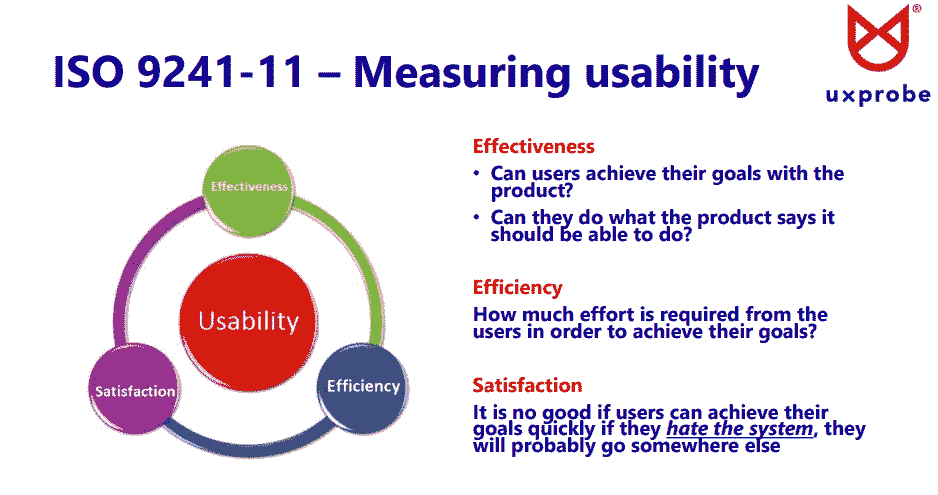

Measuring usability (Image source: [Jan Moon’s SlideShare presentation](https://www.slideshare.net/UXAntwerpMeetup/jan-moons-at-ux-antwerp-meetup-25-apr-2017))

虽然从表面上看，这三种方法似乎很简单，但它们都是各自嵌套的问题，没有通用的答案。

*   用户的目标是什么？
*   必须采取什么步骤来实现这些目标？
*   如何衡量付出的努力？

幸运的是，有一种简单的方法可以回答这些问题，那就是构建所谓的[任务分析](http://practicaluxmethods.com/product/task-analysis/)。任务分析之所以流行，是因为它允许你直接测量可用性中最流行的两个指标:**任务完成率和任务时间**。

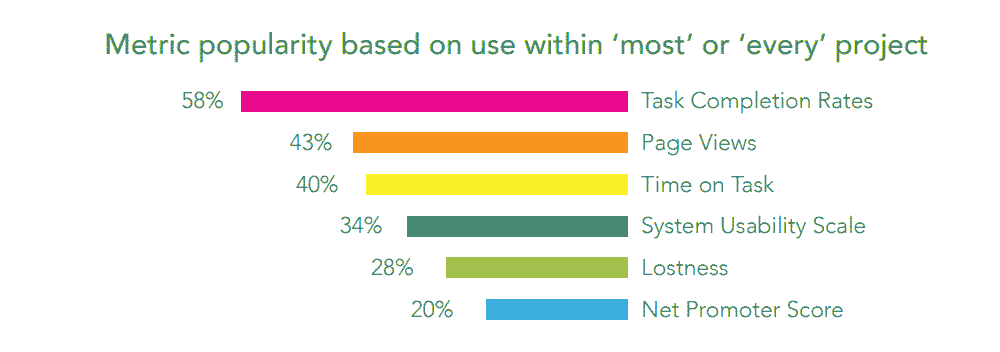

Task analysis (Image source: [Loop11](https://www.loop11.com/ux-industry-study/))

它是这样工作的。你从一个总体目标开始。在下面的例子中，目标是每天服药。

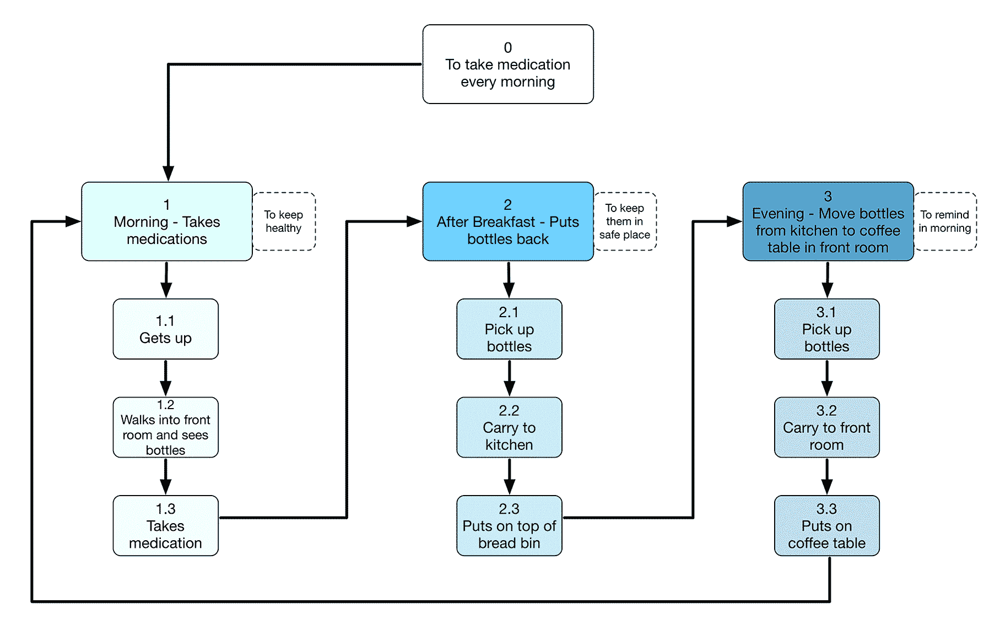

Example of hierarchical task analysis (Image source: [Lilly Browne](https://blogs.city.ac.uk/browne-inm452-2016/2016/12/25/1-6-using-user-data-hierarchical-task-analysis-hta/))

然后你将目标分解成完成目标所需的步骤。这些也称为子任务。没有一步是太小的。

完成后，你就有了一个用户完成目标的路径的理论图。然后，您可以使用您的任务分析来设置基线有效性和效率指标。让我们试着自己做一个。

首先，前往 [Lucidchart](https://www.lucidchart.com/) 。点击屏幕右上角或中间的“免费注册”按钮注册一个帐户。您将被带到此页面，并有机会开始试用。现在，向下滚动，直到你看到蓝色的“开始免费帐户”按钮，并选择它。

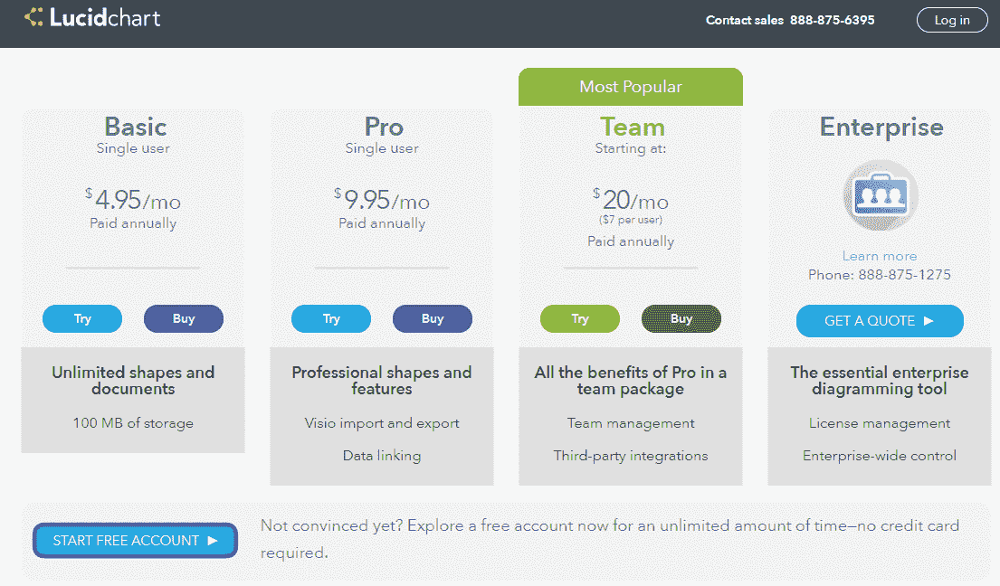

Lucidchart sign up

完成注册后，您将来到这个仪表板屏幕。有许多模板可供选择，但是对于任务分析来说，从流程图开始通常是最容易的。选择第二个选项来查看可用的流程图模板。

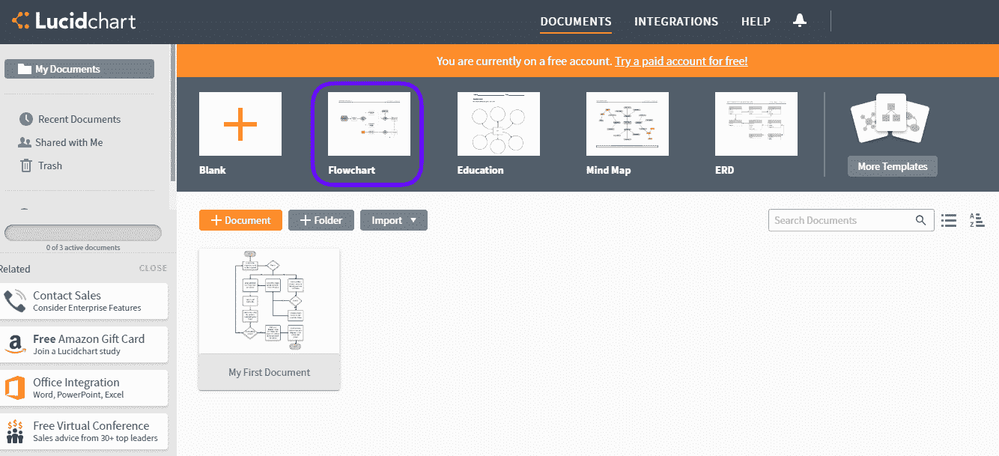

Lucidchart flowchart

选择第一个选项，“空白图”

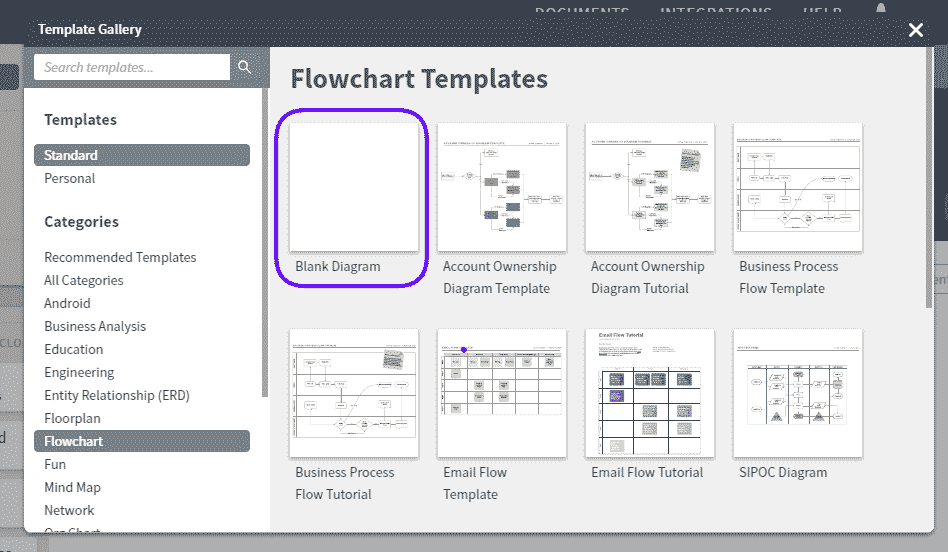

Lucidchart blank diagram

下一页将以空白画布为特色。使用左侧面板添加形状。如果您不确定要使用哪个形状，请将鼠标悬停在选项上，直到看到弹出窗口。

在大多数情况下，任务分析仅使用正方形(流程)和菱形(决策)形状，但是当您构建更复杂的任务流时，查看其他形状可能会很有用。

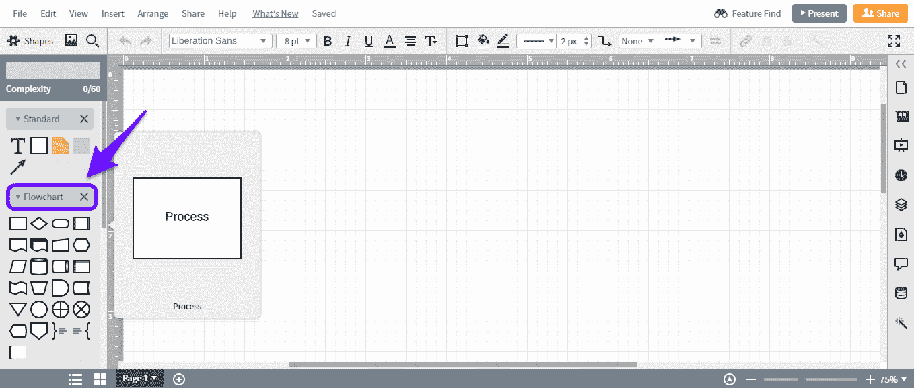

Lucidchart process

开始放下形状来建立你的任务。这里，我们从构建本演练的简单任务流开始。若要添加文本，请双击形状边界内的某个位置并开始键入。

当您准备好连接形状时，单击边上的白色圆圈，并将鼠标拖到下一个形状上。如果是菱形(决定)三角形，它会自动在你的行中添加“是”和“否”。

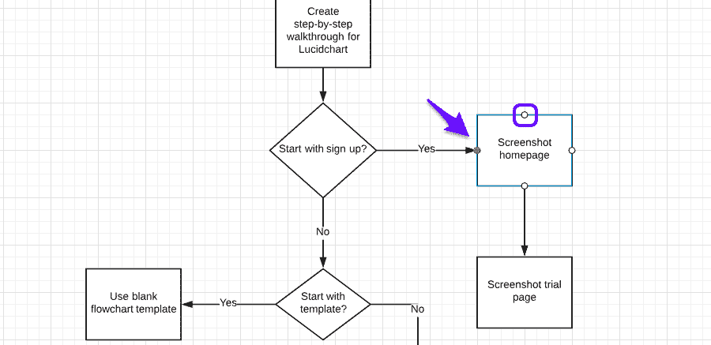

Yes or no in a flowchart

请注意，如果您需要移动形状，线条会自动重新定位以保持连接，因此在构建图表时不要害怕重新组织图表。

如果您想要更改颜色、字体、笔画、箭头样式或线条，请使用上面突出显示的顶部面板。

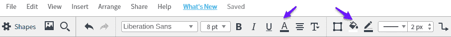

Flowchart fonts and colors

建立任务流后，进入“文件”查看共享和下载选项。您可以导出带有透明背景的任务流，作为矢量图形( [SVG](https://kinsta.com/blog/what-is-an-svg-file/) )或 PDF，以及其他选项。

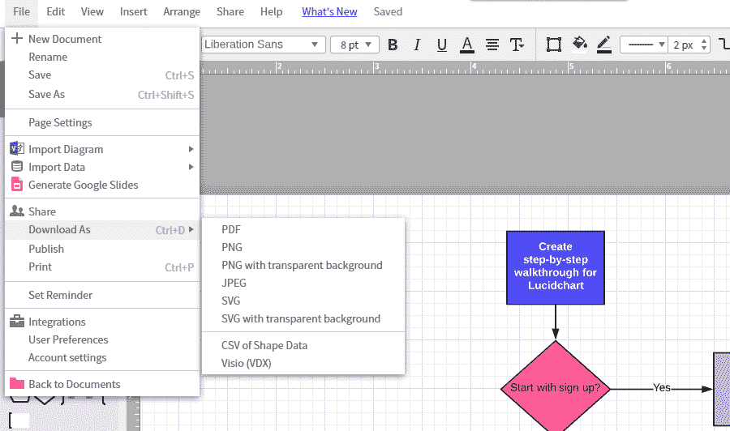

Flowchart download as vector

现在你知道了！当进行测试和设置度量时，您现在有一个任务分析可以使用。一旦你真的进入测试，你可能会修改你的任务分析，但是至少提前两到三个任务可以让你[指导你的可用性测试](https://processpolicy.com/task-analysis.htm)。

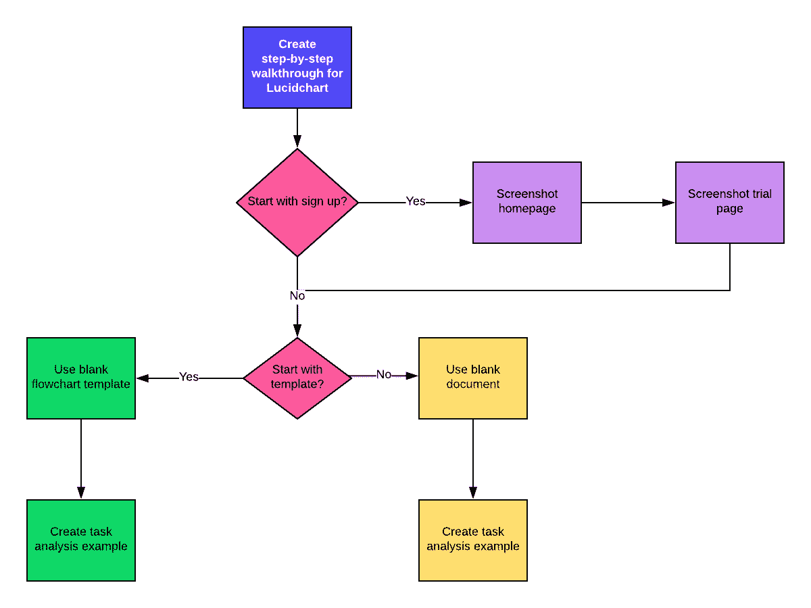

Task analysis flowchart

在你完成任务之后，是时候为你的网站找出最佳的测试类型了。

## 步骤 2:确定最佳测试类型

可用性测试可以采取多种形式，在难度和投资要求方面也有所不同。什么类型的测试最适合你的网站取决于你在第一步中建立的标准和任务。

下面，我们将介绍三种常见的可用性测试，以及它们的用途，还有一些荣誉。

### 1.卡片分类

到目前为止，卡片分类是最简单、最快速的可用性测试，是对网站架构的一种工具性测试。

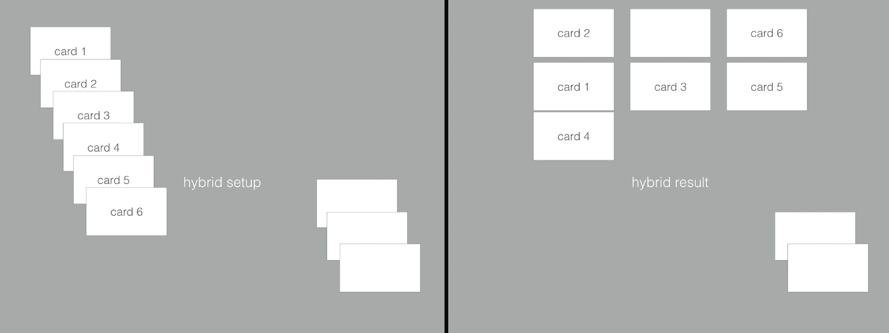

Card sort (Image source: [cary-anne olsen-landis](https://medium.com/design-ibm/card-sorting-a-powerful-simple-research-method-9d1566be9b62))

如果你记得玩过纸牌匹配游戏，纸牌的分类是相似的。它是这样工作的。卡片分类可以是“开放的”，在这种情况下，用户创建他们的分类来将卡片分类为“封闭的”，在这种情况下，所有的分类都是预定义的和不灵活的。或者，如上图所示，卡片分类可以是“混合”的，用户可以自由添加自己的类别，也可以使用预定义的类别。

用户将剩下的卡片，通常是单个网页或流程中的步骤，按照最符合他们心智模型的类别进行排序。大多数专家建议坚持使用 30 到 60 张卡片。执行卡片排序对于观察用户的心理模型如何匹配你的网站的架构和任务流程是非常好的。它可以在测试过程的早期揭示任何重要的问题，就像对 Pottery Barn 的重新设计所做的那样(如下所示)。

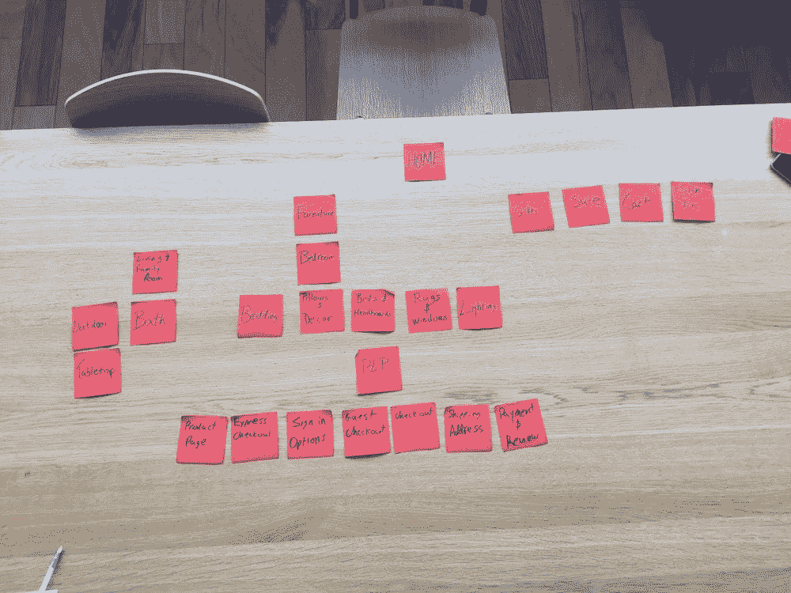

Card sort example in a redesign (Image source: [John Wood Quartana](https://www.jwquartana.com/pottery-barn-redesign/))

您可以[远程](https://dynomapper.com/blog/19-ux/428-card-sorting-tools)或亲自进行卡片分类。使用卡片分类测试的最大好处是测试进行的速度，尽管[分析阶段本身可能很耗时](https://www.userzoom.com/card-sorting/card-sorting-what-is-it-and-why-is-it-important-to/)。

然而，因为卡片分类只允许有限的用户干预和反馈，所以对于那些想要测试网站满意度或有效性的人来说，不应该考虑它们。相反，卡片分类应该被认为是效率的第一线测试，而其他指标似乎更适合留给更健壮的可用性测试类型，例如现场研究。

### 2.实地研究

可用性测试的实地研究就像它听起来的那样。你去你的用户的自然使用栖息地——他们最有可能使用你的网站的地方——让他们在半结构化访谈中一边看着屏幕，一边向你介绍他们的流程。

这项研究也被称为**背景调查**。

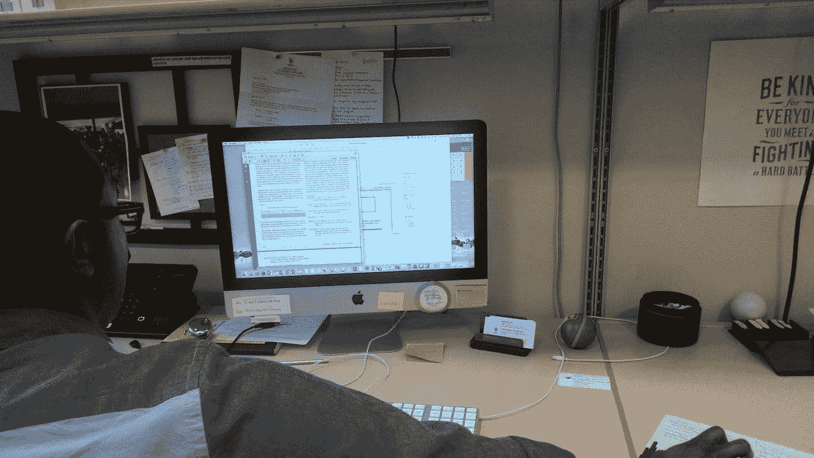

Contextual Inquiry (Image source: [Philip Adeoye](http://philipadeoye.com/100_days_of_ux/contextual_inquiry.html))

别担心，盯着别人肩膀看的尴尬很快就会消失。😉

实地研究比卡片分类更耗费时间，但它们是测试任务和获得直接用户反馈的理想选择。对于那些想要深入挖掘可用性问题的人来说，[实地研究是一条可以走的路](https://uxls.org/methods/contextual-inquiry/)。情境查询是[用户体验设计工作室 MELEWI](https://realtimeboard.com/blog/melewi-remote-ux-research/) 为企业或“有限用户”产品部署的第一个策略。

梅勒维的 UX 设计顾问阿维克·甘古利解释道:

> MELEWI 上下文查询 Sprint 旨在直接嵌入用户的上下文:观察参与者做了什么，他们差点做了什么，以及他们没有做什么。

在下面的可用性研究中，你可以看到 MELEWI 是如何分类和解释嵌入的好处的。

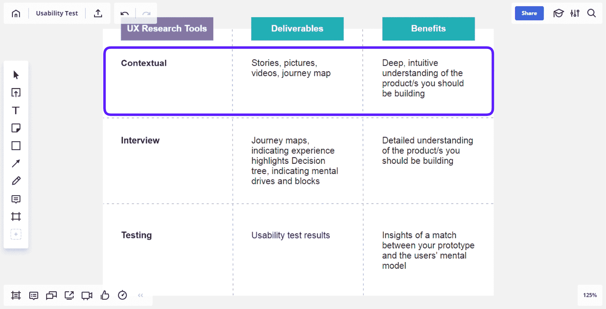

Contextual side (Image source: [RealtimeBlog](https://realtimeboard.com/blog/melewi-remote-ux-research/))

请注意，现场研究可以远程进行，但往往会失去数据的丰富性。美国政府数字服务机构 18F 的 Nicole Fenton 和 Jamie Albrecht 强调了这一点:

> …例如，当你能在人们典型的物理环境中观察他们时，背景调查是最有价值的。不要错过你的用户和同事之间的面对面的时间。

### 3.眼球追踪

如果你曾经看过一个网站的热图，你应该已经熟悉了眼球追踪测试的结果。

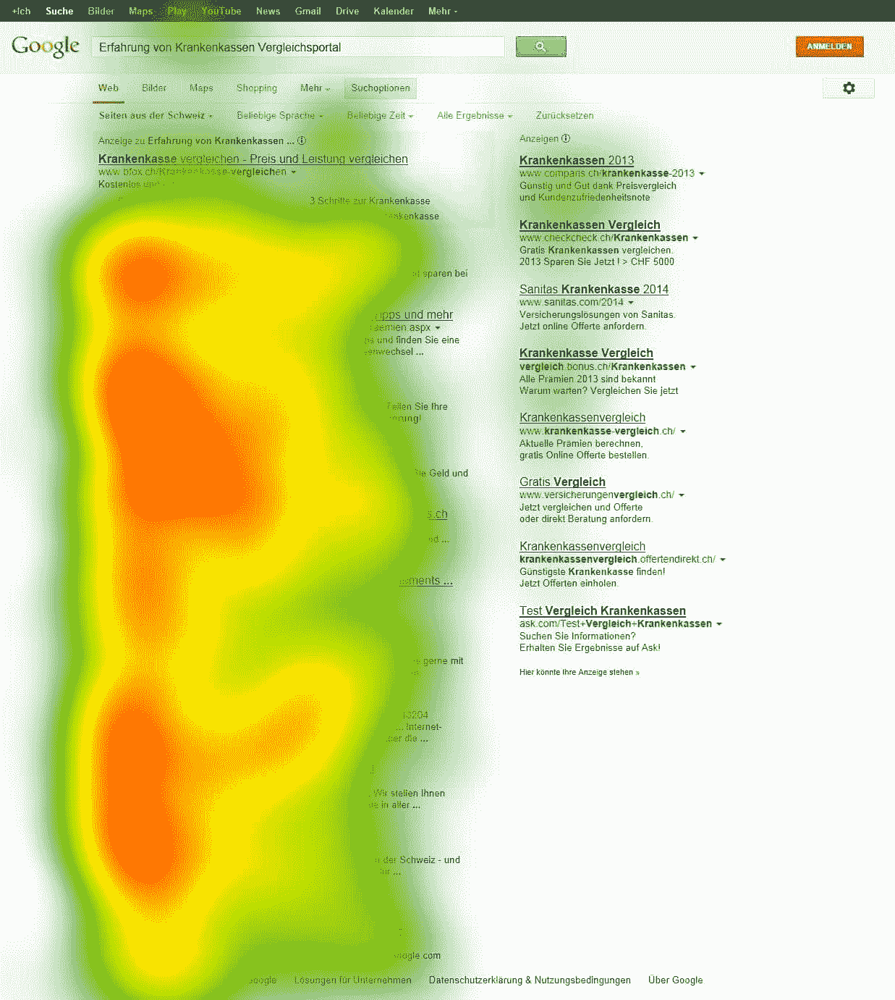

Heatmap analysis (Image source: [MockingFish](https://www.mockingfish.com/blog/what-googles-eye-tracking-heatmap-analysis-reveals/))

眼球追踪研究用于确定用户在页面上看着的地方[以及以什么顺序看。热图的颜色越深，用户花在屏幕上的时间就越多。](https://usabilitygeek.com/what-is-eye-tracking-when-to-use-it/)

这使得眼球追踪非常有助于确定用户何时何地离开你的网站。当内容不相关时，它也会突出显示，就像电子商务网站 Pronto 一样。

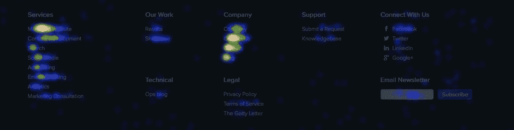

Eye-tracking ([Shopify](https://www.shopify.com/enterprise/ecommerce-eye-tracking))

通过揭示 Pronto 用户最关心的领域，眼球追踪研究使 Pronto 重新设计了一个主页，其领先优势增加了 24%，点击率增加了 17%。

## 注册订阅时事通讯

### 想知道我们是怎么让流量增长超过 1000%的吗？

加入 20，000 多名获得我们每周时事通讯和内部消息的人的行列吧！

[Subscribe Now](#newsletter)

与之前的测试一样，眼球追踪可以通过专业设备亲自完成，也可以通过网络摄像头远程完成。然而，远程测试并非没有缺陷。

以下是使用网络摄像头进行眼球追踪的利弊:

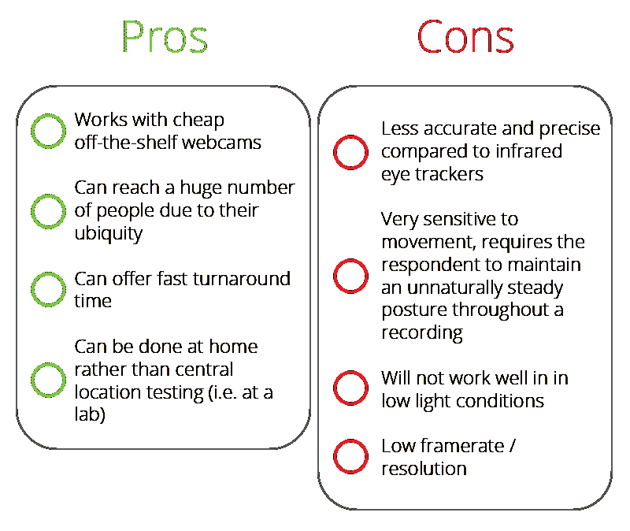

Pros and cons of webcam-based eye tracking (Image source: [iMotions](https://imotions.com/blog/webcam-eye-tracking-vs-an-eye-tracker/))

这种类型的可用性测试不像用户满意度的实地研究那样有价值，但可以产生丰富的效率和有效性数据。它还可以通过突出用户眼睛跳过或错过的地方来帮助指出导航问题，本质上是通过用户眼睛的透镜来放置你的网站。根据反馈，你可以改进你的设计，网站结构，网站[导航](https://kinsta.com/blog/website-navigation/)，行动号召等等。

### 荣誉提名

卡片分类、实地研究和眼球追踪并不是游戏中唯一的可用性测试。

[焦点小组](http://www.usabilitynet.org/tools/focusgroups.htm)、 [A/B 测试](https://kinsta.com/blog/wordpress-ab-testing-tools/)和[调查](https://www.uxmatters.com/mt/archives/2017/10/usability-testing-for-survey-research.php)都是可行的用户测试形式，可以奖励反馈，但不应该在任何重大重新设计中考虑。

现在，在为你的目标确定了最好的测试类型后，你必须找到测试的人。你可能会惊讶你需要多少。

## 步骤 3:寻找有效的参与者

你需要多少用户来进行可用性测试？[行业标准在五](https://www.trymyui.com/how-many-users-is-enough)左右。根据 UserTesting 的一项调查，33%的公司招聘 5 名或更少的用户，41%的公司招聘 6 到 10 名用户。

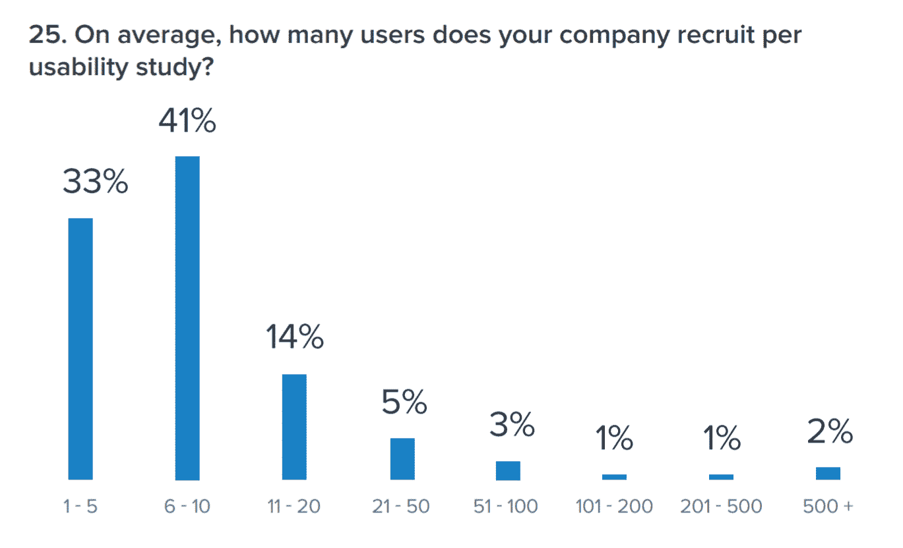

Users per usability study (Image source: [UserTesting](http://downloads.usertesting.com/white_papers/UT_WP_IndustrySurveyReport_2017_Final.pdf))

为你的可用性测试寻找用户的关键是确保他们是真实用户的有效近似。不验证您独特的用户群的设计变更可能会有一些严重的影响。这是 Icons8 背后的设计师在推出重新设计和[失去近一半用户](https://icons8.com/articles/how-we-lost-47-of-our-users-after-a-redesign/)后发现的。

这也是为什么在 Kinsta，我们将用户反馈作为重新设计过程的一个直接部分。

也就是说，对于测试的目标来说，寻找有代表性的用户有时太费时间或者太昂贵。在这些情况下，内部测试人员会很有用。这种被称为“狗食”的测试方法让《波士顿环球报》获得了关于新导航功能的有价值的定性反馈。看看这个:

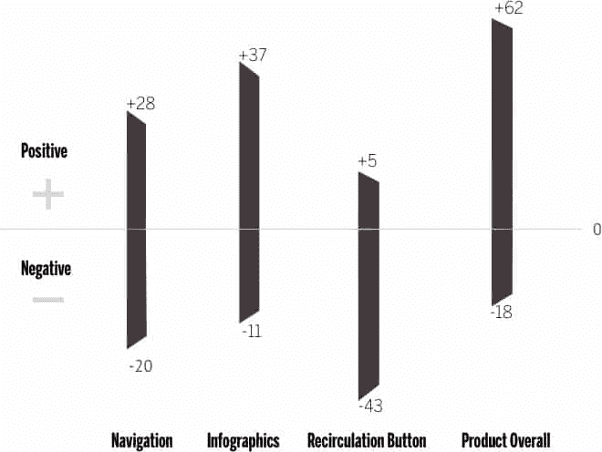

Qualitative feedback (Image source: UXpin)

所以，内部测试肯定有它的用处，但是只有当你对快速反馈的需求超过对外部有效性的关注时。对于既奖励定量数据又奖励定性数据的有效测试，您需要用户尽可能地接近您自己的用户。

接触这些用户的一个潜在方法是通过快速调查发送到你的企业的电子邮件列表来筛选潜在的参与者。如果你将调查与激励措施结合起来，即使没有彩票之类的保证，你的参与率也会上升，你会有一群真正的用户来测试你的产品。

盖洛普研究发现，即使只是 5 美元的奖励也能大大提高你的参与率。

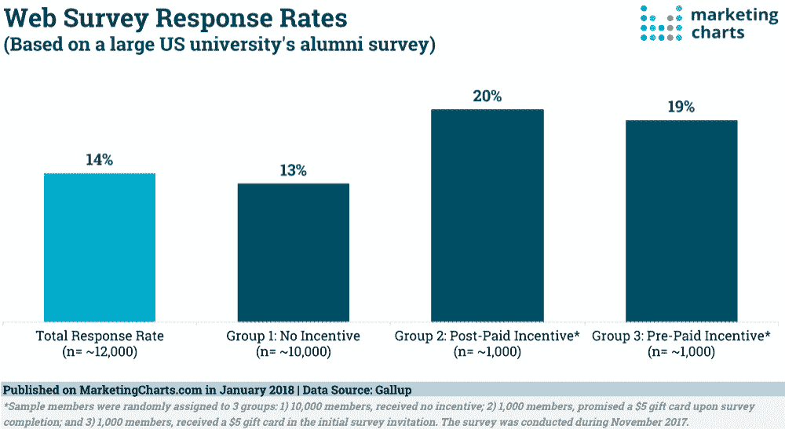

Web survey response rates (Image source: [Marketing Charts](https://www.marketingcharts.com/industries/market-research-81847/attachment/gallup-web-survey-response-rates-jan2018))

你可以使用像 [SurveyMonkey](https://www.surveymonkey.com/) 和 [Google Forms](https://kinsta.com/blog/embed-google-form/) 这样的调查平台，或者如果你使用的是 WordPress 网站，你可以使用表单生成器从潜在参与者那里获取信息。我们是 [Hotjar](https://www.hotjar.com/) 的忠实粉丝，并在 Kinsta 使用它。

也就是说，有很多原因导致真正的网站用户不可行。为此，你可以在付费平台上花很少的费用获得代理用户。让我们来看看其中的一些。

### 用户测试

被设计行业内外的一些大牌所使用， [UserTesting](https://www.usertesting.com/) 为可用性专家、营销人员、企业主、游戏开发者等提供了一个测试平台。

这款测试平台功能强大，可以将您与用户代理连接起来，并在短短两个小时内交付结果[。请注意，这是您可以安排现场测试的唯一平台之一。](https://www.usertesting.com/platform/capabilities)

Struggling with downtime and WordPress problems? Kinsta is the hosting solution designed to save you time! [Check out our features](https://kinsta.com/features/)

[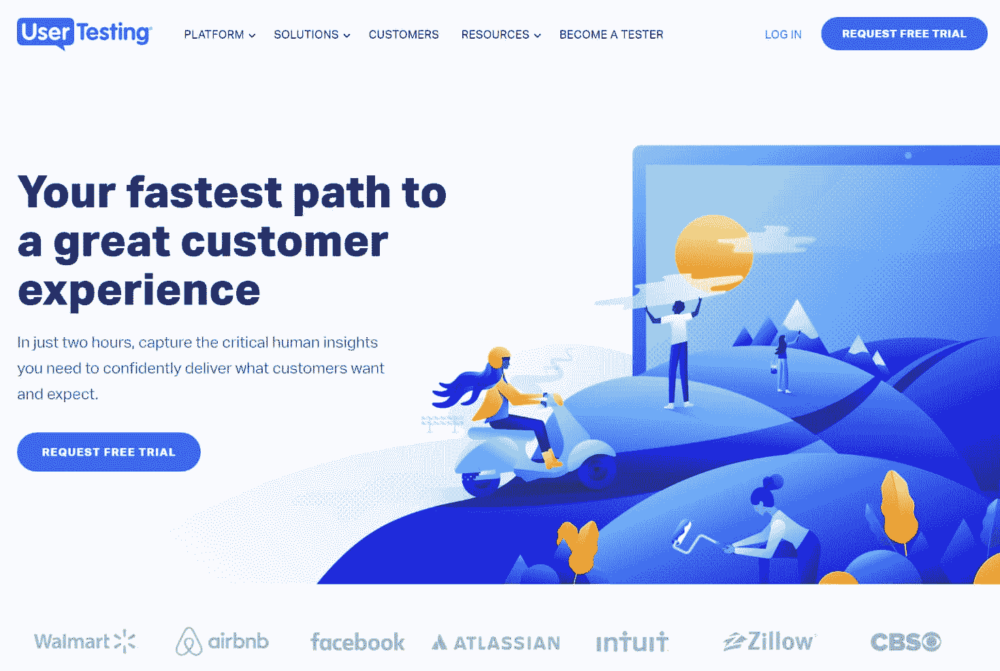](https://www.usertesting.com/)

UserTesting

### 用户分析

谷歌使用的 [Userlytics](https://www.userlytics.com/) 是另一个稳健的平台，价格适中，质量无与伦比。通过提供录制的视频，Userlytics 的测试面板拥有超过 200，000 名用户，轻松找到理想的用户代理。

使 Userlytics 区别于竞争对手的是它的可定制性范围。独特地提供分支逻辑，通过 Userlytics 的测试可以被结构化以执行多个不同的任务流。

[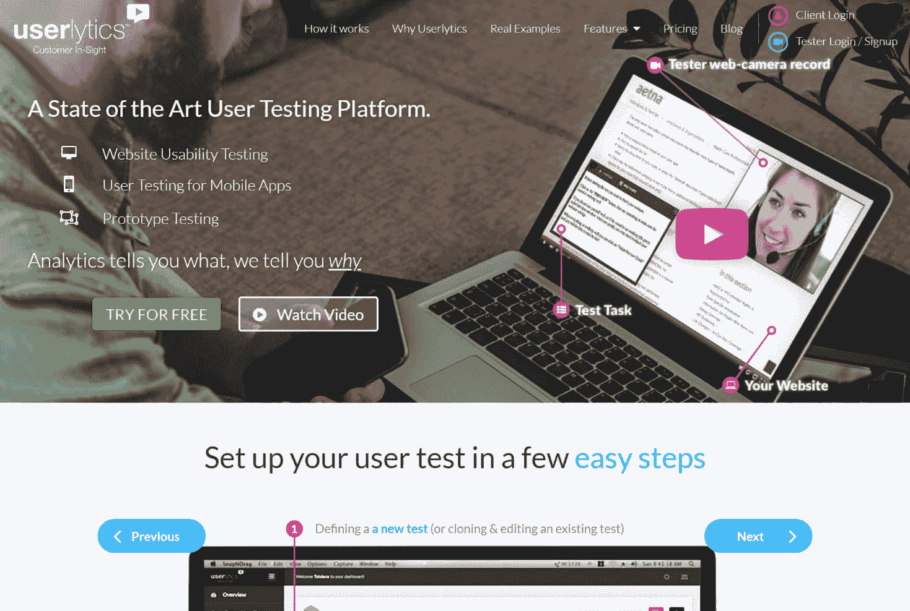](https://www.userlytics.com/)

Userlytics

现在，是时候运行您的测试了——这意味着是时候决定在哪里、什么时候以及谁将参与其中了。

## 第四步:决定时间、地点和对象

这一步可以喘口气了:最难的部分已经过去了。从这里开始，您只需要在执行测试之前再做一些决定。这些决定是:

*   远程还是亲自？
*   节制的还是不节制的？

查看它在行业中是如何分解的:

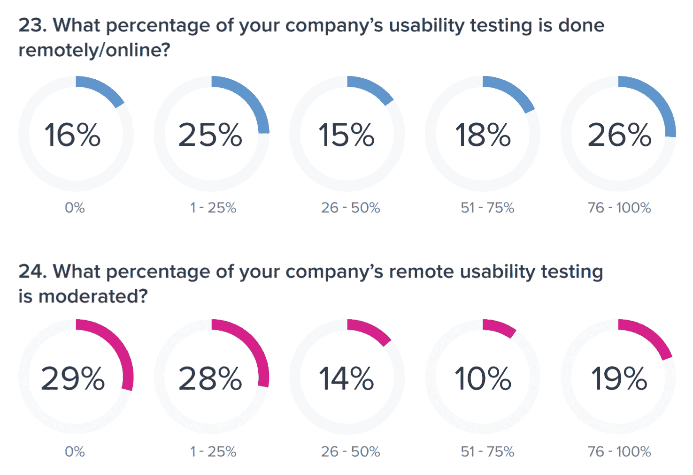

Usability testing (Image source: [UserTesting](http://downloads.usertesting.com/white_papers/UT_WP_IndustrySurveyReport_2017_Final.pdf))

正如你所看到的，远程和适度测试在整个行业中被均匀地使用，尽管适度测试正在减少。如果您从上一节提到的平台中获取您的用户测试人员，这些决定已经为您做出了，您可以跳到第五步。

如果不是，让我们回顾一下:什么是适度测试，为什么要使用它？

[主持式测试](https://www.pagewiz.com/blog/conversion-rate-optimization/usability-testing-mod-unmod)指的是让主持人或测试人员在场，回答问题并指导用户。这将更多的控制放在您的手中，但是对于测试人员和用户来说都增加了重大的逻辑挑战，尤其是如果您亲自进行测试的话。

因为主持可用性测试是它自己的艺术形式，主持测试最好由可用性专家来执行，如下图所示。

Usability specialist (Image source: [Graphic Mint](https://graphicmint.com/blog/introducing-our-usability-testing-services/))

通常，只有在不完整的接口或安全性是主要考虑因素的情况下，才需要进行适度测试。另一方面，非自主测试更加灵活，因为用户只需要在方便的时候登录并执行指定的任务。

请注意，远程测试可以是有节制的，也可以是无节制的，这取决于您的平台和目标。

对于面对面的测试，一个由[指定的可用性实验室](https://measuringu.com/build-usability-lab/)或者用户的自然环境(正如我们在实地研究中看到的)是避免人为条件的理想选择。

使用以下免费平台进行远程测试:

### 网络电话

如果你还记得我们之前章节中的 MELEWI， [Skype 是他们远程可用性测试的首选工具](http://melewi.net/blog/2017/01/23/how-to-run-a-usability-testing-sprint-remotely/)。 [Skype](https://www.skype.com/en/) 最大的好处是用户熟悉度和原生的屏幕共享。然而，这个平台的缺点是缺乏内置的屏幕录制。

[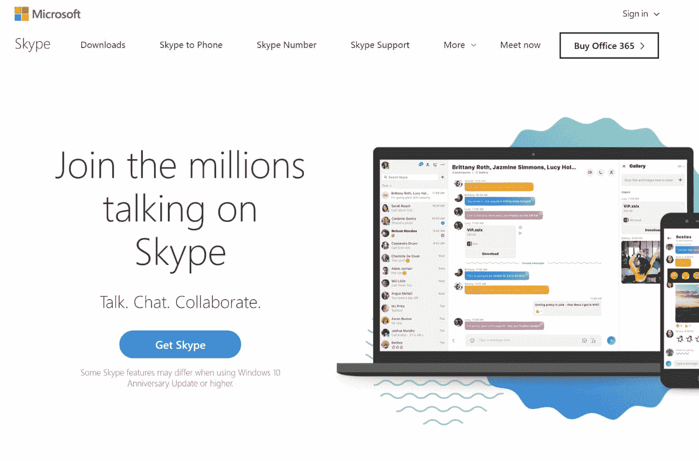](https://www.skype.com/en/)

Skype

### 谷歌视频

任何拥有谷歌账户的用户都可以使用， [Google Hangouts](https://hangouts.google.com/) 是另一个具有屏幕共享功能的免费平台。然而，只有某些类型的[谷歌工作空间账户](https://kinsta.com/blog/google-workspace/)可以本地录制视频。与 Skype 相比，Hangouts 的优势在于用户的偏好以及用户更喜欢什么。两者的功能相似，如果你没有 Google Workspace 企业帐户，还需要一个屏幕录制器。

Google Hangouts

### 一款云视频会议软件

完成我们的远程可用性测试平台列表的是 [Zoom](https://zoom.us/) 。与 Skype 或 Hangouts 相比，这个平台有一个显著的优势:它提供原生屏幕和视频录制。事实上，我们在金斯塔使用变焦。

然而，它也有一个很大的缺点。如果您的视频会议涉及多个其他用户，[免费账户有 40 分钟的时间限制](https://zoom.us/pricing)。

[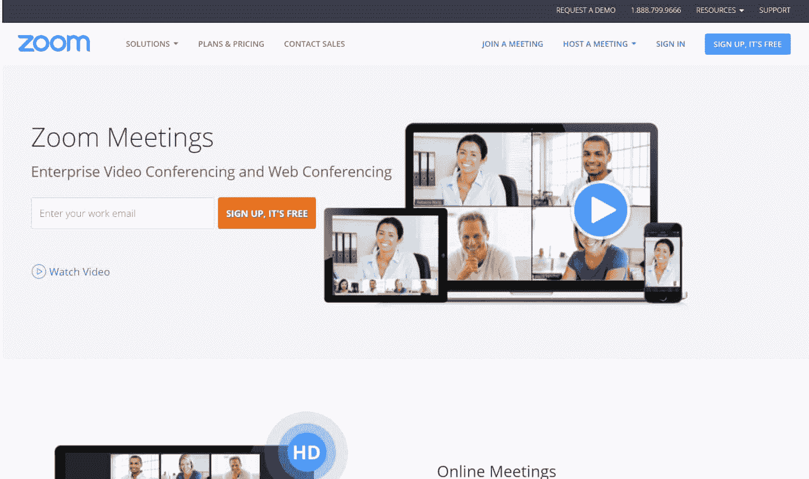](https://zoom.us/)

Zoom

请注意，您应该尽可能地记录测试。你需要这些录音来和你的团队一起回顾这些发现，并且[它们有助于保持对人](https://www.departmentofproduct.com/blog/making-sense-of-usability-test-results/)的关注，而不是数据，在你的可用性测试的中心。

到了我们最后一步的时候了:迭代。

## 第五步:冲洗并重复

迭代测试是伟大可用性的关键，尽管对于它在创新中的作用还有一些争论。迭代在设计环境中意味着什么？这意味着你的过程永远不会结束:在[创建了一个网站](https://kinsta.com/blog/wordpress-website-cost/)之后，你不断地测试、调整和**在那个网站上无休止地改进**。

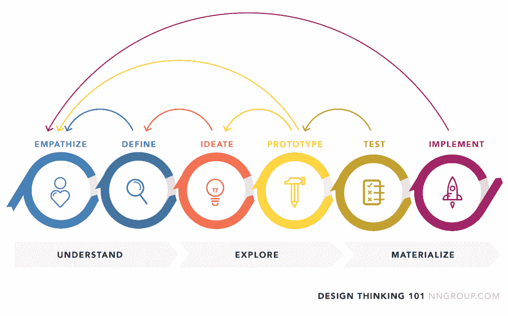

Iterative and Cyclical (Image source: [Sean Van Tyne](http://seanvantyne.com/2017/02/26/design-thinking-iterative-cyclical/))

所以，一旦你已经进行了测试并收集了结果，是时候回顾、实施并[再从头开始](https://www.interaction-design.org/literature/article/design-iteration-brings-powerful-results-so-do-it-again-designer)了。数字咨询公司 Enginess 很好地阐释了迭代设计的[价值:](https://enginess.io/insights/what-is-iterative-design)

> …一个活生生的项目，你应该在进行过程中定期调整和改进，而不是一蹴而就，一劳永逸。

记住这一点，根据你收集的数据类型和你最初的目标，你如何回顾和实现可用性测试的结果将会有很大的不同。与化学实验室不同，可用性测试倾向于奖励定量(“硬”)和定性(“软”)数据的混合体。

它们都很重要。它们的使用方式会因项目和网站的不同而不同。也就是说，定性数据往往对[数据可视化](https://kinsta.com/blog/data-visualization-tools/)最友好。最流行的可视化模式之一是通过旅行地图。

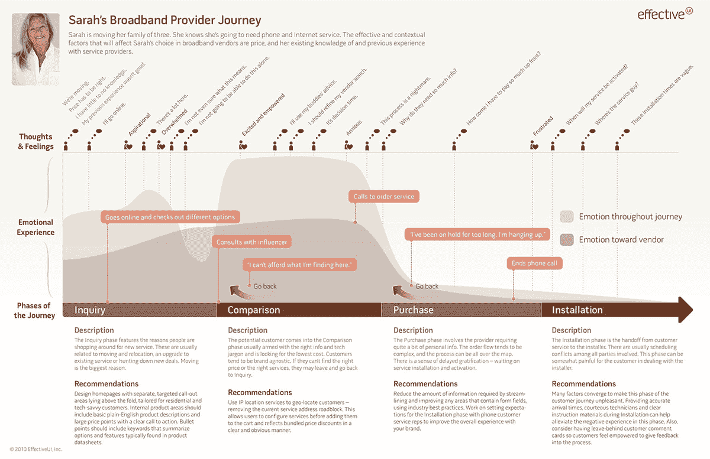

Journey map (Image source: [Sailthru](https://www.sailthru.com/marketing-blog/written-customer-journey-mapping-need-to-know/))

旅程图提供了用户测试人员在你的网站上的整个旅程中所采取的不同步骤的可视化概述。如果做得好，它[包括情感参数](https://www.tandemseven.com/journey-mapping/5-essentials-for-customer-journey-maps/)以及可用性问题，但就像你的审查过程一样，最终将由你进行的测试类型决定。

旅程图在可用性测试结束时特别有用，因为[它们有助于揭示隐藏的洞察力](https://blog.prototypr.io/journey-mapping-what-how-and-when-to-use-journey-maps-9d47c365c88a)。在创建一些旅程图之后，趋势开始变得更加明显，潜在的改进区域也更容易可视化。

另外，在团队成员之间共享统一的信息使得迭代过程更加容易。那么，你还在等什么？回到第一步，继续提高你网站的可用性。天空是无限的。

## 摘要

可用性测试对于任何在线业务来说都是绝对必要的，但这是一个广阔的领域。可用性测试的三个标准是**满意度、效率和有效性**。这些指标中哪一个对你最重要，将决定你的网站运行的可用性测试的最佳类型。

在您缩小了最适合您需求的测试类型后，是时候寻找有效的参与者了。如果可以的话，避免内部测试，如果你自己的客户不是一个可行的解决方案，寻找相近的代理。接下来，在有节制和无节制之间做出选择，然后在远程测试和现场测试之间做出选择。每一种都有自己的用途和限制，所以要仔细考虑你的选择。

一旦你的可用性测试结束，回头看看结果，看看你的网站需要什么样的改变。然后实现那些改变，并从头再来:迭代是“meh”可用性和令人难堪的可用性明星之间的区别。

下一次，当你考虑重新设计或者想改善用户体验时，请回头参考本指南，了解网站可用性测试的最终步骤。

* * *

让你所有的[应用程序](https://kinsta.com/application-hosting/)、[数据库](https://kinsta.com/database-hosting/)和 [WordPress 网站](https://kinsta.com/wordpress-hosting/)在线并在一个屋檐下。我们功能丰富的高性能云平台包括:

*   在 MyKinsta 仪表盘中轻松设置和管理
*   24/7 专家支持
*   最好的谷歌云平台硬件和网络，由 Kubernetes 提供最大的可扩展性
*   面向速度和安全性的企业级 Cloudflare 集成
*   全球受众覆盖全球多达 35 个数据中心和 275 多个 pop

在第一个月使用托管的[应用程序或托管](https://kinsta.com/application-hosting/)的[数据库，您可以享受 20 美元的优惠，亲自测试一下。探索我们的](https://kinsta.com/database-hosting/)[计划](https://kinsta.com/plans/)或[与销售人员交谈](https://kinsta.com/contact-us/)以找到最适合您的方式。