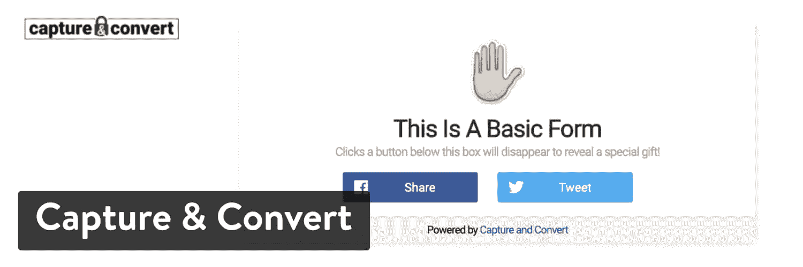
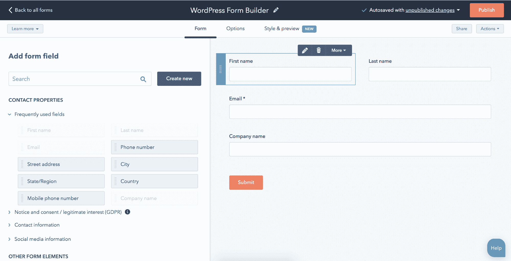

# 12 个 WordPress 潜在客户生成插件来增加你的邮件列表

> 原文：<https://kinsta.com/blog/wordpress-lead-generation/>

在商业中，潜在客户的产生往往意味着成功和彻底失败的区别。

当你开始一个代理公司、网上商店、博客或小生意时，那些访问你网站的人不会永远呆在你身边。因此，有必要建立某种系统，要么让他们呆得更久，要么促使他们回来(希望能买些东西)。最好的方法是使用最好的 WordPress 线索生成插件。

其中一些插件非常简单，两分钟就能安装完毕。它们是为那些不想弄乱代码但仍然渴望惊人的电子邮件选择表单的人准备的。一些其他的 WordPress 潜在客户生成插件像套件一样构建，包括社交媒体共享、[电子邮件营销](https://kinsta.com/blog/email-marketing-tips/)、optins 和许多其他工具。

销售线索挖掘是一个混乱的市场，因此我们希望帮助您找到适合您组织的最佳解决方案。

## 我们的 2019 年最佳 WordPress 线索生成插件入围名单

1.  [绽放](#bloom)
2.  [邮件蛋白](#mailoptin)
3.  [喊话框](#holler-box)
4.  [元素或弹出生成器](#elementor-popup-builder)
5.  [冰图](#icegram)
6.  [弹出支配](#popup-domination)
7.  [获取站点控制](#getsitecontrol)
8.  [SumoMe](#sumome)
9.  [拥挤](#hustle)
10.  [茁壮成长线索](#thrive-leads)
11.  [捕获&转换](#capture)
12.  [HubSpot WordPress 插件](#hubspot)

### 1.花

如果这是一场选美比赛，布鲁姆会得奖。这是一个优雅主题的插件，你可以通过注册优雅主题会员计划来获得。这可能会让你认为它会很贵，但事实并非如此。事实上，一个优雅的主题会员每年只需花费 89 美元，它提供对所有主题和插件的访问，包括 Bloom。因此，每年 89 美元，你就可以得到设计网站所需的所有可能的元素。还有终身访问选项，一次性费用为 249 美元。

就 Bloom 插件而言，它本质上是各种各样华丽的选择形式。这些可以放在你网站的任何地方，从边栏到内嵌的博客区域。即使快速浏览一下模板库，每个人都会看到一些东西。您可以从不同的颜色、样式、字段和主题开始。其中一些看起来很适合某些行业，而另一些则非常适合像网络研讨会这样的特殊任务。

Bloom WordPress plugin

Kinsta 在其网站上使用 Bloom optin forms(如下所示)的原因与其他许多人喜欢像这样的优雅主题产品的原因相同——它们简单又好看。总的来说，Bloom 的结构吸引了更多的电子邮件订户，并允许高度有针对性的内容。将这些与令人难以置信的设计结合起来，你就找到了一个创造销售线索的好方法。

Kinsta Bloom optin

#### 这个 WordPress 潜在客户生成插件的最佳特性

*   设计既丰富又是市场上最好看的。
*   你只需要支付每年 89 美元的优雅主题会员费，就可以访问 Bloom 插件和优雅主题提供的所有东西。
*   Bloom 有六种不同的选择表单显示类型，包括自动选择弹出窗口、飞进窗口、内容下方选择表单、小部件区域选择表单和解锁内容选择表单。
*   有几个触发器可用，您可以设置一些类似定时延迟或等待客户滚动到底部，然后再显示选择表单。
*   Bloom 提供了 16 个电子邮件营销整合，这比我们在这个列表中的一些竞争对手要多。其中包括 AWeber、MailChimp 和 Campaign Monitor。总的来说，看起来大多数著名的提供商都得到了支持。

### 2.邮件蛋白

mailot in 插件提供了行动号召、电子邮件选择表单、WordPress 弹出窗口和时事通讯功能。这是一个可靠的 WordPress 潜在客户生成插件，将客户获取和营销打包成一个包。我非常喜欢这个选项的原因之一是因为它可以与 Elementor 拖放页面生成器集成。因此，您可以使用 Elementor 创建一个表单或类似的东西，并将其与 MailOptin 结合使用。

和这个列表中的许多 WordPress lead generation 插件一样，MailOptin 有免费和[高级版本](https://mailoptin.io/pricing/)。免费版提供线索生成和简讯选项，而高级版包含从事件触发的简讯到 A/B 测试的所有内容。标准包的起价是每年 69 美元，它提供了大量的功能(比如站点选择触发器、页面定位和通知栏)。Pro 计划每年售价 169 美元，包括高级分析、回头客检测和转换备份等项目。还有一个代理版本，每年 269 美元。

MailOptin WordPress plugin

#### 这个 WordPress 潜在客户生成插件的最佳特性

*   MailOptin 提供了一个免费的电子邮件选择插件，可以选择升级到一个负担得起的年费。
*   选择表单是在 WordPress 编辑器中管理和编辑的，它们看起来简单明了。
*   该插件提供退出意图弹出窗口和滑动窗口，在特定时间触发。
*   销售线索库工具存储销售线索以及转换时间和转换地点等重要数据。简而言之，它给你的信息比普通的线索生成器多得多。

### 3.叫喊箱

如果你正在寻找一种简单、廉价的方式来产生潜在客户，并让更多的电子邮件进入你的列表，那么 [Holler Box](https://wordpress.org/plugins/holler-box/) 就是你要去的地方。它不仅在你的网站上启动简单，而且足够直观，所有经验水平的人都可以利用它。首先，相当多的功能是免费提供的，允许你测试 Holler Box 插件，看看它是否适合你。谁知道呢？你可能只需要使用免费版，或者也许你会发现[专业版](https://hollerwp.com/pro/)更适合你的情况。

免费的软件包支持无限的弹出窗口，退出意图弹出窗口，时间延迟，和滚动触发器。一些集成非常强大，包括付费会员和会员新闻。你也可以加入电子商务购买按钮，以说服人们直接从你的选择表格中购买。除此之外，免费版本集成了大多数顶级电子邮件营销程序，如 MailChimp 和 Active Campaign。

Holler Box WordPress plugin

一旦你进入了 Holler Box 的专业版，你将获得内容升级和开发者所说的 FOMO(害怕错过)选项。这些是 Holler Box 独有的，因为你可以告诉用户其他人(可能是朋友)刚刚买了东西，所以他们不应该错过。此外，专业版提供了标题横幅，高级目标过滤器，和更多的弹出设计。如果你想获得 FOMO 弹出窗口的所有免费功能，你每年需要支付 79 美元。这还包括一年的特优支持和在五个站点插入包装盒的能力。每年 99 美元，他们提供所有的专业功能，所有未来的专业插件，以及对 25 个网站的支持。

#### 这个 WordPress 潜在客户生成插件的最佳特性

*   它是由一些优秀的开发者在加利福尼亚制作的。他们提供一流的客户支持，合理的价格，当然，还有免费的插件，让你体验一下期待的东西。
*   该插件的免费版本充满了好东西，包括转化率分析、电子商务购买按钮和退出意图弹出窗口。
*   FOMO 弹出窗口是你能找到的一些更独特的潜在客户生成工具。这对电子商务销售很重要，因为如此多的用户根据其他人的行为进行购买。
*   除了收集电子邮件，你还可以完成其他任务。例如，有一个宣布事件的弹出窗口，而不会完全惹恼用户。
*   有一种工具叫做聊天电子邮件捕捉，你可以通过一个盒子和你的客户聊天，并要求他们在这个过程中输入他们的[电子邮件地址](https://kinsta.com/blog/find-email-address/)。
*   optin 表单时尚、简单且完全可定制。如果你不喜欢复杂的设置或过度的选择形式，这是为你准备的。

### 4.元素或弹出生成器

Elementor 提供了一个拖放式弹出窗口构建器、主题构建器和页面构建器，它们都内置在一个工具中。[弹出窗口生成器](https://kinsta.com/blog/elementor-popup/)被集成到 WordPress 中，这意味着你可以为任何 WordPress 页面创建弹出窗口，甚至是没有在 Elementor 中创建的。有了 Elementor，你可以使用 WordPress 的所有内容，并把它合并到你的弹出窗口中。这包括图片、帖子、WooCommerce 产品、ACF 自定义字段和几乎所有其他插件。

Elementor Popup Builder

弹出窗口可以用 WordPress 数据填充，所以你可以用你的用户名个性化弹出窗口。

在 Elementor 中创建弹出窗口意味着整个[网页设计过程](https://kinsta.com/blog/web-design-best-practices/)，从构建登陆页面、设置弹出窗口到创建一个完整的漏斗，所有这些都是通过一个工作流程完成的。你也不局限于任何设置设计，可以使用 Elementor 的各种部件和设计功能来实现任何你喜欢的弹出设计。

如果你已经在使用 Elementor Pro，你不需要安装任何额外的插件。它包含在定价包中:1 个站点 49 美元，3 个站点 99 美元，无限站点 199 美元。这些计划都没有页面浏览量的限制。

#### 这个 WordPress 潜在客户生成插件的最佳特性

*   100+设计师制作的弹出模板，包括经典，飞入，底部酒吧，全屏，你好酒吧和幻灯片。
*   每年支付 49 美元，获得弹出生成器，以及主题生成器和页面生成器。
*   卓越的设计，拥有 Elementor 的所有功能、特性和[小部件](https://kinsta.com/blog/wordpress-widgets/)。
*   一个接口，没有来回切换。
*   包括来自 Elementor、WordPress、WooCommerce 和网站的内容。
*   零设置，无需安装另一个插件(内置 Elementor Pro)。
*   没有浏览量，弹出窗口或网站的限制。
*   高级定位:基于页面、基于时间、基于设备和基于访问者的定位，行为驱动的定位(点击、滚动、表单提交等)。
*   退出意图弹出功能。
*   响应设计编辑。
*   电子邮件营销整合: [MailChimp](https://kinsta.com/blog/how-to-use-mailchimp/) 、滴滴、ActiveCampaign、ConvertKit、HubSpot、Zapier、GetResponse、MailerLite、MailPoet、 [Slack](https://kinsta.com/blog/slack-vs-discord/) 、Discord。
*   创建和管理多个弹出窗口的最快工作流程。

### 5.冰图

使用 [Icegram](https://wordpress.org/plugins/icegram/) 插件，您可以收到欢迎栏、选项和其他一些线索生成工具。这是一个免费插件，有几个高级插件可以打包购买。免费版提供了从信使到操作栏，从弹出窗口到祝酒词的一切。升级后，您将每年支付 97 美元购买 Pro 计划，包括退出意向定位、活动统计、徽章和内嵌消息。最后，每年 147 美元的计划提供了一些更高级的功能，如 A/B 测试、地理定位和退出动画。

我并不热衷于将 A/B 测试列入最昂贵的计划，但有时事情就是这样。我之所以会考虑 Icegram，主要是因为它有几个独特的功能，比如徽章、信使、贴纸和丝带。

Icegram WordPress plugin

使用免费版本完全有可能运行您的整个线索捕获操作，但我有一种感觉，大多数公司会发现一些高级功能是必需的。

#### 这个 WordPress 潜在客户生成插件的最佳特性

*   Icegram 插件提供了一个完全免费的计划，可以访问模板库和一些弹出窗口工具。
*   借助退出意图营销、高级定位和简单的 A/B 测试，您将能够锁定您的客户。将此与可操作的报告相结合，您就可以向客户提供最相关的内容了。
*   该插件提供了 12 种选项，您可以在几分钟内创建所有选项。一些选择形式包括弹出窗口、浮动操作栏、内嵌和信使来吸引访问者。
*   地理定位工具有助于根据您的客户所在的城市、州、国家或洲来确定他们的需求。
*   Icegram 有一个行动号召功能，允许你在选项中包含表单、链接和下载等内容。

### 6.弹出控制

弹出控制可以集成到任何类型的网站中，而不仅仅是 WordPress。也就是说，它提供了 14 天的免费试用期来测试这项服务，看看它是否适合你。试用后，你可以注册入门包，每月 9 美元，可以让你的弹出窗口获得 10，000 次浏览。下一个级别是 30，000 次浏览每月 19 美元，然后是 100，000 次浏览每月 29 美元。正如您所看到的，定价更加灵活和容易理解，因为它只依赖于弹出选项表单视图。如果没有那么多人来你的网站，就没必要花那么多钱。

所有的弹出控制功能都包含在每个计划中。这些表单是为了增加订户和销售额而构建的，而这一切都是通过将一些 HTML 代码复制并粘贴到您的网站中来完成的。因此，从技术上讲，你可以将这些表格整合到网站的任何部分。这不像 WordPress 插件那么简单，但是你不需要成为开发专家。

Popup Domination WordPress plugin

虽然很难击败来自 Bloom 插件的视觉奇观，但 Popup Domination 在制作可比较的设计方面做得很好。你可以找到带有倒数计时器、多个字段、图像、美丽的颜色和动画的选择表单。你也可以选择标准的电子邮件选择主题，或者把它改成一些独特的东西，比如带有重定向到另一个页面的选择表单。

如前所述，所有的弹出控制计划都有相同的特点。因此，你不必担心会错过另一个计划中的某些东西。这意味着所有客户都可以进行 A/B 测试，以及分析、弹出触发器和退出弹出窗口。

## 注册订阅时事通讯

### 想知道我们是怎么让流量增长超过 1000%的吗？

加入 20，000 多名获得我们每周时事通讯和内部消息的人的行列吧！

[Subscribe Now](#newsletter)

#### 这个 WordPress 潜在客户生成插件的最佳特性

*   弹出控制模板库提供了各种各样的选项，具有不同的颜色、样式、大小、位置和功能。所以，你可能会有一个是/否弹出窗口，或者从电子邮件选项到定时器和进度条的任何东西。
*   这个价格让你很容易决定你应该选择哪个套餐。所有的功能都包含在每个计划中，所以你只需要担心你的选择表单弹出窗口会被多少人看到。
*   我真的很喜欢重定向主题，这是一种弹出形式，将人们发送到其他地方，如销售和代销商页面。
*   你可以获得所有的基本功能，如退出意图弹出窗口、弹出触发器和 A/B 测试，所有这些都不需要支付太多费用。
*   由于该应用程序是通过粘贴简单的 HTML 代码安装的，您不必担心 Popup Domination 是否有适用于您的网站平台的插件或附加组件。这样，几乎每个人都可以享受弹出控制。

### 7.GetSiteControl

正如你在下面的 [GetSiteControl](https://wordpress.org/plugins/getsitecontrol/) 插件图中所注意到的，它创建的远不止是标准的弹出表单。您还可以获得调查、关注按钮、共享工具、聊天框等等。绝大多数公司会用免费版做得很好，但是如果需要的话，你可能会考虑[升级到高级或专业计划](https://getsitecontrol.com/pricing/)。免费选项提供所有部件类型、频率设置、无限部件、自定义颜色和时间安排，全部用于一个站点。你每月为 Plus 计划支付 19 美元，但它支持更多的月度视图，你可以得到像集成、启动触发器和退出弹出窗口这样的东西。最后，Pro 计划允许无限制的视图，并允许管理多个用户和用户访问权限。

GetSiteControl WordPress plugin

正如我提到的，我觉得大多数个人和组织在一开始会对免费计划感到舒服。它附带了一个聊天小工具，用于与您的客户交谈并提供快速的客户支持。还有一个订阅小部件用于[建立你的电子邮件列表](https://kinsta.com/blog/how-to-build-an-email-list/)，它可以很好地与超过 25 个电子邮件集成配对。除了电子邮件线索生成工具之外，您还可以生成反馈调查和联系窗口小部件，以便人们发送电子邮件。

promo 小部件非常适合发送任何类型的通知，例如销售和折扣等促销消息。你还可以在这个插件中找到一些社交分享和关注按钮，这样就不需要为了同样的目的下载一个完全不同的插件了。

#### 这个 WordPress 潜在客户生成插件的最佳特性

*   GetSiteControl 插件在免费版本中提供了相当大的冲击力，在九个小部件位置提供了选择表单，以及调度、自定义颜色、实时统计和响应小部件等功能。
*   这不仅仅是一个 WordPress 潜在客户生成插件，因为它提供了其他优秀的功能，如联系人窗口部件、推广窗口部件、分享按钮和聊天框。
*   GetSiteControl 有激活退出意图弹出窗口的选项，这是让人们留在你的网站上的必要条件。
*   谷歌分析集成确保您收到关于您选择的最佳信息。
*   GetSiteControl 插件会自动将 optin 表单颜色与您网站上的颜色进行匹配。
*   您可以尝试一下 A/B 测试，看看哪种策略最有效。
*   这些调查有助于了解用户对你网站的喜好。您甚至可以将这些工具与您的潜在客户生成工具相集成，就像在电子邮件营销活动中一样。

### 8.SumoMe

SumoMe 平台是市场上比较知名的 WordPress 线索生成插件之一。最好去[的主要相扑网站](https://sumo.com/)全面了解提供什么，并了解你可以支付多少。对于较小的网站，如果你想要一些带有自动回复、访问者定位和电子邮件活动的电子邮件收集工具，Sumo 是有意义的。然而，该免费计划仅限于 200 名用户，所以如果你的公司在增长，你会很快用完空间。

在那之后，相扑组合给人留下了非常深刻的印象。然而，价格上涨很快。例如，职业计划是为博客作者和顾问设计的。它每月售价 24 美元，但仍然只允许 750 名用户。但你开始进入更高级的功能，如 A/B 测试、点击触发器和浏览器推送通知。

SumoMe WordPress plugin

如果你想要无限的用户，你必须跳到每月 59 美元的小企业计划。这增加了一些内容升级和一个用于客户支持的聊天框。最终的计划被称为电子商务，每月 199 美元。它有折扣代码和 Shopify 集成。如你所见，相扑并不便宜。然而，它是为了将你的线索转化为客户，并说服他们更经常地购买。

#### 这个 WordPress 潜在客户生成插件的最佳特性

*   相扑提供了一个免费计划，支持多达 200 名订户和基本的电子邮件集成。
*   Sumo 服务附带了几个插件，包括 WordPress、 [Shopify](https://kinsta.com/blog/woocommerce-vs-shopify/) 、 [Bigcommerce](https://kinsta.com/blog/woocommerce-alternative-bigcommerce/) 和 [Magento](https://kinsta.com/magento-market-share/) 。
*   电子邮件选择形式是现代和灵活的，有一个强大的建设者定制你想要的。
*   您收到的不仅仅是带有全套套装的电子邮件选择表。例如，一些计划有内容分析、社交分享按钮和其他有趣的工具，如热图。
*   我们喜欢相扑的一个主要原因是因为全屏欢迎垫。这将覆盖整个屏幕，并提示人们在继续前进之前注册你的电子邮件列表(或完成一些其他任务)。
*   所有工具都整合到仪表板的一个区域中。其中一些还可以相互集成，形成流畅的工作流程。

### 9.推

与优雅的主题类似，WPMUDEV 出售的是会员资格，而不是单个产品。因此，你每月支付 49 美元(30 天试用期后)就可以获得完整网站开发所需的所有插件。这包括安全、营销、搜索引擎优化、性能等等。因此， [Hustle 插件](https://wordpress.org/plugins/wordpress-popup/)也与这个高级会员一起被扔了进去。然而，Hustle 也有一个免费版本，有弹出窗口、幻灯片、嵌入和定制内容广告。其中大部分在免费版本中非常有限(比如一个免费的电子邮件选择表)，但是如果你需要更多，你可以随时升级到月费。

Struggling with downtime and WordPress problems? Kinsta is the hosting solution designed to save you time! [Check out our features](https://kinsta.com/features/)

Hustle WordPress plugin

我个人不认为免费版本对大多数企业有用，所以我将主要介绍高级功能。总的来说，该插件旨在通过滑动窗口、社交分享和弹出窗口将你的网站访客转化为忠实用户或潜在客户。这些表格引起了人们的注意，并与所有主要的电子邮件提供商合作良好。您可以采用预先构建的布局，并对其进行调整以适应您自己的品牌，同时还可以使用指标来了解您带来了多少潜在客户。

WPMUDEV 的定价并不完全是最便宜的，但是你知道你至少得到了令人难以置信的插件选择。我最喜欢开发商和代理商。有一两个站点的可以跳过。

#### 这个 WordPress 潜在客户生成插件的最佳特性

*   有一个免费的 Hustle 插件可以测试，看看你是否喜欢它。
*   WPMUDEV 会员资格可以让你访问超过 100 个插件，而不仅仅是 Hustle。
*   Hustle 模板是现代的和最小的，允许你快速设计它们，并确保它们不会打扰你的客户。
*   简单的设计选项有助于保持您的表单与您的品牌保持一致。
*   您还可以访问一些社交分享按钮。
*   更独特的功能之一是当用户激活广告拦截器时，滑入功能仍然会显示出来。
*   你可以选择在访问者离开之前用退出意图弹出窗口抓住他们。

### 10.壮大销售线索

Thrive Leads 是 WordPress 社区中另一个非常受欢迎的 lead generation 和 optin form 插件，拥有令人难以置信的功能集。同一个团队构建和开发 Thrive 主题，但是你可以使用任何主题的插件。当涉及到构建产品时，他们总是非常注重转换，这是一个巨大的红利！如果有一种最大化转化率的方法，你可以指望这些家伙在他们的插件中实现它。

它有几乎所有你能想到的选择形式，并与所有流行的电子邮件营销提供商整合。它还包括高级报告、A/B 测试引擎以及可操作的报告和见解。如果你是一个数据迷，这可能是你应该使用的线索生成插件。1 个许可证 67 美元，或者你可以花 97 美元买 5 个许可证。如果你对使用 Thrive WordPress 的其他产品感兴趣，你可以通过 19 美元/月的会员资格立即访问他们的所有内容。

Thrive Leads WordPress plugin

#### 这个 WordPress 潜在客户生成插件的最佳特性

*   该插件由数据和转换驱动。
*   拥有 40 多个直接的 API 集成:MailChimp、Drip、 [MailGun](https://kinsta.com/knowledgebase/mailgun-wordpress/) 、 [SendGrid](https://kinsta.com/knowledgebase/sendgrid-wordpress/) 、邮戳、GetResponse、Aweber 等等。
*   9 种可选表单类型:灯箱覆盖(弹出)、两步可选、可选小部件、内容内表单、功能区、滑入、屏幕填充、内容锁定和多步表单。
*   惊人的优化规则，把你的 CRO 自动驾驶。
*   大量高级瞄准选项。

### 11.捕获和转换

[Capture & Convert](http://captureandconvert.io) 附带 5 个“小工具”,供营销人员添加到他们的工具包中:

*   电子邮件解锁部件–使用他们的电子邮件部件来捕获标准电子邮件(时事通讯等)。)或作为内容升级的途径(电子书、清单等)。
*   关注以解锁 widget–吸引访客在社交媒体上关注您。这是为数不多的支持 YouTube 和 Instagram 的 WP 插件。
*   分享解锁小工具——“锁定”小工具背后的内容升级，以换取社交媒体上的分享。
*   行动号召小部件–如果你想推广一个新的案例研究、产品或博客文章，使用这个小部件在你的博客文章中插入一个横幅，将流量带到你想要的位置。
*   浮动窗口小部件——这个小部件不显眼地位于访问者屏幕的底部。一直在眼前，从不讨厌。

表单模板库提供了几十个干净、时尚、流行的设计模板，开箱即用。它们还内置了定制表单的功能。很容易将[字体](https://kinsta.com/blog/best-fonts-for-email/)、颜色、添加徽标和自定义图像与您的小工具设计相匹配。

该插件也有高级版本。免费版只允许你在一个网站上使用，有有限的表单模板，并且可以访问 5 个窗口部件中的 3 个。高级版本(起价 19 美元/月)让你可以访问更多的模板、所有的小工具，并在更多的网站上使用。

Capture & Convert WordPress plugin

#### 这个 WordPress 潜在客户生成插件的最佳特性

*   有一个免费的 Capture & Convert 版本，它比你日常的 WordPress 任务需要的更多。
*   它运行在短代码上，这意味着你可以很容易地定制它，以提供个性化的选择加入
*   有了高级版本，有大量的选项来定制表单，使它们与您的品牌相匹配。
*   该插件是轻量级的。
*   良好的支持，即使是免费版本。

### 12.HubSpot WordPress 插件

如果你正在寻找一个免费的，集营销、销售和客户服务于一体的插件，这就是适合你的插件。有了 [HubSpot WordPress 插件](https://www.hubspot.com/products/wordpress)，你有几个选项[在你的网站](https://kinsta.com/blog/b2b-lead-generation/)上捕捉线索。一旦有了这些线索，它们就会自动存储在永远免费的 HubSpot CRM 中。然后，您可以使用这个联系数据库进一步跟踪信息或对信息进行细分，用于[的电子邮件营销活动](https://kinsta.com/blog/email-marketing-best-practices/)。

HubSpot WordPress Plugin

使用这个插件，您可以[创建线索捕获表单](https://kinsta.com/blog/how-to-build-an-email-list/)、弹出窗口、顶部横幅和滑动框。只需使用拖放式表单构建器来构建表单，并控制您从销售线索中收集的信息。

除了表单之外，HubSpot 还可以通过其免费的实时聊天模块帮助你创造商机。此模块允许您的团队与网站访问者互动，并提供实时销售信息或客户支持。

#### 这个 WordPress 潜在客户生成插件的最佳特性

*   使用 HubSpot 基于访问者行为的高级过滤功能，选择您希望弹出窗口显示在哪些页面上。
*   利用实时聊天和聊天机器人构建器功能挖掘潜在客户。
*   内置[分析](https://kinsta.com/blog/how-to-use-google-analytics/)和仪表盘。
*   免费-永久，无限的 CRM 包括在插件中，以帮助存储和管理您的线索和联系人。
*   300+原生集成，包括[重力形态](https://kinsta.com/blog/wordpress-contact-form-plugins/#gravity-forms)、 [WooCommerce](https://kinsta.com/blog/woocommerce-tutorial/) 、[条纹](https://kinsta.com/blog/stripe-for-wordpress/)等等。
*   与 Zapier 配合使用效果极佳，因此您可以轻松地将工具连接在一起。

## 额外资源

寻找更多的销售线索挖掘策略？查看这些 [20 个产生潜在客户的想法](http://blog.close.io/lead-generation)，这些想法为 Close.io 带来了 20 万个潜在客户。或者如果你经营一家网上商店，这里有一些[独特的电子商务策略](https://kinsta.com/blog/ecommerce-strategies/)。如果你想为你的企业找到最好的电子邮件营销软件，我建议你看看我们关于 [Mailchimp](https://kinsta.com/blog/how-to-use-mailchimp/) 及其[替代品](https://kinsta.com/blog/mailchimp-alternatives/)的文章。

## 哪个 WordPress 潜在客户生成插件适合你？

正如你所看到的，并不是所有的 WordPress 潜在用户插件都是一样的。有些具有众多的特性和完整的套件，而其他的更像是选择加入表单库。

如果你对使用哪个插件还有疑问，看看我们下面的建议。

*   **最简单、轻量级的 WordPress 线索生成插件**–Holler Box。
*   如果你想要最好看的 optin 形态——Bloom 或者 Elementor。
*   **对于最简单的定价**–弹出控制。
*   **如果你是一个关注转化的数据迷**——发展销售线索。
*   **获得一整套选项表单和其他工具，如聊天框和调查**–GetSiteControl、SumoMe 或 Elementor。
*   **如果你经营着一家开发公司的代理机构，并且需要为许多网站提供潜在客户**–赶快行动。

这就是我们要说的关于 WordPress lead generation 插件的全部内容！如果你对这篇文章有任何疑问，或者你想解释你使用一些插件的经历，请在下面的评论中告诉我们。

* * *

让你所有的[应用程序](https://kinsta.com/application-hosting/)、[数据库](https://kinsta.com/database-hosting/)和 [WordPress 网站](https://kinsta.com/wordpress-hosting/)在线并在一个屋檐下。我们功能丰富的高性能云平台包括:

*   在 MyKinsta 仪表盘中轻松设置和管理
*   24/7 专家支持
*   最好的谷歌云平台硬件和网络，由 Kubernetes 提供最大的可扩展性
*   面向速度和安全性的企业级 Cloudflare 集成
*   全球受众覆盖全球多达 35 个数据中心和 275 多个 pop

在第一个月使用托管的[应用程序或托管](https://kinsta.com/application-hosting/)的[数据库，您可以享受 20 美元的优惠，亲自测试一下。探索我们的](https://kinsta.com/database-hosting/)[计划](https://kinsta.com/plans/)或[与销售人员交谈](https://kinsta.com/contact-us/)以找到最适合您的方式。