# 如何在你的 WordPress 站点上设置 Sucuri 防火墙

> 原文：<https://kinsta.com/blog/sucuri-firewall/>

机器人流量比以往任何时候都高。据[distilt Networks](https://resources.distilnetworks.com/whitepapers/2018-bad-bot-report)统计，2017 年，**不良僵尸工具占所有网站流量**的 21.8%，比上年增长 9.5%。不仅如此，74%的不良 bot 流量是由中等或复杂的 bot 组成的，它们通过将攻击分布在多个 IP 地址上或模拟人类行为来逃避检测。对于不知道如何过滤或阻止这类流量的企业来说，这是一个挑战。

今天，我们想向您介绍一种非常简单的方法，使用 Sucuri Web 应用程序防火墙(WAF)进行反击。无论你的 WordPress 网站是否受到 DDoS 攻击，或者你正遭受过多的僵尸程序和代理流量，WAF 可以帮助你立即解决这些问题。

下面我们将深入探讨如何在你的 WordPress 站点上设置 Sucuri 的防火墙，以及最佳设置和你应该选择的计划，以获得最佳效果。

*   [关于苏库里晶片](#sucuri)
*   你需要苏库里吗？
*   [推荐苏库里计划](#sucuri-plan)
*   [如何设置 Sucuri 防火墙](#sucuri-firewall)
*   [最佳 Sucuri 设置](#sucuri-settings)

## 关于苏库里瓦夫

[Sucuri](https://sucuri.net/) 是一个一体化的网站安全平台，有助于保护您的企业免受安全威胁，并减少已经在进行的攻击。他们提供各种不同的产品和服务，如 CDN、恶意软件扫描、黑客修复、DNS 监控、文件更改检测、暴力保护等等。

[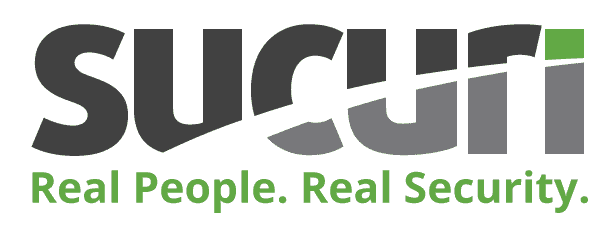T2】](https://sucuri.net/)

今天，我们只关注一个产品，那就是 Sucuri 网络应用防火墙(WAF)。Sucuri 防火墙是基于云的，旨在阻止网站黑客和攻击(包括不良流量)。它是如何工作的？本质上，你把你的域名指向他们，他们把你的流量路由到你的 WordPress 主机。[网络应用防火墙](https://kinsta.com/blog/what-is-a-firewall/#web-application-firewall)位于中间，在流量到达你的主机之前阻止它。

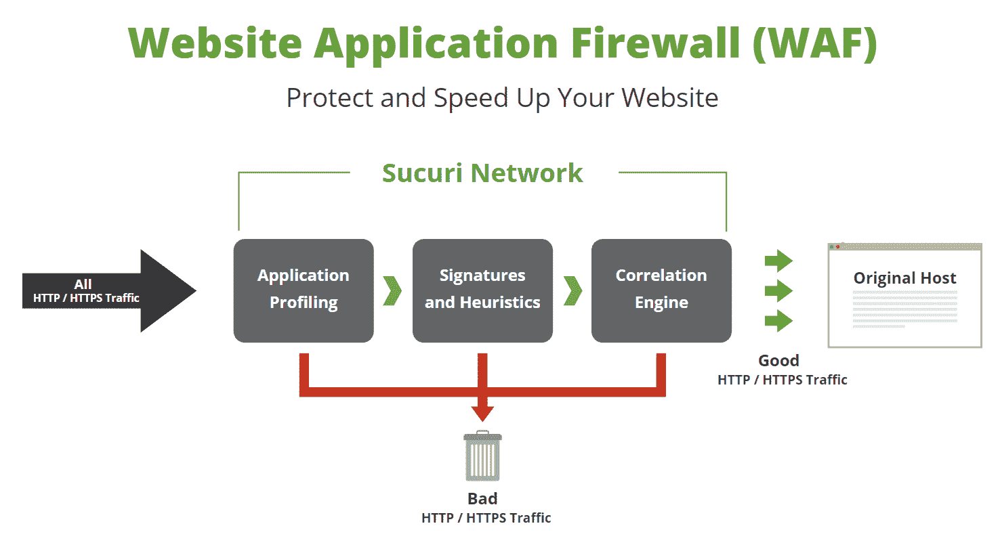

Web Application Firewall (Image Source: [Sucuri](https://sucuri.net/website-firewall/))


Sucuri 的团队一直在研究新的方法，以提高对不断演变的威胁的检测和缓解能力。他们甚至允许您添加自己的自定义规则，这使得他们的服务非常强大！


## 你需要苏库里吗？

你真的需要像 Sucuri 这样的服务吗？看情况。在你的 WordPress 站点和你的主机提供商之间有一个网络应用防火墙绝对不是一件坏事。😉事实上，这很可能会节省你的时间和麻烦。

[Sucuri is a bodyguard for your WordPress site. ⛔ Say no to bad traffic. @sucurisecurityClick to Tweet](https://twitter.com/intent/tweet?url=https%3A%2F%2Fkinsta.com%2Fblog%2Fsucuri-firewall%2F&via=kinsta&text=Sucuri+is+a+bodyguard+for+your+WordPress+site.+%E2%9B%94+Say+no+to+bad+traffic.+%40sucurisecurity&hashtags=websec%2CWAF)

不幸的是，我们通常不会看到客户使用像 Sucuri 这样的服务，直到他们开始遇到问题。最常见的情况是 [DDoS 攻击](https://kinsta.com/blog/what-is-a-ddos-attack/)以及来自僵尸程序和代理服务器的不良流量。当我们说“坏”的时候，我们并不总是指有人试图黑你的网站。大多数时候，实际上是大量的流量导致了主机提供商的超龄问题。这可能是在访问，带宽等方面。换句话说，这是“糟糕”的交通，因为它花了你的钱！如果你使用共享主机提供商，甚至可能导致你的 WordPress 站点被暂停。

下面是一个网站的例子，该网站在一夜之间突然受到不良代理 IP 流量的攻击。我们可以看到使用 [MyKinsta analytics](https://kinsta.com/help/mykinsta-analytics/) 的确切时间。该网站从平均每天 125 次访问增加到每天 1500 次访问(不幸的是，这不仅仅是暂时的病毒式流量)。它还从每天使用 25 MB 带宽增加到每天 25 GB 带宽。呀！

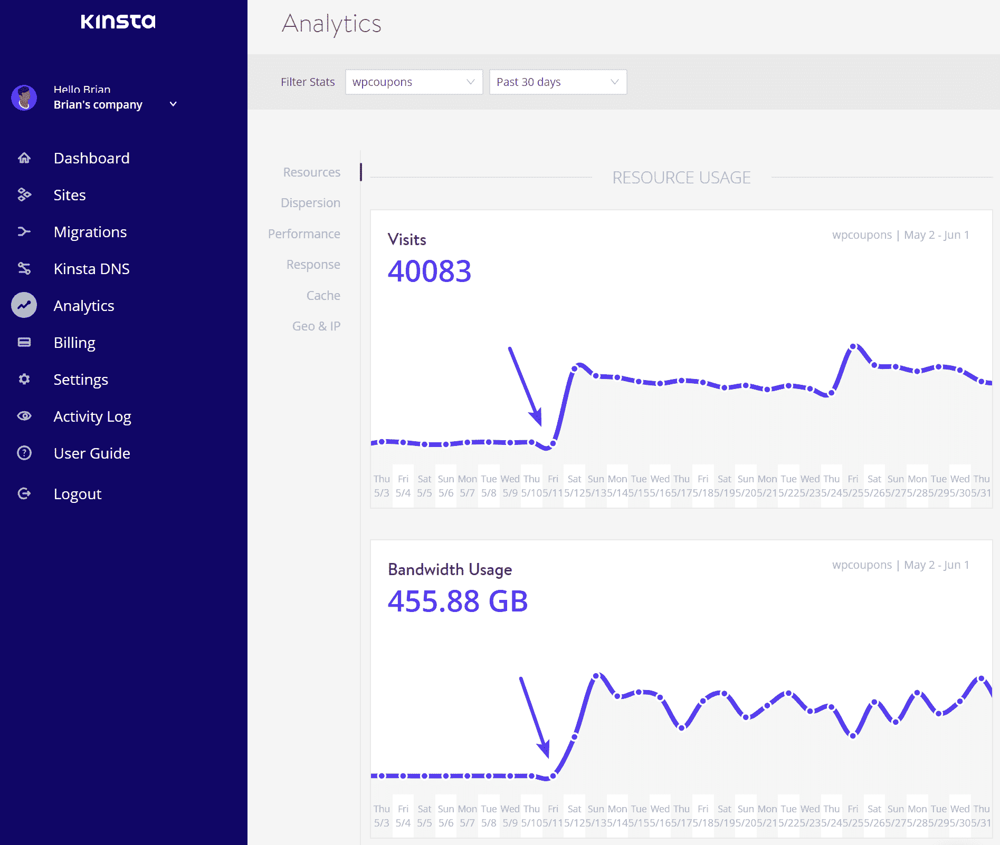

Bot and proxy traffic


深入分析后，我们可以看到访问该网站最多的地区是阿雷佐省，在过去的 30 天内有超过 400 万次请求。这个网站通常有超过 90%的流量来自美国，所以我们可以很容易地找到它的源头。

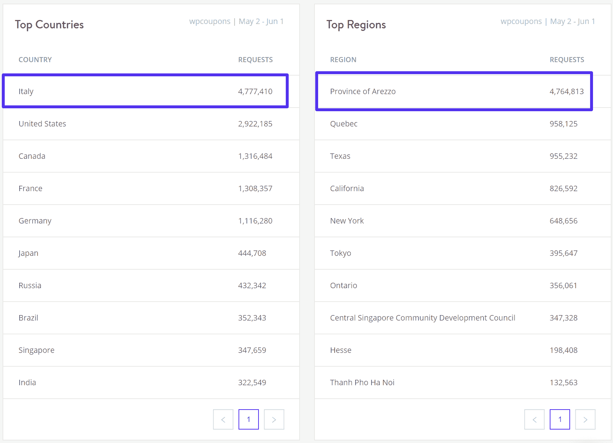

Spam traffic by region


包括 Kinsta 在内的大多数主机提供商都会阻止常见的不良僵尸程序，过滤掉垃圾 IP，并进行额外的安全设置，如 IP 限制。然而，这通常不如 Sucuri 或 Cloudflare 等专业 WAF [有效，它们的整个商业模式都围绕着创新，以更好的方式过滤不良流量。](https://kinsta.com/blog/cloudflare-settings-wordpress/#firewall)

这也是为什么我们不推荐使用你的 WordPress 主机来托管电子邮件。只使用各自领域和行业中最好的工具和服务，将有助于你的企业取得成功。我们专注于我们最擅长的领域，那就是提供高性能的托管和世界一流的支持。👍
T3】

### 在苏库里之前要做的事情

如果你的 WordPress 站点遇到流量不佳的问题，在添加 Sucuri 之前，你可以做一些尝试。

#### 1.手动阻止单个 IP 地址

第一种是尝试**手动拦截违规的 IP 地址**。如果你是 Kinsta 的客户，你可以使用 MyKinsta Analytics 中的[顶级客户 IPs](https://kinsta.com/help/mykinsta-analytics/#top-ips) 报告来查看顶级违规者。

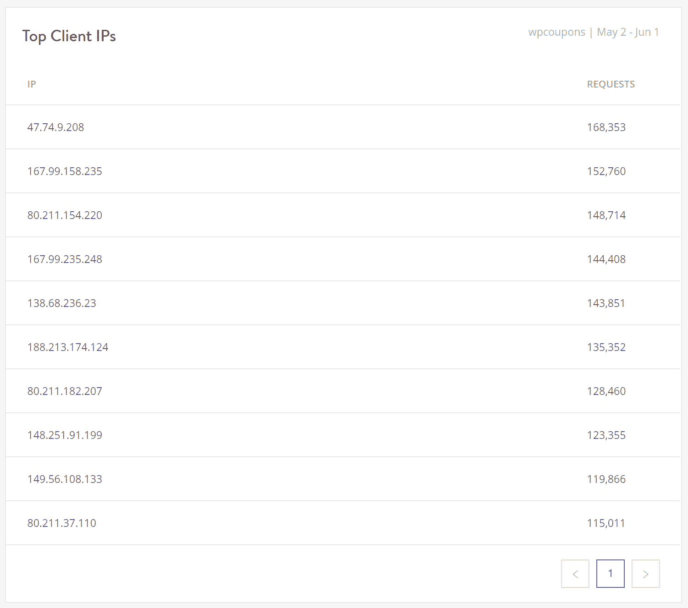

Top client IPs


在谷歌上搜索一下 IP 地址，我们可以看到很多 IP 地址可能来自意大利(阿雷佐省就在那里)。所以他们很可能是机器人或垃圾邮件发送者。

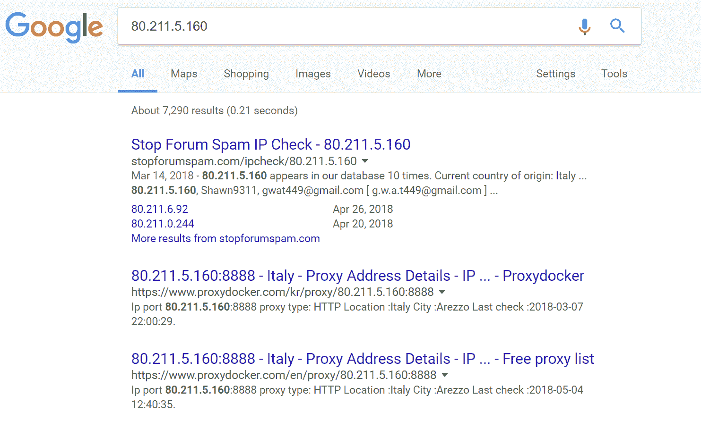

Proxy IP addresses


然后，您可以使用 [IP 拒绝工具](https://kinsta.com/knowledgebase/block-ip-address/)来阻止 IP 地址。随后监控你的访问和带宽，看看它是否能解决问题。在某些情况下，它可能只是一对夫妇坏 IP 打你的网站，一旦被封锁，你就可以走了。然而，它也可能变成一个永无止境的将 IP 列入黑名单的过程，这并不能足够快地解决问题。


Blocked IP addresses


如果你不是 Kinsta 客户端，你可以使用众多安全插件中的一个，其中很多都有 IP 拦截和限制功能。

但是要小心这种方法。许多安全插件由于其始终在线和扫描功能而导致性能问题。这就是为什么 Kinsta [禁止](https://kinsta.com/knowledgebase/banned-plugins/)一些(不是全部)安全插件的原因。Kinsta 还利用谷歌云平台的负载平衡器，这意味着在某些情况下，一些安全插件的 IP 阻止功能不会像预期的那样工作。

#### 2.地理阻塞

另一个建议是**阻止来自整个地区或国家的流量**。事实上，Kinsta 确实支持地理封锁。您只需联系我们的支持团队，并提供您想要阻止的国家的 [ISO 代码](https://dev.maxmind.com/geoip/legacy/codes/iso3166/)。查看更多关于[基于位置的交通拒绝](https://kinsta.com/help/ip-geolocation/)的细节。

或者你可以尝试使用 WordPress 安全插件，比如支持地理屏蔽的 [IP 位置屏蔽](https://wordpress.org/plugins/ip-location-block/)或 [WordFence](https://wordpress.org/plugins/wordfence/) 。同样，这些在 Kinsta 上不受支持，也不会起作用。

如果上面的解决方案不适合你，我们建议你实现一个高级的 WAF，比如 Sucuri。没有插件需要安装或管理，它只是位于你的网站和你的主机之间。就性能而言，这是最好的方法，然后它会像变魔术一样，消除所有糟糕的流量！


## 推荐的 Sucuri 防火墙计划

我们推荐 Sucuri Pro 防火墙计划或更高版本。为什么？因为他们的 [Pro 计划](https://sucuri.net/website-firewall/)(20 美元/月)包括对定制 SSL 证书的支持，以及在第 3、4 和 7 层的高级 HTTPS DDoS 保护。如果您感到好奇，Cloudflare 在其 200 美元/月的计划中仅包括第 7 层保护。

这有助于自动检测流量的突然变化，并防止 POST floods 和基于 DNS 的攻击，因此它们永远不会到达您的原始服务器。除非您是安全专家，否则有时很难区分小型 DDoS 攻击和淹没您站点的简单恶意流量。

> HTTP flood 攻击是一种第 7 层应用程序攻击，它利用标准的有效 GET/POST 请求来获取信息，如在典型的 URL 数据检索(图像、信息等)中。)在 SSL 会话期间。HTTP GET/POST 泛洪是一种体积攻击，它不使用格式错误的数据包、欺骗或反射技术。–[苏库里](https://blog.sucuri.net/2014/02/layer-7-ddos-blocking-http-flood-attacks.html)

Pro 计划还包括 [HTTP/2](https://kinsta.com/learn/what-is-http2/) 支持，这是一个在性能方面你肯定想要的特性。所有计划中包含的其他功能包括:

*   入侵检测系统
*   入侵防御系统
*   托管审计日志/安全性
*   HTTP 洪水保护
*   强力保护
*   虚拟修补和加固
*   SQL、XSS 和代码注入预防(延伸阅读: [SQL 注入](https://kinsta.com/blog/sql-injection/)
*   任何页面上的一键式 2FA、验证码和密码保护
*   外部 CDN 支持
*   负载平衡

他们确实有 30 天的免费试用期。

## 如何设置 Sucuri 防火墙

今天我们将带你了解如何使用推荐的 Pro 计划在你的 WordPress 站点上设置 Sucuri 防火墙。这其实很简单，只需要几分钟。

### 第一步

首先，[注册](https://sucuri.net/website-firewall/signup)su curi Pro 计划，如果你还没有注册的话。

### 第二步

一旦进入 Sucuri 仪表板，点击“立即保护我的网站！”按钮。

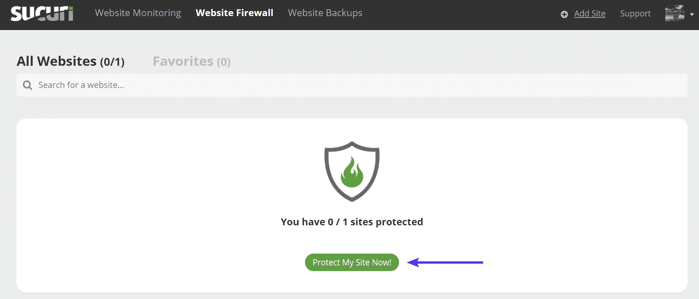

Sucuri protect my site


### 第三步

输入您的域名并配置以下选项(这三个选项我们都不选):

*   **在 DDoS 攻击下:**启用这个会自动启用 Sucuri 的一些更激进的选项。如果你确定你正在遭受攻击，你可能需要启用它。这些设置可以随时更改。
*   **白名单目录:**如果您想将管理目录的访问权限限制为白名单 IP 地址，请启用此选项。(例如/wp-login 或/admin)。注意:在电子商务网站上，你可能会想离开这个禁用。请记住，客户也使用这些区域。
*   Sucuri DNS: Sucuri 让您可以选择使用他们的 DNS 基础设施。这允许他们进行地理路由，以优化全局性能、故障转移和高可用性。但是，今天我们将取消选择该选项，因为我们希望继续使用我们自己的第三方 DNS 提供商。例如，如果您正在使用 Kinsta DNS，并希望继续在 Kinsta 管理您的 DNS 记录，请取消选择此选项。

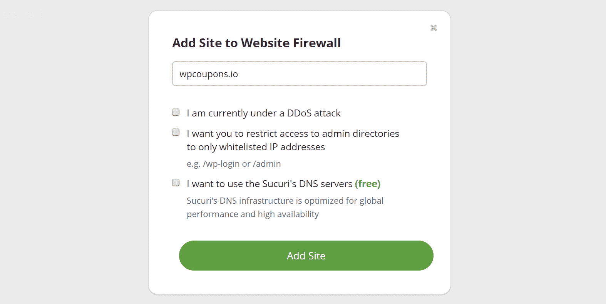

Add site website firewall


### 第四步

**重要提示:**如果您采用 Sucuri 的 Pro 或更高级计划，他们可以在您更改 DNS 之前在防火墙上提供并安装 GoDaddy SSL。GoDaddy 证书将自动续订，并包含在每月费用中。因此，在转到专业计划时，您应该有一个平稳的过渡，不会导致任何停机。

只需向他们的团队开一张票，要求他们首先安装 GoDaddy 证书。然后，您可以更新您的 DNS。

#### 使用让我们用 Sucuri 加密证书

或者，另一个选择是他们提供免费的让我们加密证书。但是，这些只能在您将您的域指向它们之后才能发布。如果你决定使用他们免费的“让我们加密”选项，我们建议在非高峰时段访问你的网站。

#### 使用金斯塔加密证书

Kinsta 还提供免费的让我们加密证书。要使用我们的，你必须**首先联系他们的支持**，让他们启用“转发证书验证”的设置这使得 HTTPS 资源调配能够成功完成。然后[可以从 MyKinsta 仪表板安装免费的 SSL 证书](https://kinsta.com/help/how-to-install-ssl-certificate/#free-ssl)。

## 注册订阅时事通讯


### 想知道我们是怎么让流量增长超过 1000%的吗？

加入 20，000 多名获得我们每周时事通讯和内部消息的人的行列吧！

[Subscribe Now](#newsletter)

### 第五步

现在是时候指出你的领域了。在常规仪表板页面上向下滚动到他们提供 DNS 信息的位置。您将需要更新您的域的 A 记录，以指向 Sucuri 的防火墙。这通常由您的[域名注册商或 DNS 提供商](https://kinsta.com/blog/best-domain-registrar/)完成。

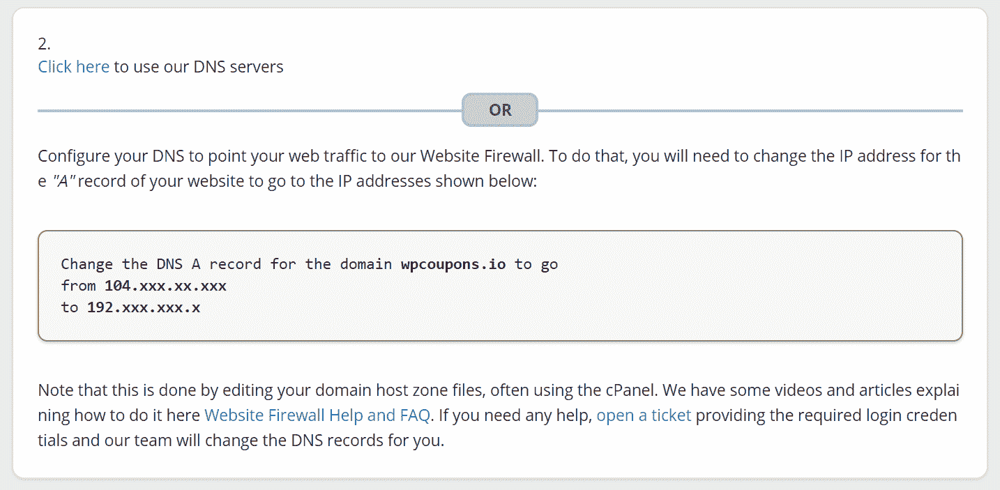

Point A record to the firewall


注意:Sucuri 应该会自动获取你当前的 IP 地址。所以一旦你将你的域名指向 Sucuri，他们会自动将流量路由回你的 WordPress 主机。

如果您使用的是 Kinsta DNS，这可以通过 [MyKinsta](https://my.kinsta.com/domains) 仪表板来完成。单击您的域，用提供的 Sucuri IP 地址更新 A name 记录。

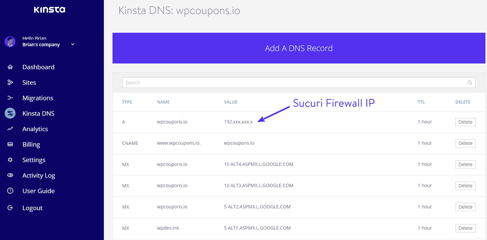

Sucuri Firewall IP


DNS 更改可能需要 48 小时才能传播，但通常只需几个小时或更短时间。您可以检查您的 DNS 是否已通过[whatsmydns.net](https://www.whatsmydns.net/)传播。你也可以点击 Sucuri 仪表板上的“刷新”图标来确认你的域指向它们。

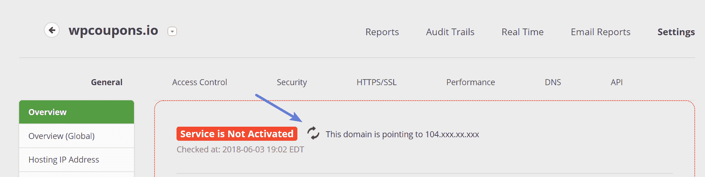

Sucuri activation


一旦他们检测到所有线路都正确，它就会变绿。

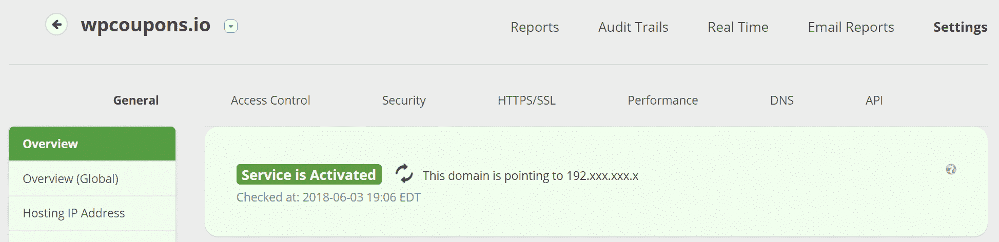

Sucuri activated


### 第六步

如果你的 WordPress 主机上有防火墙，建议你将 Sucuri IP 地址列入白名单。由于所有到你的主机服务器的连接都将通过他们的防火墙，通过将他们的 IP 地址列入白名单，这将防止他们被错误地阻止。注意:下面的 IP 是简单的例子，请查看您的仪表板，根据您的帐户找到正确的 Sucuri IPs。

```
192.88.134.0/23
185.93.228.0/22
2a02:fe80::/29
66.248.200.0/22
```

#### kinsta 客户端

如果您是 Kinsta 的客户，您需要**联系我们的支持团队**，让我们在您的网站上添加适当的 Sucuri WAF 规则。Sucuri 的 IP 已经在我们的环境中列入白名单，但我们已经与他们的团队密切合作，并需要添加额外的 Nginx 规则，以确保您的 Kinsta + Sucuri 体验没有任何问题。
T3】

## 最佳 Sucuri 设置

我们通常不推荐使用 Sucuri WordPress 插件，因为这只会产生额外的开销、管理和性能问题。让位于你的 WordPress 站点和你的主机之间的 Sucuri 防火墙在服务器层面上做它最擅长的事情。

以下是您应该在 Sucuri 仪表板中应用的一些推荐设置。

### 高级安全选项

在“安全”选项卡下，我们建议启用以下选项:

Struggling with downtime and WordPress problems? Kinsta is the hosting solution designed to save you time! [Check out our features](https://kinsta.com/features/)

*   **XMLRPC，评论和引用通告被阻止:**如果你的网站不允许评论，或者如果你使用外部评论系统(如 Disqus)，你可以阻止任何评论尝试，因为它很可能是垃圾邮件。如果你使用本地评论，不要启用这个。
*   **阻止匿名代理和前三大攻击国家:**启用此选项将阻止来自中国、俄罗斯或土耳其的任何人与您的站点进行交互。他们仍然可以查看所有内容，但不能注册帐户、提交评论或尝试登录(基本上锁定为只读模式)。同样的限制也适用于使用匿名代理服务隐藏 IP 地址的用户。
*   **攻击性 bot 过滤器:**该设置将阻止与真实浏览器不匹配的无效用户代理，如空用户代理、以 PHP 开头的用户代理和来自普通浏览器的不当用户代理。
*   **高级规避检测:**此选项将启用 Sucuri 的高级规避检测签名。我们建议保持它，但是如果你的站点支持非 ASCII 字符的 URL(像日语、印度语、俄语等)，你可能需要禁用它。

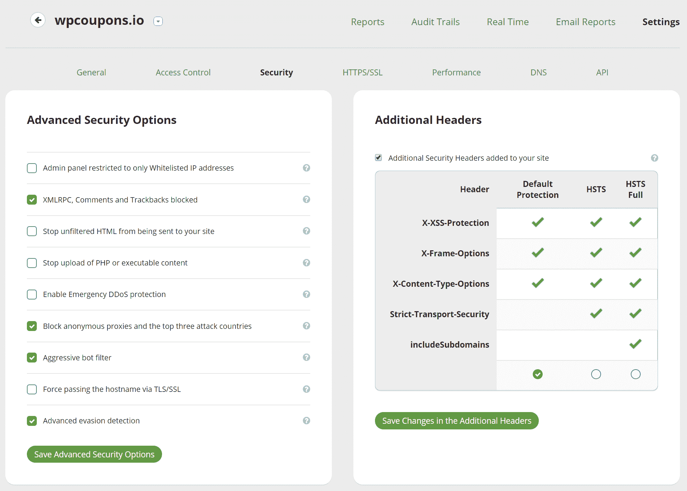

Sucuri advanced security settings


如果你认为你的网站受到攻击,“启用紧急 DDoS 保护”非常有效。HTTP 洪水保护将阻止任何人使用未启用 JavaScript 的浏览器访问该网站(主要搜索引擎除外)。然而，根据我们的经验，它还会在初始文档加载时生成一个额外的 HTTP 请求。因此，建议在事情正常化后关闭此功能。

您还可以在您的站点上启用额外的安全标题，如 [HSTS](https://kinsta.com/knowledgebase/hsts-strict-transport-security/) 。

### 贮藏

在“性能→缓存级别”下，您可以配置希望 Sucuri 如何处理缓存。很可能你的 WordPress 站点已经为缓存设置好了。因此，我们建议选择“站点缓存”这将尊重你的原始服务器的缓存，而不是使用 Sucuri 的。如果你是 Kinsta 的客户，这意味着你的网站将继续使用我们的快速[整页缓存](https://kinsta.com/blog/wordpress-cache/)，它不会干扰我们现有的任何自定义规则。

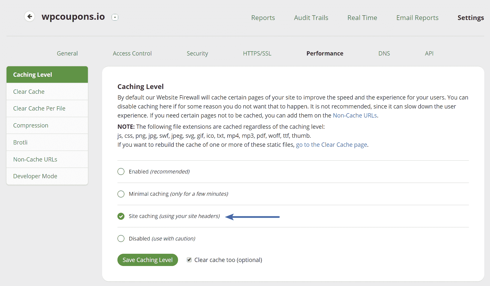

Sucuri site caching


您完全可以测试 Sucuri 推荐的缓存选项，甚至可以看到它的性能有所提高。但是，如果你在运营一个高度动态的网站，比如 WooCommerce 或 EDD，就要注意了。在 Kinsta，我们有额外的规则来不缓存某些东西，比如购物车页面、结账页面，最重要的是 cookies。Sucuri 实际上建议电子商务网站使用你自己的网站标题。

### 加拿大

Sucuri 允许你使用自己的第三方 CDN(比如 KeyCDN，MaxCDN)或者他们自己的 CDN。Sucuri 的 CDN 具有快速 HTTP/2 Anycast 网络，在美国、欧洲和亚洲有 6 个 SuperPOPs，在澳大利亚、巴西和菲律宾有 3 个 CDN POPs。当你使用他们的防火墙时，这是免费的。


Sucuri CDN


您可以将 [Kinsta CDN](https://kinsta.com/help/kinsta-cdn/) 与 Sucuri 一起使用，但他们的 CDN 快速可靠，我们通常推荐使用其中一种。如果您想使用 Kinsta CDN，您需要在 CDN 支持选项卡下选择“其他”。

如果你想用第三方 CDN 建立你的网站，你也可以这样做。只需查看他们的知识库，了解关于第三方 CDN 集成的演练:

*   [配合 Cloudflare 使用 su curi](https://kb.sucuri.net/firewall/Configuration/support-cloudflare)
*   [使用带有 KeyCDN 的 su curi](https://kb.sucuri.net/firewall/Configuration/support-keycdn)
*   [使用带有 MaxCDN 的 su curi](https://kb.sucuri.net/firewall/Configuration/support-maxcdn)

### 压缩

在“性能→压缩”下，我们建议启用压缩。这将减少通过网络发送的字节数，并提高您的网站的性能。

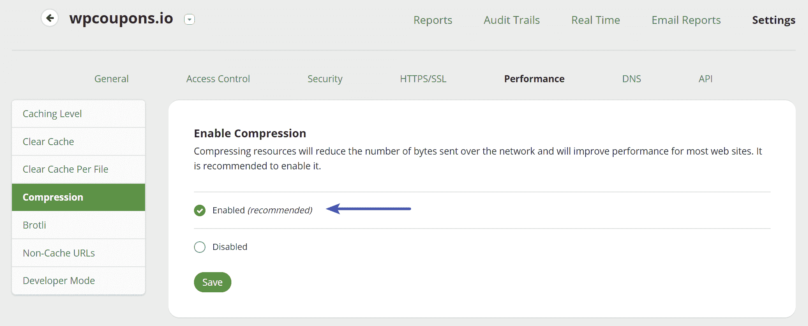

Sucuri enable compression


就是这样！让苏库里在接下来的几天里施展它的魔法，你可能会对结果感到惊喜。在我们部署的网站上，带宽立即下降，访问量恢复到以前的正常日均水平。

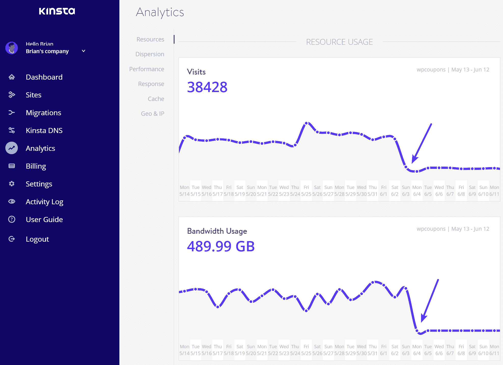

Resources after Sucuri WAF


### 其他有用的功能和报告

既然您已经配置了 Sucuri，那么您可以利用许多其他有用的特性和报告来进一步提高访问您站点的流量质量。

#### 访问控制

“访问控制”选项卡使您能够将 IP 和路径列入白名单和黑名单，阻止用户代理，阻止 cookies，阻止 HTTP 推荐人，还可以使用 captcha 、双因素或简单密码保护某个[页面。你也可以很容易地封锁整个国家与他们的地理封锁功能。](https://kinsta.com/blog/wordpress-captcha/)

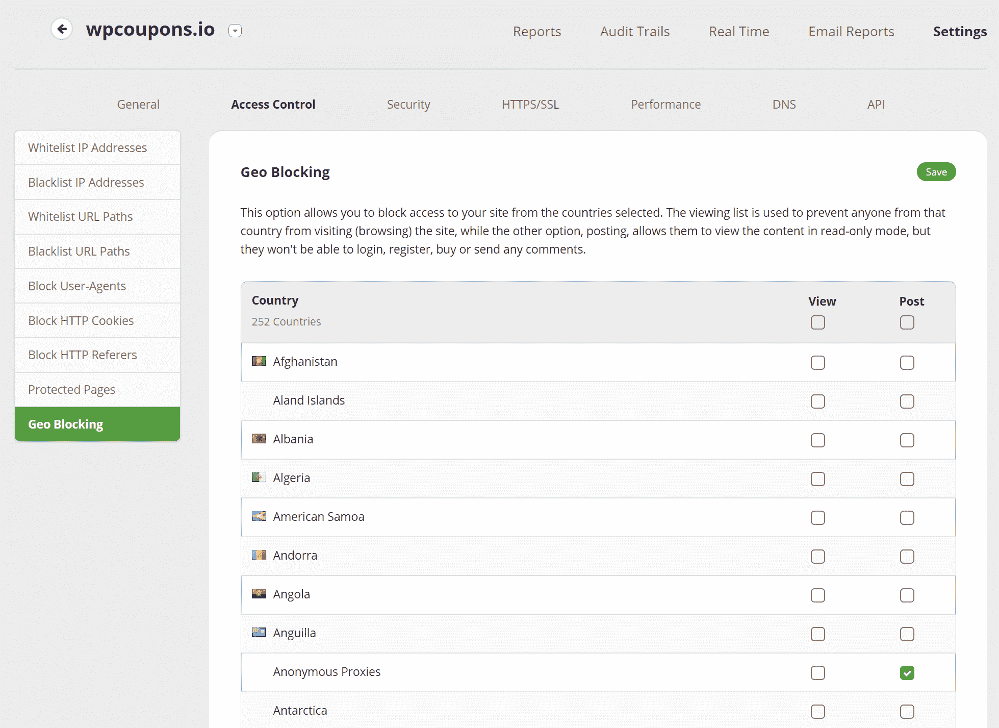

Sucuri geo-blocking


#### 实时视图

实时视图太棒了！您可以快速查看当前请求的完整日志，一键将任何可疑内容列入黑名单或白名单，如果已经被阻止，它甚至会给你一个原因。


DDoS protection real-time view


#### 拦截的攻击

拦截的攻击图表允许您快速查看拦截的攻击类型的百分比，包括 DDoS 攻击。此窗口中的其他一些图表包括按浏览器类型、设备和 HTTP 响应代码划分的流量。

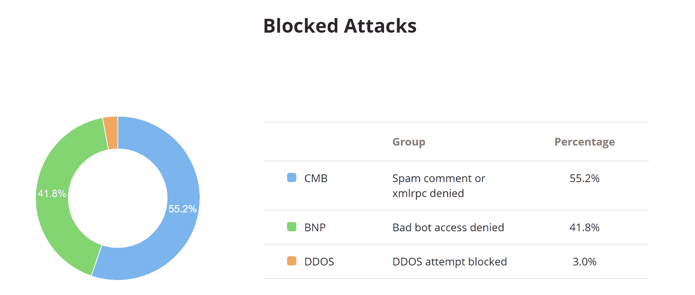

Sucuri blocked attacks


#### 平均每小时交通量

每小时平均流量图表便于查看流量的高峰时间以及被阻塞请求的比率。


Average traffic per hour


#### 按国家划分的交通

按国家/地区划分的流量表可以帮助您确定某些信息是否来自某个特定的地理位置。在他们的访问控制下，只需轻轻一点，你就可以轻松地暂时封锁整个国家。

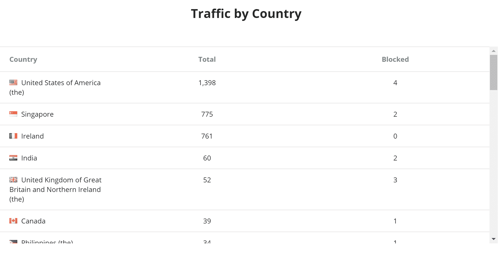

Traffic by country


#### 查看真实 IP

在您这边，似乎所有用户都在使用同一个 IP 地址。这仅仅是由于 WAF。如果您的应用程序或主机需要真实的用户 IP，请查看 [Sucuri 文档](https://kb.sucuri.net/firewall/Troubleshooting/same-user-ip)。

## 摘要

Sucuri 防火墙非常容易设置，如果您遇到低质量流量、DDoS 攻击或僵尸程序的问题，这是一个显而易见的问题。对于许多网站来说，20 美元/月的费用将会收回，因为它将确保坏的流量被过滤掉，只允许付费用户进入。更不用说你可能会看到网站前端和后端的性能都有所提高。

你觉得苏库里怎么样？你在你的 WordPress 网站上试过吗？请在评论中告诉我们。

* * *

让你所有的[应用程序](https://kinsta.com/application-hosting/)、[数据库](https://kinsta.com/database-hosting/)和 [WordPress 网站](https://kinsta.com/wordpress-hosting/)在线并在一个屋檐下。我们功能丰富的高性能云平台包括:

*   在 MyKinsta 仪表盘中轻松设置和管理
*   24/7 专家支持
*   最好的谷歌云平台硬件和网络，由 Kubernetes 提供最大的可扩展性
*   面向速度和安全性的企业级 Cloudflare 集成
*   全球受众覆盖全球多达 35 个数据中心和 275 多个 pop

在第一个月使用托管的[应用程序或托管](https://kinsta.com/application-hosting/)的[数据库，您可以享受 20 美元的优惠，亲自测试一下。探索我们的](https://kinsta.com/database-hosting/)[计划](https://kinsta.com/plans/)或[与销售人员交谈](https://kinsta.com/contact-us/)以找到最适合您的方式。