# 自由职业者拓展(真实)业务的 50 多种最佳工具

> 原文：<https://kinsta.com/blog/best-tools-for-freelancers/>

人们选择自由职业有很多原因——但最常见的是因为他们渴望自由:

*   做自己喜欢和擅长的事情的自由
*   与他们选择的客户一起工作的自由
*   按照自己的节奏和时间表工作的自由

但是，自由职业并不都是彩虹和微笑。自由职业者必须照顾自己的财务(包括税收)，找到并完成自己的项目(因为他们的收入取决于有足够的工作)，并且[明智地管理自己的时间](https://kinsta.com/blog/working-remotely/)(因为他们没有其他人告诉他们该做什么)。当然，成功的自由职业者需要身兼数职——有时还包括招聘和管理方面的职责。

[Freelancing is not all rainbows and smiles. 🌈 Check out these tools to make your job easier.Click to Tweet](https://twitter.com/intent/tweet?url=https%3A%2F%2Fkinsta.com%2Fblog%2Fbest-tools-for-freelancers%2F&via=kinsta&text=Freelancing+is+not+all+rainbows+and+smiles.+%F0%9F%8C%88+Check+out+these+tools+to+make+your+job+easier.&hashtags=freelancing%2Cworkfromhome)

自由职业者开始成为当今劳动力中越来越大的一部分。截至 2022 年，**[7040 万美国人](https://mycreditsummit.com/gig-economy-statistics/)做自由职业者**。这超过了整个劳动力的三分之一。幸运的是，市场正在以同样的方式回应高性能的工具，自由职业者可以使用这些工具来提高效率。

理解信息可用性的重要性，不管你现在使用的是哪种工具，我们为自由职业者挑选的最好的工具都与其他自由职业者流行的工具相结合。

*   [日历工具](#calendar-tools)
*   [云存储工具](#cloud-storage-tools)
*   [通讯工具](#communication-tools)
*   [签约和法律文书工作](#contracting-legal-paperwork)
*   [设计工具](#design-tools)
*   [金融工具](#finance-tools)
*   [项目管理](#project-management)
*   [生产力工具](#productivity-tools)
*   [提案工具](#proposal-tools)
*   [社交媒体管理工具](#social-media-management-tools)
*   [定时器/跟踪工具](#timer-tracking-tools)
*   [视频聊天工具](#video-chat-tools)
*   [书写工具](#writing-tools)

## 日历工具

作为一名自由职业者，最好和最糟糕的事情之一就是每天都不一样。如果你是那种讨厌常规工作的人，这是很理想的——但如果你不够自律(或者没有一个系统)来跟踪截止日期和约会，这就不那么好了。

> 需要在这里大声喊出来。Kinsta 太神奇了，我用它做我的个人网站。支持是迅速和杰出的，他们的服务器是 WordPress 最快的。
> 
> <footer class="wp-block-kinsta-client-quote__footer">
> 
> 
> 
> <cite class="wp-block-kinsta-client-quote__cite">Phillip Stemann</cite></footer>

[View plans](https://kinsta.com/plans/)

考虑到这一点，拥有一个日历和会议安排工具是*必须的*,以及你想要开始使用的其他最好的自由职业者工具。

### 1.谷歌日历

许多人专门购买多个苹果产品，因为它们彼此之间很容易同步。同样，由于大多数人都有谷歌账户，谷歌日历是黄金标准，是自由职业者日历管理的最佳工具之一——尤其是现在他们已经推出了面向商业用例的新功能。

[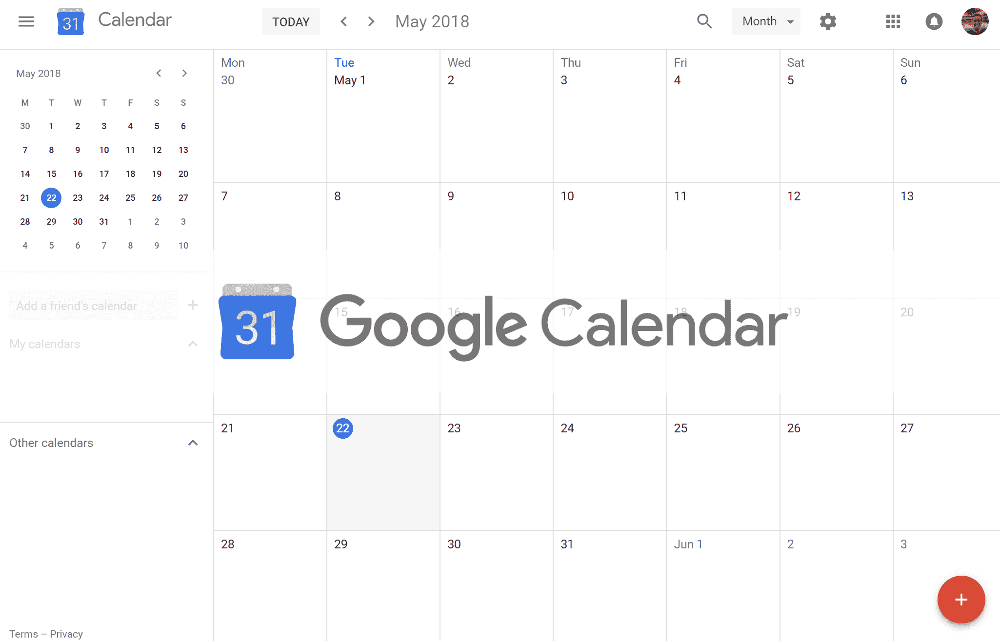](https://www.google.com/calendar)

Google Calendar

谷歌日历:

*   约会前提醒您(您可以选择提前多少分钟)
*   允许您输入会议的地点和其他相关细节
*   允许丰富的格式和超链接，以便您可以在会议前共享笔记和演示文稿

谷歌日历事件可以与其他团队成员共享，因此如果你是许多客户的虚拟助理，你可以同时查看和管理多个日历。

### 2.最近

讨厌浪费时间寻找对双方都合适的会面时间？[日历](https://calendly.com/)让您可以轻松切入正题，只需向收件人发送您独特的日程安排链接，该链接会根据您的日历可用性显示多个会议选项。

[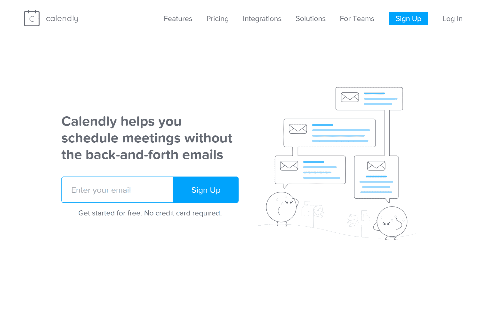](https://calendly.com/)

Calendly

Calendly 允许您安排一对一或小组会议，与谷歌日历、Outlook、Office 365 和 iCloud 以及 Salesforce、Zapier、Slack 和 MailChimp 等应用程序集成。Calendly 还自动处理时区检测，因此您可以更轻松地安排与其他国家客户的会议。

## 云存储工具

云存储使实时存储、访问、共享甚至协作文件变得更加容易:从世界上任何一个有互联网连接的地方。由于所有这些有用的功能，云存储解决方案对于与来自世界各地的客户和承包商进行远程协作的自由职业者来说是必要的。

使用云存储工具也可以作为备份存储解决方案，特别是因为硬盘容易受到病毒和磨损。通过在云中工作，你不必担心电脑突然关机和工作丢失——你的工作会在你打字时自动保存！

查看我们为有云存储需求的自由职业者挑选的最佳工具:

### 3.Dropbox

[Dropbox](http://dropbox.com) 是一款云存储软件，可以免费使用，有设定的存储限制。

[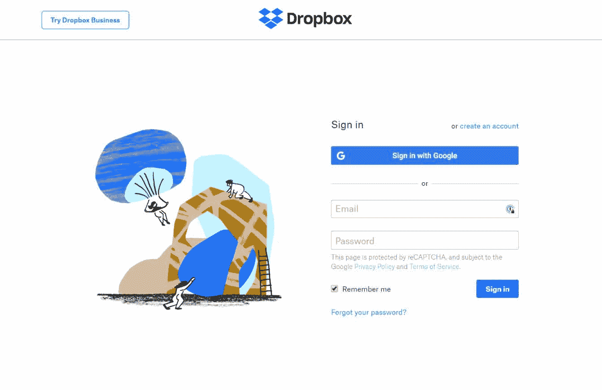](http://dropbox.com/)

Dropbox

你可以和你的朋友分享文件，完成某些任务来增加你每月的存储空间:比如邀请更多的用户，在多个设备上安装 Dropbox。您也可以选择购买额外的储物空间，这取决于您的独特需求。

除了在 Dropbox 的应用程序中工作，你还可以在电脑上安装 Dropbox。这样，您就可以自动同步在线文件，以便在电脑上访问。

### 4.Google Drive

Google Drive 正在成为 Dropbox 的热门[替代品，因为几乎每个人都有一个 Google 账户，Google Drive 包括访问他们的](https://kinsta.com/blog/google-drive-alternative/)[软件工具套件](https://kinsta.com/blog/google-workspace/)，包括文档、表格和幻灯片。

[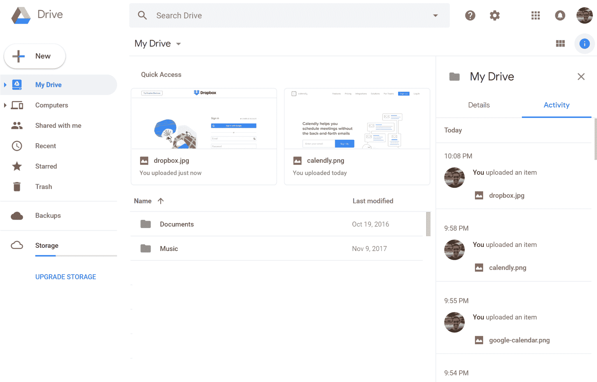](http://drive.google.com/)

Google Drive

这些程序允许你在线工作，并与他人实时协作，将文件存储在你的驱动器中。像 Dropbox 一样，它免费提供有限的存储空间(15GB)，可以选择购买更多。您也可以在计算机上安装驱动器来同步您的在线文件。

### 5.自旋备份

[冗余备份](https://kinsta.com/help/wordpress-backups/)是*总是*一件好事。如果你是谷歌产品(如 Gmail)的忠实用户，你可以使用像 [Spinbackup](https://spinbackup.com/) 这样的工具异地备份你的谷歌产品。

[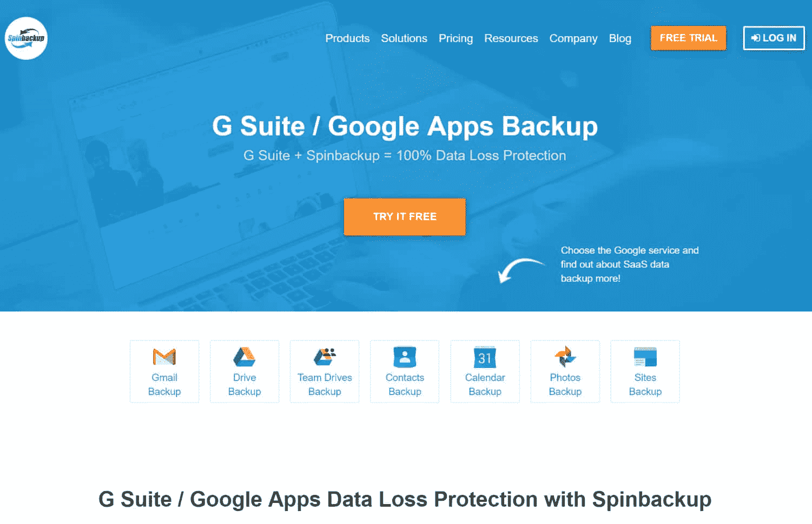](https://spinbackup.com/)

Spinbackup

备份本应是多余的东西听起来可能有点奇怪。但是如果你的谷歌账户被黑了怎么办？Spinbackup 保护谷歌用户在原始谷歌帐户被网络犯罪分子破坏的情况下免受帐户劫持。这样，您就可以放心地知道您永远不会丢失那些重要的电子邮件、照片或文档。他们甚至进行增量备份，这意味着只保存更改，这使得备份非常便宜！

## 通信工具

无论你是在追求一个新的潜在客户，还是已经完成了销售，与那些对你的业务感兴趣的人保持联系对于忙于项目是至关重要的。

看看我们为自由职业者挑选的与全球客户和合作者沟通的最佳工具:

### 6.回旋镖

回旋镖有助于掌控电子邮件通信。它出名的主要原因是它能够安排电子邮件在最佳时间发送。你可能在周末做了很多事情，但不想让客户习惯于你在你的“空闲”时间回复他们——所以使用 Boomerang 来起草待定的回复，然后安排他们在你的正常工作时间发送！

[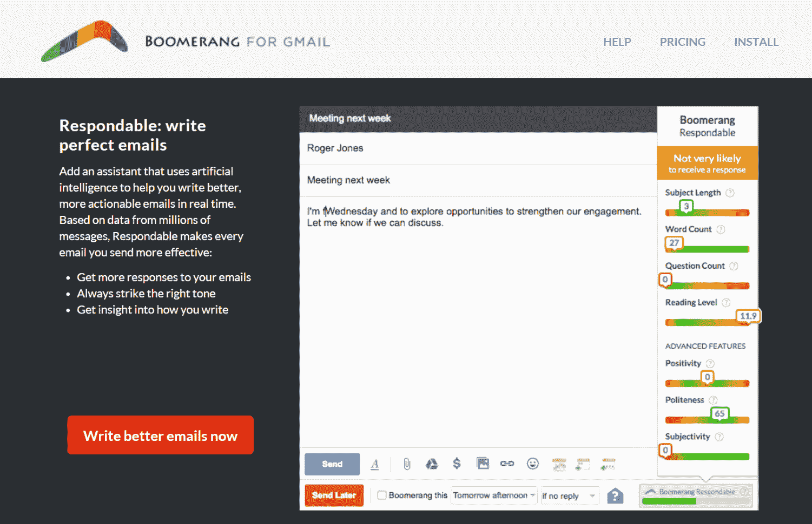](https://www.boomeranggmail.com/)

Boomerang for Gmail

Boomerang 还可以用来推动销售，让你看到你的电子邮件是否被打开、阅读或点击，它还允许你设置自动跟进。Boomerang 根据您的需求提供免费和付费选项。

如果您正在寻找一个更强大的电子邮件生产/销售工具， [Cirrus Insight](http://www.cirrusinsight.com) 有许多相同的功能，甚至更多！

### 7.Hunter.io

当你想推销一个潜在客户，并希望直接与决策者沟通时，Hunter.io 可以帮助你找到具体的电子邮件地址。只需搜索公司网站，它就会找到可用的电子邮件地址。

[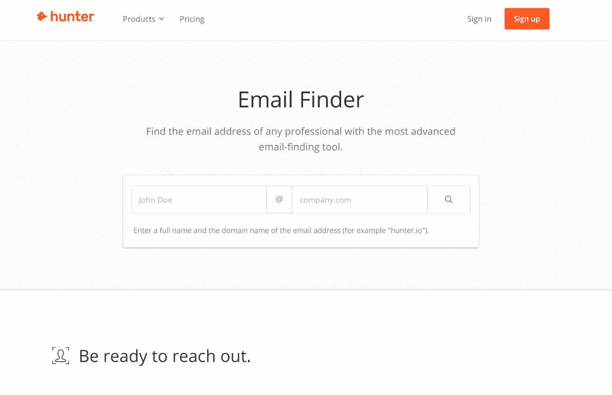](https://hunter.io/)

Hunter

为获得最佳结果(并帮助确定*实际*决策者)，交叉参考 LinkedIn 个人资料数据。

### 8.这是诺伯特

根据 Ahrefs，Voila Norbert 被选为最准确的电子邮件查找工具。诺伯特还有一个电子邮件验证工具，可以让你上传一份电子邮件列表，很快就能得到结果。无论你是想接触有影响力的人，建立营销关系，还是接触潜在的新员工，诺伯特都能帮你搞定。

[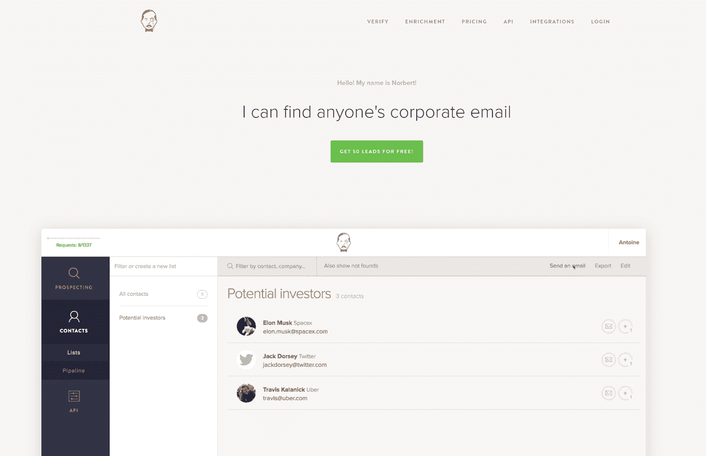](https://www.voilanorbert.com/)

Voila Norbert

请务必阅读我们关于[如何找到任何人的电子邮件地址](https://kinsta.com/blog/find-email-address/)的深入指南。

### 9.松弛的

你很难找到一家公司不使用 Slack 或类似的沟通工具来联系在长期项目中一起工作的人。它有助于组织需要简单回复的沟通——否则电子邮件可能会过于庞大和烦人。默许客户要求你放松的主要坏处是什么？[通知超载](https://www.fastcompany.com/40433793/my-company-tried-slack-for-two-years-this-is-whywe-quit)！

[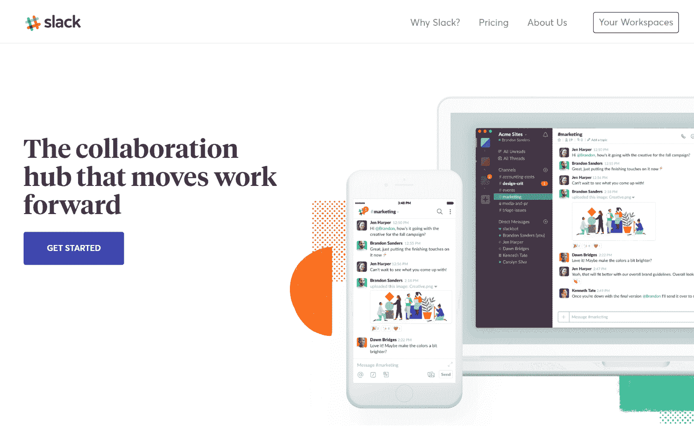](https://slack.com/)

Slack

如果你还没有使用它，最好现在就下载并[开始使用 Slack](https://kinsta.com/blog/how-to-use-slack/) ，这样当将来有客户要求你使用它时，你就会习惯了(不可避免地，*他们会*)。由于其受欢迎程度，Slack 整合了许多其他自由职业者的最佳工具，如 Google Drive、Trello 和 Asana(建议阅读: [Trello vs Asana](https://kinsta.com/blog/trello-vs-asana/) )。除了 Slack，另一个很好的选择是微软团队，在这里阅读我们的比较: [Slack vs 团队](https://kinsta.com/blog/microsoft-teams-vs-slack/)

## 合同和法律文书工作

许多自由职业者犯的一个新手错误是在没有合同或一系列条款和协议的情况下工作。书面合同不仅有助于树立你作为专业人士的品牌，还可以通过在你和客户之间划清界限来保护你，并有助于确保你的时间和服务得到公平的报酬。

简而言之，合同规定了双方同意做什么(工作范围)，你得到多少报酬，以及你什么时候得到报酬。通过这种方式建立起来，你就有了书面证据，如果客户遇到困难，你可以用它来寻求赔偿。

在被将这种法律层面融入到你的公司中而不知所措之前，要知道合同不一定要花里胡哨。有很多免费的和负担得起的选择，你可以利用你的优势。

看看我们为自由职业者挑选的最佳工具，因为它们与合同和法律术语有关:

### 10.法律空间

虽然聘请一名了解你的业务和当地法律的律师是创建法律文件的黄金标准，但仅仅开始使用基本的法律文件模板是银(或者铜)。

[LegalZoom](https://www.legalzoom.com) 为会员提供一个法律文件模板库，价格仅为[$ 7.99/月](https://www.legalzoom.com/all-products.html)。加上律师支持，如果你在填写 LegalZoom 的模板时遇到困难，这将是一个很大的帮助，总共是 31.25 美元/月。如果你的业务还是新的，LegalZoom 还可以帮助你进行[业务组建](https://llc.legalzoom.com/)(并充当你的注册代理)。

[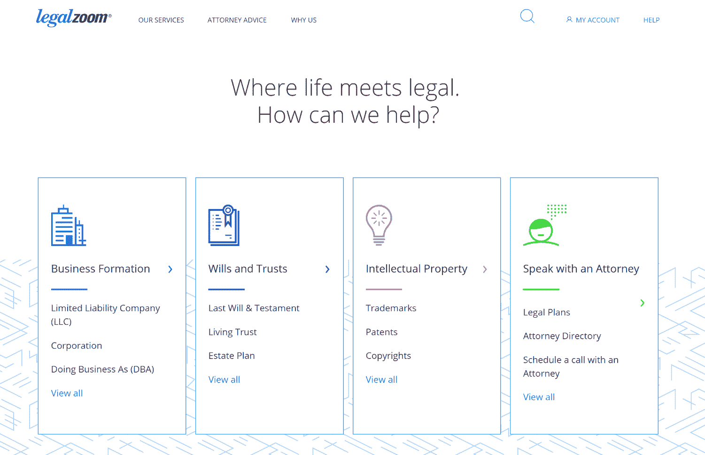](https://www.legalzoom.com)

LegalZoom

如果你预算有限，考虑把你完成的合同模板带到你当地的[小企业顾问委员会](https://smallbizab.com/)——他们会有法律专业人员(和其他商业运作专业人员)来帮助你建议*免费*。

### 11.盆栽

Bonsai 是一款合同创建和发票软件工具，让自由职业者可以轻松创建合同，与客户一起审查(和修改)合同，并在客户准备就绪时合法地签署合同。实际上，填空模板使得这个过程比没有任何上下文的情况下创建或编辑文档要简单得多。

[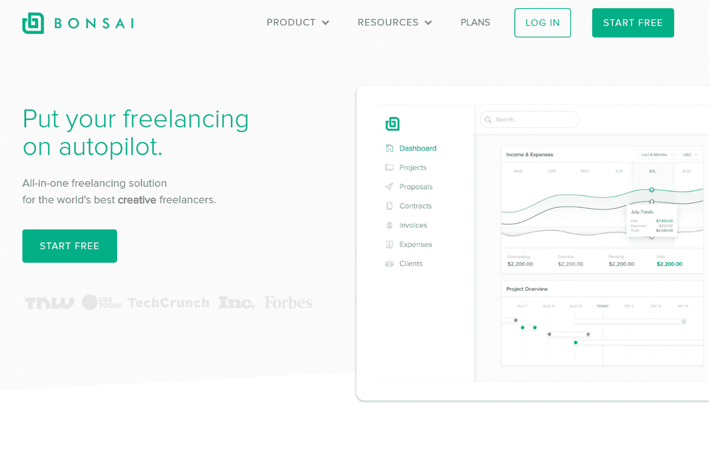](https://www.hellobonsai.com/)

Bonsai

Bonsai 还配备了一个集成了 Stripe、Paypal 和比特币基地的发票系统。Bonsai 是自由职业者的最佳工具之一，它允许自由职业者使用 ACH 获得报酬——这是许多其他类似工具所不提供的。这可能会降低高收入自由职业者的支付处理费用。

Bonsai 的前提是让自由职业者的一切变得简单，这就是为什么这个工具被超过 30，000 名自由职业者使用(高于 2016 年的 10，000 名！).Bonsai 创始人 Matt Brown 和 Matt Nish 分享道，Bonsai 用户比他们使用其他工具的平均速度快两周获得付款，并且比使用该工具之前少了三倍的逾期付款。

### 12.和一氧化碳

感谢 Fiverr 最近的收购，[和公司的](http://www.and.co)所有令人敬畏的自由职业者管理工具都是*绝对免费的*！

[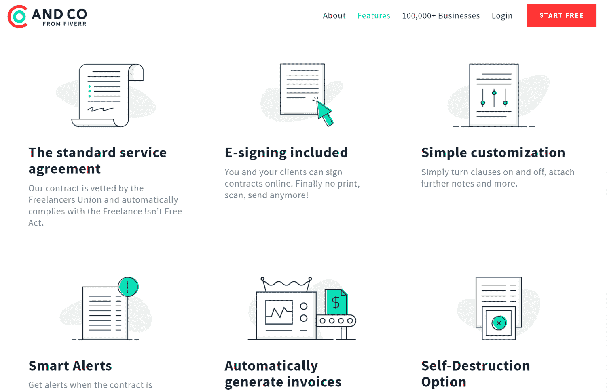](http://www.and.co)

AND CO

像 Bonsai 一样，他们的 contracts 工具相当直观，可以引导你完成整个过程。您还可以使用和 CO 进行时间跟踪、费用跟踪、开具发票等。它作为一个完整的系统使用时效果最佳。

### 13.你好啊

如果你已经有了一个你引以为豪的合同模板，考虑使用 [HelloSign](https://www.hellosign.com/) 来满足你的电子签名需求。

[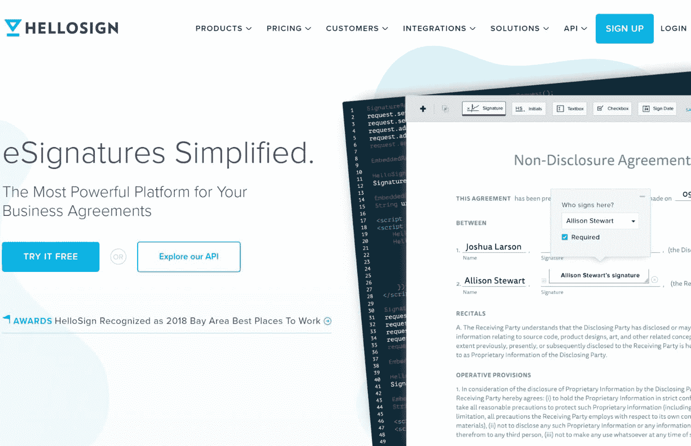](https://www.hellosign.com/)

HelloSign

HelloSign 提供每月最多 3 个文档签名的免费计划(如果您有更大的需求，还提供负担得起的无限制计划)。

### 14.Termsfeed

让我们面对现实吧，如果你是交易的买方/接收方，你不会真正阅读条款和协议部分。但如果你是卖家或服务提供商，情况就完全不同了——就像你经营一家[电子商务企业](https://kinsta.com/blog/ecommerce-strategies/)。在提供产品或服务之前，你需要创建并发布这些条款，以便在法律上保护你，以防有人决定追随你。

[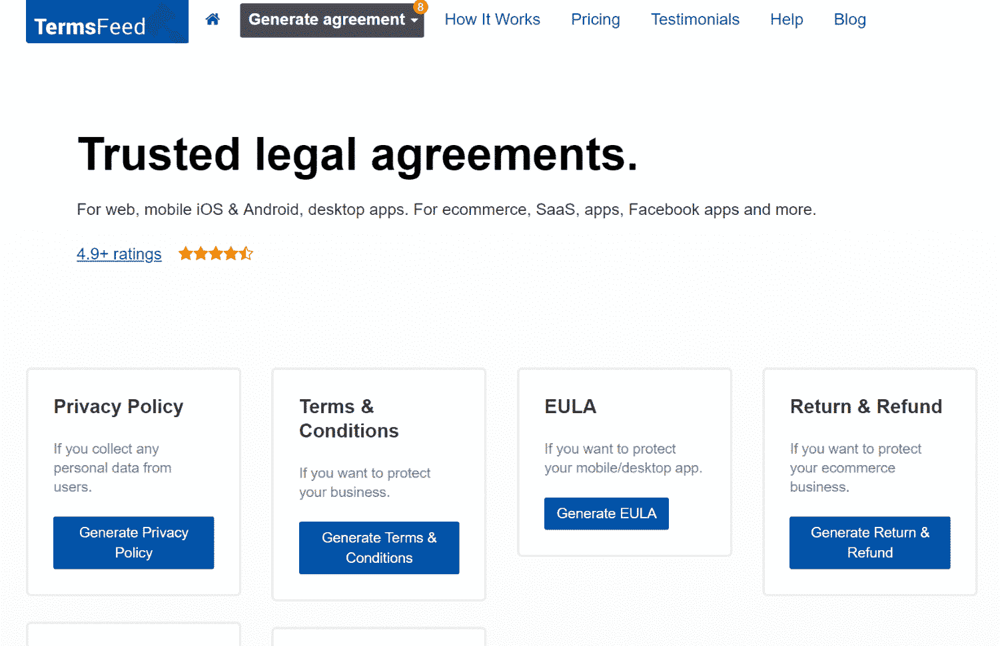](https://termsfeed.com/)

Termsfeed

[Termsfeed](https://termsfeed.com/) 帮助生成法律文档，如隐私政策、条款和条件、服务条款、退货政策等。

## 设计工具

许多提供营销服务的自由职业者被拖进了平面设计领域——即使他们明确表示这不是他们的强项！幸运的是，对于自由职业者来说，有很多免费且负担得起的图形设计工具，你可以用来制作客户会喜欢的视觉内容。

查看我们为客户设计的自由职业者的最佳工具列表:

### 15.帆布

由于社交媒体影响者[盖伊·川崎在公司](https://www.canva.com/learn/guy-kawasaki-chief-evangelist/)的股份， [Canva](https://www.canva.com/) 变得出名，已经成为在没有平面设计背景的情况下创造美丽图形*的代名词。如果你想了解更多如何用 Canva 创建图像，请查看本教程。*

[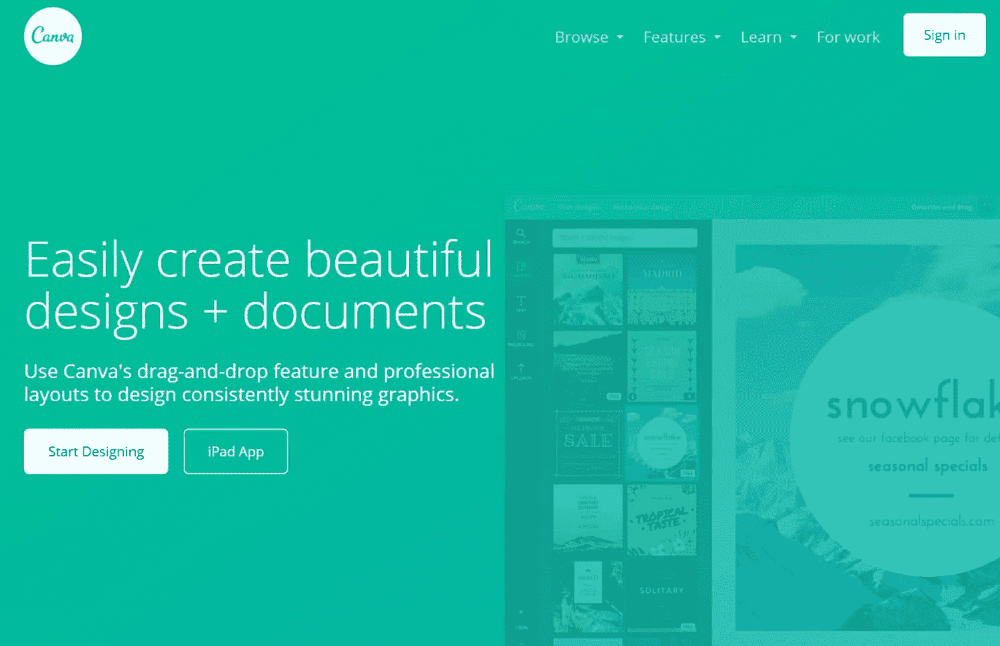](https://www.canva.com/)

Canva

### 16.视觉

在网站设计者的心目中， [InVision](https://www.invisionapp.com/) 是最好和最强大的设计原型工具之一。虽然你*不能*在 InVision 本身内创建设计，但该应用程序允许你上传你的静态设计，并通过添加动画、手势和过渡来修改它们——创建完全交互式的原型。

[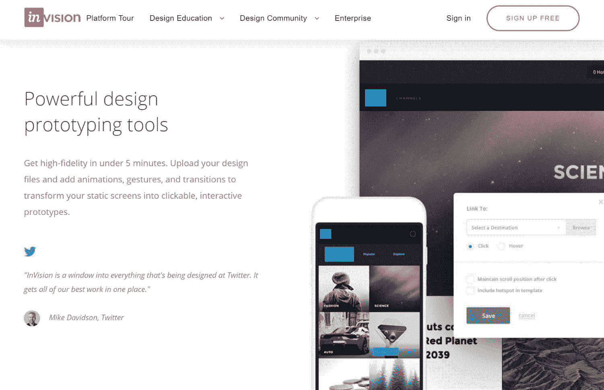](https://www.invisionapp.com/)

InVision

一些有用的视觉功能:

*   与 Photoshop 或草图文档同步
*   与自由职业者最佳工具列表中的其他工具集成，如 Trello、Slack 和 Basecamp
*   [版本控制](https://kinsta.com/blog/wordpress-version-control/)和注释(便于工作流交流)
*   手绘，团队可以通过绘制草图和展示设计进行协作以获得反馈，即使他们不在同一个地方。

### 17.行为

如果你是一名自由设计师或自由作家，你会想要创建一个作品集网站。如果你还没有准备好处理[创建一个网站](https://kinsta.com/blog/wordpress-page-builders/)所需的成本或技术技能，你会想同时考虑另一个投资组合构建工具。

[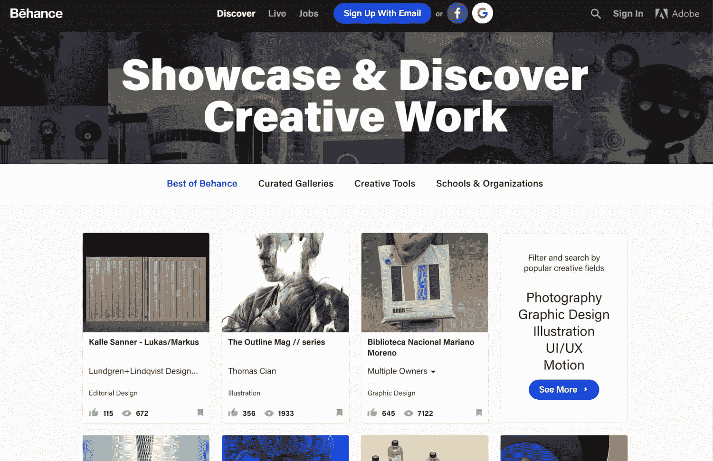](https://www.behance.net/)

Behance

对于自由设计师来说， [Behance](https://www.behance.net/) 是一个展示你作品的好地方。除了提供建立[作品集](https://kinsta.com/blog/wordpress-portfolio-plugins/)的基础，这个平台还拥有大量的艺术和设计爱好者。通过熟悉 Behance 及其用户，你会发现更容易获得灵感和追随者。

### 18.Adobe 创意云

[Adobe Creative Cloud](https://www.adobe.com/creativecloud.html) 是一项订阅服务，让您可以使用 Adobe 的行业标准设计工具。

[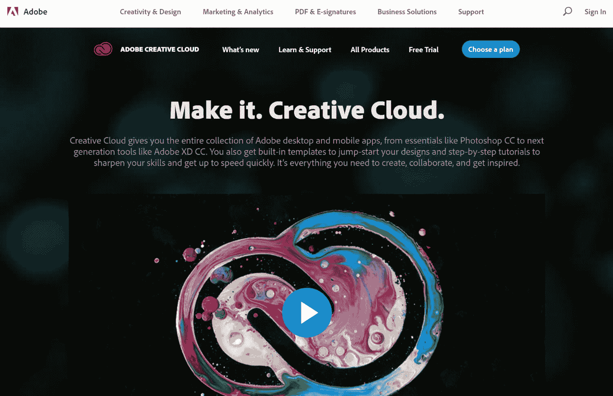](https://www.adobe.com/creativecloud.html)

Adobe Creative Cloud

这些工具包括 Illustrator、Photoshop、Acrobat、Premiere Pro/After Effects 和 InDesign。根据你实际需要哪些应用来选择你的计划——不要支付超过你将使用的费用(你可以随时升级)！

### 19.亲和力设计师和照片

面向自由职业者的工具可以迅速增加，尽管 Adobe Creative Cloud 绝对是市场上最好的工具之一，但也有更便宜的替代产品。在过去的几年里，亲和设计师和[亲和写真](https://affinity.serif.com/en-us/photo/)变得非常受欢迎。

Affinity Designer

它们提供几乎相同的功能(相同的快捷方式、工具等)，但一次性付款很低(不到 50 美元)。他们提供 Mac 和 Windows 版本。

## 金融工具

不管他们愿不愿意，自由职业者都必须照顾好自己的财务:从管理预算，到接受付款(和追查逾期发票)，以及处理税务。对于自由职业者来说，最好的工具让这部分工作变得简单一点！

### 20.贝宝

对于客户来自其他国家的自由职业者来说，通过银行转账获得报酬可能会花费大量的费用，而且钱可能需要很长时间才能到达。

PayPal 是大多数自由职业者获得报酬的最便捷方式。它是[在 200 多个国家可用](https://www.paypal.com/ph/webapps/mpp/country-worldwide)，可以支持 25 种货币，并且被普遍认为[非常安全](https://kinsta.com/blog/wordpress-security-plugins/)。PayPal 也非常灵活:被许多在线商家接受为支付方式。

PayPal

唯一的警告，一个大多数自由职业者都非常清楚的警告是，PayPal 收取一些高额的交易费作为做生意的成本。好消息是什么？这些费用可以作为做生意的成本从你的税收中扣除！

### 21.平方

[Square](https://squareup.com/) 让你接受信用卡支付，第二天就能拿到存款。

[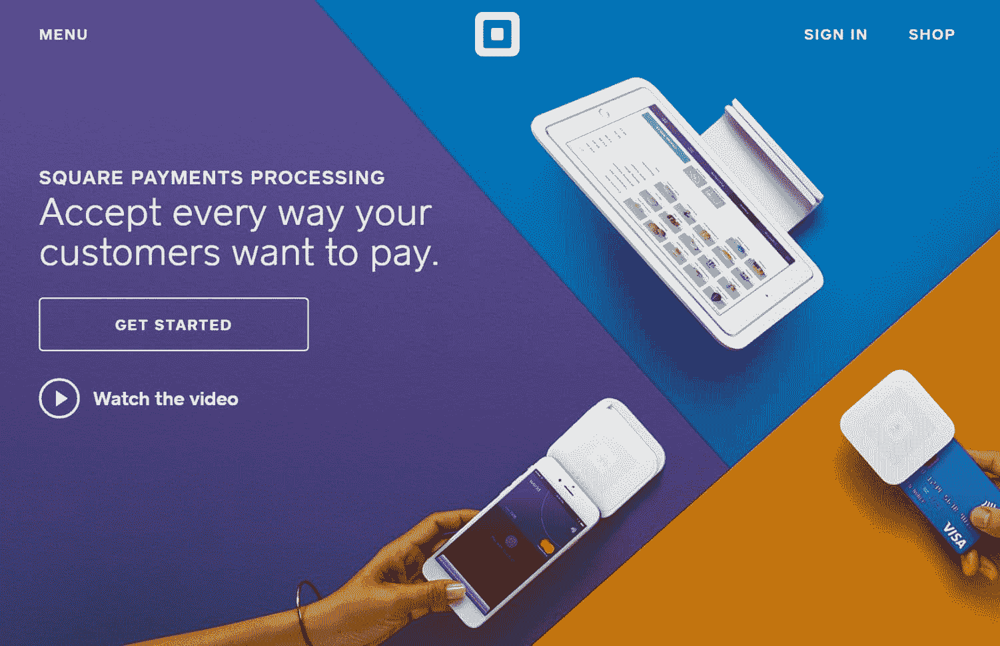](https://squareup.com/)

Square

如果你有一个电子商务商店，Square 还提供一个 POS 系统，处理库存、退款、税收、折扣，并附带销售报告工具。来看看我们的深度对比:[条纹 vs 方形](https://kinsta.com/blog/stripe-vs-square/)。

### 22.铸造

Mint 是最好的预算应用之一。它非常全面，将您所有的(关联的)财务账户和信息收集在一个仪表板中。

[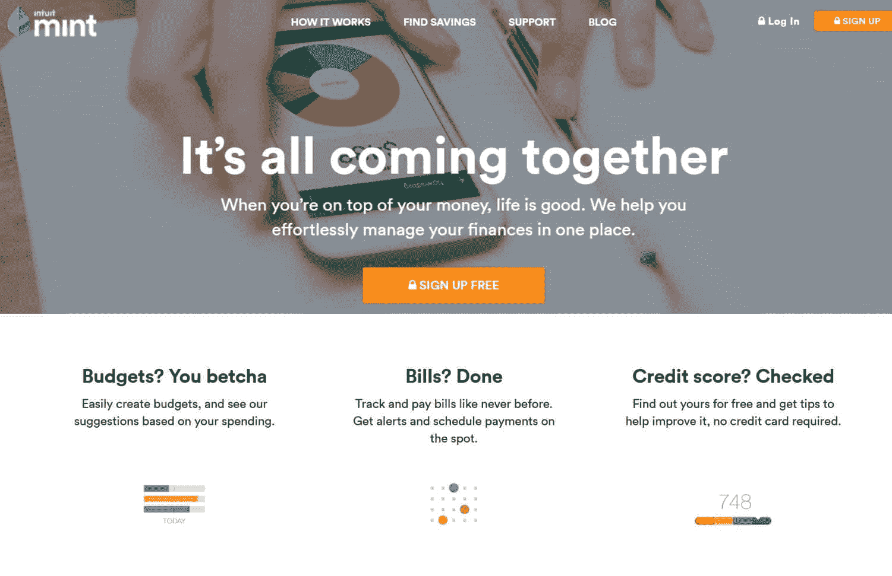](https://www.mint.com/)

Mint

它还可以帮助你跟踪你的账单、预算和投资——这有助于分析你完整的财务状况。这对一个自由职业者来说很重要，因为他知道你真正拥有多少钱——但是你会想确定你已经[实现了一个系统](https://www.and.co/blog/freelance-knowledge/freelance-accounting-101/),包括一个独立的商业信用卡、支票账户，甚至是一个(税收)储蓄账户。

### 23.新书

[Freshbooks](https://www.freshbooks.com/) 是一款免费的云会计软件，包括时间跟踪、开具发票、项目跟踪等强大功能，以及接受信用卡支付的能力。它还集成了 Hubstaff。

[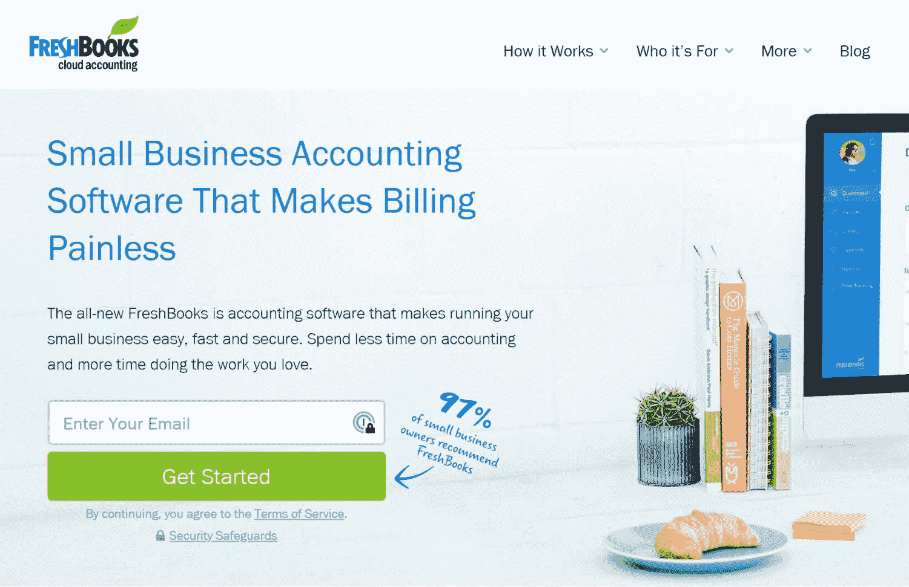](https://www.freshbooks.com/)

FreshBooks

许多自由职业者相信它——但是使用它而不是它的下一个最有竞争力的竞争对手(Quickbooks ),将在很大程度上取决于你需要的具体功能以及你将通过他们的平台向多少客户收费。

### 24\. Quickbooks

Quickbooks 是另一个流行的会计软件工具，它可以连接到你的银行账户，这样你就可以轻松地跟踪你的收入和业务支出。除了记账之外，您还可以使用它来管理和支付承包商(或您自己，通过他们的工资单功能)，它还可以从费用的角度跟踪汽车里程。

[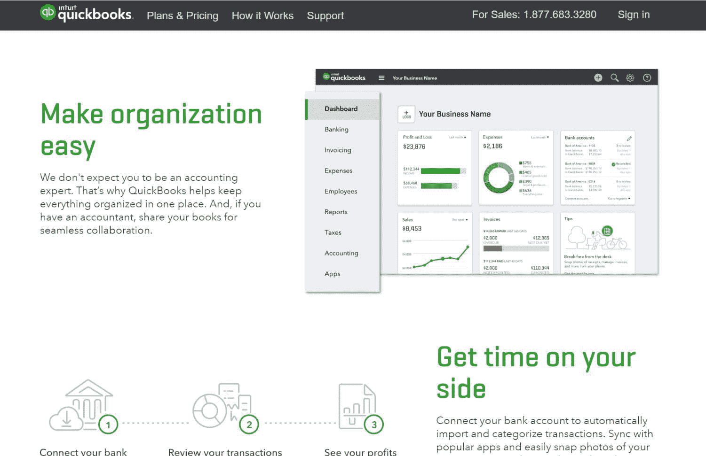](https://quickbooks.intuit.com/)

Quickbooks

### 25.爱好

随着你的自由职业业务开始增长，你必须调整你的会计实务。许多自由职业者为了税收优惠，决定把他们的生意组织成 S 公司。虽然这可以为你节省很多钱，但在工资方面却有点令人头疼。

通过使用像 [Gusto](https://gusto.com/) 这样的现成工具，为自己省去管理日常财务的麻烦。

Gusto

如果你是一名独立承包商，并且对这类事情非常困惑，那么也建议你联系像 ICTaxAdvisors 这样的公司。本质上，他们为你建立有限责任公司(如果需要的话，S-Corp ),并处理所有的薪资整合(他们使用 Gusto)和所有的税务申报。这有助于让纳税季变得轻而易举。

## 项目管理

每投资 10 亿美元，就会有 1 . 22 亿美元因表现不佳而浪费掉。按照这种思路，项目管理工具对于掌控任务和不把钱留在桌面上是很重要的！

## 注册订阅时事通讯

### 想知道我们是怎么让流量增长超过 1000%的吗？

加入 20，000 多名获得我们每周时事通讯和内部消息的人的行列吧！

[Subscribe Now](#newsletter)

以下是我们为需要项目管理帮助的自由职业者挑选的最佳工具:

### 26.阿萨纳

Asana 是一个设计精美的项目管理解决方案，功能强大到有时让人觉得太多了。出于这个原因，它最适合用于你需要与其他人合作的特定项目(或者当客户将你添加到他们的 Asana 实例中时)。你可能想使用一个*不同的*工具来管理你自己的项目。

[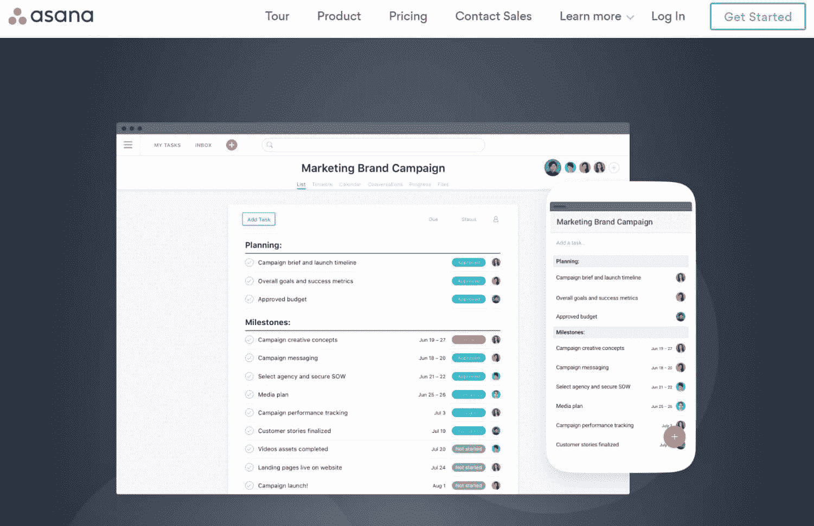](https://asana.com/)

Asana

### 27.特雷罗

Trello 是一个项目管理工具，最适合那些喜欢视觉和图形的人。

[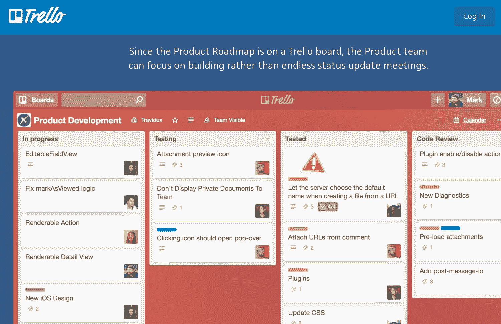](https://trello.com/)

Trello

在 Trello 中，您可以创建白板并添加卡片来代表您需要完成或分配给您的任务。Trello 非常灵活，可以用于任何事情，从个人任务管理，到与您的业务和项目相关的事情。许多顶级在线出版物使用 Trello 作为他们的编辑日历(Kinsta 就是这样！).

### 28\. Basecamp

[Basecamp](https://kinsta.com/blog/trello-alternative/#3-basecamp) 是一款一体化项目管理解决方案，包括待办事项列表、留言板和云存储功能。它最适合用于管理多步骤项目中的多人。

[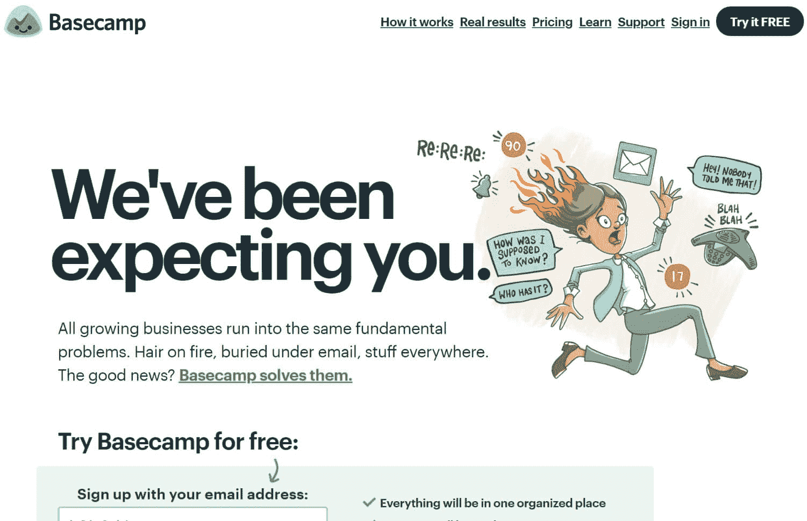](https://basecamp.com/)

Basecamp

一个理想的应用？如果你是一名提供[社交媒体营销](https://kinsta.com/blog/wordpress-social-media-plugins/)服务的自由职业者，并且有其他团队成员负责平面设计创作和日程安排。使用 Basecamp 这样的工具可以将所有相关信息保存在一个地方，供各方使用。

## 生产力工具

作为一名自由职业者，最大的好处之一就是拥有自己的时间，能够选择自己承担的项目。用自己的时间工作的不利方面是没有人监督你，这很容易导致拖延或失去注意力。

另外，既然你是一个人，你必须考虑每一件小事的细节。对自由职业者来说，最好的工具包括[生产力工具](https://kinsta.com/blog/best-chrome-extensions/)，帮助你保持正轨。

### 29.1 密码

有这么多的网站和帐户需要您跟踪， [1Password](https://1password.com/) 让您可以更轻松地创建这些信息的可用数据库，安全地存储您为自由职业者最佳工具列表中的其他人登录的所有信息。当您准备好使用特定的用户名/密码组合时，1Password 会自动为您调出该组合(只要您登录并使用 Google Chrome 扩展)。

[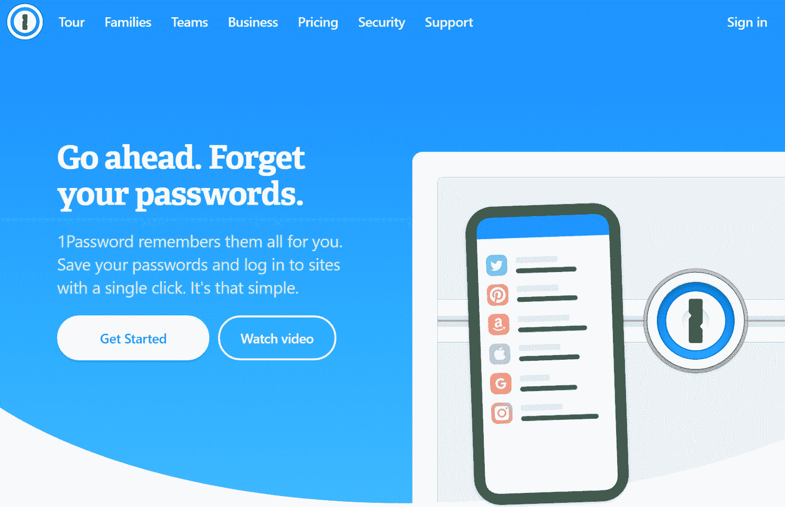](https://1password.com/)

1Password

### 30.IFTTT

[IFTTT](https://ifttt.com/) 代表“if this then that”，是目前可用的最好的任务自动化工具之一。 [IFTTT](https://kinsta.com/blog/wordpress-ifttt-recipes/) 将不同的应用和平台整合在一起。你所需要做的就是选择一个应用程序或平台，以及一个触发动作，该动作将允许另一个(甚至同一个)应用程序中的不同事件。这些被称为“小程序”，在 IFTTT 上有几个可用的。

[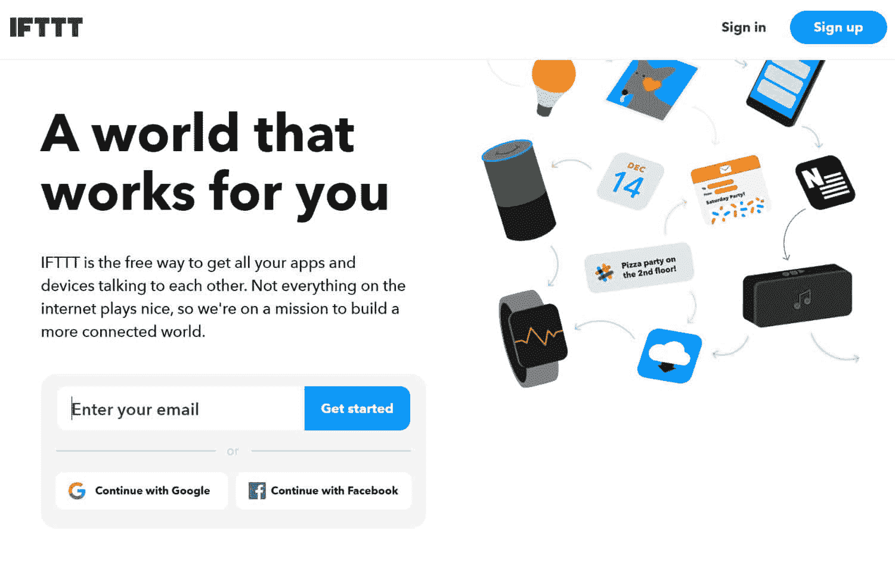](https://ifttt.com/)

IFTTT

要知道，如果没有之前使用该平台的经验，很难自己创建这些小程序，有许多已经创建并可用于社交媒体、工作流程、婚礼、购物甚至控制智能家居的应用程序。一旦你理解了它是如何工作的，你就可以创建你自己的了！

### 31.口袋

在工作或随意浏览互联网时，您可能会遇到一些文章、视频和链接，您希望以后可以回头参考。与其在你的浏览器中标记这些东西，为什么不把它们保存到[口袋](https://getpocket.com/)中呢？Pocket 可以方便地保存有用的资源供以后使用，并允许您在其他设备上访问所有这些信息。

[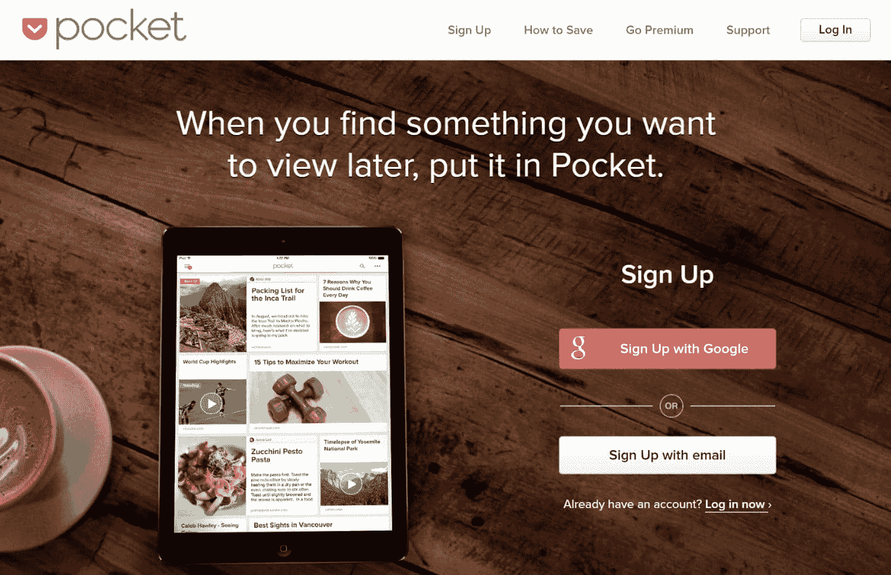](https://getpocket.com/)

Pocket

### 32.文本扩展器

写作是每个自由职业者生活的一部分。过一段时间后，你可能会开始意识到有一些你经常使用的短语很难一次又一次地输入。

TextExpander 可以为这些短语指定快捷方式。例如，如果您发现您经常键入您的地址，只需指定一个快捷方式，如“地址”, TextExpander 就会自动键入您的地址。

[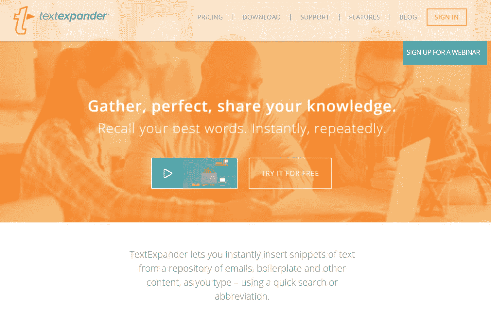](https://textexpander.com/)

TextExpander

由于 TextExpander 只能通过付费计划获得，你可能会喜欢一个替代方案——[自动文本扩展器](https://chrome.google.com/webstore/detail/auto-text-expander-for-go/iibninhmiggehlcdolcilmhacighjamp?hl=en)，一个[谷歌 Chrome 扩展](https://kinsta.com/blog/best-chrome-extensions/)。

## 提案工具

如果你的梦想包括作为一名自由职业者挣六位数的钱，你需要在你的日常工作清单上加上“商业发展”。

仅仅通过求职板申请工作职位或寻找机会是不够的，因为通常这些主要来源涉及更多的竞争和更低的工资。如果你刚刚起步，这些工作机会可能有利于建立你的投资组合，但当你获得更多经验时，你不应该满足于低薪工作。

瑞安·罗宾逊(Kinsta 的客户)分享了如何[写一封能转化](https://www.ryrob.com/cold-email/)的冷淡邮件的技巧。此外，这里有一些自由职业者可以用来做提案的最佳工具。

### 33.提议

通过提供大量漂亮的模板库，Proposify 可以让你用正常情况下一半的时间创建漂亮的提案。Proposify 的工具允许你控制排版和布局，并添加片段——你可以在未来重复使用以节省时间。

[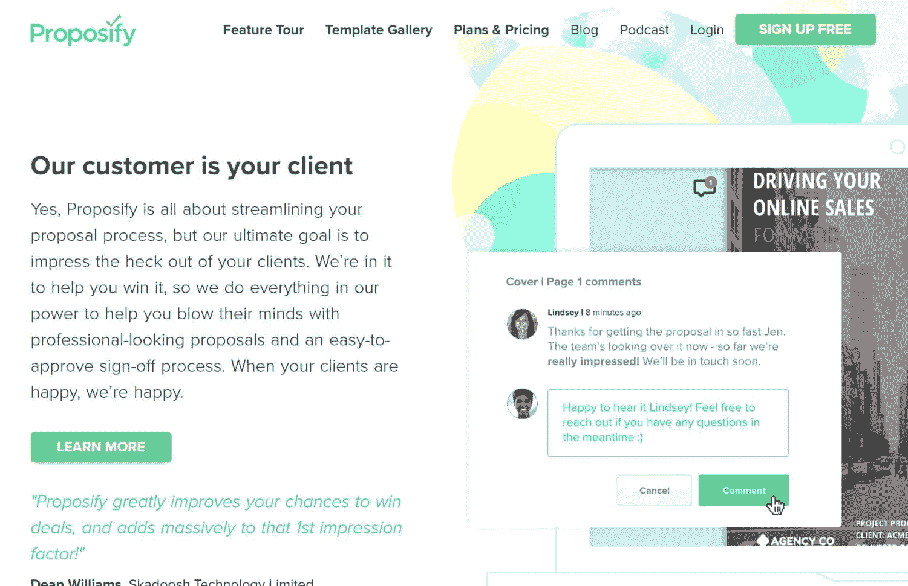](https://www.proposify.com/)

Proposify

在这个工具上设计的提案是移动友好的。你也可以在你的提议中加入视频，让它更吸引人。Proposify 允许你和这个自由职业者最佳工具列表上的许多其他人整合。它还会给你一些反馈，比如客户看了你的提议多长时间，他们是否接受了你的提议。

### 34.普洛斯彼罗(莎士比亚的戏剧《暴风雨》中的人物)

Prospero 帮助你创建提案，同时也帮助你为每个项目定价。出于这个原因，它是新的自由职业者的理想选择，仍然习惯于土地的铺设。

Prospero

当你创建提案时，它会问你一些问题，如:你的费率、完成项目需要多长时间，以及你正在做的工作类型(它包括网页和应用程序设计，以及印刷和品牌提案)。然后，它将根据您的回答，帮助您创建一份具有理想定价的建议书。

### 35.草稿发送

你的产品和服务相当简单吗？与其在销售拜访上花费大量时间，不如使用类似于 [Draftsend](https://draftsend.com/) 这样的工具来引导潜在客户完成提案。录制音频，与 PDF 一起使用！

[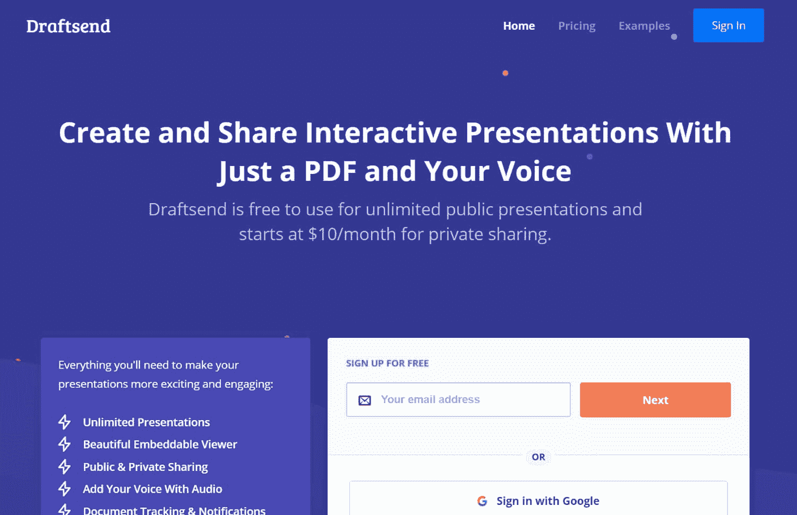](https://draftsend.com/)

Draftsend

## 社交媒体管理工具

如果你提供的服务涉及到社交媒体管理，这些工具中的任何一个都可以帮助你更好地完成工作。但是，即使你没有向客户提供社交媒体服务，这些工具也可以帮助你巩固自己的社交媒体形象。

与宕机和 WordPress 问题做斗争？Kinsta 是一款考虑到性能和安全性的托管解决方案！[查看我们的计划](https://kinsta.com/plans/?in-article-cta)

### 36.SmarterQueue

SmarterQueue 是一个强大的社交媒体日程安排工具，允许你在许多不同的社交网络和页面类型上发帖。SmarterQueue 会自动为您发帖，即使您当天没有任何特别安排的内容——从按主题类型组织的[循环内容库](https://kinsta.com/blog/evergreen-content/)中选择。由于这个原因，它对重新利用[常青内容](https://kinsta.com/blog/evergreen-content/)特别有用。

[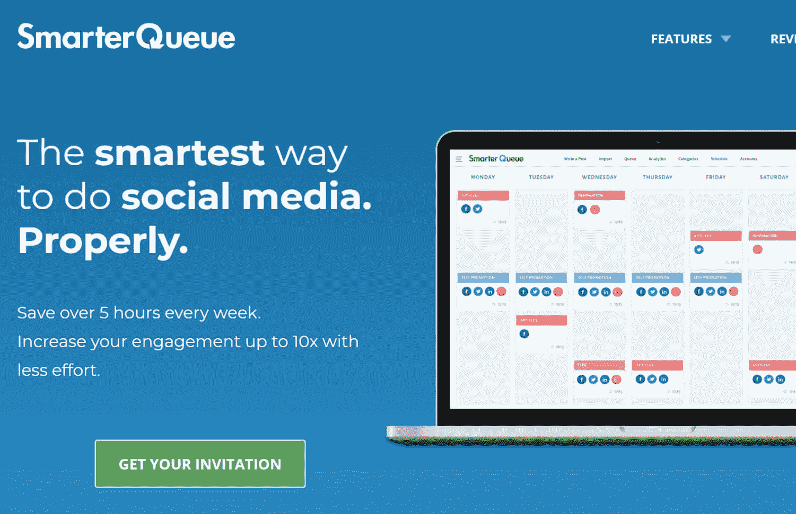](https://smarterqueue.com/)

SmarterQueue

### 37.缓冲器

Buffer 出名的主要原因是它的队列功能——允许你添加内容，而不需要指定具体的日期或时间。从那里， [Buffer](https://buffer.com/) 根据你添加帖子的顺序(可以很容易地更改或随机化)以及你设置的每天发帖的日期和时间来发布你排队的帖子。他们提供了一个基本的免费和负担得起的付费计划，这取决于你使用这个工具的目的。

[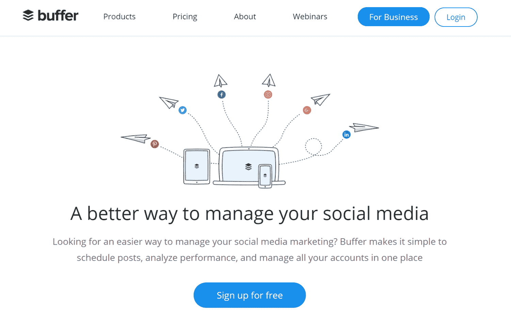](https://buffer.com/)

Buffer

### 38.Hootsuite

Hootsuite 是另一个流行的社交媒体管理工具，它可以根据业务/客户需求进行扩展，比 Buffer 更合理一些(至少，一旦你的需求超过了他们的计划所能提供的)。

[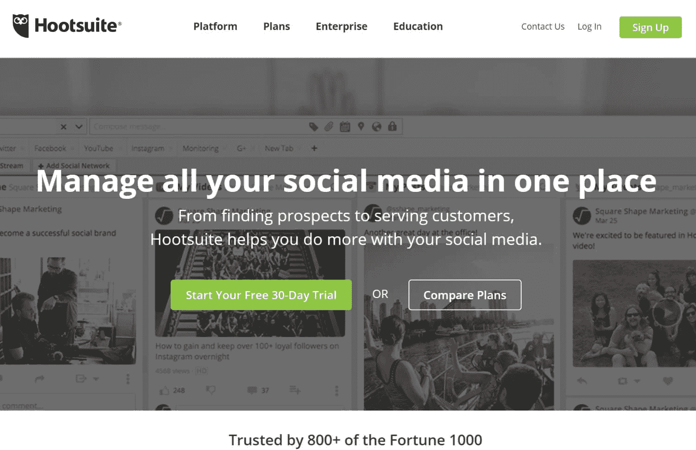](https://hootsuite.com/)

Hootsuite

为客户社交档案创建“团队”,允许他们查看相关的预定帖子，但不能查看其他人的帖子。运行分析报告等，不断改进您的工作。

Hootsuite 的另一个优点是，他们有一个很好的培训平台——不仅仅是关于如何使用他们的工具，还包括如何从整体上优化你的社交媒体营销工作。

### 39.萌芽社交

像 Hootsuite 和 Buffer 一样， [Sprout Social](https://sproutsocial.com/) 是另一个行业标准的社交媒体管理工具——特别受代理机构和管理多个社交媒体客户的人欢迎。像这些其他社交媒体管理工具一样，Sprout Social 为用户提供了协作编辑日历、分析和日程安排功能。

[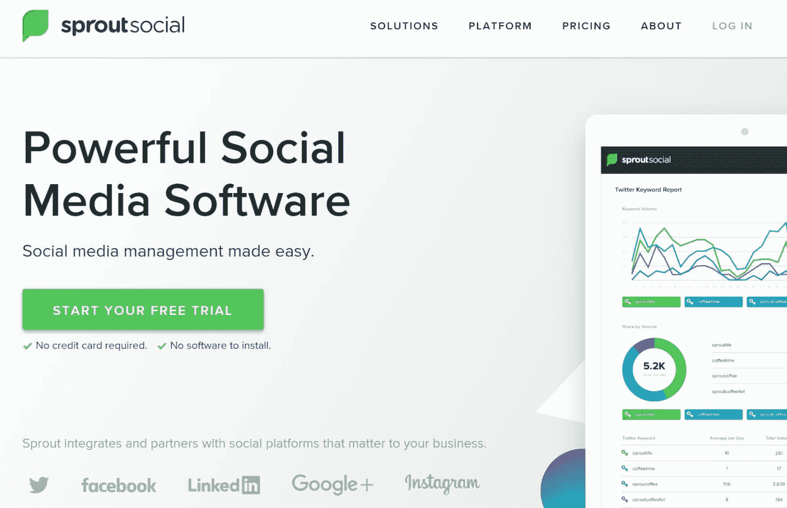](https://sproutsocial.com/)

Sprout Social

Sprout Social 最独特和有用的功能之一是他们的社交收件箱。社交收件箱可让您轻松回复使用社交渠道联系的客户，满足客户服务需求。

### 40.顺风

如果你有或正在与一个视觉品牌合作，Pinterest 可能是相关社交媒体战略的一部分。除非你每周有几个小时来手动固定内容，否则你会希望使用 [Tailwind](https://www.tailwindapp.com/) 来更有效地利用你的时间。

[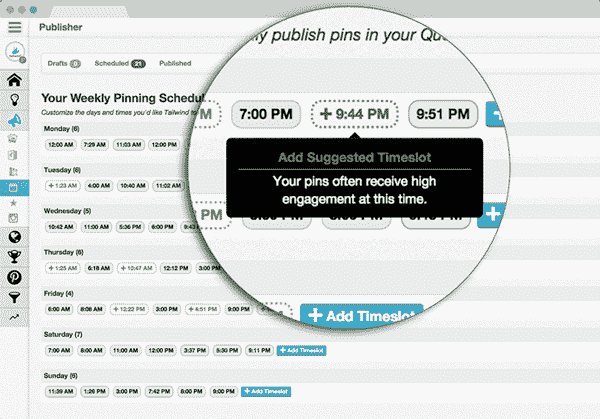](https://kinsta.com/wp-content/uploads/2018/05/tailwind.png)

Tailwind

Tailwind 有几个功能可以帮助你自动化你的 Pinterest 营销策略。一个是能够安排这些引脚到董事会，你的追随者和个人资料查看者可以看到在最佳时间。

另一个是“循环”大头针的能力，这有助于为您最受欢迎的大头针增加更多的印象和参与度。

## 计时器/跟踪工具

作为一名自由职业者，时间是你最宝贵的财富。

因为当你为自己工作时，你拥有自己的时间，许多自由职业者模糊了工作时间和个人时间的界限。两者之间没有明确的分界线最终会导致精疲力尽——所以确保你在为时已晚之前掌握好工作和生活的平衡！

计时器或时间追踪软件在你自由职业之旅的开始是必不可少的，可以帮助你了解你在最受欢迎的服务上花了多少时间。当你开始扩展你的业务时，他们也可以用来跟踪你的承包商的时间。

就时间跟踪能力而言，以下是一些适合自由职业者的最佳工具:

### 41.Hubstaff

Hubstaff 是一个专门为管理远程团队而设计的时间跟踪器。

[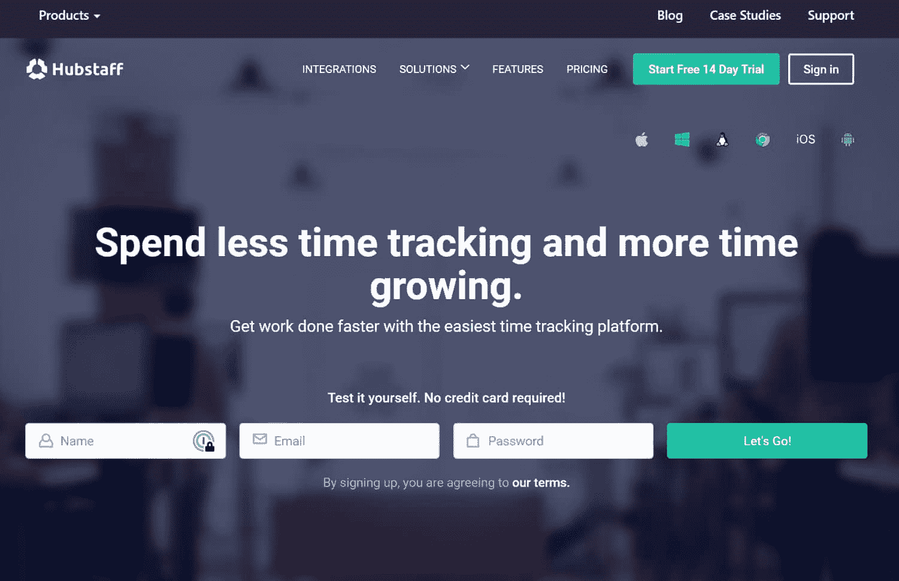](https://hubstaff.com/)

Hubstaff

它对用户的在线活动进行截图，这样你就可以看到你的团队是在工作还是在偷懒。你必须决定，作为老大哥，你是否想和那些为你工作的人一起扮演这个角色，或者你是否能接受客户要求你使用这个工具！

您还可以在 Hubstaff 内直接开具发票和付款。

### 42.收获

[Harvest](https://www.getharvest.com/) 是最可靠的时间追踪工具之一。它集成了 Asana、Trello、Basecamp 和 Quickbooks 等项目管理工具，并允许您从应用程序本身发送发票。

[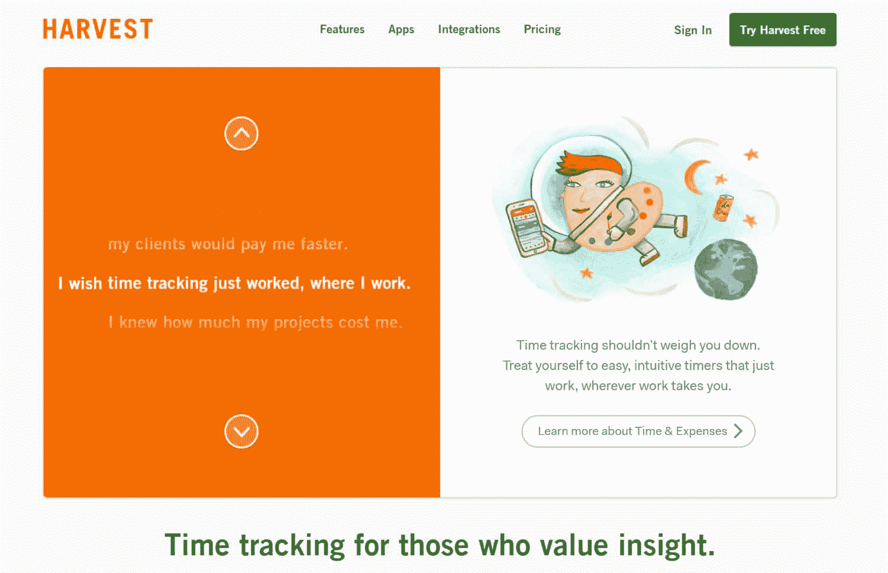](https://www.getharvest.com/)

Harvest

它还允许您通过客户端计费功能对客户端进行计费，从而轻松共享相关的时间跟踪数据。

### 43.重新计算时间

[RescueTime](https://www.rescuetime.com/) 监控你的屏幕活动，让你记录你在某些网站上花了多少时间。它会生成详细的报告，您可以使用这些报告来分析使用模式并纠正任何错误。

[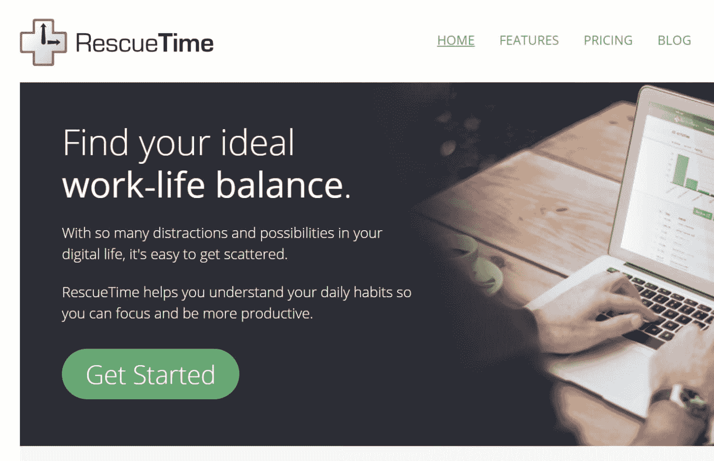](https://www.rescuetime.com/)

RescueTime

Qbserve 为 Mac 用户提供了一个类似的工具。

### 44.stay focused

你是那种不由自主地迷失在社交媒体新闻的黑洞中的人吗？StayFocusd 是谷歌 Chrome 的一个扩展，可以限制你花在浪费时间的网站上的时间。由于我们的大脑[需要 25 分钟来从分心中重新集中注意力](https://lifehacker.com/how-long-it-takes-to-get-back-on-track-after-a-distract-1720708353)，这将有助于提高你的工作效率。

[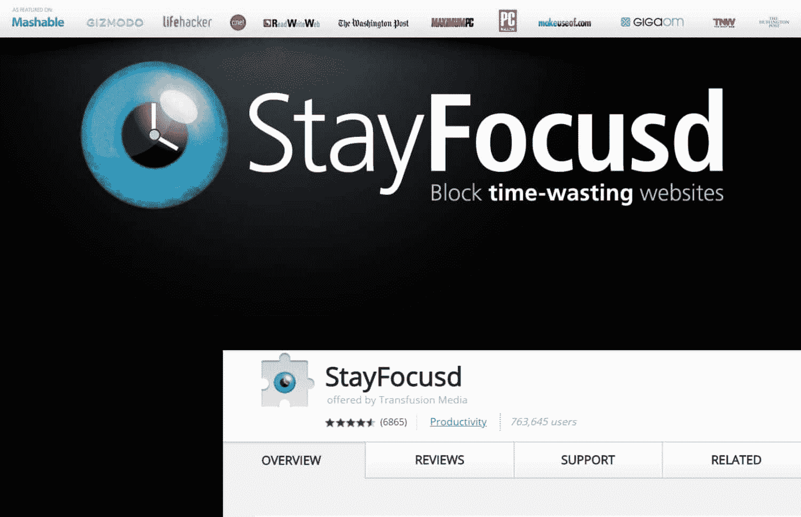](https://chrome.google.com/webstore/detail/stayfocusd/laankejkbhbdhmipfmgcngdelahlfoji?hl=en)

StayFocusd

### 45.托格尔

Toggl 是目前最简单的时间追踪器之一。它可以让你一键跟踪时间。您可以轻松地在不同任务之间切换并创建报告。将该工具作为桌面应用程序或谷歌 Chrome 扩展下载。

[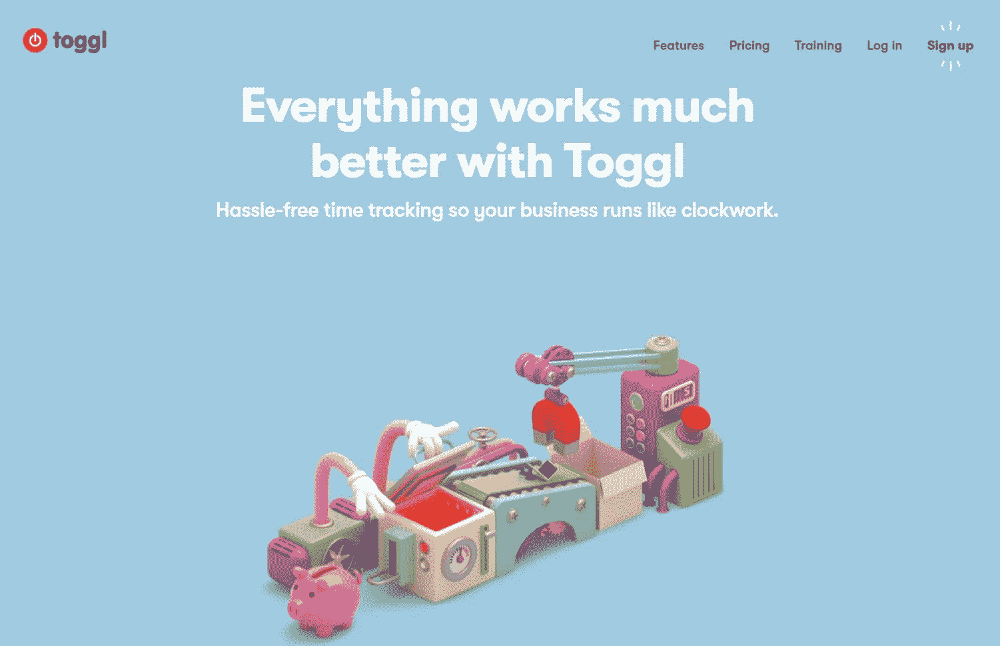](https://www.toggl.com/)

Toggl

你可能也想看看 [Clockify](https://clockify.me/) ，这是一个 100%免费的团队时间跟踪软件。

### 46.蒂米尼耶

Timeneye 是一个简单、智能的时间跟踪工具，帮助团队和自由职业者跟踪他们的项目，并提供预算和计费时间跟踪。

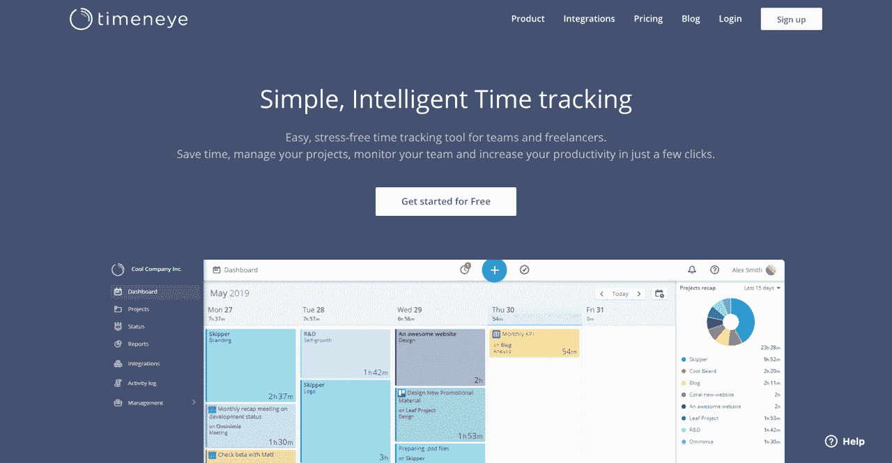

Timeneye

Timeneye 结合了易于使用的时间跟踪和报告功能。自由职业者和个人用户可以从免费的基本计划开始，然后升级到更大的专业计划

### 47.下午 3 点

作为一名自由职业者，你通常会与世界各地的人通信。厌倦了试图找出一个人在哪个时区？使用免费工具如 [there.pm](https://there.pm/) 轻松跟踪你的朋友&队友的时区。有一个 Mac 应用程序，Windows 版本即将推出！

There.pm

## 视频聊天工具

如果你与海外客户合作，通过手机网络给他们打电话可能会很贵。幸运的是，有一个方便的解决办法:视频聊天应用程序，让你可以免费联系世界各地的人。

无论是音频还是视频通话，自由职业者的最佳工具——视频聊天应用——让世界变得更小，促进了全球联系:

### 48.网络电话

Skype 适用于本地或国际的语音和视频通话。当双方都在 wifi 上时，它是免费使用的，但你也可以购买点数来使用它拨打国际电话号码。

[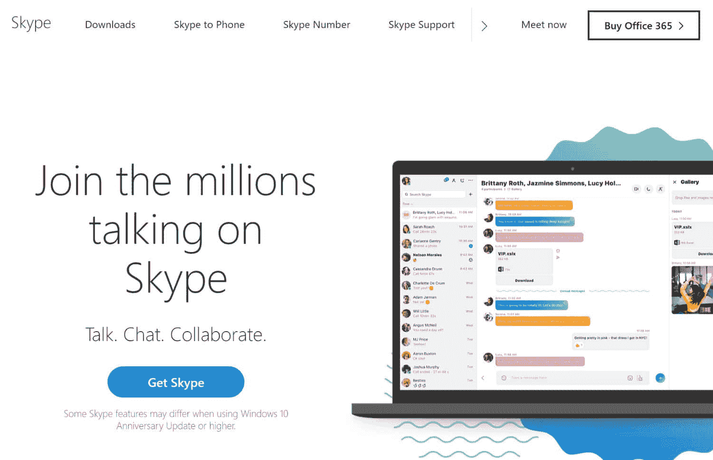](https://www.skype.com)

Skype

### 49.一款云视频会议软件

[Zoom](https://zoom.us/) 允许您召开 100 多人的在线会议(或网络研讨会),同时还提供视频录制功能。它可以免费用于 40 分钟的会议，参与者有限，但对于那些需要更多时间的人来说，付费计划非常实惠。

Zoom

## 书写工具

如今最受欢迎的自由职业技能之一是内容写作。如果这是你想提供的自由职业服务，注册[卡莉·摩尔的时事通讯](https://www.kaleighmoore.com/newsletter/)向大师学习(或者查看她共同主持的[创意课播客](https://creativeclass.co/podcast/))。

人们发现[内容营销](https://kinsta.com/learn/content-marketing/)在[推动转化和购买](http://contentmarketinginstitute.com/2017/10/stats-invest-content-marketing/)方面是有效的，这就是为什么许多网站对内容(尤其是 SEO 优化的内容)有稳定的需求。无论你是为客户还是为自己的品牌做内容营销，这些都是自由职业者的最佳工具:

### 50.海明威

[海明威](http://www.hemingwayapp.com/)应用程序是一个[免费语法检查工具](https://kinsta.com/blog/grammar-checker-tools/)，为你为自己或客户创作的书面内容提供许多[有用的见解。其中最有趣的是判断你的内容阅读水平的能力——比如你使用的单词和句子结构对普通在线观众来说可能太高级了。](https://kinsta.com/blog/content-length/)

[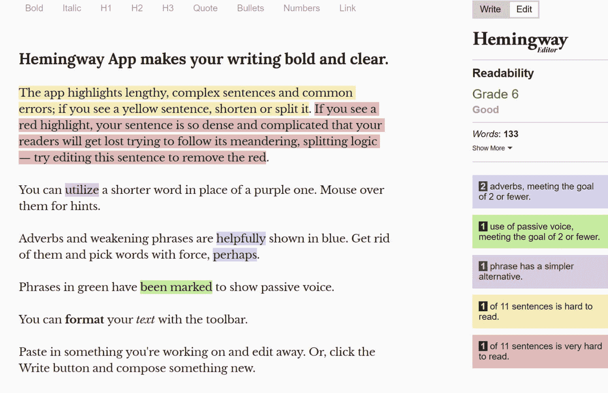](http://www.hemingwayapp.com/)

Hemingway

更深入地挖掘，海明威帮助你的写作更简洁和可读，他提出了一些建议，如用更简单的词代替行话，打破段落，改变主动和被动语态以保持一致性。更多[校对技巧，请见我们这里的专用帖子](https://kinsta.com/blog/proofreading-tips/)。

### 51.Yoast SEO

如果你在你的自由职业组合网站上使用 WordPress，Yoast SEO 插件是 T2 的必备插件。作为[下载量最高的五个](https://wordpress.org/plugins/browse/popular/) WordPress 插件之一，使用它意味着你会有一个好公司。

Yoast SEO plugin

[Yoast SEO](https://kinsta.com/blog/yoast-seo/) 使得在*的每个*帖子和页面上实施[现场 SEO](https://kinsta.com/blog/what-does-seo-stand-for/) 最佳实践变得容易。当然，为了有效，你必须自己做[关键词研究](https://kinsta.com/blog/keyword-research/)——Yoast 只能告诉你是否有效地使用了关键词，而不能告诉你是否使用了有效的关键词。

一般来说，Yoast 还可以帮助处理 WordPress SEO，比如处理重定向和为你的网站生成 T2 XML 站点地图。

### 52.语法上

[Grammarly](https://www.grammarly.com/) 提供了最受欢迎的语法检查工具。很难想象一个自由职业者不会从[的语法运用](http://www.the-blogsmith.com/grammarly-review/)中受益——即使你不是作家，你仍然想确保你在客户邮件、个人社交媒体、你的自由职业组合网站等等上表现得清晰。

[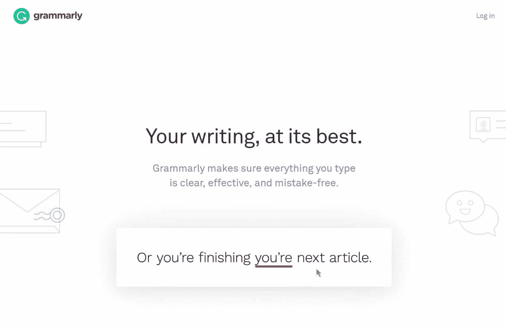](https://www.grammarly.com/)

Grammarly

语法上修复语法错误，包括主动词一致、标点符号和修饰语位置，甚至可以检测出在错误上下文中使用的正确拼写的单词。语法上最好的一点是，它解释了*为什么*做了修改，帮助你不断提高写作水平。

如果你与其他作家合作，它还有一个[剽窃检查工具](https://kinsta.com/blog/grammarly-alternative/#grammarly-pricing)可能会派上用场。

### 53.KWFinder

如果你正在为 SEO 写文章，找到一个关键词进行优化是很重要的。 [KWFinder](https://kwfinder.com/) 可以帮忙。它每天提供大量的免费查询，相比之下，现在有限但很受欢迎的[谷歌关键词计划](https://adwords.google.com/home/tools/keyword-planner/#?modal_active=none)或 [Ubersuggest.io](https://neilpatel.com/ubersuggest/) 。你可以使用这个工具来挖掘和优化不同的搜索引擎和不同的国家。

[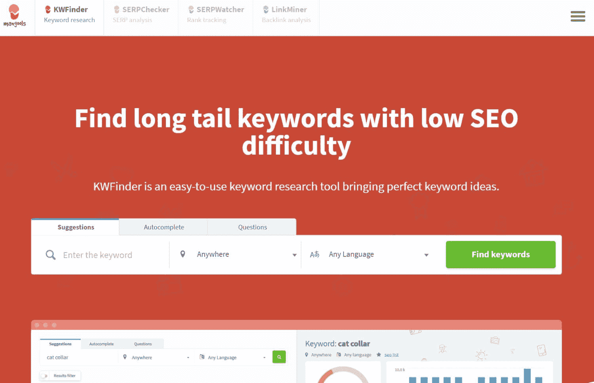](https://kwfinder.com/)

KWFinder

如果 SEO 是你自由职业者服务的一大部分，考虑投资更强大的 Ahrefs，用于关键词规划、反向链接管理等等。

### 54.Evernote

试图把你需要知道的一切都储存在你的大脑里是一种灾难。你的大脑不可能独自储存你一天中的每一件事和每一分钟的细节。

使用像 Evernote 这样的工具把你头脑中的东西整理出来，变成可操作的(可搜索的)笔记格式。将笔记整理到笔记本中(可能由某些客户整理)，并添加标签，以便更容易找到相关信息。Evernote 是一个简单的应用程序，但对头脑风暴、写博客和在旅途中做笔记非常有用。

[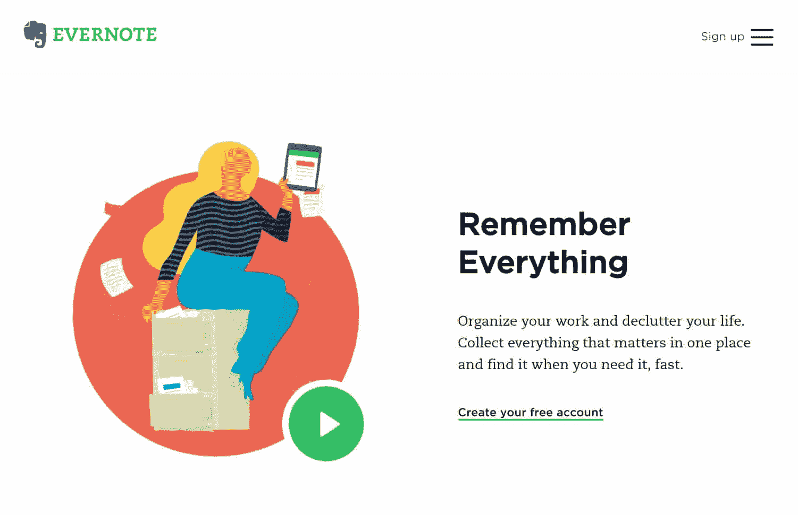](https://evernote.com/)

Evernote

如果你只是做简单的笔记，另一个你可能也想看看的选择是 [Google Keep](https://keep.google.com/u/0/) ，因为它在谷歌生态系统和新的 Gmail 中集成得非常好。

## 最后的想法

有了自由职业者的最佳工具，扩展你的自由职业业务变得无比简单。为了更有效率，花时间设置和了解与你工作最相关的选项——然后看着你的收入增长！

如果你真的想提高你的电子邮件效率，看看这些[顶级 Gmail 插件和扩展](https://kinsta.com/blog/gmail-add-ons/)并了解一下 [Gmail 搜索运营商。](https://kinsta.com/blog/gmail-search-operators/)

现在，轮到你了:你认为自由职业者最好的工具是什么？

* * *

让你所有的[应用程序](https://kinsta.com/application-hosting/)、[数据库](https://kinsta.com/database-hosting/)和 [WordPress 网站](https://kinsta.com/wordpress-hosting/)在线并在一个屋檐下。我们功能丰富的高性能云平台包括:

*   在 MyKinsta 仪表盘中轻松设置和管理
*   24/7 专家支持
*   最好的谷歌云平台硬件和网络，由 Kubernetes 提供最大的可扩展性
*   面向速度和安全性的企业级 Cloudflare 集成
*   全球受众覆盖全球多达 35 个数据中心和 275 多个 pop

在第一个月使用托管的[应用程序或托管](https://kinsta.com/application-hosting/)的[数据库，您可以享受 20 美元的优惠，亲自测试一下。探索我们的](https://kinsta.com/database-hosting/)[计划](https://kinsta.com/plans/)或[与销售人员交谈](https://kinsta.com/contact-us/)以找到最适合您的方式。