# OceanWP:易于定制和超快的 WordPress 主题

> 原文:# t0]https://kinta . com/blog/oceanwp/

如果你用页面生成器创建 WordPress 网站，你可能会遇到 OceanWP。与 GeneratePress 和 Astra 一起，它形成了[流行主题的“三巨头”](https://kinsta.com/best-wordpress-themes/)与 [WordPress 页面生成器](https://kinsta.com/blog/wordpress-page-builders/)配对。如果你不熟悉 WordPress 页面生成器世界，OceanWP 是一个免费的多用途 WordPress 主题，它通过实时 WordPress 定制器给你很多控制来定制你的站点设计。不仅如此，[它的速度也非常快](https://kinsta.com/blog/fastest-wordpress-theme/#oceanwp)！

核心 [OceanWP 主题](https://oceanwp.org/)免费，在 WordPress.org 上市[。除此之外，它还包括各种免费和优质的扩展，可以添加额外的功能。](https://wordpress.org/themes/oceanwp/)

在我们的 OceanWP 评论中，我们将分享更多是什么让这个主题如此独特和受欢迎。

## OceanWP 为什么这么受欢迎？

我们认为分享脸书元素社区用户的一些想法会更有帮助，而不是滔滔不绝地发表一个观点。您应该会注意到贯穿所有这些主题的一条共同主线:

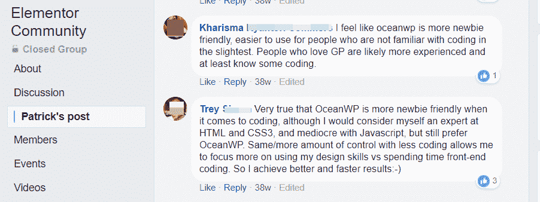

Two comments in the Elementor Community Facebook group

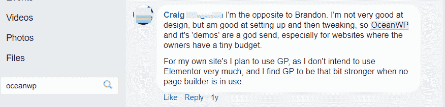

Another comment in the Elementor Community Facebook group

基本上，OceanWP 的主要吸引力在于它让你能够通过 WordPress 定制器以非常用户友好、直观的方式定制你的主题，包括对 WooCommerce 的深度支持。OceanWP 网站有各种形状和大小，所以如果你想知道一个网站是否使用 OceanWP 主题，看看我们的 [WordPress 主题检测工具](https://kinsta.com/tools/what-is-my-ip/wordpress-theme-detector/)。

通过这种定制，您可以为使用页面生成器设计的内容创建框架，也可以对主题进行更多的控制。

除了这些控件，OceanWP 还包括各种免费和付费的演示站点,允许你快速导入预制的设计，包括 WordPress 定制器设置和登陆页面的 Elementor 模板。

> Kinsta 把我宠坏了，所以我现在要求每个供应商都提供这样的服务。我们还试图通过我们的 SaaS 工具支持达到这一水平。
> 
> <footer class="wp-block-kinsta-client-quote__footer">
> 
> 
> 
> <cite class="wp-block-kinsta-client-quote__cite">Suganthan Mohanadasan from @Suganthanmn</cite></footer>

[View plans](https://kinsta.com/plans/)

通过这些演示，你可以很快让 OceanWP 变成这样:

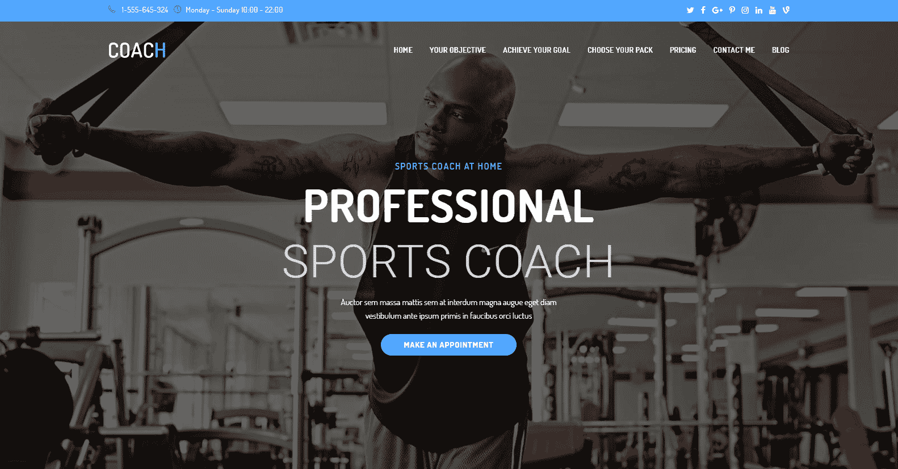

OceanWP sports coach demo

或者像这样:

OceanWP eCommerce store demo

或者像其他演示一样:

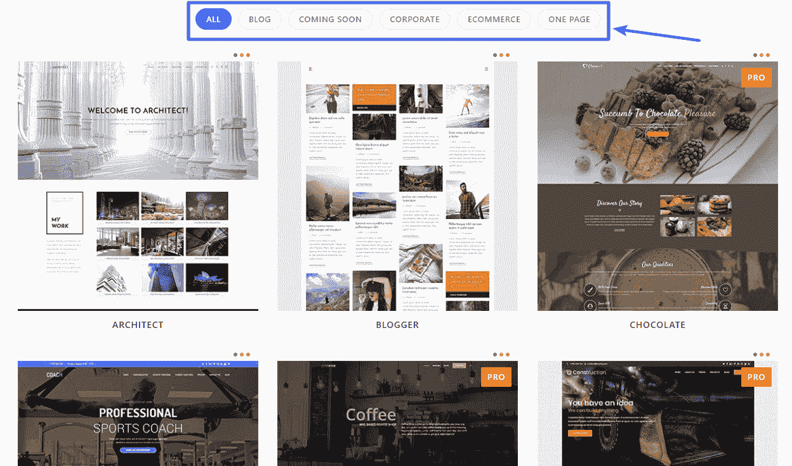

All OceanWP demos

为了获得更强大的功能，OceanWP 还提供免费和付费的扩展，例如:

*   弹出登录
*   照片墙
*   白色标签
*   [投资组合](https://kinsta.com/blog/wordpress-portfolio-plugins/)
*   WooCommerce 弹出窗口
*   粘性页脚
*   模态窗口
*   [帖子滑块](https://kinsta.com/blog/wordpress-slider/)
*   海洋钩子
*   演示导入
*   自定义侧栏
*   元素或小部件
*   响应式侧面板(*内有部件*)
*   [粘性标题](https://kinsta.com/blog/sticky-header/)
*   页脚标注
*   WooCommerce 产品分享
*   社交分享

与大多数 WordPress 主题相比，所有这些都包含在一个非常轻量级的包中。这意味着它在性能方面非常出色。

## 如何用 OceanWP 导入一个演示站点

向您展示定制器如何与已经构建好的站点一起工作会更容易，所以让我们先来快速了解一下 OceanWP 是如何轻松地导入一个演示站点的。

一旦你从 WordPress 安装了免费的 [Ocean Demo Import](https://wordpress.org/plugins/ocean-demo-import/) 和 [Ocean Extras](https://wordpress.org/plugins/ocean-extra/) 附加组件，你就可以直接从你的 WordPress 仪表盘导入演示内容:

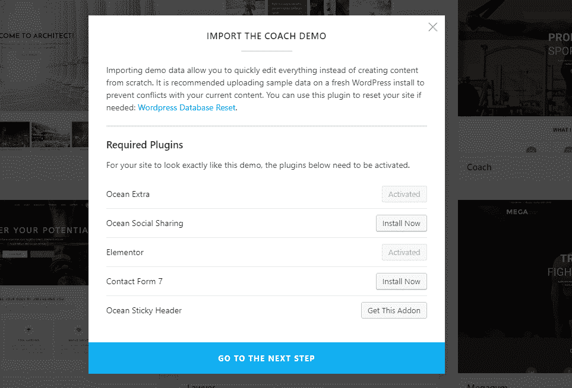

How to import an OceanWP demo

一旦您完成演示过程，您的网站应该看起来完全一样的演示。

要定制演示的主页设计，您可以使用 Elementor:

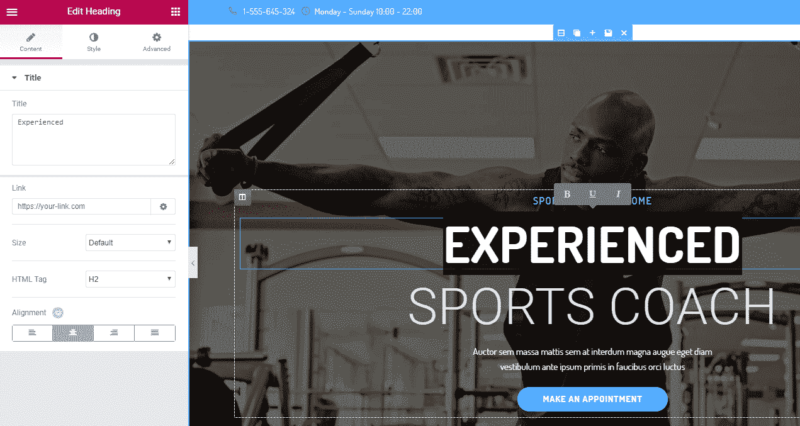

OceanWP uses Elementor for the landing pages in its demos

为了定制你的主题的其余部分，你将使用 WordPress 定制器。

说到…

## OceanWP WordPress 定制器设置

WordPress 定制器是 OceanWP 真正闪光的地方。即使只安装了很少的扩展，您也有很多选择:

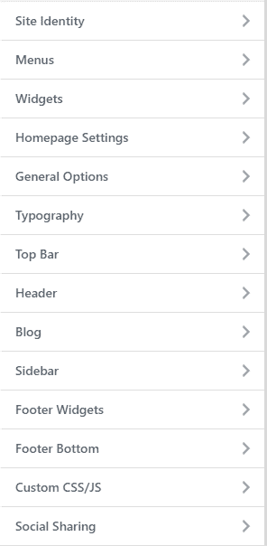

Full list of Customizer settings

这些选项的深度远远超出了大多数常规 WordPress 主题所能提供的。

让我们看几个例子:

### 控制你的头球

大多数页面构建者仍然无法触及的领域之一是您的页眉…这就是为什么 OceanWP 为您提供了一大堆控制页眉的选项(以及页眉上方的“顶栏”——在本演示中包含联系信息和社交资料):

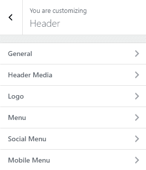

Header Customizer settings

你不仅可以从预制的样式中选择，还可以通过许多细节设置来控制它的外观……甚至可以为不同的设备添加到标题*中的实际填充:*

Header style and padding

### 控制你的博客

我们不能涵盖每一个单一的设置，但让我们看看另外两个…

在**博客**区，你可以从总体布局控制一切…

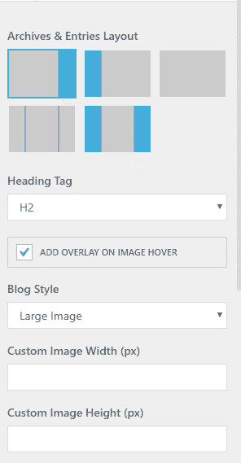

Blog layout options

…下至各种元素和元信息的特定排序/可见性:

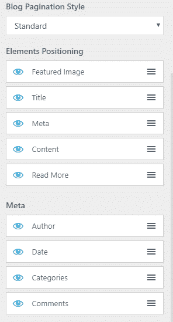

Blog details Customizer settings

### 控制你网站的排版

想改变你网站上的字体和字体颜色吗？没问题，只要前往**排版**部分，你会看到另一个长长的选项列表:

## 注册订阅时事通讯

### 想知道我们是怎么让流量增长超过 1000%的吗？

加入 20，000 多名获得我们每周时事通讯和内部消息的人的行列吧！

[Subscribe Now](#newsletter)

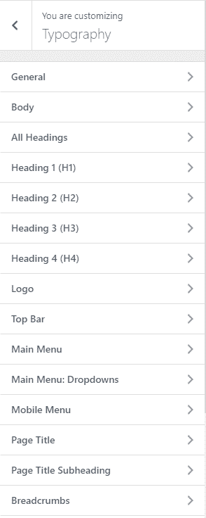

Typography settings

### 你在其他区域也能得到相似的深度

这一部分的目标并不是真的向你展示每一个单独的设置(*还有很多！*)。相反，它是为了让你理解你可以从 WordPress 定制器和 OceanWP 中期望的控制深度。

虽然完成所有的设置肯定会花费你一些时间，但是你有能力控制你的站点的几乎每一个重要方面，而不需要直接接触任何代码/CSS。

## 其他 5 个有用的 OceanWP 功能，让你的生活更轻松

除了演示和 WordPress Customizer 功能之外，这里还有一些 OceanWP 的突出特性，它们会让你的生活更轻松，在你的网站上工作时会给你更多的灵活性。

### 1.个别员额控制

有了免费的 OceanWP Extras 附加组件，您可以访问关于各个内容的详细的新元框:

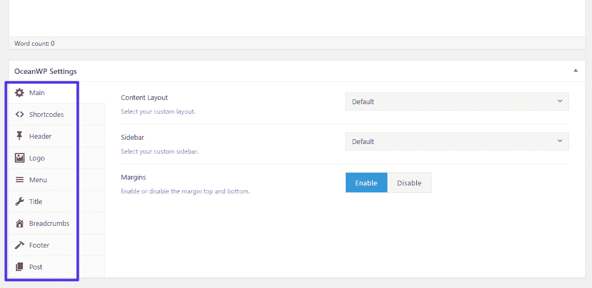

Meta box on individual posts

通过这些众多的选项，您可以(部分地)基于每篇文章的**或每页**的**来控制以下设置:**

*   更改内容布局或侧栏布局
*   禁用页眉或顶栏
*   更改徽标或菜单颜色
*   [禁用帖子/页面标题](https://kinsta.com/knowledgebase/hide-page-title-wordpress/)
*   禁用页脚
*   其他较小的功能

虽然这些控件在各种特殊情况下都很有用，但是如果您将 OceanWP 与页面生成器一起使用，它们会特别有用，因为您可以禁用那些妨碍页面生成器的元素。

### 2.启用/禁用特定脚本/CSS 的选项

如果你关心[你的网站加载](https://kinsta.com/learn/page-speed/)的速度，你会喜欢 OceanWP 允许你启用或禁用单独的 JavaScript 脚本和 CSS 片段:

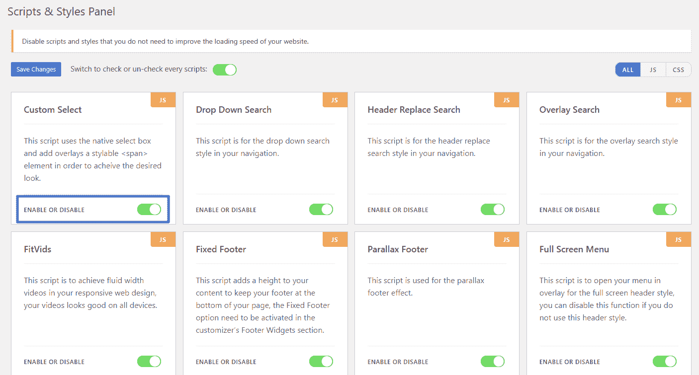

How to disable specific scripts in OceanWP

基本上，这个区域可以让你禁用那些你实际上不使用的东西来加速你的站点。

### 3.大量的钩子+条件句

钩子使得在你的站点的不同区域插入内容变得容易，而不需要直接编辑主题的代码。例如，你可以使用钩子在你的文章标题下插入一个广告，或者只是在其他地方添加一般的内容。

Struggling with downtime and WordPress problems? Kinsta is the hosting solution designed to save you time! [Check out our features](https://kinsta.com/features/)

一旦你掌握了窍门，它们会非常有用。

当谈到钩子时，优质的 OceanWP 钩子附件不会让人失望。

它给你一大堆钩子。真正酷的是，所有这些挂钩还能让您:

*   仅在特定内容上启用挂钩内容(*就像您的主页*)
*   仅对特定用户角色启用挂钩内容

OceanWP hooks options

虽然钩子本身在针对这个利基市场的主题中并不是唯一的，但是条件逻辑和用户角色定位是唯一的。

### 4.深度 woo 商务整合

OceanWP 的另一个卖点是与 WooCommerce 的深度整合。如果你在你的网站上安装了 WooCommerce，你会在 WordPress 定制器中得到一个新的 WooCommerce 区域:

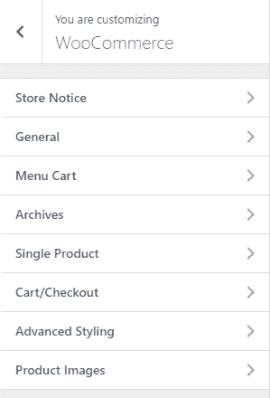

OceanWP WooCommerce settings

这也不仅仅是一些令牌设置。它变得非常深入–例如，您甚至可以在购物车页面上自定义追加销售和交叉销售的数量，并启用免分心购物车/结账:

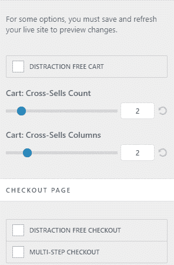

Detailed cart/checkout settings

### 5.许多其他扩展

到目前为止，我们还没有触及许多其他免费和收费的扩展。但是请记住——ocean WP 还可以让你添加大量其他有用的功能。

点击查看[扩展的完整列表。](https://oceanwp.org/extensions/)

如果你想知道为什么有这么多扩展，这实际上是一个很好的方法，因为它使事情模块化。

OceanWP 让您挑选想要的确切功能，而不是将所有东西都放在一个主题中，您可能需要也可能不需要所有这些功能。

## OceanWP 速度测试

我们很想看看 OceanWP 的表现如何，所以我们进行了一些速度测试。我们在我们的开发网站(位于金斯塔)上导入了完整的[体育蔻驰](https://coach.oceanwp.org/)演示内容，并做了一些小改动。还按照 OceanWP 的建议安装了 Elementor。

1.  我们从页脚禁用了谷歌地图。这是一个众所周知的性能杀手，老实说永远不应该出现在主页上！
2.  我们启用了 [Kinsta CDN](https://kinsta.com/help/kinsta-cdn/) ,以便资产可以从我们运行测试的任何地方尽可能快地加载。
3.  我们添加了 Google Analytics 来更好地模拟生产网站。

然后我们进行了五次速度测试，取平均值。

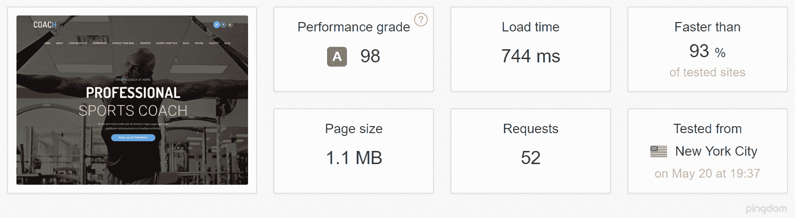

OceanWP speed test (source: [Pingdom](https://tools.pingdom.com/#!/eIvDCF/https://wpdev.ink))

哇，😲744 ms？这对于一键导入演示内容并做三个小改动来说是非常棒的。记住，有了脚本和样式面板，你可以很容易地浏览和优化它。但是很高兴知道，有了 OceanWP，**你可以期待出色的性能**！

## OceanWP 多少钱？

核心的 OceanWP 主题是 100%免费的。你可以在 WordPress.org 找到 7 个免费的扩展。

如果你想要高级扩展，你可以单独购买，每个 9.99 美元起，在一个网站上使用。

或者，如果你想访问**所有 11 个高级扩展**，以及所有的**专业演示**，你可以购买核心扩展包，单个站点许可起价 39 美元。

如果你想更多地了解为什么这个主题的开发者 Nicolas 决定采用这种付费模式，可以查看一下他在 Freemius 上的帖子。

## 试试 OceanWP——它是免费的

因为 OceanWP 的大部分核心功能都是免费的，你可以从 WordPress.org 下载 OceanWP，并在不影响你钱包的情况下使用它。

虽然高级扩展肯定增加了有用的功能，但你应该能够从免费版本中很好地掌握主题。然后，如果你喜欢，你可以随时添加这些额外的扩展。

现在轮到你了——你用过 OceanWP 吗？你认为它和其他多用途 WordPress 主题相比怎么样？

* * *

让你所有的[应用程序](https://kinsta.com/application-hosting/)、[数据库](https://kinsta.com/database-hosting/)和 [WordPress 网站](https://kinsta.com/wordpress-hosting/)在线并在一个屋檐下。我们功能丰富的高性能云平台包括:

*   在 MyKinsta 仪表盘中轻松设置和管理
*   24/7 专家支持
*   最好的谷歌云平台硬件和网络，由 Kubernetes 提供最大的可扩展性
*   面向速度和安全性的企业级 Cloudflare 集成
*   全球受众覆盖全球多达 35 个数据中心和 275 多个 pop

在第一个月使用托管的[应用程序或托管](https://kinsta.com/application-hosting/)的[数据库，您可以享受 20 美元的优惠，亲自测试一下。探索我们的](https://kinsta.com/database-hosting/)[计划](https://kinsta.com/plans/)或[与销售人员交谈](https://kinsta.com/contact-us/)以找到最适合您的方式。