# 如何使用条纹雷达防止和减少 98%的信用卡欺诈

> 原文：<https://kinsta.com/blog/credit-card-fraud-stripe/>

众所周知，电子商务和 SaaS 行业正在蓬勃发展。网上商店比以往任何时候都多，每天都有成千上万的新企业涌现出来。世界各地的新服务和产品无时无刻不在试图向我们推销某种东西。在过去的 10 年中，我们的购物行为发生了巨大的变化，今天[我们倾向于在网上购买几乎所有的东西](https://kinsta.com/blog/ecommerce-statistics/):披萨、耐克鞋、最新的 Xbox、小型企业 CRM、会计软件，甚至是新的特斯拉 Model S。

你可以在不到一个小时的时间里启动你的网上商店，你所需要的只是一个域名，一个主题，一些插件和一个支付处理器。在 SaaS 开展业务、销售服务、获取经常性收入以及[将其提升到下一个水平](https://kinsta.com/blog/bootstrapping-startup/)也比以往任何时候都更容易！

电子商务店主和数字产品提供商想要分一杯羹，但随着这些行业的持续增长，电子商务/SaaS 信用卡欺诈事件也在增加。如果你是一个企业主，你可能很熟悉这种情况，并且总是在寻找新的方法来减少欺诈交易的数量，更好的是，尽可能地防止它们。

为了确保我们意见一致，以下是对在线支付欺诈的简要描述:

> 在线支付欺诈涉及个人获取他人的信用卡号码，并使用它进行未经授权的在线购物。个人可能会购买一件物品(或购买一个数字产品)，然后以实际价格的一小部分在网上转售。原始持卡人(在某个时候)会发现这种未经授权的交易，并向他们的银行提出争议(拒付)。

很令人沮丧，不是吗？我知道你的感受。它们会让你的企业不断头疼，更重要的是会让你损失很多钱。如果你正在使用 [Stripe](https://stripe.com/) 作为你的在线支付处理器，那么这篇文章就适合你。😄

我将向您展示条纹雷达如何让您的生活更轻松！**多亏了这种基于机器学习的解决方案，我们能够将 Kinsta 的信用欺诈减少 98%。**我们不必再花时间审查有争议的费用和可疑的注册。相信我，那是一种非常好的感觉！让我们深入细节。

## 电子商务和数字欺诈的趋势

这并不奇怪，但数字欺诈的数量正在迅速增加。今天我们将使用 Pymts 和 Forter 在 2016 年进行的调查中的一些数字。您可以从这个[链接](http://pymnts.fetchapp.com/files/b2d59e)下载完整的研究报告。以下是一些最有趣的发现:

*   在 2015 年第四季度，每 1000 笔交易中有 27 起欺诈企图。
*   在 2016 年 Q1 奥运会上，每 100 美元的交易中约有 4.79 美元存在风险(在 2015 年 Q1 奥运会上，“只有”1.89 美元)。

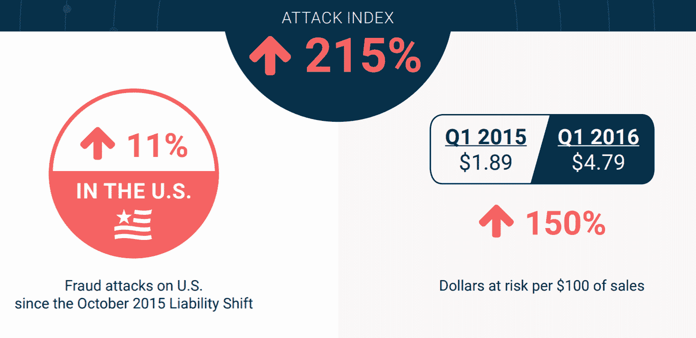

Digital fraud trends (Image source: Pymts and Forter)


*   从 Q1 到第四季度，数字产品的欺诈攻击率翻了两番多。
*   从 Q1 到第四季度，奢侈品欺诈攻击率几乎翻了一番。
*   每 100 美元中有 7.77 美元的数字商品面临风险。

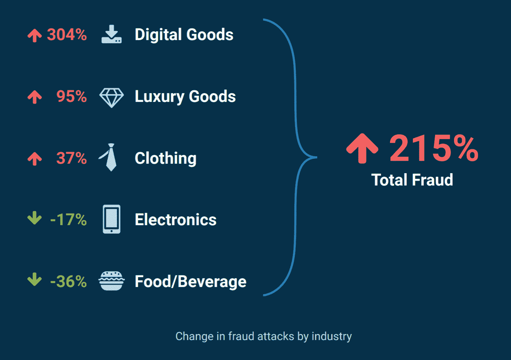

Fraud attacks by industry (Image source: Pymts and Forter)


根据 LexisNexis 的研究，2014 年美国零售商的年度欺诈成本达到 320 亿美元。据估计，零售商在 2015 年损失了 **1.3%的收入**，是 2014 年的两倍多。哎哟，😧那是一大笔钱。下面可以看到 2015 年每 1000 笔交易的攻击量。


> Kinsta 把我宠坏了，所以我现在要求每个供应商都提供这样的服务。我们还试图通过我们的 SaaS 工具支持达到这一水平。
> 
> <footer class="wp-block-kinsta-client-quote__footer">
> 
> 
> 
> <cite class="wp-block-kinsta-client-quote__cite">Suganthan Mohanadasan from @Suganthanmn</cite></footer>

[View plans](https://kinsta.com/plans/)

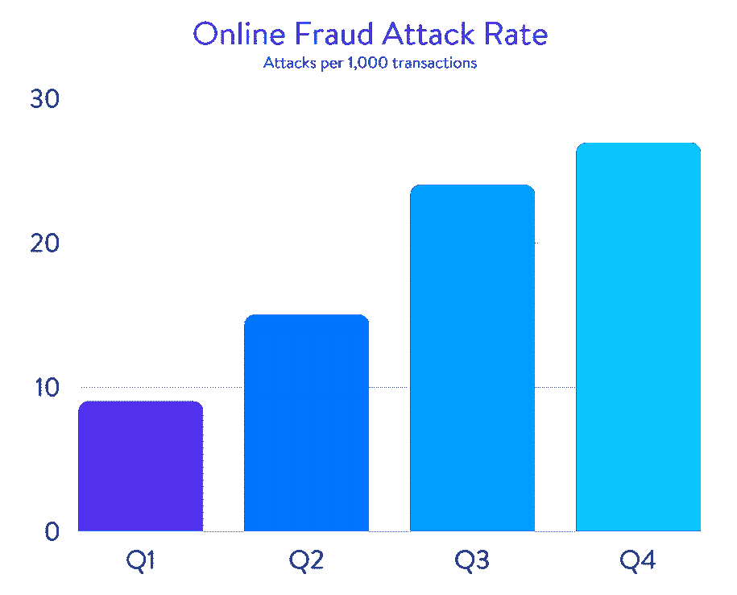

Online fraud attack rate


受影响最大的行业是数码产品、服装、电子产品、食品和奢侈品。我们可以看到这些是严重的数字，当涉及到在线支付欺诈时，我们谈论的是大量的收入损失。

## 为什么你需要防止信用卡诈骗，为什么它对你的生意有害

我相信你知道答案，但让我为你总结一下网上欺诈的真正后果，以及它如何影响你的业务。

首先，它**不会让你专注于你的业务**。如果你的在线商店或 SaaS(软件即服务)有大量的销售或注册，你将不得不花大量的时间处理欺诈交易、购买和有争议的费用。你在经营一家企业，你不能整天处理这类问题。您必须想出如何自动化它，并在它们发生之前阻止它们。

第二，当有一天你醒来，发现因为你的支付处理程序暂停了你的账户，你已经破产了，这可能是毁灭性的。😭相信我，我知道我在说什么。在我们业务的早期，由于一些欺诈交易，我们的**支付处理器关闭了我们的账户**，我们突然陷入了停顿。我们无法获得收入，也无法让新客户注册我们的服务。是啊，很糟糕，但感谢上帝很快就解决了。然而，情况并非总是如此。你可以[在这里阅读完整的恐怖故事](https://kinsta.com/blog/startups-avoid-stripe/)。

第三，也是最重要的一点，**退款极其昂贵**。2016 年，电子商务因退款损失了近[70 亿](https://chargeback.com/ecommerce-can-expect-nearly-7-billion-chargebacks-2016/)美元。到 2020 年，电子商务退款损失预计将激增至 310 亿美元。以下是一些流行的支付处理程序的退款成本:

*   [PayPal 每次扣款收取 20 美元](https://kinsta.com/blog/stripe-vs-paypal/#dispute-chargeback-fees)。
*   [Stripe 对每次退款收取 15 美元](https://kinsta.com/blog/stripe-vs-paypal/#dispute-chargeback-fees)(即争议费)。
*   根据银行的不同，退款金额可能在 15 美元到 75 美元之间。它加起来很快。

看看下面的计算，看看一次退款会对您的业务和盈利能力造成多大的伤害。当企业成为实施欺诈的个人的目标时，这些成本会累积起来，并对您企业的财务状况产生重大影响！

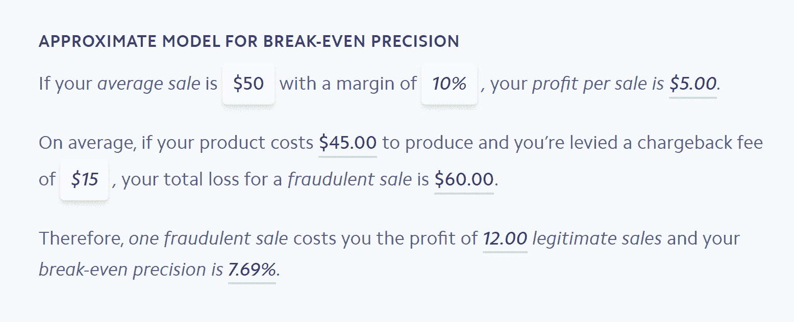

Break-even precision model


如果你想用你自己的数字，你可以[在这里](https://stripe.com/radar/guide#break-even-calculator)玩计算器。好了，介绍完毕，让我们深入了解一下[条纹雷达](https://stripe.com/radar)的工作原理，以及如何利用它来降低欺诈性购买的风险。

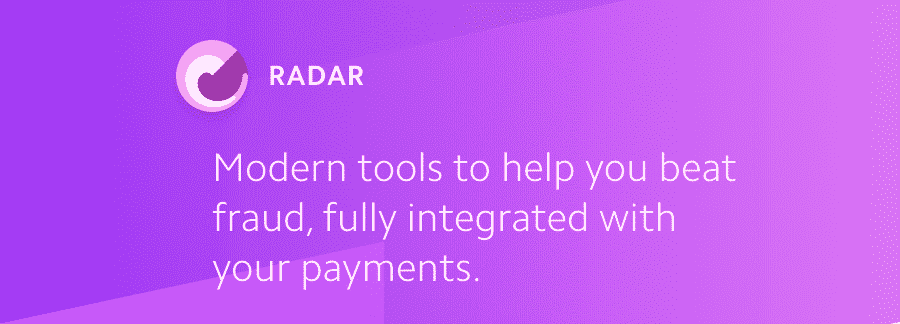

Stripe Radar


## 什么是条纹雷达？它能有什么帮助？

在过去的几年里，Stripe 已经成为最值得信赖和最知名的在线支付处理商之一。两位爱尔兰企业家，约翰和帕特里克·科利森，在 2010 年创立了 Stripe 公司，从那以后，该公司一直呈指数级增长，在收入和市场份额方面仅次于 Paypal。

[Stripe 拥有 900 多名才华横溢的员工，为超过 100，000 家企业提供支持](https://www.bloomberg.com/news/features/2017-08-01/how-two-brothers-turned-seven-lines-of-code-into-a-9-2-billion-startup)每年处理 500 亿美元的交易，是您的企业得到妥善管理的保证。

目前，在我们看来，Stripe 是个人和企业接受在线支付和移动应用的最佳解决方案。在你的在线商店中实现 Stripe 非常容易，使用他们的代码就像做梦一样(如果一位 PayPal 高管正在阅读这篇文章，请向这些人学习如何使你的平台可用……)，他们有最友好的开发人员解决方案。

[雷达](https://stripe.com/radar)是一款条纹产品，最初由[于 2016 年 10 月](https://techcrunch.com/2016/10/19/stripe-launches-radar-to-tackle-e-commerce-fraud-with-machine-learning/)推出。我非常兴奋和高兴的是，Kinsta 是测试版用户之一，我们能够测试和实验这个工具，看看它的全部潜力。事实上，我们甚至提供反馈和建议来帮助进一步改进平台。

Radar 是一种帮助您防止欺诈性支付并减少信用卡欺诈的工具，它可以选择手动审查可疑的支付。这些可疑的支付会被雷达的机器学习系统自动标记，或者在它们触发您之前配置的自定义规则时进行审查。

今年早些时候，推出了雷达 2.0，它提供了更多功能和增强的高级机器学习，以捕捉更多的欺诈活动。

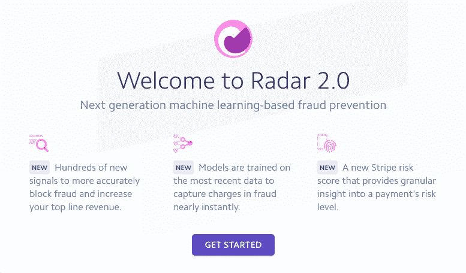

Stripe Radar 2.0


Radar 的[机器学习系统](https://stripe.com/radar/guide)正变得日益智能，这要感谢成千上万的用户正在配置他们的自定义规则，并手动阻止可疑的支付。雷达并不完美，因为我仍然偶尔看到一个明显的欺诈迹象，但没有被系统自动阻止。但我想强调的是**雷达让我们的生活变得如此轻松，我对他们感激不尽**。现在让我们深入了解 Radar 的特性和自定义规则！

[We 💜 @Stripe Radar! It's a must-have #SaaS tool when it comes to fighting online credit card fraud. 💳Click to Tweet](https://twitter.com/intent/tweet?url=https%3A%2F%2Fbit.ly%2F38mQsYN&via=kinsta&text=We+%F0%9F%92%9C+%40Stripe+Radar%21+It%27s+a+must-have+%23SaaS+tool+when+it+comes+to+fighting+online+credit+card+fraud.+%F0%9F%92%B3)

## 条纹雷达中的自定义规则

我不会深入雷达如何工作的所有技术细节，因为我甚至不知道所有的细节，除了它是基于机器学习系统。Stripe 每天管理数千万笔交易，这意味着他们有一个非常大的数据池。他们的系统处理数百万张信用卡的详细信息，并通过算法进行分析，寻找识别每一笔交易的模式，并将它们标记为安全或欺诈。雷达扫描每一笔付款，以帮助识别和防止欺诈。但我们必须给这些算法注入新的动作和信息，以训练它们变得更聪明。这就是 Stripe 庞大的用户群发挥作用的地方。

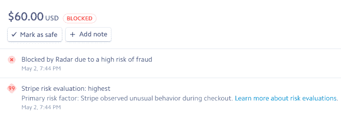

Stripe payment blocked


## 您应该如何以及为什么手动检查交易

每次我们手动审查交易并采取某种类型的行动**时，我们都会训练 Stripe 的机器学习算法**变得更加复杂。每当您手动检查欺诈活动，寻找可疑信息时，都会附上详细信息，清楚地向您显示特定的购买或注册是欺诈性的。

基于大量的人工审查，你应该能够很容易地发现一个模式。很有可能你可以建立一个自定义规则，这样算法就可以识别并阻止这些类型的交易。

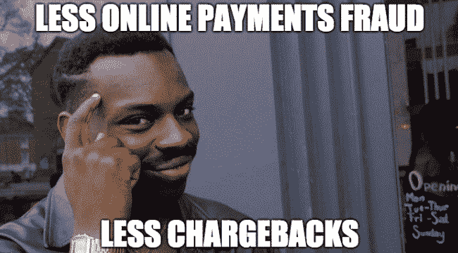

Payment fraud


欺诈交易的减少意味着退款的减少和口袋里更多的钱。

### 发现欺诈活动

那么，如何快速发现欺诈活动呢？好吧，我们来看看下面这张截图。

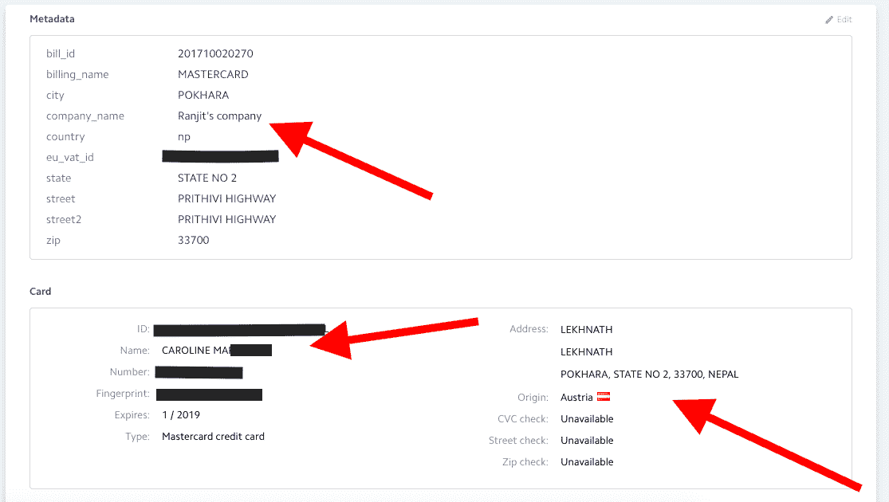

Fraudulent user activity


这是我们看到的。一个来自尼泊尔名叫计然 T2**的家伙试图用奥地利**签发的**卡注册一项服务(尼泊尔到奥地利的距离只有 6089 公里)。这已经有点可疑，但是当你看到**持卡人的名字不是计然**而是卡洛琳时，现在你可以 99.9%确定这是欺诈活动，应该阻止并报告。好消息是 Stripe 以相当高的成功率抓住了这些活动，它们很少导致实际购买。但有时它仍然会发生，如果你注意到你得到了很多像这样的奇怪的活动，你总是可以配置一个自定义规则。**

## 注册订阅时事通讯


### 想知道我们是怎么让流量增长超过 1000%的吗？

加入 20，000 多名获得我们每周时事通讯和内部消息的人的行列吧！

[Subscribe Now](#newsletter)

### 在条纹雷达中配置自定义规则

带有详细解释的雷达规则参考的完整列表[可在此处](https://stripe.com/docs/radar/rules/reference)找到。若要创建规则，请选择左侧的“雷达”，然后选取“规则”

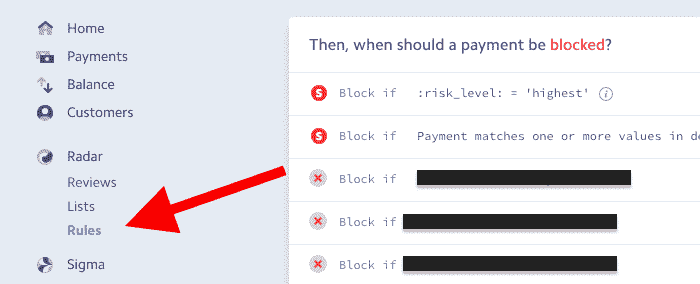

Stripe Radar rules menu


选择“何时应冻结付款”部分，向下滚动并点击“添加规则”

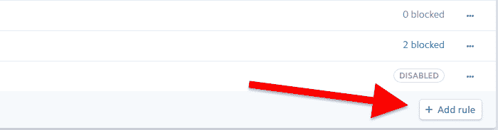

Stripe Radar add rule


之后，您会看到这个名为“添加阻止付款的规则”的弹出窗口。

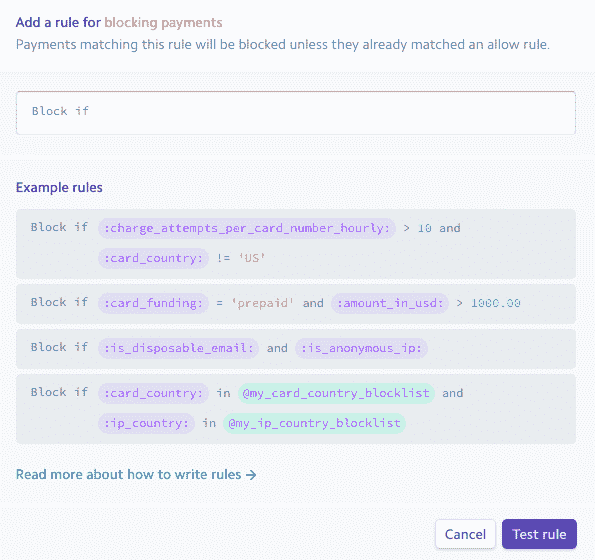

Stripe Radar – add a rule for blocking payments


这是我们将添加第一个自定义规则的地方。因此，我们想要实现的是在用户的**位置不等于信用卡的原始位置**时阻止所有支付。注意:有时这仍然是合法的购买，但老实说，一个奥地利用户在尼泊尔度假期间购买 SaaS 服务(更不用说名称不匹配)有点不现实。

假设来自尼泊尔的个人不断地试图购买。你需要做的就是找到 ISO 两个字母的国家代码([这里是一个完整的列表](http://www.nationsonline.org/oneworld/country_code_list.htm))并将以下规则添加到 Radar 中:

```
:card_country: = 'AT' AND :ip_country:= 'NP'
```

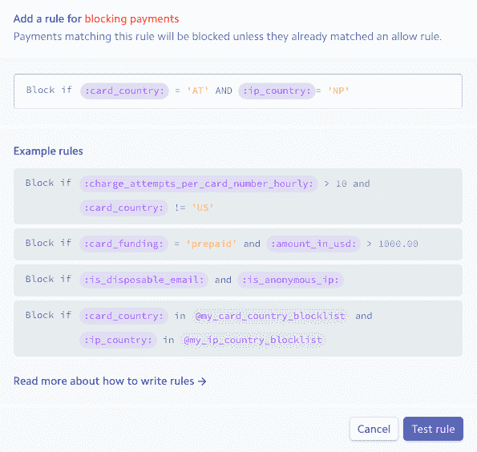

Country and card doesn’t match rule


这条规则到底是干什么的？从现在开始，当一个尼泊尔 IP 地址的人试图用奥地利发行的信用卡购物时，Stripe 将阻止所有交易。这里还有几个例子:

如果您想阻止用法国信用卡从英国付款，您需要添加以下规则:

```
:card_country: = 'FR' AND :ip_country: = 'GB'
```

或者，如果有人试图用意大利卡购买你的产品，但电子邮件地址不是来自意大利，你可以添加以下规则:

```
:card_country: = 'IT' AND :ip_country:!= 'IT'
```

如您所见，配置这些规则的可能性是无限的。

Struggling with downtime and WordPress problems? Kinsta is the hosting solution designed to save you time! [Check out our features](https://kinsta.com/features/)

如果您单击“测试规则”按钮，系统将检查交易历史记录，并查看它们是否与之前的任何尝试相匹配。如果您看到许多最近的支付尝试，并且您已经知道这些是合法的购买(假设您认识这些客户)，您可能不应该激活该规则，因为它将阻止这些有效的交易。如果在测试规则后没有，或者你只是看到欺诈企图，点击“添加并启用”就可以了。您可以随时轻松编辑、删除或禁用规则。

## 在 Stripe Radar 中拦截一次性电子邮件

现在来看下一条有用的规则。欺诈用户喜欢使用一次性电子邮件地址。有很多这样的提供商，你可以购买电子邮件地址，甚至批量创建它们。好消息是，您可以通过向 Radar 添加一个简单的规则来完全阻止这些电子邮件域。假设电子邮件提供商是 shadyemail.com。这是您需要添加的规则:

```
:email_domain: = 'shadyemail.com'
```

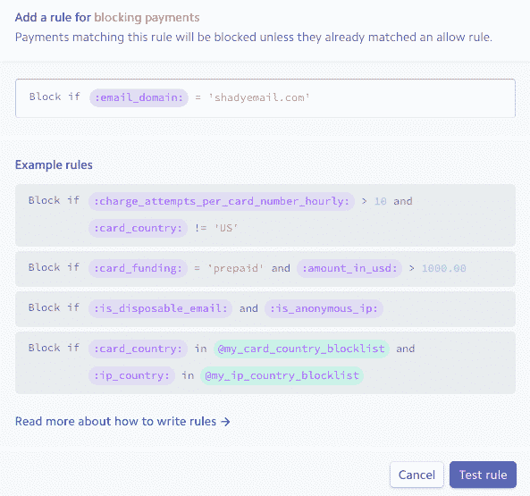

Block email addresses in Stripe Radar


测试规则，然后启用它。结果呢？没有人能够用这个域名(域名上的电子邮件地址)进行任何购买。

## 在条纹雷达中拦截 IP 地址

如果你注意到你从一个特定的 IP 地址得到许多欺诈性的注册，你也可以把它添加到雷达中。即使在欺诈性购买后添加它也是有用的，因为这样你可以确保雷达在未来会阻止它。如果您已经找到了 IP 地址(如果您选择特定的购买并检查相关的日志，您可以在条带中找到它)，您需要做的就是添加以下规则:

```
:ip_address: = '123.4.567.899'
```

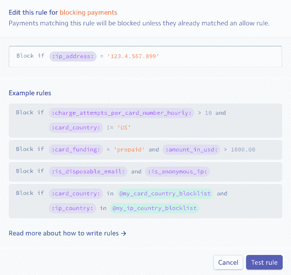

Block IP Address in Stripe Radar


测试规则并启用它。

## 更有用的条纹雷达规则

假设您没有将产品运送到特定的国家，或者您不想为该国家的客户提供数字服务。也许你有很多来自这个国家的欺诈注册，你想简单地阻止他们。对于这个例子，我们使用摩洛哥(对不起伙计们)。下面是您需要添加的规则:

```
:ip_country: = 'MA'
```

这将阻止来自摩洛哥的任何 IP 地址的所有尝试。

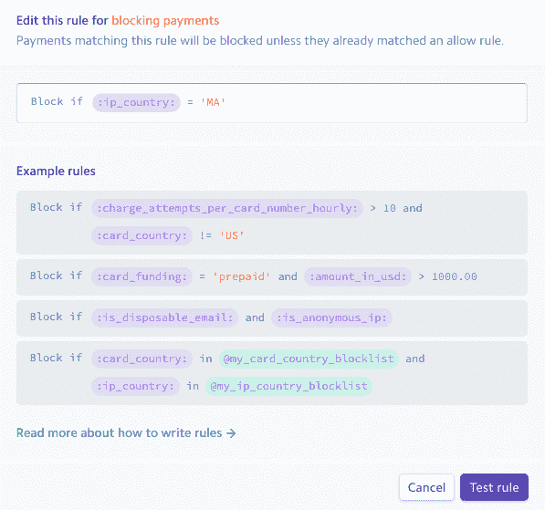

Block country in Stripe Radar


另一个有用的规则是**管理同一客户或同一 IP 地址在短时间内进行的拒绝和失败的支付尝试**。合法的顾客不应该需要 6 次尝试才能购买，因为他们通常知道自己的卡的详细信息，并有足够的资金支付。

如果正在使用的信用卡被盗，此人通常不知道所有细节，因此会继续尝试注册或使用略有不同的细节进行购买。在下面的例子中，这个人在 15 分钟内使用了 7 张不同的信用卡。似乎是合法的，对吗？

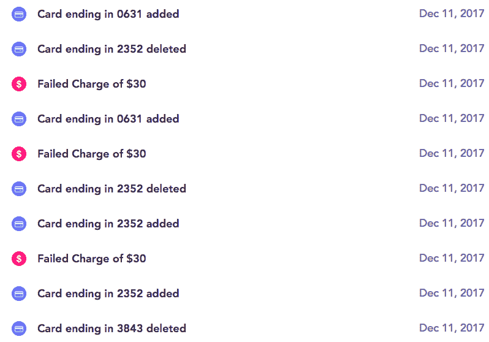

Failed payment attempts in Stripe Radar


我肯定他们会尝试更多，但他们可能用光了信用卡。💳下一张卡有可能成功！这就是为什么**你应该限制下跌**。这里有几个不同的属性可以用来限制它们:

*   每日每张卡拒绝次数
*   每小时每张卡拒绝次数
*   每日每个客户的拒绝次数
*   每个客户每小时的拒绝次数
*   每日拒绝每个 ip 地址
*   每小时拒绝一次 ip 地址

例如，假设我们希望阻止下一次尝试，即客户在 60 分钟内尝试购买五次，但交易被银行拒绝。如果是一个骗子，他们就不可能进行第六次购买。如果这是一个合法的客户，出于某种原因，五次尝试是不够的，他们总是可以打电话给银行寻求进一步的帮助。下面是您要添加的规则:

```
:declines_per_customer_hourly: = 5
```

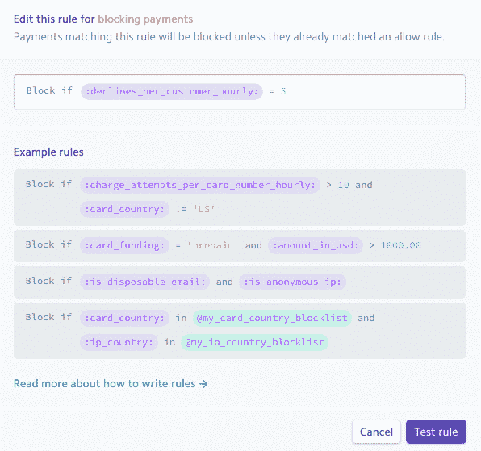

Stripe Radar declines per hour rule


您还可以使用以下规则来限制过去一小时内卡从帐户中扣款的次数:

```
charge_attempts_per_card_number_hourly
```

同样，完整的规则列表[可以在这里](https://stripe.com/docs/radar/rules/reference)找到。

## 一些黄金法则和建议

1.  **总是要求进行 CVC 检查**。这是显而易见的。如果你不这样做，你将很难管理退款和欺诈购买。
2.  **定期检查您的交易**。即使你每个月只花一个小时检查它们，回顾你的交易，你也会获得一些宝贵的见解！
3.  跟上**最新条纹雷达特征**。Stripe 的团队可以让您的日常生活变得更加轻松。你所需要做的就是启用一些很棒的功能，你就已经为你的企业节省了大量的金钱和时间。
4.  **找到平衡。**阻止一个合法客户比允许 10 个欺诈性注册或购买要好。您可以随时查看现有规则，进行编辑，然后再次测试它们。不要害怕使用它们。我花了大量时间编写、编辑、禁用和测试规则。我也犯了一些错误，但最终，我可以说这绝对是值得努力的。这是一个学习曲线，但是一旦你熟悉了基础知识和它是如何工作的，整个复习过程甚至会变得有趣！

## 最后的想法

作为一名 Stripe 客户，我记得早期我试图找出如何减少欺诈尝试和注册的数量。我花了无数时间审查每一个恶意交易，试图找到模式。现在，只需在 Radar 中添加一个自定义规则来防止将来的尝试就很容易了。

我很有信心地说，Stripe 的算法已经改进了很多，即使是在过去的几个月里。他们用条纹雷达 2.0 做了一件了不起的工作。与早年相比，**我可以说，通过启用一些自定义规则**并让它们的算法发挥作用，我们的欺诈交易量已经减少了 98%。即使没有我的自定义规则，Stripe 现在也能够阻止大多数欺诈企图。但是为了安全起见，最好启用一些经过测试的规则。

我强烈建议您使用 Stripe 和 Radar 提供的所有功能。如果你现在是 Stripe 用户，我很想听听你的想法。您如何使用 Radar，您启用了哪些自定义规则，到目前为止您的体验如何？

最后，但同样重要的是，如果你觉得这个指南有帮助，请与你的朋友和追随者分享！

* * *

让你所有的[应用程序](https://kinsta.com/application-hosting/)、[数据库](https://kinsta.com/database-hosting/)和 [WordPress 网站](https://kinsta.com/wordpress-hosting/)在线并在一个屋檐下。我们功能丰富的高性能云平台包括:

*   在 MyKinsta 仪表盘中轻松设置和管理
*   24/7 专家支持
*   最好的谷歌云平台硬件和网络，由 Kubernetes 提供最大的可扩展性
*   面向速度和安全性的企业级 Cloudflare 集成
*   全球受众覆盖全球多达 35 个数据中心和 275 多个 pop

在第一个月使用托管的[应用程序或托管](https://kinsta.com/application-hosting/)的[数据库，您可以享受 20 美元的优惠，亲自测试一下。探索我们的](https://kinsta.com/database-hosting/)[计划](https://kinsta.com/plans/)或[与销售人员交谈](https://kinsta.com/contact-us/)以找到最适合您的方式。