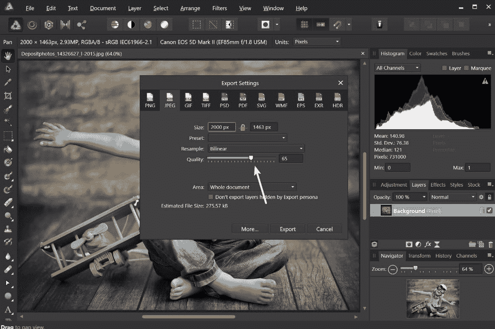
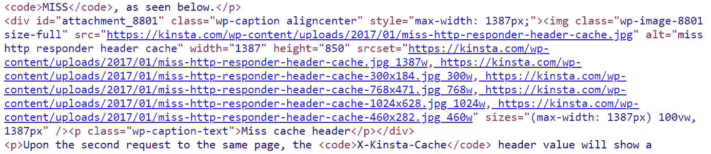
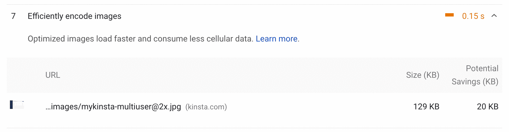
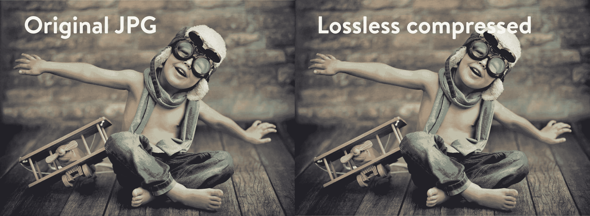
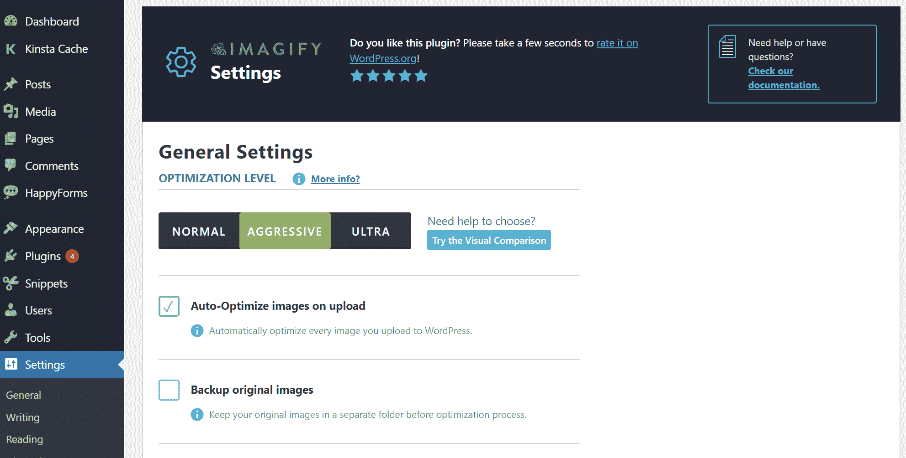
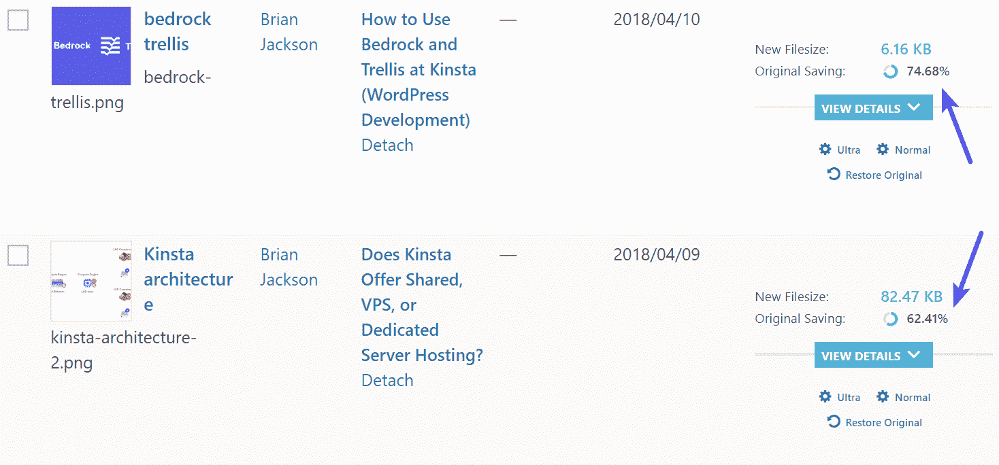
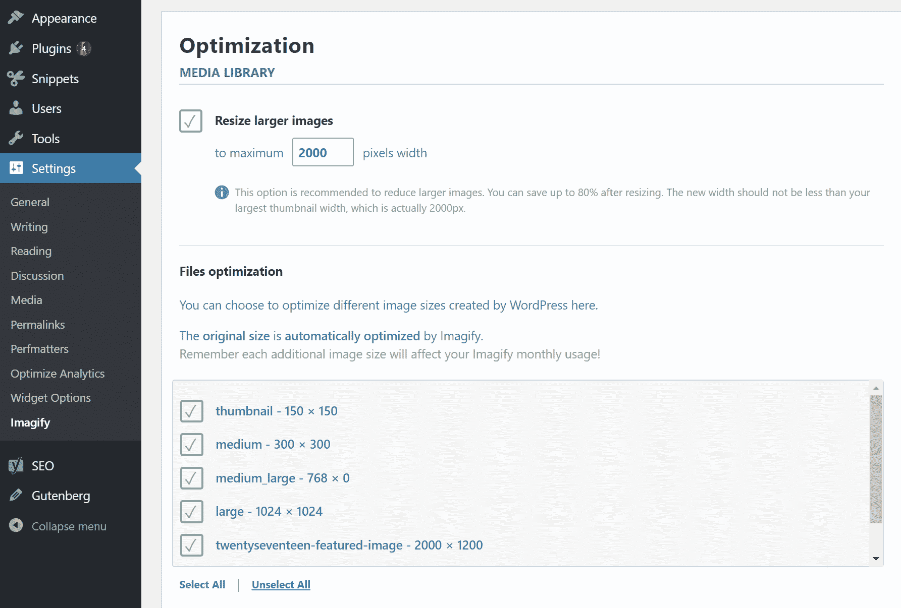
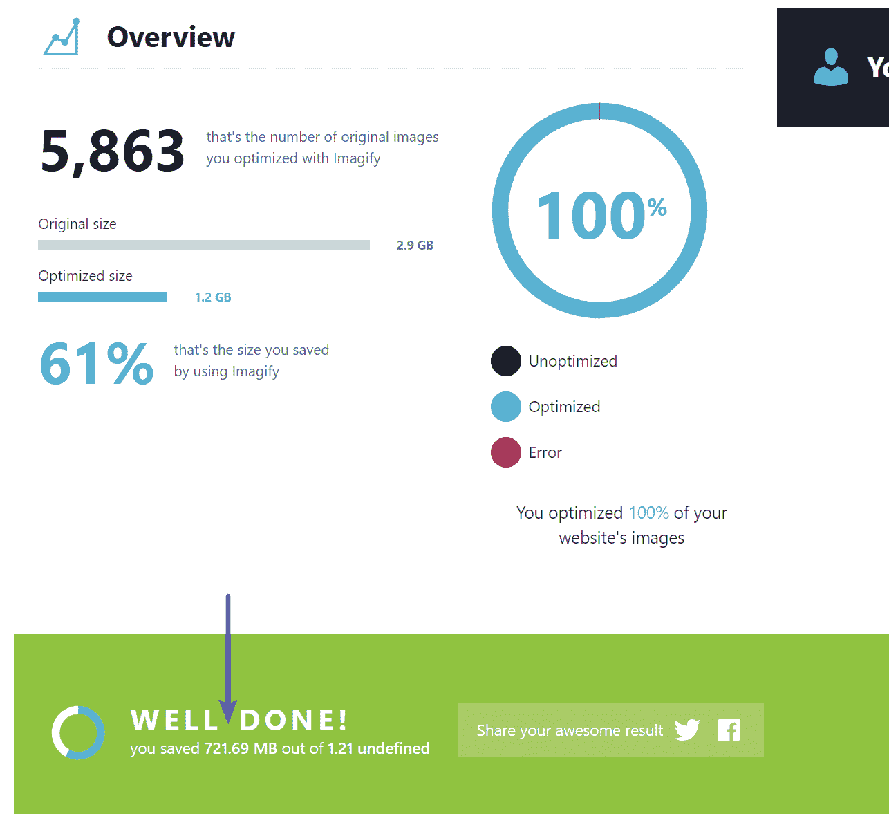
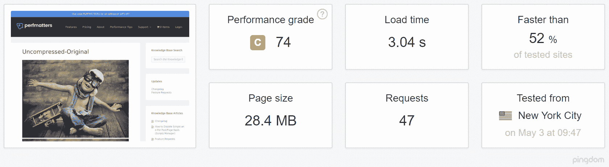
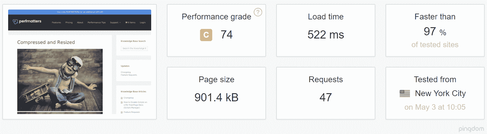

# 为什么以及如何在你的 WordPress 图片上使用有损压缩

> 原文：<https://kinsta.com/blog/lossy-compression/>

根据 [HTTP Archive](https://httparchive.org/reports/state-of-images#bytesImg) 的数据，截至 2018 年 12 月，**图片在桌面和移动设备上平均占网站页面权重的 40%** 。这是巨大的！😮当谈到新的[移动优先指数](https://kinsta.com/blog/google-mobile-first-index/)和性能时，图像优化在你的 WordPress 网站加载速度上扮演着关键角色。图像压缩是你可以实现的最简单的优化之一，反过来，它也将产生最大的影响。本质上，这需要通过使用两种流行的压缩形式来减小图像的文件大小:**有损和无损**。 [WEBP](https://kinsta.com/blog/webp/) 支持两种压缩方式！

今天，我们将深入研究这两种类型的图像压缩，并讨论我们建议您使用哪一种。这可能因你经营的业务类型而异。

*   [有损压缩](#lossy-compression)
*   [无损压缩](#lossless-compression)
*   [哪种压缩方式比较好？](#which-compression-is-better)
*   [如何在 WordPress 中使用有损压缩](#how-to-use-lossy-compression-wordpress)

## 有损压缩

第一种压缩形式是有损压缩。有损压缩包括**删除图像中的一些数据**。因此，这意味着您可能会看到质量下降(质量下降或一些人所说的像素化)。所以你必须小心你在多大程度上降低了你的形象。不仅仅是因为质量，还因为你不能逆转过程。当然，有损压缩的一个很大的好处，也是为什么它是最流行的压缩方法之一，就是你可以**极大地减少文件大小**。

*   JPEGs 和 gif 都是[有损图像格式](https://kinsta.com/blog/image-file-types/)。
*   JPEGs 非常适合需要快速加载的网站，因为您可以调整质量水平，以达到质量和文件大小的良好平衡。

(建议阅读: [JPG vs JPEG:了解最常见的图像文件格式](https://kinsta.com/blog/jpg-vs-jpeg/))

### WordPress 自动压缩图像

你知道吗，当你上传图片到媒体库时，WordPress 会自动压缩你的图片。默认情况下，WordPress 会自动将图片压缩到原始大小的 90%。然而，在 WordPress 4.5 的中，他们将这一比例提高到了**的 82%** ，以进一步全面提高性能。如果你想知道为什么你的图片在新安装的 WordPress 上看起来有点像素化，这就是原因。

虽然自动压缩很棒，但我们普遍认为，82%对网站性能的影响远远不够。因此，如果你想的话，你可以通过添加下面的过滤器到你的主题的`functions.php`文件中来禁用这个选项。记住，在编辑你的网站之前，一定要先[备份](https://kinsta.com/help/restore-wordpress-backup-staging/)。


> Kinsta 把我宠坏了，所以我现在要求每个供应商都提供这样的服务。我们还试图通过我们的 SaaS 工具支持达到这一水平。
> 
> <footer class="wp-block-kinsta-client-quote__footer">
> 
> 
> 
> <cite class="wp-block-kinsta-client-quote__cite">Suganthan Mohanadasan from @Suganthanmn</cite></footer>

[View plans](https://kinsta.com/plans/)

```
add_filter( 'jpeg_quality', create_function( '', 'return 100;' ) );
```

如果你想增加 WordPress 的自动压缩率，你可以添加过滤器并减少原始文件的百分比，比如下面例子中的 70%。

```
add_filter( 'jpeg_quality', create_function( '', 'return 70;' ) );
```

记住，这些不会影响已经上传的图片。你需要使用类似[的插件重新生成缩略图](https://kinsta.com/blog/regenerate-thumbnails/#how-to-regenerate-thumbnails-in-wordpress)来将其应用到你现有的媒体库。或者更好的是，我们简单地建议不要去管你的主题，简单地使用一个图片优化插件(我们将在下面深入探讨)或者在上传之前进一步压缩你的图片。

### 使用“保存为网页格式”压缩图像(软件)

您可以使用 Adobe Photoshop、Affinity Photo、Affinity Designer 或其他图像编辑器等工具来调整图像的质量设置(如下所示)。在大多数工具中，这位于“保存到 web”或“导出设置”下



Change quality of photo


如果我们稍微比较一下有损压缩率，我们可以看到 50%看起来很棒。33%在一些背景细节上开始变得有点模糊(但会很不明显)，5%显然是不可接受的。这只是一个例子，说明为什么 WordPress 中的自动 82%不够用。你可以并且应该以更高的速率压缩文件，以进一步减小文件大小。

*   original.JPG 2.82 兆字节(2000 像素乘 1463 像素)
*   有损压缩-1。JPG:227 KB(2000 像素乘以 1463 像素) **91.95%的缩减率**
*   有损压缩-2。JPG:185 KB(2000 像素乘以 1463 像素) **93.44%的缩减率**
*   有损压缩-3。JPG:5kb(2000 像素乘以 1463 像素) **99.82%的缩减率**


Lossy compression comparison


假设您选择使用压缩了 50%的版本。文件大小为 227 KB，肯定比原来的 2+ MB 文件小很多。然而，如果这只是一个页面上 15 个以上图片中的一个，那就不太好了。一般来说，如果可能的话，最好将所有图像保持在 100 KB 以下。在我的情况下，你应该可以去小得多。所以这也是**调整图片尺寸**的重要之处。50%的图像先缩小到 1251 像素乘以 916 像素，大小只有 95 KB。

但是记住，你可能不想一直缩小你的图片，因为从 WordPress 4.4 开始，它现在有了对响应图片的[支持(CSS 没有缩小)。WordPress 自动为上传到媒体库的每张图片创建不同大小的图片。通过将图像的可用尺寸包含到一个`srcset`属性中，浏览器现在可以选择下载最合适的尺寸并忽略其他尺寸。请看下面你的代码的实际样子。](https://make.wordpress.org/core/2015/11/10/responsive-images-in-wordpress-4-4/)



srcset responsive images example in code


所以随着现在越来越多的 HiDPI 显示器，找到一个令人愉快的媒介会很好。比如说你的网站的栏或格大小的两倍或三倍，但仍然小于原来的大小。浏览器将根据设备的分辨率显示正确的选项。

### 谷歌推荐有损压缩

你用谷歌页面速度洞察力吗？如果是这样，你可能对“优化图像”的警告很熟悉早在 2017 年，谷歌实际上更新了他们的[文档](https://developers.google.com/web/tools/lighthouse/audits/optimize-images)，现在推荐使用有损压缩作为进一步提高网站速度的方法。



Google PageSpeed Insights optimize images warning


如果你想摆脱那些警告，最简单的方法之一就是使用有损压缩来安抚谷歌。

## 无损压缩

现在是时候进入第二种形式的无损压缩了。与有损压缩不同，**无损压缩不会降低图像的质量**。这怎么可能呢？这通常是通过删除不必要的元数据(由捕获图像的设备自动生成的数据)来完成的。然而，这种方法最大的缺点是你**看不到文件大小**的显著减少。也就是说，久而久之会占用大量磁盘空间。

*   RAW、BMP、GIF 和 PNG 是无损图像格式。
*   您可以使用 Photoshop、 [FileOptimizer](http://netm.ag/optimize-263) 或 [ImageOptim](http://imageoptim.com/) 等工具在桌面上执行无损压缩。
*   有些插件会对图片应用 [Gzip 压缩](https://kinsta.com/blog/enable-gzip-compression/)(缩小图片)。

Kinsta 用户可以利用内置在 [MyKinsta 仪表板](https://kinsta.com/mykinsta/) 中的 [代码缩小功能](https://kinsta.com/help/kinsta-cdn-code-minification/) 。这使得客户只需点击一下，就可以轻松实现 CSS 和 JavaScript 的自动缩小。这有助于提高网站速度，无需任何人工操作。

## 注册订阅时事通讯


### 想知道我们是怎么让流量增长超过 1000%的吗？

加入 20，000 多名获得我们每周时事通讯和内部消息的人的行列吧！

[Subscribe Now](#newsletter)

如果我们稍微比较一下有损压缩率，我们可以看到，使用无损压缩时，不会损失任何质量。然而，图像的文件大小仅减少了 10.84%。相比之下，使用有损压缩时超过 90%。

*   原创。JPG:227 KB(2000 像素乘 1463 像素)
*   无损压缩。JPG:203 KB(2000 像素乘 1463 像素)



Lossless compression comparison


## 哪种压缩方式比较好？

这个问题的答案其实取决于你。对于大多数用户来说，**我们建议使用有损压缩**,因为你可以轻松地将图像压缩超过 70%(有时甚至超过 90%!)而没有太大的质量损失。在一个页面上乘以 15 张图片，它将在减少你网站的加载时间上起到重要作用。不仅如此，有损压缩将确保你利用尽可能少的[磁盘空间](https://kinsta.com/blog/disk-space-wordpress-hosting/)。这反过来意味着你可以节省托管费用。

[无损压缩](https://kinsta.com/blog/lossy-vs-lossless/#pros-and-cons-of-lossless-compression)是给那些承受不起任何质量损失的人的。摄影师、美食博主和模特只是想到的几个依靠像素完美的图像谋生的人。在这些情况下，你必须把你的图片放在 [CDN](https://kinsta.com/blog/wordpress-cdn/) 上。由于其规模，你甚至可能需要将它们卸载到第三方存储服务，如[亚马逊 S3](https://kinsta.com/knowledgebase/wordpress-amazon-s3/) 或[谷歌云存储](https://kinsta.com/knowledgebase/wordpress-google-cloud-storage/)。

## 如何在 WordPress 中使用有损压缩

如果你仍然对有损和无损感到困惑，不要担心，有很多很棒的图像优化 WordPress 插件可供你选择，它们可以自动应用有损压缩:

*   [图像效果](https://wordpress.org/plugins/imagify/)(有损和无损)
*   [WP Smush](https://wordpress.org/plugins/wp-smushit/) (有损和无损)
*   [EWWW 云](https://wordpress.org/plugins/ewww-image-optimizer-cloud/)(有损和无损)
*   [短像素](https://wordpress.org/plugins/shortpixel-image-optimiser/)(有损和无损)

注意:上面列出的所有服务器都使用自己的第三方服务器来压缩图像。出于性能原因，您应该始终在异地批量压缩映像。👍

我们在 Kinsta 博客上使用了 Imagify ,因此我们将向您展示它是如何工作的。他们有一个免费的计划，但即使是他们的专业计划定价也非常合理。我们优化了相当多的图像，我们使用“精简”计划(每月 1 GB)就可以了。按年支付，每月不到 4.25 美元。

Imagify 有三种不同的优化级别:

Struggling with downtime and WordPress problems? Kinsta is the hosting solution designed to save you time! [Check out our features](https://kinsta.com/features/)

*   **正常:**这种模式使用无损压缩，这意味着您的图像不会损失任何质量，但它们的大小也不会减少太多。
*   **Aggressive:** 这种模式使用有损压缩，极大地节省了初始重量，图像质量略有下降。大多数时候它甚至不明显。
*   **Ultra:** 此模式使用有损压缩，并应用所有可用的优化来实现最大的图像压缩。这将大大节省初始重量，但您很可能会注意到一些图像质量下降。



Imagify settings


**我们在 Kinsta 使用主动模式**，通常会看到**根据映像节省 60-70%的成本**。注意:我们实际上使用 png 比 JPEGs 多得多，因为我们的大多数图像是图标和插图，而不是照片。



Image compression file savings


您可以在上传时启用**自动优化图像**(我们建议您不要忘记)或在媒体库中使用它们的批量图像优化器。你也可以让它**备份原始图像**。这使您可以在以后将图像转换到其他优化级别，甚至恢复原始图像。如果您不使用此功能，我们建议您将其关闭以节省磁盘空间。

你通常应该事先调整你的图像大小，但是如果你忘记或者没有时间，Imagify 确实有一个**调整更大图像**的功能。除了有损压缩，这是另一个大的文件大小节省！



Imagify resize images


事实上，我们最近才在整个 WordPress 媒体库上使用了批量图像优化功能。正如你所看到的,**刮掉了 700 多 MB！**这对于前端性能来说意义重大。



Bulk image optimization savings


### 速度测试

我们来做个小测试吧！由于我们经常看到用户上传未经压缩的全分辨率图像，我们将对这种情况对您网站整体性能的影响做一些比较。

#### 测试 1-原始未压缩

我们首先上传了 10 张未压缩的图片。然后我们在 Pingdom 上运行了 5 次测试，取平均值。我们可以看到总加载时间为 3.04 秒，总页面大小为 28.4 MB。

*   uncompressed-1.jpg(2.82 兆字节)
*   uncompressed-2.jpg(2.82 兆字节)
*   uncompressed-3.jpg(2.82 兆字节)
*   uncompressed-4.jpg(2.82 兆字节)
*   uncompressed-5.jpg(2.82 兆字节)
*   uncompressed-6.jpg(2.82 兆字节)
*   uncompressed-7.jpg(2.82 兆字节)
*   uncompressed-8.jpg(2.82 兆字节)
*   uncompressed-9.jpg(2.82 兆字节)
*   uncompressed-10.jpg(2.82 兆字节)



Speed test uncompressed ([Pingdom](https://tools.pingdom.com/#!/ePOjiW/https://perfmatters.io/uncompressed-original/))


#### 测试 2–压缩

然后我们再次上传了完全相同的图片，但是这次我们在 Imagify 插件中启用了“自动优化”。然后，我们在 Pingdom 上再次运行了 5 次测试，并取平均值。

*   compressed-1.jpg(69.3 KB)
*   compressed-2.jpg(69.3 KB)
*   compressed-3.jpg(69.3 KB)
*   compressed-4.jpg(69.3 KB)
*   compressed-5.jpg(69.3 KB)
*   compressed-6.jpg(69.3 KB)
*   compressed-7.jpg(69.3 KB)
*   compressed-8.jpg(69.3 KB)
*   compressed-9.jpg(69.3 KB)
*   compressed-10.jpg(69.3 KB)

我们可以看到总加载时间现在是 522 ms，总页面大小为 901.4 KB。因此，我们的有损压缩图像**减少了 82.83%的页面加载时间！😮**总页面大小也大幅缩减了 96.83%。多亏了 Imagify，我们的图像仍然看起来质量很高。



Speed test compressed ([Pingdom](https://tools.pingdom.com/#!/Fl726/https://perfmatters.io/compressed-and-resized/))


## 摘要

一旦你确定了你的网站上需要的图像质量，你就可以选择是使用有损压缩还是无损压缩。同样，对于那些更关心速度而不是质量的人，我们推荐使用有损压缩。请记住，如果你找到正确的平衡，有损压缩图像可以看起来很美。如果你需要像素完美的图像，那么你应该总是选择无损压缩。

你有什么想法？你在你的 WordPress 站点上使用有损压缩还是无损压缩？请在评论中告诉我们。

* * *

让你所有的[应用程序](https://kinsta.com/application-hosting/)、[数据库](https://kinsta.com/database-hosting/)和 [WordPress 网站](https://kinsta.com/wordpress-hosting/)在线并在一个屋檐下。我们功能丰富的高性能云平台包括:

*   在 MyKinsta 仪表盘中轻松设置和管理
*   24/7 专家支持
*   最好的谷歌云平台硬件和网络，由 Kubernetes 提供最大的可扩展性
*   面向速度和安全性的企业级 Cloudflare 集成
*   全球受众覆盖全球多达 35 个数据中心和 275 多个 pop

在第一个月使用托管的[应用程序或托管](https://kinsta.com/application-hosting/)的[数据库，您可以享受 20 美元的优惠，亲自测试一下。探索我们的](https://kinsta.com/database-hosting/)[计划](https://kinsta.com/plans/)或[与销售人员交谈](https://kinsta.com/contact-us/)以找到最适合您的方式。