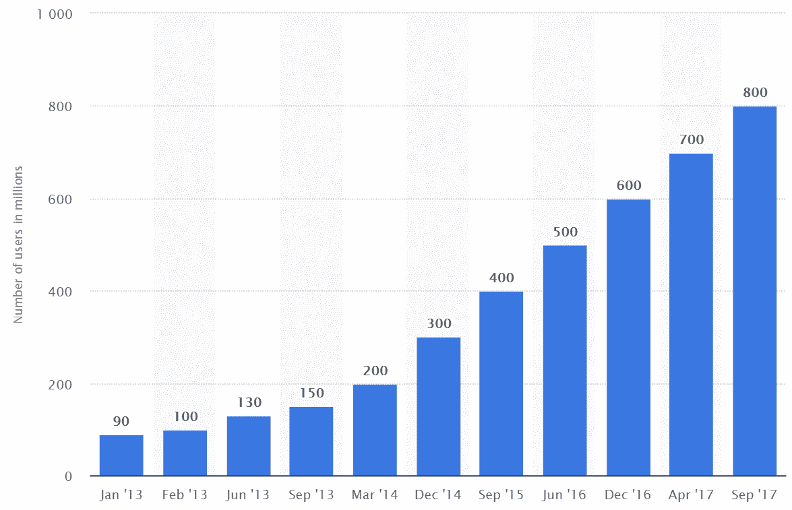
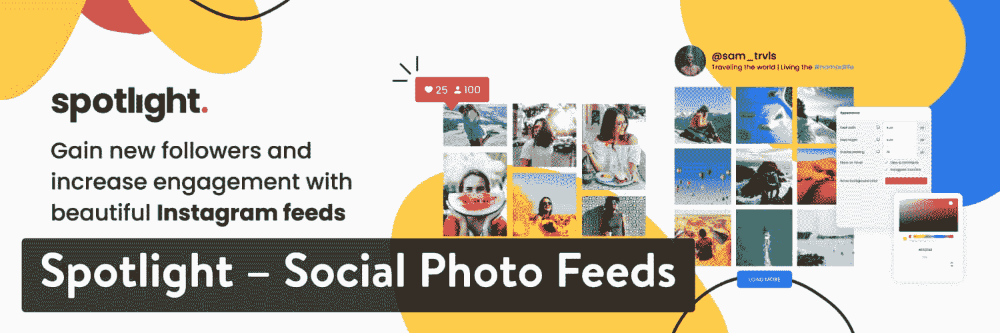
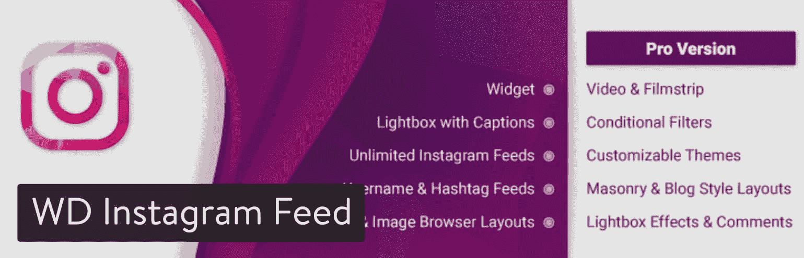
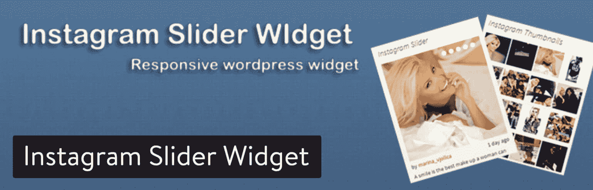
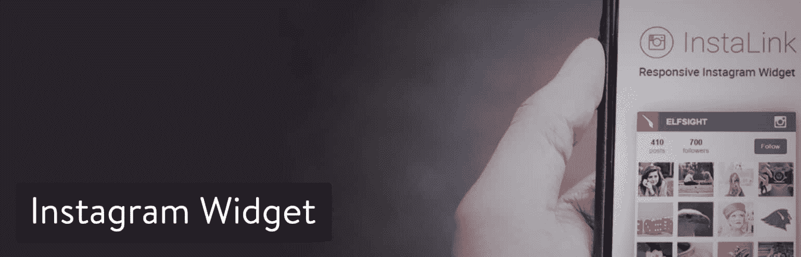
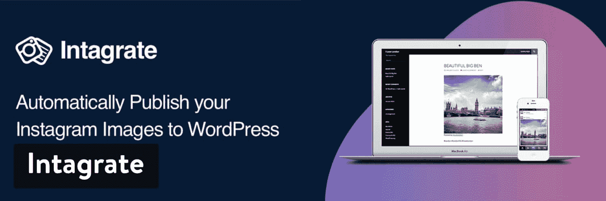

# 10 个 WordPress Instagram 插件，用于显示互动内容

> 原文：<https://kinsta.com/blog/wordpress-instagram-plugin/>

Instagram 拥有超过 10 亿用户，是世界上发展最快的社交网络之一，并在许多行业占据着社交垄断地位。从时尚到音乐，从烹饪到健身，这些市场中的公司转向 Instagram 来展示明亮、充满活力的照片，从而实现了脸书和 Twitter 之外的联系。

Monthly Instagram users (Image source: [Statista](https://www.statista.com/statistics/253577/number-of-monthly-active-instagram-users/))

Instagram 对品牌来说是如此出色的工具，部分原因在于它的简单性。你可以用手机拍一张照片，添加一个漂亮的滤镜，然后在网上发布，而不必连接电脑。这种格式不仅比许多其他社交网络更快，而且其结果是图像看起来既专业又有创意。因为你的公司可能已经有了一个 Instagram 账户，所以不在你的网站上使用这些内容是一种耻辱。幸运的是，一些最好的 WordPress Instagram 插件几乎和 Instagram 平台本身一样简单。

那么，把你的 Instagram 照片放在你的 WordPress 网站上有什么意义呢？

*   Instagram 上的照片通常比普通网站上的照片更有趣、更有活力，因此,[为你的品牌增添了一丝活力。](https://kinsta.com/blog/visual-content-strategy/)
*   **然后，您可以选择在一个地方审核您的 Instagram 内容**。许多企业主经常浏览他们的网站。有了许多 WordPress Instagram 插件，你可以在不离开网站的情况下回复评论和设置图片。
*   **这给了你一个借口将用户生成的内容推送到你的 Instagram** 。你可以索要商店附近的图片或你的产品在世界各地使用的图片。然后，这些被发送到您的网站上，让新客户看到。
*   你网站上的 Instagram feed 增加了参与度，因为人们可能会停留更长时间来看照片。
*   **你有机会增加你的 Instagram 粉丝数量**,因为访问你网站的人可能从未想过在 Instagram 上关注你。

这些只是让 Instagram feed 在你的公司网站上工作的几个原因。不管你是管理一家零售店还是一个全球电子商务品牌。通过 Instagram 给你的粉丝提供高质量的照片是一个开始，但是利用这些粉丝来改善你的网站会让你的社交策略更加强大。

一旦你开始研究一个插件，你会发现有几十个，甚至几百个选项存在。所以，我们收集了一些我们最喜欢的 WordPress Instagram 插件。这样，你可以减少搜索，并决定最适合你的品牌。

## 2022 年最好的 WordPress Instagram 插件

### 1.聚焦–社交照片源

[Spotlight](https://wordpress.org/plugins/spotlight-social-photo-feeds/) 是一个简单直观的解决方案，只需点击几下就可以将你的 Instagram feed 添加到你的 WordPress 网站。连接多个帐户，根据需要创建任意多的订阅源。

> 需要在这里大声喊出来。Kinsta 太神奇了，我用它做我的个人网站。支持是迅速和杰出的，他们的服务器是 WordPress 最快的。
> 
> <footer class="wp-block-kinsta-client-quote__footer">
> 
> 
> 
> <cite class="wp-block-kinsta-client-quote__cite">Phillip Stemann</cite></footer>

[View plans](https://kinsta.com/plans/)

实时预览定制器允许您在将设计嵌入到您的站点之前，准确地看到您正在设计的内容。您甚至可以基于每个设备(台式机、平板电脑和手机)定制外观，以确保它反应灵敏，在任何地方都很漂亮。

Spotlight WordPress plugin

Spotlight 有一个可以显示照片和视频的 lightbox 选项，其免费版本中包含了许多选项，有助于提高用户参与度。在你的网站上嵌入提要可以通过[短代码](https://kinsta.com/blog/wordpress-shortcodes/)或者[部件](https://kinsta.com/blog/wordpress-widgets/)选项来完成。

一个包含更多功能的插件的[高级版本也已经推出。使用 Spotlight PRO，您将拥有新的布局、更多自定义选项，以及对创建自定义提要的更多控制和其他酷功能。](https://spotlightwp.com/pricing/)

#### 是什么让它成为最好的 WordPress Instagram 插件之一？

*   由于 Spotlight 的交互式实时预览定制器，它有一个方便的设置过程，因此您可以在不离开仪表板的情况下设计提要。
*   由于点击式设计选项，定制变得很简单，类似于您在页面生成器中看到的那些选项。
*   免费版本包括一个弹出/灯箱选项，可以在网站的任何地方显示您的照片和视频。
*   “关注”和“加载更多”按钮可以添加到任何订阅源中，以增加网站访问者的参与度并扩大您的关注范围。
*   由于 Instagram 的 API 中不包括免费个人账户的个人资料照片和简历，Spotlight 在插件中添加了自定义照片和简历的选项。您甚至可以为每个提要定制它们，以匹配您站点上特定页面的消息。
*   由于一些智能的内置动态加载和缓存机制，显示在您网站上的提要不会影响页面加载时间。

### 2.WD Instagram Feed

使用 [WD Instagram Feed](https://wordpress.org/plugins/wd-instagram-feed/) 插件，你可以创建一个漂亮的 Instagram 图库，带有一些有趣的效果，比如带字幕的灯箱。这些标题包含在免费版本中，所以与我们上面谈到的 Instagram Feed 插件相比，这是一个不错的奖励。免费版本还提供了一个不错的小软件包，其中包含用户名和标签提要选项、图像和缩略图浏览器布局，以及对无限提要的支持。[专业版](https://web-dorado.com/products/wordpress-instagram-feed-wd.html)提供了几个额外的扩展和内置工具。

定价是这样的:

*   **个人版**——25 美元支持一个域名，并获得六个月的高级支持和更新。
*   **业务**——40 美元支持三个域，并获得一年的支持和更新。
*   **开发者**——60 美元支持无限域名，并获得一年的支持和更新。
*   insta gram Feed WD Premium–该计划提供了之前计划的所有内容，以及 Web Dorado 的所有 60 个 WordPress 插件。如果你的网站需要额外的插件或者有网页设计业务，这是一笔划算的买卖。

所有的计划都为你的图库提供了四个[精彩的视图，以及带效果的弹出幻灯片、无限的提要、高级图像过滤和优秀的主题风格定制工具。](https://kinsta.com/blog/wordpress-photo-gallery-plugins/)

WD Instagram Feed plugin

回到 WD Instagram Feed 的标准免费版本——这是一个省时的插件，可以完全控制它在你网站上的外观。你可以混合来自多个来源的 feeds，或者混合来自一个账户的帖子。过滤对于从你的 Instagram 创建一个[作品集](https://kinsta.com/blog/wordpress-portfolio-plugins/)来说是很棒的。这个小工具也是那些将你的网站变成一个更有视觉吸引力的地方的额外功能之一。

如果你想知道免费版和高级版之间的主要区别，如果你支付高级版，这里有什么可以期待的。首先，提供了其他几种布局，如砖石和博客风格。元数据，如标签、评论和喜欢，将显示在提要中。有相当多的其他功能需要研究，但我特别喜欢 15 个灯箱过渡效果。

#### 是什么让它成为最好的 WordPress Instagram 插件之一？

*   WD Instagram Feed 插件提供了一些最强大的过滤器和 Feed 合并工具，用于创建终极观看体验。
*   它有一个非常强大的 Instagram feed 的免费版本，带有 [widgets](https://kinsta.com/blog/wordpress-widgets/) 和 lightbox 功能。
*   高级版起价仅为 25 美元，你可以选择花 99 美元从 Web Dorado 获得所有高级插件。
*   免费插件会给你两个默认主题。
*   提供了几个定制工具来添加 Follow 按钮、启用注释、改变布局等等。
*   该插件具有合并来自多个 Instagram 账户的 feeds 的功能。所以，如果你在经营一家连锁店，或者你想把你的个人订阅和你的商业订阅放在一起，你有这个选择。

### 3.让他们学会社交

[Feed Them Social](https://wordpress.org/plugins/feed-them-social/) 有免费版和高级版。高级扩展从单个网站的 50 美元开始，一直到无限网站的 200 美元。Feed Them 社交插件的主要优势在于它允许显示来自各种社交网络的 Feed。这包括 Instagram、Twitter、脸书、YouTube 和 T2 的 Pinterest。其中大多数都是高级版本。

有趣的是[高级插件](https://www.slickremix.com/downloads/feed-them-social-premium-extension/)完全支持来自每个社交网络的所有细节。例如，Instagram feed 包括从用户账户到标签，从照片到描述和评论的所有内容。premium 插件的主要特性包括能够显示你想要的任意多的提要，以及完全响应的提要。你还会发现你有跟随按钮。

Feed Them Social WordPress plugin

这些基本功能中有许多都是免费版本，所以大多数公司应该没问题——特别是如果他们只是在寻找 Instagram 图库的话。然而，我主要推荐 Feed Them 社交插件给那些想要结合来自多个社交网络的 Feed 的人。

#### 是什么让它成为最好的 WordPress Instagram 插件之一？

*   有免费版和负担得起的付费版。
*   你可以从 Instagram、脸书和 Twitter 上下载图片。
*   所有的社交订阅源都完全可以在移动设备上查看。
*   您可以为您的任何社交订阅源创建短代码。插件附带了一个短代码生成器，你可以在任何你想要的地方发布任何短代码。
*   无限滚动和一个加载更多按钮保持你的饲料合并，同时允许人们看到你的整个画廊，如果他们愿意。
*   你甚至可以在脸书、推特和脸书上看到一些分享按钮。

### 4.Instagram 滑块小部件

[Instagram Slider Widget](https://wordpress.org/plugins/instagram-slider-widget/) 汇集了 Instagram feed 世界中两种流行的设计。第一个是 Instagram widget 滑块，它可以缩小侧边栏的图像，但随后可以显示在所有页面上。此外，滑块可以滚动浏览你所有的 Instagram 照片，这样用户在浏览你的网站时就可以看到无数的图片。

第二个选项是前端小部件缩略图，它本质上是一个图库，但是要小得多，因为[图片都是缩略图](https://kinsta.com/blog/regenerate-thumbnails/)。滑块显示了你 Instagram 页面上的 12 篇最新帖子。您还可以利用 hashtag 特性，这对于挖掘某个主题并只显示那些图片是非常理想的。

Instagram Slider Widget WordPress plugin

在事物的范围内，Instagram Slider Widget 是这个列表中更基本的 WordPress Instagram 插件之一。不需要 API。相反，你只需在用户名和密码的帮助下，将插件链接到你的用户档案。如果你更喜欢其中的一些图片，你也可以对它们进行分类。

#### 是什么让它成为最好的 WordPress Instagram 插件之一？

*   这是一个没有任何升级或高级版本的免费插件。
*   它更像是一个小众的 Instagram feed 解决方案，有更小的滑块和小部件。
*   不需要访问 Instagram API。
*   Instagram Slider Widget 插件有一个很好的功能，可以将图库照片链接到外部 URL 或附件或 Instagram 帖子。这样，你可以考虑在你的网站上链接到一个销售页面或者类似的东西。

### 5.Instagram 图库

Instagram Gallery 插件将它简化为最基本的东西。它不会用任何现代的布局或创造性的风格让你惊叹。然而，如果你需要做的只是从你的 Instagram 页面插入一个图片库，Instagram 图片库插件是一个很好的选择。

## 注册订阅时事通讯

### 想知道我们是怎么让流量增长超过 1000%的吗？

加入 20，000 多名获得我们每周时事通讯和内部消息的人的行列吧！

[Subscribe Now](#newsletter)

哦，是的，它是完全免费的，没有额外的升级。在简单的设置过程后，插件会链接到你的 Instagram 账户。之后，你可以在画廊或[传送带滑块](https://kinsta.com/blog/wordpress-slider/)之间进行选择。

Instagram Gallery WordPress plugin

这确实是你能找到的最简单的 Instagram feeds 之一。你甚至不需要连接到 API 或者用你的用户名登录。所需要的只是 Instagram 用户名和快速设置调整。

#### 是什么让它成为最好的 WordPress Instagram 插件之一？

*   Instagram Gallery 插件从来没有任何成本。这是一个免费的下载，开发者不会要求你支付小费，升级，或支付其他附加费用。
*   gallery 插件允许你在你的网站边栏中插入插件。你也可以利用短代码在你的网站上传播图片，或者简单地决定在其他地方放置插件。
*   画廊的形式非常简单。有一个白色背景，上面是它从你的 Instagram 上抓取的图片。事实上，定制工具真的不多，所以它非常适合那些可能会被其他替代插件吓倒的新手。
*   您不必登录或链接到 API。只有用户名是必需的。
*   Instagram Gallery 提供图库和转盘滑块两种格式。

### 6.WPZOOM 社交 Feed Widget-WordPress 的 Instagram

WPZOOM 社交 Feed 插件是一个评级很高的插件，可以与 Instagram 上的用户名和标签一起使用。因此，您可能只显示基于标签的某些图像。定制工具看起来不错，有标题和标题的颜色来给你的网站打上品牌。该插件完全适应所有移动设备。你甚至可以调整你的图像的大小，当你想要缩略图或全屏图像的时候。

当用户在页面上向下滚动时，图像加载被激活。因此，他们不需要点击任何按钮就能看到你的全部图库。此外，这一定会加快你的网站，因为所有的照片不会自动加载。

WPZOOM Social Feed Widget

我喜欢这个插件的另一个原因是因为多语言支持。如果你有来自不同国家的追随者和顾客，他们可能会欣赏把他们的语言翻译成他们自己语言的能力。

#### 是什么让它成为最好的 WordPress Instagram 插件之一？

*   WPZOOM Social Feed Widget 允许您通过用户名或标签对照片进行分类来显示照片。
*   可以通过颜色、图像大小、标题和滚动选项进行定制。
*   它还支持多种语言的翻译。

### 7.Instagram 剧院

你真的找不到比 [Instagram Theatre](https://codecanyon.net/item/instagram-theatre/3793966) 插件更好的交易了。它是在 CodeCanyon 上出售的，所以你没有免费下载和测试它的选项。然而，您可以在扣动扳机之前查看实时预览，看看它是如何工作的。也就是说，整个插件 15 美元的价格和几个月的支持看起来很划算。该插件提供了一个圆滑的布局，没有其他替代方案的任何花哨功能。您可以创建全屏视图，以查看更大版本的图片。还有一个网格视图或列表布局。

改变颜色可以在瞬间完成，从而在你所有的网站上产生一个品牌良好的 Instagram feed。

Instagram Theatre WordPress plugin

该插件直接与 Instagram API 集成，它提供了一个 Fancybox 集成，用于拍摄令人惊叹的照片视图。Instagram Theater 支持 iPhones、iPads 和 Androids，特效和动画肯定会在你的网站上获得一些恶名。最棒的是，Instagram Theater 附带了三个免费的站点模板，所有这些都可以在不知道一行代码的情况下实现。再加上一些优秀的定制工具，你会发现自己是一个非常棒的价格低廉的 WordPress Instagram 插件。

与宕机和 WordPress 问题做斗争？Kinsta 是一款考虑到性能和安全性的托管解决方案！[查看我们的计划](https://kinsta.com/plans/?in-article-cta)

#### 是什么让它成为最好的 WordPress Instagram 插件之一？

*   价格只有 15 美元。
*   这是最简单的插件之一，考虑到你会收到三个模板，一些布局和其他定制选项来适应你的网站。
*   您可以指定一个标签，这样只有带有该标签的图片才会出现在源中。
*   有一个多用户 Instagram feed 模式，你可以连接多个 Instagram 帐户，并在 feed 中显示所有照片。
*   位置 Instagram 模式从某些位置获取 Instagram 帖子，并且只在 feed 中显示那些图片。
*   该插件提供了一些效果和定制选项。例如，您可以调整效果速度、延迟间隔等。
*   Instagram Widget 支持 16 种语言，包括英语、西班牙语、法语和日语。
*   Instagram Widget 与 InstaLink 协同工作，insta link 作为 WordPress widget 运行，并与 [Visual Composer 插件](https://kinsta.com/blog/wordpress-page-builders/)完美结合。

### 8.享受 Instagram 插件

Instagram 的 [Enjoy 插件](https://wordpress.org/plugins/enjoy-instagram-instagram-responsive-images-gallery-and-carousel/)为您的 Instagram 照片提供了一个可定制的图库。您可以在旋转或网格视图之间进行选择，并拥有短代码和小部件的额外好处。该插件的高级版本售价约为 20 美元，这是唯一提供的软件包。如果你正在考虑使用免费版本，这是一个很有价值的版本，它提供了诸如小部件、短代码、轮播和列定制等功能。高级版肯定更先进，20 美元的价格标签让它相当耐人寻味。有了 premium 插件，您可以支持更多的短代码，允许您使用不同的标签或多个提要。

你甚至可以得到一些有趣的新格式，比如宝丽来、相册和徽章视图。我喜欢 premium 的一个主要功能是点击 Instagram feed 照片，然后被发送到不同的 URL 或 Instagram 页面本身。这是一个简单的功能，但如果照片有某种交互性而不是标准的图库，那就更好了。谁知道呢？如果产品列在图库中，您可能需要链接到一些销售页面。

Enjoy Plugin for Instagram

总的来说，提要看起来干净而中肯。我建议你访问 [Media Beta Projects 网站](https://www.mediabetaprojects.com/enjoy-instagram-premium/grid-view-instagram-plugin/),看看为不同观点提供的一些演示。我特别喜欢照片的漂亮动画，让你的客户看起来更有趣，并吸引他们注意你最重要的 Instagram 帖子。

#### 是什么让它成为最好的 WordPress Instagram 插件之一？

*   它有一个功能强大的免费版本。你也可以为附加功能支付少量费用。
*   该插件提供令人印象深刻的动画和效果，让你抓住用户的注意力。
*   您可以根据标签、个人资料等显示 Instagram 中的图片和图片库。
*   免费版有两种格式，包括轮播和网格视图。高级版本为插件增加了一些其他格式。
*   你会收到一个在不同页面上发布的短代码，以及一个在侧边栏中插入 WordPress Instagram 插件的小部件。

### 9.WPZOOM 的 Instagram Widget

WPZOOM 的 Instagram 插件提供了一个插件，你可以将它放在你网站上的任何插件区域，它将显示你的最新 Instagram 帖子的完全可定制的提要。

您有大量的布局可供选择，包括用于宽窗口小部件区域的灵活的全幅布局，以及每行包含任意多或少帖子的网格。这个插件在 3 宽网格、2 宽网格或单栏帖子上看起来最好。访问者可以点击任何一个帖子，在 Instagram 上查看该帖子及其标题，或者你可以选择在帖子下方设置一个按钮来关注你。

Instagram Widget by WPZOOM plugin

这个插件的设计是极简主义的——只显示你的 Instagram 帖子——所以这个插件应该能与大多数 WordPress 主题设计顺利整合。该设计还具有响应能力，因此移动和平板电脑用户将获得流畅的用户体验。对于额外的可定制性，如果需要，您可以选择通过 CSS 定制设计。

该插件是免费的，不需要付费升级。你所需要的只是一个访问令牌，但是 WPZOOM 使得用这里的[按钮](https://www.wpzoom.com/instagram/)生成一个令牌变得很容易。

#### 是什么让它成为最好的 WordPress Instagram 插件之一？

*   这是一个免费插件，不需要额外升级。
*   插件的工作原理和描述的一样！它创建了一个简单、灵活的 Instagram 小工具。
*   您可以自定义布局选项，包括全角小部件。
*   生成访问密钥很简单。

### 10.整合

[in grate](https://intagrate.io/)插件提供了一种将 Instagram 媒体发布到 WordPress 网站的简单方法。通过连接你的 Instagram 账户，每次你在上面发帖，一个新的 WordPress 帖子将被创建，图片标题作为帖子标题，图片作为帖子内容。Intagrate 允许你将你的 Instagram 媒体保存到 WordPress 媒体库，这样你就可以备份你的 Instagram 图片和视频。

你可以使用标签过滤器或手动审核来控制 Instagram 帖子的创建。该插件有一个免费版本，名为 [Intagrate Lite](https://wordpress.org/plugins/instagrate-to-wordpress/) ，功能有限，还有一个完全成熟的高级插件，起价 55 美元。

Intagrate WordPress plugin

如果你想创建一个[照片博客网站](https://kinsta.com/blog/wordpress-photo-gallery-plugins/)，或者公司想重新利用他们的 Instagram 媒体来增加他们网站的参与度，这个插件是很有用的。

#### 是什么让它成为最好的 WordPress Instagram 插件之一？

*   这个插件不仅仅显示 Instagram 媒体，它还可以在你的网站上创建内容。您可以从 Instagram media 创建帖子、页面或任何自定义帖子类型。
*   您可以创建无限个帐户，连接任意数量的 Instagram 帐户。
*   您可以指定一个或多个标签来过滤发布的内容。
*   您不需要生成访问令牌或创建 Instagram API 应用程序，插件会为您处理这些。
*   该插件提供了多种配置选项和不同的模板标签来制作你的文章。

## 哪个 WordPress Instagram 插件适合你？

如果你花时间在 WordPress Instagram 插件上完成了谷歌搜索，你就会知道搜索变得有多混乱，因为有大量的解决方案。所以，希望这个列表能帮助你更好地理解哪些插件适合你或你的公司。如果你还在为其中的一两个争论不休，这里有一些最终的想法:

*   **最简单的设置**–聚光灯–社交照片源。
*   **如果你想要强大的 feed 过滤功能**–WD insta gram Feed。
*   **对于像宝丽来和徽章视图这样的独特视图**–享受 Instagram 插件。
*   **获得你在 Instagram 上看到的帖子的精确副本**–insta gram Feed–WordPress insta gram Gallery。
*   **如果你不想为任何东西付费**——WP zoom 的 Insta Gallery 或 Instagram Widget。
*   **显示来自 Instagram、脸书和 Pinterest 等多个社交网络的 Feed**——向它们提供社交信息。
*   **从您的 Instagram 媒体创建帖子—**整合

你有它！如果你过去玩过这些插件，请分享你的经验来帮助我们的其他用户。如果你对最好的 WordPress Instagram 插件有任何疑问，请在下面的评论区留言。

如果脸书是你首选的社交媒体，请务必阅读我们的最佳 WordPress 脸书插件列表。

* * *

让你所有的[应用程序](https://kinsta.com/application-hosting/)、[数据库](https://kinsta.com/database-hosting/)和 [WordPress 网站](https://kinsta.com/wordpress-hosting/)在线并在一个屋檐下。我们功能丰富的高性能云平台包括:

*   在 MyKinsta 仪表盘中轻松设置和管理
*   24/7 专家支持
*   最好的谷歌云平台硬件和网络，由 Kubernetes 提供最大的可扩展性
*   面向速度和安全性的企业级 Cloudflare 集成
*   全球受众覆盖全球多达 35 个数据中心和 275 多个 pop

在第一个月使用托管的[应用程序或托管](https://kinsta.com/application-hosting/)的[数据库，您可以享受 20 美元的优惠，亲自测试一下。探索我们的](https://kinsta.com/database-hosting/)[计划](https://kinsta.com/plans/)或[与销售人员交谈](https://kinsta.com/contact-us/)以找到最适合您的方式。