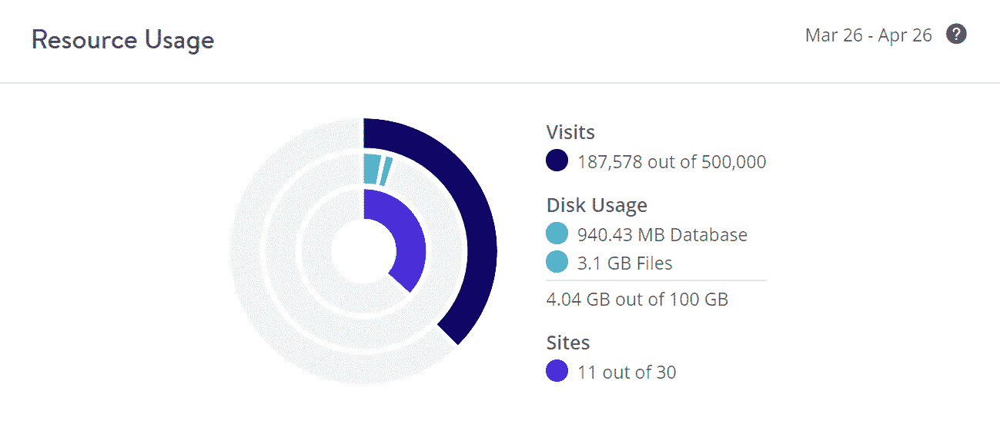
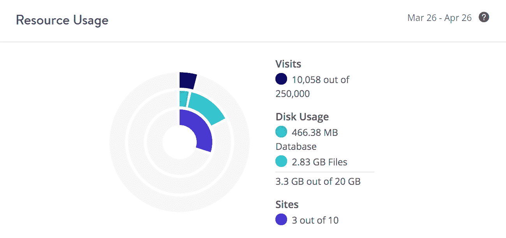
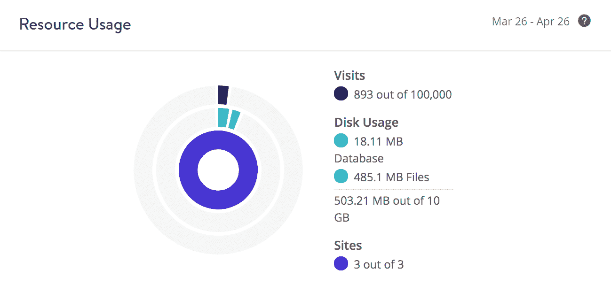
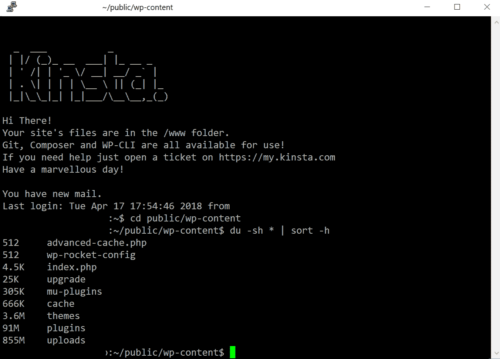

# 你的主机方案到底需要多少磁盘空间？

> 原文：<https://kinsta.com/blog/disk-space-wordpress-hosting/>

当寻找一个 [WordPress 托管](https://kinsta.com/wordpress-hosting/)计划时，很难判断**你认为你需要多少磁盘空间和你真正需要多少**。我们发现，在许多情况下，WordPress 用户严重高估了金额，这反过来以负面的方式影响了他们的购买决定。今天，我们将深入探讨一些更好地估计您的实际磁盘空间使用需求的方法，找到您当前使用情况的方法，并分享一些可以帮助您选择正确的托管计划的真实示例。

*   你需要多少磁盘空间？
*   您使用了多少磁盘空间？
*   [如何节省磁盘空间](#how-to-save-disk-space)

## 你需要多少磁盘空间？

让我们快速地看一下[总磁盘空间](https://kinsta.com/blog/disk-usage-wordpress/)与在 Kinsta 的 [WordPress 托管计划](https://kinsta.com/wordpress-hosting/plans/)中提供的站点数量的对比。我们所有的计划都根据我们从自己的客户端(无论大小)看到的平均磁盘空间使用情况分配了资源和限制。这些数据是多年来从成千上万的客户那里收集来的。

### 我们的托管计划

*   启动计划:10 GB 和 1 个 WordPress 站点
*   Pro 计划:20 GB 和 2 个 WordPress 网站
*   商业 1: 30 GB 和 3 个 WordPress 站点
*   业务 2: 40 GB 和 10 个 WordPress 网站
*   业务 3: 50 GB 和 20 个 WordPress 网站
*   业务 4: 60 GB 和 40 个 WordPress 网站
*   企业 1: 100 GB 和 60 个 WordPress 站点
*   企业 2: 120 GB 和 80 个 WordPress 站点
*   企业 3: 200 GB 和 120 个 WordPress 站点
*   企业 4: 250 GB 和 150 个 WordPress 站点

### 平均 WordPress 网站使用率

让我们计算一下 WordPress 网站的实际平均使用量。下面的数据是从已经运行了 4 年多的生产 WordPress 站点中获得的平均磁盘空间使用量。

*   WordPress 核心:8.9 兆字节
*   平均插件目录(`/wp-content/plugins` ): 100 MB
*   平均主题目录(`/wp-content/themes` ): 25 MB
*   平均上传目录(`/wp-content/uploads` ): 825 MB
*   平均 MySQL 数据库:85 MB

平均来说，我们发现典型的客户端对于一个 WordPress 安装有大约 **1 GB 的数据。有时这可以向任何一个方向摆动。有些可能有更大的数据库，但文件使用量较小，或者相反。因此，在我们的初始计划中，这为您留下了另一个 **9 GB (90%)的未使用磁盘空间用于增长**。**

> Kinsta 把我宠坏了，所以我现在要求每个供应商都提供这样的服务。我们还试图通过我们的 SaaS 工具支持达到这一水平。
> 
> <footer class="wp-block-kinsta-client-quote__footer">
> 
> 
> 
> <cite class="wp-block-kinsta-client-quote__cite">Suganthan Mohanadasan from @Suganthanmn</cite></footer>

[View plans](https://kinsta.com/plans/)

### 活生生的例子

但是，让我们来看看一些真实的客户端示例。下面列出的网站都在生产中:包括博客，企业和电子商务网站。

#### 客户端 1

第一个客户有 11 个 WordPress 站点，使用了 100 GB 磁盘空间中的 4.04 GB。它们远低于我们的 Kinsta 平均值，**每个站点使用不到 400 MB 的内存**。

Disk usage example (client 1)

#### 客户端 2

客户 2 有 3 个 WordPress 站点，使用了 20 GB 磁盘空间中的 3.3 GB。它们几乎与每个站点 1 GB 的 Kinsta 平均值持平。

Disk usage example (client 2)

#### 客户端 3

第三个客户端有 3 个 WordPress 站点，使用了分配给它们的 15 GB 磁盘空间中的 503.21 MB。它们明显低于我们的 Kinsta 平均值，**每个站点使用不到 200 MB**。

## 注册订阅时事通讯

### 想知道我们是怎么让流量增长超过 1000%的吗？

加入 20，000 多名获得我们每周时事通讯和内部消息的人的行列吧！

[Subscribe Now](#newsletter)

Disk usage example (client 3)

我们可以继续向您展示例子，但这是 Kinsta 大多数客户的典型情况。事实上，我们甚至更进一步，提供了这些节省磁盘空间的额外方法:

*   不包括中转站点。**只有实时网站会计入您的磁盘空间使用量**。
*   **在计算您的总磁盘空间使用量时，我们的报告中不包括**备份。您的使用仅包括您的实时网站文件和[数据库](https://kinsta.com/knowledgebase/wordpress-database/)。

### 平均值的例外

当然，平均水平总有例外。对于那些拥有大型视频文件、pdf 或高分辨率照片的人来说，你很可能处于光谱的另一端。这是完全正常的，我们在这种情况下接待了很多客户。对于磁盘空间不足的用户，我们有两个建议——我们的本地磁盘空间附件或卸载到外部存储提供商。

#### 1.Kinsta 磁盘空间附件

第一种选择是在 MyKinsta dashboard 中购买一个磁盘空间附件。我们提供额外的磁盘空间，20GB 的增量，收费 20 美元。选择我们的本地磁盘空间插件有它的好处。

*   你不必在亚马逊网络服务或谷歌云平台等外部存储提供商那里设立账户。
*   我们的磁盘空间插件是一个本地解决方案，这意味着你不需要安装和设置一个 WordPress 插件来连接外部提供商。
*   我们的磁盘空间附件与[KinstaCDN](https://kinsta.com/help/kinsta-cdn/)100%兼容。您不必担心为卸载的媒体设置另一个 CDN。
*   计费和磁盘使用统计是通过 MyKinsta 处理的。这使得在一个地方跟踪额外的磁盘空间使用情况变得容易。

#### 2.卸载到外部存储提供商

第二种选择是[将你的大文件](https://kinsta.com/knowledgebase/pdf-mp3-hosting/)卸载到单独的存储服务，如亚马逊 S3、谷歌云存储或流媒体解决方案。

Struggling with downtime and WordPress problems? Kinsta is the hosting solution designed to save you time! [Check out our features](https://kinsta.com/features/)

通过卸载，我们并不意味着使用一个 [CDN](https://kinsta.com/blog/wordpress-cdn/) ，尽管您可以将以下方法与一个 CDN 结合起来，以便两全其美！我们的意思是从你的原始服务器(Kinsta)上删除大文件，并由第三方提供服务。

*   查看我们关于 WordPress 和亚马逊 S3 的深度整合指南。一旦文件被卸载到 S3，您可以启用从本地服务器删除文件的选项。这有助于大大减少 WordPress 主机的磁盘空间需求。
*   你也可以对 WordPress 和 Google 云存储使用同样的方法。
*   我们还建议利用第三方服务，如 YouTube 或 Vimeo 获取视频，Soundcloud 获取音频文件，以及 Dropbox 获取可下载的 PDF 文件。这些服务不仅可靠稳定，而且在提供大型文件方面，它们拥有世界上最快的网络。

我们有时看到的另一个例外是大型 WooCommerce 网站。然而，许多这种类型的网站处理大量未缓存的请求，因此这种情况下的客户端通常已经有了更高的计划，有了更多的 PHP 工作人员。换句话说，这些类型的网站通常已经有了更大的计划和足够的磁盘空间。

## 您使用了多少磁盘空间？

希望迁移到 Kinsta 或另一台主机，并想知道您当前使用了多少磁盘空间？别担心，我们写了一份深入的指南，里面有 7 种不同的方法可以让你[检查你的磁盘空间使用情况](https://kinsta.com/blog/disk-usage-wordpress/)。你可以在几分钟内看到你上传的文件或主题文件夹有多大。以下是一些快捷方式:

*   [用 WordPress 插件检查磁盘使用情况](https://kinsta.com/blog/disk-usage-wordpress/#disk-usage-plugins)
*   [检查 cPanel 中的磁盘使用情况和数据库大小](https://kinsta.com/blog/disk-usage-wordpress/#disk-usage-cpanel)
*   [用 WordPress 插件检查数据库大小](https://kinsta.com/blog/disk-usage-wordpress/#database-size-plugins)
*   [用 phpMyAdmin 检查数据库大小](https://kinsta.com/blog/disk-usage-wordpress/#database-size-phpmyadmin)
*   [深入了解本地磁盘使用情况](https://kinsta.com/blog/disk-usage-wordpress/#disk-usage-locally)
*   [通过 SSH 检查磁盘使用情况](https://kinsta.com/blog/disk-usage-wordpress/#disk-usage-ssh)

Check disk usage via SSH

## 如何节省磁盘空间

徘徊在两个托管计划的边缘？这里有一些提示，可以立即节省磁盘空间，帮助确保您的托管计划有一些增长空间。

*   **Compress your images.** We can’t stress this enough. According to the [HTTP Archive](https://httparchive.org/reports/state-of-images#bytesImg), as of March 2018, images make up on average 51% of a total webpage’s weight. That’s a lot! 😮 Check out our complete guide to [image optimization](https://kinsta.com/blog/optimize-images-for-web/). We use the Imagify plugin and typically see **60-70% savings**!

    

    图像压缩文件保存

    

*   使用像[媒体清理器](https://wordpress.org/plugins/media-cleaner/)这样的插件更进一步。这可以让你找到并**清除你网站上未使用的媒体**。
*   当客户端迁移到 Kinsta 时，我们经常会发现**旧备份、数据库 SQL 文件**等。不再需要的东西。所以一定要检查每一个地方，因为几个旧的备份很容易加起来超过你的整个 WordPress 网站。这肯定会影响你的主机方案选择。如果你想保留额外的备份，只需将它们存储在其他地方，并利用 Kinsta 的[自动备份](https://kinsta.com/help/wordpress-backups/)，它不会计入你的磁盘空间使用量。
*   **将你的大文件卸载到亚马逊 S3、谷歌云存储、YouTube、Dropbox 或 Soundcloud 等服务上，以显著减少你对托管服务提供商的磁盘空间需求。**
*   删除你不再使用的旧主题和插件。我们已经看到一些疯狂的安装，有 50 多个不活跃的插件和几十个主题没有被使用。
*   [清除留在`wp_options`表中的自动加载数据](https://kinsta.com/knowledgebase/wp-options-autoloaded-data/)。到目前为止，这是缩小数据库最简单的方法之一。
*   在长期运行的 WordPress 网站上，文章和页面的修改很容易在你的数据库中增加数千个不必要的行。你可以很容易地[禁用或限制 WordPress 版本](https://kinsta.com/blog/wordpress-revisions/#how-to-limit-revisions-in-wordpress)来保持你的数据库处于最佳状态。
*   如果你一直在你的站点上调试东西，请确保**删除周围的旧日志文件**。
*   清理和删除垃圾邮件中的评论。

## 摘要

我们希望这能消除你在为你的企业选择正确的 WordPress 托管计划时可能有的任何顾虑。很多时候，您可能并不需要像您认为的那样多的磁盘空间。用上面的方法检查一下你目前使用了多少空间，优化你的网站，你应该很容易就能在托管上节省一些钱。

你有什么想法？你有没有发现，经过一点优化，你的磁盘使用量比你原来想象的要少很多？请在评论中告诉我们。

* * *

让你所有的[应用程序](https://kinsta.com/application-hosting/)、[数据库](https://kinsta.com/database-hosting/)和 [WordPress 网站](https://kinsta.com/wordpress-hosting/)在线并在一个屋檐下。我们功能丰富的高性能云平台包括:

*   在 MyKinsta 仪表盘中轻松设置和管理
*   24/7 专家支持
*   最好的谷歌云平台硬件和网络，由 Kubernetes 提供最大的可扩展性
*   面向速度和安全性的企业级 Cloudflare 集成
*   全球受众覆盖全球多达 35 个数据中心和 275 多个 pop

在第一个月使用托管的[应用程序或托管](https://kinsta.com/application-hosting/)的[数据库，您可以享受 20 美元的优惠，亲自测试一下。探索我们的](https://kinsta.com/database-hosting/)[计划](https://kinsta.com/plans/)或[与销售人员交谈](https://kinsta.com/contact-us/)以找到最适合您的方式。