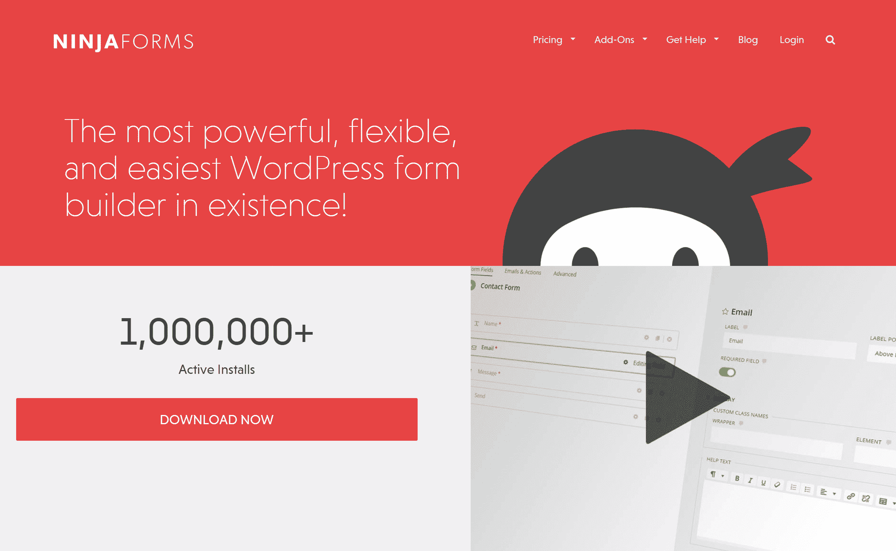

# 金斯塔·金并:詹姆斯·劳斯访谈

> 原文：<https://kinsta.com/blog/interview-james-laws/>

你可以在推特上或者 T2 的 LinkedIn 上找到詹姆斯。这是我们最近对他的采访，作为我们[金斯塔·金并](https://kinsta.com/?post_type=post&s=kingpin)系列的一部分。

### Q1:你的背景是什么，你是如何开始使用 WordPress 的？

我内心是一个创造者。我指的不一定是软件；我开始了产品、业务、系统和战略。任何可以从无到有，或者至少是非常少的东西。请注意，我在这方面并不总是成功。这只是我经常被吸引的东西。这让我在第一年成为了一名出色的员工，但之后却成了一名糟糕的员工，至少在我过去工作过的公司是这样。我倾向于尽可能地占据我被雇佣的位置，然后我就厌倦了。我需要创造一些新的东西，但我通常已经用尽了我目前角色的极限。

2005 年，我刚刚开始了一个新的教堂。没错，我说的是教堂，但那是另一套问题的故事。你可能不知道这一点，但开始一个教会通常不会付出很多，所以我需要找到一种方法来赚钱养活我的家人。我从事平面和网页设计已经有几年了，我的朋友凯文·斯托弗有一些开发背景，所以我们决定尝试一下自由职业。我们已经开始建立 Flash 网站，在尝试其他网络出版工具的过程中，我偶然发现了 WordPress。一开始，只是定制我的主题风格，复制我在网上找到的 PHP 代码片段。当我试图构建我的第一个定制插件时，忘了它吧，我被迷住了。

### Q2:读者应该知道你最近在 WordPress 做了些什么？

大多数人都知道我是 [Ninja Forms](https://ninjaforms.com/) 的共同创建者，这是一个 WordPress form builder，为那些想要强大又漂亮的软件的人而设。该产品仍在不断发展和创新。我们真的在挖掘和倾听我们的用户和更大的社区，以找到我们可以做得更好的方法，并进一步推动软件。

Ninja Forms

很多人可能不知道忍者形态只是我们的兴趣之一。我们的母公司 [Saturday Drive](http://wpninjas.com/) ，总是有 3 到 4 个其他项目在进行中。它们并不总是与 WordPress 直接相关，但是它们中的许多帮助我们更好地服务 WordPress 社区。
T3】

### Q3:在职业生涯中，你遇到了哪些挑战？

最大的挑战，我不认为我是唯一的，是失望的挑战。以上，我从 2005 年开始和你的故事。Ninja Forms 创建于 2011 年，直到 2013 年才真正受到关注。在那段时间里，我们努力争取客户，创办了几个不同的企业，但都没有成功。还有一个教会，出于各种原因，我称之为成功，但它从未真正发展壮大。这还没有包括 2005 年之前的所有事情。八年多的几次收支平衡和两倍的失败会让人士气低落。

> Kinsta 把我宠坏了，所以我现在要求每个供应商都提供这样的服务。我们还试图通过我们的 SaaS 工具支持达到这一水平。
> 
> <footer class="wp-block-kinsta-client-quote__footer">
> 
> 
> 
> <cite class="wp-block-kinsta-client-quote__cite">Suganthan Mohanadasan from @Suganthanmn</cite></footer>

[View plans](https://kinsta.com/plans/)

忍者形态于 2011 年在一个非常饱和的市场推出。在当时一个流量很大的 WordPress 新闻网站对它的第一次大规模报道中，评论并不乐观。我们被告知只要关闭整个事情。毕竟，任何可能成为客户的人都已经有了接触市场领导者的渠道。在我的后脑勺，一个小小的声音响起，“又来了。又一个失败的例子。”许多人当时可能已经放弃了，但我没有。我很容易失望，在接下来的一年半时间里，我会一直失望下去。看来他们是对的；销售额要么很低，要么根本没有。我们还有一个实验要尝试，这将是一个昂贵的实验。

凯文和我花了一年半的时间用新的开发和商业模式重建忍者形态。它最终在 2013 年 1 月推出。从商业角度来看，我们是在浪费钱；如果我们算上重新制作忍者形态所花费的时间，那将是我们在过去一年半中所做的两倍多。但是成功了！销售额开始增长，并且逐月呈指数增长。时至今日，这种情况依然存在，但我们本可以轻松摆脱失望和缺乏即时满足感。有时候你应该放弃。但是有时候你应该忽略那些告诉你放弃的声音，尤其是你自己的声音。

最大的挑战是知道区别。

## 注册订阅时事通讯

### 想知道我们是怎么让流量增长超过 1000%的吗？

加入 20，000 多名获得我们每周时事通讯和内部消息的人的行列吧！

[Subscribe Now](#newsletter)[Sometimes you should give up. But sometimes you should ignore the voices, especially your own. The biggest challenge is knowing the difference. 👍 - @jameslawsClick to Tweet](https://twitter.com/intent/tweet?url=https%3A%2F%2Fbit.ly%2F3iq4yNF&via=kinsta&text=Sometimes+you+should+give+up.+But+sometimes+you+should+ignore+the+voices%2C+especially+your+own.+The+biggest+challenge+is+knowing+the+difference.+%F0%9F%91%8D+-+%40jameslaws&hashtags=entrepreneur%2Cinspirational)

### 在 WordPress 的世界里，有没有什么让你感到惊讶的事情？

社区。我希望我的回答是深刻而独特的，但是，唉，这是大多数人在进入这个疯狂的 WordPress 世界时注意到的。

作为其他特定行业社区的一员，我从未发现另一个社区如此具有吸引力、接纳力和培育力。我们的成功很大程度上要归功于平等接纳我们的社区，尽管我们相对来说并不出名。社区审查了我们的代码和产品，当我们有问题时给予帮助，还有无数其他的善意行为帮助我们成为 WordPress 表单构建者中的一员。

### Q5:你认为 WordPress 世界的未来会是怎样的？

Ninja Forms 是该领域最具创新性的表单生成器，我们不打算很快放慢速度。我们正在增加一些非常酷的新功能、附加功能和服务，它们将会以全新的形式出现。

Struggling with downtime and WordPress problems? Kinsta is the hosting solution designed to save you time! [Check out our features](https://kinsta.com/features/)

我们将继续支持我们的 WordPress 社区，在我们的本地聚会、WordPress camps 上，并提供优秀的产品、服务和资源。我们热爱这个社区，只要他们需要我们，我们就计划成为其中的一部分。

### 你在 WordPress 主机中寻找什么？

我认为我寻找的东西和其他人一样:正常运行时间长、快速、安全和维护良好的服务器，以及良好的客户服务。但这些都是基本预期，通常并不显著。由于我经营一个电子商务网站，我想知道如果有任何问题，有人可以立即修复它。我不关心是谁的错或者犯了什么错误；我只想我的网站备份，并为我的客户服务。在我看来，认真承担责任的主持人总是赢家。

### 问题 7:当你离开笔记本电脑时，你喜欢做什么？

我有一个 3 岁的儿子，他让我忙着假装是吃豆人的鬼魂，但当我不被他追的时候，我通常还是在我的笔记本电脑上。我的大部分爱好其实还在笔记本电脑上。正如我之前说过的，我喜欢创造东西。我收集扑克牌已经有几年了，我决定尝试设计自己的扑克牌。我仍处于早期阶段，所以目前有很多探索。

我开始收集扑克牌的原因是我一直是特写魔术的狂热爱好者，所以我也读了很多这方面的书，并幻想自己是一名信息卡技术人员。我的意思是，我知道很多使用的技术，我自己也时不时地涉足其中，但可能永远不会向其他人展示。

### 问题 8:接下来我们应该采访谁&为什么？

我建议采访安迪·威尔克森。他是一个超级天才的设计师和企业家。他有一个惊人的主题集合，他正在销售一些非常酷的新服务，这些服务将以非常积极的方式影响那些想要推出播客的人。

* * *

让你所有的[应用程序](https://kinsta.com/application-hosting/)、[数据库](https://kinsta.com/database-hosting/)和 [WordPress 网站](https://kinsta.com/wordpress-hosting/)在线并在一个屋檐下。我们功能丰富的高性能云平台包括:

*   在 MyKinsta 仪表盘中轻松设置和管理
*   24/7 专家支持
*   最好的谷歌云平台硬件和网络，由 Kubernetes 提供最大的可扩展性
*   面向速度和安全性的企业级 Cloudflare 集成
*   全球受众覆盖全球多达 35 个数据中心和 275 多个 pop

在第一个月使用托管的[应用程序或托管](https://kinsta.com/application-hosting/)的[数据库，您可以享受 20 美元的优惠，亲自测试一下。探索我们的](https://kinsta.com/database-hosting/)[计划](https://kinsta.com/plans/)或[与销售人员交谈](https://kinsta.com/contact-us/)以找到最适合您的方式。