# 金斯塔和 WP 火箭:现在一起加速 WordPress

> 原文：<https://kinsta.com/blog/wp-rocket/>

我们一直在寻找新的和创新的方法来进一步加快和优化您的网站。在过去的几个月里，我们的团队一直在幕后与 WP Rocket 的开发人员合作，协调他们全新的[3.0 版本插件](https://wp-rocket.me/blog/3-0/)(2018 年 4 月 3 日发布)的一些变化。我们很兴奋地宣布 **WP Rocket 3.0 和 Kinsta 现在完全兼容**，并将从此开始。

看看下面你需要知道的关于在 Kinsta 使用 WP Rocket 的一切，以及它如何能成为你和你的客户的最佳搭档。


## 在金斯塔使用 WP 火箭

对于那些不熟悉 WP Rocket 的人来说，这是一个受欢迎的 WordPress 多合一高级缓存和优化插件。通常[我们不允许缓存插件](https://kinsta.com/knowledgebase/banned-plugins/)出现在我们的环境中，因为它们与我们内置的缓存解决方案相冲突。然而，从 WP Rocket 3.0 开始，在 Kinsta 服务器上运行时，它们的页面缓存功能将被自动禁用。因此，我们允许 WP Rocket 在我们的平台上运行，因为不再有任何不兼容的地方。

这使你现在可以使用 [Kinsta 的缓存解决方案](https://kinsta.com/blog/wordpress-cache/)，但**仍然可以利用 WP Rocket 提供的惊人优化功能**(我们将在下面深入探讨)。

为什么缓存很重要？缓存是存储来自一个请求的资源并为后续请求重用这些资源的过程。基本上，它减少了生成页面视图所需的工作量，并降低了 web 服务器的负载。这是消除 WordPress 对 PHP 和数据库的依赖所带来的延迟的最好方法。

## WP 火箭 3.0 特性

如果你还没看过 WP Rocket 的新 3.0 版本，UI 还很漂亮；同时仍然易于使用和导航！下面我们将深入一些推荐的功能，你可以利用 WP Rocket 来加速你的 WordPress 站点，以及它如何与 Kinsta 环境同步。

我们还将运行一些速度测试，看看哪些选项对现场直播网站的影响最大。不过请记住，不同网站的结果会有所不同，所以请确保在您自己的网站或 [staging](https://kinsta.com/help/staging-environment/) 上进行测试。

如果你使用的是 Kinsta 的一个中转站点，WP Rocket 已经将我们的 URL 结构(staging-sitename . Kinsta . cloud)加入了白名单，这意味着它不会被计入你的许可证总数。运行在本地主机上的[也是如此。](https://docs.wp-rocket.me/article/109-can-i-run-wp-rocket-on-localhost)


> Kinsta 把我宠坏了，所以我现在要求每个供应商都提供这样的服务。我们还试图通过我们的 SaaS 工具支持达到这一水平。
> 
> <footer class="wp-block-kinsta-client-quote__footer">
> 
> 
> 
> <cite class="wp-block-kinsta-client-quote__cite">Suganthan Mohanadasan from @Suganthanmn</cite></footer>

[View plans](https://kinsta.com/plans/)

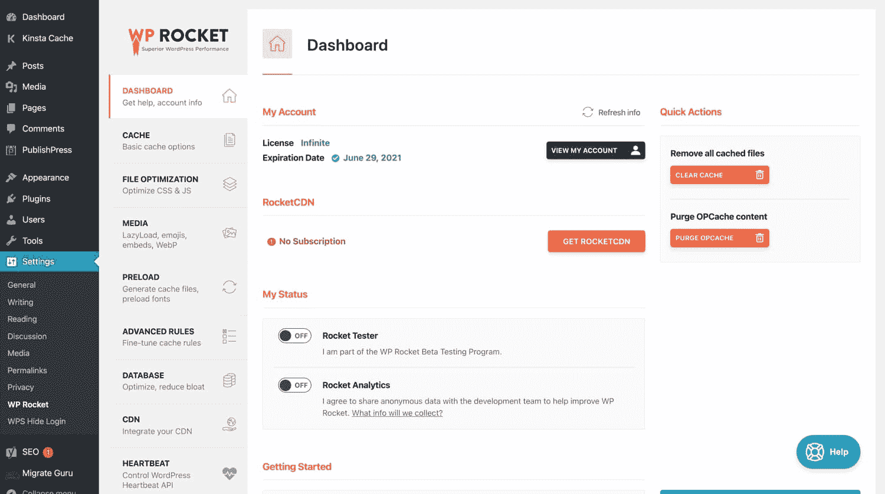

WP Rocket’s main dashboard.


### 清除缓存

即使 WP Rocket 在 Kinsta 上运行时自动禁用缓存，WP Rocket 菜单中的“清除缓存”选项也会与 Kinsta 环境同步。如果你清除你的 WP 火箭缓存，它实际上清除了你整个网站的 Kinsta 缓存。多酷啊。和往常一样，您可以从管理栏的右上角清除您的 Kinsta 缓存。

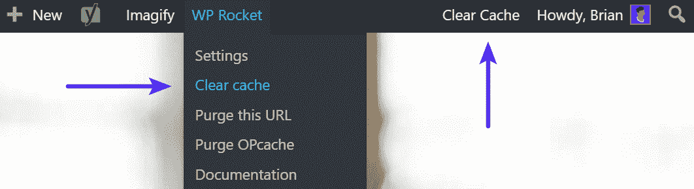

Clear cache (2 ways)


“清除此 URL”也以同样的方式工作，但是它不是清除您站点的整个缓存，而是清除您当前所在的 URL 的缓存。如果您对页面或帖子进行了手动更新，这将非常有用

出于性能原因，**我们不建议经常清理你的站点的整个缓存**，因为之后它必须重新构建。清除单个 URL 是一个更好的方法。

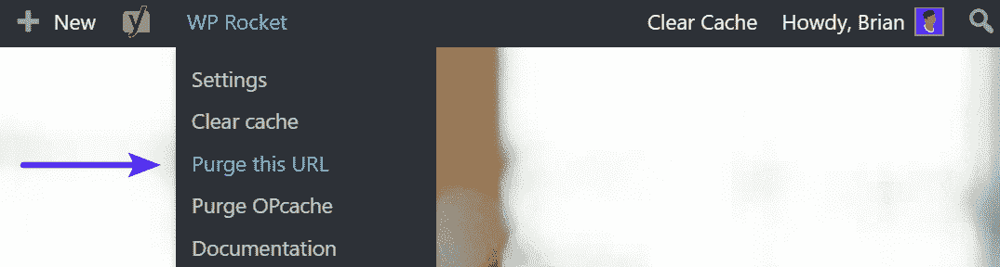

WP Rocket purge cache on individual URL


如果你在你的 WordPress 站点上改变了一些东西，比如插件或者主题，你可能会看到来自 WP Rocket 的警告。这里的“清除缓存”按钮也会清除 Kinsta 缓存。

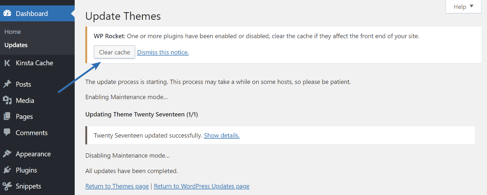

WP Rocket changes clear cache


最后，如果你点击 WP Rocket 仪表板上的“清除缓存”按钮，这也会清除 Kinsta 缓存。

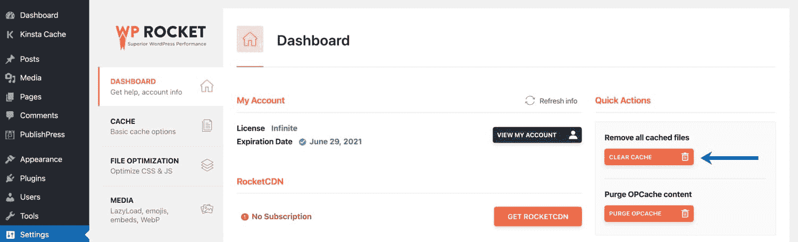

Clear cache in WP Rocket.


### 隐藏物

正如我们前面提到的，对于 Kinsta 上托管的网站，WP Rocket 页面缓存被自动禁用。因此，我们建议保留 WP Rocket 的缓存设置，选中“为移动设备启用缓存”。

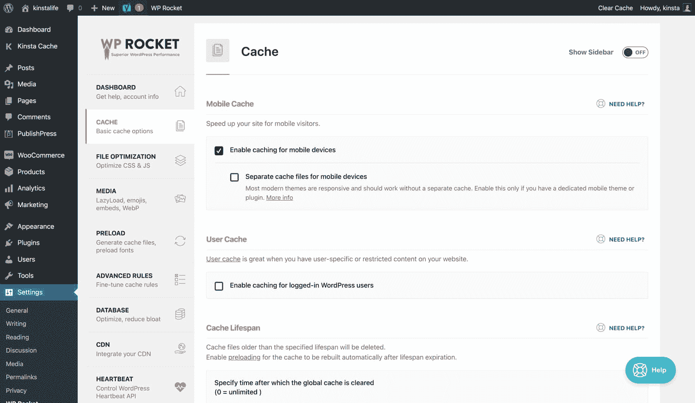

WP Rocket page cache settings.


### 文件优化

在“文件优化”菜单下，你可以优化你的 CSS 和 JavaScript 文件。让我们深入了解一下这些问题。


WP Rocket file optimization.


#### 基本设置

*   **缩小 HTML:** 缩小 HTML 删除空白和注释以减小大小。我们运行了速度测试，发现启用该选项后，加载时间减少了 **0.84%。⏱您可能看不到这个特性的疯狂改进，但是一般来说，更少的空白和代码是一件好事。**
*   **合并谷歌字体文件:**合并[谷歌字体](https://kinsta.com/blog/best-google-fonts/)会减少 HTTP 请求的数量。如果您正在使用启用了 [HTTP/2](https://kinsta.com/learn/what-is-http2/) 的主机，由于并行化的改进，不再推荐合并文件。Kinsta 完全支持 HTTP/2。从你自己的 CDN 加载字体有时也能提高性能。查看我们关于如何托管本地字体的指南。
*   **[从静态资源中移除查询字符串](https://kinsta.com/knowledgebase/remove-query-strings-static-resources/) :** 你的 CSS 和 JavaScript 文件通常在它们的 URL 末尾都有文件版本，比如`domain.com/style.css?ver=4.6`。一些服务器和代理服务器不能缓存查询字符串，即使存在一个`cache-control:public`头。因此，通过删除它们，有时可以改善缓存。我们运行了速度测试，发现启用该选项后，加载时间减少了 **1.86%。**注意:您不能将它与 minify CSS 或 JavaScript 选项一起使用。****

#### CSS 文件

*   **缩小 CSS 文件**删除空白和注释以减小文件大小。我们运行了速度测试，发现启用该选项后，加载时间减少了 **1.69%。⏱由于 CSS 的工作方式，这可能会破坏你的网站，所以一定要测试它。同样，一般来说，更少的空白和代码是一件好事。**
*   **合并 CSS 文件**将你所有的文件合并成 1 个，[减少 HTTP 请求](https://kinsta.com/blog/make-fewer-http-requests/)。如果您使用的是启用了 [HTTP/2](https://kinsta.com/learn/what-is-http2/) 的主机，不再推荐合并文件，因为它们现在可以通过单个连接并行加载。Kinsta 完全支持 HTTP/2。阅读更多关于[结合外部 CSS](https://kinsta.com/knowledgebase/combine-external-css/) 的内容。
*   **优化 CSS 交付**消除网站上的渲染阻塞 CSS，以加快感知加载时间。在我们关于[渲染阻塞 CSS](https://kinsta.com/blog/eliminate-render-blocking-javascript-css/) 和[优化关键渲染路径](https://kinsta.com/blog/critical-rendering-path/)的深度文章中，可以读到更多相关内容。我们运行了速度测试，发现启用该选项后，加载时间减少了 **0.17%。⏱请记住，这更多的是关于感知的加载时间，而不是实际的加载时间。**

#### JavaScript 文件

*   **缩小 JavaScript 文件**删除空白和注释[减小文件大小](https://kinsta.com/blog/minify-javascript/)。我们进行了速度测试，发现启用该选项后，加载时间下降了 **0.84%。由于 JavaScript 的工作方式，这可能会破坏你的插件或主题的功能，所以一定要测试它。**
*   **合并 JavaScript 文件**合并你站点的 JS info 更少的文件，减少 HTTP 请求。如果您使用的是启用了 [HTTP/2](https://kinsta.com/learn/what-is-http2/) 的主机，不再推荐合并文件，因为它们现在可以通过单个连接并行加载。Kinsta 完全支持 HTTP/2。
*   **加载 JavaScript 延迟**消除了你的站点上的渲染阻塞 JS，可以改善加载时间。在我们关于[渲染阻塞 JavaScript](https://kinsta.com/blog/eliminate-render-blocking-javascript-css/) 的深入文章中阅读更多相关内容。如果你不小心，这也会破坏你的网站，所以一定要测试。我们进行了速度测试，发现启用该选项后，加载时间减少了 **1.35%。**

如果你是 [Kinsta 的客户](https://kinsta.com/plans/?plan=visits-business1&interval=month)，并且你正在使用内置于 [MyKinsta 仪表板](https://kinsta.com/mykinsta/)中的[代码缩减功能](https://kinsta.com/help/kinsta-cdn-code-minification/)，请与[支持](https://kinsta.com/kinsta-support/)一起仔细检查，看看使用这两个选项是否合适。

### 媒体

在“媒体”菜单下，他们给你一个选项来延迟加载你的图像和视频，并禁止加载额外的脚本，如表情符号和嵌入。让我们深入了解一下这些问题。

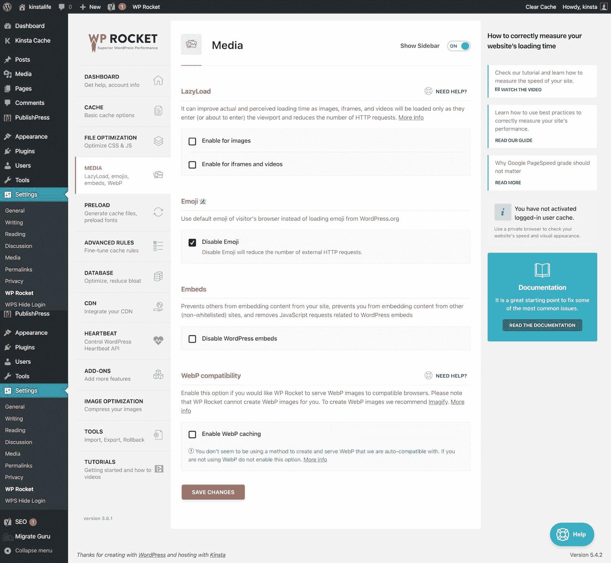

WP Rocket media optimization.


#### LazyLoad

延迟加载是一种优化技术，它加载可视内容，但会延迟文件夹下内容的下载和呈现。通过启用延迟加载选项，它可以改善实际和感知的加载时间，因为图像、[iframe](https://kinsta.com/blog/wordpress-iframe/)和视频将仅在进入(或即将进入)视窗时加载，并减少 HTTP 请求的数量。

*   **启用映像:**我们运行了速度测试，发现启用此选项后**的加载时间减少了 3.89%**。
*   **启用 iframes 和视频:**我们将八个 YouTube 视频放到一个页面上，看到启用此选项后加载时间减少了 **74.43%。WP Rocket 有一个选项，可以用预览图片自动替换 YouTube 视频。这是在你的 WordPress 站点上加速视频的一个非常强大的方法。**

查看我们关于 WordPress 中[延迟加载的深入教程。](https://kinsta.com/blog/wordpress-lazy-load/)

#### 表情符号

随着 [WordPress 4.2](https://codex.wordpress.org/Version_4.2) 的发布，表情符号被整合到旧浏览器的核心中。最大的问题是，它会在你的 WordPress 站点上生成一个额外的 HTTP 请求来加载`wp-emoji-release.min.js`文件。这在每一页上都有体现。

**禁用表情符号:**禁用表情符号选项将减少 HTTP 请求的数量。它不会破坏它们，只会简单地默认回用户的浏览器表情符号版本。我们运行了速度测试，发现启用该选项后，加载时间减少了 **2.2%。**

查看我们关于禁用表情符号的深入文章。

#### 使...嵌入

随着 [WordPress 4.4](https://codex.wordpress.org/Version_4.4) 的发布，oEmbed 特性进入了内核。你可能以前见过或用过这个。这使得用户只需粘贴一个 URL 就可以在他们的网站上嵌入 YouTube 视频、推文和许多其他资源，WordPress 会自动将其转换为嵌入内容，并在可视化编辑器中提供实时预览。如果你的网站中嵌入了脸书，看看脸书的新更新会如何影响它，以及[如何修复它](https://kinsta.com/blog/facebook-oembed/)。

然而，这意味着它还会在你的 WordPress 站点上生成一个额外的 HTTP 请求来加载`wp-embed.min.js`文件。这在每一页上都有体现。

禁用 WordPress 嵌入:禁用嵌入选项将减少 HTTP 请求的数量。我们运行了速度测试，发现启用该选项后，加载时间减少了 **4.9%。⏱查看我们关于[禁用嵌入](https://kinsta.com/knowledgebase/disable-embeds-wordpress/)的深度文章。**

### 事先装好

在“预加载”菜单下，它们给你一个选项来启用缓存预加载、DNS 预取和字体预加载。并非所有这些都适用于 Kinsta。但是，让我们深入研究一下每一个问题。

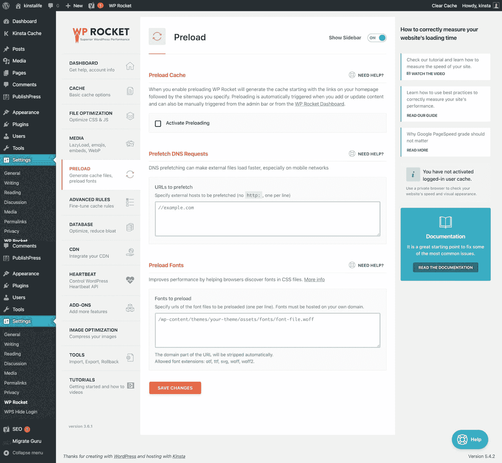

Preload settings in WP Rocket.


#### 预加载缓存

我们不建议在 Kinsta 上托管的站点使用这个选项，因为它实际上会因为 PHP 工作器过载而降低性能。

#### 预取 DNS 请求

DNS 预取允许您在用户单击链接之前解析域名(在后台执行 DNS 查找)，这反过来有助于提高性能。这是通过在你的 WordPress 站点的标题中添加一个`rel="dns-prefetch"`标签来完成的。我们建议从你的 CDN，谷歌字体和谷歌分析的外部请求增加预取。下面是一个例子:

```


```

这是更难的速度测试，但你可以放心，这将有助于加快你的网站。

## 注册订阅时事通讯


### 想知道我们是怎么让流量增长超过 1000%的吗？

加入 20，000 多名获得我们每周时事通讯和内部消息的人的行列吧！

[Subscribe Now](#newsletter)

#### 预加载字体

如果你在自己的域名上托管字体，而不是像谷歌字体这样的外部服务，我们建议将它们添加到 WP Rocket 的“预加载字体”列表中。通过在 HTML 的`<head>`元素中预加载字体，web 浏览器可以在字体在 CSS 文件中被发现之前开始下载字体。

### 高级规则

由于 WP Rocket 同步到 Kinsta 环境缓存，所以不能使用高级规则。如果您需要从缓存中排除某个 URL 或目录，或者强制缓存某个查询字符串，您可以随时[联系 Kinsta 支持团队](https://kinsta.com/kinsta-support/)。

### 数据库ˌ资料库

在“数据库”菜单下，WP Rocket 让你能够对帖子、评论、瞬变和表格进行清理。

当与我们的[自动每周数据库优化](https://kinsta.com/feature-updates/auto-db-optimize/)相结合时，通过删除不必要的帖子修订和瞬变来保持您的数据库整洁，将确保您的数据库以最佳性能工作。

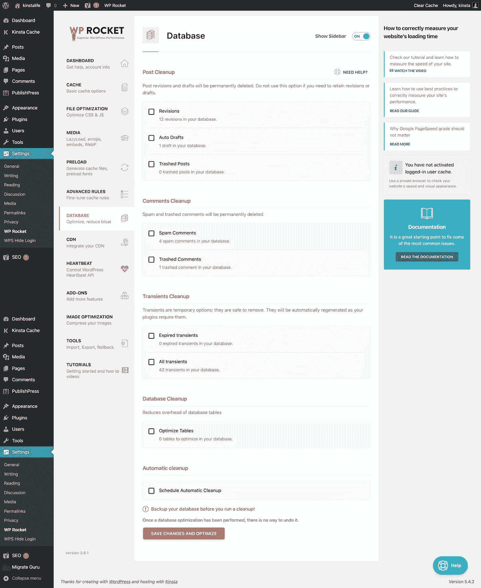

WP Rocket database optimization.


#### 后期清理

对于老网站来说，主页上有超过 100 次的修改并不罕见。这仅仅是由于多年的编辑和更新内容。比方说，一个网站有 700 个页面或帖子，每个页面或帖子有 150 个修订，这将是数据库中超过 100，000 个条目。这个[占用存储空间](https://kinsta.com/blog/disk-space-wordpress-hosting/)，即使是数据库索引，这有时也会损害性能。

WP Rocket 让你可以选择删除以下内容:

*   修订
*   自动草稿
*   垃圾帖子

查看我们关于如何[优化版本以提高性能](https://kinsta.com/blog/wordpress-revisions/)的深度帖子。

#### 注释清理

与修订版类似，垃圾邮件和垃圾评论随着时间的推移只会增加空间浪费。WP Rocket 让你可以选择删除以下内容:

*   垃圾评论
*   垃圾评论

如果你没有在你的 WordPress 网站上使用评论，我们建议简单地[禁用评论](https://kinsta.com/blog/wordpress-disable-comments/)来阻止垃圾邮件。你也不必担心安装垃圾邮件插件。

#### 瞬变清除

WordPress 中的瞬变有时会被忽略，但它们非常重要！事实上，我们已经看到损坏的临时缓存[完全关闭了一个 WordPress 站点](https://kinsta.com/blog/debugging-wordpress-performance/)。这些是暂时的，所以删除它们是安全的，我们也建议这样做。如果插件需要它们，它们会自动重新生成。WP Rocket 让你可以选择删除以下内容:

*   过期瞬变
*   所有瞬变

#### 数据库清理

数据库清理选项减少了数据库表的开销。然而，在 Kinsta，我们使用 [InnoDB](https://kinsta.com/knowledgebase/convert-myisam-to-innodb/) 而不是 MyISAM，因此通常不需要。InnoDB 表现更好，也更可靠。使用 InnoDB 而不是 MyISAM 的一个重要原因是利用行级锁定。这使得您的数据库查询处理速度更快。如果你[将你的 WordPress 网站迁移到 Kinsta](https://kinsta.com/knowledgebase/wordpress-migrations/) ，这是我们的工程师对你的网站进行的众多优化之一。

Struggling with downtime and WordPress problems? Kinsta is the hosting solution designed to save you time! [Check out our features](https://kinsta.com/features/)

#### 自动清理

WP Rocket 还为您提供了每天、每周或每月自动清理数据库的选项。这是由后台的一个 [cron 作业](https://kinsta.com/knowledgebase/wordpress-cron-job/)安排的。

### 加拿大

在“CDN”菜单下，您可以启用第三方内容交付网络。说到性能，这是一个显而易见的问题。它们减轻了你的网络服务器的负荷，同时加快了向你的访问者提供内容的速度，从而使他们的体验更好。看看为什么我们认为[每个网站都应该使用 CDN](https://kinsta.com/blog/wordpress-cdn/) 。

如果你是 Kinsta 的客户，这个菜单就不需要了，因为 [Kinsta CDN](https://kinsta.com/help/kinsta-cdn/) 会自动部署在你的网站后台。

我们建议首先通过一个[网站速度测试工具](https://kinsta.com/blog/website-speed-test/)运行你的 WordPress 网站，以确认你的所有资产(JS、CSS 和图片)都是从 Kinsta CDN 加载的。

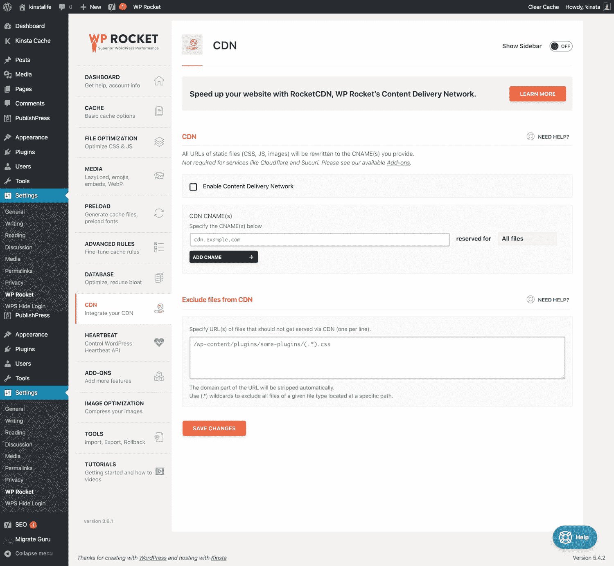

Add your CDN settings in WP Rocket.


### 心跳

Heartbeat 是一个用于服务器轮询的 WordPress 核心 API。它被许多主题和插件用来保持与服务器的连接。这允许 WordPress 开发者在他们的产品中建立实时更新。

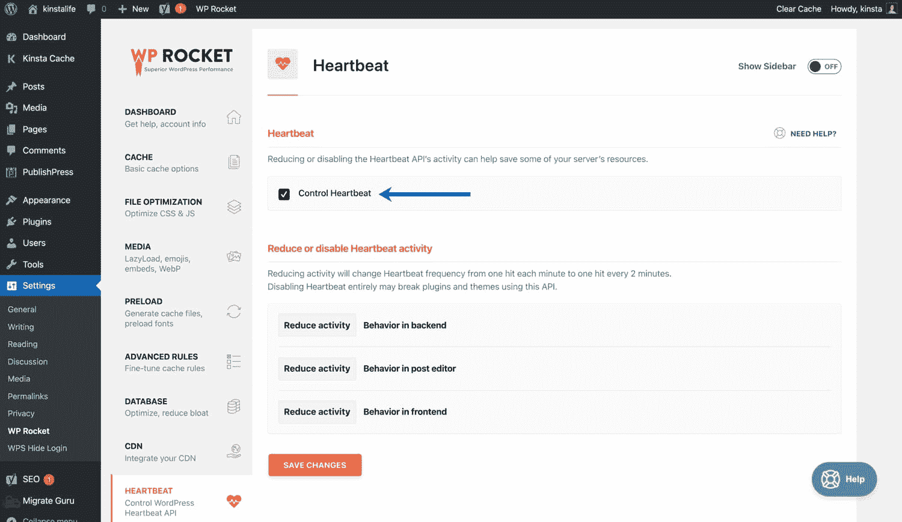

Change WordPress heartbeat settings in WP Rocket.


默认情况下，客户端心跳代码每 15-60 秒运行一次。根据您的站点和服务器配置，可能不需要频繁的心跳服务器 pings。

有了 WP Rocket，你可以将心跳 ping 间隔减少到 2 分钟，或者完全禁用网站后端(WP dashboard)、前端和帖子编辑器的 ping。

对于大多数站点，**我们建议使用“减少活动”选项**。许多现代插件和主题确保核心功能的心跳，所以完全禁用它可能会破坏你的网站。

### Add-Ons

在“加载项”下，WP Rocket 可以给你的网站添加额外的服务，比如 [Cloudflare](https://kinsta.com/knowledgebase/install-cloudflare/) 、 [Sucuri](https://kinsta.com/blog/sucuri-firewall/) 、[谷歌分析](https://kinsta.com/blog/how-to-use-google-analytics/)和[脸书像素](https://kinsta.com/blog/conversion-tracking/)。如果你在你的网站上使用任何这些服务，我们建议通过 WP Rocket 设置它们，以确保你从这些服务的最佳集成中受益。

如果你已经在使用其他插件将这些服务整合到你的网站中，你可以在 WP Rocket 中配置插件后安全地移除这些插件。

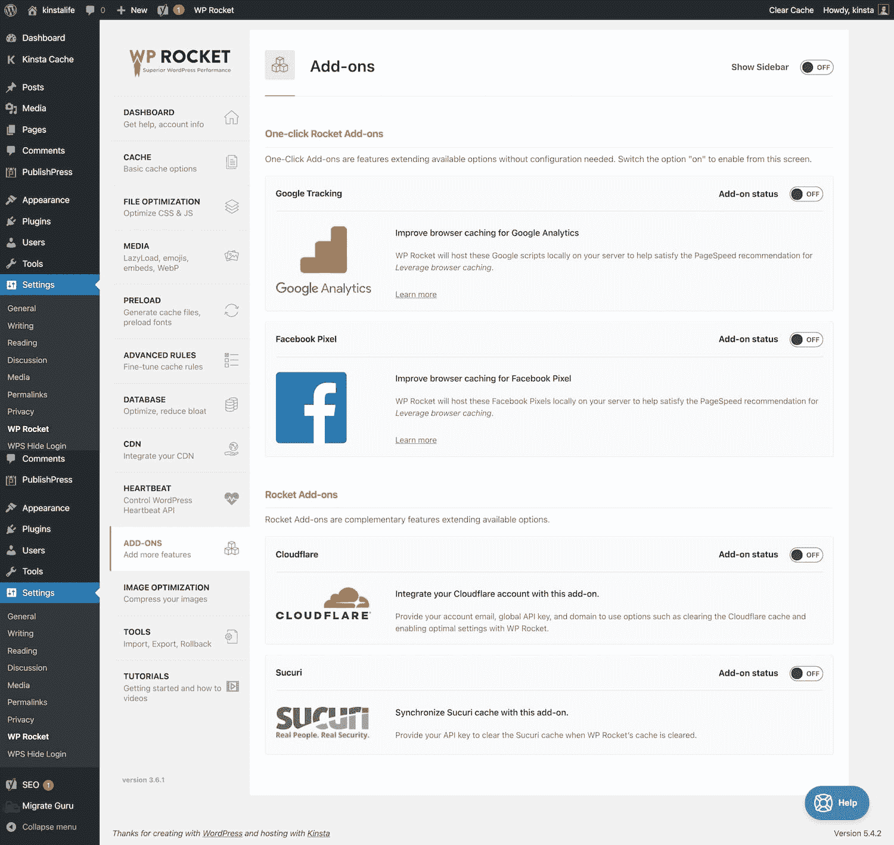

WP Rocket add-ons.


### 图像优化

WP Rocket 的开发者是我们最喜欢的图片优化服务之一 Imagify 背后的同一批人。如果你正在寻找一个易于使用的 WordPress 插件来优化图片，看看 Imagify 吧。要了解更多关于图像优化和其他优化插件和解决方案，请查看[这篇文章](https://kinsta.com/blog/optimize-images-for-web/)。


Image optimization by Imagify.


### 最终速度测试

然后，我们运行了一些最终的速度测试，所有的东西都启用了，所以你可以看到一个之前和之后。注意:这个 WordPress 站点位于 Kinsta。

#### WP 火箭之前

我们在没有 WP Rocket 的情况下在 Pingdom 中运行了 5 次测试，取了平均值。

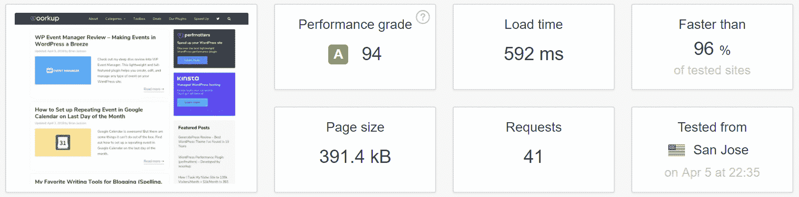

Before WP Rocket


然后我们在没有 WP Rocket 的情况下在 Google PageSpeed Insights 中运行了一个测试。

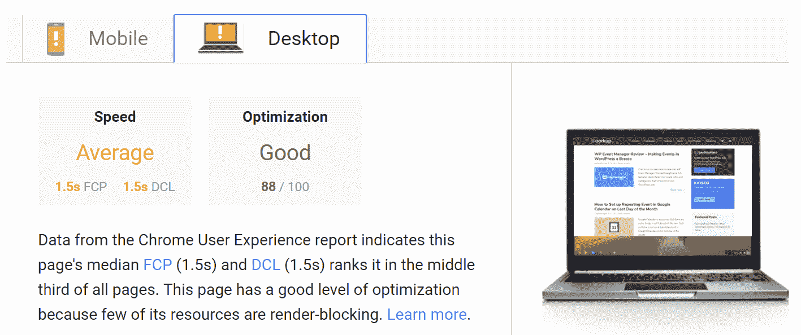

Google PageSpeed Insights before WP Rocket


#### WP 火箭之后

然后，我们在启用 WP Rocket 和 options 的情况下在 Pingdom 中运行了 5 次测试，并取平均值。

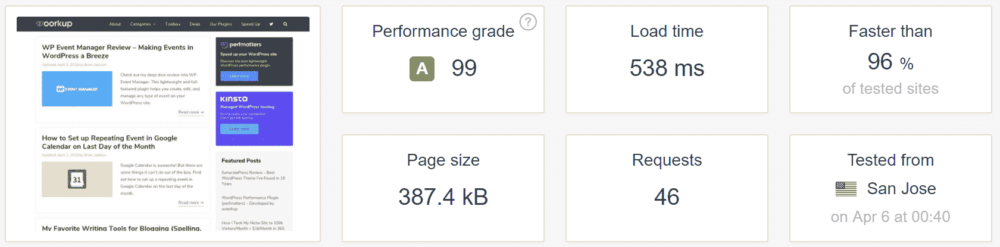

With WP Rocket


然后我们用 WP Rocket 在 Google PageSpeed Insights 中运行了一个测试。

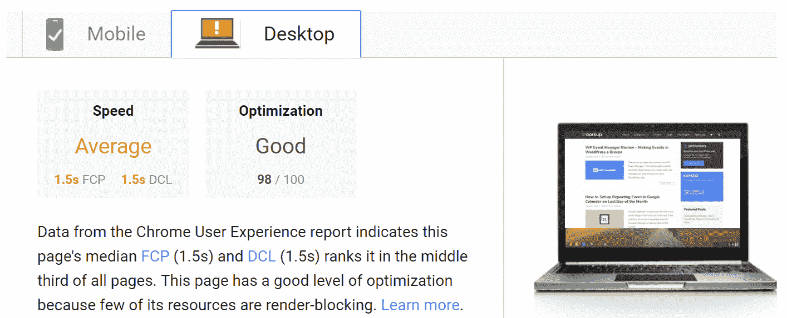

Google PageSpeed Insights with WP Rocket


以下是从上述结果中得出的结论:

*   在我们的 [Pingdom](https://kinsta.com/blog/pingdom-speed-test/) 测试中，我们看到运行 WP Rocket 时总加载时间减少了 **9.12%。虽然这可能看起来不算高，但这只花了几分钟时间，而且**不到 10 次点击就完成了**。**
*   记住 WP Rocket 的面包和黄油在他们的缓存解决方案中。但是在 Kinsta 这里，我们已经在使用我们的[内置缓存](https://kinsta.com/blog/wordpress-cache/)，所以我们只分享他们其他优化特性的结果。因此，在 Kinsta 的 lightning fast cache 基础上，它确实提高了 9%。
*   我们用于测试的网站已经相当优化了。较大的网站和那些没有优化的网站将很容易看到更好的结果。
*   好奇为什么最终版本会有附加要求？这通常是由于延迟加载图像，因为这会创建空白的`data:image/gif;base64`请求。但别担心，还是会更快。
*   如果你在托管视频，你可能会看到加载时间减少 50%或更多。这是通过利用 WP Rockets 的功能来实现的，该功能用可点击的预览[缩略图](https://kinsta.com/blog/regenerate-thumbnails/)来代替 YouTube 视频。这真是得心应手！
*   在我们的 Google PageSpeed Insights 测试中，我们看到我们的分数从 88/100 增加到 98/100 。然而，**分数没有总加载次数**重要，所以要有所保留。我们在关于[谷歌页面速度洞察](https://kinsta.com/blog/google-pagespeed-insights/)的文章中讨论了这一点。

正如你在上面看到的，WP Rocket 让[加速你的 WordPress 站点](https://kinsta.com/learn/speed-up-wordpress/)变得非常容易，只需要简单的点击几下！

## 摘要

WP Rocket 的团队不断推出与我们在 Kinsta 分享的 [web 性能建议](https://kinsta.com/learn/speed-up-wordpress/)直接相关的新功能。在接下来的几个月里，你可以期待看到与他们的插件更紧密的集成！我们很高兴客户现在可以使用这个插件，而不需要任何额外的修改。

我们很想听听你的想法。你用 WP 火箭吗？请在评论中告诉我们。

* * *

让你所有的[应用程序](https://kinsta.com/application-hosting/)、[数据库](https://kinsta.com/database-hosting/)和 [WordPress 网站](https://kinsta.com/wordpress-hosting/)在线并在一个屋檐下。我们功能丰富的高性能云平台包括:

*   在 MyKinsta 仪表盘中轻松设置和管理
*   24/7 专家支持
*   最好的谷歌云平台硬件和网络，由 Kubernetes 提供最大的可扩展性
*   面向速度和安全性的企业级 Cloudflare 集成
*   全球受众覆盖全球多达 35 个数据中心和 275 多个 pop

在第一个月使用托管的[应用程序或托管](https://kinsta.com/application-hosting/)的[数据库，您可以享受 20 美元的优惠，亲自测试一下。探索我们的](https://kinsta.com/database-hosting/)[计划](https://kinsta.com/plans/)或[与销售人员交谈](https://kinsta.com/contact-us/)以找到最适合您的方式。